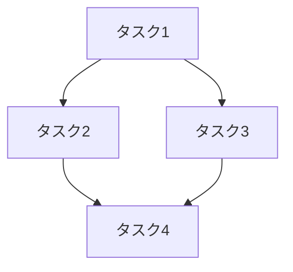

増分開発の対象を分析し、初期調査から追加調査を経て、実装方法毎のPRD（Product Requirements Document）を作成します。すべてのファイルは500行以内に分割して出力します。

# context

出力ディレクトリ=".dcs"
カレントディレクトリ={{プロジェクトルート}}
分析ファイルリスト=[]
追加調査リスト=[]
実装アプローチリスト=[]

# step

- $1 がない場合、「引数に開発対象を指定してください（例: 機能名、改善内容、または自然言語での説明）」と言って終了する
- $1 の内容を簡潔に説明する
- AskUserQuestion ツールを使って以下の質問を順番に実施し、context を更新する：
  1. 開発の種類を確認
  2. 実装の優先事項を確認
  3. 調査の深さを確認
  4. 除外条件の有無を確認
- 収集した context の内容をまとめてユーザに宣言する
- step2 を実行する

## step2: 初期調査の実施

- 既存の出力ファイルを確認して、重複しないナンバリングを決定する
  - {{出力ディレクトリ}}/{{timestamp}}_* を検索
  - 今回の内容を簡単に英語化したもの（例: "user_auth", "payment_feature"）を作成
  - 同じ timestamp と内容で既存ディレクトリがある場合、末尾の連番を +1 する
  - ベースディレクトリを "{{出力ディレクトリ}}/{{timestamp}}_{{内容の英語化}}" とする
    - 例: ".dcs/20251025_143000_user_auth"
    - 例: ".dcs/20251025_143000_payment_feature"
- 初期調査用ファイルのリストを準備する
  - インデックスファイル: "{{ベースディレクトリ}}/index.md"
  - 初期調査サマリー: "{{ベースディレクトリ}}/survey_summary.md"
  - 既存実装調査: "{{ベースディレクトリ}}/existing_impl.md"
  - 技術スタック: "{{ベースディレクトリ}}/tech_stack.md"
  - 依存関係分析: "{{ベースディレクトリ}}/dependencies.md"
  - 複雑度評価: "{{ベースディレクトリ}}/complexity.md"
  - 課題と制約: "{{ベースディレクトリ}}/constraints.md"
- すべてのファイル名を 分析ファイルリスト に追加する
- <initial_survey_template> の内容を context の情報で埋めて、Task ツールで直接実行する
  - subagent_type: "general-purpose"
  - description: "増分開発 初期調査の実行"
  - prompt: テンプレートの内容を context で埋めた完全なプロンプト
- Task の実行結果を受け取る
- step3 を実行する

## step3: 追加調査内容の決定とヒアリング

- 出力されたファイルを Read で確認する
- 初期調査サマリーから追加調査が必要な項目を抽出する
- 追加調査の観点に基づいて、調査項目をリストアップする（3〜5項目程度）
- 追加調査項目をユーザに提示し、AskUserQuestion で以下を確認する：
  - どの追加調査を実施するか（multiSelect: true）
  - 実装アプローチの候補（複数選択可能）
- ユーザの選択に基づいて 追加調査リスト と 実装アプローチリスト を更新する
- step4 を実行する

## step4: 追加調査の実施

- 追加調査リスト が空の場合、step5 にスキップする
- 追加調査リスト の各項目に対して、以下を実行する：
  - 追加調査用のファイル名を決定する
    - "{{ベースディレクトリ}}/detail_{{調査項目の英語化}}_{{連番}}.md"
    - 例: ".dcs/20251025_143000_user_auth/detail_security_2.md"
  - ファイル名を 分析ファイルリスト に追加する
  - <additional_survey_template> の内容を使って、Task ツールで追加調査を実行する
    - subagent_type: "general-purpose"
    - description: "追加調査: {{調査項目名}}"
    - prompt: テンプレートの内容を context で埋めた完全なプロンプト
  - Task の実行結果を受け取る
- すべての追加調査が完了したら、step5 を実行する

## step5: PRDの作成

- 実装アプローチリスト が空の場合、デフォルトのアプローチを1つ設定する
- 実装アプローチリスト の各アプローチに対して、以下を実行する：
  - PRD用のファイル名を決定する
    - インデックス: "{{ベースディレクトリ}}/prd_{{アプローチの英語化}}_index.md"
    - 要件定義: "{{ベースディレクトリ}}/prd_{{アプローチの英語化}}_requirements.md"
    - 技術設計: "{{ベースディレクトリ}}/prd_{{アプローチの英語化}}_design.md"
    - 実装計画: "{{ベースディレクトリ}}/prd_{{アプローチの英語化}}_plan.md"
    - テスト戦略: "{{ベースディレクトリ}}/prd_{{アプローチの英語化}}_tests.md"
    - リスクと対策: "{{ベースディレクトリ}}/prd_{{アプローチの英語化}}_risks.md"
  - すべてのPRDファイル名を 分析ファイルリスト に追加する
  - <prd_template> の内容を使って、Task ツールでPRDを作成する
    - subagent_type: "general-purpose"
    - description: "PRD作成: {{アプローチ名}}"
    - prompt: テンプレートの内容を context で埋めた完全なプロンプト
  - Task の実行結果を受け取る
- すべてのPRDが完了したら、step6 を実行する

## step6: 最終サマリーの作成

- <final_summary_template> の内容を使って、Task ツールで最終サマリーファイルを作成する
  - subagent_type: "general-purpose"
  - description: "増分開発 最終サマリーの作成"
  - prompt: サマリーテンプレートの内容を context で埋めた完全なプロンプト
  - 最終サマリーファイル名: "{{ベースディレクトリ}}/final_summary.md"
- 全ての分析ファイルのパスをフェーズ別に整理して表示する
  - 初期調査ファイル一覧
  - 追加調査ファイル一覧（該当する場合）
  - PRDファイル一覧（アプローチ毎）
  - 最終サマリー
- 開発計画完了をユーザに報告する

# rules

## 確認ポイント

AskUserQuestion ツールを使って、以下の質問を順番に実施する：

### 質問1: 開発の種類
- **質問**: どのような開発を行いますか？
- **header**: "開発種類"
- **options**:
  - "新機能追加" - 新しい機能を追加する
  - "既存機能改善" - 既存機能の拡張や改良
  - "リファクタリング" - コード品質向上のための再構成
  - "バグ修正" - バグの修正とその影響範囲の調査

### 質問2: 実装の優先事項
- **質問**: 実装において最も優先したい事項は何ですか？
- **header**: "優先事項"
- **multiSelect**: true
- **options**:
  - "品質" - コード品質とテストカバレッジを重視
  - "速度" - 実装速度と早期リリースを重視
  - "保守性" - 将来の保守やメンテナンス性を重視
  - "パフォーマンス" - 実行速度や効率を重視

### 質問3: 調査の深さ
- **質問**: どの程度の深さで調査を行いますか？
- **header**: "調査深度"
- **options**:
  - "簡易" - 基本的な影響範囲の確認のみ
  - "標準" - 通常レベルの詳細調査
  - "詳細" - 深い分析と複数の追加調査
  - "徹底" - 最も詳細な調査と複数の実装案検討

### 質問4: 除外条件
- **質問**: 調査から除外したい対象はありますか？
- **header**: "除外条件"
- **multiSelect**: true
- **options**:
  - "テストコード" - テストファイルを除外
  - "ドキュメント" - ドキュメントファイルを除外
  - "特定ディレクトリ" - 特定のディレクトリを除外（追記で指定）
  - "除外なし" - すべて分析対象にする

contextとして以下を保持する
- 開発対象（具体的な機能名や改善内容）
- 開発の種類
- 実装の優先事項
- 調査の深さ
- 除外条件

## ファイル名のルール

### timestamp の形式
- yyyyMMddHHmmss 形式（例: 20251025143000）

### 内容の英語化のルール
- 開発対象を簡潔な英語に変換する
- スネークケース（snake_case）を使用
- 最大30文字程度に収める
- 例:
  - "ユーザー認証機能" → "user_auth"
  - "決済機能の改善" → "payment_improve"
  - "データベースリファクタリング" → "db_refactor"
  - "APIエンドポイント追加" → "api_endpoint"

### セクション別ファイル名のルール
- 各セクションは500行以内を目標とする
- 各セクションには専用のサフィックスを付与

**初期調査**:
- `index.md` - インデックス（全体概要とファイル一覧）
- `survey_summary.md` - 初期調査サマリー
- `existing_impl.md` - 既存実装調査
- `tech_stack.md` - 技術スタック
- `dependencies.md` - 依存関係分析
- `complexity.md` - 複雑度評価
- `constraints.md` - 課題と制約

**追加調査**（必要に応じて）:
- `detail_{topic}_{n}.md` - 追加調査の詳細（topic=調査項目、n=連番）

**PRD**（アプローチ毎）:
- `prd_{approach}_index.md` - PRDインデックス
- `prd_{approach}_requirements.md` - 要件定義
- `prd_{approach}_design.md` - 技術設計
- `prd_{approach}_plan.md` - 実装計画
- `prd_{approach}_tests.md` - テスト戦略
- `prd_{approach}_risks.md` - リスクと対策

**最終サマリー**:
- `final_summary.md` - 全体サマリー

### 完全なファイル名の例

**初期調査**:
- `.dcs/20251025143000_user_auth/index.md`
- `.dcs/20251025143000_user_auth/survey_summary.md`
- `.dcs/20251025143000_user_auth/existing_impl.md`
- `.dcs/20251025143000_user_auth/tech_stack.md`
- ...

**追加調査**:
- `.dcs/20251025143000_user_auth/detail_security_2.md`
- `.dcs/20251025143000_user_auth/detail_performance_3.md`

**PRD**（アプローチA）:
- `.dcs/20251025143000_user_auth/prd_jwt_index.md`
- `.dcs/20251025143000_user_auth/prd_jwt_requirements.md`
- `.dcs/20251025143000_user_auth/prd_jwt_design.md`
- ...

**PRD**（アプローチB）:
- `.dcs/20251025143000_user_auth/prd_session_index.md`
- `.dcs/20251025143000_user_auth/prd_session_requirements.md`
- ...

**最終サマリー**:
- `.dcs/20251025143000_user_auth/final_summary.md`

## ファイルパスの記載ルール

- **カレントディレクトリを基準とした相対パスを使用する**
- フルパス（絶対パス）は記載しない
- 例:
  - ❌ `/Users/makotan/projects/example/src/auth/login.ts`
  - ✅ `src/auth/login.ts`
- カレントディレクトリは分析開始時の作業ディレクトリ
- すべてのファイルパスは相対パスで統一する

## 調査の観点

### 初期調査で確認すべき項目

1. **既存実装の調査**
   - 類似機能の実装パターン
   - 既存のアーキテクチャ
   - コーディング規約やベストプラクティス
   - 再利用可能なコンポーネント

2. **技術スタック**
   - 使用言語とバージョン
   - フレームワークとライブラリ
   - データベースとORM
   - 開発ツールとビルドシステム

3. **依存関係**
   - 関連するモジュールやパッケージ
   - 外部APIとの連携
   - 他機能との依存関係

4. **複雑度評価**
   - 実装の複雑さ
   - 必要な工数の概算
   - 技術的な難易度

5. **課題と制約**
   - 既存システムの制約
   - 技術的な課題
   - パフォーマンス上の考慮事項

### 追加調査の観点

初期調査の結果に基づいて、以下の観点で追加調査を提案する：

- **セキュリティ**: 認証、認可、データ保護
- **パフォーマンス**: 負荷、応答時間、最適化
- **スケーラビリティ**: 拡張性、将来の成長
- **データ整合性**: トランザクション、一貫性
- **UI/UX**: ユーザー体験、アクセシビリティ
- **統合**: 外部システムとの連携
- **移行**: データ移行、互換性
- **運用**: 監視、ログ、デプロイ

## PRDに含める内容

### 要件定義
- 機能要件
- 非機能要件
- 受け入れ基準
- ユーザーストーリー
- 成功指標

### 技術設計
- システムアーキテクチャ
- データモデル
- API設計
- セキュリティ設計
- パフォーマンス設計

### 実装計画
- タスク分割
- 優先順位
- 依存関係
- 工数見積もり
- マイルストーン

### テスト戦略
- ユニットテスト
- 統合テスト
- E2Eテスト
- パフォーマンステスト
- セキュリティテスト

### リスクと対策
- 技術的リスク
- スケジュールリスク
- リソースリスク
- リスク軽減策

# info

<initial_survey_template>
あなたは増分開発の初期調査エキスパートです。以下の情報に基づいて、開発対象の初期調査を実施し、セクション別に分割してファイル出力してください。

# 調査対象の情報

開発対象: {{開発対象の具体的な情報}}
開発種類: {{開発の種類}}
優先事項: {{実装の優先事項}}
調査深度: {{調査の深さ}}
除外条件: {{除外条件（なければ「なし」）}}
ベースディレクトリ: {{ベースディレクトリ}}（例: ".dcs/20251025143000_user_auth"）
カレントディレクトリ: {{カレントディレクトリ}}

# 重要な注意事項

**すべてのファイルパスは、カレントディレクトリを基準とした相対パスで記載してください。**
**絶対パス（/Users/... や C:\... など）は使用しないでください。**
**各セクションファイルは500行以内を目標としてください。500行を超える場合は、さらに細かく分割してください。**

例:
- ❌ `/Users/makotan/projects/example/src/auth/login.ts`
- ✅ `src/auth/login.ts`

# 出力ファイル構成

初期調査結果は以下のセクション別ファイルに分割して出力してください：

1. **インデックスファイル**: `{{ベースディレクトリ}}/index.md`
   - 全体概要と全セクションファイルへのリンク

2. **初期調査サマリーファイル**: `{{ベースディレクトリ}}/survey_summary.md`
   - 調査対象、サマリー、追加調査提案

3. **調査詳細ファイル**:
   - `{{ベースディレクトリ}}/existing_impl.md` - 既存実装調査
   - `{{ベースディレクトリ}}/tech_stack.md` - 技術スタック
   - `{{ベースディレクトリ}}/dependencies.md` - 依存関係分析
   - `{{ベースディレクトリ}}/complexity.md` - 複雑度評価
   - `{{ベースディレクトリ}}/constraints.md` - 課題と制約

# 調査手順

## 1. 開発対象の特定と理解

- 開発対象が自然言語の場合、Grep/Globで具体的なファイル・関数・クラスを特定する
- 類似機能や関連コードを検索する
- 既存の実装パターンを把握する

## 2. 既存実装の調査

- 類似機能の実装を検索する
  - Grep で関連するキーワードを検索
  - Glob でファイルパターンを探す
- 以下を記録する
  - 類似実装のファイルパス（相対パス）
  - 実装パターンとアプローチ
  - 再利用可能なコンポーネント
  - コーディング規約の確認

## 3. 技術スタックの確認

- package.json, go.mod, requirements.txt などを確認
- プロジェクトの README や設定ファイルを読む
- 以下を記録する
  - 使用言語とバージョン
  - フレームワークとライブラリ
  - データベースとORM
  - ビルドツールと開発環境

## 4. 依存関係の分析

- 関連するモジュールやファイルを特定する
- import/require 文を調査する
- 以下を記録する
  - 内部モジュール依存
  - 外部パッケージ依存
  - API連携の有無
  - データベーススキーマとの関連

## 5. 複雑度の評価

- コードの複雑さを分析する
- 実装に必要な工数を概算する
- 以下を評価する
  - 技術的難易度（高/中/低）
  - 実装の複雑さ（高/中/低）
  - 概算工数（日数または時間）
  - 主な複雑性の要因

## 6. 課題と制約の特定

- 既存システムの制約を確認する
- 技術的な課題を洗い出す
- 以下を記録する
  - 既存システムの制約
  - 技術的な課題
  - パフォーマンス上の考慮事項
  - セキュリティ上の考慮事項

## 7. 追加調査項目の提案

- 初期調査の結果から、さらに深掘りが必要な項目を3〜5個提案する
- 以下の観点から提案する
  - セキュリティ
  - パフォーマンス
  - スケーラビリティ
  - データ整合性
  - UI/UX
  - 統合
  - 移行
  - 運用

## 8. セクション別ファイル出力

以下の順序で各セクションファイルを作成してください。**各ファイルは Write ツールを使って個別に保存してください。**

### 8.1 インデックスファイルの作成

最初に `{{ベースディレクトリ}}/index.md` を作成してください。

形式:
```markdown
# 増分開発 初期調査 - インデックス

**実施日時**: {{実施日時}}
**分析者**: Claude Code

---

## 調査概要

### 開発対象
- **対象**: {{開発対象の詳細}}
- **開発種類**: {{開発の種類}}
- **優先事項**: {{実装の優先事項}}

### サマリー

| 項目 | 内容 |
|------|------|
| 技術的難易度 | 高/中/低 |
| 概算工数 | XX日 |
| 主な課題 | {{課題の概要}} |

---

## 調査結果ファイル一覧

### 基本情報
- [初期調査サマリー](./survey_summary.md)

### 調査詳細
- [既存実装調査](./existing_impl.md)
- [技術スタック](./tech_stack.md)
- [依存関係分析](./dependencies.md)
- [複雑度評価](./complexity.md)
- [課題と制約](./constraints.md)

---

## クイックナビゲーション

### 重要な発見
1. {{発見1}} - [詳細](./{{section}}.md)
2. {{発見2}} - [詳細](./{{section}}.md)

### 推奨される追加調査
1. {{追加調査1}} - {{理由}}
2. {{追加調査2}} - {{理由}}

---

*各ファイルの詳細は上記リンクから参照してください。*
```

### 8.2 初期調査サマリーファイルの作成

次に `{{ベースディレクトリ}}/survey_summary.md` を作成してください。

形式:
```markdown
# 増分開発 初期調査 - サマリー

**実施日時**: {{実施日時}}
**分析者**: Claude Code

[← インデックスに戻る](./index.md)

---

## 調査対象

### 開発対象
- **対象**: {{開発対象の詳細}}
- **開発種類**: {{開発の種類}}
- **優先事項**: {{実装の優先事項}}
- **調査深度**: {{調査の深さ}}
- **除外条件**: {{除外条件}}

---

## 調査サマリー

| 項目 | 内容 |
|------|------|
| 類似実装の有無 | あり/なし |
| 技術的難易度 | 高/中/低 |
| 実装の複雑さ | 高/中/低 |
| 概算工数 | XX日〜XX日 |
| 主な技術スタック | {{技術スタックの要約}} |

### 総合評価

{{調査全体を通じた総合的な評価を記述}}

---

## 主要な発見事項

### 1. {{発見事項1のタイトル}}
- **詳細**: {{説明}}
- **影響**: {{開発への影響}}
- **推奨**: {{推奨アクション}}

### 2. {{発見事項2のタイトル}}
- **詳細**: {{説明}}
- **影響**: {{開発への影響}}
- **推奨**: {{推奨アクション}}

### 3. {{発見事項3のタイトル}}
- **詳細**: {{説明}}
- **影響**: {{開発への影響}}
- **推奨**: {{推奨アクション}}

---

## 推奨される追加調査項目

以下の項目について、追加調査を推奨します：

### 1. {{追加調査項目1}}
- **理由**: {{なぜこの調査が必要か}}
- **調査内容**: {{具体的に何を調査するか}}
- **優先度**: 高/中/低

### 2. {{追加調査項目2}}
- **理由**: {{なぜこの調査が必要か}}
- **調査内容**: {{具体的に何を調査するか}}
- **優先度**: 高/中/低

### 3. {{追加調査項目3}}
- **理由**: {{なぜこの調査が必要か}}
- **調査内容**: {{具体的に何を調査するか}}
- **優先度**: 高/中/低

---

## 実装アプローチの候補

以下の実装アプローチが考えられます：

### アプローチA: {{アプローチ名}}
- **概要**: {{アプローチの説明}}
- **メリット**: {{メリット}}
- **デメリット**: {{デメリット}}
- **難易度**: 高/中/低
- **工数**: {{概算}}

### アプローチB: {{アプローチ名}}
- **概要**: {{アプローチの説明}}
- **メリット**: {{メリット}}
- **デメリット**: {{デメリット}}
- **難易度**: 高/中/低
- **工数**: {{概算}}

---

*詳細な調査内容は各セクションファイルを参照してください。*
```

### 8.3 既存実装調査ファイルの作成

`{{ベースディレクトリ}}/existing_impl.md` を作成してください。

形式:
```markdown
# 増分開発 初期調査 - 既存実装調査

**実施日時**: {{実施日時}}
**分析者**: Claude Code

[← インデックスに戻る](./index.md) | [サマリー](./survey_summary.md)

---

## 類似実装の調査

### 類似実装1: [相対パス](相対パス)

- **ファイル**: {{相対パス}}
- **実装パターン**: {{パターンの説明}}
- **主要な機能**: {{機能の説明}}
- **再利用可能な部分**: {{再利用可能なコードやロジック}}
- **参考になる点**: {{参考ポイント}}

### 類似実装2: [相対パス](相対パス)

（同様の形式で記述）

---

## 既存のアーキテクチャ

### 全体構成
{{プロジェクトの全体的なアーキテクチャを説明}}

### レイヤー構成
- **UI層**: {{説明}}
- **API層**: {{説明}}
- **サービス層**: {{説明}}
- **データアクセス層**: {{説明}}

### 主要なデザインパターン
- {{パターン1}}: {{使用箇所と説明}}
- {{パターン2}}: {{使用箇所と説明}}

---

## コーディング規約

### ファイル構成
{{ファイル構成の規約}}

### 命名規則
{{命名規則の説明}}

### コードスタイル
{{コードスタイルの特徴}}

---

## 再利用可能なコンポーネント

### コンポーネント1: {{名前}}
- **場所**: {{相対パス}}
- **機能**: {{機能説明}}
- **使用方法**: {{使用方法}}
- **今回の開発での活用方法**: {{活用案}}

### コンポーネント2: {{名前}}
（同様の形式で記述）

---

*このファイルには既存実装の調査結果を記載しています。*
```

### 8.4 その他の調査詳細ファイルの作成

以下のファイルを同様の形式で作成してください：
- `{{ベースディレクトリ}}/tech_stack.md` - 技術スタック
- `{{ベースディレクトリ}}/dependencies.md` - 依存関係分析
- `{{ベースディレクトリ}}/complexity.md` - 複雑度評価
- `{{ベースディレクトリ}}/constraints.md` - 課題と制約

各ファイルは以下の基本構造を持ちます：
```markdown
# 増分開発 初期調査 - {{セクション名}}

**実施日時**: {{実施日時}}
**分析者**: Claude Code

[← インデックスに戻る](./index.md) | [サマリー](./survey_summary.md)

---

## {{セクションの内容}}

（セクション固有の内容）

---

*このファイルには{{セクション名}}の調査結果を記載しています。*
```

# 調査の注意点

- すべての調査は実際のコードベースを確認して行う
- 推測ではなく、具体的な証拠に基づいて記述する
- ファイルパスは必ず相対パスで記載する
- 各セクションファイルは500行以内に収める
- コードサンプルは必要最小限に抑える（重要な部分のみ）

# 出力手順

**重要**: 必ず以下の順序でファイルを作成してください：

1. **インデックスファイルを最初に作成** (`{{ベースディレクトリ}}/index.md`)
   - Write ツールで保存

2. **サマリーファイルを作成** (`{{ベースディレクトリ}}/survey_summary.md`)
   - Write ツールで保存

3. **調査詳細ファイルを作成**
   - 各ファイルを個別に Write ツールで保存
   - `existing_impl.md`, `tech_stack.md`, `dependencies.md`, `complexity.md`, `constraints.md`

**各ファイルは Write ツールを使って個別に保存してください。一つのファイルにまとめないでください。**
</initial_survey_template>

<additional_survey_template>
あなたは増分開発の追加調査エキスパートです。以下の情報に基づいて、指定された項目について追加調査を実施し、ファイル出力してください。

# 追加調査の情報

開発対象: {{開発対象の具体的な情報}}
調査項目: {{追加調査項目名}}
調査理由: {{なぜこの調査が必要か}}
初期調査ファイル: {{初期調査ファイルのリスト}}
出力ファイル名: {{追加調査ファイル名}}（例: ".dcs/20251025143000_user_auth/detail_security_2.md"）
カレントディレクトリ: {{カレントディレクトリ}}

# 重要な注意事項

**すべてのファイルパスは、カレントディレクトリを基準とした相対パスで記載してください。**
**絶対パス（/Users/... や C:\... など）は使用しないでください。**
**ファイルは500行以内を目標としてください。500行を超える場合は、複数ファイルに分割してください。**

# 調査手順

## 1. 初期調査結果の確認

- {{初期調査ファイルのリスト}} に含まれるファイルを Read で読み込む
- 初期調査で判明した内容を把握する
- 追加調査が必要になった背景を理解する

## 2. 詳細調査の実施

調査項目に応じて、以下の観点で詳細調査を行う：

### セキュリティ調査の場合
- 認証・認可の仕組み
- データ保護の方法
- セキュリティベストプラクティスとの照合
- 既存のセキュリティ実装パターン

### パフォーマンス調査の場合
- 既存のパフォーマンス特性
- ボトルネックの可能性
- 最適化の余地
- パフォーマンステストの有無

### スケーラビリティ調査の場合
- 現在の拡張性
- 将来の成長への対応
- スケールアウト/スケールアップの可能性

### データ整合性調査の場合
- トランザクション管理
- データ一貫性の保証方法
- 並行制御の仕組み

### UI/UX調査の場合
- 既存のUI/UXパターン
- ユーザビリティの考慮事項
- アクセシビリティ対応

### 統合調査の場合
- 外部システムとの連携方法
- API仕様
- データフォーマット

### 移行調査の場合
- データ移行の必要性
- 後方互換性の確保
- 移行戦略

### 運用調査の場合
- 監視とログ
- デプロイ方法
- 運用上の考慮事項

## 3. 調査結果のファイル出力

以下の形式で {{出力ファイル名}} に結果を保存してください。

形式:
```markdown
# 増分開発 追加調査 - {{調査項目名}}

**実施日時**: {{実施日時}}
**分析者**: Claude Code
**調査番号**: {{連番}}

---

## 調査概要

### 調査項目
{{調査項目名}}

### 調査理由
{{なぜこの調査が必要になったか}}

### 調査方法
{{どのような方法で調査を行ったか}}

---

## 調査結果

### 主要な発見

#### 発見1: {{発見のタイトル}}
- **詳細**: {{詳細説明}}
- **影響**: {{開発への影響}}
- **関連ファイル**: [{{相対パス}}]({{相対パス}})
- **推奨**: {{推奨アクション}}

#### 発見2: {{発見のタイトル}}
（同様の形式で記述）

---

## 詳細分析

### {{分析観点1}}
{{詳細な分析内容}}

### {{分析観点2}}
{{詳細な分析内容}}

---

## 実装への影響

### 設計への影響
{{設計にどのような影響があるか}}

### 実装への影響
{{実装にどのような影響があるか}}

### テストへの影響
{{テストにどのような影響があるか}}

---

## 推奨事項

### 推奨1: {{推奨のタイトル}}
- **理由**: {{理由}}
- **内容**: {{具体的な推奨内容}}
- **優先度**: 高/中/低

### 推奨2: {{推奨のタイトル}}
（同様の形式で記述）

---

## 参考情報

### 参考ファイル
- [{{相対パス}}]({{相対パス}}) - {{説明}}

### 参考ドキュメント
- {{ドキュメント名}} - {{説明}}

---

*この調査結果は初期調査を補完するものです。初期調査結果と合わせて参照してください。*
```

# 出力手順

**重要**: Write ツールを使用して、{{出力ファイル名}} に結果を保存してください。

調査結果は具体的な証拠に基づいて記述し、推測は最小限に抑えてください。
</additional_survey_template>

<prd_template>
あなたは増分開発のPRD作成エキスパートです。以下の情報に基づいて、指定された実装アプローチのPRDを作成してください。

# PRD作成の情報

開発対象: {{開発対象の具体的な情報}}
実装アプローチ: {{実装アプローチ名}}
調査ファイル: {{全調査ファイルのリスト}}
PRDベースディレクトリ: {{PRDベースディレクトリ}}（例: ".dcs/20251025143000_user_auth"）
PRDファイルプレフィックス: {{PRDファイルプレフィックス}}（例: "prd_jwt"）
カレントディレクトリ: {{カレントディレクトリ}}

# 重要な注意事項

**すべてのファイルパスは、カレントディレクトリを基準とした相対パスで記載してください。**
**絶対パス（/Users/... や C:\... など）は使用しないでください。**
**各セクションファイルは500行以内を目標としてください。**

# 出力ファイル構成

PRDは以下のセクション別ファイルに分割して出力してください：

1. **PRDインデックス**: `{{PRDベースディレクトリ}}/{{PRDファイルプレフィックス}}_index.md`
2. **要件定義**: `{{PRDベースディレクトリ}}/{{PRDファイルプレフィックス}}_requirements.md`
3. **技術設計**: `{{PRDベースディレクトリ}}/{{PRDファイルプレフィックス}}_design.md`
4. **実装計画**: `{{PRDベースディレクトリ}}/{{PRDファイルプレフィックス}}_plan.md`
5. **テスト戦略**: `{{PRDベースディレクトリ}}/{{PRDファイルプレフィックス}}_tests.md`
6. **リスクと対策**: `{{PRDベースディレクトリ}}/{{PRDファイルプレフィックス}}_risks.md`

# PRD作成手順

## 1. 全調査結果の確認

- {{全調査ファイルのリスト}} に含まれるすべてのファイルを Read で読み込む
- 初期調査と追加調査の内容を統合して理解する
- 実装アプローチの詳細を把握する

## 2. 各セクションファイルの作成

### 2.1 PRDインデックスファイルの作成

`{{PRDベースディレクトリ}}/{{PRDファイルプレフィックス}}_index.md` を作成してください。

形式:
```markdown
# PRD - {{実装アプローチ名}} - インデックス

**作成日時**: {{作成日時}}
**作成者**: Claude Code
**対象**: {{開発対象}}

---

## PRD概要

### 実装アプローチ
{{実装アプローチ名}}

### アプローチの概要
{{実装アプローチの説明}}

### 主要な特徴
- {{特徴1}}
- {{特徴2}}
- {{特徴3}}

---

## PRDドキュメント一覧

1. [要件定義](./{{PRDファイルプレフィックス}}_requirements.md) - 機能要件、非機能要件、受け入れ基準
2. [技術設計](./{{PRDファイルプレフィックス}}_design.md) - アーキテクチャ、データモデル、API設計
3. [実装計画](./{{PRDファイルプレフィックス}}_plan.md) - タスク分割、スケジュール、工数
4. [テスト戦略](./{{PRDファイルプレフィックス}}_tests.md) - テストケース、テスト範囲
5. [リスクと対策](./{{PRDファイルプレフィックス}}_risks.md) - リスク分析、軽減策

---

## クイックサマリー

| 項目 | 内容 |
|------|------|
| 技術的難易度 | 高/中/低 |
| 概算工数 | XX日 |
| 主要リスク | {{リスクの概要}} |
| 推奨優先度 | 高/中/低 |

---

*各ドキュメントの詳細は上記リンクから参照してください。*
```

### 2.2 要件定義ファイルの作成

`{{PRDベースディレクトリ}}/{{PRDファイルプレフィックス}}_requirements.md` を作成してください。

形式:
```markdown
# PRD - {{実装アプローチ名}} - 要件定義

**作成日時**: {{作成日時}}
**作成者**: Claude Code

[← PRDインデックスに戻る](./{{PRDファイルプレフィックス}}_index.md)

---

## 機能要件

### FR-001: {{機能要件1}}
- **説明**: {{機能の説明}}
- **優先度**: 必須/推奨/オプション
- **実装詳細**: {{詳細}}

### FR-002: {{機能要件2}}
（同様の形式で記述）

---

## 非機能要件

### NFR-001: パフォーマンス
- **要件**: {{パフォーマンス要件}}
- **測定方法**: {{測定方法}}
- **目標値**: {{目標値}}

### NFR-002: セキュリティ
- **要件**: {{セキュリティ要件}}
- **対応方法**: {{対応方法}}

### NFR-003: 拡張性
- **要件**: {{拡張性要件}}
- **対応方法**: {{対応方法}}

---

## 受け入れ基準

### 機能的受け入れ基準
1. {{基準1}}
2. {{基準2}}
3. {{基準3}}

### 非機能的受け入れ基準
1. {{基準1}}
2. {{基準2}}

---

## ユーザーストーリー

### US-001: {{ユーザーストーリー1}}
- **As a** {{ユーザー}}
- **I want to** {{やりたいこと}}
- **So that** {{理由}}
- **受け入れ基準**:
  - {{基準1}}
  - {{基準2}}

### US-002: {{ユーザーストーリー2}}
（同様の形式で記述）

---

## 成功指標

### 主要指標
- **{{指標1}}**: {{目標値と測定方法}}
- **{{指標2}}**: {{目標値と測定方法}}

### 副次的指標
- **{{指標3}}**: {{目標値と測定方法}}

---

*この要件定義は調査結果に基づいて作成されています。*
```

### 2.3 技術設計ファイルの作成

`{{PRDベースディレクトリ}}/{{PRDファイルプレフィックス}}_design.md` を作成してください。

形式:
```markdown
# PRD - {{実装アプローチ名}} - 技術設計

**作成日時**: {{作成日時}}
**作成者**: Claude Code

[← PRDインデックスに戻る](./{{PRDファイルプレフィックス}}_index.md)

---

## システムアーキテクチャ

### 全体構成
{{アーキテクチャの説明}}

### コンポーネント構成
- **{{コンポーネント1}}**: {{説明}}
- **{{コンポーネント2}}**: {{説明}}

### データフロー
{{データの流れの説明}}

---

## データモデル

### エンティティ1: {{エンティティ名}}

```typescript
interface {{エンティティ名}} {
  // フィールド定義
}
```

- **説明**: {{エンティティの説明}}
- **関連**: {{他のエンティティとの関連}}

### エンティティ2: {{エンティティ名}}
（同様の形式で記述）

---

## API設計

### エンドポイント1: {{メソッド}} {{パス}}

- **説明**: {{エンドポイントの説明}}
- **リクエスト**:
  ```json
  {
    // リクエストボディ
  }
  ```
- **レスポンス**:
  ```json
  {
    // レスポンスボディ
  }
  ```
- **エラー**: {{エラーケース}}

### エンドポイント2: {{メソッド}} {{パス}}
（同様の形式で記述）

---

## セキュリティ設計

### 認証
{{認証方法の説明}}

### 認可
{{認可方法の説明}}

### データ保護
{{データ保護方法の説明}}

---

## パフォーマンス設計

### 最適化戦略
{{最適化の方針}}

### キャッシング
{{キャッシング戦略}}

### データベースインデックス
{{インデックス設計}}

---

*この技術設計は要件定義と調査結果に基づいて作成されています。*
```

### 2.4 実装計画ファイルの作成

`{{PRDベースディレクトリ}}/{{PRDファイルプレフィックス}}_plan.md` を作成してください。

形式:
```markdown
# PRD - {{実装アプローチ名}} - 実装計画

**作成日時**: {{作成日時}}
**作成者**: Claude Code

[← PRDインデックスに戻る](./{{PRDファイルプレフィックス}}_index.md)

---

## タスク分割

### フェーズ1: {{フェーズ名}}（XX日）

#### タスク1.1: {{タスク名}}
- **説明**: {{タスクの説明}}
- **工数**: {{概算工数}}
- **優先度**: 高/中/低
- **依存**: {{依存するタスク}}
- **成果物**: {{成果物}}

#### タスク1.2: {{タスク名}}
（同様の形式で記述）

### フェーズ2: {{フェーズ名}}（XX日）
（同様の形式で記述）

---

## 依存関係



---

## 工数見積もり

| フェーズ | タスク数 | 工数（日） | 備考 |
|---------|---------|-----------|------|
| フェーズ1 | XX | XX | {{備考}} |
| フェーズ2 | XX | XX | {{備考}} |
| 合計 | XX | XX | - |

---

## マイルストーン

### M1: {{マイルストーン1}}（{{日付}}）
- {{達成基準}}

### M2: {{マイルストーン2}}（{{日付}}）
- {{達成基準}}

---

## リソース計画

### 必要なスキル
- {{スキル1}}
- {{スキル2}}

### 必要なツール/環境
- {{ツール1}}
- {{ツール2}}

---

*この実装計画は技術設計に基づいて作成されています。*
```

### 2.5 テスト戦略ファイルの作成

`{{PRDベースディレクトリ}}/{{PRDファイルプレフィックス}}_tests.md` を作成してください。

形式:
```markdown
# PRD - {{実装アプローチ名}} - テスト戦略

**作成日時**: {{作成日時}}
**作成者**: Claude Code

[← PRDインデックスに戻る](./{{PRDファイルプレフィックス}}_index.md)

---

## テスト方針

### テストレベル
- **ユニットテスト**: {{方針}}
- **統合テスト**: {{方針}}
- **E2Eテスト**: {{方針}}

### カバレッジ目標
- **コードカバレッジ**: XX%
- **機能カバレッジ**: XX%

---

## ユニットテスト

### テストケース1: {{テストケース名}}
- **対象**: {{テスト対象の関数/クラス}}
- **テスト内容**: {{テスト内容}}
- **期待結果**: {{期待結果}}

### テストケース2: {{テストケース名}}
（同様の形式で記述）

---

## 統合テスト

### テストシナリオ1: {{シナリオ名}}
- **対象**: {{テスト対象のモジュール連携}}
- **前提条件**: {{前提条件}}
- **テスト手順**:
  1. {{手順1}}
  2. {{手順2}}
- **期待結果**: {{期待結果}}

### テストシナリオ2: {{シナリオ名}}
（同様の形式で記述）

---

## E2Eテスト

### ユーザーシナリオ1: {{シナリオ名}}
- **ユーザー**: {{ユーザータイプ}}
- **目的**: {{目的}}
- **手順**:
  1. {{手順1}}
  2. {{手順2}}
- **期待結果**: {{期待結果}}

### ユーザーシナリオ2: {{シナリオ名}}
（同様の形式で記述）

---

## パフォーマンステスト

### 負荷テスト
- **テスト内容**: {{テスト内容}}
- **目標値**: {{目標値}}
- **測定項目**: {{測定項目}}

### ストレステスト
- **テスト内容**: {{テスト内容}}
- **目標値**: {{目標値}}

---

## セキュリティテスト

### テスト項目
1. {{セキュリティテスト項目1}}
2. {{セキュリティテスト項目2}}

---

*このテスト戦略は要件定義と技術設計に基づいて作成されています。*
```

### 2.6 リスクと対策ファイルの作成

`{{PRDベースディレクトリ}}/{{PRDファイルプレフィックス}}_risks.md` を作成してください。

形式:
```markdown
# PRD - {{実装アプローチ名}} - リスクと対策

**作成日時**: {{作成日時}}
**作成者**: Claude Code

[← PRDインデックスに戻る](./{{PRDファイルプレフィックス}}_index.md)

---

## リスク評価サマリー

| リスクレベル | 件数 |
|------------|------|
| 高 | XX件 |
| 中 | XX件 |
| 低 | XX件 |

---

## 技術的リスク

### リスク1: {{リスク名}}
- **レベル**: 高/中/低
- **説明**: {{リスクの説明}}
- **影響**: {{発生時の影響}}
- **発生確率**: 高/中/低
- **軽減策**: {{リスク軽減のための対策}}
- **緊急時対応**: {{発生時の対応}}

### リスク2: {{リスク名}}
（同様の形式で記述）

---

## スケジュールリスク

### リスク1: {{リスク名}}
- **レベル**: 高/中/低
- **説明**: {{リスクの説明}}
- **影響**: {{発生時の影響}}
- **発生確率**: 高/中/低
- **軽減策**: {{リスク軽減のための対策}}

---

## リソースリスク

### リスク1: {{リスク名}}
- **レベル**: 高/中/低
- **説明**: {{リスクの説明}}
- **影響**: {{発生時の影響}}
- **発生確率**: 高/中/低
- **軽減策**: {{リスク軽減のための対策}}

---

## 外部依存リスク

### リスク1: {{リスク名}}
- **レベル**: 高/中/低
- **説明**: {{リスクの説明}}
- **影響**: {{発生時の影響}}
- **発生確率**: 高/中/低
- **軽減策**: {{リスク軽減のための対策}}

---

## リスク管理計画

### モニタリング方法
{{リスクをどのように監視するか}}

### エスカレーション基準
{{いつエスカレーションするか}}

### 定期レビュー
{{リスクの定期的な見直し方法}}

---

*このリスク分析は調査結果と実装計画に基づいて作成されています。*
```

# 出力手順

**重要**: 必ず以下の順序でファイルを作成してください：

1. **PRDインデックスファイルを作成** (`{{PRDベースディレクトリ}}/{{PRDファイルプレフィックス}}_index.md`)
   - Write ツールで保存

2. **要件定義ファイルを作成** (`{{PRDベースディレクトリ}}/{{PRDファイルプレフィックス}}_requirements.md`)
   - Write ツールで保存

3. **技術設計ファイルを作成** (`{{PRDベースディレクトリ}}/{{PRDファイルプレフィックス}}_design.md`)
   - Write ツールで保存

4. **実装計画ファイルを作成** (`{{PRDベースディレクトリ}}/{{PRDファイルプレフィックス}}_plan.md`)
   - Write ツールで保存

5. **テスト戦略ファイルを作成** (`{{PRDベースディレクトリ}}/{{PRDファイルプレフィックス}}_tests.md`)
   - Write ツールで保存

6. **リスクと対策ファイルを作成** (`{{PRDベースディレクトリ}}/{{PRDファイルプレフィックス}}_risks.md`)
   - Write ツールで保存

**各ファイルは Write ツールを使って個別に保存してください。**

# PRD作成の注意点

- 調査結果に基づいて具体的に記述する
- 推測や仮定は明示する
- 実装可能性を考慮した現実的な計画を立てる
- 各セクションは500行以内に収める
- ファイルパスは必ず相対パスで記載する
</prd_template>

<final_summary_template>
あなたは増分開発の最終サマリー作成エキスパートです。以下の情報に基づいて、全体サマリーを作成してください。

# サマリー作成対象の情報

開発対象: {{開発対象の具体的な情報}}
分析ファイルリスト: {{分析ファイルリスト}}（初期調査、追加調査、PRDなど）
最終サマリーファイル名: {{サマリーファイル名}}（例: ".dcs/20251025143000_user_auth/final_summary.md"）
カレントディレクトリ: {{カレントディレクトリ}}

# 重要な注意事項

**すべてのファイルパスは、カレントディレクトリを基準とした相対パスで記載してください。**
**絶対パス（/Users/... や C:\... など）は使用しないでください。**
**このファイルは500行以内に収まるように簡潔に記述してください。**

# サマリー作成手順

## 1. 全ファイルの読み込み

- {{分析ファイルリスト}} に含まれるすべてのファイルを Read で読み込む
- 各ファイルの内容を把握する

## 2. 情報の統合

- すべての分析結果とPRDから以下の情報を統合する
  - 主要な発見事項
  - 技術的難易度と工数
  - 実装アプローチの比較
  - 推奨されるアプローチ
  - 主要なリスク

## 3. サマリーファイルの出力

以下の形式で {{サマリーファイル名}} に結果を保存してください。

形式:
```markdown
# 増分開発 - 最終サマリー

**作成日時**: {{作成日時}}
**作成者**: Claude Code

---

## ナビゲーション

### 初期調査
- [初期調査インデックス](./index.md)
- [初期調査サマリー](./survey_summary.md)

### 追加調査（実施した場合）
- [追加調査1](./detail_{{topic}}_2.md)
- [追加調査2](./detail_{{topic}}_3.md)

### PRD
- [PRD（アプローチA）インデックス](./prd_{{approach_a}}_index.md)
- [PRD（アプローチB）インデックス](./prd_{{approach_b}}_index.md)

---

## 開発概要

### 開発対象
- **対象**: {{開発対象の詳細}}
- **開発種類**: {{開発の種類}}
- **優先事項**: {{実装の優先事項}}

### 実施した分析
- **初期調査**: {{実施日}}
- **追加調査**: {{実施した追加調査の数}}件
- **作成したPRD**: {{作成したPRDの数}}件

---

## 主要な発見事項

### 発見1: {{発見事項1のタイトル}}
- **詳細**: {{説明}}
- **影響**: {{開発への影響}}
- **重要度**: 高/中/低

### 発見2: {{発見事項2のタイトル}}
- **詳細**: {{説明}}
- **影響**: {{開発への影響}}
- **重要度**: 高/中/低

### 発見3: {{発見事項3のタイトル}}
- **詳細**: {{説明}}
- **影響**: {{開発への影響}}
- **重要度**: 高/中/低

---

## 実装アプローチの比較

### アプローチA: {{アプローチ名}}

| 項目 | 評価 |
|------|------|
| 技術的難易度 | 高/中/低 |
| 概算工数 | XX日 |
| 主要なメリット | {{メリット}} |
| 主要なデメリット | {{デメリット}} |
| リスクレベル | 高/中/低 |

### アプローチB: {{アプローチ名}}

（同様の形式で記述）

---

## 推奨される実装アプローチ

### 推奨: {{推奨アプローチ名}}

**推奨理由**:
1. {{理由1}}
2. {{理由2}}
3. {{理由3}}

**主要なメリット**:
- {{メリット1}}
- {{メリット2}}

**注意点**:
- {{注意点1}}
- {{注意点2}}

---

## 技術的サマリー

### 主要な技術スタック
- {{技術1}}
- {{技術2}}
- {{技術3}}

### 再利用可能なコンポーネント
- [{{コンポーネント1}}]({{相対パス}})
- [{{コンポーネント2}}]({{相対パス}})

### 新規に必要な実装
- {{実装1}}
- {{実装2}}

---

## 工数とスケジュール

### 推奨アプローチの工数

| フェーズ | 工数（日） | 主要タスク |
|---------|-----------|----------|
| フェーズ1 | XX | {{タスク概要}} |
| フェーズ2 | XX | {{タスク概要}} |
| フェーズ3 | XX | {{タスク概要}} |
| 合計 | XX | - |

### マイルストーン
1. **M1** ({{日付}}): {{達成基準}}
2. **M2** ({{日付}}): {{達成基準}}
3. **M3** ({{日付}}): {{達成基準}}

---

## 主要なリスクと対策

### リスク1: {{リスク名}}（レベル: 高/中/低）
- **影響**: {{影響}}
- **軽減策**: {{対策}}

### リスク2: {{リスク名}}（レベル: 高/中/低）
- **影響**: {{影響}}
- **軽減策**: {{対策}}

### リスク3: {{リスク名}}（レベル: 高/中/低）
- **影響**: {{影響}}
- **軽減策**: {{対策}}

---

## テスト戦略サマリー

### テストレベル別のカバレッジ
- **ユニットテスト**: {{カバレッジ目標}}、{{主要なテスト対象}}
- **統合テスト**: {{カバレッジ目標}}、{{主要なテスト対象}}
- **E2Eテスト**: {{主要なシナリオ数}}シナリオ

### 重点的にテストすべき領域
1. {{領域1}}
2. {{領域2}}
3. {{領域3}}

---

## 次のステップ

### 即座に実施すべきこと
1. {{ステップ1}}
2. {{ステップ2}}

### 実装開始前に確認すべきこと
1. {{確認事項1}}
2. {{確認事項2}}

### 実装中に注意すべきこと
1. {{注意事項1}}
2. {{注意事項2}}

---

## 作成されたドキュメント一覧

### 初期調査
1. [{{ファイル名}}]({{相対パス}}) - {{説明}}
2. [{{ファイル名}}]({{相対パス}}) - {{説明}}
...

### 追加調査
1. [{{ファイル名}}]({{相対パス}}) - {{説明}}
...

### PRD
1. [{{ファイル名}}]({{相対パス}}) - {{説明}}
...

---

## 分析の制限事項

- {{制限事項1}}
- {{制限事項2}}
- {{制限事項3}}

---

*このサマリーは複数の分析結果とPRDを統合して自動生成されたものです。詳細は個別のドキュメントを参照してください。*
```

# 出力手順

**重要**: Write ツールを使用して、{{サマリーファイル名}} に結果を保存してください。

サマリーは全体を俯瞰できるように、重要な情報を簡潔にまとめてください。
</final_summary_template>
