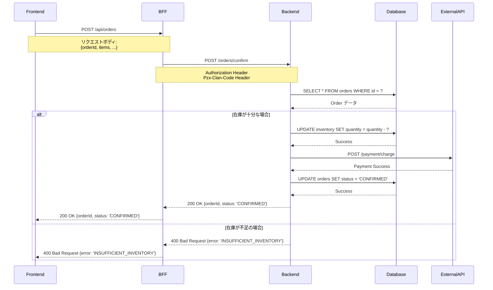

指定された機能のシーケンス図をmermaid形式で作成します。調査結果を一時ファイルに保存し、Task で参照することでコンテキスト削減を実現します。

# context

出力ディレクトリ=".dcs"
カレントディレクトリ={{プロジェクトルート}}
分析ファイルリスト=[]
機能特定済み=false
対象機能=[]
ベースディレクトリ=""
tmpディレクトリ=""

# step

- $1 がない場合、「引数に機能名または対象を指定してください（例: 注文確定処理、OrderController.confirmOrder、src/api/order など）」と言って終了する
- $1 の内容を簡潔に説明する
- step2 を実行する

## step2

- $1 が具体的な機能を指していない場合（自然言語の一般的な記述、ディレクトリパスなど）:
  - Grep/Glob を使って、$1 に関連する機能を調査する
  - 調査結果から具体的な機能候補をリストアップする
  - AskUserQuestion ツールを使って、ユーザに対象機能を選択してもらう
    - **質問**: どの機能のシーケンス図を作成しますか?
    - **header**: "対象機能の選択"
    - **multiSelect**: true
    - **options**: {{調査結果から抽出した機能リスト}}（最大10件程度）
  - 選択された機能を 対象機能 に設定し、機能特定済み=true とする
- $1 が具体的な機能を指している場合（関数名、クラス名、特定のエンドポイントなど）:
  - その機能を 対象機能 に設定し、機能特定済み=true とする
- 対象機能をユーザに宣言し、確認を得る
- AskUserQuestion ツールを使って以下の質問を順番に実施し、context を更新する：
  1. 図に含めるシナリオを確認
  2. 詳細レベルを確認
  3. 除外条件の有無を確認
- 収集した context の内容をまとめてユーザに宣言する
- step2.5 を実行する

## step2.5 (初期調査と一時ファイル作成)

- 既存の出力ファイルを確認して、重複しないナンバリングを決定する
  - {{出力ディレクトリ}}/{{timestamp}}_* を検索
  - 今回の内容を簡単に英語化したもの（例: "order_confirmation", "cart_update"）を作成
  - 同じ timestamp と内容で既存ディレクトリがある場合、末尾の連番を +1 する
  - ベースディレクトリを "{{出力ディレクトリ}}/{{timestamp}}_{{内容の英語化}}" とする
    - 例: ".dcs/20251027_123456_order_confirmation"
  - tmpディレクトリを "{{ベースディレクトリ}}/tmp" とする
- tmpディレクトリを作成する（Bash で mkdir -p）
- 対象機能に関する初期調査を Task ツールで実施し、以下の一時ファイルに結果を保存する：

### 調査ファイル構造
1. **コンポーネント分析**: `{{tmpディレクトリ}}/component_analysis.md`
   - 関連するコンポーネント（Frontend, BFF, Backend, Database, External API）の情報
   - 各コンポーネントの役割、技術スタック、主要ファイルパス（相対パス）

2. **処理フロー分析**: `{{tmpディレクトリ}}/flow_analysis.md`
   - エントリーポイント情報（ファイルパス、関数名、行番号）
   - 主要な処理ステップと呼び出し順序
   - 処理の分岐条件
   - データベースアクセスや外部API呼び出しの概要

3. **エラーハンドリング分析**: `{{tmpディレクトリ}}/error_handling.md`
   - バリデーションエラーのパターン
   - ビジネスロジックエラーのパターン
   - システムエラー、外部API障害のハンドリング
   - 認証/認可エラーのハンドリング

4. **重要ファイル抜粋**: `{{tmpディレクトリ}}/file_contents/`
   - 各重要ファイルの関連部分を抜粋して保存
   - ファイル名: `controller.md`, `service.md`, `repository.md` など
   - 各ファイルには以下を含める:
     - 元のファイルパス（相対パス）
     - 関連する関数/メソッドの抜粋（最大200行程度）
     - 重要なコメントやアノテーション

### 調査実施手順
1. Grep/Glob で対象機能に関連するファイルを特定
2. Read で主要ファイルの内容を確認（必要な部分のみ）
3. コンポーネント分析結果を `component_analysis.md` に Write
4. 処理フロー分析結果を `flow_analysis.md` に Write
5. エラーハンドリング分析結果を `error_handling.md` に Write
6. 重要ファイルの抜粋を `file_contents/*.md` に Write（各ファイル個別に）
7. 作成した調査ファイルのパスをユーザに報告

- step3 を実行する

## step3

- 分析結果ファイルのリストを準備する
  - インデックスファイル: "{{ベースディレクトリ}}/index.md"
  - サマリーファイル: "{{ベースディレクトリ}}/summary.md"
  - シーケンス図ファイル: "{{ベースディレクトリ}}/sequence_success.md" (成功パターン)
  - シーケンス図ファイル: "{{ベースディレクトリ}}/sequence_error.md" (エラーパターン)
  - シーケンス図ファイル: "{{ベースディレクトリ}}/sequence_exception.md" (例外パターン)
  - 分析詳細ファイル: "{{ベースディレクトリ}}/details.md"
- すべてのファイル名を 分析ファイルリスト に追加する
- <sequence_diagram_template> の内容を context の情報で埋めて、Task ツールで実行する
  - subagent_type: "general-purpose"
  - description: "シーケンス図の作成"
  - prompt: テンプレートの内容を context で埋めた完全なプロンプト
    - **重要**: 調査結果ファイルのパスを渡し、Task内でReadして使用する
- Task の実行結果を受け取る
- step4 を実行する

## step4

- 出力されたファイルを Read で確認する
- 深掘り内容のルール に基づいて、追加調査が必要かを判断する
- 追加調査が必要な場合：
  - 追加調査の内容をリストとしてユーザに提示する
  - ユーザの承認を得る
  - 追加調査項目が複数ある場合、各項目に対して個別に処理する:
    1. 追加調査用の一時ファイルを作成（`{{tmpディレクトリ}}/additional_N_*.md`）
    2. Task ツールで追加調査を実行（調査結果ファイルのパスを渡す）
    3. 各項目ごとに新しい連番で追加ファイルとして保存する（例: "2_sequence_success.md", "3_sequence_error.md"）
    4. 各ファイル名を 分析ファイルリスト に追加する
  - 再度 step4 を実行する（追加調査が不要になるまで繰り返す、最大5回）
- 追加調査が不要な場合：
  - step5 を実行する

## step5

- <summary_template> の内容を使って、Task ツールで最終サマリーファイルを作成する
  - subagent_type: "general-purpose"
  - description: "シーケンス図作成 最終サマリーの作成"
  - prompt: サマリーテンプレートの内容を context で埋めた完全なプロンプト
    - **重要**: 分析ファイルリストを渡し、Task内でReadして使用する
  - 最終サマリーファイル名: "{{ベースディレクトリ}}/final_summary.md"
- 全ての分析ファイルのパスを分析回数別に整理して表示する
  - 初回分析ファイル一覧（インデックス、サマリー、シーケンス図など）
  - 追加調査ファイル一覧（該当する場合）
  - 最終サマリー
- 一時ファイル（tmpディレクトリ）について説明する
  - 調査結果は `{{tmpディレクトリ}}` に保存されている
  - 必要に応じて参照可能
- 分析完了をユーザに報告する

# rules

## 確認ポイント

AskUserQuestion ツールを使って、以下の質問を順番に実施する：

### 質問1: 図に含めるシナリオ
- **質問**: どのシナリオのシーケンス図を作成しますか？
- **header**: "シナリオ選択"
- **multiSelect**: true
- **options**:
  - "成功パターン" - 正常な処理フロー
  - "バリデーションエラー" - 入力値検証エラーのパターン
  - "ビジネスロジックエラー" - ビジネスルール違反のパターン
  - "例外パターン" - システムエラー、外部API障害など
  - "認証/認可エラー" - 認証・認可失敗のパターン
  - "すべて" - すべてのパターンを含める

### 質問2: 詳細レベル
- **質問**: シーケンス図の詳細レベルはどの程度にしますか？
- **header**: "詳細レベル"
- **options**:
  - "概要レベル" - 主要なコンポーネント間の処理フローのみ
  - "標準レベル" - コンポーネント間の主要な処理とデータフロー
  - "詳細レベル" - 内部処理やメソッド呼び出し、データ変換も含める

### 質問3: 除外条件
- **質問**: シーケンス図から除外したい対象はありますか？
- **header**: "除外条件"
- **multiSelect**: true
- **options**:
  - "ログ出力処理" - ログ出力の記述を除外
  - "バリデーション詳細" - バリデーションの詳細を簡略化
  - "データ変換処理" - データ変換の詳細を簡略化
  - "キャッシュ処理" - キャッシュアクセスを除外
  - "除外なし" - すべて含める

contextとして以下を保持する
- 対象機能（具体的な機能名、エンドポイント、関数名など）
- 図に含めるシナリオ
- 詳細レベル
- 除外条件
- ベースディレクトリ
- tmpディレクトリ

## ファイル名のルール

### timestamp の形式
- yyyyMMddHHmmss 形式（例: 20251027123456）

### 内容の英語化のルール
- 対象機能を簡潔な英語に変換する
- スネークケース（snake_case）を使用
- 最大30文字程度に収める
- 例:
  - "注文確定処理" → "order_confirmation"
  - "カート更新" → "cart_update"
  - "OrderController.confirmOrder" → "order_confirm"
  - "商品在庫確認" → "inventory_check"

### シーケンス図ファイル名のルール
- シーケンス図はシナリオごとに個別ファイルとして配置
- シナリオ別ファイル名:
  - `sequence_success.md` - 成功パターン
  - `sequence_error.md` - エラーパターン（バリデーション、ビジネスロジック）
  - `sequence_exception.md` - 例外パターン（システムエラー、外部API障害）
  - `sequence_auth_error.md` - 認証/認可エラーパターン

### 追加調査ファイル名のルール
- 追加調査が必要な場合、追加調査ごとに新しいファイルを作成
- 追加調査には連番プレフィックスを付与: `2_`, `3_`, `4_` など
- 例: `2_sequence_success.md`, `3_sequence_error.md` など（ベースディレクトリ内に配置）

### 一時ファイルのルール
- すべての調査結果は `{{ベースディレクトリ}}/tmp/` に保存
- コンポーネント分析: `tmp/component_analysis.md`
- 処理フロー分析: `tmp/flow_analysis.md`
- エラーハンドリング分析: `tmp/error_handling.md`
- 重要ファイル抜粋: `tmp/file_contents/*.md`
- 追加調査結果: `tmp/additional_N_*.md`

### 完全なファイル名の例
**初回分析**:
- `.dcs/20251027123456_order_confirmation/index.md` (インデックス)
- `.dcs/20251027123456_order_confirmation/summary.md` (サマリー)
- `.dcs/20251027123456_order_confirmation/sequence_success.md` (成功パターン)
- `.dcs/20251027123456_order_confirmation/sequence_error.md` (エラーパターン)
- `.dcs/20251027123456_order_confirmation/sequence_exception.md` (例外パターン)
- `.dcs/20251027123456_order_confirmation/details.md` (分析詳細)

**調査結果（一時ファイル）**:
- `.dcs/20251027123456_order_confirmation/tmp/component_analysis.md`
- `.dcs/20251027123456_order_confirmation/tmp/flow_analysis.md`
- `.dcs/20251027123456_order_confirmation/tmp/error_handling.md`
- `.dcs/20251027123456_order_confirmation/tmp/file_contents/controller.md`

**追加調査1回目**:
- `.dcs/20251027123456_order_confirmation/tmp/additional_2_flow.md`
- `.dcs/20251027123456_order_confirmation/2_sequence_success.md` (追加調査)
- `.dcs/20251027123456_order_confirmation/2_sequence_error.md` (追加調査)

**最終サマリー**:
- `.dcs/20251027123456_order_confirmation/final_summary.md` (全体サマリー)

## ファイルパスの記載ルール

- **カレントディレクトリを基準とした相対パスを使用する**
- フルパス（絶対パス）は記載しない
- 例:
  - ❌ `/Users/makotan/projects/esample/src/api/order.ts`
  - ✅ `src/api/order.ts`
- カレントディレクトリは分析開始時の作業ディレクトリ
- すべてのファイルパスは相対パスで統一する

## 追加調査が必要な条件

以下の条件のいずれかに該当する場合、追加調査を提案する：

- 処理フローが複雑で、詳細な分岐パターンが不明確
- 外部API連携の詳細が不明（リトライ処理、タイムアウト処理など）
- トランザクション境界が不明確
- エラーハンドリングの詳細が不明
- データ変換処理の詳細が不明
- 非同期処理やイベント駆動の詳細が不明
- キャッシュやキューなどの中間層の動作が不明
- セキュリティ関連の処理（認証、認可、暗号化）の詳細が不明

## 深掘り内容のルール

調査した内容を元に、以下の観点で追加調査が必要な箇所をリストアップする：

- 処理フローの分岐条件の詳細
- 外部API連携の詳細（エラーハンドリング、リトライなど）
- トランザクション管理の詳細
- エラーハンドリングの詳細
- データ変換処理の詳細
- 非同期処理の詳細
- 中間層（キャッシュ、キュー）の動作

具体的な調査内容を提示し、originRule を参考に深掘りする。

## step4 の繰り返しルール

- 追加調査が必要な項目がある場合、step4 を繰り返す
- 最大5回まで繰り返す（無限ループ防止）
- 追加調査項目が複数ある場合は、各項目ごとに個別に Task を実行する
- 各繰り返しで新しい連番のファイルを作成する
- ユーザーの承認を得てから次の調査を実行する
- 追加調査が不要になったら step5 に進む

## 一時ファイルの扱い

- すべての調査結果は `{{tmpディレクトリ}}` に保存される
- Task実行時は一時ファイルのパスのみを渡す
- Task内で Read ツールを使って必要な情報を取得する
- 一時ファイルは分析完了後も保持され、必要に応じて参照可能

# info

<sequence_diagram_template>
あなたはシーケンス図作成のエキスパートです。以下の情報に基づいて、対象機能のシーケンス図をmermaid形式で作成し、ファイル出力してください。

# 分析対象の情報

対象機能: {{対象機能の具体的な情報}}
図に含めるシナリオ: {{シナリオリスト}}
詳細レベル: {{詳細レベル}}
除外条件: {{除外条件（なければ「なし」）}}
ベースディレクトリ: {{ベースディレクトリ}}（例: ".dcs/20251027123456_order_confirmation"）
カレントディレクトリ: {{カレントディレクトリ}}

# 調査結果ファイルのパス

**重要**: 以下のファイルに調査結果が保存されています。これらのファイルを Read で読み込んで参照してください。

- コンポーネント分析: {{tmpディレクトリ}}/component_analysis.md
- 処理フロー分析: {{tmpディレクトリ}}/flow_analysis.md
- エラーハンドリング分析: {{tmpディレクトリ}}/error_handling.md
- 重要ファイル抜粋: {{tmpディレクトリ}}/file_contents/*.md

# 重要な注意事項

**すべてのファイルパスは、カレントディレクトリを基準とした相対パスで記載してください。**
**絶対パス（/Users/... や C:\\... など）は使用しないでください。**
**各ファイルは500行以内を目標としてください。**
**調査結果ファイルは必ず Read で読み込んでから使用してください。**

例:
- ❌ `/Users/makotan/projects/esample/src/api/order.ts`
- ✅ `src/api/order.ts`

# 出力ファイル構成

シーケンス図は以下のファイルに分割して出力してください：

1. **インデックスファイル**: `{{ベースディレクトリ}}/index.md`
   - 全体概要とファイルへのリンク

2. **サマリーファイル**: `{{ベースディレクトリ}}/summary.md`
   - 対象機能、シナリオ、詳細レベルのサマリー

3. **シーケンス図ファイル**（シナリオごとに作成）:
   - `{{ベースディレクトリ}}/sequence_success.md` - 成功パターン
   - `{{ベースディレクトリ}}/sequence_error.md` - エラーパターン
   - `{{ベースディレクトリ}}/sequence_exception.md` - 例外パターン
   - `{{ベースディレクトリ}}/sequence_auth_error.md` - 認証/認可エラーパターン

4. **分析詳細ファイル**:
   - `{{ベースディレクトリ}}/details.md` - 分析詳細とコンポーネント情報

# 分析手順

## 1. 調査結果の読み込み

**最初に必ず以下のファイルを Read で読み込んでください：**

1. コンポーネント分析ファイル (`{{tmpディレクトリ}}/component_analysis.md`)
2. 処理フロー分析ファイル (`{{tmpディレクトリ}}/flow_analysis.md`)
3. エラーハンドリング分析ファイル (`{{tmpディレクトリ}}/error_handling.md`)
4. 重要ファイル抜粋 (`{{tmpディレクトリ}}/file_contents/*.md`) - 必要に応じて

## 2. シナリオ別のフロー作成

読み込んだ調査結果を基に、以下のシナリオについてシーケンス図を作成する：

### 成功パターン (sequence_success.md)
- 正常な処理フロー
- すべてのステップが成功する場合
- 返却される成功レスポンス

### エラーパターン (sequence_error.md)
- バリデーションエラー
- ビジネスロジックエラー
- 返却されるエラーレスポンス

### 例外パターン (sequence_exception.md)
- システムエラー（データベース接続失敗、タイムアウトなど）
- 外部API障害
- リトライ処理
- フォールバック処理
- 返却される例外レスポンス

### 認証/認可エラーパターン (sequence_auth_error.md)
- 認証失敗
- 認可失敗（権限不足）
- セッション期限切れ
- 返却されるエラーレスポンス

## 3. mermaid 記法での記述

各シーケンス図は以下のmermaid記法で記述する：



### mermaid 記法のルール
- `sequenceDiagram` で開始する
- `participant` でコンポーネントを定義する
- `->>`（実線矢印）で同期呼び出しを表現する
- `-->>` (破線矢印）でレスポンスを表現する
- `Note over A,B:` で注釈を追加する
- `alt` / `else` / `end` で条件分岐を表現する
- `loop` / `end` でループを表現する
- `par` / `and` / `end` で並列処理を表現する
- `opt` / `end` でオプショナル処理を表現する

## 4. ファイル出力

以下の順序で各ファイルを作成してください。**各ファイルは Write ツールを使って個別に保存してください。**

### 4.1 インデックスファイルの作成

最初に `{{ベースディレクトリ}}/index.md` を作成してください。

### 4.2 サマリーファイルの作成

次に `{{ベースディレクトリ}}/summary.md` を作成してください。

### 4.3 シーケンス図ファイルの作成

シナリオごとに個別ファイルを作成してください：
- `{{ベースディレクトリ}}/sequence_success.md`
- `{{ベースディレクトリ}}/sequence_error.md`
- `{{ベースディレクトリ}}/sequence_exception.md`
- `{{ベースディレクトリ}}/sequence_auth_error.md` (必要な場合)

### 4.4 分析詳細ファイルの作成

`{{ベースディレクトリ}}/details.md` を作成してください。

# 各ファイルの出力形式

## インデックスファイル (`index.md`)

```markdown
# シーケンス図 - インデックス

**作成日時**: {{実施日時}}
**作成者**: Claude Code

---

## 対象機能

- **機能**: {{対象機能の詳細}}
- **シナリオ**: {{シナリオリスト}}
- **詳細レベル**: {{詳細レベル}}

---

## シーケンス図ファイル一覧

### 基本情報
- [サマリー](./summary.md) - 対象機能とシナリオの概要

### シーケンス図
- [成功パターン](./sequence_success.md) - 正常な処理フロー
- [エラーパターン](./sequence_error.md) - バリデーション・ビジネスロジックエラー
- [例外パターン](./sequence_exception.md) - システムエラー・外部API障害
- [認証/認可エラー](./sequence_auth_error.md) - 認証・認可失敗

### その他の情報
- [分析詳細](./details.md) - コンポーネント情報と分析手法

---

*各ファイルの詳細は上記リンクから参照してください。*
```

## サマリーファイル (`summary.md`)

```markdown
# シーケンス図 - サマリー

**作成日時**: {{実施日時}}
**作成者**: Claude Code

[← インデックスに戻る](./index.md)

---

## 対象機能

### 機能概要
- **機能名**: {{対象機能の詳細}}
- **エントリーポイント**: {{エントリーポイント（相対パス:行番号）}}
- **機能説明**: {{機能の説明}}

---

## シナリオ一覧

| シナリオ | ファイル | 説明 |
|---------|---------|------|
| 成功パターン | [sequence_success.md](./sequence_success.md) | 正常な処理フロー |
| エラーパターン | [sequence_error.md](./sequence_error.md) | バリデーション・ビジネスロジックエラー |
| 例外パターン | [sequence_exception.md](./sequence_exception.md) | システムエラー・外部API障害 |
| 認証/認可エラー | [sequence_auth_error.md](./sequence_auth_error.md) | 認証・認可失敗 |

---

## コンポーネント一覧

| コンポーネント | 役割 | 関連ファイル |
|--------------|------|-------------|
| Frontend | {{役割}} | {{相対パス}} |
| BFF | {{役割}} | {{相対パス}} |
| Backend | {{役割}} | {{相対パス}} |
| Database | {{役割}} | - |
| External API | {{役割}} | - |

---

## 主要な処理フロー

1. {{ステップ1の説明}}
2. {{ステップ2の説明}}
3. {{ステップ3の説明}}
...

---

## 追加調査が必要な項目

以下の項目について、追加調査が推奨されます：

1. {{追加調査項目1}}
2. {{追加調査項目2}}
3. {{追加調査項目3}}

（追加調査が不要な場合は「なし」と記載）

---

*詳細なシーケンス図は各シナリオファイルを参照してください。*
```

## シーケンス図ファイル (`sequence_success.md`, `sequence_error.md`, `sequence_exception.md`, `sequence_auth_error.md`)

各シナリオのファイルは以下の形式で記述してください：

```markdown
# シーケンス図 - {{シナリオ名}}

**作成日時**: {{実施日時}}
**作成者**: Claude Code

[← インデックスに戻る](./index.md) | [サマリー](./summary.md)

---

## シナリオ概要

- **シナリオ**: {{シナリオ名}}
- **説明**: {{シナリオの説明}}
- **前提条件**: {{前提条件}}
- **期待結果**: {{期待結果}}

---

## シーケンス図

```mermaid
sequenceDiagram
    {{mermaid記法で記述したシーケンス図}}
```

---

## 処理ステップの詳細

### ステップ1: {{ステップ名}}
- **コンポーネント**: {{コンポーネント名}}
- **処理内容**: {{処理の説明}}
- **関連ファイル**: [相対パス:行番号](相対パス#L行番号)
- **データ**: {{送受信されるデータ}}

### ステップ2: {{ステップ名}}
（同様の形式で記述）

---

## エラーハンドリング（エラー・例外パターンの場合）

### エラー種別: {{エラー種別}}
- **原因**: {{エラーの原因}}
- **エラーコード**: {{エラーコード}}
- **エラーメッセージ**: {{エラーメッセージ}}
- **ハンドリング方法**: {{ハンドリング方法}}
- **関連ファイル**: [相対パス:行番号](相対パス#L行番号)

---

## 関連するテストケース

- {{テストケース1}}
- {{テストケース2}}

---

*このファイルには{{シナリオ名}}のシーケンス図のみを記載しています。他のシナリオは対応するファイルを参照してください。*
```

## 分析詳細ファイル (`details.md`)

```markdown
# シーケンス図 - 分析詳細

**作成日時**: {{実施日時}}
**作成者**: Claude Code

[← インデックスに戻る](./index.md)

---

## 分析対象の詳細

### エントリーポイント
- **ファイル**: {{相対パス}}
- **関数/メソッド**: {{関数名}}
- **行番号**: {{行番号}}

### 関連ファイル一覧
- {{相対パス1}} - {{役割}}
- {{相対パス2}} - {{役割}}
- {{相対パス3}} - {{役割}}

---

## コンポーネント詳細

### Frontend
- **技術スタック**: {{技術スタック}}
- **主要ファイル**: {{相対パス}}
- **役割**: {{役割の説明}}

### BFF (Backend for Frontend)
- **技術スタック**: {{技術スタック}}
- **主要ファイル**: {{相対パス}}
- **役割**: {{役割の説明}}

### Backend
- **技術スタック**: {{技術スタック}}
- **主要ファイル**: {{相対パス}}
- **役割**: {{役割の説明}}

### Database
- **データベース**: {{データベース種類}}
- **関連テーブル**: {{テーブル一覧}}
- **役割**: {{役割の説明}}

### External API
- **API名**: {{API名}}
- **エンドポイント**: {{エンドポイント}}
- **役割**: {{役割の説明}}

---

## 分析手法

### 使用した調査結果
- コンポーネント分析: `{{tmpディレクトリ}}/component_analysis.md`
- 処理フロー分析: `{{tmpディレクトリ}}/flow_analysis.md`
- エラーハンドリング分析: `{{tmpディレクトリ}}/error_handling.md`

### 分析アプローチ
調査結果ファイルから情報を抽出し、シーケンス図として可視化しました。

---

## 制限事項

- 動的な呼び出し（リフレクション、eval など）は検出できない可能性がある
- 非同期処理のタイミングは概算で表現している
- キャッシュやキューなどの中間層は、状態に応じて処理が変わる可能性がある
- 外部APIの詳細な動作は推測に基づいている

---

*この分析結果は調査結果ファイルを基に自動生成されたものです。実際の処理フローは、コードレビューやテストを通じて確認してください。*
```

# 分析の注意点

- 調査結果ファイルは必ず Read で読み込んでから使用する
- すべてのファイルパスは相対パスで記載する（絶対パスは使用しない）
- 各ファイルは500行以内を目標とする。500行を超える場合は、さらに細かく分割する
- 追加の詳細情報が必要な場合は、summary.md の「追加調査が必要な項目」に記載する

# 出力手順

**重要**: 必ず以下の順序でファイルを作成してください：

1. **調査結果ファイルを Read で読み込む**
   - `{{tmpディレクトリ}}/component_analysis.md`
   - `{{tmpディレクトリ}}/flow_analysis.md`
   - `{{tmpディレクトリ}}/error_handling.md`

2. **インデックスファイルを最初に作成** (`{{ベースディレクトリ}}/index.md`)
   - Write ツールで保存
   - 全ファイルへのリンクを含める

3. **サマリーファイルを作成** (`{{ベースディレクトリ}}/summary.md`)
   - Write ツールで保存

4. **シーケンス図ファイルを作成**（シナリオごとに）
   - 各ファイルを個別に Write ツールで保存
   - 例: `{{ベースディレクトリ}}/sequence_success.md`, `{{ベースディレクトリ}}/sequence_error.md`, ...

5. **分析詳細ファイルを作成**
   - `{{ベースディレクトリ}}/details.md`
   - Write ツールで保存

**各ファイルは Write ツールを使って個別に保存してください。一つのファイルにまとめないでください。**
</sequence_diagram_template>

<summary_template>
あなたはシーケンス図作成のサマリー作成エキスパートです。以下の情報に基づいて、全体サマリーを作成してください。

# サマリー作成対象の情報

対象機能: {{対象機能の具体的な情報}}
分析ファイルリスト: {{分析ファイルリスト}}（インデックスファイル、サマリーファイル、シーケンス図ファイルなど）
最終サマリーファイル名: {{サマリーファイル名}}（例: ".dcs/20251027123456_order_confirmation/final_summary.md"）
カレントディレクトリ: {{カレントディレクトリ}}

# 重要な注意事項

**すべてのファイルパスは、カレントディレクトリを基準とした相対パスで記載してください。**
**絶対パス（/Users/... や C:\\... など）は使用しないでください。**
**このファイルは500行以内に収まるように簡潔に記述してください。**
**分析ファイルリストのファイルは必ず Read で読み込んでから使用してください。**

例:
- ❌ `/Users/makotan/projects/esample/src/api/order.ts`
- ✅ `src/api/order.ts`

# サマリー作成手順

## 1. 全分析ファイルの読み込み

- {{分析ファイルリスト}} に含まれるすべてのファイルを Read で読み込む
- 各ファイルの内容を把握する

## 2. 情報の統合

- すべての分析結果から以下の情報を統合する
  - 対象機能の概要
  - シナリオ一覧
  - コンポーネント一覧
  - 主要な処理フロー
  - エラーハンドリングのパターン

## 3. ハイライトの抽出

- 最も重要な処理フローをハイライトする
- 複雑な処理や注意が必要な箇所を強調する
- 追加調査で判明した重要事項を記載する

## 4. 統合ガイドの作成

- 全シナリオを通じた理解のポイントを提示する
- テストすべき重要なパスを提示する
- ドキュメント化の推奨事項を提示する

## 5. サマリーファイルの出力

以下の出力形式で {{サマリーファイル名}} に結果を保存してください。

# 出力形式

```markdown
# シーケンス図 - 最終サマリー

**作成日時**: {{実施日時}}
**作成者**: Claude Code

---

## ナビゲーション

- [初回分析インデックス](./index.md)
- [初回分析サマリー](./summary.md)

（追加調査がある場合は追加）
- [追加調査2（成功パターン）](./2_sequence_success.md)
- [追加調査3（エラーパターン）](./3_sequence_error.md)

---

## 対象機能の概要

### 機能
- **機能名**: {{対象機能の詳細}}
- **エントリーポイント**: {{エントリーポイント}}
- **機能説明**: {{機能の説明}}

### 分析実施状況
- **実施した分析回数**: {{分析回数}}回（初回 + 追加調査{{N}}回）
- **作成されたファイル数**: {{ファイル数}}件

---

## 総合サマリー

| 項目 | 内容 |
|------|------|
| シナリオ数 | XX件 |
| コンポーネント数 | XX個 |
| 処理ステップ数 | XX個 |
| エラーパターン数 | XX個 |

---

## 主要な処理フロー

### 全体フロー
1. {{ステップ1の説明}}
2. {{ステップ2の説明}}
3. {{ステップ3の説明}}
...

### 重要なハイライト

1. **{{ハイライト1のタイトル}}**
   - {{詳細説明}}
   - 関連ファイル: [相対パス:行番号](相対パス#L行番号)

2. **{{ハイライト2のタイトル}}**
   - {{詳細説明}}
   - 関連ファイル: [相対パス:行番号](相対パス#L行番号)

3. **{{ハイライト3のタイトル}}**
   - {{詳細説明}}
   - 関連ファイル: [相対パス:行番号](相対パス#L行番号)

---

## シナリオ別サマリー

### 成功パターン
- **説明**: {{説明}}
- **主要コンポーネント**: {{コンポーネント}}
- **詳細**: [sequence_success.md](./sequence_success.md)

### エラーパターン
- **説明**: {{説明}}
- **エラー種別**: {{エラー種別}}
- **詳細**: [sequence_error.md](./sequence_error.md)

### 例外パターン
- **説明**: {{説明}}
- **例外種別**: {{例外種別}}
- **詳細**: [sequence_exception.md](./sequence_exception.md)

### 認証/認可エラー
- **説明**: {{説明}}
- **エラー種別**: {{エラー種別}}
- **詳細**: [sequence_auth_error.md](./sequence_auth_error.md)

---

## コンポーネント間の相互作用

### 主要なメッセージフロー
1. Frontend → BFF: {{メッセージ内容}}
2. BFF → Backend: {{メッセージ内容}}
3. Backend → Database: {{メッセージ内容}}
4. Backend → External API: {{メッセージ内容}}

### データフロー
- {{データの流れの説明}}

---

## エラーハンドリングのパターン

### パターン1: {{パターン名}}
- **エラー種別**: {{エラー種別}}
- **ハンドリング方法**: {{ハンドリング方法}}
- **関連ファイル**: [相対パス:行番号](相対パス#L行番号)

### パターン2: {{パターン名}}
（同様の形式で記述）

---

## テスト推奨事項

### 重要なテストパス
1. {{テストパス1の説明}}
2. {{テストパス2の説明}}
3. {{テストパス3の説明}}

### テストすべきエッジケース
- {{エッジケース1}}
- {{エッジケース2}}
- {{エッジケース3}}

---

## ドキュメント化の推奨事項

### 追加すべきドキュメント
1. **{{ドキュメント1のタイトル}}**
   - {{内容の説明}}

2. **{{ドキュメント2のタイトル}}**
   - {{内容の説明}}

### API仕様の明確化
- {{明確化が必要な項目1}}
- {{明確化が必要な項目2}}

---

## 改善提案

### パフォーマンス最適化
- {{提案1}}
- {{提案2}}

### エラーハンドリングの改善
- {{提案1}}
- {{提案2}}

### コードの可読性向上
- {{提案1}}
- {{提案2}}

---

## 詳細分析ファイル一覧

以下のファイルに詳細な分析結果が記録されています：

1. [{{ファイル名1}}]({{相対パス1}}) - 初回分析
2. [{{ファイル名2}}]({{相対パス2}}) - 追加調査1
3. [{{ファイル名3}}]({{相対パス3}}) - 追加調査2
...

---

## 制限事項と注意点

- {{制限事項1}}
- {{制限事項2}}
- {{制限事項3}}

---

*このサマリーは複数の分析結果を統合して自動生成されたものです。詳細は個別の分析ファイルを参照してください。*
```

# サマリー作成の注意点

- すべての分析ファイルの内容を網羅的に把握する
- 重複する情報を排除し、簡潔にまとめる
- 最も重要な情報を優先的に記載する
- 全体の傾向やパターンを識別する
- **すべてのファイルパスは相対パスで記載する（絶対パスは使用しない）**

必ず Write ツールを使用して、{{サマリーファイル名}} に結果を保存してください。
</summary_template>
