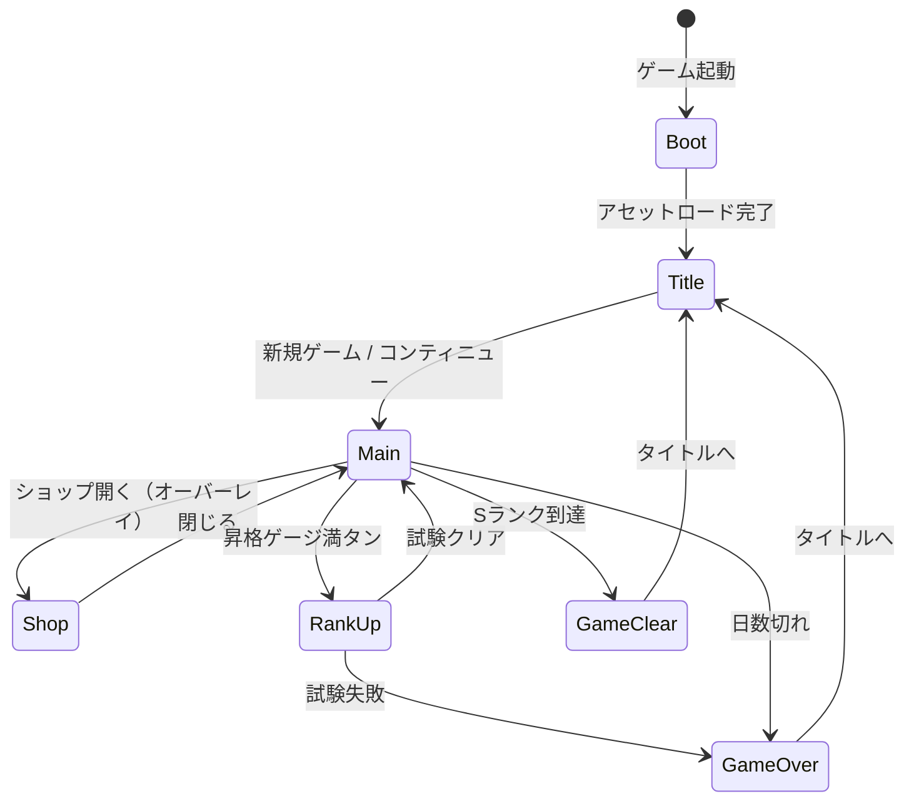
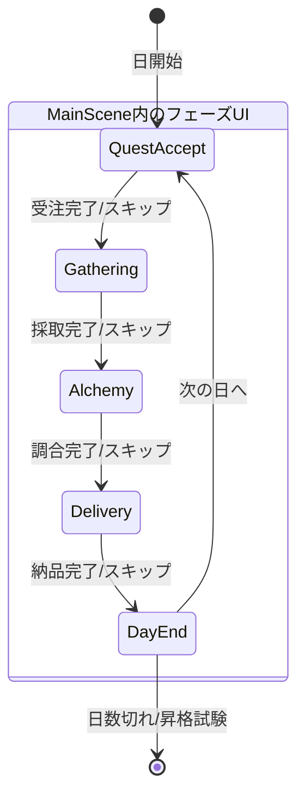
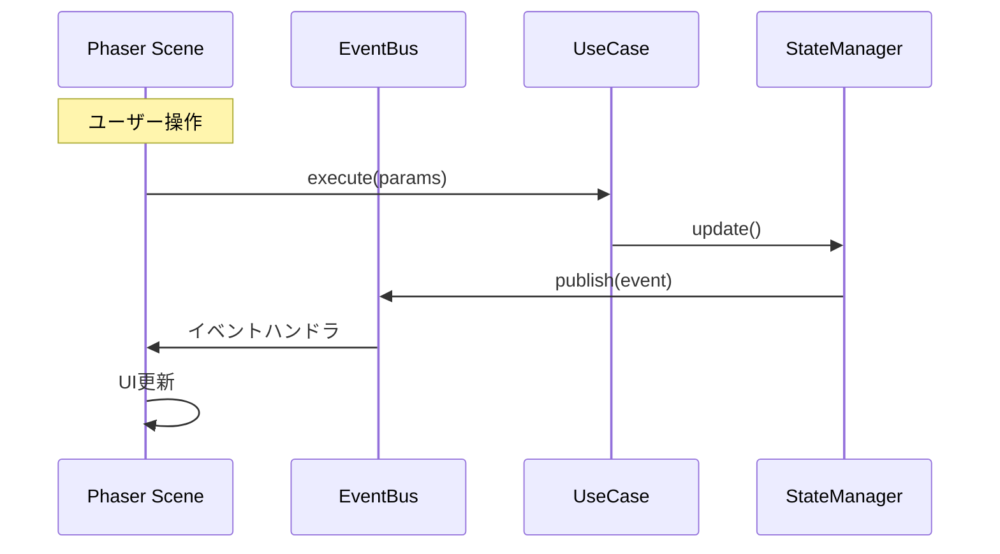

# システムアーキテクチャ設計書（Phaser版）

**バージョン**: 1.0.0
**作成日**: 2026-01-07
**対象**: アトリエ錬金術ゲーム（ギルドランク制）Phaser版

---

## 概要

本ドキュメントは、既存のHTML版をPhaserフレームワークを使用してUI周りを刷新するためのシステムアーキテクチャを定義する。

### システム概要

> 既存のClean Architecture（Domain/Application/Infrastructure層）を維持しながら、
> Presentation層をPhaserベースに置き換え、ゲームらしいビジュアル表現と
> インタラクションを実現する。

### 信頼性レベル凡例

- 🔵 **青信号**: 既存設計書・要件定義書に詳細記載
- 🟡 **黄信号**: 既存設計から妥当な推測
- 🔴 **赤信号**: Phaser対応のための新規追加

---

## 1. 技術スタック 🔴

### 1.1 フロントエンド

| 技術 | バージョン | 用途 |
|------|-----------|------|
| TypeScript | 5.x | メイン言語 |
| **Phaser** | 3.87+ | ゲームフレームワーク |
| **rexUI Plugin** | 最新 | UIコンポーネント（ダイアログ、ボタン等） |
| Vite | 5.x | ビルドツール |

### 1.2 データ永続化（既存維持）

| 技術 | 用途 |
|------|------|
| localStorage | セーブデータ保存 |
| JSON | マスターデータ形式 |

### 1.3 新規依存ライブラリ 🔴

| ライブラリ | 用途 | 必須 |
|-----------|------|------|
| phaser | ゲームフレームワーク | ○ |
| phaser3-rex-plugins | UI拡張（Dialog, Buttons, Sizer等） | ○ |

**設計方針**:
- 既存のDomain/Application/Infrastructure層はそのまま維持
- Presentation層のみPhaserに置き換え
- ビジネスロジックはPhaserに依存しない

---

## 2. アーキテクチャパターン 🟡

### 2.1 採用パターン

- **Clean Architecture**: 既存4層構造を維持（責務分離）
- **Scene-based Architecture**: Phaserのシーン管理を活用 🔴
- **イベント駆動設計**: EventBusによる疎結合な通信（既存維持）
- **State Machine**: フェーズ管理に状態機械パターンを適用（既存維持）

### 2.2 選択理由

| パターン | 理由 |
|---------|------|
| Clean Architecture | ビジネスロジックの独立性確保（既存維持） |
| Scene-based | Phaserの画面管理との親和性 |
| イベント駆動 | Phaser-Domain間の疎結合化 |

---

## 3. レイヤー構造 🔴

```
┌─────────────────────────────────────────────────────────────┐
│                 Presentation Layer (Phaser)                 │
│  (Phaser Scenes, GameObjects, rexUI Components)             │
│                                                             │
│  ┌─────────────┐ ┌─────────────┐ ┌─────────────┐           │
│  │BootScene   │ │ TitleScene  │ │ MainScene   │           │
│  └─────────────┘ └─────────────┘ └─────────────┘           │
│  ┌─────────────┐ ┌─────────────┐ ┌─────────────┐           │
│  │ ShopScene   │ │RankUpScene  │ │ResultScene  │           │
│  └─────────────┘ └─────────────┘ └─────────────┘           │
│  ┌─────────────────────────────────────────────┐           │
│  │           UI Components (rexUI)              │           │
│  │  Dialog, Buttons, Sizer, ProgressBar, etc.  │           │
│  └─────────────────────────────────────────────┘           │
└─────────────────────────────────────────────────────────────┘
                           ↓↑ Events / Method Calls
┌─────────────────────────────────────────────────────────────┐
│                    Application Layer                        │
│  (既存維持: ゲームフロー制御, 状態管理, イベント調整)          │
│                                                             │
│  ┌─────────────┐ ┌─────────────┐ ┌─────────────┐           │
│  │GameFlowMgr  │ │PhaseManager │ │ EventBus    │           │
│  └─────────────┘ └─────────────┘ └─────────────┘           │
│  ┌─────────────┐ ┌─────────────┐                           │
│  │StateManager │ │ UseCases    │                           │
│  └─────────────┘ └─────────────┘                           │
└─────────────────────────────────────────────────────────────┘
                           ↓↑ Method Calls
┌─────────────────────────────────────────────────────────────┐
│                      Domain Layer                           │
│  (既存維持: ビジネスロジック, ドメインサービス, エンティティ)   │
│                                                             │
│  ┌─────────────┐ ┌─────────────┐ ┌─────────────┐           │
│  │ DeckService │ │GatheringSvc │ │ AlchemySvc  │           │
│  └─────────────┘ └─────────────┘ └─────────────┘           │
│  （その他既存サービス）                                      │
└─────────────────────────────────────────────────────────────┘
                           ↓↑ Data Access
┌─────────────────────────────────────────────────────────────┐
│                   Infrastructure Layer                      │
│  (既存維持: データアクセス, 外部システム連携, ユーティリティ)  │
│                                                             │
│  ┌─────────────┐ ┌─────────────┐ ┌─────────────┐           │
│  │SaveDataRepo │ │MasterLoader │ │RandomGen    │           │
│  └─────────────┘ └─────────────┘ └─────────────┘           │
└─────────────────────────────────────────────────────────────┘
```

### 3.1 各レイヤーの責務

| レイヤー | 責務 | 変更点 |
|---------|------|--------|
| Presentation | UI表示、ユーザー入力受付 | **Phaser化** |
| Application | ゲームフロー制御、状態管理 | 維持 |
| Domain | ビジネスロジック、ルール実装 | 維持 |
| Infrastructure | データ永続化、外部連携 | 維持 |

---

## 4. Phaser シーン構成 🔴

### 4.1 シーン一覧

| シーンキー | クラス名 | 説明 | 依存シーン |
|-----------|---------|------|-----------|
| `Boot` | BootScene | アセットプリロード、初期化 | - |
| `Title` | TitleScene | タイトル画面 | Boot |
| `Main` | MainScene | メインゲームプレイ（4フェーズ） | Title |
| `Shop` | ShopScene | ショップ（オーバーレイ） | Main |
| `RankUp` | RankUpScene | 昇格試験 | Main |
| `GameOver` | GameOverScene | ゲームオーバー画面 | Main |
| `GameClear` | GameClearScene | ゲームクリア画面 | Main |

### 4.2 シーンライフサイクル

```typescript
class BaseGameScene extends Phaser.Scene {
  // Phaserライフサイクル
  init(data?: SceneData): void;      // シーン初期化
  preload(): void;                    // アセットロード
  create(data?: SceneData): void;     // オブジェクト生成
  update(time: number, delta: number): void; // 毎フレーム更新

  // 追加メソッド（アプリケーション層との連携）
  protected bindEvents(): void;       // EventBus購読
  protected unbindEvents(): void;     // EventBus購読解除
}
```

### 4.3 シーン遷移図 🔵



---

## 5. Phaser ゲームコンフィグ 🔴

### 5.1 基本設定

```typescript
const gameConfig: Phaser.Types.Core.GameConfig = {
  type: Phaser.AUTO,           // WebGL優先、Canvas fallback
  parent: 'game-container',     // 親要素ID
  width: 1280,                  // ゲーム幅
  height: 720,                  // ゲーム高さ
  backgroundColor: '#F5F5DC',   // ベージュ（羊皮紙風）
  scale: {
    mode: Phaser.Scale.FIT,     // 画面にフィット
    autoCenter: Phaser.Scale.CENTER_BOTH,
  },
  scene: [
    BootScene,
    TitleScene,
    MainScene,
    ShopScene,
    RankUpScene,
    GameOverScene,
    GameClearScene,
  ],
  plugins: {
    scene: [
      {
        key: 'rexUI',
        plugin: UIPlugin,
        mapping: 'rexUI',
      },
    ],
  },
  dom: {
    createContainer: false,     // DOM要素は使用しない
  },
};
```

### 5.2 解像度とスケーリング

| 設定 | 値 | 理由 |
|------|-----|------|
| 基準解像度 | 1280 x 720 | 16:9の標準HD |
| スケールモード | FIT | アスペクト比維持でフィット |
| 最小解像度 | 960 x 540 | モバイル対応 |

---

## 6. UIコンポーネント設計（rexUI）🔴

### 6.1 使用するrexUIコンポーネント

| コンポーネント | 用途 | 対応UI |
|--------------|------|--------|
| **Dialog** | モーダルダイアログ | 確認、報酬選択、依頼詳細 |
| **Buttons** | ボタングループ | フェーズ操作、メニュー |
| **GridButtons** | グリッド配置ボタン | カード選択、素材選択 |
| **Sizer** | レイアウト制御 | 全般的なUI配置 |
| **OverlapSizer** | 重ね合わせレイアウト | カード重ね表示 |
| **ProgressBar** | 進捗表示 | 昇格ゲージ、日数バー |
| **Label** | テキスト＋アイコン | ステータス表示 |
| **ScrollablePanel** | スクロールパネル | 依頼一覧、インベントリ |
| **Toast** | 通知メッセージ | 獲得通知、警告 |

### 6.2 カスタムUIコンポーネント

| コンポーネント | 継承元 | 説明 |
|--------------|-------|------|
| CardView | Container | カード表示（採取地/レシピ/強化） |
| HandView | Container | 手札表示エリア |
| MaterialOptionView | GridButtons | ドラフト採取の素材選択 |
| QuestListView | ScrollablePanel | 依頼一覧 |
| InventoryView | ScrollablePanel | インベントリ |
| RewardCardSelector | Dialog | 報酬カード選択 |

---

## 7. MainSceneのフェーズUI構造 🔴

### 7.1 フェーズ別UIコンテナ

MainSceneは1つのシーン内で4つのフェーズUIを切り替える。

```typescript
class MainScene extends Phaser.Scene {
  // フェーズUIコンテナ
  private questAcceptUI: QuestAcceptPhaseUI;
  private gatheringUI: GatheringPhaseUI;
  private alchemyUI: AlchemyPhaseUI;
  private deliveryUI: DeliveryPhaseUI;

  // 共通UI
  private headerUI: HeaderUI;        // ランク、日数、ゴールド等
  private sidebarUI: SidebarUI;      // 依頼一覧、インベントリ
  private phaseIndicator: PhaseIndicator;
  private handUI: HandUI;            // 手札表示

  // 現在のフェーズ
  private currentPhaseUI: BasePhaseUI | null;
}
```

### 7.2 フェーズ遷移



---

## 8. Phaser-Application層連携 🔴

### 8.1 連携パターン



### 8.2 イベントバインディング例

```typescript
class MainScene extends Phaser.Scene {
  private eventBus: IEventBus;

  create(): void {
    this.bindEvents();
  }

  private bindEvents(): void {
    // Application層からのイベントを購読
    this.eventBus.subscribe('PHASE_CHANGED', this.onPhaseChanged.bind(this));
    this.eventBus.subscribe('QUEST_ACCEPTED', this.onQuestAccepted.bind(this));
    this.eventBus.subscribe('GATHERING_COMPLETED', this.onGatheringCompleted.bind(this));
    this.eventBus.subscribe('ITEM_CRAFTED', this.onItemCrafted.bind(this));
    this.eventBus.subscribe('QUEST_DELIVERED', this.onQuestDelivered.bind(this));
    this.eventBus.subscribe('STATE_UPDATED', this.onStateUpdated.bind(this));
  }

  shutdown(): void {
    this.unbindEvents();
  }

  private unbindEvents(): void {
    this.eventBus.unsubscribeAll();
  }
}
```

---

## 9. ディレクトリ構造 🔴

```
src/
├── index.html                 # エントリーポイントHTML
├── main.ts                    # Phaserゲーム初期化
├── game/                      # Phaser関連（新規）
│   ├── config.ts              # Phaserコンフィグ
│   ├── scenes/
│   │   ├── BaseGameScene.ts   # 基底シーン
│   │   ├── BootScene.ts       # 起動・プリロード
│   │   ├── TitleScene.ts      # タイトル画面
│   │   ├── MainScene.ts       # メインゲーム画面
│   │   ├── ShopScene.ts       # ショップ画面
│   │   ├── RankUpScene.ts     # 昇格試験画面
│   │   ├── GameOverScene.ts   # ゲームオーバー
│   │   └── GameClearScene.ts  # ゲームクリア
│   ├── ui/
│   │   ├── components/        # カスタムUIコンポーネント
│   │   │   ├── CardView.ts
│   │   │   ├── HandView.ts
│   │   │   ├── MaterialOptionView.ts
│   │   │   ├── QuestListView.ts
│   │   │   ├── InventoryView.ts
│   │   │   ├── RewardCardSelector.ts
│   │   │   └── ...
│   │   ├── phases/            # フェーズ別UI
│   │   │   ├── BasePhaseUI.ts
│   │   │   ├── QuestAcceptPhaseUI.ts
│   │   │   ├── GatheringPhaseUI.ts
│   │   │   ├── AlchemyPhaseUI.ts
│   │   │   └── DeliveryPhaseUI.ts
│   │   └── common/            # 共通UI
│   │       ├── HeaderUI.ts
│   │       ├── SidebarUI.ts
│   │       ├── PhaseIndicator.ts
│   │       └── ActionButtons.ts
│   └── assets/                # アセット管理
│       ├── AssetKeys.ts       # アセットキー定数
│       └── AssetLoader.ts     # アセットローダー
├── application/               # 既存維持
│   ├── GameFlowManager.ts
│   ├── StateManager.ts
│   └── ...UseCases
├── domain/                    # 既存維持
│   ├── services/
│   ├── entities/
│   └── ...
├── infrastructure/            # 既存維持
│   ├── repositories/
│   ├── loaders/
│   └── ...
└── data/                      # 既存維持
    └── master/
```

---

## 10. アセット管理 🔴

### 10.1 アセットカテゴリ

| カテゴリ | 形式 | 用途 |
|---------|------|------|
| **UI** | PNG, SVG | ボタン、パネル、アイコン |
| **Cards** | PNG | カード画像 |
| **Characters** | PNG（スプライトシート） | 依頼者キャラクター |
| **Backgrounds** | PNG | 背景画像 |
| **SFX** | MP3, OGG | 効果音 |
| **BGM** | MP3, OGG | 背景音楽 |

### 10.2 アセットロード戦略

```typescript
class BootScene extends Phaser.Scene {
  preload(): void {
    // 進捗バー表示
    this.createProgressBar();

    // 共通UIアセット
    this.load.image('btn-primary', 'assets/ui/btn-primary.png');
    this.load.image('btn-secondary', 'assets/ui/btn-secondary.png');
    this.load.image('panel-bg', 'assets/ui/panel-bg.png');
    this.load.image('card-frame', 'assets/ui/card-frame.png');

    // カードアセット
    this.load.atlas('cards', 'assets/cards/cards.png', 'assets/cards/cards.json');

    // キャラクター
    this.load.atlas('characters', 'assets/characters/characters.png', 'assets/characters/characters.json');

    // 効果音
    this.load.audio('sfx-click', ['assets/sfx/click.mp3', 'assets/sfx/click.ogg']);
    this.load.audio('sfx-success', ['assets/sfx/success.mp3', 'assets/sfx/success.ogg']);

    // BGM
    this.load.audio('bgm-title', ['assets/bgm/title.mp3', 'assets/bgm/title.ogg']);
    this.load.audio('bgm-main', ['assets/bgm/main.mp3', 'assets/bgm/main.ogg']);
  }
}
```

---

## 11. 移行計画 🔴

### 11.1 段階的移行

| フェーズ | 内容 | 優先度 |
|---------|------|--------|
| Phase 1 | Phaser基盤構築（Boot, Title） | 高 |
| Phase 2 | MainScene基本UI | 高 |
| Phase 3 | 各フェーズUI実装 | 高 |
| Phase 4 | Shop/RankUp/Result画面 | 中 |
| Phase 5 | アニメーション・演出追加 | 中 |
| Phase 6 | 効果音・BGM追加 | 低 |

### 11.2 既存コードの活用

| 層 | 移行方針 |
|-----|---------|
| Domain | 変更なし（そのまま利用） |
| Application | 変更なし（そのまま利用） |
| Infrastructure | 変更なし（そのまま利用） |
| Presentation | 完全置き換え（Phaser化） |

---

## 12. パフォーマンス考慮事項 🔴

### 12.1 最適化ポイント

| 項目 | 対策 |
|------|------|
| テクスチャアトラス | 複数画像を1枚にまとめる |
| オブジェクトプール | 頻繁に生成/破棄するオブジェクトを再利用 |
| 遅延ロード | 必要時にアセットを読み込む |
| WebGLバッチング | 同一テクスチャの描画をまとめる |

### 12.2 ターゲットFPS

| 環境 | ターゲットFPS |
|------|-------------|
| デスクトップ | 60 FPS |
| モバイル | 30 FPS |

---

## 関連文書

- **既存要件定義書**: [../../spec/atelier-guild-rank-requirements.md](../../spec/atelier-guild-rank-requirements.md)
- **既存アーキテクチャ設計書**: [../atelier-guild-rank/architecture.md](../atelier-guild-rank/architecture.md)
- **UI設計（Phaser版）**: [ui-design/overview.md](ui-design/overview.md)
- **コアシステム設計**: [core-systems.md](core-systems.md)

---

## 変更履歴

| 日付 | バージョン | 変更内容 |
|------|----------|---------|
| 2026-01-07 | 1.0.0 | 初版作成。Phaserを使用したUI刷新のアーキテクチャ設計。 |
