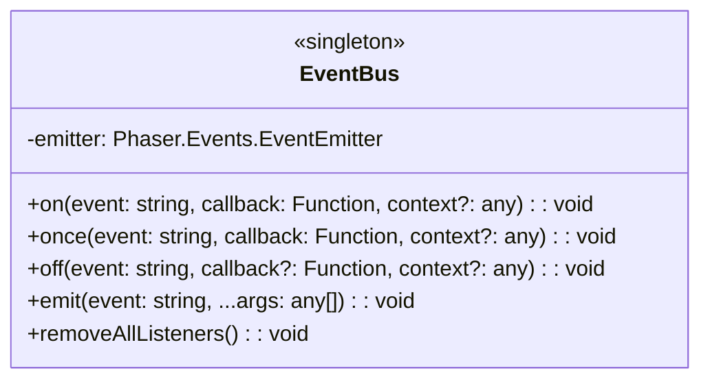
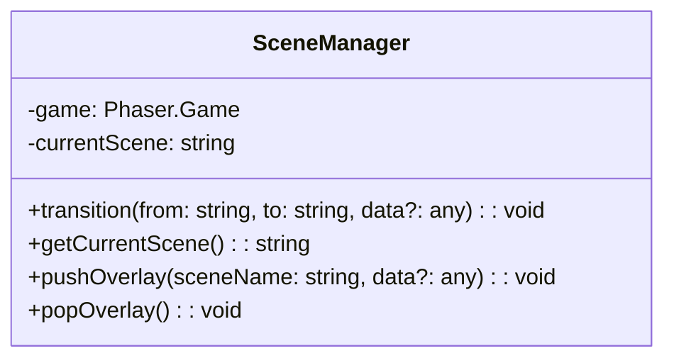
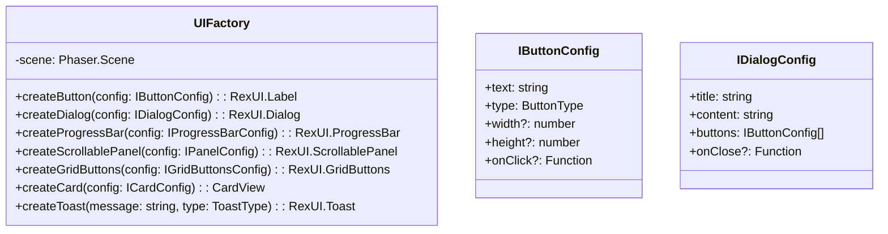
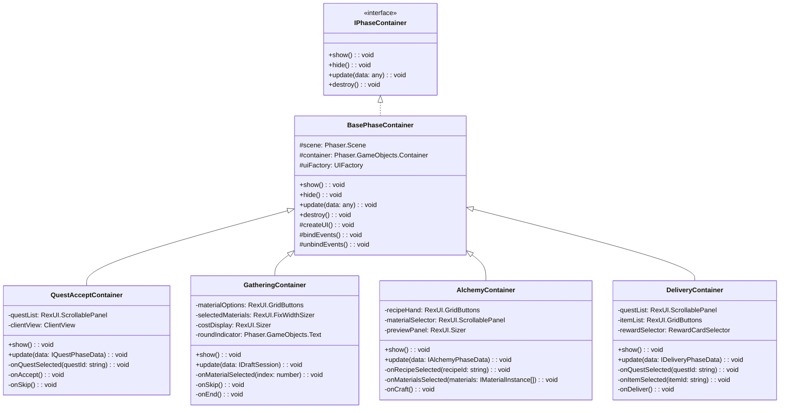
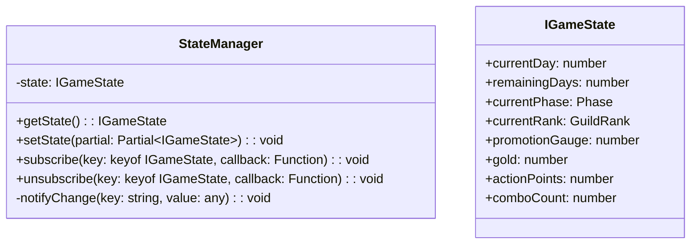

# コアシステム設計書（Phaser版）

**バージョン**: 1.0.0
**作成日**: 2026-01-07
**対象**: アトリエ錬金術ゲーム（ギルドランク制）Phaser版

---

## 概要

本ドキュメントは、Phaserを使用したゲームの核となるシステムの詳細設計を定義する。
ドメインレイヤーのサービスは既存HTML版と共通であり、本ドキュメントではPhaser固有のGame層とイベント連携を中心に記載する。

### 信頼性レベル凡例

- 🔵 **青信号**: 要件定義書に詳細記載
- 🟡 **黄信号**: 要件定義書から妥当な推測
- 🔴 **赤信号**: 要件定義書にない推測

---

## 1. システム構成概要

### 1.1 レイヤー構成

```
┌─────────────────────────────────────────────────────────────┐
│                    Presentation Layer                        │
│  (Phaser Scenes, UI Components, EventBus)                   │
├─────────────────────────────────────────────────────────────┤
│                    Application Layer                         │
│  (GameFlowManager, PhaseManager, UseCases)                  │
├─────────────────────────────────────────────────────────────┤
│                      Domain Layer                            │
│  (DeckService, GatheringService, AlchemyService, etc.)      │
├─────────────────────────────────────────────────────────────┤
│                   Infrastructure Layer                       │
│  (MasterDataLoader, SaveDataRepository, RandomGenerator)    │
└─────────────────────────────────────────────────────────────┘
```

### 1.2 システム一覧

| システム名 | 責務 | レイヤー | Phaser連携 |
|-----------|------|---------|-----------|
| **Phaser固有** ||||
| SceneManager | シーン遷移管理 | Presentation | ○ |
| EventBus | イベント配信 | Presentation | ○ |
| UIFactory | UIコンポーネント生成 | Presentation | ○ |
| **Application** ||||
| GameFlowManager | ゲーム進行制御 | Application | EventBus経由 |
| PhaseManager | フェーズ遷移制御 | Application | EventBus経由 |
| StateManager | ゲーム状態管理 | Application | EventBus経由 |
| **Domain（既存と共通）** ||||
| DeckService | デッキ操作・管理 | Domain | - |
| GatheringService | 採取処理 | Domain | - |
| AlchemyService | 調合処理 | Domain | - |
| QuestService | 依頼管理 | Domain | - |
| ContributionCalculator | 貢献度計算 | Domain | - |
| RankService | ランク管理 | Domain | - |
| ShopService | ショップ機能 | Domain | - |
| ArtifactService | アーティファクト管理 | Domain | - |
| MaterialService | 素材の品質・属性計算 | Domain | - |
| InventoryService | インベントリ管理 | Domain | - |

---

## 2. EventBus（イベントバス） 🟡

### 2.1 責務

Phaserシーン（Presentation層）とApplication層の疎結合な連携を実現する。

### 2.2 クラス図



### 2.3 イベント定義 🔵

| イベント名 | 発火元 | データ | 説明 |
|-----------|-------|--------|------|
| **ゲームフロー** ||||
| `game:start` | TitleScene | { isNewGame: boolean } | ゲーム開始 |
| `game:save` | MainScene | - | セーブ要求 |
| `game:load` | TitleScene | - | ロード要求 |
| `game:over` | RankService | { reason: string } | ゲームオーバー |
| `game:clear` | RankService | { stats: IGameStats } | ゲームクリア |
| **フェーズ遷移** ||||
| `phase:change` | PhaseManager | { phase: Phase } | フェーズ変更 |
| `phase:complete` | PhaseManager | { phase: Phase } | フェーズ完了 |
| `day:start` | PhaseManager | { day: number } | 日開始 |
| `day:end` | PhaseManager | { day: number } | 日終了 |
| **依頼関連** ||||
| `quest:generated` | QuestService | { quests: IQuest[] } | 日毎依頼生成 |
| `quest:accepted` | QuestService | { questId: string } | 依頼受注 |
| `quest:delivered` | QuestService | { result: IDeliveryResult } | 納品完了 |
| `quest:expired` | QuestService | { questId: string } | 期限切れ |
| **採取関連** ||||
| `gathering:start` | GatheringService | { session: IDraftSession } | 採取開始 |
| `gathering:options` | GatheringService | { options: IMaterialOption[] } | 素材提示 |
| `gathering:selected` | GatheringService | { material: IMaterialInstance } | 素材選択 |
| `gathering:end` | GatheringService | { result: IGatheringResult } | 採取終了 |
| **調合関連** ||||
| `alchemy:start` | AlchemyService | { recipeId: string } | 調合開始 |
| `alchemy:complete` | AlchemyService | { item: ICraftedItem } | 調合完了 |
| **デッキ関連** ||||
| `deck:draw` | DeckService | { cards: string[] } | ドロー |
| `deck:play` | DeckService | { cardId: string } | カード使用 |
| `deck:add` | DeckService | { cardId: string } | カード追加 |
| `deck:shuffle` | DeckService | - | シャッフル |
| **ランク関連** ||||
| `rank:contribution` | RankService | { amount: number, total: number } | 貢献度追加 |
| `rank:promotionReady` | RankService | - | 昇格準備完了 |
| `rank:up` | RankService | { newRank: GuildRank } | ランクアップ |
| **UI関連** ||||
| `ui:dialog:open` | Scene | { type: string, data: any } | ダイアログ開く |
| `ui:dialog:close` | Scene | { type: string } | ダイアログ閉じる |
| `ui:toast:show` | Scene | { message: string, type: string } | トースト表示 |
| `ui:inventory:update` | InventoryService | { materials: [], items: [] } | インベントリ更新 |

### 2.4 使用例

```typescript
// イベント発火（Application層）
EventBus.emit('phase:change', { phase: 'GATHERING' });

// イベント購読（Presentation層）
EventBus.on('phase:change', (data: { phase: Phase }) => {
    this.switchPhaseContainer(data.phase);
}, this);

// イベント購読解除（シーン終了時）
EventBus.off('phase:change', this.onPhaseChange, this);
```

---

## 3. SceneManager（シーン管理） 🟡

### 3.1 責務

Phaserシーン間の遷移とデータ受け渡しを管理する。

### 3.2 クラス図



### 3.3 シーン遷移パターン 🔵

```typescript
// フェード遷移
transition(from: string, to: string, data?: any): void {
    const fromScene = this.game.scene.getScene(from);
    const toScene = this.game.scene.getScene(to);

    // フェードアウト
    fromScene.cameras.main.fadeOut(300, 0, 0, 0);
    fromScene.cameras.main.once('camerafadeoutcomplete', () => {
        // シーン切り替え
        this.game.scene.stop(from);
        this.game.scene.start(to, data);
        this.currentScene = to;

        // フェードイン
        const newScene = this.game.scene.getScene(to);
        newScene.cameras.main.fadeIn(300, 0, 0, 0);
    });
}

// オーバーレイ（ショップなど）
pushOverlay(sceneName: string, data?: any): void {
    this.game.scene.launch(sceneName, data);
    this.game.scene.bringToTop(sceneName);
}

popOverlay(): void {
    // 現在のオーバーレイを閉じる
    const overlayScene = this.game.scene.getScene(this.currentOverlay);
    overlayScene?.scene.stop();
}
```

---

## 4. UIFactory（UI生成ファクトリ） 🟡

### 4.1 責務

rexUIを使用した共通UIコンポーネントの生成を一元化する。

### 4.2 クラス図



### 4.3 ボタン生成 🟡

```typescript
createButton(config: IButtonConfig): RexUI.Label {
    const { text, type, width = 120, height = 40, onClick } = config;

    // ボタンタイプに応じた色設定
    const colors = this.getButtonColors(type);

    const button = this.scene.rexUI.add.label({
        width,
        height,
        background: this.scene.rexUI.add.roundRectangle(
            0, 0, 0, 0, 4, colors.background
        ).setStrokeStyle(2, colors.stroke),
        text: this.scene.add.text(0, 0, text, {
            fontFamily: 'NotoSansJP',
            fontSize: '16px',
            color: colors.text
        }),
        space: { left: 16, right: 16, top: 8, bottom: 8 },
        align: 'center'
    });

    // インタラクティブ設定
    button.setInteractive({ useHandCursor: true });

    // ホバーエフェクト
    button.on('pointerover', () => {
        button.getElement('background').setFillStyle(colors.hover);
    });
    button.on('pointerout', () => {
        button.getElement('background').setFillStyle(colors.background);
    });

    // クリックハンドラ
    if (onClick) {
        button.on('pointerdown', onClick);
    }

    return button;
}

private getButtonColors(type: ButtonType): IButtonColors {
    switch (type) {
        case 'primary':
            return { background: 0x8B4513, hover: 0xA0522D, stroke: 0x5D3A1A, text: '#ffffff' };
        case 'secondary':
            return { background: 0xF5F5DC, hover: 0xE0E0C0, stroke: 0x666666, text: '#333333' };
        case 'danger':
            return { background: 0xB22222, hover: 0xCD2626, stroke: 0x8B0000, text: '#ffffff' };
        case 'disabled':
            return { background: 0x808080, hover: 0x808080, stroke: 0x666666, text: '#999999' };
    }
}
```

### 4.4 ダイアログ生成 🟡

```typescript
createDialog(config: IDialogConfig): RexUI.Dialog {
    const { title, content, buttons, onClose } = config;

    const dialog = this.scene.rexUI.add.dialog({
        x: 640,
        y: 360,
        background: this.scene.rexUI.add.roundRectangle(0, 0, 0, 0, 12, 0xF5F5DC)
            .setStrokeStyle(2, 0x8B4513),
        title: this.createDialogTitle(title),
        content: this.createDialogContent(content),
        actions: buttons.map(btn => this.createButton(btn)),
        space: {
            title: 24,
            content: 24,
            action: 16,
            left: 24,
            right: 24,
            top: 24,
            bottom: 24
        },
        expand: { content: false }
    })
    .layout()
    .setDepth(400);

    // ポップアップアニメーション
    dialog.popUp(300);

    // 背景オーバーレイ
    const overlay = this.scene.add.rectangle(640, 360, 1280, 720, 0x000000, 0.5)
        .setDepth(399)
        .setInteractive();

    // 閉じる処理
    dialog.on('button.click', (button: any, groupName: string, index: number) => {
        overlay.destroy();
        dialog.scaleDownDestroy(200);
        if (onClose) {
            onClose(index);
        }
    });

    return dialog;
}
```

### 4.5 カード生成 🟡

```typescript
createCard(config: ICardConfig): CardView {
    const { cardId, cardType, isInteractive = true } = config;

    const cardView = new CardView(this.scene, 0, 0, cardId, cardType);

    if (isInteractive) {
        cardView.setInteractive({ useHandCursor: true });

        // ホバーエフェクト
        cardView.on('pointerover', () => {
            this.scene.tweens.add({
                targets: cardView,
                scaleX: 1.1,
                scaleY: 1.1,
                duration: 100,
                ease: 'Back.easeOut'
            });
        });

        cardView.on('pointerout', () => {
            this.scene.tweens.add({
                targets: cardView,
                scaleX: 1,
                scaleY: 1,
                duration: 100,
                ease: 'Power2'
            });
        });
    }

    return cardView;
}
```

---

## 5. PhaseContainerシステム 🟡

### 5.1 責務

メインシーン内でフェーズに応じたUIコンテナを切り替える。

### 5.2 クラス図



### 5.3 フェーズコンテナ切り替え 🔵

```typescript
// MainScene内でのフェーズコンテナ管理
class MainScene extends Phaser.Scene {
    private phaseContainers: Map<Phase, IPhaseContainer> = new Map();
    private currentContainer: IPhaseContainer | null = null;

    create(): void {
        // フェーズコンテナの初期化
        this.phaseContainers.set('QUEST_ACCEPT', new QuestAcceptContainer(this));
        this.phaseContainers.set('GATHERING', new GatheringContainer(this));
        this.phaseContainers.set('ALCHEMY', new AlchemyContainer(this));
        this.phaseContainers.set('DELIVERY', new DeliveryContainer(this));

        // イベント購読
        EventBus.on('phase:change', this.onPhaseChange, this);
    }

    private onPhaseChange(data: { phase: Phase }): void {
        // 現在のコンテナを非表示
        if (this.currentContainer) {
            this.currentContainer.hide();
        }

        // 新しいコンテナを表示
        this.currentContainer = this.phaseContainers.get(data.phase) || null;
        if (this.currentContainer) {
            this.currentContainer.show();
        }
    }

    shutdown(): void {
        EventBus.off('phase:change', this.onPhaseChange, this);
        this.phaseContainers.forEach(container => container.destroy());
    }
}
```

---

## 6. ドメインサービスとの連携 🔵

### 6.1 連携パターン

```mermaid
sequenceDiagram
    participant UI as Phaser UI
    participant EB as EventBus
    participant UC as UseCase
    participant DS as DomainService

    Note over UI,DS: ユーザーアクション → ドメイン処理
    UI->>EB: emit('gathering:select', { index: 1 })
    EB->>UC: onGatheringSelect(index)
    UC->>DS: GatheringService.selectMaterial(sessionId, index)
    DS-->>UC: IMaterialInstance
    UC->>EB: emit('gathering:selected', { material })
    EB-->>UI: onMaterialSelected(material)
    UI->>UI: updateSelectedMaterials()

    Note over UI,DS: ドメインイベント → UI更新
    DS->>EB: emit('inventory:updated', { materials, items })
    EB-->>UI: onInventoryUpdated(data)
    UI->>UI: refreshInventoryPanel()
```



### 6.2 UseCase（ユースケース）パターン 🟡

```typescript
// 採取ユースケース
class GatheringUseCase {
    constructor(
        private gatheringService: IGatheringService,
        private deckService: IDeckService,
        private inventoryService: IInventoryService
    ) {
        this.bindEvents();
    }

    private bindEvents(): void {
        EventBus.on('gathering:start', this.onStartGathering, this);
        EventBus.on('gathering:select', this.onSelectMaterial, this);
        EventBus.on('gathering:skip', this.onSkip, this);
        EventBus.on('gathering:end', this.onEndGathering, this);
    }

    private onStartGathering(data: { cardId: string, enhancements?: string[] }): void {
        const session = this.gatheringService.startDraftGathering(
            data.cardId,
            data.enhancements
        );
        EventBus.emit('gathering:session', { session });
        EventBus.emit('gathering:options', { options: session.currentOptions });
    }

    private onSelectMaterial(data: { index: number }): void {
        const session = this.gatheringService.getCurrentSession();
        const material = this.gatheringService.selectMaterial(session.sessionId, data.index);

        EventBus.emit('gathering:selected', { material });

        // 次のラウンドがあれば次の選択肢を提示
        if (!session.isComplete) {
            EventBus.emit('gathering:options', { options: session.currentOptions });
        }
    }

    private onEndGathering(): void {
        const session = this.gatheringService.getCurrentSession();
        const result = this.gatheringService.endGathering(session.sessionId);

        // 素材をインベントリに追加
        for (const material of result.materials) {
            this.inventoryService.addMaterial(material);
        }

        // カードを捨て札へ
        this.deckService.playCard(session.cardId);

        EventBus.emit('gathering:complete', { result });
        EventBus.emit('ui:inventory:update', {
            materials: this.inventoryService.getMaterials(),
            items: this.inventoryService.getItems()
        });
    }
}
```

---

## 7. 状態管理（StateManager） 🟡

### 7.1 責務

ゲーム状態を一元管理し、状態変更をEventBus経由で通知する。

### 7.2 クラス図



### 7.3 状態変更と通知 🔵

```typescript
class StateManager {
    private state: IGameState;
    private subscribers: Map<string, Set<Function>> = new Map();

    setState(partial: Partial<IGameState>): void {
        for (const [key, value] of Object.entries(partial)) {
            const oldValue = this.state[key as keyof IGameState];
            if (oldValue !== value) {
                (this.state as any)[key] = value;
                this.notifyChange(key, value);
            }
        }
    }

    private notifyChange(key: string, value: any): void {
        // ローカル購読者への通知
        const subs = this.subscribers.get(key);
        if (subs) {
            subs.forEach(callback => callback(value));
        }

        // EventBus経由でUI層へ通知
        EventBus.emit(`state:${key}`, { [key]: value });
    }

    subscribe(key: keyof IGameState, callback: Function): void {
        if (!this.subscribers.has(key)) {
            this.subscribers.set(key, new Set());
        }
        this.subscribers.get(key)!.add(callback);
    }
}
```

---

## 8. システム間の依存関係図 🟡

```mermaid
graph TB
    subgraph "Presentation Layer (Phaser)"
        EB[EventBus]
        SM[SceneManager]
        UF[UIFactory]

        subgraph "Scenes"
            TS[TitleScene]
            MS[MainScene]
            SS[ShopScene]
            RS[RankUpScene]
            GOS[GameOverScene]
            GCS[GameClearScene]
        end

        subgraph "Phase Containers"
            QAC[QuestAcceptContainer]
            GC[GatheringContainer]
            AC[AlchemyContainer]
            DC[DeliveryContainer]
        end
    end

    subgraph "Application Layer"
        GFM[GameFlowManager]
        PM[PhaseManager]
        STM[StateManager]

        subgraph "UseCases"
            GUC[GatheringUseCase]
            AUC[AlchemyUseCase]
            QUC[QuestUseCase]
            DUC[DeckUseCase]
        end
    end

    subgraph "Domain Layer"
        DS[DeckService]
        GS[GatheringService]
        AS[AlchemyService]
        QS[QuestService]
        CC[ContributionCalculator]
        RKS[RankService]
        SHS[ShopService]
        AFS[ArtifactService]
        MTS[MaterialService]
        IS[InventoryService]
    end

    subgraph "Infrastructure Layer"
        MDL[MasterDataLoader]
        SDR[SaveDataRepository]
        RG[RandomGenerator]
    end

    %% Presentation → EventBus
    MS --> EB
    SS --> EB
    RS --> EB
    QAC --> EB
    GC --> EB
    AC --> EB
    DC --> EB

    %% EventBus → Application
    EB --> GFM
    EB --> PM
    EB --> STM
    EB --> GUC
    EB --> AUC
    EB --> QUC
    EB --> DUC

    %% Application → Domain
    GUC --> GS
    GUC --> DS
    GUC --> IS
    AUC --> AS
    AUC --> DS
    AUC --> IS
    QUC --> QS
    QUC --> IS
    DUC --> DS

    %% Domain依存関係（既存と同じ）
    GS --> MTS
    GS --> AFS
    AS --> MTS
    AS --> AFS
    QS --> CC
    CC --> AFS
    IS --> AFS

    %% Infrastructure
    GS --> MDL
    AS --> MDL
    QS --> MDL
    MTS --> MDL
    AFS --> MDL
    RKS --> MDL
    DS --> RG
    GS --> RG
    QS --> RG
    MTS --> RG

    %% Scene Manager
    SM --> TS
    SM --> MS
    SM --> SS
    SM --> RS
    SM --> GOS
    SM --> GCS

    %% UI Factory
    MS --> UF
    SS --> UF
    RS --> UF
```



---

## 9. ドメインサービス詳細

ドメインサービスの詳細設計は既存HTML版と共通のため、以下のドキュメントを参照：

- [コアシステム設計書（HTML版）](../atelier-guild-rank/core-systems.md)

主要なドメインサービス：

| サービス | 責務 | 参照セクション |
|---------|------|---------------|
| DeckService | デッキ操作・管理 | 2. DeckService |
| GatheringService | ドラフト採取処理 | 3. GatheringService |
| AlchemyService | 調合処理 | 4. AlchemyService |
| QuestService | 依頼管理 | 5. QuestService |
| ContributionCalculator | 貢献度計算 | 6. ContributionCalculator |
| RankService | ランク管理 | 7. RankService |
| ShopService | ショップ機能 | 8. ShopService |
| ArtifactService | アーティファクト管理 | 9. ArtifactService |
| MaterialService | 素材の品質・属性計算 | 10. MaterialService |
| InventoryService | インベントリ管理 | 11. InventoryService |

---

## 10. Phaser固有の実装注意点 🔴

### 10.1 メモリ管理

```typescript
// シーン終了時のクリーンアップ
shutdown(): void {
    // イベント購読解除
    EventBus.off('phase:change', this.onPhaseChange, this);
    EventBus.off('ui:inventory:update', this.onInventoryUpdate, this);

    // rexUIコンポーネントの破棄
    this.phaseContainers.forEach(container => container.destroy());
    this.phaseContainers.clear();

    // Tweenの停止
    this.tweens.killAll();

    // Timerの停止
    this.time.removeAllEvents();
}
```

### 10.2 非同期処理とUI更新

```typescript
// ドメイン処理の結果をUIに反映する際の安全なパターン
private async onCraftItem(data: { recipeId: string, materials: IMaterialInstance[] }): Promise<void> {
    // UI更新をロック
    this.setInputEnabled(false);
    this.showLoadingIndicator();

    try {
        // ドメイン処理
        const item = await this.alchemyService.craft(data.recipeId, data.materials);

        // UI更新（シーンがまだアクティブか確認）
        if (this.scene.isActive()) {
            EventBus.emit('alchemy:complete', { item });
            this.showCraftResult(item);
        }
    } catch (error) {
        if (this.scene.isActive()) {
            EventBus.emit('ui:toast:show', { message: 'エラーが発生しました', type: 'error' });
        }
    } finally {
        if (this.scene.isActive()) {
            this.hideLoadingIndicator();
            this.setInputEnabled(true);
        }
    }
}
```

### 10.3 デバッグモード

```typescript
// 開発時のデバッグ機能
if (import.meta.env.DEV) {
    // EventBusのログ出力
    EventBus.on('*', (event: string, data: any) => {
        console.log(`[EventBus] ${event}:`, data);
    });

    // Phaserデバッグ表示
    this.physics.world.createDebugGraphic();
}
```

---

## 関連文書

- **要件定義書**: [../../spec/atelier-guild-rank-requirements.md](../../spec/atelier-guild-rank-requirements.md)
- **アーキテクチャ設計書（Phaser版）**: [architecture.md](architecture.md)
- **UI設計概要（Phaser版）**: [ui-design/overview.md](ui-design/overview.md)
- **コアシステム設計書（HTML版）**: [../atelier-guild-rank/core-systems.md](../atelier-guild-rank/core-systems.md)
- **データスキーマ設計書**: [../atelier-guild-rank/data-schema.md](../atelier-guild-rank/data-schema.md)

---

## 変更履歴

| 日付 | バージョン | 変更内容 |
|------|----------|---------|
| 2026-01-07 | 1.0.0 | 初版作成（Phaser版として新規作成） |
