# データフロー設計書（Phaser版）

**バージョン**: 1.0.0
**作成日**: 2026-01-07
**対象**: アトリエ錬金術ゲーム（ギルドランク制）Phaser版

---

## 概要

本ドキュメントは、Phaserを使用したゲームのデータフローを定義する。
レイヤー間のデータの流れ、イベント駆動のパターン、状態管理を中心に記載する。

### 信頼性レベル凡例

- 🔵 **青信号**: 要件定義書に詳細記載
- 🟡 **黄信号**: 要件定義書から妥当な推測
- 🔴 **赤信号**: 要件定義書にない推測

---

## 1. 全体データフロー 🟡

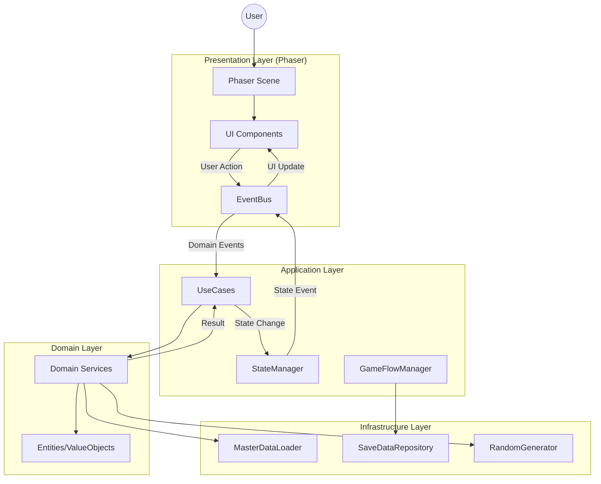
```mermaid
flowchart TB
    subgraph Presentation["Presentation Layer (Phaser)"]
        Scene[Phaser Scene]
        UI[UI Components]
        EventBus[EventBus]
    end

    subgraph Application["Application Layer"]
        UseCase[UseCases]
        StateManager[StateManager]
        FlowManager[GameFlowManager]
    end

    subgraph Domain["Domain Layer"]
        Services[Domain Services]
        Entities[Entities/ValueObjects]
    end

    subgraph Infrastructure["Infrastructure Layer"]
        MasterData[MasterDataLoader]
        SaveData[SaveDataRepository]
        Random[RandomGenerator]
    end

    %% User Input Flow
    User((User)) --> Scene
    Scene --> UI
    UI -->|User Action| EventBus

    %% Event Flow
    EventBus -->|Domain Events| UseCase
    UseCase --> Services
    Services --> Entities

    %% State Update Flow
    Services -->|Result| UseCase
    UseCase -->|State Change| StateManager
    StateManager -->|State Event| EventBus
    EventBus -->|UI Update| UI

    %% Infrastructure Access
    Services --> MasterData
    Services --> Random
    FlowManager --> SaveData
```

---

## 2. ユーザーアクションフロー 🔵

### 2.1 カード使用フロー

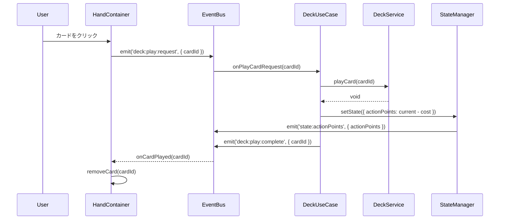
```mermaid
sequenceDiagram
    participant U as User
    participant H as HandContainer
    participant EB as EventBus
    participant DUC as DeckUseCase
    participant DS as DeckService
    participant SM as StateManager

    U->>H: カードをクリック
    H->>EB: emit('deck:play:request', { cardId })

    EB->>DUC: onPlayCardRequest(cardId)
    DUC->>DS: playCard(cardId)
    DS-->>DUC: void

    DUC->>SM: setState({ actionPoints: current - cost })
    SM->>EB: emit('state:actionPoints', { actionPoints })

    DUC->>EB: emit('deck:play:complete', { cardId })
    EB-->>H: onCardPlayed(cardId)
    H->>H: removeCard(cardId)
```

### 2.2 採取フロー

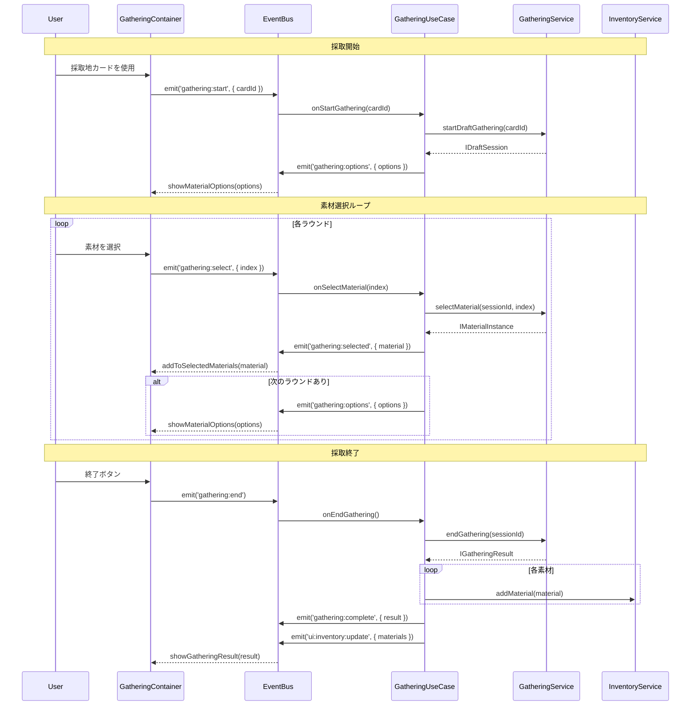
```mermaid
sequenceDiagram
    participant U as User
    participant GC as GatheringContainer
    participant EB as EventBus
    participant GUC as GatheringUseCase
    participant GS as GatheringService
    participant IS as InventoryService

    Note over U,IS: 採取開始
    U->>GC: 採取地カードを使用
    GC->>EB: emit('gathering:start', { cardId })

    EB->>GUC: onStartGathering(cardId)
    GUC->>GS: startDraftGathering(cardId)
    GS-->>GUC: IDraftSession

    GUC->>EB: emit('gathering:options', { options })
    EB-->>GC: showMaterialOptions(options)

    Note over U,IS: 素材選択ループ
    loop 各ラウンド
        U->>GC: 素材を選択
        GC->>EB: emit('gathering:select', { index })

        EB->>GUC: onSelectMaterial(index)
        GUC->>GS: selectMaterial(sessionId, index)
        GS-->>GUC: IMaterialInstance

        GUC->>EB: emit('gathering:selected', { material })
        EB-->>GC: addToSelectedMaterials(material)

        alt 次のラウンドあり
            GUC->>EB: emit('gathering:options', { options })
            EB-->>GC: showMaterialOptions(options)
        end
    end

    Note over U,IS: 採取終了
    U->>GC: 終了ボタン
    GC->>EB: emit('gathering:end')

    EB->>GUC: onEndGathering()
    GUC->>GS: endGathering(sessionId)
    GS-->>GUC: IGatheringResult

    loop 各素材
        GUC->>IS: addMaterial(material)
    end

    GUC->>EB: emit('gathering:complete', { result })
    GUC->>EB: emit('ui:inventory:update', { materials })
    EB-->>GC: showGatheringResult(result)
```

### 2.3 調合フロー

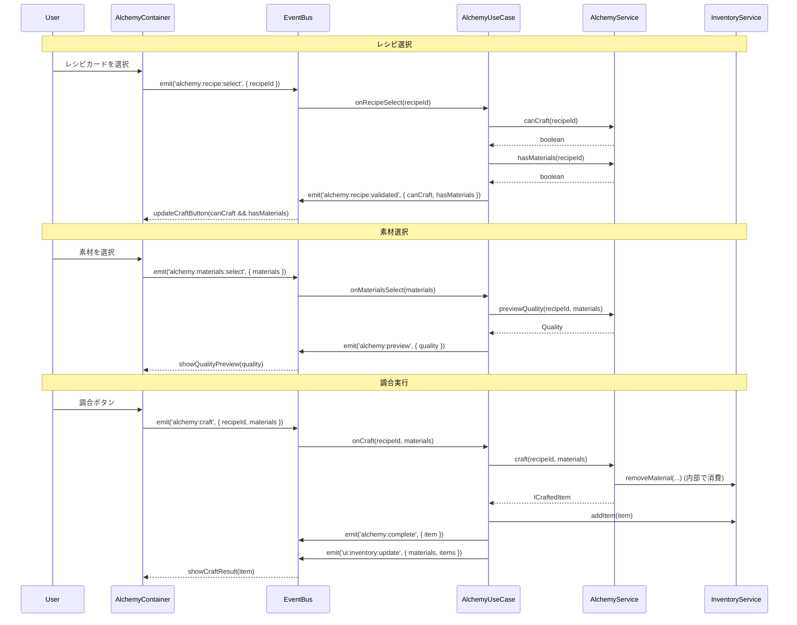
```mermaid
sequenceDiagram
    participant U as User
    participant AC as AlchemyContainer
    participant EB as EventBus
    participant AUC as AlchemyUseCase
    participant AS as AlchemyService
    participant IS as InventoryService

    Note over U,IS: レシピ選択
    U->>AC: レシピカードを選択
    AC->>EB: emit('alchemy:recipe:select', { recipeId })

    EB->>AUC: onRecipeSelect(recipeId)
    AUC->>AS: canCraft(recipeId)
    AS-->>AUC: boolean
    AUC->>AS: hasMaterials(recipeId)
    AS-->>AUC: boolean

    AUC->>EB: emit('alchemy:recipe:validated', { canCraft, hasMaterials })
    EB-->>AC: updateCraftButton(canCraft && hasMaterials)

    Note over U,IS: 素材選択
    U->>AC: 素材を選択
    AC->>EB: emit('alchemy:materials:select', { materials })

    EB->>AUC: onMaterialsSelect(materials)
    AUC->>AS: previewQuality(recipeId, materials)
    AS-->>AUC: Quality

    AUC->>EB: emit('alchemy:preview', { quality })
    EB-->>AC: showQualityPreview(quality)

    Note over U,IS: 調合実行
    U->>AC: 調合ボタン
    AC->>EB: emit('alchemy:craft', { recipeId, materials })

    EB->>AUC: onCraft(recipeId, materials)
    AUC->>AS: craft(recipeId, materials)
    AS->>IS: removeMaterial(...) (内部で消費)
    AS-->>AUC: ICraftedItem

    AUC->>IS: addItem(item)
    AUC->>EB: emit('alchemy:complete', { item })
    AUC->>EB: emit('ui:inventory:update', { materials, items })

    EB-->>AC: showCraftResult(item)
```

### 2.4 納品フロー

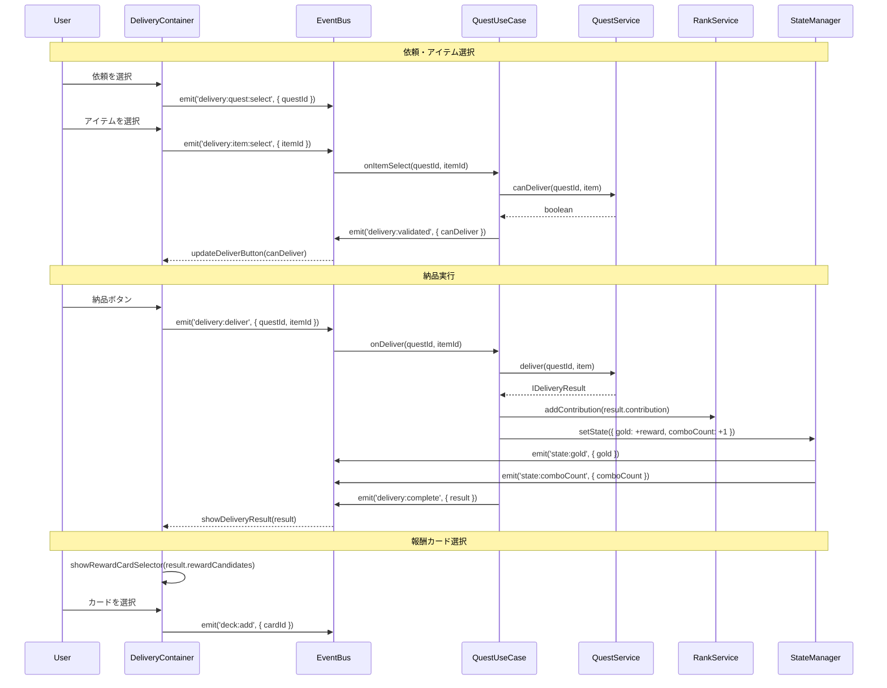
```mermaid
sequenceDiagram
    participant U as User
    participant DC as DeliveryContainer
    participant EB as EventBus
    participant QUC as QuestUseCase
    participant QS as QuestService
    participant RS as RankService
    participant SM as StateManager

    Note over U,SM: 依頼・アイテム選択
    U->>DC: 依頼を選択
    DC->>EB: emit('delivery:quest:select', { questId })

    U->>DC: アイテムを選択
    DC->>EB: emit('delivery:item:select', { itemId })

    EB->>QUC: onItemSelect(questId, itemId)
    QUC->>QS: canDeliver(questId, item)
    QS-->>QUC: boolean

    QUC->>EB: emit('delivery:validated', { canDeliver })
    EB-->>DC: updateDeliverButton(canDeliver)

    Note over U,SM: 納品実行
    U->>DC: 納品ボタン
    DC->>EB: emit('delivery:deliver', { questId, itemId })

    EB->>QUC: onDeliver(questId, itemId)
    QUC->>QS: deliver(questId, item)
    QS-->>QUC: IDeliveryResult

    QUC->>RS: addContribution(result.contribution)

    QUC->>SM: setState({ gold: +reward, comboCount: +1 })
    SM->>EB: emit('state:gold', { gold })
    SM->>EB: emit('state:comboCount', { comboCount })

    QUC->>EB: emit('delivery:complete', { result })
    EB-->>DC: showDeliveryResult(result)

    Note over U,SM: 報酬カード選択
    DC->>DC: showRewardCardSelector(result.rewardCandidates)
    U->>DC: カードを選択
    DC->>EB: emit('deck:add', { cardId })
```

---

## 3. 状態管理フロー 🟡

### 3.1 StateManager データフロー

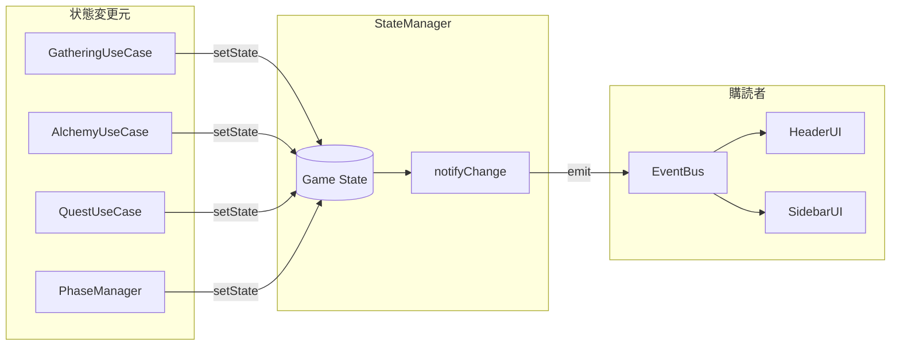
```mermaid
flowchart LR
    subgraph Sources["状態変更元"]
        UC1[GatheringUseCase]
        UC2[AlchemyUseCase]
        UC3[QuestUseCase]
        UC4[PhaseManager]
    end

    subgraph StateManager["StateManager"]
        State[(Game State)]
        Notify[notifyChange]
    end

    subgraph Subscribers["購読者"]
        EB[EventBus]
        Header[HeaderUI]
        Sidebar[SidebarUI]
    end

    UC1 -->|setState| State
    UC2 -->|setState| State
    UC3 -->|setState| State
    UC4 -->|setState| State

    State --> Notify
    Notify -->|emit| EB
    EB --> Header
    EB --> Sidebar
```

### 3.2 状態オブジェクト構造

```typescript
interface IGameState {
    // 日付・時間
    currentDay: number;           // 現在の日
    remainingDays: number;        // 残り日数
    currentPhase: Phase;          // 現在のフェーズ

    // ランク
    currentRank: GuildRank;       // 現在のギルドランク
    promotionGauge: number;       // 昇格ゲージ（0-100%）
    requiredContribution: number; // 昇格に必要な貢献度

    // リソース
    gold: number;                 // 所持金
    actionPoints: number;         // 行動ポイント（1日3）

    // ゲームプレイ
    comboCount: number;           // 連続納品数
    isPromotionTest: boolean;     // 昇格試験中フラグ

    // UI状態
    selectedQuestId: string | null;
    selectedCardId: string | null;
}
```

### 3.3 状態変更パターン

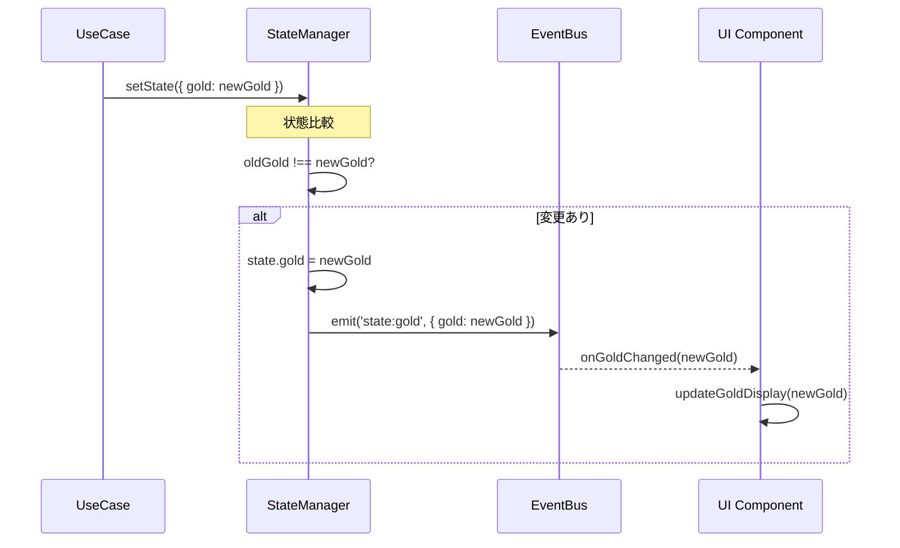
```mermaid
sequenceDiagram
    participant UC as UseCase
    participant SM as StateManager
    participant EB as EventBus
    participant UI as UI Component

    UC->>SM: setState({ gold: newGold })

    Note over SM: 状態比較
    SM->>SM: oldGold !== newGold?

    alt 変更あり
        SM->>SM: state.gold = newGold
        SM->>EB: emit('state:gold', { gold: newGold })
        EB-->>UI: onGoldChanged(newGold)
        UI->>UI: updateGoldDisplay(newGold)
    end
```

---

## 4. セーブ・ロードフロー 🔵

### 4.1 セーブフロー

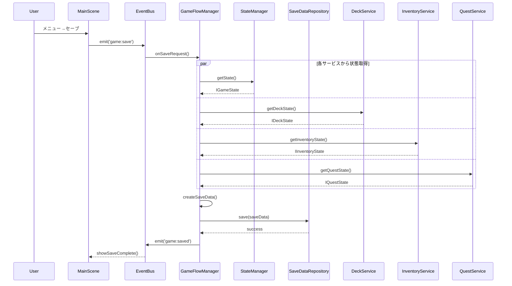
```mermaid
sequenceDiagram
    participant U as User
    participant MS as MainScene
    participant EB as EventBus
    participant GFM as GameFlowManager
    participant SM as StateManager
    participant SDR as SaveDataRepository
    participant DS as DeckService
    participant IS as InventoryService
    participant QS as QuestService

    U->>MS: メニュー→セーブ
    MS->>EB: emit('game:save')

    EB->>GFM: onSaveRequest()

    par 各サービスから状態取得
        GFM->>SM: getState()
        SM-->>GFM: IGameState
    and
        GFM->>DS: getDeckState()
        DS-->>GFM: IDeckState
    and
        GFM->>IS: getInventoryState()
        IS-->>GFM: IInventoryState
    and
        GFM->>QS: getQuestState()
        QS-->>GFM: IQuestState
    end

    GFM->>GFM: createSaveData()
    GFM->>SDR: save(saveData)
    SDR-->>GFM: success

    GFM->>EB: emit('game:saved')
    EB-->>MS: showSaveComplete()
```

### 4.2 ロードフロー

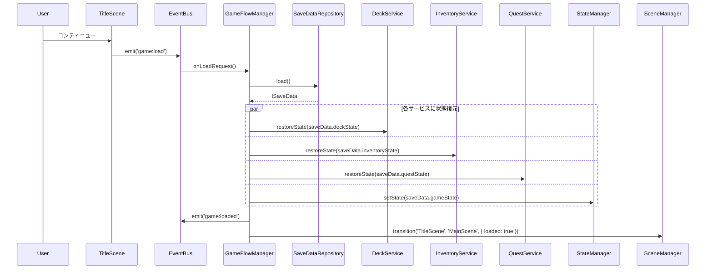
```mermaid
sequenceDiagram
    participant U as User
    participant TS as TitleScene
    participant EB as EventBus
    participant GFM as GameFlowManager
    participant SDR as SaveDataRepository
    participant DS as DeckService
    participant IS as InventoryService
    participant QS as QuestService
    participant SM as StateManager
    participant ScM as SceneManager

    U->>TS: コンティニュー
    TS->>EB: emit('game:load')

    EB->>GFM: onLoadRequest()
    GFM->>SDR: load()
    SDR-->>GFM: ISaveData

    par 各サービスに状態復元
        GFM->>DS: restoreState(saveData.deckState)
    and
        GFM->>IS: restoreState(saveData.inventoryState)
    and
        GFM->>QS: restoreState(saveData.questState)
    and
        GFM->>SM: setState(saveData.gameState)
    end

    GFM->>EB: emit('game:loaded')
    GFM->>ScM: transition('TitleScene', 'MainScene', { loaded: true })
```

---

## 5. フェーズ遷移フロー 🔵

### 5.1 1日のフェーズサイクル

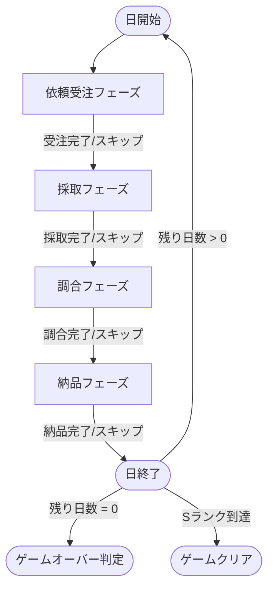
```mermaid
flowchart TB
    Start([日開始]) --> QA[依頼受注フェーズ]

    QA -->|受注完了/スキップ| G[採取フェーズ]
    G -->|採取完了/スキップ| A[調合フェーズ]
    A -->|調合完了/スキップ| D[納品フェーズ]
    D -->|納品完了/スキップ| End([日終了])

    End -->|残り日数 > 0| Start
    End -->|残り日数 = 0| GameOver([ゲームオーバー判定])
    End -->|Sランク到達| GameClear([ゲームクリア])
```

### 5.2 フェーズ遷移シーケンス

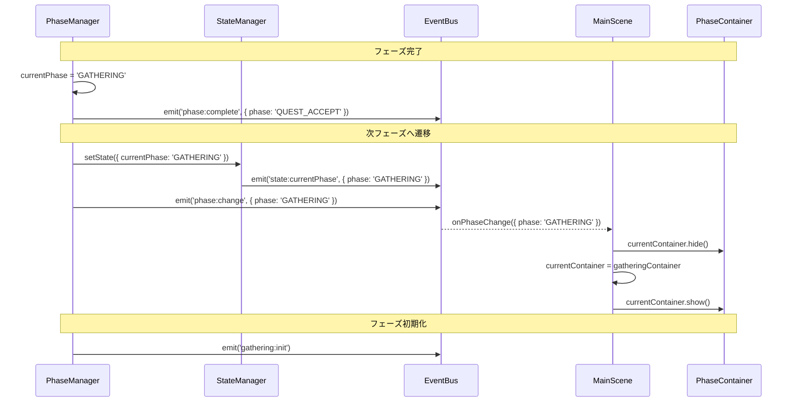
```mermaid
sequenceDiagram
    participant PM as PhaseManager
    participant SM as StateManager
    participant EB as EventBus
    participant MS as MainScene
    participant PC as PhaseContainer

    Note over PM,PC: フェーズ完了
    PM->>PM: currentPhase = 'GATHERING'
    PM->>EB: emit('phase:complete', { phase: 'QUEST_ACCEPT' })

    Note over PM,PC: 次フェーズへ遷移
    PM->>SM: setState({ currentPhase: 'GATHERING' })
    SM->>EB: emit('state:currentPhase', { phase: 'GATHERING' })

    PM->>EB: emit('phase:change', { phase: 'GATHERING' })
    EB-->>MS: onPhaseChange({ phase: 'GATHERING' })

    MS->>PC: currentContainer.hide()
    MS->>MS: currentContainer = gatheringContainer
    MS->>PC: currentContainer.show()

    Note over PM,PC: フェーズ初期化
    PM->>EB: emit('gathering:init')
```

---

## 6. マスターデータフロー 🔵

### 6.1 マスターデータロード

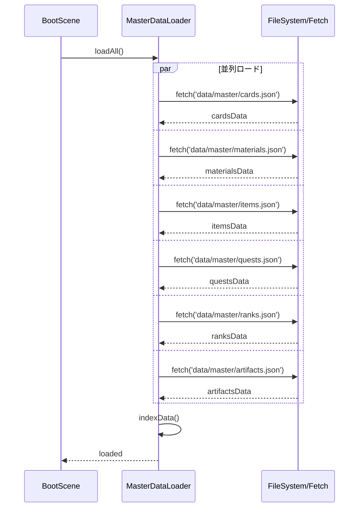
```mermaid
sequenceDiagram
    participant BS as BootScene
    participant MDL as MasterDataLoader
    participant FS as FileSystem/Fetch

    BS->>MDL: loadAll()

    par 並列ロード
        MDL->>FS: fetch('data/master/cards.json')
        FS-->>MDL: cardsData
    and
        MDL->>FS: fetch('data/master/materials.json')
        FS-->>MDL: materialsData
    and
        MDL->>FS: fetch('data/master/items.json')
        FS-->>MDL: itemsData
    and
        MDL->>FS: fetch('data/master/quests.json')
        FS-->>MDL: questsData
    and
        MDL->>FS: fetch('data/master/ranks.json')
        FS-->>MDL: ranksData
    and
        MDL->>FS: fetch('data/master/artifacts.json')
        FS-->>MDL: artifactsData
    end

    MDL->>MDL: indexData()
    MDL-->>BS: loaded
```

### 6.2 マスターデータアクセスパターン

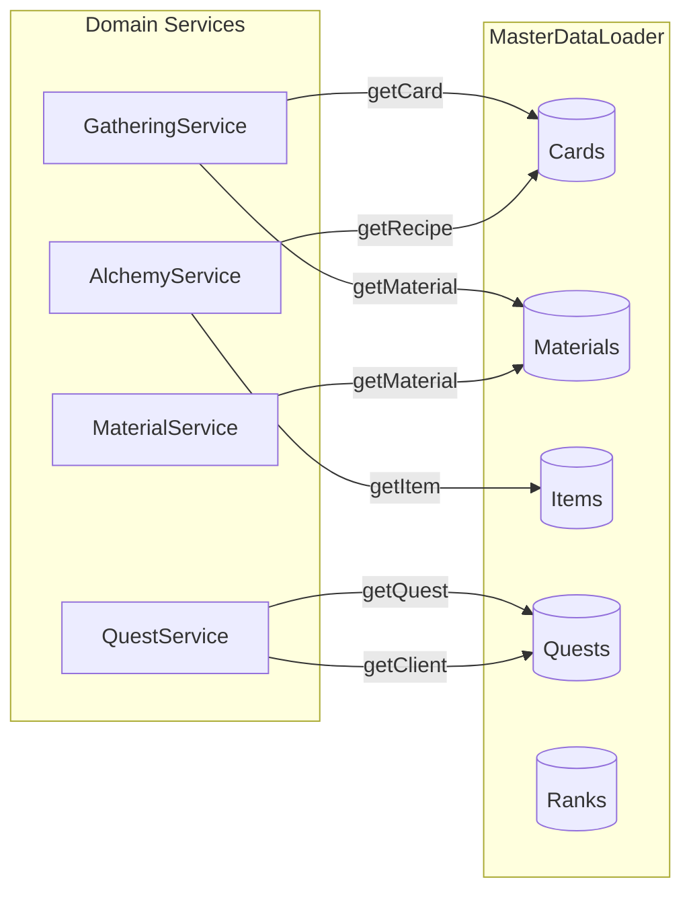
```mermaid
flowchart LR
    subgraph Services["Domain Services"]
        GS[GatheringService]
        AS[AlchemyService]
        QS[QuestService]
        MS[MaterialService]
    end

    subgraph MDL["MasterDataLoader"]
        Cards[(Cards)]
        Materials[(Materials)]
        Items[(Items)]
        Quests[(Quests)]
        Ranks[(Ranks)]
    end

    GS -->|getCard| Cards
    GS -->|getMaterial| Materials
    AS -->|getRecipe| Cards
    AS -->|getItem| Items
    QS -->|getQuest| Quests
    QS -->|getClient| Quests
    MS -->|getMaterial| Materials
```

---

## 7. インベントリデータフロー 🔵

### 7.1 素材追加フロー

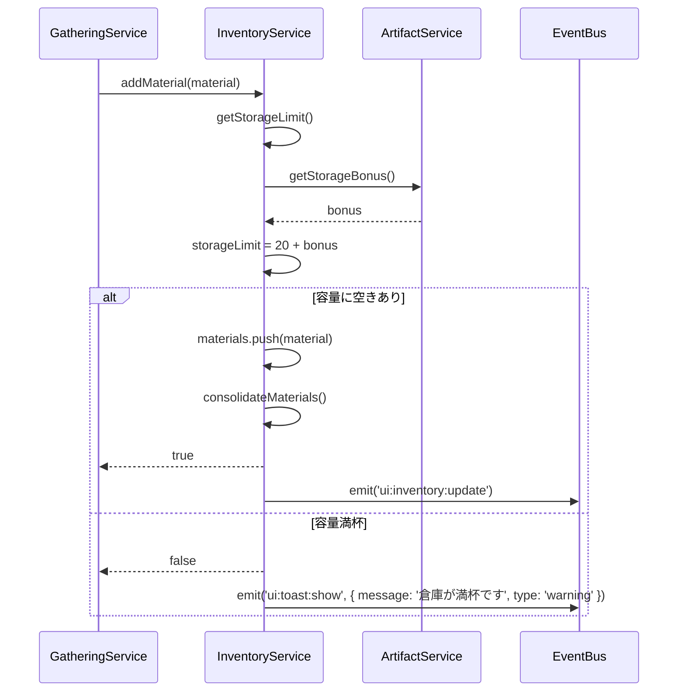
```mermaid
sequenceDiagram
    participant GS as GatheringService
    participant IS as InventoryService
    participant AFS as ArtifactService
    participant EB as EventBus

    GS->>IS: addMaterial(material)

    IS->>IS: getStorageLimit()
    IS->>AFS: getStorageBonus()
    AFS-->>IS: bonus

    IS->>IS: storageLimit = 20 + bonus

    alt 容量に空きあり
        IS->>IS: materials.push(material)
        IS->>IS: consolidateMaterials()
        IS-->>GS: true

        IS->>EB: emit('ui:inventory:update')
    else 容量満杯
        IS-->>GS: false
        IS->>EB: emit('ui:toast:show', { message: '倉庫が満杯です', type: 'warning' })
    end
```

### 7.2 アイテム消費フロー

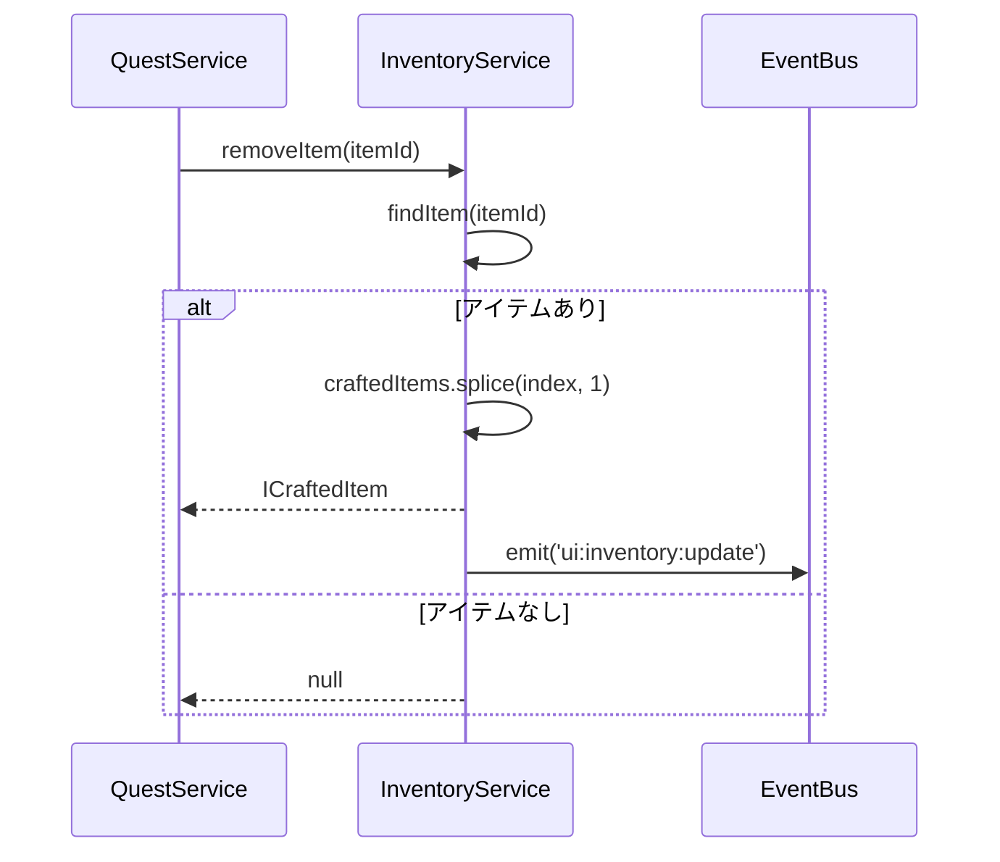
```mermaid
sequenceDiagram
    participant QS as QuestService
    participant IS as InventoryService
    participant EB as EventBus

    QS->>IS: removeItem(itemId)

    IS->>IS: findItem(itemId)

    alt アイテムあり
        IS->>IS: craftedItems.splice(index, 1)
        IS-->>QS: ICraftedItem

        IS->>EB: emit('ui:inventory:update')
    else アイテムなし
        IS-->>QS: null
    end
```

---

## 8. ランク・貢献度フロー 🔵

### 8.1 貢献度加算フロー

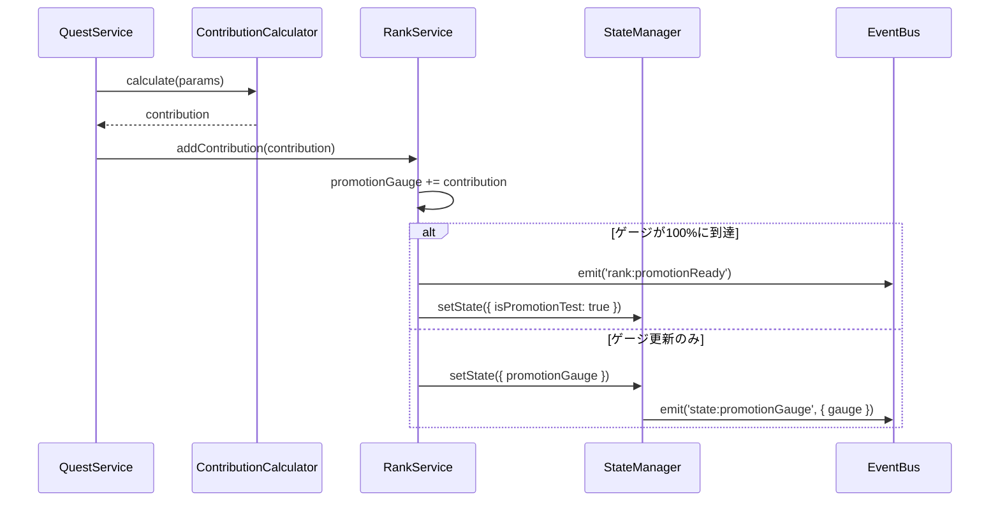
```mermaid
sequenceDiagram
    participant QS as QuestService
    participant CC as ContributionCalculator
    participant RS as RankService
    participant SM as StateManager
    participant EB as EventBus

    QS->>CC: calculate(params)
    CC-->>QS: contribution

    QS->>RS: addContribution(contribution)

    RS->>RS: promotionGauge += contribution

    alt ゲージが100%に到達
        RS->>EB: emit('rank:promotionReady')
        RS->>SM: setState({ isPromotionTest: true })
    else ゲージ更新のみ
        RS->>SM: setState({ promotionGauge })
        SM->>EB: emit('state:promotionGauge', { gauge })
    end
```

### 8.2 昇格フロー

```mermaid
sequenceDiagram
    participant U as User
    participant RUS as RankUpScene
    participant EB as EventBus
    participant RS as RankService
    participant SM as StateManager
    participant ScM as SceneManager

    Note over U,ScM: 昇格試験クリア
    U->>RUS: 試験完了
    RUS->>EB: emit('rank:test:complete')

    EB->>RS: completePromotionTest()
    RS->>RS: currentRank = getNextRank()
    RS->>RS: promotionGauge = 0
    RS->>RS: requiredContribution = getNewRequired()

    RS->>SM: setState({
        currentRank: newRank,
        promotionGauge: 0,
        requiredContribution: newRequired
    })

    SM->>EB: emit('state:currentRank', { rank: newRank })

    alt Sランク到達
        RS->>EB: emit('game:clear')
        EB->>ScM: transition('RankUpScene', 'GameClearScene')
    else 次のランクへ
        RS->>EB: emit('rank:up', { newRank })
        EB->>ScM: transition('RankUpScene', 'MainScene')
    end
```

---

## 9. エラーハンドリングフロー 🔴

### 9.1 エラー伝播パターン

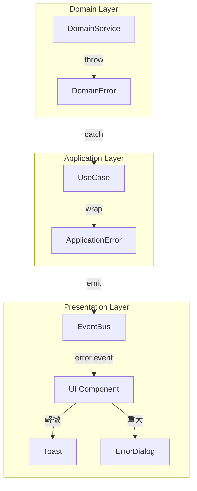
```mermaid
flowchart TB
    subgraph Domain["Domain Layer"]
        DS[DomainService]
        Error1[DomainError]
    end

    subgraph Application["Application Layer"]
        UC[UseCase]
        Error2[ApplicationError]
    end

    subgraph Presentation["Presentation Layer"]
        EB[EventBus]
        UI[UI Component]
        Toast[Toast]
        Dialog[ErrorDialog]
    end

    DS -->|throw| Error1
    Error1 -->|catch| UC
    UC -->|wrap| Error2
    Error2 -->|emit| EB
    EB -->|error event| UI
    UI -->|軽微| Toast
    UI -->|重大| Dialog
```

### 9.2 エラーハンドリング例

```typescript
// UseCase内でのエラーハンドリング
class GatheringUseCase {
    async onStartGathering(data: { cardId: string }): Promise<void> {
        try {
            const session = this.gatheringService.startDraftGathering(data.cardId);
            EventBus.emit('gathering:session', { session });
        } catch (error) {
            if (error instanceof InsufficientActionPointsError) {
                EventBus.emit('ui:toast:show', {
                    message: '行動ポイントが足りません',
                    type: 'warning'
                });
            } else if (error instanceof CardNotInHandError) {
                EventBus.emit('ui:toast:show', {
                    message: 'カードが手札にありません',
                    type: 'error'
                });
            } else {
                // 予期しないエラー
                console.error('Unexpected error:', error);
                EventBus.emit('ui:dialog:open', {
                    type: 'error',
                    data: {
                        title: 'エラー',
                        message: '予期しないエラーが発生しました',
                        onClose: () => EventBus.emit('game:reset')
                    }
                });
            }
        }
    }
}
```

---

## 10. パフォーマンス最適化 🔴

### 10.1 イベントバッチング

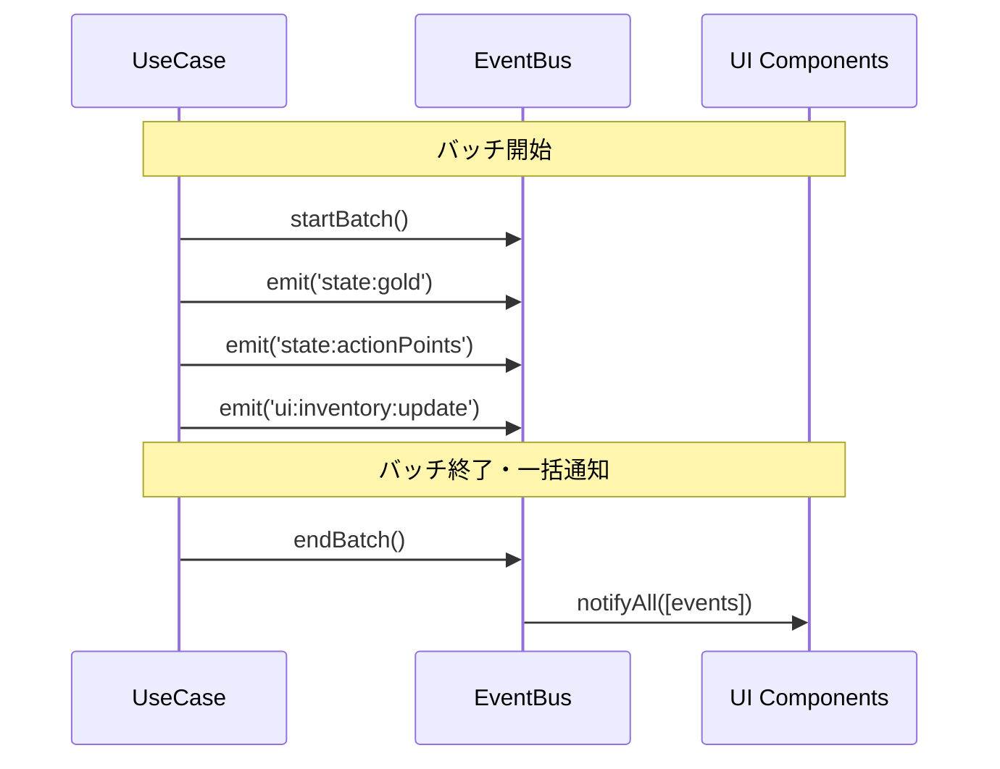
```mermaid
sequenceDiagram
    participant UC as UseCase
    participant EB as EventBus
    participant UI as UI Components

    Note over UC,UI: バッチ開始
    UC->>EB: startBatch()

    UC->>EB: emit('state:gold')
    UC->>EB: emit('state:actionPoints')
    UC->>EB: emit('ui:inventory:update')

    Note over UC,UI: バッチ終了・一括通知
    UC->>EB: endBatch()
    EB->>UI: notifyAll([events])
```

### 10.2 遅延ロード

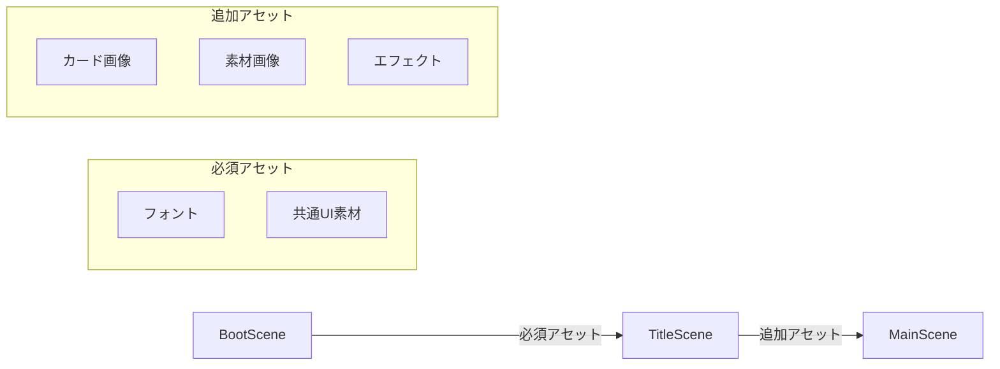
```mermaid
flowchart LR
    Boot[BootScene] -->|必須アセット| Title[TitleScene]
    Title -->|追加アセット| Main[MainScene]

    subgraph "必須アセット"
        Font[フォント]
        CommonUI[共通UI素材]
    end

    subgraph "追加アセット"
        Cards[カード画像]
        Materials[素材画像]
        Effects[エフェクト]
    end
```

---

## 関連文書

- **アーキテクチャ設計書**: [architecture.md](architecture.md)
- **コアシステム設計書**: [core-systems.md](core-systems.md)
- **データスキーマ設計書**: [../atelier-guild-rank/data-schema.md](../atelier-guild-rank/data-schema.md)
- **UI設計概要**: [ui-design/overview.md](ui-design/overview.md)

---

## 変更履歴

| 日付 | バージョン | 変更内容 |
|------|----------|---------|
| 2026-01-07 | 1.0.0 | 初版作成 |
