# コアシステム設計書

**バージョン**: 1.4.0
**作成日**: 2026-01-01
**更新日**: 2026-01-14
**対象**: アトリエ錬金術ゲーム（ギルドランク制）HTML版・Phaser版

---

## 概要

本ドキュメントは、ゲームの核となるシステム（サービス）の詳細設計を定義する。
ドメインレイヤーのサービスはHTML版・Phaser版で共通であり、Phaser版固有のGame層とイベント連携も含める。

### 信頼性レベル凡例

- 🔵 **青信号**: 要件定義書に詳細記載
- 🟡 **黄信号**: 要件定義書から妥当な推測
- 🔴 **赤信号**: 要件定義書にない推測

---

## 1. システム構成概要

### 1.1 レイヤー構成

```
┌─────────────────────────────────────────────────────────────┐
│                    Presentation Layer                        │
│  (Phaser Scenes, UI Components, EventBus) / (React/HTML)    │
├─────────────────────────────────────────────────────────────┤
│                    Application Layer                         │
│  (GameFlowManager, PhaseManager, UseCases, StateManager)    │
├─────────────────────────────────────────────────────────────┤
│                      Domain Layer                            │
│  (DeckService, GatheringService, AlchemyService, etc.)      │
├─────────────────────────────────────────────────────────────┤
│                   Infrastructure Layer                       │
│  (MasterDataLoader, SaveDataRepository, RandomGenerator)    │
└─────────────────────────────────────────────────────────────┘
```

### 1.2 システム一覧

| システム名 | 責務 | レイヤー | Phaser連携 | 依存システム |
|-----------|------|---------|-----------|-------------|
| **Phaser固有** |||||
| SceneManager | シーン遷移管理 | Presentation | ○ | - |
| EventBus | イベント配信 | Presentation | ○ | - |
| UIFactory | UIコンポーネント生成 | Presentation | ○ | - |
| **Application** |||||
| GameFlowManager | ゲーム進行制御 | Application | EventBus経由 | PhaseManager, StateManager |
| PhaseManager | フェーズ遷移制御 | Application | EventBus経由 | DeckService, GatheringService, AlchemyService |
| StateManager | ゲーム状態管理 | Application | EventBus経由 | - |
| **Domain（共通）** |||||
| DeckService | デッキ操作・管理 | Domain | - | RandomGenerator |
| GatheringService | 採取処理 | Domain | - | DeckService, MaterialService, InventoryService, ArtifactService |
| AlchemyService | 調合処理 | Domain | - | DeckService, MaterialService, InventoryService, ArtifactService |
| QuestService | 依頼管理 | Domain | - | InventoryService, ContributionCalculator |
| ContributionCalculator | 貢献度計算 | Domain | - | ArtifactService |
| RankService | ランク管理 | Domain | - | QuestService |
| ShopService | ショップ機能 | Domain | - | DeckService, InventoryService |
| ArtifactService | アーティファクト管理 | Domain | - | MasterDataLoader |
| MaterialService | 素材の品質・属性計算 | Domain | - | MasterDataLoader, RandomGenerator |
| InventoryService | インベントリ管理 | Domain | - | ArtifactService |

---

## 2. EventBus（イベントバス） 🟡

### 2.1 責務

Phaserシーン（Presentation層）とApplication層の疎結合な連携を実現する。

### 2.2 クラス図

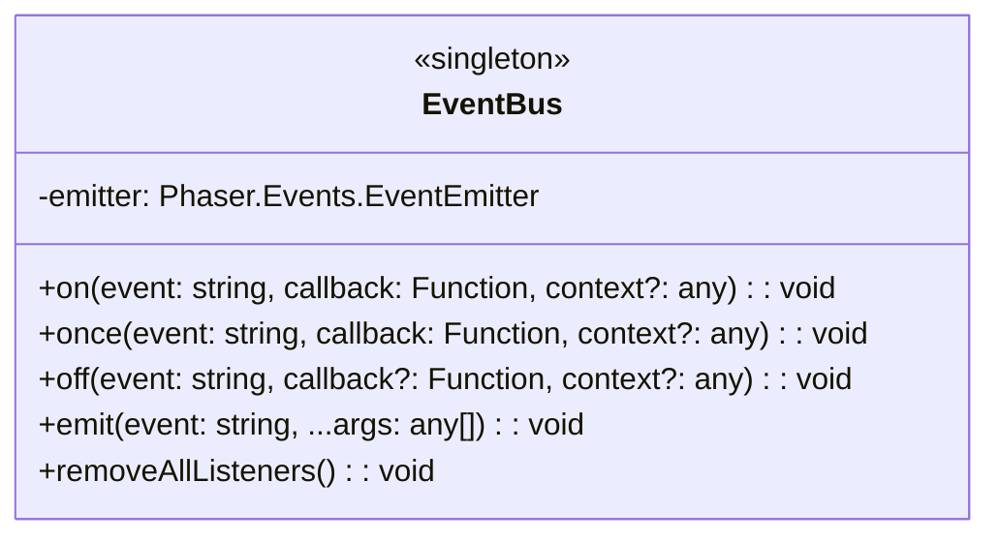
```mermaid
classDiagram
    class EventBus {
        <<singleton>>
        -emitter: Phaser.Events.EventEmitter
        +on(event: string, callback: Function, context?: any): void
        +once(event: string, callback: Function, context?: any): void
        +off(event: string, callback?: Function, context?: any): void
        +emit(event: string, ...args: any[]): void
        +removeAllListeners(): void
    }
```

### 2.3 イベント定義 🔵

| イベント名 | 発火元 | データ | 説明 |
|-----------|-------|--------|------|
| **ゲームフロー** ||||
| `game:start` | TitleScene | { isNewGame: boolean } | ゲーム開始 |
| `game:save` | MainScene | - | セーブ要求 |
| `game:load` | TitleScene | - | ロード要求 |
| `game:over` | RankService | { reason: string } | ゲームオーバー |
| `game:clear` | RankService | { stats: IGameStats } | ゲームクリア |
| **フェーズ遷移** ||||
| `phase:change` | PhaseManager | { phase: Phase } | フェーズ変更 |
| `phase:complete` | PhaseManager | { phase: Phase } | フェーズ完了 |
| `day:start` | PhaseManager | { day: number } | 日開始 |
| `day:end` | PhaseManager | { day: number } | 日終了 |
| **依頼関連** ||||
| `quest:generated` | QuestService | { quests: IQuest[] } | 日毎依頼生成 |
| `quest:accepted` | QuestService | { questId: string } | 依頼受注 |
| `quest:delivered` | QuestService | { result: IDeliveryResult } | 納品完了 |
| `quest:expired` | QuestService | { questId: string } | 期限切れ |
| **採取関連** ||||
| `gathering:start` | GatheringService | { session: IDraftSession } | 採取開始 |
| `gathering:options` | GatheringService | { options: IMaterialOption[] } | 素材提示 |
| `gathering:selected` | GatheringService | { material: IMaterialInstance } | 素材選択 |
| `gathering:end` | GatheringService | { result: IGatheringResult } | 採取終了 |
| **調合関連** ||||
| `alchemy:start` | AlchemyService | { recipeId: string } | 調合開始 |
| `alchemy:complete` | AlchemyService | { item: ICraftedItem } | 調合完了 |
| **デッキ関連** ||||
| `deck:draw` | DeckService | { cards: string[] } | ドロー |
| `deck:play` | DeckService | { cardId: string } | カード使用 |
| `deck:add` | DeckService | { cardId: string } | カード追加 |
| `deck:shuffle` | DeckService | - | シャッフル |
| **ランク関連** ||||
| `rank:contribution` | RankService | { amount: number, total: number } | 貢献度追加 |
| `rank:promotionReady` | RankService | - | 昇格準備完了 |
| `rank:up` | RankService | { newRank: GuildRank } | ランクアップ |
| **UI関連** ||||
| `ui:dialog:open` | Scene | { type: string, data: any } | ダイアログ開く |
| `ui:dialog:close` | Scene | { type: string } | ダイアログ閉じる |
| `ui:toast:show` | Scene | { message: string, type: string } | トースト表示 |
| `ui:inventory:update` | InventoryService | { materials: [], items: [] } | インベントリ更新 |

### 2.4 使用例

```typescript
// イベント発火（Application層）
EventBus.emit('phase:change', { phase: 'GATHERING' });

// イベント購読（Presentation層）
EventBus.on('phase:change', (data: { phase: Phase }) => {
    this.switchPhaseContainer(data.phase);
}, this);

// イベント購読解除（シーン終了時）
EventBus.off('phase:change', this.onPhaseChange, this);
```

---

## 3. SceneManager（シーン管理） 🟡

### 3.1 責務

Phaserシーン間の遷移とデータ受け渡しを管理する。

### 3.2 クラス図

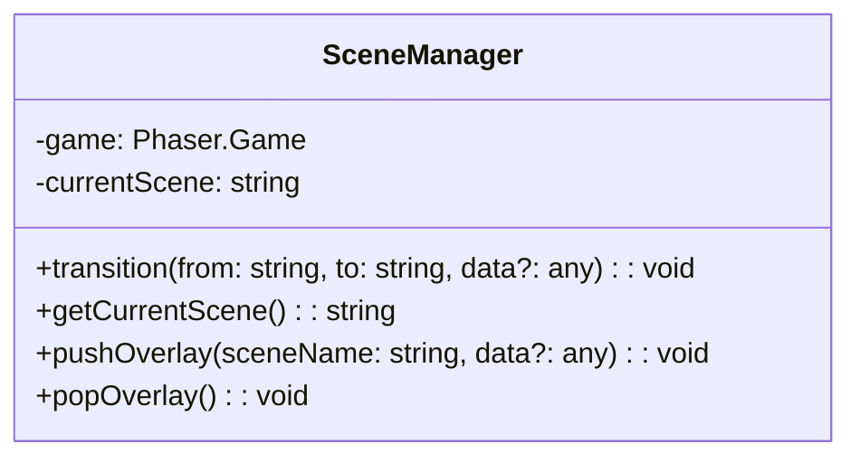
```mermaid
classDiagram
    class SceneManager {
        -game: Phaser.Game
        -currentScene: string
        +transition(from: string, to: string, data?: any): void
        +getCurrentScene(): string
        +pushOverlay(sceneName: string, data?: any): void
        +popOverlay(): void
    }
```

### 3.3 シーン遷移パターン 🔵

```typescript
// フェード遷移
transition(from: string, to: string, data?: any): void {
    const fromScene = this.game.scene.getScene(from);
    const toScene = this.game.scene.getScene(to);

    // フェードアウト
    fromScene.cameras.main.fadeOut(300, 0, 0, 0);
    fromScene.cameras.main.once('camerafadeoutcomplete', () => {
        // シーン切り替え
        this.game.scene.stop(from);
        this.game.scene.start(to, data);
        this.currentScene = to;

        // フェードイン
        const newScene = this.game.scene.getScene(to);
        newScene.cameras.main.fadeIn(300, 0, 0, 0);
    });
}

// オーバーレイ（ショップなど）
pushOverlay(sceneName: string, data?: any): void {
    this.game.scene.launch(sceneName, data);
    this.game.scene.bringToTop(sceneName);
}

popOverlay(): void {
    // 現在のオーバーレイを閉じる
    const overlayScene = this.game.scene.getScene(this.currentOverlay);
    overlayScene?.scene.stop();
}
```

---

## 4. UIFactory（UI生成ファクトリ） 🟡

### 4.1 責務

rexUIを使用した共通UIコンポーネントの生成を一元化する。

### 4.2 クラス図

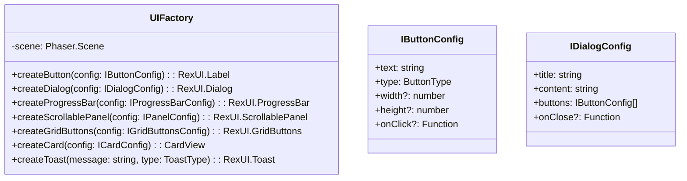
```mermaid
classDiagram
    class UIFactory {
        -scene: Phaser.Scene
        +createButton(config: IButtonConfig): RexUI.Label
        +createDialog(config: IDialogConfig): RexUI.Dialog
        +createProgressBar(config: IProgressBarConfig): RexUI.ProgressBar
        +createScrollablePanel(config: IPanelConfig): RexUI.ScrollablePanel
        +createGridButtons(config: IGridButtonsConfig): RexUI.GridButtons
        +createCard(config: ICardConfig): CardView
        +createToast(message: string, type: ToastType): RexUI.Toast
    }

    class IButtonConfig {
        +text: string
        +type: ButtonType
        +width?: number
        +height?: number
        +onClick?: Function
    }

    class IDialogConfig {
        +title: string
        +content: string
        +buttons: IButtonConfig[]
        +onClose?: Function
    }
```

### 4.3 ボタン生成 🟡

```typescript
createButton(config: IButtonConfig): RexUI.Label {
    const { text, type, width = 120, height = 40, onClick } = config;

    // ボタンタイプに応じた色設定
    const colors = this.getButtonColors(type);

    const button = this.scene.rexUI.add.label({
        width,
        height,
        background: this.scene.rexUI.add.roundRectangle(
            0, 0, 0, 0, 4, colors.background
        ).setStrokeStyle(2, colors.stroke),
        text: this.scene.add.text(0, 0, text, {
            fontFamily: 'NotoSansJP',
            fontSize: '16px',
            color: colors.text
        }),
        space: { left: 16, right: 16, top: 8, bottom: 8 },
        align: 'center'
    });

    // インタラクティブ設定
    button.setInteractive({ useHandCursor: true });

    // ホバーエフェクト
    button.on('pointerover', () => {
        button.getElement('background').setFillStyle(colors.hover);
    });
    button.on('pointerout', () => {
        button.getElement('background').setFillStyle(colors.background);
    });

    // クリックハンドラ
    if (onClick) {
        button.on('pointerdown', onClick);
    }

    return button;
}

private getButtonColors(type: ButtonType): IButtonColors {
    switch (type) {
        case 'primary':
            return { background: 0x8B4513, hover: 0xA0522D, stroke: 0x5D3A1A, text: '#ffffff' };
        case 'secondary':
            return { background: 0xF5F5DC, hover: 0xE0E0C0, stroke: 0x666666, text: '#333333' };
        case 'danger':
            return { background: 0xB22222, hover: 0xCD2626, stroke: 0x8B0000, text: '#ffffff' };
        case 'disabled':
            return { background: 0x808080, hover: 0x808080, stroke: 0x666666, text: '#999999' };
    }
}
```

### 4.4 ダイアログ生成 🟡

```typescript
createDialog(config: IDialogConfig): RexUI.Dialog {
    const { title, content, buttons, onClose } = config;

    const dialog = this.scene.rexUI.add.dialog({
        x: 640,
        y: 360,
        background: this.scene.rexUI.add.roundRectangle(0, 0, 0, 0, 12, 0xF5F5DC)
            .setStrokeStyle(2, 0x8B4513),
        title: this.createDialogTitle(title),
        content: this.createDialogContent(content),
        actions: buttons.map(btn => this.createButton(btn)),
        space: {
            title: 24,
            content: 24,
            action: 16,
            left: 24,
            right: 24,
            top: 24,
            bottom: 24
        },
        expand: { content: false }
    })
    .layout()
    .setDepth(400);

    // ポップアップアニメーション
    dialog.popUp(300);

    // 背景オーバーレイ
    const overlay = this.scene.add.rectangle(640, 360, 1280, 720, 0x000000, 0.5)
        .setDepth(399)
        .setInteractive();

    // 閉じる処理
    dialog.on('button.click', (button: any, groupName: string, index: number) => {
        overlay.destroy();
        dialog.scaleDownDestroy(200);
        if (onClose) {
            onClose(index);
        }
    });

    return dialog;
}
```

### 4.5 カード生成 🟡

```typescript
createCard(config: ICardConfig): CardView {
    const { cardId, cardType, isInteractive = true } = config;

    const cardView = new CardView(this.scene, 0, 0, cardId, cardType);

    if (isInteractive) {
        cardView.setInteractive({ useHandCursor: true });

        // ホバーエフェクト
        cardView.on('pointerover', () => {
            this.scene.tweens.add({
                targets: cardView,
                scaleX: 1.1,
                scaleY: 1.1,
                duration: 100,
                ease: 'Back.easeOut'
            });
        });

        cardView.on('pointerout', () => {
            this.scene.tweens.add({
                targets: cardView,
                scaleX: 1,
                scaleY: 1,
                duration: 100,
                ease: 'Power2'
            });
        });
    }

    return cardView;
}
```

---

## 5. PhaseContainerシステム 🟡

### 5.1 責務

メインシーン内でフェーズに応じたUIコンテナを切り替える。

### 5.2 クラス図

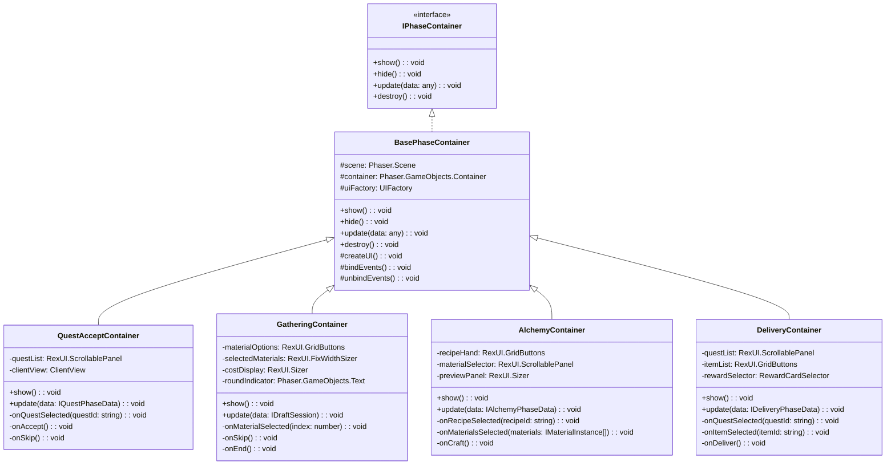
```mermaid
classDiagram
    class IPhaseContainer {
        <<interface>>
        +show(): void
        +hide(): void
        +update(data: any): void
        +destroy(): void
    }

    class BasePhaseContainer {
        #scene: Phaser.Scene
        #container: Phaser.GameObjects.Container
        #uiFactory: UIFactory
        +show(): void
        +hide(): void
        +update(data: any): void
        +destroy(): void
        #createUI(): void
        #bindEvents(): void
        #unbindEvents(): void
    }

    class QuestAcceptContainer {
        -questList: RexUI.ScrollablePanel
        -clientView: ClientView
        +show(): void
        +update(data: IQuestPhaseData): void
        -onQuestSelected(questId: string): void
        -onAccept(): void
        -onSkip(): void
    }

    class GatheringContainer {
        -materialOptions: RexUI.GridButtons
        -selectedMaterials: RexUI.FixWidthSizer
        -costDisplay: RexUI.Sizer
        -roundIndicator: Phaser.GameObjects.Text
        +show(): void
        +update(data: IDraftSession): void
        -onMaterialSelected(index: number): void
        -onSkip(): void
        -onEnd(): void
    }

    class AlchemyContainer {
        -recipeHand: RexUI.GridButtons
        -materialSelector: RexUI.ScrollablePanel
        -previewPanel: RexUI.Sizer
        +show(): void
        +update(data: IAlchemyPhaseData): void
        -onRecipeSelected(recipeId: string): void
        -onMaterialsSelected(materials: IMaterialInstance[]): void
        -onCraft(): void
    }

    class DeliveryContainer {
        -questList: RexUI.ScrollablePanel
        -itemList: RexUI.GridButtons
        -rewardSelector: RewardCardSelector
        +show(): void
        +update(data: IDeliveryPhaseData): void
        -onQuestSelected(questId: string): void
        -onItemSelected(itemId: string): void
        -onDeliver(): void
    }

    IPhaseContainer <|.. BasePhaseContainer
    BasePhaseContainer <|-- QuestAcceptContainer
    BasePhaseContainer <|-- GatheringContainer
    BasePhaseContainer <|-- AlchemyContainer
    BasePhaseContainer <|-- DeliveryContainer
```

### 5.3 フェーズコンテナ切り替え 🔵

```typescript
// MainScene内でのフェーズコンテナ管理
class MainScene extends Phaser.Scene {
    private phaseContainers: Map<Phase, IPhaseContainer> = new Map();
    private currentContainer: IPhaseContainer | null = null;

    create(): void {
        // フェーズコンテナの初期化
        this.phaseContainers.set('QUEST_ACCEPT', new QuestAcceptContainer(this));
        this.phaseContainers.set('GATHERING', new GatheringContainer(this));
        this.phaseContainers.set('ALCHEMY', new AlchemyContainer(this));
        this.phaseContainers.set('DELIVERY', new DeliveryContainer(this));

        // イベント購読
        EventBus.on('phase:change', this.onPhaseChange, this);
    }

    private onPhaseChange(data: { phase: Phase }): void {
        // 現在のコンテナを非表示
        if (this.currentContainer) {
            this.currentContainer.hide();
        }

        // 新しいコンテナを表示
        this.currentContainer = this.phaseContainers.get(data.phase) || null;
        if (this.currentContainer) {
            this.currentContainer.show();
        }
    }

    shutdown(): void {
        EventBus.off('phase:change', this.onPhaseChange, this);
        this.phaseContainers.forEach(container => container.destroy());
    }
}
```

---

## 6. StateManager（状態管理） 🟡

### 6.1 責務

ゲーム状態を一元管理し、状態変更をEventBus経由で通知する。

### 6.2 クラス図

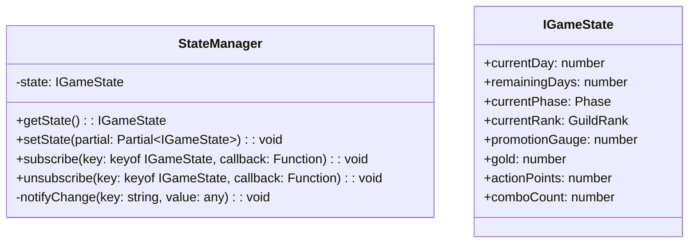
```mermaid
classDiagram
    class StateManager {
        -state: IGameState
        +getState(): IGameState
        +setState(partial: Partial~IGameState~): void
        +subscribe(key: keyof IGameState, callback: Function): void
        +unsubscribe(key: keyof IGameState, callback: Function): void
        -notifyChange(key: string, value: any): void
    }

    class IGameState {
        +currentDay: number
        +remainingDays: number
        +currentPhase: Phase
        +currentRank: GuildRank
        +promotionGauge: number
        +gold: number
        +actionPoints: number
        +comboCount: number
    }
```

### 6.3 状態変更と通知 🔵

```typescript
class StateManager {
    private state: IGameState;
    private subscribers: Map<string, Set<Function>> = new Map();

    setState(partial: Partial<IGameState>): void {
        for (const [key, value] of Object.entries(partial)) {
            const oldValue = this.state[key as keyof IGameState];
            if (oldValue !== value) {
                (this.state as any)[key] = value;
                this.notifyChange(key, value);
            }
        }
    }

    private notifyChange(key: string, value: any): void {
        // ローカル購読者への通知
        const subs = this.subscribers.get(key);
        if (subs) {
            subs.forEach(callback => callback(value));
        }

        // EventBus経由でUI層へ通知
        EventBus.emit(`state:${key}`, { [key]: value });
    }

    subscribe(key: keyof IGameState, callback: Function): void {
        if (!this.subscribers.has(key)) {
            this.subscribers.set(key, new Set());
        }
        this.subscribers.get(key)!.add(callback);
    }
}
```

---

## 7. DeckService 🔵

### 7.1 責務

デッキ（山札・手札・捨て札）の操作を担当する。

### 7.2 クラス図

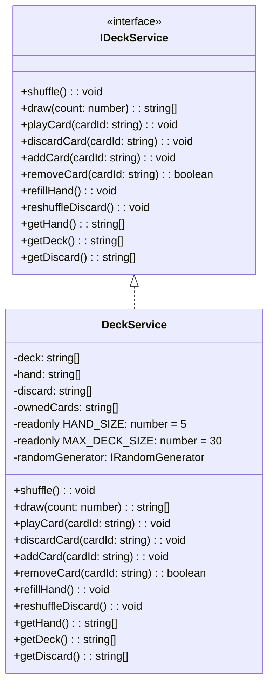
```mermaid
classDiagram
    class IDeckService {
        <<interface>>
        +shuffle(): void
        +draw(count: number): string[]
        +playCard(cardId: string): void
        +discardCard(cardId: string): void
        +addCard(cardId: string): void
        +removeCard(cardId: string): boolean
        +refillHand(): void
        +reshuffleDiscard(): void
        +getHand(): string[]
        +getDeck(): string[]
        +getDiscard(): string[]
    }

    class DeckService {
        -deck: string[]
        -hand: string[]
        -discard: string[]
        -ownedCards: string[]
        -readonly HAND_SIZE: number = 5
        -readonly MAX_DECK_SIZE: number = 30
        -randomGenerator: IRandomGenerator
        +shuffle(): void
        +draw(count: number): string[]
        +playCard(cardId: string): void
        +discardCard(cardId: string): void
        +addCard(cardId: string): void
        +removeCard(cardId: string): boolean
        +refillHand(): void
        +reshuffleDiscard(): void
        +getHand(): string[]
        +getDeck(): string[]
        +getDiscard(): string[]
    }

    IDeckService <|.. DeckService
```

### 7.3 主要メソッド

| メソッド | 引数 | 戻り値 | 説明 |
|---------|------|--------|------|
| shuffle | - | void | 山札をシャッフルする |
| draw | count: number | string[] | 山札から指定枚数ドローする |
| playCard | cardId: string | void | 手札からカードを使用し捨て札へ |
| discardCard | cardId: string | void | 手札からカードを捨て札へ |
| addCard | cardId: string | void | 新しいカードをデッキに追加 |
| removeCard | cardId: string | boolean | カードをデッキから削除 |
| refillHand | - | void | 手札を5枚まで補充 |
| reshuffleDiscard | - | void | 捨て札を山札に戻してシャッフル |

### 7.4 処理フロー

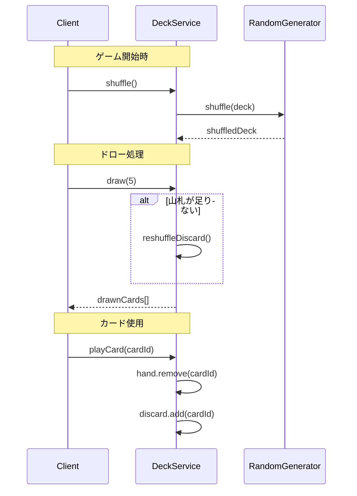
```mermaid
sequenceDiagram
    participant Client
    participant DeckService
    participant RandomGenerator

    Note over Client,DeckService: ゲーム開始時
    Client->>DeckService: shuffle()
    DeckService->>RandomGenerator: shuffle(deck)
    RandomGenerator-->>DeckService: shuffledDeck

    Note over Client,DeckService: ドロー処理
    Client->>DeckService: draw(5)
    alt 山札が足りない
        DeckService->>DeckService: reshuffleDiscard()
    end
    DeckService-->>Client: drawnCards[]

    Note over Client,DeckService: カード使用
    Client->>DeckService: playCard(cardId)
    DeckService->>DeckService: hand.remove(cardId)
    DeckService->>DeckService: discard.add(cardId)
```

---

## 8. GatheringService 🔵

### 8.1 責務

採取地カードを使用してドラフト採取を行い、素材を獲得する処理を担当する。

### 8.2 クラス図

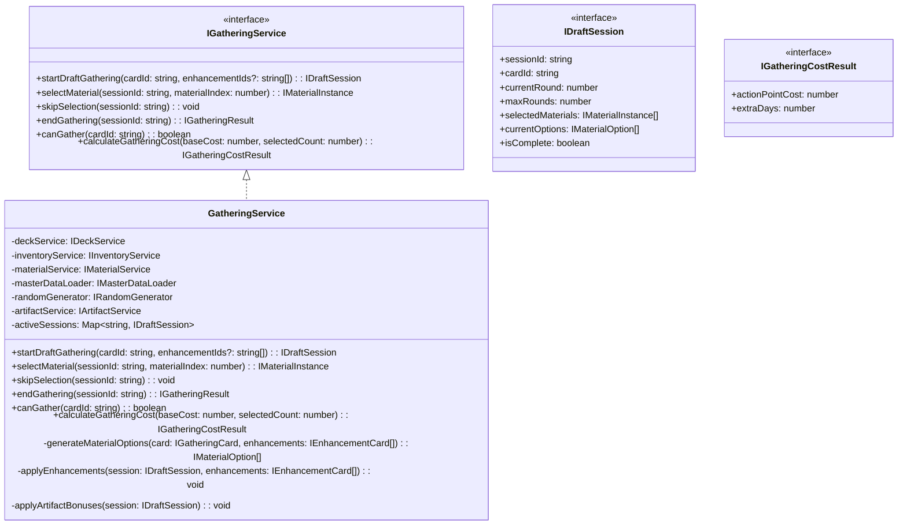
```mermaid
classDiagram
    class IGatheringService {
        <<interface>>
        +startDraftGathering(cardId: string, enhancementIds?: string[]): IDraftSession
        +selectMaterial(sessionId: string, materialIndex: number): IMaterialInstance
        +skipSelection(sessionId: string): void
        +endGathering(sessionId: string): IGatheringResult
        +canGather(cardId: string): boolean
        +calculateGatheringCost(baseCost: number, selectedCount: number): IGatheringCostResult
    }

    class GatheringService {
        -deckService: IDeckService
        -inventoryService: IInventoryService
        -materialService: IMaterialService
        -masterDataLoader: IMasterDataLoader
        -randomGenerator: IRandomGenerator
        -artifactService: IArtifactService
        -activeSessions: Map~string, IDraftSession~
        +startDraftGathering(cardId: string, enhancementIds?: string[]): IDraftSession
        +selectMaterial(sessionId: string, materialIndex: number): IMaterialInstance
        +skipSelection(sessionId: string): void
        +endGathering(sessionId: string): IGatheringResult
        +canGather(cardId: string): boolean
        +calculateGatheringCost(baseCost: number, selectedCount: number): IGatheringCostResult
        -generateMaterialOptions(card: IGatheringCard, enhancements: IEnhancementCard[]): IMaterialOption[]
        -applyEnhancements(session: IDraftSession, enhancements: IEnhancementCard[]): void
        -applyArtifactBonuses(session: IDraftSession): void
    }

    class IDraftSession {
        <<interface>>
        +sessionId: string
        +cardId: string
        +currentRound: number
        +maxRounds: number
        +selectedMaterials: IMaterialInstance[]
        +currentOptions: IMaterialOption[]
        +isComplete: boolean
    }

    class IGatheringCostResult {
        <<interface>>
        +actionPointCost: number
        +extraDays: number
    }

    IGatheringService <|.. GatheringService
```

### 8.3 主要メソッド

| メソッド | 引数 | 戻り値 | 説明 |
|---------|------|--------|------|
| startDraftGathering | cardId, enhancementIds? | IDraftSession | ドラフト採取セッションを開始 |
| selectMaterial | sessionId, materialIndex | IMaterialInstance | 提示された3つから1つを選択して獲得 |
| skipSelection | sessionId | void | 今回の提示をスキップ（何も選ばない） |
| endGathering | sessionId | IGatheringResult | 採取を終了しコストを計算 |
| canGather | cardId | boolean | 採取可能か判定 |
| calculateGatheringCost | baseCost, selectedCount | IGatheringCostResult | 採取コスト（行動ポイント＋追加日数）を計算 |

### 8.4 ドラフト採取の流れ 🔵

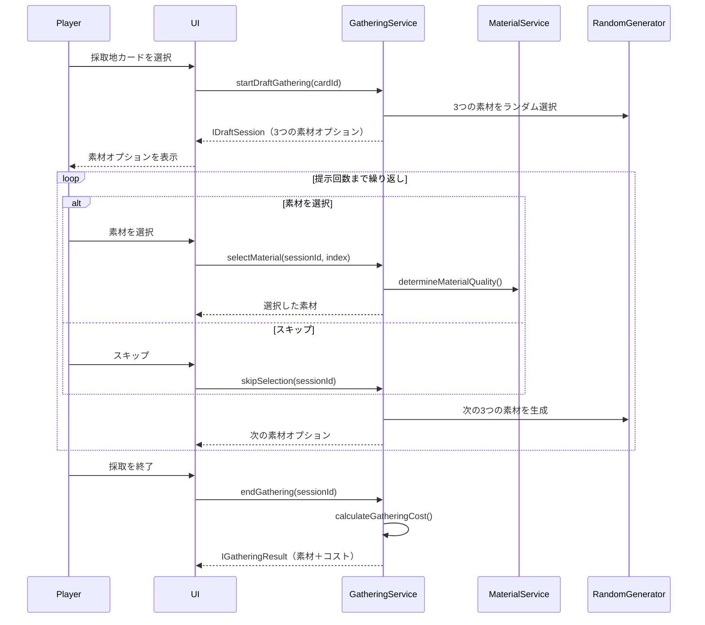
```mermaid
sequenceDiagram
    participant Player
    participant UI
    participant GatheringService
    participant MaterialService
    participant RandomGenerator

    Player->>UI: 採取地カードを選択
    UI->>GatheringService: startDraftGathering(cardId)
    GatheringService->>RandomGenerator: 3つの素材をランダム選択
    GatheringService-->>UI: IDraftSession（3つの素材オプション）
    UI-->>Player: 素材オプションを表示

    loop 提示回数まで繰り返し
        alt 素材を選択
            Player->>UI: 素材を選択
            UI->>GatheringService: selectMaterial(sessionId, index)
            GatheringService->>MaterialService: determineMaterialQuality()
            GatheringService-->>UI: 選択した素材
        else スキップ
            Player->>UI: スキップ
            UI->>GatheringService: skipSelection(sessionId)
        end
        GatheringService->>RandomGenerator: 次の3つの素材を生成
        GatheringService-->>UI: 次の素材オプション
    end

    Player->>UI: 採取を終了
    UI->>GatheringService: endGathering(sessionId)
    GatheringService->>GatheringService: calculateGatheringCost()
    GatheringService-->>UI: IGatheringResult（素材＋コスト）
```

### 8.5 素材提示生成ロジック 🔵

```typescript
generateMaterialOptions(card: IGatheringCard, enhancements: IEnhancementCard[]): IMaterialOption[] {
  const options: IMaterialOption[] = [];
  const materialPool = card.materials;

  // 強化カード「幸運のお守り」の効果
  const rareChanceBonus = this.getEnhancementValue(enhancements, 'RARE_CHANCE_UP');
  const adjustedRareRate = card.rareRate + rareChanceBonus;

  // 3つの素材オプションを生成
  for (let i = 0; i < 3; i++) {
    // レア素材の判定
    const isRare = this.randomGenerator.chance(adjustedRareRate / 100);

    // 素材をランダム選択
    const selectedMaterial = isRare
      ? this.selectRareMaterial(materialPool)
      : this.selectNormalMaterial(materialPool);

    // MaterialServiceを使用して品質を決定
    const quality = this.materialService.determineMaterialQuality(
      selectedMaterial.materialId,
      isRare ? 1 : 0 // レアなら品質ボーナス
    );

    options.push({
      materialId: selectedMaterial.materialId,
      quality: quality,
      quantity: 1
    });
  }

  return options;
}
```

### 8.6 採取コスト計算ロジック 🔵

```typescript
calculateGatheringCost(baseCost: number, selectedCount: number): IGatheringCostResult {
  // 追加コスト計算
  let additionalCost: number;
  let extraDays = 0;

  if (selectedCount === 0) {
    additionalCost = 0; // 偵察のみ
  } else if (selectedCount <= 2) {
    additionalCost = 1; // 軽い採取
  } else if (selectedCount <= 4) {
    additionalCost = 2; // 普通の採取
  } else if (selectedCount <= 6) {
    additionalCost = 3; // 重い採取
  } else {
    additionalCost = 3; // 大量採取
    extraDays = 1; // 翌日持越し
  }

  return {
    actionPointCost: baseCost + additionalCost,
    extraDays: extraDays
  };
}
```

### 8.7 提示回数ボーナスの適用 🔵

```typescript
applyEnhancements(session: IDraftSession, enhancements: IEnhancementCard[]): void {
  // 強化カード「精霊の導き」の効果（提示回数+1）
  const presentationBonus = this.getEnhancementValue(enhancements, 'PRESENTATION_BONUS');
  session.maxRounds += presentationBonus;
}

applyArtifactBonuses(session: IDraftSession): void {
  // アーティファクト「古代の地図」の効果（提示回数+1）
  const artifactBonus = this.artifactService.getPresentationBonus();
  session.maxRounds += artifactBonus;
}
```

---

## 9. AlchemyService 🔵

### 9.1 責務

レシピカードと素材を使用してアイテムを調合する処理を担当する。

### 9.2 クラス図

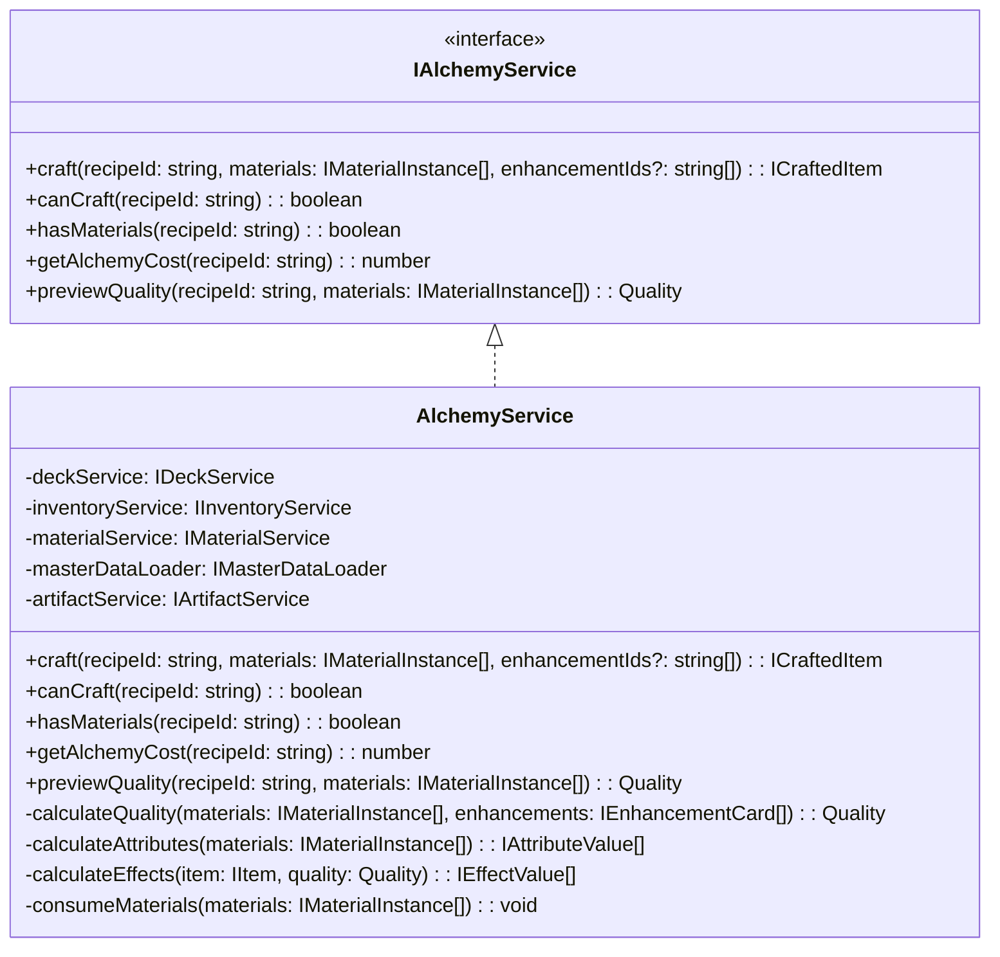
```mermaid
classDiagram
    class IAlchemyService {
        <<interface>>
        +craft(recipeId: string, materials: IMaterialInstance[], enhancementIds?: string[]): ICraftedItem
        +canCraft(recipeId: string): boolean
        +hasMaterials(recipeId: string): boolean
        +getAlchemyCost(recipeId: string): number
        +previewQuality(recipeId: string, materials: IMaterialInstance[]): Quality
    }

    class AlchemyService {
        -deckService: IDeckService
        -inventoryService: IInventoryService
        -materialService: IMaterialService
        -masterDataLoader: IMasterDataLoader
        -artifactService: IArtifactService
        +craft(recipeId: string, materials: IMaterialInstance[], enhancementIds?: string[]): ICraftedItem
        +canCraft(recipeId: string): boolean
        +hasMaterials(recipeId: string): boolean
        +getAlchemyCost(recipeId: string): number
        +previewQuality(recipeId: string, materials: IMaterialInstance[]): Quality
        -calculateQuality(materials: IMaterialInstance[], enhancements: IEnhancementCard[]): Quality
        -calculateAttributes(materials: IMaterialInstance[]): IAttributeValue[]
        -calculateEffects(item: IItem, quality: Quality): IEffectValue[]
        -consumeMaterials(materials: IMaterialInstance[]): void
    }

    IAlchemyService <|.. AlchemyService
```

### 9.3 主要メソッド

| メソッド | 引数 | 戻り値 | 説明 |
|---------|------|--------|------|
| craft | recipeId, materials, enhancementIds? | ICraftedItem | 調合を実行しアイテムを生成 |
| canCraft | recipeId | boolean | 調合可能か判定（手札にレシピがあるか） |
| hasMaterials | recipeId | boolean | 必要素材があるか判定 |
| getAlchemyCost | recipeId | number | 調合コストを取得 |
| previewQuality | recipeId, materials | Quality | 調合結果の品質をプレビュー |

### 9.4 品質計算ロジック 🟡

```typescript
calculateQuality(materials: IMaterialInstance[], enhancements: IEnhancementCard[]): Quality {
  // MaterialServiceを使用して素材の平均品質を計算
  const avgQuality = this.materialService.calculateAverageQuality(materials);

  // 強化カード「賢者の触媒」の効果
  const qualityBonus = this.getEnhancementValue(enhancements, 'QUALITY_UP');

  // アーティファクト効果（錬金術師の眼鏡など）
  const artifactBonus = this.artifactService.getQualityBonus();

  const finalQuality = avgQuality + qualityBonus + artifactBonus;

  // MaterialServiceを使用して数値を品質ランクに変換
  return this.materialService.numberToQuality(finalQuality);
}
```

### 9.5 属性値計算ロジック 🟡

```typescript
calculateAttributes(materials: IMaterialInstance[]): IAttributeValue[] {
  // MaterialServiceに委譲して属性値を計算
  return this.materialService.calculateTotalAttributes(materials);
}
```

---

## 10. QuestService 🔵

### 10.1 責務

依頼の生成、受注、条件判定、報酬計算を担当する。

### 10.2 クラス図

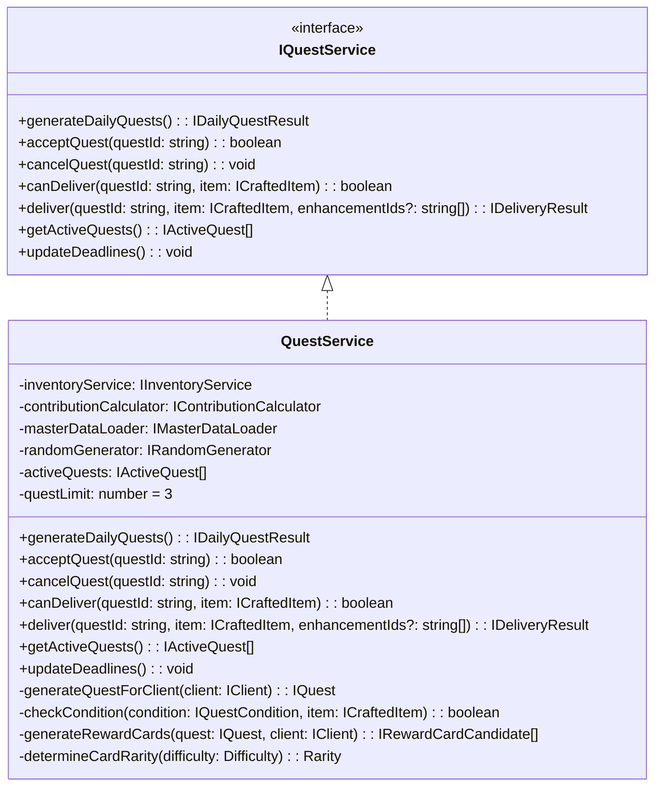
```mermaid
classDiagram
    class IQuestService {
        <<interface>>
        +generateDailyQuests(): IDailyQuestResult
        +acceptQuest(questId: string): boolean
        +cancelQuest(questId: string): void
        +canDeliver(questId: string, item: ICraftedItem): boolean
        +deliver(questId: string, item: ICraftedItem, enhancementIds?: string[]): IDeliveryResult
        +getActiveQuests(): IActiveQuest[]
        +updateDeadlines(): void
    }

    class QuestService {
        -inventoryService: IInventoryService
        -contributionCalculator: IContributionCalculator
        -masterDataLoader: IMasterDataLoader
        -randomGenerator: IRandomGenerator
        -activeQuests: IActiveQuest[]
        -questLimit: number = 3
        +generateDailyQuests(): IDailyQuestResult
        +acceptQuest(questId: string): boolean
        +cancelQuest(questId: string): void
        +canDeliver(questId: string, item: ICraftedItem): boolean
        +deliver(questId: string, item: ICraftedItem, enhancementIds?: string[]): IDeliveryResult
        +getActiveQuests(): IActiveQuest[]
        +updateDeadlines(): void
        -generateQuestForClient(client: IClient): IQuest
        -checkCondition(condition: IQuestCondition, item: ICraftedItem): boolean
        -generateRewardCards(quest: IQuest, client: IClient): IRewardCardCandidate[]
        -determineCardRarity(difficulty: Difficulty): Rarity
    }

    IQuestService <|.. QuestService
```

### 10.3 主要メソッド

| メソッド | 引数 | 戻り値 | 説明 |
|---------|------|--------|------|
| generateDailyQuests | - | IDailyQuestResult | 今日の依頼者と依頼を生成 |
| acceptQuest | questId | boolean | 依頼を受注 |
| cancelQuest | questId | void | 依頼を破棄 |
| canDeliver | questId, item | boolean | 納品可能か判定 |
| deliver | questId, item, enhancementIds? | IDeliveryResult | 納品を実行 |
| getActiveQuests | - | IActiveQuest[] | 受注中の依頼を取得 |
| updateDeadlines | - | void | 全依頼の期限を-1 |

### 10.4 依頼条件判定ロジック 🔵

```typescript
checkCondition(condition: IQuestCondition, item: ICraftedItem): boolean {
  switch (condition.type) {
    case 'SPECIFIC':
      return item.itemId === condition.itemId;

    case 'CATEGORY':
      const masterItem = this.masterDataLoader.getItem(item.itemId);
      return masterItem.category === condition.category;

    case 'QUALITY':
      return this.qualityToNumber(item.quality) >= this.qualityToNumber(condition.minQuality);

    case 'QUANTITY':
      // 別途、複数アイテムの合計をチェック
      return true; // 呼び出し元で判定

    case 'ATTRIBUTE':
      const attrValue = item.attributeValues.find(a => a.attribute === condition.attribute);
      return attrValue ? attrValue.value >= condition.minValue : false;

    case 'EFFECT':
      const effectValue = item.effectValues.find(e => e.type === condition.effectType);
      return effectValue ? effectValue.value >= condition.minValue : false;

    case 'MATERIAL':
      // レア素材を指定数以上使用しているか
      const rareMaterialCount = item.usedMaterials.filter(m => m.isRare).length;
      return rareMaterialCount >= condition.minRareMaterials;

    case 'COMPOUND':
      // 複合条件: すべての子条件を満たすか
      return condition.subConditions.every(sub => this.checkCondition(sub, item));

    default:
      return false;
  }
}
```

### 10.5 報酬カード生成ロジック 🔵

```typescript
generateRewardCards(quest: IQuest, client: IClient): IRewardCardCandidate[] {
  const candidates: IRewardCardCandidate[] = [];

  // 1枚目: 依頼者タイプに関連するカード
  candidates.push(this.selectCardByClientType(client.type));

  // 2枚目: 依頼タイプに関連するカード
  candidates.push(this.selectCardByQuestType(quest.condition.type));

  // 3枚目: ランダム枠
  candidates.push(this.selectRandomCard());

  // レアリティ決定
  for (const card of candidates) {
    card.rarity = this.determineCardRarity(quest.difficulty);
  }

  return candidates;
}

determineCardRarity(difficulty: Difficulty): Rarity {
  const roll = this.randomGenerator.random() * 100;
  const table = this.getRarityTable(difficulty);

  if (roll < table.common) return 'COMMON';
  if (roll < table.common + table.uncommon) return 'UNCOMMON';
  return 'RARE';
}
```

---

## 11. ContributionCalculator 🔵

### 11.1 責務

納品時の貢献度を計算する。

### 11.2 クラス図

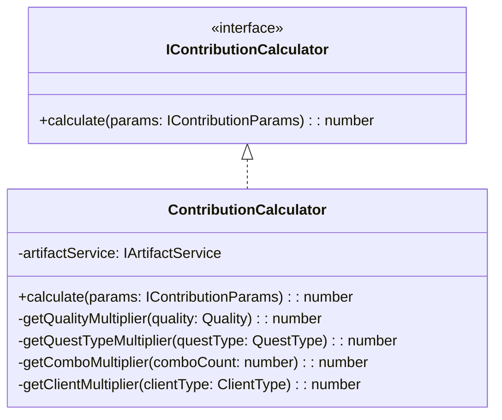
```mermaid
classDiagram
    class IContributionCalculator {
        <<interface>>
        +calculate(params: IContributionParams): number
    }

    class ContributionCalculator {
        -artifactService: IArtifactService
        +calculate(params: IContributionParams): number
        -getQualityMultiplier(quality: Quality): number
        -getQuestTypeMultiplier(questType: QuestType): number
        -getComboMultiplier(comboCount: number): number
        -getClientMultiplier(clientType: ClientType): number
    }

    IContributionCalculator <|.. ContributionCalculator
```

### 11.3 計算ロジック 🔵

```typescript
calculate(params: IContributionParams): number {
  const {
    baseContribution,
    quality,
    questType,
    clientType,
    comboCount,
    enhancementCards
  } = params;

  // 基本計算
  let contribution = baseContribution;

  // 品質補正
  contribution *= this.getQualityMultiplier(quality);

  // 依頼タイプ補正
  contribution *= this.getQuestTypeMultiplier(questType);

  // 依頼者補正
  contribution *= this.getClientMultiplier(clientType);

  // コンボ補正
  contribution *= this.getComboMultiplier(comboCount);

  // 強化カード補正（ギルド推薦状など）
  const enhancementBonus = this.getEnhancementContributionBonus(enhancementCards);
  contribution *= (1 + enhancementBonus / 100);

  // アーティファクト補正（ギルドマスターの印など）
  const artifactBonus = this.artifactService.getContributionBonus();
  contribution *= (1 + artifactBonus / 100);

  return Math.floor(contribution);
}

private getQualityMultiplier(quality: Quality): number {
  const table: Record<Quality, number> = {
    'D': 0.5,
    'C': 1.0,
    'B': 1.5,
    'A': 2.0,
    'S': 3.0
  };
  return table[quality];
}

private getQuestTypeMultiplier(questType: QuestType): number {
  const table: Record<QuestType, number> = {
    'SPECIFIC': 1.0,
    'CATEGORY': 0.8,
    'QUALITY': 1.2,
    'QUANTITY': 0.7,
    'ATTRIBUTE': 1.3,
    'EFFECT': 1.3,
    'MATERIAL': 1.5,
    'COMPOUND': 1.8
  };
  return table[questType];
}

private getComboMultiplier(comboCount: number): number {
  if (comboCount >= 10) return 2.0;
  if (comboCount >= 5) return 1.5;
  if (comboCount >= 3) return 1.2;
  if (comboCount >= 2) return 1.1;
  return 1.0;
}

private getClientMultiplier(clientType: ClientType): number {
  const table: Record<ClientType, number> = {
    'VILLAGER': 0.8,
    'ADVENTURER': 1.0,
    'MERCHANT': 1.2,
    'NOBLE': 1.5,
    'GUILD': 1.3
  };
  return table[clientType];
}
```

---

## 12. RankService 🔵

### 12.1 責務

ギルドランクの管理、昇格試験の処理を担当する。

### 12.2 クラス図

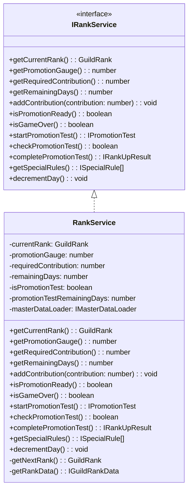
```mermaid
classDiagram
    class IRankService {
        <<interface>>
        +getCurrentRank(): GuildRank
        +getPromotionGauge(): number
        +getRequiredContribution(): number
        +getRemainingDays(): number
        +addContribution(contribution: number): void
        +isPromotionReady(): boolean
        +isGameOver(): boolean
        +startPromotionTest(): IPromotionTest
        +checkPromotionTest(): boolean
        +completePromotionTest(): IRankUpResult
        +getSpecialRules(): ISpecialRule[]
        +decrementDay(): void
    }

    class RankService {
        -currentRank: GuildRank
        -promotionGauge: number
        -requiredContribution: number
        -remainingDays: number
        -isPromotionTest: boolean
        -promotionTestRemainingDays: number
        -masterDataLoader: IMasterDataLoader
        +getCurrentRank(): GuildRank
        +getPromotionGauge(): number
        +getRequiredContribution(): number
        +getRemainingDays(): number
        +addContribution(contribution: number): void
        +isPromotionReady(): boolean
        +isGameOver(): boolean
        +startPromotionTest(): IPromotionTest
        +checkPromotionTest(): boolean
        +completePromotionTest(): IRankUpResult
        +getSpecialRules(): ISpecialRule[]
        +decrementDay(): void
        -getNextRank(): GuildRank
        -getRankData(): IGuildRankData
    }

    IRankService <|.. RankService
```

### 12.3 主要メソッド

| メソッド | 引数 | 戻り値 | 説明 |
|---------|------|--------|------|
| getCurrentRank | - | GuildRank | 現在のランクを取得 |
| getPromotionGauge | - | number | 現在の昇格ゲージを取得 |
| getRequiredContribution | - | number | 昇格に必要な貢献度を取得 |
| addContribution | contribution | void | 昇格ゲージに貢献度を加算する |
| isPromotionReady | - | boolean | 昇格ゲージが満タンか判定 |
| isGameOver | - | boolean | 日数切れか判定 |
| startPromotionTest | - | IPromotionTest | 昇格試験を開始 |
| checkPromotionTest | - | boolean | 昇格試験をクリアしたか判定 |
| completePromotionTest | - | IRankUpResult | ランクアップ処理を実行 |
| getSpecialRules | - | ISpecialRule[] | 現在ランクの特殊ルールを取得 |
| decrementDay | - | void | 残り日数を減らす |

---

## 13. ShopService 🔵

### 13.1 責務

ショップでの購入処理を担当する。

### 13.2 クラス図

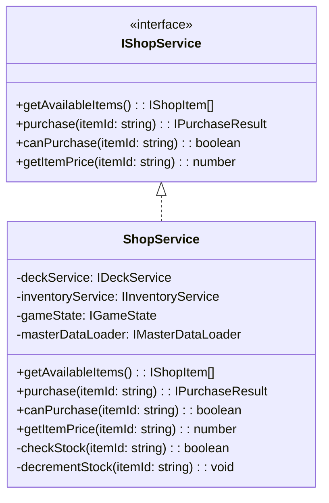
```mermaid
classDiagram
    class IShopService {
        <<interface>>
        +getAvailableItems(): IShopItem[]
        +purchase(itemId: string): IPurchaseResult
        +canPurchase(itemId: string): boolean
        +getItemPrice(itemId: string): number
    }

    class ShopService {
        -deckService: IDeckService
        -inventoryService: IInventoryService
        -gameState: IGameState
        -masterDataLoader: IMasterDataLoader
        +getAvailableItems(): IShopItem[]
        +purchase(itemId: string): IPurchaseResult
        +canPurchase(itemId: string): boolean
        +getItemPrice(itemId: string): number
        -checkStock(itemId: string): boolean
        -decrementStock(itemId: string): void
    }

    IShopService <|.. ShopService
```

### 13.3 主要メソッド

| メソッド | 引数 | 戻り値 | 説明 |
|---------|------|--------|------|
| getAvailableItems | - | IShopItem[] | 購入可能なアイテム一覧を取得 |
| purchase | itemId | IPurchaseResult | 購入を実行 |
| canPurchase | itemId | boolean | 購入可能か判定（ゴールド・在庫） |
| getItemPrice | itemId | number | 価格を取得 |

---

## 14. ArtifactService 🔵

### 14.1 責務

アーティファクトの管理とボーナス計算を担当する。

### 14.2 クラス図

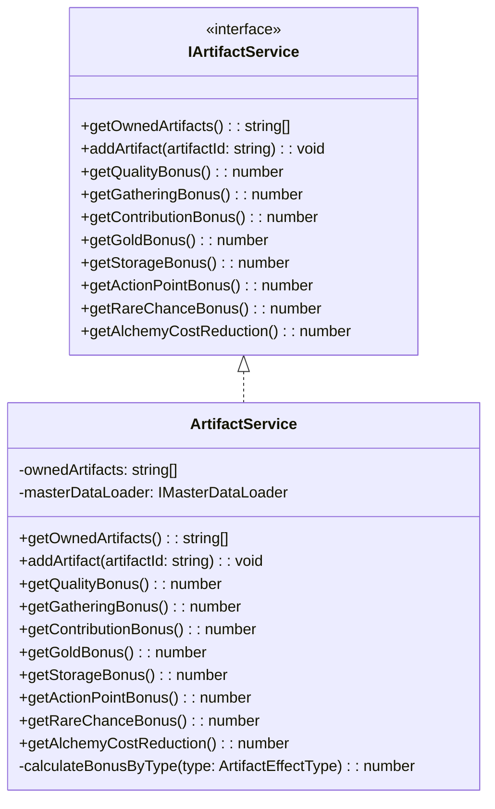
```mermaid
classDiagram
    class IArtifactService {
        <<interface>>
        +getOwnedArtifacts(): string[]
        +addArtifact(artifactId: string): void
        +getQualityBonus(): number
        +getGatheringBonus(): number
        +getContributionBonus(): number
        +getGoldBonus(): number
        +getStorageBonus(): number
        +getActionPointBonus(): number
        +getRareChanceBonus(): number
        +getAlchemyCostReduction(): number
    }

    class ArtifactService {
        -ownedArtifacts: string[]
        -masterDataLoader: IMasterDataLoader
        +getOwnedArtifacts(): string[]
        +addArtifact(artifactId: string): void
        +getQualityBonus(): number
        +getGatheringBonus(): number
        +getContributionBonus(): number
        +getGoldBonus(): number
        +getStorageBonus(): number
        +getActionPointBonus(): number
        +getRareChanceBonus(): number
        +getAlchemyCostReduction(): number
        -calculateBonusByType(type: ArtifactEffectType): number
    }

    IArtifactService <|.. ArtifactService
```

### 14.3 ボーナス計算ロジック 🟡

```typescript
calculateBonusByType(type: ArtifactEffectType): number {
  let totalBonus = 0;

  for (const artifactId of this.ownedArtifacts) {
    const artifact = this.masterDataLoader.getArtifact(artifactId);
    if (artifact.effect.type === type) {
      totalBonus += artifact.effect.value;
    }
    // 錬金王の冠の場合、全効果に+10%
    if (artifact.effect.type === 'ALL_BONUS') {
      totalBonus += artifact.effect.value / 10; // 10%を各効果に分配
    }
  }

  return totalBonus;
}
```

---

## 15. MaterialService 🔵

### 15.1 責務

素材の品質・属性計算、レア判定、レシピ検証を担当する。素材に関するビジネスロジックを集約し、GatheringService・AlchemyServiceから参照される。

### 15.2 クラス図

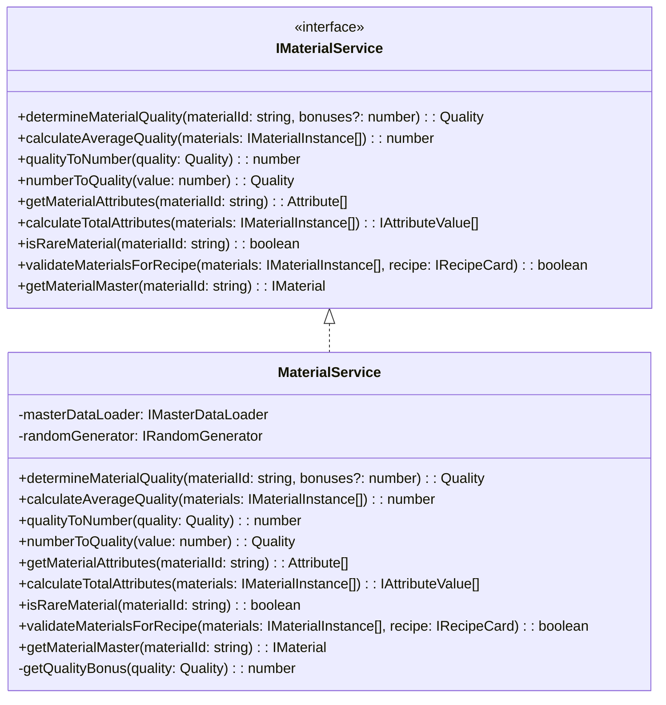
```mermaid
classDiagram
    class IMaterialService {
        <<interface>>
        +determineMaterialQuality(materialId: string, bonuses?: number): Quality
        +calculateAverageQuality(materials: IMaterialInstance[]): number
        +qualityToNumber(quality: Quality): number
        +numberToQuality(value: number): Quality
        +getMaterialAttributes(materialId: string): Attribute[]
        +calculateTotalAttributes(materials: IMaterialInstance[]): IAttributeValue[]
        +isRareMaterial(materialId: string): boolean
        +validateMaterialsForRecipe(materials: IMaterialInstance[], recipe: IRecipeCard): boolean
        +getMaterialMaster(materialId: string): IMaterial
    }

    class MaterialService {
        -masterDataLoader: IMasterDataLoader
        -randomGenerator: IRandomGenerator
        +determineMaterialQuality(materialId: string, bonuses?: number): Quality
        +calculateAverageQuality(materials: IMaterialInstance[]): number
        +qualityToNumber(quality: Quality): number
        +numberToQuality(value: number): Quality
        +getMaterialAttributes(materialId: string): Attribute[]
        +calculateTotalAttributes(materials: IMaterialInstance[]): IAttributeValue[]
        +isRareMaterial(materialId: string): boolean
        +validateMaterialsForRecipe(materials: IMaterialInstance[], recipe: IRecipeCard): boolean
        +getMaterialMaster(materialId: string): IMaterial
        -getQualityBonus(quality: Quality): number
    }

    IMaterialService <|.. MaterialService
```

### 15.3 主要メソッド

| メソッド | 引数 | 戻り値 | 説明 |
|---------|------|--------|------|
| determineMaterialQuality | materialId, bonuses? | Quality | 素材の品質を決定（ランダム＋ボーナス） |
| calculateAverageQuality | materials[] | number | 複数素材の平均品質を計算 |
| qualityToNumber | quality | number | 品質をランク数値（1-5）に変換 |
| numberToQuality | value | Quality | 数値を品質ランク（D-S）に変換 |
| getMaterialAttributes | materialId | Attribute[] | 素材の持つ属性を取得 |
| calculateTotalAttributes | materials[] | IAttributeValue[] | 複数素材の属性値を合算 |
| isRareMaterial | materialId | boolean | レア素材か判定 |
| validateMaterialsForRecipe | materials[], recipe | boolean | レシピ要件を満たすか検証 |
| getMaterialMaster | materialId | IMaterial | 素材のマスターデータを取得 |

### 15.4 品質決定ロジック 🔵

```typescript
determineMaterialQuality(materialId: string, bonuses: number = 0): Quality {
  const material = this.masterDataLoader.getMaterial(materialId);

  // 基本品質（マスターデータで定義）
  const baseQuality = this.qualityToNumber(material.baseQuality);

  // ランダム変動（-1 〜 +1）
  const variation = this.randomGenerator.randomInt(-1, 1);

  // 最終品質を計算
  const finalValue = Math.max(1, Math.min(5, baseQuality + variation + bonuses));

  return this.numberToQuality(finalValue);
}
```

### 15.5 品質変換ロジック 🔵

```typescript
qualityToNumber(quality: Quality): number {
  const map: Record<Quality, number> = {
    'D': 1,
    'C': 2,
    'B': 3,
    'A': 4,
    'S': 5
  };
  return map[quality];
}

numberToQuality(value: number): Quality {
  if (value <= 1) return 'D';
  if (value <= 2) return 'C';
  if (value <= 3) return 'B';
  if (value <= 4) return 'A';
  return 'S';
}
```

### 15.6 属性計算ロジック 🔵

```typescript
calculateTotalAttributes(materials: IMaterialInstance[]): IAttributeValue[] {
  const attributeMap = new Map<Attribute, number>();

  for (const material of materials) {
    const masterData = this.getMaterialMaster(material.materialId);
    for (const attr of masterData.attributes) {
      const current = attributeMap.get(attr) || 0;
      // 品質による属性値ボーナス
      const qualityBonus = this.getQualityBonus(material.quality);
      attributeMap.set(attr, current + (1 + qualityBonus) * material.quantity);
    }
  }

  return Array.from(attributeMap.entries()).map(([attribute, value]) => ({
    attribute,
    value: Math.floor(value)
  }));
}

private getQualityBonus(quality: Quality): number {
  const map: Record<Quality, number> = {
    'D': 0.0,
    'C': 0.1,
    'B': 0.2,
    'A': 0.4,
    'S': 0.6
  };
  return map[quality];
}
```

### 15.7 レシピ検証ロジック 🔵

```typescript
validateMaterialsForRecipe(materials: IMaterialInstance[], recipe: IRecipeCard): boolean {
  // 必要素材が揃っているかチェック
  for (const required of recipe.requiredMaterials) {
    const available = materials.filter(m => m.materialId === required.materialId);
    const totalQuantity = available.reduce((sum, m) => sum + m.quantity, 0);

    if (totalQuantity < required.quantity) {
      return false;
    }
  }

  // カテゴリ条件のチェック（任意素材）
  if (recipe.optionalCategories) {
    for (const categoryReq of recipe.optionalCategories) {
      const matchingMaterials = materials.filter(m => {
        const master = this.getMaterialMaster(m.materialId);
        return master.category === categoryReq.category;
      });
      const totalQuantity = matchingMaterials.reduce((sum, m) => sum + m.quantity, 0);

      if (totalQuantity < categoryReq.quantity) {
        return false;
      }
    }
  }

  return true;
}
```

---

## 16. InventoryService 🔵

### 16.1 責務

素材とアイテムのインベントリ管理を担当する。

### 16.2 クラス図

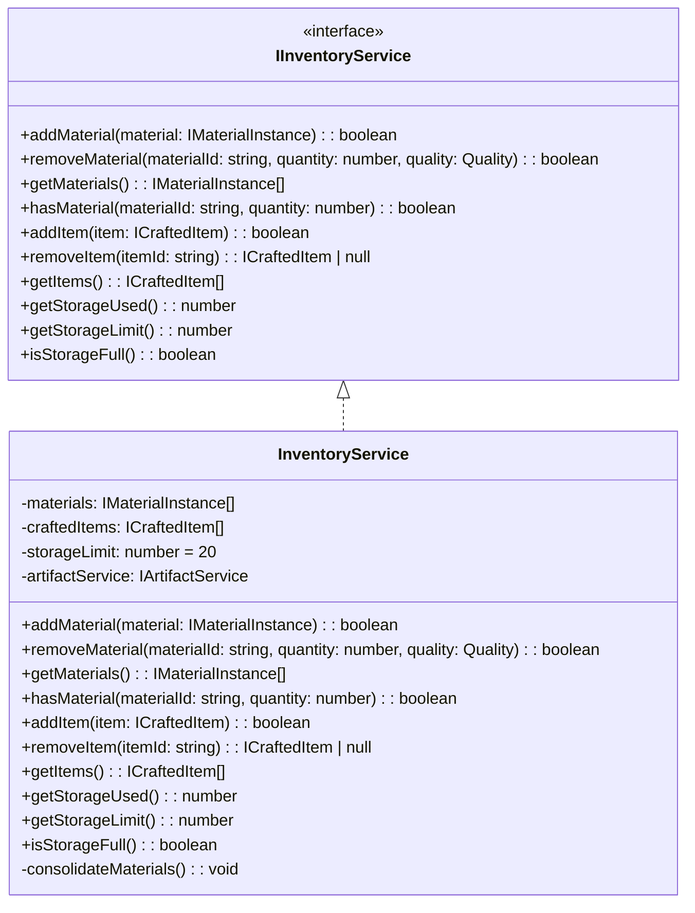
```mermaid
classDiagram
    class IInventoryService {
        <<interface>>
        +addMaterial(material: IMaterialInstance): boolean
        +removeMaterial(materialId: string, quantity: number, quality: Quality): boolean
        +getMaterials(): IMaterialInstance[]
        +hasMaterial(materialId: string, quantity: number): boolean
        +addItem(item: ICraftedItem): boolean
        +removeItem(itemId: string): ICraftedItem | null
        +getItems(): ICraftedItem[]
        +getStorageUsed(): number
        +getStorageLimit(): number
        +isStorageFull(): boolean
    }

    class InventoryService {
        -materials: IMaterialInstance[]
        -craftedItems: ICraftedItem[]
        -storageLimit: number = 20
        -artifactService: IArtifactService
        +addMaterial(material: IMaterialInstance): boolean
        +removeMaterial(materialId: string, quantity: number, quality: Quality): boolean
        +getMaterials(): IMaterialInstance[]
        +hasMaterial(materialId: string, quantity: number): boolean
        +addItem(item: ICraftedItem): boolean
        +removeItem(itemId: string): ICraftedItem | null
        +getItems(): ICraftedItem[]
        +getStorageUsed(): number
        +getStorageLimit(): number
        +isStorageFull(): boolean
        -consolidateMaterials(): void
    }

    IInventoryService <|.. InventoryService
```

### 16.3 主要メソッド

| メソッド | 引数 | 戻り値 | 説明 |
|---------|------|--------|------|
| addMaterial | material | boolean | 素材を追加（上限チェック） |
| removeMaterial | materialId, quantity, quality | boolean | 素材を消費 |
| getMaterials | - | IMaterialInstance[] | 全素材を取得 |
| hasMaterial | materialId, quantity | boolean | 素材があるか判定 |
| addItem | item | boolean | アイテムを追加 |
| removeItem | itemId | ICraftedItem | null | アイテムを取り出す |
| getItems | - | ICraftedItem[] | 全アイテムを取得 |
| getStorageUsed | - | number | 使用中の枠数 |
| getStorageLimit | - | number | 上限枠数（アーティファクト込み） |
| isStorageFull | - | boolean | 満杯か判定 |

---

## 17. ドメインサービスとの連携 🔵

### 17.1 連携パターン

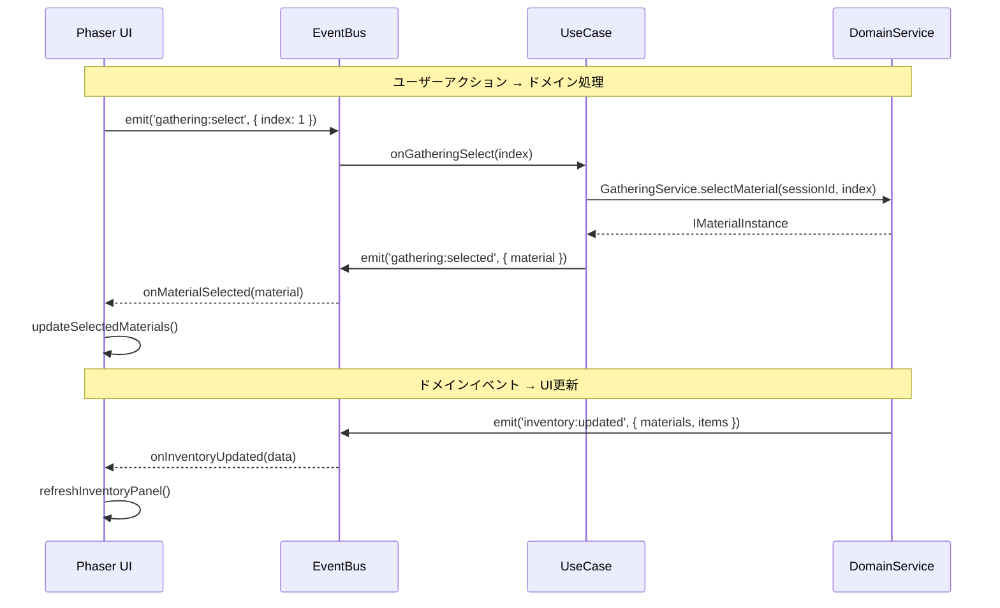
```mermaid
sequenceDiagram
    participant UI as Phaser UI
    participant EB as EventBus
    participant UC as UseCase
    participant DS as DomainService

    Note over UI,DS: ユーザーアクション → ドメイン処理
    UI->>EB: emit('gathering:select', { index: 1 })
    EB->>UC: onGatheringSelect(index)
    UC->>DS: GatheringService.selectMaterial(sessionId, index)
    DS-->>UC: IMaterialInstance
    UC->>EB: emit('gathering:selected', { material })
    EB-->>UI: onMaterialSelected(material)
    UI->>UI: updateSelectedMaterials()

    Note over UI,DS: ドメインイベント → UI更新
    DS->>EB: emit('inventory:updated', { materials, items })
    EB-->>UI: onInventoryUpdated(data)
    UI->>UI: refreshInventoryPanel()
```

### 17.2 UseCase（ユースケース）パターン 🟡

```typescript
// 採取ユースケース
class GatheringUseCase {
    constructor(
        private gatheringService: IGatheringService,
        private deckService: IDeckService,
        private inventoryService: IInventoryService
    ) {
        this.bindEvents();
    }

    private bindEvents(): void {
        EventBus.on('gathering:start', this.onStartGathering, this);
        EventBus.on('gathering:select', this.onSelectMaterial, this);
        EventBus.on('gathering:skip', this.onSkip, this);
        EventBus.on('gathering:end', this.onEndGathering, this);
    }

    private onStartGathering(data: { cardId: string, enhancements?: string[] }): void {
        const session = this.gatheringService.startDraftGathering(
            data.cardId,
            data.enhancements
        );
        EventBus.emit('gathering:session', { session });
        EventBus.emit('gathering:options', { options: session.currentOptions });
    }

    private onSelectMaterial(data: { index: number }): void {
        const session = this.gatheringService.getCurrentSession();
        const material = this.gatheringService.selectMaterial(session.sessionId, data.index);

        EventBus.emit('gathering:selected', { material });

        // 次のラウンドがあれば次の選択肢を提示
        if (!session.isComplete) {
            EventBus.emit('gathering:options', { options: session.currentOptions });
        }
    }

    private onEndGathering(): void {
        const session = this.gatheringService.getCurrentSession();
        const result = this.gatheringService.endGathering(session.sessionId);

        // 素材をインベントリに追加
        for (const material of result.materials) {
            this.inventoryService.addMaterial(material);
        }

        // カードを捨て札へ
        this.deckService.playCard(session.cardId);

        EventBus.emit('gathering:complete', { result });
        EventBus.emit('ui:inventory:update', {
            materials: this.inventoryService.getMaterials(),
            items: this.inventoryService.getItems()
        });
    }
}
```

---

## 18. システム間の依存関係図 🟡

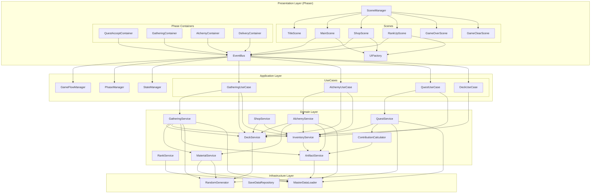
```mermaid
graph TB
    subgraph "Presentation Layer (Phaser)"
        EB[EventBus]
        SM[SceneManager]
        UF[UIFactory]

        subgraph "Scenes"
            TS[TitleScene]
            MS[MainScene]
            SS[ShopScene]
            RS[RankUpScene]
            GOS[GameOverScene]
            GCS[GameClearScene]
        end

        subgraph "Phase Containers"
            QAC[QuestAcceptContainer]
            GC[GatheringContainer]
            AC[AlchemyContainer]
            DC[DeliveryContainer]
        end
    end

    subgraph "Application Layer"
        GFM[GameFlowManager]
        PM[PhaseManager]
        STM[StateManager]

        subgraph "UseCases"
            GUC[GatheringUseCase]
            AUC[AlchemyUseCase]
            QUC[QuestUseCase]
            DUC[DeckUseCase]
        end
    end

    subgraph "Domain Layer"
        DS[DeckService]
        GS[GatheringService]
        AS[AlchemyService]
        QS[QuestService]
        CC[ContributionCalculator]
        RKS[RankService]
        SHS[ShopService]
        AFS[ArtifactService]
        MTS[MaterialService]
        IS[InventoryService]
    end

    subgraph "Infrastructure Layer"
        MDL[MasterDataLoader]
        SDR[SaveDataRepository]
        RG[RandomGenerator]
    end

    %% Presentation → EventBus
    MS --> EB
    SS --> EB
    RS --> EB
    QAC --> EB
    GC --> EB
    AC --> EB
    DC --> EB

    %% EventBus → Application
    EB --> GFM
    EB --> PM
    EB --> STM
    EB --> GUC
    EB --> AUC
    EB --> QUC
    EB --> DUC

    %% Application → Domain
    GUC --> GS
    GUC --> DS
    GUC --> IS
    AUC --> AS
    AUC --> DS
    AUC --> IS
    QUC --> QS
    QUC --> IS
    DUC --> DS

    %% Domain依存関係
    GS --> DS
    GS --> MTS
    GS --> IS
    GS --> AFS
    GS --> RG

    AS --> DS
    AS --> MTS
    AS --> IS
    AS --> AFS

    QS --> IS
    QS --> CC
    QS --> RG

    CC --> AFS

    RKS --> MDL

    SHS --> DS
    SHS --> IS

    MTS --> MDL
    MTS --> RG

    IS --> AFS

    DS --> RG
    GS --> MDL
    AS --> MDL
    QS --> MDL
    AFS --> MDL

    %% Scene Manager
    SM --> TS
    SM --> MS
    SM --> SS
    SM --> RS
    SM --> GOS
    SM --> GCS

    %% UI Factory
    MS --> UF
    SS --> UF
    RS --> UF
```

---

## 19. Phaser固有の実装注意点 🔴

### 19.1 メモリ管理

```typescript
// シーン終了時のクリーンアップ
shutdown(): void {
    // イベント購読解除
    EventBus.off('phase:change', this.onPhaseChange, this);
    EventBus.off('ui:inventory:update', this.onInventoryUpdate, this);

    // rexUIコンポーネントの破棄
    this.phaseContainers.forEach(container => container.destroy());
    this.phaseContainers.clear();

    // Tweenの停止
    this.tweens.killAll();

    // Timerの停止
    this.time.removeAllEvents();
}
```

### 19.2 非同期処理とUI更新

```typescript
// ドメイン処理の結果をUIに反映する際の安全なパターン
private async onCraftItem(data: { recipeId: string, materials: IMaterialInstance[] }): Promise<void> {
    // UI更新をロック
    this.setInputEnabled(false);
    this.showLoadingIndicator();

    try {
        // ドメイン処理
        const item = await this.alchemyService.craft(data.recipeId, data.materials);

        // UI更新（シーンがまだアクティブか確認）
        if (this.scene.isActive()) {
            EventBus.emit('alchemy:complete', { item });
            this.showCraftResult(item);
        }
    } catch (error) {
        if (this.scene.isActive()) {
            EventBus.emit('ui:toast:show', { message: 'エラーが発生しました', type: 'error' });
        }
    } finally {
        if (this.scene.isActive()) {
            this.hideLoadingIndicator();
            this.setInputEnabled(true);
        }
    }
}
```

### 19.3 デバッグモード

```typescript
// 開発時のデバッグ機能
if (import.meta.env.DEV) {
    // EventBusのログ出力
    EventBus.on('*', (event: string, data: any) => {
        console.log(`[EventBus] ${event}:`, data);
    });

    // Phaserデバッグ表示
    this.physics.world.createDebugGraphic();
}
```

---

## 関連文書

- **要件定義書**: [../../spec/atelier-guild-rank-requirements.md](../../spec/atelier-guild-rank-requirements.md)
- **アーキテクチャ設計書**: [architecture.md](architecture.md)
- **データスキーマ設計書**: [data-schema.md](data-schema.md)
- **ゲームメカニクス設計書**: [game-mechanics.md](game-mechanics.md)
- **アーキテクチャ設計書（Phaser版）**: [../atelier-guild-rank-phaser/architecture.md](../atelier-guild-rank-phaser/architecture.md)
- **UI設計概要（Phaser版）**: [../atelier-guild-rank-phaser/ui-design/overview.md](../atelier-guild-rank-phaser/ui-design/overview.md)

---

## 変更履歴

| 日付 | バージョン | 変更内容 |
|------|----------|---------|
| 2026-01-01 | 1.0.0 | 初版作成（HTML版） |
| 2026-01-01 | 1.1.0 | MaterialServiceを追加、GatheringService・AlchemyServiceの依存を更新 |
| 2026-01-01 | 1.2.0 | GatheringServiceをドラフト採取方式に対応。IDraftSession、IGatheringCostResultインターフェースを追加。採取コスト計算を二段階制（基本コスト+追加コスト）に変更。提示回数ボーナスのロジックを追加。 |
| 2026-01-02 | 1.3.0 | 「ランクHP」を「昇格ゲージ」に表現変更。RankServiceのメソッド名・プロパティ名を変更（getRankHp→getPromotionGauge、damageRankHp→addContribution、isRankHpZero→isPromotionReady、rankHp→promotionGauge）。 |
| 2026-01-14 | 1.4.0 | HTML版とPhaser版を統合。Phaser固有のシステム（EventBus、SceneManager、UIFactory、PhaseContainer、StateManager）を追加。両版で共通のドメインサービスの詳細設計を保持。システム間依存関係図を統合版に更新。 |
