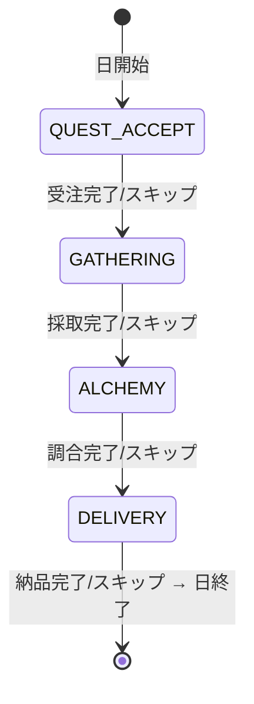
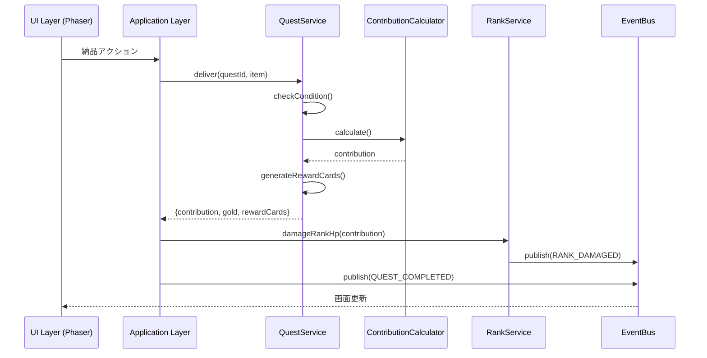
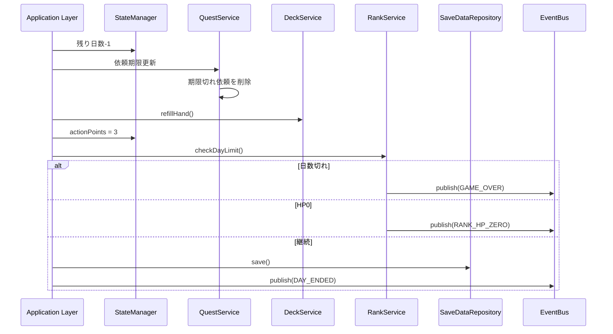

# システムアーキテクチャ設計書

**バージョン**: 2.0.0
**作成日**: 2026-01-01
**最終更新**: 2026-01-14
**対象**: アトリエ錬金術ゲーム（ギルドランク制）Phaser版

# システムアーキテクチャ設計書 - コンポーネント設計

このドキュメントは [システムアーキテクチャ設計書](architecture.md) の一部なのだ。

---

## 9. コンポーネント設計（Application/Domain層）

このセクションでは、既存設計を維持するApplication層・Domain層の詳細設計を記載する。

### 9.1 Application Layer

#### GameFlowManager 🟡

ゲーム全体のフローを制御する中核コンポーネント。

```typescript
class GameFlowManager {
  // ゲーム開始
  startNewGame(): void;
  // コンティニュー
  continueGame(): void;
  // ゲーム終了判定
  checkGameEnd(): GameEndResult | null;
  // 日終了処理
  endDay(): void;
  // ランクアップ処理
  rankUp(): void;
}
```

#### PhaseManager 🔵

1日4フェーズの遷移を管理。

```typescript
class PhaseManager {
  private currentPhase: GamePhase;

  // フェーズ遷移
  transitionTo(phase: GamePhase): boolean;
  // 次フェーズへ
  nextPhase(): void;
  // 現在フェーズ取得
  getCurrentPhase(): GamePhase;
  // フェーズスキップ可能か
  canSkipPhase(): boolean;
}
```

**フェーズ遷移図** 🔵



#### EventBus 🟡

コンポーネント間の疎結合な通信を実現。

```typescript
class EventBus {
  // イベント購読
  subscribe<T extends IGameEvent>(
    eventType: GameEventType,
    handler: (event: T) => void
  ): () => void;

  // イベント発行
  publish<T extends IGameEvent>(event: T): void;

  // 全購読解除
  unsubscribeAll(eventType?: GameEventType): void;
}
```

#### StateManager 🟡

ゲーム状態の集中管理。

```typescript
class StateManager {
  private gameState: IGameState;
  private deckState: IDeckState;
  private inventoryState: IInventoryState;
  private questState: IQuestState;

  // 状態取得
  getGameState(): Readonly<IGameState>;
  getDeckState(): Readonly<IDeckState>;
  getInventoryState(): Readonly<IInventoryState>;
  getQuestState(): Readonly<IQuestState>;

  // 状態更新
  updateGameState(partial: Partial<IGameState>): void;
  // セーブデータから復元
  loadFromSaveData(saveData: ISaveData): void;
  // セーブデータへ変換
  toSaveData(): ISaveData;
}
```

### 9.2 Domain Layer

#### DeckService 🔵

デッキ操作を担当。

```typescript
class DeckService implements IDeckService {
  shuffle(): void;
  draw(count: number): string[];
  playCard(cardId: string): void;
  discardCard(cardId: string): void;
  addCard(cardId: string): void;
  refillHand(): void;
  reshuffleDiscard(): void;
}
```

#### GatheringService 🔵

採取処理を担当。

```typescript
class GatheringService implements IGatheringService {
  gather(
    gatheringCardId: string,
    enhancementCardIds?: string[]
  ): IMaterialInstance[];

  canGather(gatheringCardId: string): boolean;

  // 獲得素材を計算（確率考慮）
  private calculateMaterials(
    card: IGatheringCard,
    enhancements: IEnhancementCard[]
  ): IMaterialInstance[];
}
```

#### AlchemyService 🔵

調合処理を担当。

```typescript
class AlchemyService implements IAlchemyService {
  craft(
    recipeCardId: string,
    selectedMaterials: IMaterialInstance[],
    enhancementCardIds?: string[]
  ): ICraftedItem;

  canCraft(recipeCardId: string): boolean;
  hasMaterials(recipeCardId: string): boolean;

  // 品質計算
  private calculateQuality(
    materials: IMaterialInstance[],
    enhancements: IEnhancementCard[]
  ): Quality;

  // 属性値計算
  private calculateAttributes(materials: IMaterialInstance[]): IAttributeValue[];

  // 効果値計算
  private calculateEffects(
    item: IItem,
    quality: Quality
  ): IEffectValue[];
}
```

#### QuestService 🔵

依頼管理を担当。

```typescript
class QuestService implements IQuestService {
  generateDailyQuests(): { clients: IClient[]; quests: IQuest[] };
  acceptQuest(questId: string): boolean;
  cancelQuest(questId: string): void;
  canDeliver(questId: string, item: ICraftedItem): boolean;

  deliver(
    questId: string,
    item: ICraftedItem,
    enhancementCardIds?: string[]
  ): {
    contribution: number;
    gold: number;
    rewardCards: IRewardCardCandidate[]
  };

  // 依頼条件判定
  private checkCondition(
    condition: IQuestCondition,
    item: ICraftedItem
  ): boolean;

  // 報酬カード候補生成
  private generateRewardCards(
    quest: IQuest,
    client: IClient
  ): IRewardCardCandidate[];
}
```

#### ContributionCalculator 🔵

貢献度計算を担当。

```typescript
class ContributionCalculator implements IContributionCalculator {
  calculate(
    baseContribution: number,
    quality: Quality,
    questType: QuestType,
    comboCount: number,
    artifacts: IArtifact[],
    enhancementCards: IEnhancementCard[]
  ): number {
    // 貢献度 = 基本貢献度 × 品質補正 × 依頼タイプ補正 × コンボ補正 × (1 + アーティファクト補正) × (1 + 強化カード補正)
  }
}
```

#### RankService 🔵

ランク管理を担当。

```typescript
class RankService {
  // ランクHPにダメージ
  damageRankHp(damage: number): void;
  // ランクHP0判定
  isRankHpZero(): boolean;
  // 昇格試験開始
  startPromotionTest(): void;
  // 昇格試験判定
  checkPromotionTest(): boolean;
  // ランクアップ実行
  rankUp(): void;
  // 特殊ルール取得
  getSpecialRules(): ISpecialRule[];
}
```

#### ShopService 🔵

ショップ機能を担当。

```typescript
class ShopService {
  // 購入可能なアイテム取得
  getAvailableItems(): IShopItem[];
  // 購入
  purchase(itemId: string): boolean;
  // 購入可能か判定
  canPurchase(itemId: string): boolean;
}
```

#### ArtifactService 🟡

アーティファクト管理を担当。

```typescript
class ArtifactService {
  // アーティファクト取得
  getArtifacts(): IArtifact[];
  // アーティファクト追加
  addArtifact(artifactId: string): void;
  // アーティファクト効果適用
  applyEffects(context: IEffectContext): void;
}
```

#### MaterialService 🟡

素材管理を担当。

```typescript
class MaterialService {
  // 素材追加
  addMaterial(material: IMaterialInstance): void;
  // 素材削除
  removeMaterial(materialId: string, count: number): void;
  // 素材取得
  getMaterials(): IMaterialInstance[];
  // 素材フィルタリング
  filterMaterials(filter: IMaterialFilter): IMaterialInstance[];
}
```

### 9.3 Infrastructure Layer

#### SaveDataRepository 🟡

localStorageを使用したセーブデータ管理。

```typescript
class SaveDataRepository implements ISaveDataRepository {
  private readonly STORAGE_KEY = 'atelier_save_data';

  save(data: ISaveData): void {
    localStorage.setItem(this.STORAGE_KEY, JSON.stringify(data));
  }

  load(): ISaveData | null {
    const json = localStorage.getItem(this.STORAGE_KEY);
    if (!json) return null;
    return JSON.parse(json) as ISaveData;
  }

  exists(): boolean {
    return localStorage.getItem(this.STORAGE_KEY) !== null;
  }

  delete(): void {
    localStorage.removeItem(this.STORAGE_KEY);
  }
}
```

#### MasterDataLoader 🟡

JSONファイルからマスターデータを読み込み。

```typescript
class MasterDataLoader implements IMasterDataLoader {
  private cache: Map<string, any> = new Map();

  async loadGatheringCards(): Promise<IGatheringCard[]> {
    return this.loadJson<IGatheringCard[]>('data/cards/gathering_cards.json');
  }

  // ... 他のマスターデータ読み込みメソッド

  private async loadJson<T>(path: string): Promise<T> {
    if (this.cache.has(path)) {
      return this.cache.get(path) as T;
    }
    const response = await fetch(path);
    const data = await response.json();
    this.cache.set(path, data);
    return data as T;
  }
}
```

#### RandomGenerator 🟡

乱数生成ユーティリティ。

```typescript
class RandomGenerator {
  // 0〜1のランダム値
  random(): number;
  // 確率判定
  chance(probability: number): boolean;
  // 配列からランダム選択
  pick<T>(array: T[]): T;
  // 配列シャッフル
  shuffle<T>(array: T[]): T[];
  // 範囲内の整数
  range(min: number, max: number): number;
}
```

---

## 10. イベントフロー設計

### 10.1 依頼完了フロー 🔵



### 10.2 日終了フロー 🔵



---

## 11. 状態管理設計

### 11.1 状態の種類 🔵

| 状態種別 | 説明 | 永続化 |
|---------|------|--------|
| GameState | ゲーム進行状態（ランク、日数等） | ○ |
| DeckState | デッキ状態（山札、手札等） | ○ |
| InventoryState | インベントリ状態（素材、アイテム） | ○ |
| QuestState | 依頼状態（受注中依頼等） | ○ |
| UIState | UI表示状態（選択中アイテム等） | × |

### 11.2 状態更新フロー 🟡

```
User Action (Phaser Scene)
    ↓
UseCase (Application Layer)
    ↓
Service (Domain Layer)
    ↓
StateManager.update()
    ↓
EventBus.publish(STATE_CHANGED)
    ↓
Phaser Scene re-render
```

---

## 12. ディレクトリ構造 🔴

```
src/
├── index.html                 # エントリーポイントHTML
├── main.ts                    # Phaserゲーム初期化
├── game/                      # Phaser関連（新規）
│   ├── config.ts              # Phaserコンフィグ
│   ├── scenes/
│   │   ├── BaseGameScene.ts   # 基底シーン
│   │   ├── BootScene.ts       # 起動・プリロード
│   │   ├── TitleScene.ts      # タイトル画面
│   │   ├── MainScene.ts       # メインゲーム画面
│   │   ├── ShopScene.ts       # ショップ画面
│   │   ├── RankUpScene.ts     # 昇格試験画面
│   │   ├── GameOverScene.ts   # ゲームオーバー
│   │   └── GameClearScene.ts  # ゲームクリア
│   ├── ui/
│   │   ├── components/        # カスタムUIコンポーネント
│   │   │   ├── CardView.ts
│   │   │   ├── HandView.ts
│   │   │   ├── DeckView.ts
│   │   │   ├── MaterialView.ts
│   │   │   ├── MaterialOptionView.ts
│   │   │   ├── InventoryView.ts
│   │   │   ├── QuestView.ts
│   │   │   ├── QuestListView.ts
│   │   │   ├── ClientView.ts
│   │   │   ├── RankProgressView.ts
│   │   │   ├── PhaseIndicator.ts
│   │   │   ├── ActionPointView.ts
│   │   │   ├── GoldView.ts
│   │   │   ├── DayCounter.ts
│   │   │   ├── RewardCardSelector.ts
│   │   │   └── ButtonComponent.ts
│   │   ├── phases/            # フェーズ別UI
│   │   │   ├── BasePhaseUI.ts
│   │   │   ├── QuestAcceptPhaseUI.ts
│   │   │   ├── GatheringPhaseUI.ts
│   │   │   ├── AlchemyPhaseUI.ts
│   │   │   └── DeliveryPhaseUI.ts
│   │   └── common/            # 共通UI
│   │       ├── HeaderUI.ts
│   │       ├── SidebarUI.ts
│   │       └── ActionButtons.ts
│   └── assets/                # アセット管理
│       ├── AssetKeys.ts       # アセットキー定数
│       └── AssetLoader.ts     # アセットローダー
├── application/               # 既存維持
│   ├── managers/
│   │   ├── GameFlowManager.ts
│   │   ├── PhaseManager.ts
│   │   └── StateManager.ts
│   ├── events/
│   │   ├── EventBus.ts
│   │   └── GameEvents.ts
│   └── usecases/
│       ├── AcceptQuestUseCase.ts
│       ├── GatheringUseCase.ts
│       ├── AlchemyUseCase.ts
│       └── DeliveryUseCase.ts
├── domain/                    # 既存維持
│   ├── services/
│   │   ├── DeckService.ts
│   │   ├── GatheringService.ts
│   │   ├── AlchemyService.ts
│   │   ├── QuestService.ts
│   │   ├── ContributionCalculator.ts
│   │   ├── RankService.ts
│   │   ├── ShopService.ts
│   │   ├── ArtifactService.ts
│   │   └── MaterialService.ts
│   ├── entities/
│   │   ├── Card.ts
│   │   ├── Material.ts
│   │   ├── Item.ts
│   │   ├── Quest.ts
│   │   └── GuildRank.ts
│   └── types/
│       └── interfaces/         # 型定義（分割）
│           ├── core.ts         # コアシステム型
│           ├── cards.ts        # カード型
│           ├── materials.ts    # 素材・アイテム型
│           ├── quests.ts       # 依頼・ランク型
│           └── game-state.ts   # ゲーム状態型
├── infrastructure/            # 既存維持
│   ├── repositories/
│   │   └── SaveDataRepository.ts
│   ├── loaders/
│   │   └── MasterDataLoader.ts
│   └── utils/
│       └── RandomGenerator.ts
└── data/                      # 既存維持
    └── master/
        ├── cards/
        │   ├── gathering_cards.json
        │   ├── recipe_cards.json
        │   └── enhancement_cards.json
        ├── items/
        │   ├── materials.json
        │   └── items.json
        ├── quests/
        │   ├── clients.json
        │   └── quest_templates.json
        ├── ranks/
        │   └── guild_ranks.json
        ├── artifacts/
        │   └── artifacts.json
        └── shop/
            └── shop_items.json
```

---

## 13. アセット管理 🔴

### 13.1 アセットカテゴリ

| カテゴリ | 形式 | 用途 |
|---------|------|------|
| **UI** | PNG, SVG | ボタン、パネル、アイコン |
| **Cards** | PNG | カード画像 |
| **Characters** | PNG（スプライトシート） | 依頼者キャラクター |
| **Backgrounds** | PNG | 背景画像 |
| **SFX** | MP3, OGG | 効果音 |
| **BGM** | MP3, OGG | 背景音楽 |

### 13.2 アセットロード戦略

```typescript
class BootScene extends Phaser.Scene {
  preload(): void {
    // 進捗バー表示
    this.createProgressBar();

    // 共通UIアセット
    this.load.image('btn-primary', 'assets/ui/btn-primary.png');
    this.load.image('btn-secondary', 'assets/ui/btn-secondary.png');
    this.load.image('panel-bg', 'assets/ui/panel-bg.png');
    this.load.image('card-frame', 'assets/ui/card-frame.png');

    // カードアセット
    this.load.atlas('cards', 'assets/cards/cards.png', 'assets/cards/cards.json');

    // キャラクター
    this.load.atlas('characters', 'assets/characters/characters.png', 'assets/characters/characters.json');

    // 効果音
    this.load.audio('sfx-click', ['assets/sfx/click.mp3', 'assets/sfx/click.ogg']);
    this.load.audio('sfx-success', ['assets/sfx/success.mp3', 'assets/sfx/success.ogg']);

    // BGM
    this.load.audio('bgm-title', ['assets/bgm/title.mp3', 'assets/bgm/title.ogg']);
    this.load.audio('bgm-main', ['assets/bgm/main.mp3', 'assets/bgm/main.ogg']);
  }
}
```

---

## 14. エラーハンドリング設計 🟡

### 14.1 エラーカテゴリ

| カテゴリ | 説明 | 対応 |
|---------|------|------|
| ユーザーエラー | 無効な操作 | UI上でフィードバック（rexUI Toast） |
| データエラー | データ破損 | 復旧または新規作成を促す（rexUI Dialog） |
| システムエラー | 予期せぬエラー | エラーログ + リカバリー |

### 14.2 エラー表示

```typescript
class ErrorHandler {
  // ユーザーエラー（Toastで通知）
  showUserError(scene: Phaser.Scene, message: string): void;

  // データエラー（Dialogで復旧オプション提示）
  showDataError(scene: Phaser.Scene, message: string, options: RecoveryOption[]): void;

  // システムエラー（ログ + 通知）
  handleSystemError(error: Error): void;
}
```

---

## 15. パフォーマンス設計 🔴

### 15.1 最適化ポイント

| 項目 | 対策 |
|------|------|
| 初期ロード | アセットの遅延読み込み、テクスチャアトラス使用 |
| テクスチャアトラス | 複数画像を1枚にまとめる |
| オブジェクトプール | 頻繁に生成/破棄するオブジェクトを再利用 |
| WebGLバッチング | 同一テクスチャの描画をまとめる |
| 再レンダリング | 差分更新（変更された部分のみ更新） |
| メモリ | 不要オブジェクトの適時解放 |

### 15.2 キャッシュ戦略

| データ | キャッシュ方法 |
|--------|--------------|
| マスターデータ | メモリキャッシュ（アプリ起動中保持） |
| テクスチャ | Phaserテクスチャキャッシュ |
| 計算結果 | 必要に応じてメモ化 |

### 15.3 ターゲットFPS

| 環境 | ターゲットFPS |
|------|-------------|
| デスクトップ | 60 FPS |
| モバイル | 30 FPS |

---

## 16. テスト設計 🟡

### 16.1 テスト戦略

| レイヤー | テスト種別 | 重点 |
|---------|----------|------|
| Domain | ユニットテスト | ビジネスロジックの正確性 |
| Application | 統合テスト | フロー制御の正確性 |
| Presentation | E2Eテスト | ユーザー操作の正確性 |

### 16.2 重点テスト項目

| 機能 | テスト内容 |
|------|----------|
| 貢献度計算 | 各補正の正確な適用 |
| フェーズ遷移 | 不正遷移の防止 |
| 依頼条件判定 | 8種類の条件の正確な判定 |
| セーブ/ロード | データ整合性の維持 |
| カード操作 | デッキ・手札操作の整合性 |

---

## 17. 拡張性設計 🟡

### 17.1 拡張ポイント

| 機能 | 拡張方法 |
|------|---------|
| 新カード追加 | JSONマスターデータに追加 |
| 新依頼タイプ | QuestTypeに追加 + 条件判定実装 |
| 新アーティファクト | JSONマスターデータに追加 |
| 新ランク | JSONマスターデータに追加 |
| 新UI演出 | Phaserアニメーション追加 |

### 17.2 プラグイン可能な設計

- イベントベースの設計により、新機能の追加が容易
- インターフェース経由の依存により、実装の差し替えが可能
- Phaserシーン追加による画面拡張が容易

---

## 18. 移行計画 🔴

### 18.1 段階的移行

| フェーズ | 内容 | 優先度 | 状態 |
|---------|------|--------|------|
| Phase 1 | Phaser基盤構築（Boot, Title） | 高 | 完了 |
| Phase 2 | MainScene基本UI | 高 | 完了 |
| Phase 3 | 各フェーズUI実装 | 高 | 進行中 |
| Phase 4 | Shop/RankUp/Result画面 | 中 | 未着手 |
| Phase 5 | アニメーション・演出追加 | 中 | 未着手 |
| Phase 6 | 効果音・BGM追加 | 低 | 未着手 |

### 18.2 既存コードの活用

| 層 | 移行方針 | 状態 |
|-----|---------|------|
| Domain | 変更なし（そのまま利用） | 維持 |
| Application | 変更なし（そのまま利用） | 維持 |
| Infrastructure | 変更なし（そのまま利用） | 維持 |
| Presentation | 完全置き換え（Phaser化） | 移行中 |

---

## 関連文書

- **要件定義書**: [../../spec/atelier-guild-rank-requirements.md](../../spec/atelier-guild-rank-requirements.md)
- **データスキーマ設計書**: [data-schema-save.md](data-schema-save.md) (分割版: [カードマスター](data-schema-master-cards.md) / [ゲームマスター](data-schema-master-game.md) / [フロー](data-schema-flow.md))
- **TypeScriptインターフェース定義**: [interfaces/core.ts](interfaces/core.ts) (分割版: [cards](interfaces/cards.ts) / [materials](interfaces/materials.ts) / [quests](interfaces/quests.ts) / [game-state](interfaces/game-state.ts))
- **UI設計（Phaser版）**: [ui-design/overview.md](ui-design/overview.md)
- **コアシステム設計**: [core-systems-overview.md](core-systems-overview.md) (分割版: [インフラ](core-systems-infrastructure.md) / [コアサービス](core-systems-core-services.md) / [サポート](core-systems-support-services.md))

---

## 変更履歴

| 日付 | バージョン | 変更内容 |
|------|----------|---------|
| 2026-01-01 | 1.0.0 | 初版作成（HTML版） |
| 2026-01-01 | 1.1.0 | Domain LayerにMaterialServiceを追加 |
| 2026-01-07 | 1.5.0 | Phaser版アーキテクチャ設計書を作成 |
| 2026-01-14 | 2.0.0 | HTML版とPhaser版を統合。Phaser版をベースとしつつ、HTML版の詳細なコンポーネント設計を保持 |

---

## ナビゲーション

- [← Phaser実装設計](architecture-phaser.md)
- [概要](architecture-overview.md)
- [コアシステム設計](core-systems-overview.md)
