# システムアーキテクチャ設計書

**バージョン**: 3.0.0
**作成日**: 2026-01-01
**最終更新**: 2026-02-12
**対象**: アトリエ錬金術ゲーム（ギルドランク制）Phaser版

# システムアーキテクチャ設計書 - コンポーネント設計

このドキュメントは [システムアーキテクチャ設計書](architecture-overview.md) の一部なのだ。

---

## 9. コンポーネント設計（Application/Domain層）

このセクションでは、既存設計を維持するApplication層・Domain層の詳細設計を記載する。

### 9.1 Application Layer

#### GameFlowManager 🟡

ゲーム全体のフローを制御する中核コンポーネント。

```typescript
class GameFlowManager {
  // ゲーム開始
  startNewGame(): void;
  // コンティニュー
  continueGame(): void;
  // ゲーム終了判定
  checkGameEnd(): GameEndResult | null;
  // 日終了処理
  endDay(): void;
  // ランクアップ処理
  rankUp(): void;
}
```

#### PhaseManager 🔵

1日4フェーズの遷移を管理。

```typescript
class PhaseManager {
  private currentPhase: GamePhase;

  // フェーズ遷移
  transitionTo(phase: GamePhase): boolean;
  // 次フェーズへ
  nextPhase(): void;
  // 現在フェーズ取得
  getCurrentPhase(): GamePhase;
  // フェーズスキップ可能か
  canSkipPhase(): boolean;
}
```

**フェーズ遷移図** 🔵

```mermaid
stateDiagram-v2
    [*] --> QUEST_ACCEPT: 日開始
    QUEST_ACCEPT --> GATHERING: 受注完了/スキップ
    GATHERING --> ALCHEMY: 採取完了/スキップ
    ALCHEMY --> DELIVERY: 調合完了/スキップ
    DELIVERY --> [*]: 納品完了/スキップ → 日終了
```



#### EventBus 🟡

コンポーネント間の疎結合な通信を実現。

> 詳細なインターフェース定義は [architecture-overview.md セクション7](architecture-overview.md#7-通信パターン-) を参照

#### StateManager 🟡

ゲーム状態の集中管理。

```typescript
class StateManager {
  private gameState: IGameState;
  private deckState: IDeckState;
  private inventoryState: IInventoryState;
  private questState: IQuestState;

  // 状態取得
  getGameState(): Readonly<IGameState>;
  getDeckState(): Readonly<IDeckState>;
  getInventoryState(): Readonly<IInventoryState>;
  getQuestState(): Readonly<IQuestState>;

  // 状態更新
  updateGameState(partial: Partial<IGameState>): void;
  // セーブデータから復元
  loadFromSaveData(saveData: ISaveData): void;
  // セーブデータへ変換
  toSaveData(): ISaveData;
}
```

### 9.2 Domain Layer

#### DeckService 🔵

デッキ操作を担当。

```typescript
class DeckService implements IDeckService {
  shuffle(): void;
  draw(count: number): string[];
  playCard(cardId: string): void;
  discardCard(cardId: string): void;
  addCard(cardId: string): void;
  refillHand(): void;
  reshuffleDiscard(): void;
}
```

#### GatheringService 🔵

採取処理を担当。

```typescript
class GatheringService implements IGatheringService {
  gather(
    gatheringCardId: string,
    enhancementCardIds?: string[]
  ): IMaterialInstance[];

  canGather(gatheringCardId: string): boolean;

  // 獲得素材を計算（確率考慮）
  private calculateMaterials(
    card: IGatheringCard,
    enhancements: IEnhancementCard[]
  ): IMaterialInstance[];
}
```

#### AlchemyService 🔵

調合処理を担当。

```typescript
class AlchemyService implements IAlchemyService {
  craft(
    recipeCardId: string,
    selectedMaterials: IMaterialInstance[],
    enhancementCardIds?: string[]
  ): ICraftedItem;

  canCraft(recipeCardId: string): boolean;
  hasMaterials(recipeCardId: string): boolean;

  // 品質計算
  private calculateQuality(
    materials: IMaterialInstance[],
    enhancements: IEnhancementCard[]
  ): Quality;

  // 属性値計算
  private calculateAttributes(materials: IMaterialInstance[]): IAttributeValue[];

  // 効果値計算
  private calculateEffects(
    item: IItem,
    quality: Quality
  ): IEffectValue[];
}
```

#### QuestService 🔵

依頼管理を担当。

```typescript
class QuestService implements IQuestService {
  generateDailyQuests(): { clients: IClient[]; quests: IQuest[] };
  acceptQuest(questId: string): boolean;
  cancelQuest(questId: string): void;
  canDeliver(questId: string, item: ICraftedItem): boolean;

  deliver(
    questId: string,
    item: ICraftedItem,
    enhancementCardIds?: string[]
  ): {
    contribution: number;
    gold: number;
    rewardCards: IRewardCardCandidate[]
  };

  // 依頼条件判定
  private checkCondition(
    condition: IQuestCondition,
    item: ICraftedItem
  ): boolean;

  // 報酬カード候補生成
  private generateRewardCards(
    quest: IQuest,
    client: IClient
  ): IRewardCardCandidate[];
}
```

#### ContributionCalculator 🔵

貢献度計算を担当。

```typescript
class ContributionCalculator implements IContributionCalculator {
  calculate(
    baseContribution: number,
    quality: Quality,
    questType: QuestType,
    comboCount: number,
    artifacts: IArtifact[],
    enhancementCards: IEnhancementCard[]
  ): number {
    // 貢献度 = 基本貢献度 × 品質補正 × 依頼タイプ補正 × コンボ補正 × (1 + アーティファクト補正) × (1 + 強化カード補正)
  }
}
```

#### RankService 🔵

ランク管理を担当。

```typescript
class RankService {
  // ランクHPにダメージ
  damageRankHp(damage: number): void;
  // ランクHP0判定
  isRankHpZero(): boolean;
  // 昇格試験開始
  startPromotionTest(): void;
  // 昇格試験判定
  checkPromotionTest(): boolean;
  // ランクアップ実行
  rankUp(): void;
  // 特殊ルール取得
  getSpecialRules(): ISpecialRule[];
}
```

#### ShopService 🔵

ショップ機能を担当。

```typescript
class ShopService {
  // 購入可能なアイテム取得
  getAvailableItems(): IShopItem[];
  // 購入
  purchase(itemId: string): boolean;
  // 購入可能か判定
  canPurchase(itemId: string): boolean;
}
```

#### ArtifactService 🟡

アーティファクト管理を担当。

```typescript
class ArtifactService {
  // アーティファクト取得
  getArtifacts(): IArtifact[];
  // アーティファクト追加
  addArtifact(artifactId: string): void;
  // アーティファクト効果適用
  applyEffects(context: IEffectContext): void;
}
```

#### MaterialService 🟡

素材管理を担当。

```typescript
class MaterialService {
  // 素材追加
  addMaterial(material: IMaterialInstance): void;
  // 素材削除
  removeMaterial(materialId: string, count: number): void;
  // 素材取得
  getMaterials(): IMaterialInstance[];
  // 素材フィルタリング
  filterMaterials(filter: IMaterialFilter): IMaterialInstance[];
}
```

### 9.3 Infrastructure Layer

#### SaveDataRepository 🟡

localStorageを使用したセーブデータ管理。

```typescript
class SaveDataRepository implements ISaveDataRepository {
  private readonly STORAGE_KEY = 'atelier_save_data';

  save(data: ISaveData): void {
    localStorage.setItem(this.STORAGE_KEY, JSON.stringify(data));
  }

  load(): ISaveData | null {
    const json = localStorage.getItem(this.STORAGE_KEY);
    if (!json) return null;
    return JSON.parse(json) as ISaveData;
  }

  exists(): boolean {
    return localStorage.getItem(this.STORAGE_KEY) !== null;
  }

  delete(): void {
    localStorage.removeItem(this.STORAGE_KEY);
  }
}
```

#### MasterDataLoader 🟡

JSONファイルからマスターデータを読み込み。

```typescript
class MasterDataLoader implements IMasterDataLoader {
  private cache: Map<string, any> = new Map();

  async loadGatheringCards(): Promise<IGatheringCard[]> {
    return this.loadJson<IGatheringCard[]>('data/cards/gathering_cards.json');
  }

  // ... 他のマスターデータ読み込みメソッド

  private async loadJson<T>(path: string): Promise<T> {
    if (this.cache.has(path)) {
      return this.cache.get(path) as T;
    }
    const response = await fetch(path);
    const data = await response.json();
    this.cache.set(path, data);
    return data as T;
  }
}
```

#### RandomGenerator 🟡

乱数生成ユーティリティ。

```typescript
class RandomGenerator {
  // 0〜1のランダム値
  random(): number;
  // 確率判定
  chance(probability: number): boolean;
  // 配列からランダム選択
  pick<T>(array: T[]): T;
  // 配列シャッフル
  shuffle<T>(array: T[]): T[];
  // 範囲内の整数
  range(min: number, max: number): number;
}
```

---

## 10. イベントフロー設計

### 10.1 依頼完了フロー 🔵


### 10.2 日終了フロー 🔵


---

## 11. ディレクトリ構造

> **注意**: Feature-Based Architecture移行に伴い、全体のディレクトリ構造は [architecture-overview.md セクション3](architecture-overview.md) を参照。
> 旧Clean Architecture構造（application/, domain/, infrastructure/）から Feature-Based Architecture（features/, shared/, scenes/）へ移行済み。

```
src/
├── main.ts                    # エントリーポイント
├── features/                  # 機能単位のモジュール
│   ├── quest/                 # 依頼機能
│   │   ├── components/        # QuestCard, QuestList, QuestDetailModal等
│   │   ├── services/          # quest-generator, reward-calculator (純粋関数)
│   │   ├── types/             # Quest, Client 型定義
│   │   └── index.ts           # 公開API
│   ├── alchemy/               # 調合機能
│   ├── gathering/             # 採取機能
│   ├── deck/                  # デッキ機能
│   ├── inventory/             # インベントリ機能
│   ├── shop/                  # ショップ機能
│   └── rank/                  # ランク機能
├── shared/                    # 機能横断の共通コード
│   ├── components/            # BaseComponent等の共通UIコンポーネント
│   ├── services/              # EventBus, StateManager等 (Imperative Shell)
│   ├── types/                 # 共通型定義、GameState、Events
│   ├── constants/             # キーバインド等の定数
│   ├── theme/                 # UIテーマ定義
│   └── utils/                 # ユーティリティ関数
├── scenes/                    # Phaserシーン（機能を組み合わせる）
│   ├── BootScene.ts           # 起動・プリロード
│   ├── TitleScene.ts          # タイトル画面
│   ├── MainScene.ts           # メインゲーム画面（4フェーズ）
│   ├── ShopScene.ts           # ショップ画面
│   ├── RankUpScene.ts         # 昇格試験画面
│   ├── GameOverScene.ts       # ゲームオーバー
│   └── GameClearScene.ts      # ゲームクリア
└── data/                      # マスターデータ
    └── master/
        ├── cards/
        ├── items/
        ├── quests/
        ├── ranks/
        └── shop/
```

---

## 12. アセット管理 🔴

### 12.1 アセットカテゴリ

| カテゴリ | 形式 | 用途 |
|---------|------|------|
| **UI** | PNG, SVG | ボタン、パネル、アイコン |
| **Cards** | PNG | カード画像 |
| **Characters** | PNG（スプライトシート） | 依頼者キャラクター |
| **Backgrounds** | PNG | 背景画像 |
| **SFX** | MP3, OGG | 効果音 |
| **BGM** | MP3, OGG | 背景音楽 |

### 12.2 アセットロード戦略

```typescript
class BootScene extends Phaser.Scene {
  preload(): void {
    // 進捗バー表示
    this.createProgressBar();

    // 共通UIアセット
    this.load.image('btn-primary', 'assets/ui/btn-primary.png');
    this.load.image('btn-secondary', 'assets/ui/btn-secondary.png');
    this.load.image('panel-bg', 'assets/ui/panel-bg.png');
    this.load.image('card-frame', 'assets/ui/card-frame.png');

    // カードアセット
    this.load.atlas('cards', 'assets/cards/cards.png', 'assets/cards/cards.json');

    // キャラクター
    this.load.atlas('characters', 'assets/characters/characters.png', 'assets/characters/characters.json');

    // 効果音
    this.load.audio('sfx-click', ['assets/sfx/click.mp3', 'assets/sfx/click.ogg']);
    this.load.audio('sfx-success', ['assets/sfx/success.mp3', 'assets/sfx/success.ogg']);

    // BGM
    this.load.audio('bgm-title', ['assets/bgm/title.mp3', 'assets/bgm/title.ogg']);
    this.load.audio('bgm-main', ['assets/bgm/main.mp3', 'assets/bgm/main.ogg']);
  }
}
```

---

## 13. 拡張性設計 🟡

### 13.1 拡張ポイント

| 機能 | 拡張方法 |
|------|---------|
| 新カード追加 | JSONマスターデータに追加 |
| 新依頼タイプ | QuestTypeに追加 + 条件判定実装 |
| 新アーティファクト | JSONマスターデータに追加 |
| 新ランク | JSONマスターデータに追加 |
| 新UI演出 | Phaserアニメーション追加 |

### 13.2 プラグイン可能な設計

- イベントベースの設計により、新機能の追加が容易
- インターフェース経由の依存により、実装の差し替えが可能
- Phaserシーン追加による画面拡張が容易

---

## 関連文書

- **アーキテクチャ概要**: [architecture-overview.md](architecture-overview.md) - 状態管理、エラーハンドリング、パフォーマンス、テスト戦略はこちら
- **Phaser実装設計**: [architecture-phaser.md](architecture-phaser.md)
- **要件定義書**: [../../spec/atelier-guild-rank-requirements.md](../../spec/atelier-guild-rank-requirements.md)
- **データスキーマ設計書**: [data-schema-save.md](data-schema-save.md)
- **コアシステム設計**: [core-systems-overview.md](core-systems-overview.md)

---

## 変更履歴

| 日付 | バージョン | 変更内容 |
|------|----------|---------|
| 2026-01-01 | 1.0.0 | 初版作成（HTML版） |
| 2026-01-01 | 1.1.0 | Domain LayerにMaterialServiceを追加 |
| 2026-01-07 | 1.5.0 | Phaser版アーキテクチャ設計書を作成 |
| 2026-01-14 | 2.0.0 | HTML版とPhaser版を統合 |
| 2026-01-16 | 2.1.0 | 重複セクション整理：状態管理/エラーハンドリング/パフォーマンス/テスト設計をarchitecture-overview.mdに統合 |
| 2026-02-12 | 3.0.0 | Feature-Based Architecture移行に伴いディレクトリ構造を更新 |

---

## ナビゲーション

- [← Phaser実装設計](architecture-phaser.md)
- [概要](architecture-overview.md)
- [コアシステム設計](core-systems-overview.md)
