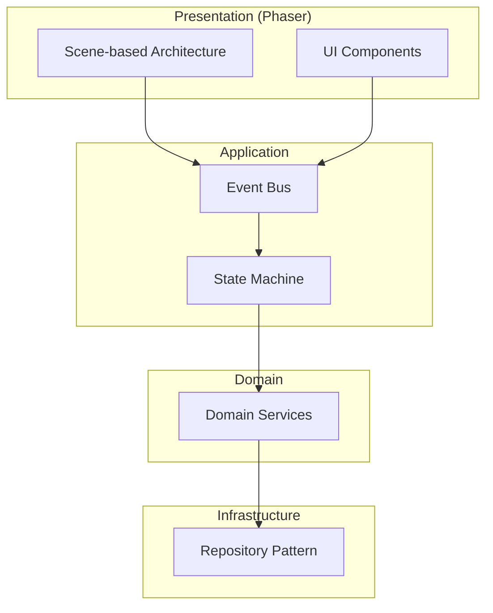
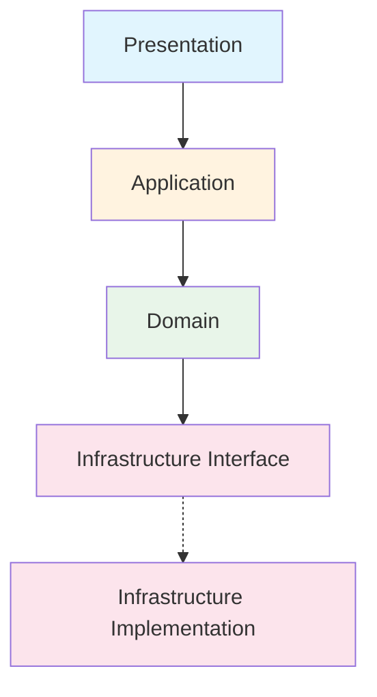
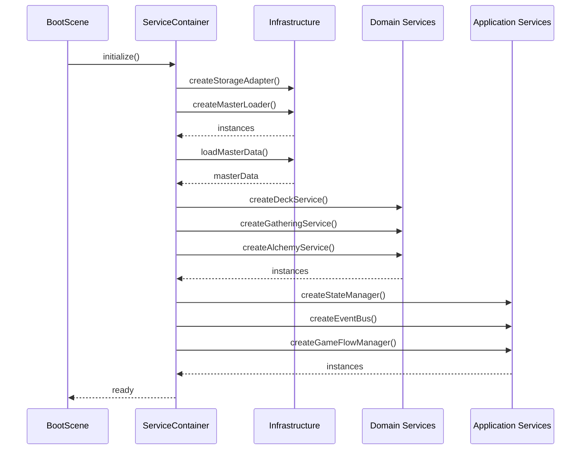
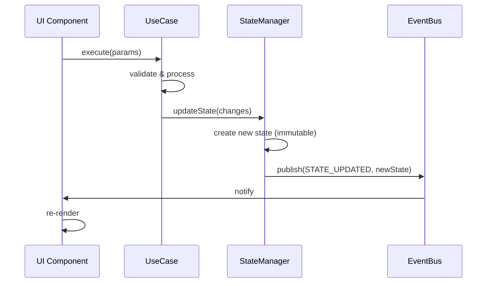

# システムアーキテクチャ設計書

**バージョン**: 2.1.0
**作成日**: 2026-01-01
**最終更新**: 2026-01-16
**対象**: アトリエ錬金術ゲーム（ギルドランク制）Phaser版

# システムアーキテクチャ設計書 - 概要

このドキュメントは [システムアーキテクチャ設計書](architecture.md) の一部なのだ。

---

## 概要

本ドキュメントは、錬金術をテーマにしたギルドランク制デッキ構築RPGのシステムアーキテクチャを定義する。

### システム概要

> 錬金術師（プレイヤー）が、採取地カードとレシピカードのデッキを駆使し、
> 依頼を達成して貢献度を稼ぎ、ギルドランクという「敵」を倒していく
> 「戦略的デッキ構築」と「ランクアップの達成感」を味わうゲーム

### アーキテクチャの特徴

- **Clean Architecture（4層構造）** によるビジネスロジックの独立性確保
- **Phaserフレームワーク** による洗練されたゲームUI表現
- **イベント駆動設計** による疎結合な通信
- Domain/Application/Infrastructure層は既存設計を維持し、Presentation層のみPhaserに置き換え

### 信頼性レベル凡例

- 🔵 **青信号**: 要件定義書・既存設計書に詳細記載
- 🟡 **黄信号**: 要件定義書・既存設計から妥当な推測
- 🔴 **赤信号**: Phaser対応のための新規追加

---

## 1. 技術スタック 🔴

### 1.1 フロントエンド

| 技術 | バージョン | 用途 |
|------|-----------|------|
| TypeScript | 5.x | メイン言語 |
| **Phaser** | 3.87+ | ゲームフレームワーク |
| **rexUI Plugin** | 最新 | UIコンポーネント（ダイアログ、ボタン等） |
| Vite | 5.x | ビルドツール |

### 1.2 データ永続化

| 技術 | 用途 | 詳細 |
|------|------|------|
| localStorage | セーブデータ保存 | 3スロット対応、自動セーブ |
| JSON | マスターデータ形式 | ビルド時にバンドル |

### 1.3 依存ライブラリ

| ライブラリ | 用途 | 必須 |
|-----------|------|------|
| phaser | ゲームフレームワーク | ○ |
| phaser3-rex-plugins | UI拡張（Dialog, Buttons, Sizer等） | ○ |

### 1.4 設計方針

- 既存のDomain/Application/Infrastructure層はそのまま維持
- Presentation層のみPhaserに置き換え
- ビジネスロジックはPhaserに依存しない
- 外部依存を必要最小限に抑える

---

## 2. アーキテクチャパターン 🟡

### 2.1 採用パターン

| パターン | 適用範囲 | 説明 |
|---------|---------|------|
| **Clean Architecture** | 全体構造 | 4層構造による責務分離 |
| **Scene-based Architecture** 🔴 | Presentation | Phaserのシーン管理を活用 |
| **イベント駆動設計** | 層間通信 | EventBusによる疎結合な通信 |
| **State Machine** | フェーズ管理 | 厳密な状態遷移制御 |
| **Repository Pattern** | データアクセス | データ層の抽象化 |
| **Service Locator** | 依存解決 | サービスのシングルトン管理 |

### 2.2 選択理由

| パターン | 理由 | メリット |
|---------|------|---------|
| Clean Architecture | ビジネスロジックの独立性確保 | テスタビリティ向上、フレームワーク変更に強い |
| Scene-based | Phaserの画面管理との親和性 | ライフサイクル管理の統一 |
| イベント駆動 | UI・ロジック間の疎結合化 | 拡張性確保、デバッグ容易 |
| State Machine | フェーズ遷移の厳密な管理 | 不正遷移防止、状態追跡 |

### 2.3 パターン間の関係



---

## 3. レイヤー構造 🔴

### 3.1 レイヤー図

```
┌─────────────────────────────────────────────────────────────────────────┐
│                     Presentation Layer (Phaser)                          │
│  (Phaser Scenes, GameObjects, rexUI Components)                         │
│                                                                          │
│  ┌──────────────┐ ┌──────────────┐ ┌──────────────┐ ┌──────────────┐   │
│  │BootScene    │ │ TitleScene   │ │ MainScene    │ │ ShopScene    │   │
│  │・アセット   │ │・新規/続行   │ │・4フェーズUI │ │・カード購入  │   │
│  │  ロード     │ │・セーブ選択  │ │・手札/デッキ │ │・アイテム    │   │
│  └──────────────┘ └──────────────┘ └──────────────┘ └──────────────┘   │
│  ┌──────────────┐ ┌──────────────┐ ┌──────────────┐                     │
│  │RankUpScene  │ │GameOverScene │ │GameClearScene│                     │
│  │・昇格試験   │ │・失敗演出    │ │・クリア演出  │                     │
│  │・報酬選択   │ │・リトライ    │ │・統計表示    │                     │
│  └──────────────┘ └──────────────┘ └──────────────┘                     │
│  ┌────────────────────────────────────────────────────────────────┐    │
│  │              UI Components (rexUI + Custom)                     │    │
│  │  CardView, HandView, DeckView, QuestPanel, PhaseIndicator      │    │
│  │  Dialog, Buttons, Sizer, ProgressBar, ScrollablePanel          │    │
│  └────────────────────────────────────────────────────────────────┘    │
└─────────────────────────────────────────────────────────────────────────┘
                              ↓↑ Events / Method Calls
┌─────────────────────────────────────────────────────────────────────────┐
│                        Application Layer                                 │
│  (ゲームフロー制御, 状態管理, イベント調整)                               │
│                                                                          │
│  ┌──────────────────────────────────────────────────────────────────┐   │
│  │                        GameFlowManager                            │   │
│  │  ・ゲーム全体のライフサイクル管理                                  │   │
│  │  ・シーン遷移の制御                                                │   │
│  │  ・ゲームオーバー/クリア判定のトリガー                             │   │
│  └──────────────────────────────────────────────────────────────────┘   │
│  ┌──────────────┐ ┌──────────────┐ ┌──────────────┐ ┌──────────────┐   │
│  │PhaseManager │ │ EventBus    │ │StateManager  │ │  UseCases    │   │
│  │・フェーズ   │ │・イベント   │ │・ゲーム状態  │ │・依頼受注    │   │
│  │  遷移制御   │ │  配信       │ │  一元管理    │ │・採取実行    │   │
│  │・スキップ   │ │・購読管理   │ │・不変更新    │ │・調合実行    │   │
│  │  判定       │ │             │ │              │ │・納品処理    │   │
│  └──────────────┘ └──────────────┘ └──────────────┘ └──────────────┘   │
└─────────────────────────────────────────────────────────────────────────┘
                              ↓↑ Method Calls
┌─────────────────────────────────────────────────────────────────────────┐
│                          Domain Layer                                    │
│  (ビジネスロジック, ドメインサービス, エンティティ)                       │
│                                                                          │
│  ┌──────────────┐ ┌──────────────┐ ┌──────────────┐ ┌──────────────┐   │
│  │ DeckService │ │GatheringSvc │ │ AlchemySvc  │ │ QuestService │   │
│  │・ドロー     │ │・ドラフト   │ │・調合計算   │ │・依頼生成    │   │
│  │・シャッフル │ │  採取       │ │・品質決定   │ │・期限管理    │   │
│  │・捨て札処理 │ │・素材獲得   │ │・レシピ適用 │ │・報酬計算    │   │
│  └──────────────┘ └──────────────┘ └──────────────┘ └──────────────┘   │
│  ┌──────────────┐ ┌──────────────┐ ┌──────────────┐ ┌──────────────┐   │
│  │ContribCalc  │ │ ShopService │ │ RankService │ │ArtifactSvc   │   │
│  │・貢献度     │ │・カード購入 │ │・昇格判定   │ │・効果適用    │   │
│  │  算出       │ │・アイテム   │ │・試験管理   │ │・所持管理    │   │
│  │・ボーナス   │ │  購入       │ │・ランク更新 │ │              │   │
│  └──────────────┘ └──────────────┘ └──────────────┘ └──────────────┘   │
│  ┌──────────────┐ ┌──────────────┐                                      │
│  │MaterialSvc  │ │InventorySvc │   Entities:                           │
│  │・品質計算   │ │・素材管理   │   Card, Material, Item, Quest,        │
│  │・属性決定   │ │・アイテム   │   Artifact, Rank, Client              │
│  │             │ │  管理       │                                        │
│  └──────────────┘ └──────────────┘                                      │
└─────────────────────────────────────────────────────────────────────────┘
                              ↓↑ Data Access
┌─────────────────────────────────────────────────────────────────────────┐
│                       Infrastructure Layer                               │
│  (データアクセス, 外部システム連携, ユーティリティ)                       │
│                                                                          │
│  ┌──────────────┐ ┌──────────────┐ ┌──────────────┐ ┌──────────────┐   │
│  │SaveDataRepo │ │MasterLoader │ │RandomGen     │ │StorageAdapter│   │
│  │・セーブ     │ │・JSON読込   │ │・乱数生成    │ │・localStorage│   │
│  │・ロード     │ │・バリデート │ │・シード管理  │ │  抽象化      │   │
│  │・削除       │ │・キャッシュ │ │              │ │              │   │
│  └──────────────┘ └──────────────┘ └──────────────┘ └──────────────┘   │
└─────────────────────────────────────────────────────────────────────────┘
```

### 3.2 各レイヤーの責務詳細

| レイヤー | 責務 | 依存可能 | 禁止事項 |
|---------|------|---------|---------|
| **Presentation** | UI表示、ユーザー入力受付、アニメーション | Application | ビジネスロジック実装 |
| **Application** | ゲームフロー制御、状態管理、イベント調整 | Domain | データ永続化直接呼び出し |
| **Domain** | ビジネスロジック、ゲームルール実装 | Infrastructure(IF経由) | UI/フレームワーク依存 |
| **Infrastructure** | データ永続化、外部連携、ユーティリティ | なし | ビジネスロジック実装 |

### 3.3 依存性の方向



**依存性逆転の原則（DIP）適用箇所**:
- Domain層はInfrastructure層の**インターフェース**にのみ依存
- 実装はInfrastructure層で行い、起動時に注入

---

## 4. サービス初期化とライフサイクル 🟡

### 4.1 サービスコンテナ

```typescript
// サービスの初期化順序と依存関係
class ServiceContainer {
  // Infrastructure層（最初に初期化）
  private storageAdapter: IStorageAdapter;
  private masterLoader: IMasterDataLoader;
  private randomGenerator: IRandomGenerator;
  private saveDataRepository: ISaveDataRepository;

  // Domain層（Infrastructure層の後に初期化）
  private deckService: IDeckService;
  private gatheringService: IGatheringService;
  private alchemyService: IAlchemyService;
  // ...

  // Application層（Domain層の後に初期化）
  private stateManager: IStateManager;
  private eventBus: IEventBus;
  private phaseManager: IPhaseManager;
  private gameFlowManager: IGameFlowManager;
}
```

### 4.2 初期化シーケンス



---

## 5. エラーハンドリング戦略 🟡

### 5.1 エラー分類

| カテゴリ | 例 | 対処方針 |
|---------|---|---------|
| **致命的エラー** | マスターデータ破損、セーブデータ読込失敗 | エラー画面表示、再起動促進 |
| **回復可能エラー** | 操作不可（素材不足等）、無効な遷移 | ユーザーへ通知、操作キャンセル |
| **警告** | 非推奨操作、パフォーマンス警告 | コンソールログ、続行 |

### 5.2 エラー伝播

```typescript
// Domain層のエラー
class DomainError extends Error {
  constructor(
    public readonly code: string,
    message: string,
    public readonly details?: unknown
  ) {
    super(message);
  }
}

// Application層での変換
class ApplicationError extends Error {
  constructor(
    public readonly userMessage: string,
    public readonly originalError?: Error
  ) {
    super(userMessage);
  }
}
```

### 5.3 レイヤー別エラー処理

| レイヤー | 責務 | 処理内容 |
|---------|------|---------|
| **Presentation** | エラー表示 | ダイアログ/トースト表示、UI状態リセット |
| **Application** | エラー変換 | Domain→ユーザーメッセージ変換、ロギング |
| **Domain** | エラー生成 | ビジネスルール違反の検出、詳細エラー生成 |
| **Infrastructure** | エラーラップ | 外部エラーのドメインエラー変換 |

---

## 6. 状態管理設計 🔵

### 6.1 GameStateの構造

```typescript
interface GameState {
  // 進行状態
  currentDay: number;           // 現在日数（1-30）
  currentPhase: Phase;          // 現在フェーズ
  currentRank: RankId;          // 現在ランク（G-S）

  // プレイヤーリソース
  gold: number;                 // 所持金
  promotionGauge: number;       // 昇格ゲージ（0-100）
  requiredContribution: number; // 必要貢献度

  // デッキ状態
  deck: CardId[];               // 山札
  hand: CardId[];               // 手札
  discardPile: CardId[];        // 捨て札

  // インベントリ
  materials: MaterialInstance[]; // 所持素材
  items: ItemInstance[];         // 所持アイテム
  artifacts: ArtifactId[];       // 所持アーティファクト

  // 依頼状態
  availableQuests: Quest[];     // 受注可能依頼
  acceptedQuests: Quest[];      // 受注済み依頼

  // 昇格試験状態（RankUpScene用）
  promotionTest?: PromotionTestState;
}
```

### 6.2 状態更新パターン



### 6.3 不変性の保証

```typescript
class StateManager {
  private state: Readonly<GameState>;

  updateState(changes: Partial<GameState>): void {
    // 新しい状態オブジェクトを作成（イミュータブル更新）
    this.state = Object.freeze({
      ...this.state,
      ...changes,
      // ネストしたオブジェクトも新規作成
      materials: changes.materials
        ? [...changes.materials]
        : this.state.materials,
    });

    this.eventBus.publish('STATE_UPDATED', this.state);
  }
}
```

---

## 7. 通信パターン 🔴

### 7.1 イベントカタログ

| イベント名 | 発行元 | 購読者 | ペイロード |
|-----------|--------|--------|-----------|
| `STATE_UPDATED` | StateManager | 全シーン | `GameState` |
| `PHASE_CHANGED` | PhaseManager | MainScene | `{ from, to }` |
| `QUEST_ACCEPTED` | QuestUseCase | QuestPanel | `Quest` |
| `GATHERING_COMPLETED` | GatheringUseCase | GatheringUI | `Material[]` |
| `ITEM_CRAFTED` | AlchemyUseCase | AlchemyUI | `Item` |
| `QUEST_DELIVERED` | DeliveryUseCase | QuestPanel | `DeliveryResult` |
| `RANK_UP_TRIGGERED` | RankService | GameFlowManager | `RankId` |
| `GAME_OVER` | GameFlowManager | MainScene | `GameOverReason` |
| `GAME_CLEAR` | GameFlowManager | MainScene | `ClearStats` |

### 7.2 イベントバスの実装

```typescript
interface IEventBus {
  publish<T>(event: string, payload: T): void;
  subscribe<T>(event: string, handler: (payload: T) => void): () => void;
  unsubscribe(event: string, handler: Function): void;
  unsubscribeAll(): void;
}
```

### 7.3 Scene-EventBus連携

```typescript
abstract class BaseGameScene extends Phaser.Scene {
  protected eventBus: IEventBus;
  private subscriptions: (() => void)[] = [];

  create(): void {
    this.bindEvents();
  }

  protected bindEvents(): void {
    // サブクラスでオーバーライド
  }

  protected subscribe<T>(
    event: string,
    handler: (payload: T) => void
  ): void {
    const unsubscribe = this.eventBus.subscribe(event, handler);
    this.subscriptions.push(unsubscribe);
  }

  shutdown(): void {
    // 全購読解除
    this.subscriptions.forEach(unsub => unsub());
    this.subscriptions = [];
  }
}
```

---

## 8. パフォーマンス考慮事項 🟡

### 8.1 メモリ管理

| 対象 | 戦略 | 実装 |
|------|------|------|
| **シーン** | 遅延ロード | 必要時にのみシーン開始 |
| **UI部品** | オブジェクトプール | CardView等の再利用 |
| **イベント** | 適切な購読解除 | シーン終了時に全解除 |
| **画像** | アトラス化 | スプライトシート使用 |

### 8.2 レンダリング最適化

```typescript
// 差分更新の例
class HandView {
  private cards: CardView[] = [];

  update(newHand: CardId[]): void {
    // 変更があった部分のみ更新
    const changes = this.diffCards(this.currentHand, newHand);

    changes.removed.forEach(id => this.removeCard(id));
    changes.added.forEach(id => this.addCard(id));
    changes.moved.forEach(({ id, newIndex }) => {
      this.moveCard(id, newIndex);
    });
  }
}
```

### 8.3 ロード時間の最適化

| フェーズ | 処理 | 目標時間 |
|---------|------|---------|
| **Boot** | 必須アセットのみ | < 2秒 |
| **Title表示後** | 残りアセット非同期ロード | バックグラウンド |
| **シーン遷移** | プリロード済みデータ使用 | < 500ms |

---

## 9. テスト戦略 🟡

### 9.1 テストレイヤー

| レイヤー | テスト種別 | ツール | カバレッジ目標 |
|---------|-----------|--------|---------------|
| **Domain** | ユニットテスト | Vitest | 90%+ |
| **Application** | 統合テスト | Vitest | 80%+ |
| **Presentation** | E2Eテスト | Playwright | 主要フロー |
| **全体** | スナップショット | Vitest | 状態遷移 |

### 9.2 モック戦略

```typescript
// Infrastructure層のモック
const mockMasterLoader: IMasterDataLoader = {
  loadCards: () => Promise.resolve(testCards),
  loadMaterials: () => Promise.resolve(testMaterials),
  // ...
};

// Domain層の単体テスト
describe('DeckService', () => {
  let deckService: DeckService;

  beforeEach(() => {
    deckService = new DeckService(mockRandomGenerator);
  });

  test('ドローで手札が増える', () => {
    const initialHand = [];
    const deck = ['card1', 'card2', 'card3'];

    const result = deckService.draw(deck, initialHand, 2);

    expect(result.hand).toHaveLength(2);
    expect(result.deck).toHaveLength(1);
  });
});
```

---

## 10. セキュリティ考慮事項 🟡

### 10.1 データ保護

| リスク | 対策 |
|--------|------|
| **セーブデータ改ざん** | チェックサム検証（将来実装） |
| **XSS** | ユーザー入力のサニタイズ（該当箇所なし） |
| **ローカルストレージ上限** | 容量チェック、古いデータ削除案内 |

### 10.2 ゲームバランス保護

- 乱数シードの非公開化
- クライアントサイドのみのためチート対策は限定的
- 将来的なサーバー連携時の設計余地を確保

---

## 関連文書

- [→ Phaser実装設計](architecture-phaser.md) - シーン構成、rexUIコンポーネント、フェーズUI
- [コンポーネント設計](architecture-components.md) - サービス詳細、イベントフロー、ディレクトリ構造
- [コアシステム設計](core-systems-overview.md)
- [データスキーマ設計](data-schema.md)
- [データフロー設計](dataflow.md)

---

## 変更履歴

| 日付 | バージョン | 変更内容 |
|------|----------|---------|
| 2026-01-01 | 2.0.0 | Phaser版として初版作成 |
| 2026-01-14 | 2.0.0 | 関連文書リンク更新 |
| 2026-01-16 | 2.1.0 | 詳細化：サービス初期化、エラーハンドリング、状態管理、通信パターン、パフォーマンス、テスト戦略、セキュリティ追加 |
