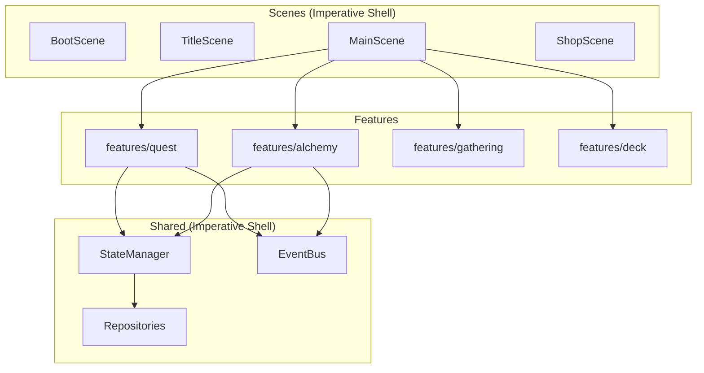
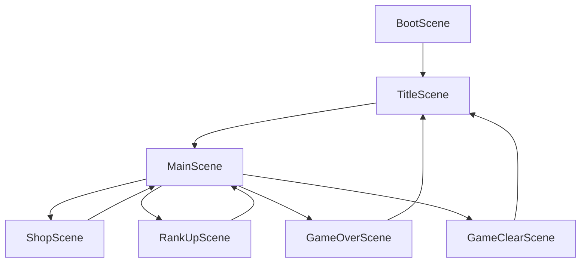

# システムアーキテクチャ設計書

**バージョン**: 3.0.0
**作成日**: 2026-01-01
**最終更新**: 2026-02-09
**対象**: アトリエ錬金術ゲーム（ギルドランク制）Phaser版

# システムアーキテクチャ設計書 - 概要

このドキュメントは本プロジェクトのアーキテクチャ設計を定義する。

---

## 概要

本ドキュメントは、錬金術をテーマにしたギルドランク制デッキ構築RPGのシステムアーキテクチャを定義する。

### システム概要

> 錬金術師（プレイヤー）が、採取地カードとレシピカードのデッキを駆使し、
> 依頼を達成して貢献度を稼ぎ、ギルドランクという「敵」を倒していく
> 「戦略的デッキ構築」と「ランクアップの達成感」を味わうゲーム

### アーキテクチャの特徴

- **Feature-Based Architecture** による機能単位のコード配置
- **Functional Core, Imperative Shell** による純粋関数とI/Oの分離
- **Phaserフレームワーク** による洗練されたゲームUI表現
- **イベント駆動設計** による疎結合な通信

### 信頼性レベル凡例

- 🔵 **青信号**: 要件定義書・既存設計書に詳細記載
- 🟡 **黄信号**: 要件定義書・既存設計から妥当な推測
- 🔴 **赤信号**: 新規追加・変更

---

## 1. 技術スタック 🔵

### 1.1 コア技術

| カテゴリ | 技術 | バージョン | 用途 |
|---------|------|-----------|------|
| **言語** | TypeScript | 5.x | 型安全な開発 |
| **ゲームFW** | Phaser | 3.87+ | 2Dゲームエンジン |
| **UIプラグイン** | rexUI | 最新 | ゲーム内UI（Canvas） |
| **スタイリング** | Tailwind CSS | 4.x | オーバーレイUI（HTML） |
| **ビルド** | Vite | 6.x | 高速ビルド・HMR |

### 1.2 開発ツール

| カテゴリ | 技術 | バージョン | 用途 |
|---------|------|-----------|------|
| **パッケージ** | pnpm | 9.x | 高速・省容量パッケージ管理 |
| **Lint/Format** | Biome | 2.x | 統合リンター・フォーマッター |
| **Git Hooks** | Lefthook | 1.x | コミット品質管理 |

### 1.3 テスト・ドキュメント

| カテゴリ | 技術 | バージョン | 用途 |
|---------|------|-----------|------|
| **Unit Test** | Vitest | 2.x | 高速ユニットテスト |
| **E2E Test** | Playwright | 最新 | ブラウザテスト |
| **ドキュメント** | TypeDoc | 最新 | API文書生成 |

### 1.4 データ永続化

| 技術 | 用途 | 詳細 |
|------|------|------|
| localStorage | セーブデータ保存 | 3スロット対応、自動セーブ |
| JSON | マスターデータ形式 | ビルド時にバンドル |

---

## 2. アーキテクチャパターン 🔴

### 2.1 採用パターン

| パターン | 適用範囲 | 説明 |
|---------|---------|------|
| **Feature-Based Architecture** | 全体構造 | 機能単位でのコード配置 |
| **Functional Core, Imperative Shell** | ロジック分離 | 純粋関数とI/Oの分離 |
| **Scene-based Architecture** | Presentation | Phaserのシーン管理を活用 |
| **イベント駆動設計** | コンポーネント間通信 | EventBusによる疎結合な通信 |

### 2.2 Feature-Based Architecture

コードを技術的なレイヤーではなく、**機能（Feature）単位**で整理する。

#### メリット

- **高凝集**: 関連するコードが近くに配置される
- **低結合**: 機能間の依存が明確になる
- **スケーラビリティ**: 新機能追加時に既存コードへの影響が少ない
- **削除容易性**: 機能をフォルダごと削除できる

#### 機能モジュール構成

```
features/{feature-name}/
├── components/     # UI コンポーネント
├── services/       # ビジネスロジック（純粋関数）
├── types/          # 型定義
└── index.ts        # 公開API
```

### 2.3 Functional Core, Imperative Shell

アプリケーションを2つの部分に分離する。

| 部分 | 責務 | 特徴 |
|------|------|------|
| **Functional Core** | ビジネスロジック | 純粋関数、副作用なし、テスト容易 |
| **Imperative Shell** | I/O、状態管理、UI | 副作用あり、外部との境界 |

#### Functional Core（純粋関数）に置くもの

- 計算ロジック（報酬計算、品質計算、ダメージ計算等）
- バリデーション
- データ変換
- ビジネスルール判定

#### Imperative Shell（副作用）に置くもの

- Phaserシーン
- UIコンポーネント
- StateManager操作
- EventBus操作
- ローカルストレージ読み書き

### 2.4 パターン間の関係



---

## 3. ディレクトリ構造 🔴

### 3.1 全体構造

```
atelier-guild-rank/
├── src/
│   ├── features/               # 機能単位のモジュール
│   │   ├── quest/              # 依頼機能
│   │   │   ├── components/     # QuestCard, QuestList, QuestDetailModal
│   │   │   ├── services/       # quest-generator, reward-calculator (純粋関数)
│   │   │   ├── types/          # Quest, Client 型定義
│   │   │   └── index.ts        # 公開API
│   │   ├── alchemy/            # 調合機能
│   │   │   ├── components/     # RecipeList, AlchemyPanel
│   │   │   ├── services/       # quality-calculator, recipe-validator (純粋関数)
│   │   │   ├── types/          # Recipe, Material 型定義
│   │   │   └── index.ts
│   │   ├── gathering/          # 採取機能
│   │   │   ├── components/     # GatheringField, MaterialCard
│   │   │   ├── services/       # material-generator, draft-logic (純粋関数)
│   │   │   ├── types/
│   │   │   └── index.ts
│   │   ├── deck/               # デッキ機能
│   │   │   ├── components/     # CardUI, HandDisplay, DeckView
│   │   │   ├── services/       # deck-operations, shuffle (純粋関数)
│   │   │   ├── types/          # Card 型定義
│   │   │   └── index.ts
│   │   ├── inventory/          # インベントリ機能
│   │   │   ├── components/     # InventoryPanel, ItemSlot
│   │   │   ├── services/       # inventory-operations (純粋関数)
│   │   │   ├── types/
│   │   │   └── index.ts
│   │   ├── shop/               # ショップ機能
│   │   │   ├── components/     # ShopPanel, ShopItemCard
│   │   │   ├── services/       # price-calculator (純粋関数)
│   │   │   ├── types/
│   │   │   └── index.ts
│   │   └── rank/               # ランク機能
│   │       ├── components/     # RankDisplay, RankUpPanel
│   │       ├── services/       # rank-calculator, promotion-checker (純粋関数)
│   │       ├── types/
│   │       └── index.ts
│   ├── shared/                 # 機能横断の共通コード
│   │   ├── components/         # BaseComponent, Button, Dialog
│   │   ├── services/           # EventBus, StateManager (Imperative Shell)
│   │   ├── repositories/       # SaveDataRepository, MasterDataRepository
│   │   ├── types/              # 共通型定義、GameState、Events
│   │   └── utils/              # ユーティリティ関数
│   ├── scenes/                 # Phaserシーン（機能を組み合わせる）
│   │   ├── BootScene.ts
│   │   ├── TitleScene.ts
│   │   ├── MainScene.ts
│   │   ├── ShopScene.ts
│   │   ├── RankUpScene.ts
│   │   ├── GameOverScene.ts
│   │   └── GameClearScene.ts
│   └── main.ts                 # エントリーポイント
├── tests/                      # テスト
│   ├── unit/
│   │   ├── features/           # 機能単位のテスト
│   │   └── shared/             # 共通コードのテスト
│   └── integration/
├── e2e/
│   ├── specs/
│   ├── pages/
│   └── fixtures/
└── public/
    └── assets/
```

### 3.2 各ディレクトリの責務

| ディレクトリ | 責務 | 含むもの |
|-------------|------|---------|
| `features/` | 機能単位のモジュール | UI、ロジック、型定義 |
| `shared/` | 機能横断の共通コード | EventBus、StateManager、共通UI |
| `scenes/` | Phaserシーン | 機能を組み合わせた画面 |
| `tests/` | テストコード | ユニット・統合テスト |
| `e2e/` | E2Eテスト | Playwrightテスト |

---

## 4. 機能モジュール詳細 🔴

### 4.1 Quest機能

```
features/quest/
├── components/
│   ├── QuestCard.ts            # 依頼カードUI
│   ├── QuestList.ts            # 依頼リストUI
│   └── QuestDetailModal.ts     # 依頼詳細モーダル
├── services/
│   ├── quest-generator.ts      # 依頼生成（純粋関数）
│   ├── quest-validator.ts      # 依頼検証（純粋関数）
│   └── reward-calculator.ts    # 報酬計算（純粋関数）
├── types/
│   ├── quest.ts                # Quest, QuestDifficulty
│   └── client.ts               # Client, ClientType
└── index.ts
```

**公開API例**:
```typescript
// features/quest/index.ts
export { QuestCard } from './components/QuestCard';
export { QuestList } from './components/QuestList';
export { generateQuest, validateQuest } from './services/quest-generator';
export { calculateReward } from './services/reward-calculator';
export type { Quest, QuestDifficulty, Client } from './types';
```

### 4.2 Alchemy機能

```
features/alchemy/
├── components/
│   ├── RecipeList.ts           # レシピリストUI
│   ├── AlchemyPanel.ts         # 調合パネルUI
│   └── QualityIndicator.ts     # 品質表示UI
├── services/
│   ├── quality-calculator.ts   # 品質計算（純粋関数）
│   ├── recipe-validator.ts     # レシピ検証（純粋関数）
│   └── crafting-logic.ts       # 調合ロジック（純粋関数）
├── types/
│   ├── recipe.ts               # Recipe
│   └── quality.ts              # Quality, Grade
└── index.ts
```

### 4.3 Deck機能

```
features/deck/
├── components/
│   ├── CardUI.ts               # カードUI
│   ├── HandDisplay.ts          # 手札表示
│   ├── DeckView.ts             # デッキ表示
│   └── DraggableCardUI.ts      # ドラッグ可能カード
├── services/
│   ├── deck-operations.ts      # デッキ操作（純粋関数）
│   ├── shuffle.ts              # シャッフル（純粋関数）
│   └── draw-logic.ts           # ドロー処理（純粋関数）
├── types/
│   └── card.ts                 # Card, CardType
└── index.ts
```

---

## 5. Shared（共通コード）詳細 🔴

### 5.1 Services（Imperative Shell）

| サービス | 責務 |
|---------|------|
| EventBus | コンポーネント間のイベント通信 |
| StateManager | ゲーム状態の一元管理（イミュータブル） |
| GameFlowManager | シーン遷移・ゲームライフサイクル |

### 5.2 Repositories

| リポジトリ | 責務 |
|-----------|------|
| SaveDataRepository | セーブデータの永続化 |
| MasterDataRepository | マスターデータの読み込み・キャッシュ |

### 5.3 Components

| コンポーネント | 責務 |
|---------------|------|
| BaseComponent | UIコンポーネントの基底クラス |
| Button | ボタンUI |
| Dialog | ダイアログUI |

---

## 6. Phaserシーン 🔵

### 6.1 シーン一覧

| シーン | 責務 | 使用する機能 |
|--------|------|-------------|
| **BootScene** | アセットロード・サービス初期化 | shared |
| **TitleScene** | タイトル・セーブスロット選択 | shared |
| **MainScene** | メインゲーム（4フェーズ） | quest, gathering, alchemy, deck, inventory |
| **ShopScene** | カード・アイテム購入 | shop, deck |
| **RankUpScene** | 昇格試験 | rank |
| **GameOverScene** | 失敗演出・リトライ | shared |
| **GameClearScene** | クリア演出・統計表示 | shared |

### 6.2 シーン遷移図



---

## 7. インポートルール 🔴

### 7.1 パスエイリアス

```typescript
// tsconfig.json
{
  "compilerOptions": {
    "paths": {
      "@features/*": ["src/features/*"],
      "@shared/*": ["src/shared/*"],
      "@scenes/*": ["src/scenes/*"]
    }
  }
}
```

### 7.2 インポートルール

```typescript
// 機能間のインポート: index.ts経由
import { Quest, generateQuest } from '@features/quest';
import { Card } from '@features/deck';

// 機能内のインポート: 直接参照OK
import { QuestCard } from './components/QuestCard';
import { validateQuest } from './services/quest-validator';

// 共通コード
import { EventBus } from '@shared/services';
import { Button } from '@shared/components';
```

### 7.3 依存ルール

- 機能モジュールは他の機能モジュールの`index.ts`経由でのみインポート可能
- 機能モジュールは`shared/`に依存可能
- `shared/`は特定の機能モジュールに依存してはならない
- `scenes/`は任意の機能モジュールと`shared/`に依存可能

---

## 8. テスト戦略 🔴

### 8.1 テスト対象の分類

| 部分 | テスト方法 | カバレッジ目標 |
|------|-----------|--------------|
| **Functional Core** | ユニットテスト（モック不要） | 90%+ |
| **Imperative Shell** | 統合テスト・E2Eテスト | 60%+ |

### 8.2 Functional Coreのテスト例

```typescript
// features/alchemy/services/quality-calculator.test.ts
describe('calculateQuality', () => {
  it('素材の平均品質を計算する', () => {
    const materials = [{ quality: 80 }, { quality: 60 }];
    const recipe = { qualityBonus: 10 };

    const result = calculateQuality(materials, recipe);

    expect(result.quality).toBe(80); // (80+60)/2 + 10
    expect(result.grade).toBe('A');
  });
});
```

### 8.3 テストファイル配置

```
tests/
├── unit/
│   ├── features/
│   │   ├── quest/
│   │   │   └── quest-generator.test.ts
│   │   ├── alchemy/
│   │   │   └── quality-calculator.test.ts
│   │   └── deck/
│   │       └── deck-operations.test.ts
│   └── shared/
│       └── state-manager.test.ts
└── integration/
```

---

## 9. 設計原則 🔴

### 9.1 禁止事項

- 機能モジュール間の直接的な内部参照（`index.ts`経由で公開されていないものをインポート）
- Functional Core内での副作用（状態変更、I/O、乱数生成等）
- Imperative Shell内での複雑なビジネスロジック
- 循環依存の発生
- `src/`内へのテストファイル配置

### 9.2 推奨事項

- 機能モジュールは自己完結的に設計
- 純粋関数は入力のみに依存し、常に同じ結果を返す
- UIコンポーネントはBaseComponentを継承
- イベント駆動でコンポーネント間を疎結合に保つ

---

## 関連文書

- [アーキテクチャ - コンポーネント詳細](architecture-components.md)
- [アーキテクチャ - Phaser実装詳細](architecture-phaser.md)
- [コアシステム - 概要](core-systems-overview.md)
- [データフロー](dataflow.md)
- [プロジェクトルール](.claude/rules/architecture.md)
