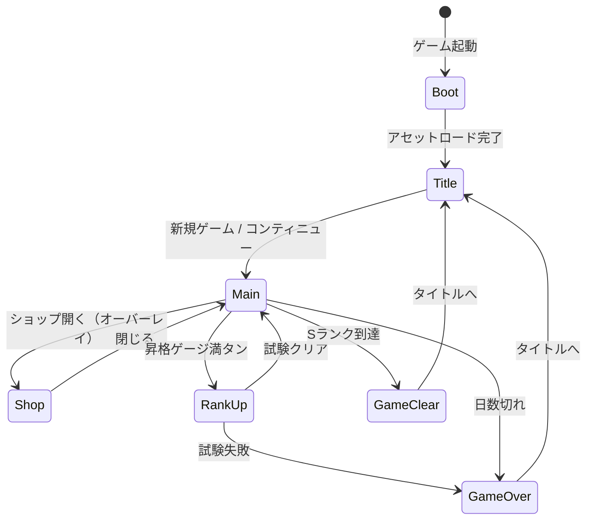
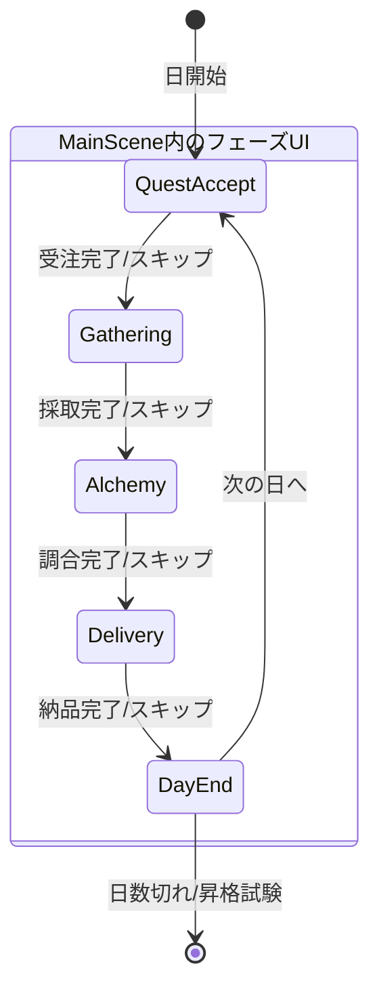
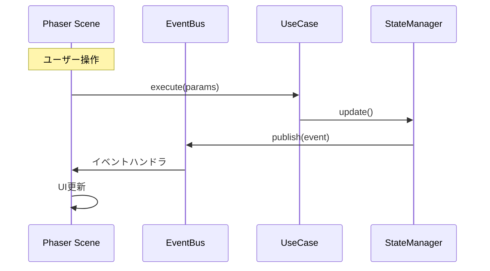

# システムアーキテクチャ設計書

**バージョン**: 2.0.0
**作成日**: 2026-01-01
**最終更新**: 2026-01-14
**対象**: アトリエ錬金術ゲーム（ギルドランク制）Phaser版

# システムアーキテクチャ設計書 - Phaser実装設計

このドキュメントは [システムアーキテクチャ設計書](architecture.md) の一部なのだ。

---

## 4. Phaser シーン構成 🔴

### 4.1 シーン一覧

| シーンキー | クラス名 | 説明 | 依存シーン |
|-----------|---------|------|-----------|
| `Boot` | BootScene | アセットプリロード、初期化 | - |
| `Title` | TitleScene | タイトル画面 | Boot |
| `Main` | MainScene | メインゲームプレイ（4フェーズ） | Title |
| `Shop` | ShopScene | ショップ（オーバーレイ） | Main |
| `RankUp` | RankUpScene | 昇格試験 | Main |
| `GameOver` | GameOverScene | ゲームオーバー画面 | Main |
| `GameClear` | GameClearScene | ゲームクリア画面 | Main |

### 4.2 シーンライフサイクル

```typescript
class BaseGameScene extends Phaser.Scene {
  // Phaserライフサイクル
  init(data?: SceneData): void;      // シーン初期化
  preload(): void;                    // アセットロード
  create(data?: SceneData): void;     // オブジェクト生成
  update(time: number, delta: number): void; // 毎フレーム更新

  // 追加メソッド（アプリケーション層との連携）
  protected bindEvents(): void;       // EventBus購読
  protected unbindEvents(): void;     // EventBus購読解除
}
```

### 4.3 シーン遷移図 🔵



---

## 5. Phaser ゲームコンフィグ 🔴

### 5.1 基本設定

```typescript
const gameConfig: Phaser.Types.Core.GameConfig = {
  type: Phaser.AUTO,           // WebGL優先、Canvas fallback
  parent: 'game-container',     // 親要素ID
  width: 1280,                  // ゲーム幅
  height: 720,                  // ゲーム高さ
  backgroundColor: '#F5F5DC',   // ベージュ（羊皮紙風）
  scale: {
    mode: Phaser.Scale.FIT,     // 画面にフィット
    autoCenter: Phaser.Scale.CENTER_BOTH,
  },
  scene: [
    BootScene,
    TitleScene,
    MainScene,
    ShopScene,
    RankUpScene,
    GameOverScene,
    GameClearScene,
  ],
  plugins: {
    scene: [
      {
        key: 'rexUI',
        plugin: UIPlugin,
        mapping: 'rexUI',
      },
    ],
  },
  dom: {
    createContainer: false,     // DOM要素は使用しない
  },
};
```

### 5.2 解像度とスケーリング

| 設定 | 値 | 理由 |
|------|-----|------|
| 基準解像度 | 1280 x 720 | 16:9の標準HD |
| スケールモード | FIT | アスペクト比維持でフィット |
| 最小解像度 | 960 x 540 | モバイル対応 |

---

## 6. UIコンポーネント設計（rexUI）🔴

### 6.1 使用するrexUIコンポーネント

| コンポーネント | 用途 | 対応UI |
|--------------|------|--------|
| **Dialog** | モーダルダイアログ | 確認、報酬選択、依頼詳細 |
| **Buttons** | ボタングループ | フェーズ操作、メニュー |
| **GridButtons** | グリッド配置ボタン | カード選択、素材選択 |
| **Sizer** | レイアウト制御 | 全般的なUI配置 |
| **OverlapSizer** | 重ね合わせレイアウト | カード重ね表示 |
| **ProgressBar** | 進捗表示 | 昇格ゲージ、日数バー |
| **Label** | テキスト＋アイコン | ステータス表示 |
| **ScrollablePanel** | スクロールパネル | 依頼一覧、インベントリ |
| **Toast** | 通知メッセージ | 獲得通知、警告 |

### 6.2 カスタムUIコンポーネント

| コンポーネント | 継承元 | 説明 |
|--------------|-------|------|
| CardView | Container | カード表示（採取地/レシピ/強化） |
| HandView | Container | 手札表示エリア |
| DeckView | Container | 山札・捨て札表示 |
| MaterialView | Container | 素材表示 |
| MaterialOptionView | GridButtons | ドラフト採取の素材選択 |
| InventoryView | ScrollablePanel | インベントリ表示 |
| QuestView | Container | 依頼表示 |
| QuestListView | ScrollablePanel | 依頼一覧 |
| ClientView | Container | 依頼者表示 |
| RankProgressView | ProgressBar | ランク進捗バー |
| PhaseIndicator | Container | 現在フェーズ表示 |
| ActionPointView | Label | 行動ポイント表示 |
| GoldView | Label | 所持金表示 |
| DayCounter | Label | 残り日数表示 |
| RewardCardSelector | Dialog | 報酬カード選択 |
| ButtonComponent | rexUI.Buttons | カスタムボタン（プライマリ/セカンダリ） |

---

## 7. MainSceneのフェーズUI構造 🔴

### 7.1 フェーズ別UIコンテナ

MainSceneは1つのシーン内で4つのフェーズUIを切り替える。

```typescript
class MainScene extends Phaser.Scene {
  // フェーズUIコンテナ
  private questAcceptUI: QuestAcceptPhaseUI;
  private gatheringUI: GatheringPhaseUI;
  private alchemyUI: AlchemyPhaseUI;
  private deliveryUI: DeliveryPhaseUI;

  // 共通UI
  private headerUI: HeaderUI;        // ランク、日数、ゴールド等
  private sidebarUI: SidebarUI;      // 依頼一覧、インベントリ
  private phaseIndicator: PhaseIndicator;
  private handUI: HandUI;            // 手札表示

  // 現在のフェーズ
  private currentPhaseUI: BasePhaseUI | null;
}
```

### 7.2 フェーズ遷移 🔵



---

## 8. Phaser-Application層連携 🔴

### 8.1 連携パターン



### 8.2 イベントバインディング例

```typescript
class MainScene extends Phaser.Scene {
  private eventBus: IEventBus;

  create(): void {
    this.bindEvents();
  }

  private bindEvents(): void {
    // Application層からのイベントを購読
    this.eventBus.subscribe('PHASE_CHANGED', this.onPhaseChanged.bind(this));
    this.eventBus.subscribe('QUEST_ACCEPTED', this.onQuestAccepted.bind(this));
    this.eventBus.subscribe('GATHERING_COMPLETED', this.onGatheringCompleted.bind(this));
    this.eventBus.subscribe('ITEM_CRAFTED', this.onItemCrafted.bind(this));
    this.eventBus.subscribe('QUEST_DELIVERED', this.onQuestDelivered.bind(this));
    this.eventBus.subscribe('STATE_UPDATED', this.onStateUpdated.bind(this));
  }

  shutdown(): void {
    this.unbindEvents();
  }

  private unbindEvents(): void {
    this.eventBus.unsubscribeAll();
  }
}
```

---


---

## 関連文書

- [← 概要](architecture-overview.md) - 技術スタック、レイヤー構造、状態管理、通信パターン等
- [→ コンポーネント設計](architecture-components.md) - サービス詳細、ディレクトリ構造
- [UI設計](ui-design/)

---

## 変更履歴

| 日付 | バージョン | 変更内容 |
|------|----------|---------|
| 2026-01-01 | 2.0.0 | Phaser版として初版作成 |
| 2026-01-14 | 2.0.0 | 関連文書リンク更新 |
| 2026-01-16 | 2.0.1 | 関連文書に説明追加 |
