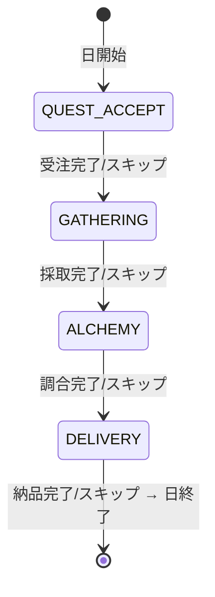
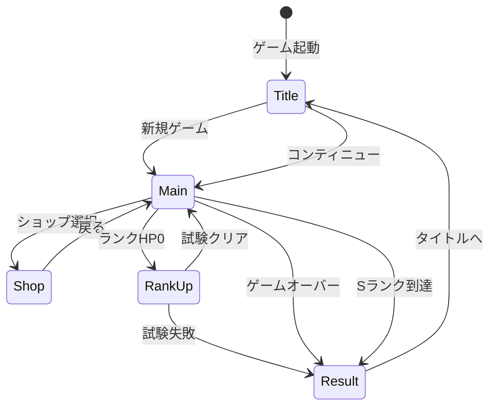
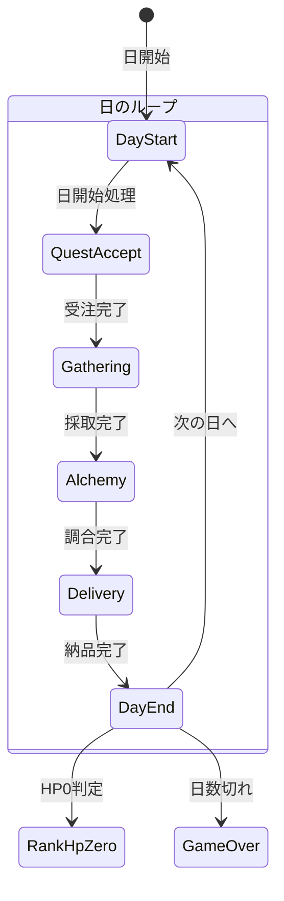
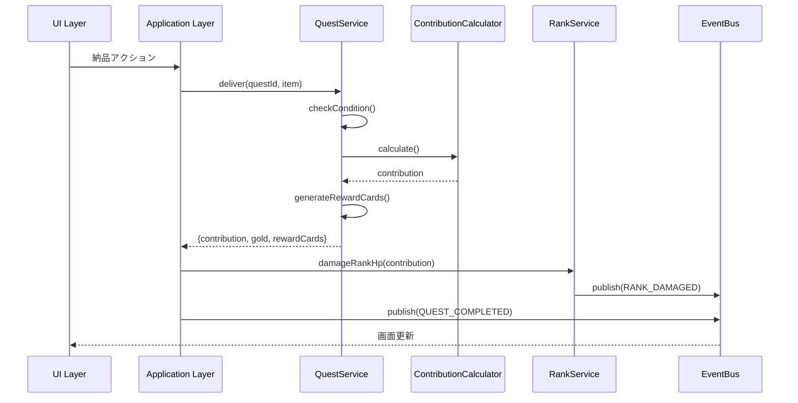
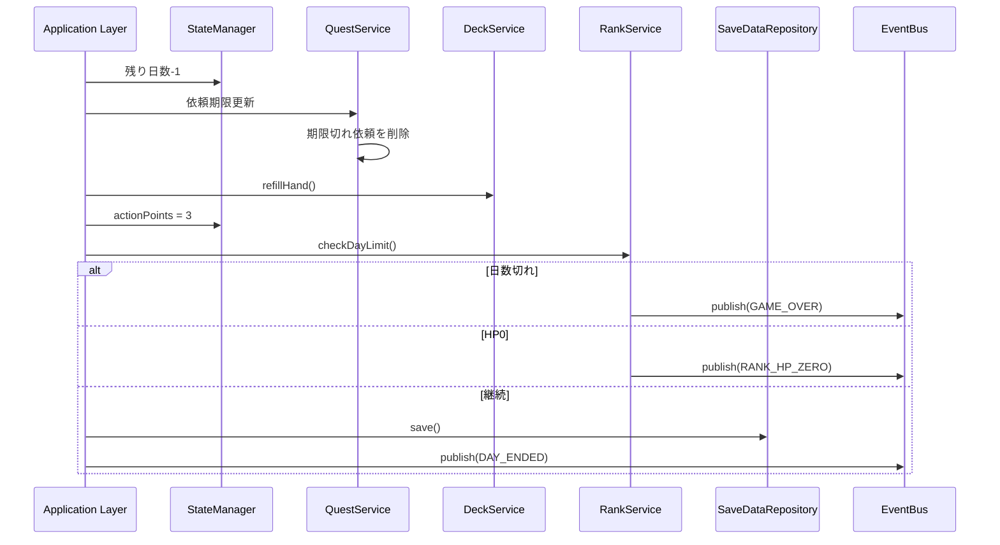

# システムアーキテクチャ設計書

**バージョン**: 1.0.0
**作成日**: 2026-01-01
**対象**: アトリエ錬金術ゲーム（ギルドランク制）HTML版

---

## 概要

本ドキュメントは、錬金術をテーマにしたギルドランク制デッキ構築RPGのシステムアーキテクチャを定義する。

### システム概要

> 錬金術師（プレイヤー）が、採取地カードとレシピカードのデッキを駆使し、
> 依頼を達成して貢献度を稼ぎ、ギルドランクという「敵」を倒していく
> 「戦略的デッキ構築」と「ランクアップの達成感」を味わうゲーム

### 信頼性レベル凡例

- 🔵 **青信号**: 要件定義書に詳細記載
- 🟡 **黄信号**: 要件定義書から妥当な推測
- 🔴 **赤信号**: 要件定義書にない推測

---

## 1. 技術スタック 🟡

### 1.1 フロントエンド

| 技術 | バージョン | 用途 |
|------|-----------|------|
| TypeScript | 5.x | メイン言語 |
| HTML5 | - | UI構造 |
| CSS3 | - | スタイリング |
| Vite | 5.x | ビルドツール |

### 1.2 データ永続化

| 技術 | 用途 |
|------|------|
| localStorage | セーブデータ保存 |
| JSON | マスターデータ形式 |

### 1.3 ライブラリ（推奨）

| ライブラリ | 用途 | 必須 |
|-----------|------|------|
| - | UIフレームワークなし（Vanilla） | - |

**設計方針**: 外部依存を最小限に抑え、シンプルな構成を維持する。

---

## 2. アーキテクチャパターン 🟡

### 2.1 採用パターン

- **Clean Architecture**: 4層構造による責務分離
- **イベント駆動設計**: EventBusによる疎結合な通信
- **State Machine**: フェーズ管理に状態機械パターンを適用

### 2.2 選択理由

| パターン | 理由 |
|---------|------|
| Clean Architecture | ビジネスロジックの独立性確保、テスタビリティ向上 |
| イベント駆動 | UI・ロジック間の疎結合化、拡張性確保 |
| State Machine | フェーズ遷移の厳密な管理、不正遷移防止 |

---

## 3. レイヤー構造 🟡

```
┌─────────────────────────────────────────────────────────────┐
│                    Presentation Layer                       │
│  (HTML/CSS, UIコンポーネント, 画面コントローラー)              │
│                                                             │
│  ┌─────────────┐ ┌─────────────┐ ┌─────────────┐           │
│  │ScreenManager│ │ UIComponents│ │ Renderers   │           │
│  └─────────────┘ └─────────────┘ └─────────────┘           │
└─────────────────────────────────────────────────────────────┘
                           ↓↑ Events
┌─────────────────────────────────────────────────────────────┐
│                    Application Layer                        │
│  (ゲームフロー制御, 状態管理, イベント調整)                    │
│                                                             │
│  ┌─────────────┐ ┌─────────────┐ ┌─────────────┐           │
│  │GameFlowMgr  │ │PhaseManager │ │ EventBus    │           │
│  └─────────────┘ └─────────────┘ └─────────────┘           │
│  ┌─────────────┐ ┌─────────────┐                           │
│  │StateManager │ │ActionHandler│                           │
│  └─────────────┘ └─────────────┘                           │
└─────────────────────────────────────────────────────────────┘
                           ↓↑ Method Calls
┌─────────────────────────────────────────────────────────────┐
│                      Domain Layer                           │
│  (ビジネスロジック, ドメインサービス, エンティティ)             │
│                                                             │
│  ┌─────────────┐ ┌─────────────┐ ┌─────────────┐           │
│  │ DeckService │ │GatheringSvc │ │ AlchemySvc  │           │
│  └─────────────┘ └─────────────┘ └─────────────┘           │
│  ┌─────────────┐ ┌─────────────┐ ┌─────────────┐           │
│  │ QuestService│ │ContribCalc  │ │ ShopService │           │
│  └─────────────┘ └─────────────┘ └─────────────┘           │
│  ┌─────────────┐ ┌─────────────┐ ┌─────────────┐           │
│  │ RankService │ │ArtifactSvc  │ │MaterialSvc  │           │
│  └─────────────┘ └─────────────┘ └─────────────┘           │
└─────────────────────────────────────────────────────────────┘
                           ↓↑ Data Access
┌─────────────────────────────────────────────────────────────┐
│                   Infrastructure Layer                      │
│  (データアクセス, 外部システム連携, ユーティリティ)            │
│                                                             │
│  ┌─────────────┐ ┌─────────────┐ ┌─────────────┐           │
│  │SaveDataRepo │ │MasterLoader │ │RandomGen    │           │
│  └─────────────┘ └─────────────┘ └─────────────┘           │
└─────────────────────────────────────────────────────────────┘
```

### 3.1 各レイヤーの責務

| レイヤー | 責務 | 依存可能なレイヤー |
|---------|------|------------------|
| Presentation | UI表示、ユーザー入力受付 | Application |
| Application | ゲームフロー制御、状態管理 | Domain |
| Domain | ビジネスロジック、ルール実装 | Infrastructure (インターフェース経由) |
| Infrastructure | データ永続化、外部連携 | なし |

---

## 4. コンポーネント設計

### 4.1 Presentation Layer

#### ScreenManager 🟡

画面遷移を管理するコンポーネント。

```typescript
class ScreenManager {
  private currentScreen: IScreen | null;

  // 画面遷移
  navigateTo(screenType: ScreenType): void;
  // 現在の画面を取得
  getCurrentScreen(): IScreen | null;
}
```

#### 画面一覧

| 画面 | クラス名 | 説明 |
|------|---------|------|
| タイトル | TitleScreen | ゲーム開始、コンティニュー、設定 |
| メイン | MainScreen | メインゲームプレイ（4フェーズ） |
| ショップ | ShopScreen | カード・素材・アーティファクト購入 |
| 昇格試験 | RankUpScreen | 昇格試験の課題表示・進行 |
| リザルト | ResultScreen | ゲーム終了時の結果表示 |

#### UIComponents 🟡

再利用可能なUIコンポーネント群。

| コンポーネント | 説明 |
|--------------|------|
| CardView | カード表示（採取地/レシピ/強化） |
| HandView | 手札表示エリア |
| DeckView | 山札・捨て札表示 |
| MaterialView | 素材表示 |
| InventoryView | インベントリ表示 |
| QuestView | 依頼表示 |
| ClientView | 依頼者表示 |
| RankProgressView | ランク進捗バー |
| PhaseIndicator | 現在フェーズ表示 |
| ActionPointView | 行動ポイント表示 |
| GoldView | 所持金表示 |
| DayCounter | 残り日数表示 |
| DialogView | モーダルダイアログ |
| ButtonComponent | ボタン（プライマリ/セカンダリ） |

### 4.2 Application Layer

#### GameFlowManager 🟡

ゲーム全体のフローを制御する中核コンポーネント。

```typescript
class GameFlowManager {
  // ゲーム開始
  startNewGame(): void;
  // コンティニュー
  continueGame(): void;
  // ゲーム終了判定
  checkGameEnd(): GameEndResult | null;
  // 日終了処理
  endDay(): void;
  // ランクアップ処理
  rankUp(): void;
}
```

#### PhaseManager 🔵

1日4フェーズの遷移を管理。

```typescript
class PhaseManager {
  private currentPhase: GamePhase;

  // フェーズ遷移
  transitionTo(phase: GamePhase): boolean;
  // 次フェーズへ
  nextPhase(): void;
  // 現在フェーズ取得
  getCurrentPhase(): GamePhase;
  // フェーズスキップ可能か
  canSkipPhase(): boolean;
}
```

**フェーズ遷移図** 🔵



#### EventBus 🟡

コンポーネント間の疎結合な通信を実現。

```typescript
class EventBus {
  // イベント購読
  subscribe<T extends IGameEvent>(
    eventType: GameEventType,
    handler: (event: T) => void
  ): () => void;

  // イベント発行
  publish<T extends IGameEvent>(event: T): void;

  // 全購読解除
  unsubscribeAll(eventType?: GameEventType): void;
}
```

#### StateManager 🟡

ゲーム状態の集中管理。

```typescript
class StateManager {
  private gameState: IGameState;
  private deckState: IDeckState;
  private inventoryState: IInventoryState;
  private questState: IQuestState;

  // 状態取得
  getGameState(): Readonly<IGameState>;
  getDeckState(): Readonly<IDeckState>;
  getInventoryState(): Readonly<IInventoryState>;
  getQuestState(): Readonly<IQuestState>;

  // 状態更新
  updateGameState(partial: Partial<IGameState>): void;
  // セーブデータから復元
  loadFromSaveData(saveData: ISaveData): void;
  // セーブデータへ変換
  toSaveData(): ISaveData;
}
```

### 4.3 Domain Layer

#### DeckService 🔵

デッキ操作を担当。

```typescript
class DeckService implements IDeckService {
  shuffle(): void;
  draw(count: number): string[];
  playCard(cardId: string): void;
  discardCard(cardId: string): void;
  addCard(cardId: string): void;
  refillHand(): void;
  reshuffleDiscard(): void;
}
```

#### GatheringService 🔵

採取処理を担当。

```typescript
class GatheringService implements IGatheringService {
  gather(
    gatheringCardId: string,
    enhancementCardIds?: string[]
  ): IMaterialInstance[];

  canGather(gatheringCardId: string): boolean;

  // 獲得素材を計算（確率考慮）
  private calculateMaterials(
    card: IGatheringCard,
    enhancements: IEnhancementCard[]
  ): IMaterialInstance[];
}
```

#### AlchemyService 🔵

調合処理を担当。

```typescript
class AlchemyService implements IAlchemyService {
  craft(
    recipeCardId: string,
    selectedMaterials: IMaterialInstance[],
    enhancementCardIds?: string[]
  ): ICraftedItem;

  canCraft(recipeCardId: string): boolean;
  hasMaterials(recipeCardId: string): boolean;

  // 品質計算
  private calculateQuality(
    materials: IMaterialInstance[],
    enhancements: IEnhancementCard[]
  ): Quality;

  // 属性値計算
  private calculateAttributes(materials: IMaterialInstance[]): IAttributeValue[];

  // 効果値計算
  private calculateEffects(
    item: IItem,
    quality: Quality
  ): IEffectValue[];
}
```

#### QuestService 🔵

依頼管理を担当。

```typescript
class QuestService implements IQuestService {
  generateDailyQuests(): { clients: IClient[]; quests: IQuest[] };
  acceptQuest(questId: string): boolean;
  cancelQuest(questId: string): void;
  canDeliver(questId: string, item: ICraftedItem): boolean;

  deliver(
    questId: string,
    item: ICraftedItem,
    enhancementCardIds?: string[]
  ): {
    contribution: number;
    gold: number;
    rewardCards: IRewardCardCandidate[]
  };

  // 依頼条件判定
  private checkCondition(
    condition: IQuestCondition,
    item: ICraftedItem
  ): boolean;

  // 報酬カード候補生成
  private generateRewardCards(
    quest: IQuest,
    client: IClient
  ): IRewardCardCandidate[];
}
```

#### ContributionCalculator 🔵

貢献度計算を担当。

```typescript
class ContributionCalculator implements IContributionCalculator {
  calculate(
    baseContribution: number,
    quality: Quality,
    questType: QuestType,
    comboCount: number,
    artifacts: IArtifact[],
    enhancementCards: IEnhancementCard[]
  ): number {
    // 貢献度 = 基本貢献度 × 品質補正 × 依頼タイプ補正 × コンボ補正 × (1 + アーティファクト補正) × (1 + 強化カード補正)
  }
}
```

#### RankService 🔵

ランク管理を担当。

```typescript
class RankService {
  // ランクHPにダメージ
  damageRankHp(damage: number): void;
  // ランクHP0判定
  isRankHpZero(): boolean;
  // 昇格試験開始
  startPromotionTest(): void;
  // 昇格試験判定
  checkPromotionTest(): boolean;
  // ランクアップ実行
  rankUp(): void;
  // 特殊ルール取得
  getSpecialRules(): ISpecialRule[];
}
```

#### ShopService 🔵

ショップ機能を担当。

```typescript
class ShopService {
  // 購入可能なアイテム取得
  getAvailableItems(): IShopItem[];
  // 購入
  purchase(itemId: string): boolean;
  // 購入可能か判定
  canPurchase(itemId: string): boolean;
}
```

### 4.4 Infrastructure Layer

#### SaveDataRepository 🟡

localStorageを使用したセーブデータ管理。

```typescript
class SaveDataRepository implements ISaveDataRepository {
  private readonly STORAGE_KEY = 'atelier_save_data';

  save(data: ISaveData): void {
    localStorage.setItem(this.STORAGE_KEY, JSON.stringify(data));
  }

  load(): ISaveData | null {
    const json = localStorage.getItem(this.STORAGE_KEY);
    if (!json) return null;
    return JSON.parse(json) as ISaveData;
  }

  exists(): boolean {
    return localStorage.getItem(this.STORAGE_KEY) !== null;
  }

  delete(): void {
    localStorage.removeItem(this.STORAGE_KEY);
  }
}
```

#### MasterDataLoader 🟡

JSONファイルからマスターデータを読み込み。

```typescript
class MasterDataLoader implements IMasterDataLoader {
  private cache: Map<string, any> = new Map();

  async loadGatheringCards(): Promise<IGatheringCard[]> {
    return this.loadJson<IGatheringCard[]>('data/cards/gathering_cards.json');
  }

  // ... 他のマスターデータ読み込みメソッド

  private async loadJson<T>(path: string): Promise<T> {
    if (this.cache.has(path)) {
      return this.cache.get(path) as T;
    }
    const response = await fetch(path);
    const data = await response.json();
    this.cache.set(path, data);
    return data as T;
  }
}
```

#### RandomGenerator 🟡

乱数生成ユーティリティ。

```typescript
class RandomGenerator {
  // 0〜1のランダム値
  random(): number;
  // 確率判定
  chance(probability: number): boolean;
  // 配列からランダム選択
  pick<T>(array: T[]): T;
  // 配列シャッフル
  shuffle<T>(array: T[]): T[];
  // 範囲内の整数
  range(min: number, max: number): number;
}
```

---

## 5. 画面遷移設計

### 5.1 画面遷移図 🔵



### 5.2 メイン画面のフェーズ遷移 🔵



---

## 6. イベントフロー設計

### 6.1 依頼完了フロー 🔵



### 6.2 日終了フロー 🔵



---

## 7. ディレクトリ構造 🟡

```
src/
├── index.html                 # エントリーポイントHTML
├── main.ts                    # エントリーポイントTS
├── styles/
│   ├── main.css               # メインスタイル
│   ├── components/            # コンポーネント別スタイル
│   └── screens/               # 画面別スタイル
├── presentation/
│   ├── screens/
│   │   ├── IScreen.ts         # 画面インターフェース
│   │   ├── ScreenManager.ts
│   │   ├── TitleScreen.ts
│   │   ├── MainScreen.ts
│   │   ├── ShopScreen.ts
│   │   ├── RankUpScreen.ts
│   │   └── ResultScreen.ts
│   └── components/
│       ├── CardView.ts
│       ├── HandView.ts
│       ├── DeckView.ts
│       ├── MaterialView.ts
│       ├── InventoryView.ts
│       ├── QuestView.ts
│       ├── ClientView.ts
│       ├── RankProgressView.ts
│       ├── PhaseIndicator.ts
│       ├── ActionPointView.ts
│       ├── GoldView.ts
│       ├── DayCounter.ts
│       ├── DialogView.ts
│       └── ButtonComponent.ts
├── application/
│   ├── managers/
│   │   ├── GameFlowManager.ts
│   │   ├── PhaseManager.ts
│   │   └── StateManager.ts
│   ├── events/
│   │   ├── EventBus.ts
│   │   └── GameEvents.ts
│   └── handlers/
│       ├── QuestAcceptHandler.ts
│       ├── GatheringHandler.ts
│       ├── AlchemyHandler.ts
│       └── DeliveryHandler.ts
├── domain/
│   ├── services/
│   │   ├── DeckService.ts
│   │   ├── GatheringService.ts
│   │   ├── AlchemyService.ts
│   │   ├── QuestService.ts
│   │   ├── ContributionCalculator.ts
│   │   ├── RankService.ts
│   │   ├── ShopService.ts
│   │   ├── ArtifactService.ts
│   │   └── MaterialService.ts
│   ├── entities/
│   │   ├── Card.ts
│   │   ├── Material.ts
│   │   ├── Item.ts
│   │   ├── Quest.ts
│   │   └── GuildRank.ts
│   └── types/
│       └── interfaces.ts       # 型定義（別ファイル）
├── infrastructure/
│   ├── repositories/
│   │   └── SaveDataRepository.ts
│   ├── loaders/
│   │   └── MasterDataLoader.ts
│   └── utils/
│       └── RandomGenerator.ts
└── data/
    ├── cards/
    │   ├── gathering_cards.json
    │   ├── recipe_cards.json
    │   └── enhancement_cards.json
    ├── items/
    │   ├── materials.json
    │   └── items.json
    ├── quests/
    │   ├── clients.json
    │   └── quest_templates.json
    ├── ranks/
    │   └── guild_ranks.json
    ├── artifacts/
    │   └── artifacts.json
    └── shop/
        └── shop_items.json
```

---

## 8. 状態管理設計

### 8.1 状態の種類 🔵

| 状態種別 | 説明 | 永続化 |
|---------|------|--------|
| GameState | ゲーム進行状態（ランク、日数等） | ○ |
| DeckState | デッキ状態（山札、手札等） | ○ |
| InventoryState | インベントリ状態（素材、アイテム） | ○ |
| QuestState | 依頼状態（受注中依頼等） | ○ |
| UIState | UI表示状態（選択中アイテム等） | × |

### 8.2 状態更新フロー 🟡

```
User Action
    ↓
Handler (Application Layer)
    ↓
Service (Domain Layer)
    ↓
StateManager.update()
    ↓
EventBus.publish(STATE_CHANGED)
    ↓
UI Components re-render
```

---

## 9. エラーハンドリング設計 🟡

### 9.1 エラーカテゴリ

| カテゴリ | 説明 | 対応 |
|---------|------|------|
| ユーザーエラー | 無効な操作 | UI上でフィードバック |
| データエラー | データ破損 | 復旧または新規作成を促す |
| システムエラー | 予期せぬエラー | エラーログ + リカバリー |

### 9.2 エラー表示

```typescript
class ErrorHandler {
  // ユーザーエラー（ダイアログ表示）
  showUserError(message: string): void;

  // データエラー（復旧オプション提示）
  showDataError(message: string, options: RecoveryOption[]): void;

  // システムエラー（ログ + 通知）
  handleSystemError(error: Error): void;
}
```

---

## 10. パフォーマンス設計 🟡

### 10.1 最適化ポイント

| 項目 | 対策 |
|------|------|
| 初期ロード | マスターデータの遅延読み込み |
| 再レンダリング | 差分更新（変更された部分のみ更新） |
| メモリ | 不要オブジェクトの適時解放 |

### 10.2 キャッシュ戦略

| データ | キャッシュ方法 |
|--------|--------------|
| マスターデータ | メモリキャッシュ（アプリ起動中保持） |
| 計算結果 | 必要に応じてメモ化 |

---

## 11. テスト設計 🟡

### 11.1 テスト戦略

| レイヤー | テスト種別 | 重点 |
|---------|----------|------|
| Domain | ユニットテスト | ビジネスロジックの正確性 |
| Application | 統合テスト | フロー制御の正確性 |
| Presentation | E2Eテスト | ユーザー操作の正確性 |

### 11.2 重点テスト項目

| 機能 | テスト内容 |
|------|----------|
| 貢献度計算 | 各補正の正確な適用 |
| フェーズ遷移 | 不正遷移の防止 |
| 依頼条件判定 | 8種類の条件の正確な判定 |
| セーブ/ロード | データ整合性の維持 |

---

## 12. 拡張性設計 🟡

### 12.1 拡張ポイント

| 機能 | 拡張方法 |
|------|---------|
| 新カード追加 | JSONマスターデータに追加 |
| 新依頼タイプ | QuestTypeに追加 + 条件判定実装 |
| 新アーティファクト | JSONマスターデータに追加 |
| 新ランク | JSONマスターデータに追加 |

### 12.2 プラグイン可能な設計

- イベントベースの設計により、新機能の追加が容易
- インターフェース経由の依存により、実装の差し替えが可能

---

## 関連文書

- **要件定義書**: [../../spec/atelier-guild-rank-requirements.md](../../spec/atelier-guild-rank-requirements.md)
- **データスキーマ設計書**: [data-schema.md](data-schema.md)
- **TypeScriptインターフェース定義**: [interfaces.ts](interfaces.ts)

---

## 変更履歴

| 日付 | バージョン | 変更内容 |
|------|----------|---------|
| 2026-01-01 | 1.0.0 | 初版作成 |
| 2026-01-01 | 1.1.0 | Domain LayerにMaterialServiceを追加 |
