# システムアーキテクチャ設計書

**バージョン**: 2.0.0
**作成日**: 2026-01-01
**最終更新**: 2026-01-14
**対象**: アトリエ錬金術ゲーム（ギルドランク制）Phaser版

---

## 概要

本ドキュメントは、錬金術をテーマにしたギルドランク制デッキ構築RPGのシステムアーキテクチャを定義する。

### システム概要

> 錬金術師（プレイヤー）が、採取地カードとレシピカードのデッキを駆使し、
> 依頼を達成して貢献度を稼ぎ、ギルドランクという「敵」を倒していく
> 「戦略的デッキ構築」と「ランクアップの達成感」を味わうゲーム

### アーキテクチャの特徴

- **Clean Architecture（4層構造）** によるビジネスロジックの独立性確保
- **Phaserフレームワーク** による洗練されたゲームUI表現
- **イベント駆動設計** による疎結合な通信
- Domain/Application/Infrastructure層は既存設計を維持し、Presentation層のみPhaserに置き換え

### 信頼性レベル凡例

- 🔵 **青信号**: 要件定義書・既存設計書に詳細記載
- 🟡 **黄信号**: 要件定義書・既存設計から妥当な推測
- 🔴 **赤信号**: Phaser対応のための新規追加

---

## 1. 技術スタック 🔴

### 1.1 フロントエンド

| 技術 | バージョン | 用途 |
|------|-----------|------|
| TypeScript | 5.x | メイン言語 |
| **Phaser** | 3.87+ | ゲームフレームワーク |
| **rexUI Plugin** | 最新 | UIコンポーネント（ダイアログ、ボタン等） |
| Vite | 5.x | ビルドツール |

### 1.2 データ永続化

| 技術 | 用途 |
|------|------|
| localStorage | セーブデータ保存 |
| JSON | マスターデータ形式 |

### 1.3 依存ライブラリ

| ライブラリ | 用途 | 必須 |
|-----------|------|------|
| phaser | ゲームフレームワーク | ○ |
| phaser3-rex-plugins | UI拡張（Dialog, Buttons, Sizer等） | ○ |

**設計方針**:
- 既存のDomain/Application/Infrastructure層はそのまま維持
- Presentation層のみPhaserに置き換え
- ビジネスロジックはPhaserに依存しない
- 外部依存を必要最小限に抑える

---

## 2. アーキテクチャパターン 🟡

### 2.1 採用パターン

- **Clean Architecture**: 4層構造による責務分離
- **Scene-based Architecture**: Phaserのシーン管理を活用 🔴
- **イベント駆動設計**: EventBusによる疎結合な通信
- **State Machine**: フェーズ管理に状態機械パターンを適用

### 2.2 選択理由

| パターン | 理由 |
|---------|------|
| Clean Architecture | ビジネスロジックの独立性確保、テスタビリティ向上 |
| Scene-based | Phaserの画面管理との親和性 |
| イベント駆動 | UI・ロジック間およびPhaser-Domain間の疎結合化、拡張性確保 |
| State Machine | フェーズ遷移の厳密な管理、不正遷移防止 |

---

## 3. レイヤー構造 🔴

```
┌─────────────────────────────────────────────────────────────┐
│                 Presentation Layer (Phaser)                 │
│  (Phaser Scenes, GameObjects, rexUI Components)             │
│                                                             │
│  ┌─────────────┐ ┌─────────────┐ ┌─────────────┐           │
│  │BootScene   │ │ TitleScene  │ │ MainScene   │           │
│  └─────────────┘ └─────────────┘ └─────────────┘           │
│  ┌─────────────┐ ┌─────────────┐ ┌─────────────┐           │
│  │ ShopScene   │ │RankUpScene  │ │ResultScene  │           │
│  └─────────────┘ └─────────────┘ └─────────────┘           │
│  ┌─────────────────────────────────────────────┐           │
│  │           UI Components (rexUI)              │           │
│  │  Dialog, Buttons, Sizer, ProgressBar, etc.  │           │
│  └─────────────────────────────────────────────┘           │
└─────────────────────────────────────────────────────────────┘
                           ↓↑ Events / Method Calls
┌─────────────────────────────────────────────────────────────┐
│                    Application Layer                        │
│  (ゲームフロー制御, 状態管理, イベント調整)                    │
│                                                             │
│  ┌─────────────┐ ┌─────────────┐ ┌─────────────┐           │
│  │GameFlowMgr  │ │PhaseManager │ │ EventBus    │           │
│  └─────────────┘ └─────────────┘ └─────────────┘           │
│  ┌─────────────┐ ┌─────────────┐                           │
│  │StateManager │ │ UseCases    │                           │
│  └─────────────┘ └─────────────┘                           │
└─────────────────────────────────────────────────────────────┘
                           ↓↑ Method Calls
┌─────────────────────────────────────────────────────────────┐
│                      Domain Layer                           │
│  (ビジネスロジック, ドメインサービス, エンティティ)             │
│                                                             │
│  ┌─────────────┐ ┌─────────────┐ ┌─────────────┐           │
│  │ DeckService │ │GatheringSvc │ │ AlchemySvc  │           │
│  └─────────────┘ └─────────────┘ └─────────────┘           │
│  ┌─────────────┐ ┌─────────────┐ ┌─────────────┐           │
│  │ QuestService│ │ContribCalc  │ │ ShopService │           │
│  └─────────────┘ └─────────────┘ └─────────────┘           │
│  ┌─────────────┐ ┌─────────────┐ ┌─────────────┐           │
│  │ RankService │ │ArtifactSvc  │ │MaterialSvc  │           │
│  └─────────────┘ └─────────────┘ └─────────────┘           │
└─────────────────────────────────────────────────────────────┘
                           ↓↑ Data Access
┌─────────────────────────────────────────────────────────────┐
│                   Infrastructure Layer                      │
│  (データアクセス, 外部システム連携, ユーティリティ)            │
│                                                             │
│  ┌─────────────┐ ┌─────────────┐ ┌─────────────┐           │
│  │SaveDataRepo │ │MasterLoader │ │RandomGen    │           │
│  └─────────────┘ └─────────────┘ └─────────────┘           │
└─────────────────────────────────────────────────────────────┘
```

### 3.1 各レイヤーの責務

| レイヤー | 責務 | 依存可能なレイヤー | 変更点 |
|---------|------|------------------|--------|
| Presentation | UI表示、ユーザー入力受付 | Application | **Phaser化** |
| Application | ゲームフロー制御、状態管理 | Domain | 維持 |
| Domain | ビジネスロジック、ルール実装 | Infrastructure (インターフェース経由) | 維持 |
| Infrastructure | データ永続化、外部連携 | なし | 維持 |

---

## 4. Phaser シーン構成 🔴

### 4.1 シーン一覧

| シーンキー | クラス名 | 説明 | 依存シーン |
|-----------|---------|------|-----------|
| `Boot` | BootScene | アセットプリロード、初期化 | - |
| `Title` | TitleScene | タイトル画面 | Boot |
| `Main` | MainScene | メインゲームプレイ（4フェーズ） | Title |
| `Shop` | ShopScene | ショップ（オーバーレイ） | Main |
| `RankUp` | RankUpScene | 昇格試験 | Main |
| `GameOver` | GameOverScene | ゲームオーバー画面 | Main |
| `GameClear` | GameClearScene | ゲームクリア画面 | Main |

### 4.2 シーンライフサイクル

```typescript
class BaseGameScene extends Phaser.Scene {
  // Phaserライフサイクル
  init(data?: SceneData): void;      // シーン初期化
  preload(): void;                    // アセットロード
  create(data?: SceneData): void;     // オブジェクト生成
  update(time: number, delta: number): void; // 毎フレーム更新

  // 追加メソッド（アプリケーション層との連携）
  protected bindEvents(): void;       // EventBus購読
  protected unbindEvents(): void;     // EventBus購読解除
}
```

### 4.3 シーン遷移図 🔵

```mermaid
stateDiagram-v2
    [*] --> Boot: ゲーム起動

    Boot --> Title: アセットロード完了

    Title --> Main: 新規ゲーム / コンティニュー

    Main --> Shop: ショップ開く（オーバーレイ）
    Shop --> Main: 閉じる

    Main --> RankUp: 昇格ゲージ満タン
    RankUp --> Main: 試験クリア
    RankUp --> GameOver: 試験失敗

    Main --> GameOver: 日数切れ
    Main --> GameClear: Sランク到達

    GameOver --> Title: タイトルへ
    GameClear --> Title: タイトルへ
```



---

## 5. Phaser ゲームコンフィグ 🔴

### 5.1 基本設定

```typescript
const gameConfig: Phaser.Types.Core.GameConfig = {
  type: Phaser.AUTO,           // WebGL優先、Canvas fallback
  parent: 'game-container',     // 親要素ID
  width: 1280,                  // ゲーム幅
  height: 720,                  // ゲーム高さ
  backgroundColor: '#F5F5DC',   // ベージュ（羊皮紙風）
  scale: {
    mode: Phaser.Scale.FIT,     // 画面にフィット
    autoCenter: Phaser.Scale.CENTER_BOTH,
  },
  scene: [
    BootScene,
    TitleScene,
    MainScene,
    ShopScene,
    RankUpScene,
    GameOverScene,
    GameClearScene,
  ],
  plugins: {
    scene: [
      {
        key: 'rexUI',
        plugin: UIPlugin,
        mapping: 'rexUI',
      },
    ],
  },
  dom: {
    createContainer: false,     // DOM要素は使用しない
  },
};
```

### 5.2 解像度とスケーリング

| 設定 | 値 | 理由 |
|------|-----|------|
| 基準解像度 | 1280 x 720 | 16:9の標準HD |
| スケールモード | FIT | アスペクト比維持でフィット |
| 最小解像度 | 960 x 540 | モバイル対応 |

---

## 6. UIコンポーネント設計（rexUI）🔴

### 6.1 使用するrexUIコンポーネント

| コンポーネント | 用途 | 対応UI |
|--------------|------|--------|
| **Dialog** | モーダルダイアログ | 確認、報酬選択、依頼詳細 |
| **Buttons** | ボタングループ | フェーズ操作、メニュー |
| **GridButtons** | グリッド配置ボタン | カード選択、素材選択 |
| **Sizer** | レイアウト制御 | 全般的なUI配置 |
| **OverlapSizer** | 重ね合わせレイアウト | カード重ね表示 |
| **ProgressBar** | 進捗表示 | 昇格ゲージ、日数バー |
| **Label** | テキスト＋アイコン | ステータス表示 |
| **ScrollablePanel** | スクロールパネル | 依頼一覧、インベントリ |
| **Toast** | 通知メッセージ | 獲得通知、警告 |

### 6.2 カスタムUIコンポーネント

| コンポーネント | 継承元 | 説明 |
|--------------|-------|------|
| CardView | Container | カード表示（採取地/レシピ/強化） |
| HandView | Container | 手札表示エリア |
| DeckView | Container | 山札・捨て札表示 |
| MaterialView | Container | 素材表示 |
| MaterialOptionView | GridButtons | ドラフト採取の素材選択 |
| InventoryView | ScrollablePanel | インベントリ表示 |
| QuestView | Container | 依頼表示 |
| QuestListView | ScrollablePanel | 依頼一覧 |
| ClientView | Container | 依頼者表示 |
| RankProgressView | ProgressBar | ランク進捗バー |
| PhaseIndicator | Container | 現在フェーズ表示 |
| ActionPointView | Label | 行動ポイント表示 |
| GoldView | Label | 所持金表示 |
| DayCounter | Label | 残り日数表示 |
| RewardCardSelector | Dialog | 報酬カード選択 |
| ButtonComponent | rexUI.Buttons | カスタムボタン（プライマリ/セカンダリ） |

---

## 7. MainSceneのフェーズUI構造 🔴

### 7.1 フェーズ別UIコンテナ

MainSceneは1つのシーン内で4つのフェーズUIを切り替える。

```typescript
class MainScene extends Phaser.Scene {
  // フェーズUIコンテナ
  private questAcceptUI: QuestAcceptPhaseUI;
  private gatheringUI: GatheringPhaseUI;
  private alchemyUI: AlchemyPhaseUI;
  private deliveryUI: DeliveryPhaseUI;

  // 共通UI
  private headerUI: HeaderUI;        // ランク、日数、ゴールド等
  private sidebarUI: SidebarUI;      // 依頼一覧、インベントリ
  private phaseIndicator: PhaseIndicator;
  private handUI: HandUI;            // 手札表示

  // 現在のフェーズ
  private currentPhaseUI: BasePhaseUI | null;
}
```

### 7.2 フェーズ遷移 🔵

```mermaid
stateDiagram-v2
    [*] --> QuestAccept: 日開始

    state "MainScene内のフェーズUI" as Main {
        QuestAccept --> Gathering: 受注完了/スキップ
        Gathering --> Alchemy: 採取完了/スキップ
        Alchemy --> Delivery: 調合完了/スキップ
        Delivery --> DayEnd: 納品完了/スキップ
    }

    DayEnd --> QuestAccept: 次の日へ
    DayEnd --> [*]: 日数切れ/昇格試験
```



---

## 8. Phaser-Application層連携 🔴

### 8.1 連携パターン

```mermaid
sequenceDiagram
    participant Scene as Phaser Scene
    participant EventBus as EventBus
    participant UseCase as UseCase
    participant State as StateManager

    Note over Scene: ユーザー操作
    Scene->>UseCase: execute(params)
    UseCase->>State: update()
    State->>EventBus: publish(event)
    EventBus->>Scene: イベントハンドラ
    Scene->>Scene: UI更新
```



### 8.2 イベントバインディング例

```typescript
class MainScene extends Phaser.Scene {
  private eventBus: IEventBus;

  create(): void {
    this.bindEvents();
  }

  private bindEvents(): void {
    // Application層からのイベントを購読
    this.eventBus.subscribe('PHASE_CHANGED', this.onPhaseChanged.bind(this));
    this.eventBus.subscribe('QUEST_ACCEPTED', this.onQuestAccepted.bind(this));
    this.eventBus.subscribe('GATHERING_COMPLETED', this.onGatheringCompleted.bind(this));
    this.eventBus.subscribe('ITEM_CRAFTED', this.onItemCrafted.bind(this));
    this.eventBus.subscribe('QUEST_DELIVERED', this.onQuestDelivered.bind(this));
    this.eventBus.subscribe('STATE_UPDATED', this.onStateUpdated.bind(this));
  }

  shutdown(): void {
    this.unbindEvents();
  }

  private unbindEvents(): void {
    this.eventBus.unsubscribeAll();
  }
}
```

---

## 9. コンポーネント設計（Application/Domain層）

このセクションでは、既存設計を維持するApplication層・Domain層の詳細設計を記載する。

### 9.1 Application Layer

#### GameFlowManager 🟡

ゲーム全体のフローを制御する中核コンポーネント。

```typescript
class GameFlowManager {
  // ゲーム開始
  startNewGame(): void;
  // コンティニュー
  continueGame(): void;
  // ゲーム終了判定
  checkGameEnd(): GameEndResult | null;
  // 日終了処理
  endDay(): void;
  // ランクアップ処理
  rankUp(): void;
}
```

#### PhaseManager 🔵

1日4フェーズの遷移を管理。

```typescript
class PhaseManager {
  private currentPhase: GamePhase;

  // フェーズ遷移
  transitionTo(phase: GamePhase): boolean;
  // 次フェーズへ
  nextPhase(): void;
  // 現在フェーズ取得
  getCurrentPhase(): GamePhase;
  // フェーズスキップ可能か
  canSkipPhase(): boolean;
}
```

**フェーズ遷移図** 🔵

```mermaid
stateDiagram-v2
    [*] --> QUEST_ACCEPT: 日開始
    QUEST_ACCEPT --> GATHERING: 受注完了/スキップ
    GATHERING --> ALCHEMY: 採取完了/スキップ
    ALCHEMY --> DELIVERY: 調合完了/スキップ
    DELIVERY --> [*]: 納品完了/スキップ → 日終了
```



#### EventBus 🟡

コンポーネント間の疎結合な通信を実現。

```typescript
class EventBus {
  // イベント購読
  subscribe<T extends IGameEvent>(
    eventType: GameEventType,
    handler: (event: T) => void
  ): () => void;

  // イベント発行
  publish<T extends IGameEvent>(event: T): void;

  // 全購読解除
  unsubscribeAll(eventType?: GameEventType): void;
}
```

#### StateManager 🟡

ゲーム状態の集中管理。

```typescript
class StateManager {
  private gameState: IGameState;
  private deckState: IDeckState;
  private inventoryState: IInventoryState;
  private questState: IQuestState;

  // 状態取得
  getGameState(): Readonly<IGameState>;
  getDeckState(): Readonly<IDeckState>;
  getInventoryState(): Readonly<IInventoryState>;
  getQuestState(): Readonly<IQuestState>;

  // 状態更新
  updateGameState(partial: Partial<IGameState>): void;
  // セーブデータから復元
  loadFromSaveData(saveData: ISaveData): void;
  // セーブデータへ変換
  toSaveData(): ISaveData;
}
```

### 9.2 Domain Layer

#### DeckService 🔵

デッキ操作を担当。

```typescript
class DeckService implements IDeckService {
  shuffle(): void;
  draw(count: number): string[];
  playCard(cardId: string): void;
  discardCard(cardId: string): void;
  addCard(cardId: string): void;
  refillHand(): void;
  reshuffleDiscard(): void;
}
```

#### GatheringService 🔵

採取処理を担当。

```typescript
class GatheringService implements IGatheringService {
  gather(
    gatheringCardId: string,
    enhancementCardIds?: string[]
  ): IMaterialInstance[];

  canGather(gatheringCardId: string): boolean;

  // 獲得素材を計算（確率考慮）
  private calculateMaterials(
    card: IGatheringCard,
    enhancements: IEnhancementCard[]
  ): IMaterialInstance[];
}
```

#### AlchemyService 🔵

調合処理を担当。

```typescript
class AlchemyService implements IAlchemyService {
  craft(
    recipeCardId: string,
    selectedMaterials: IMaterialInstance[],
    enhancementCardIds?: string[]
  ): ICraftedItem;

  canCraft(recipeCardId: string): boolean;
  hasMaterials(recipeCardId: string): boolean;

  // 品質計算
  private calculateQuality(
    materials: IMaterialInstance[],
    enhancements: IEnhancementCard[]
  ): Quality;

  // 属性値計算
  private calculateAttributes(materials: IMaterialInstance[]): IAttributeValue[];

  // 効果値計算
  private calculateEffects(
    item: IItem,
    quality: Quality
  ): IEffectValue[];
}
```

#### QuestService 🔵

依頼管理を担当。

```typescript
class QuestService implements IQuestService {
  generateDailyQuests(): { clients: IClient[]; quests: IQuest[] };
  acceptQuest(questId: string): boolean;
  cancelQuest(questId: string): void;
  canDeliver(questId: string, item: ICraftedItem): boolean;

  deliver(
    questId: string,
    item: ICraftedItem,
    enhancementCardIds?: string[]
  ): {
    contribution: number;
    gold: number;
    rewardCards: IRewardCardCandidate[]
  };

  // 依頼条件判定
  private checkCondition(
    condition: IQuestCondition,
    item: ICraftedItem
  ): boolean;

  // 報酬カード候補生成
  private generateRewardCards(
    quest: IQuest,
    client: IClient
  ): IRewardCardCandidate[];
}
```

#### ContributionCalculator 🔵

貢献度計算を担当。

```typescript
class ContributionCalculator implements IContributionCalculator {
  calculate(
    baseContribution: number,
    quality: Quality,
    questType: QuestType,
    comboCount: number,
    artifacts: IArtifact[],
    enhancementCards: IEnhancementCard[]
  ): number {
    // 貢献度 = 基本貢献度 × 品質補正 × 依頼タイプ補正 × コンボ補正 × (1 + アーティファクト補正) × (1 + 強化カード補正)
  }
}
```

#### RankService 🔵

ランク管理を担当。

```typescript
class RankService {
  // ランクHPにダメージ
  damageRankHp(damage: number): void;
  // ランクHP0判定
  isRankHpZero(): boolean;
  // 昇格試験開始
  startPromotionTest(): void;
  // 昇格試験判定
  checkPromotionTest(): boolean;
  // ランクアップ実行
  rankUp(): void;
  // 特殊ルール取得
  getSpecialRules(): ISpecialRule[];
}
```

#### ShopService 🔵

ショップ機能を担当。

```typescript
class ShopService {
  // 購入可能なアイテム取得
  getAvailableItems(): IShopItem[];
  // 購入
  purchase(itemId: string): boolean;
  // 購入可能か判定
  canPurchase(itemId: string): boolean;
}
```

#### ArtifactService 🟡

アーティファクト管理を担当。

```typescript
class ArtifactService {
  // アーティファクト取得
  getArtifacts(): IArtifact[];
  // アーティファクト追加
  addArtifact(artifactId: string): void;
  // アーティファクト効果適用
  applyEffects(context: IEffectContext): void;
}
```

#### MaterialService 🟡

素材管理を担当。

```typescript
class MaterialService {
  // 素材追加
  addMaterial(material: IMaterialInstance): void;
  // 素材削除
  removeMaterial(materialId: string, count: number): void;
  // 素材取得
  getMaterials(): IMaterialInstance[];
  // 素材フィルタリング
  filterMaterials(filter: IMaterialFilter): IMaterialInstance[];
}
```

### 9.3 Infrastructure Layer

#### SaveDataRepository 🟡

localStorageを使用したセーブデータ管理。

```typescript
class SaveDataRepository implements ISaveDataRepository {
  private readonly STORAGE_KEY = 'atelier_save_data';

  save(data: ISaveData): void {
    localStorage.setItem(this.STORAGE_KEY, JSON.stringify(data));
  }

  load(): ISaveData | null {
    const json = localStorage.getItem(this.STORAGE_KEY);
    if (!json) return null;
    return JSON.parse(json) as ISaveData;
  }

  exists(): boolean {
    return localStorage.getItem(this.STORAGE_KEY) !== null;
  }

  delete(): void {
    localStorage.removeItem(this.STORAGE_KEY);
  }
}
```

#### MasterDataLoader 🟡

JSONファイルからマスターデータを読み込み。

```typescript
class MasterDataLoader implements IMasterDataLoader {
  private cache: Map<string, any> = new Map();

  async loadGatheringCards(): Promise<IGatheringCard[]> {
    return this.loadJson<IGatheringCard[]>('data/cards/gathering_cards.json');
  }

  // ... 他のマスターデータ読み込みメソッド

  private async loadJson<T>(path: string): Promise<T> {
    if (this.cache.has(path)) {
      return this.cache.get(path) as T;
    }
    const response = await fetch(path);
    const data = await response.json();
    this.cache.set(path, data);
    return data as T;
  }
}
```

#### RandomGenerator 🟡

乱数生成ユーティリティ。

```typescript
class RandomGenerator {
  // 0〜1のランダム値
  random(): number;
  // 確率判定
  chance(probability: number): boolean;
  // 配列からランダム選択
  pick<T>(array: T[]): T;
  // 配列シャッフル
  shuffle<T>(array: T[]): T[];
  // 範囲内の整数
  range(min: number, max: number): number;
}
```

---

## 10. イベントフロー設計

### 10.1 依頼完了フロー 🔵


### 10.2 日終了フロー 🔵


---

## 11. 状態管理設計

### 11.1 状態の種類 🔵

| 状態種別 | 説明 | 永続化 |
|---------|------|--------|
| GameState | ゲーム進行状態（ランク、日数等） | ○ |
| DeckState | デッキ状態（山札、手札等） | ○ |
| InventoryState | インベントリ状態（素材、アイテム） | ○ |
| QuestState | 依頼状態（受注中依頼等） | ○ |
| UIState | UI表示状態（選択中アイテム等） | × |

### 11.2 状態更新フロー 🟡

```
User Action (Phaser Scene)
    ↓
UseCase (Application Layer)
    ↓
Service (Domain Layer)
    ↓
StateManager.update()
    ↓
EventBus.publish(STATE_CHANGED)
    ↓
Phaser Scene re-render
```

---

## 12. ディレクトリ構造 🔴

```
src/
├── index.html                 # エントリーポイントHTML
├── main.ts                    # Phaserゲーム初期化
├── game/                      # Phaser関連（新規）
│   ├── config.ts              # Phaserコンフィグ
│   ├── scenes/
│   │   ├── BaseGameScene.ts   # 基底シーン
│   │   ├── BootScene.ts       # 起動・プリロード
│   │   ├── TitleScene.ts      # タイトル画面
│   │   ├── MainScene.ts       # メインゲーム画面
│   │   ├── ShopScene.ts       # ショップ画面
│   │   ├── RankUpScene.ts     # 昇格試験画面
│   │   ├── GameOverScene.ts   # ゲームオーバー
│   │   └── GameClearScene.ts  # ゲームクリア
│   ├── ui/
│   │   ├── components/        # カスタムUIコンポーネント
│   │   │   ├── CardView.ts
│   │   │   ├── HandView.ts
│   │   │   ├── DeckView.ts
│   │   │   ├── MaterialView.ts
│   │   │   ├── MaterialOptionView.ts
│   │   │   ├── InventoryView.ts
│   │   │   ├── QuestView.ts
│   │   │   ├── QuestListView.ts
│   │   │   ├── ClientView.ts
│   │   │   ├── RankProgressView.ts
│   │   │   ├── PhaseIndicator.ts
│   │   │   ├── ActionPointView.ts
│   │   │   ├── GoldView.ts
│   │   │   ├── DayCounter.ts
│   │   │   ├── RewardCardSelector.ts
│   │   │   └── ButtonComponent.ts
│   │   ├── phases/            # フェーズ別UI
│   │   │   ├── BasePhaseUI.ts
│   │   │   ├── QuestAcceptPhaseUI.ts
│   │   │   ├── GatheringPhaseUI.ts
│   │   │   ├── AlchemyPhaseUI.ts
│   │   │   └── DeliveryPhaseUI.ts
│   │   └── common/            # 共通UI
│   │       ├── HeaderUI.ts
│   │       ├── SidebarUI.ts
│   │       └── ActionButtons.ts
│   └── assets/                # アセット管理
│       ├── AssetKeys.ts       # アセットキー定数
│       └── AssetLoader.ts     # アセットローダー
├── application/               # 既存維持
│   ├── managers/
│   │   ├── GameFlowManager.ts
│   │   ├── PhaseManager.ts
│   │   └── StateManager.ts
│   ├── events/
│   │   ├── EventBus.ts
│   │   └── GameEvents.ts
│   └── usecases/
│       ├── AcceptQuestUseCase.ts
│       ├── GatheringUseCase.ts
│       ├── AlchemyUseCase.ts
│       └── DeliveryUseCase.ts
├── domain/                    # 既存維持
│   ├── services/
│   │   ├── DeckService.ts
│   │   ├── GatheringService.ts
│   │   ├── AlchemyService.ts
│   │   ├── QuestService.ts
│   │   ├── ContributionCalculator.ts
│   │   ├── RankService.ts
│   │   ├── ShopService.ts
│   │   ├── ArtifactService.ts
│   │   └── MaterialService.ts
│   ├── entities/
│   │   ├── Card.ts
│   │   ├── Material.ts
│   │   ├── Item.ts
│   │   ├── Quest.ts
│   │   └── GuildRank.ts
│   └── types/
│       └── interfaces.ts       # 型定義
├── infrastructure/            # 既存維持
│   ├── repositories/
│   │   └── SaveDataRepository.ts
│   ├── loaders/
│   │   └── MasterDataLoader.ts
│   └── utils/
│       └── RandomGenerator.ts
└── data/                      # 既存維持
    └── master/
        ├── cards/
        │   ├── gathering_cards.json
        │   ├── recipe_cards.json
        │   └── enhancement_cards.json
        ├── items/
        │   ├── materials.json
        │   └── items.json
        ├── quests/
        │   ├── clients.json
        │   └── quest_templates.json
        ├── ranks/
        │   └── guild_ranks.json
        ├── artifacts/
        │   └── artifacts.json
        └── shop/
            └── shop_items.json
```

---

## 13. アセット管理 🔴

### 13.1 アセットカテゴリ

| カテゴリ | 形式 | 用途 |
|---------|------|------|
| **UI** | PNG, SVG | ボタン、パネル、アイコン |
| **Cards** | PNG | カード画像 |
| **Characters** | PNG（スプライトシート） | 依頼者キャラクター |
| **Backgrounds** | PNG | 背景画像 |
| **SFX** | MP3, OGG | 効果音 |
| **BGM** | MP3, OGG | 背景音楽 |

### 13.2 アセットロード戦略

```typescript
class BootScene extends Phaser.Scene {
  preload(): void {
    // 進捗バー表示
    this.createProgressBar();

    // 共通UIアセット
    this.load.image('btn-primary', 'assets/ui/btn-primary.png');
    this.load.image('btn-secondary', 'assets/ui/btn-secondary.png');
    this.load.image('panel-bg', 'assets/ui/panel-bg.png');
    this.load.image('card-frame', 'assets/ui/card-frame.png');

    // カードアセット
    this.load.atlas('cards', 'assets/cards/cards.png', 'assets/cards/cards.json');

    // キャラクター
    this.load.atlas('characters', 'assets/characters/characters.png', 'assets/characters/characters.json');

    // 効果音
    this.load.audio('sfx-click', ['assets/sfx/click.mp3', 'assets/sfx/click.ogg']);
    this.load.audio('sfx-success', ['assets/sfx/success.mp3', 'assets/sfx/success.ogg']);

    // BGM
    this.load.audio('bgm-title', ['assets/bgm/title.mp3', 'assets/bgm/title.ogg']);
    this.load.audio('bgm-main', ['assets/bgm/main.mp3', 'assets/bgm/main.ogg']);
  }
}
```

---

## 14. エラーハンドリング設計 🟡

### 14.1 エラーカテゴリ

| カテゴリ | 説明 | 対応 |
|---------|------|------|
| ユーザーエラー | 無効な操作 | UI上でフィードバック（rexUI Toast） |
| データエラー | データ破損 | 復旧または新規作成を促す（rexUI Dialog） |
| システムエラー | 予期せぬエラー | エラーログ + リカバリー |

### 14.2 エラー表示

```typescript
class ErrorHandler {
  // ユーザーエラー（Toastで通知）
  showUserError(scene: Phaser.Scene, message: string): void;

  // データエラー（Dialogで復旧オプション提示）
  showDataError(scene: Phaser.Scene, message: string, options: RecoveryOption[]): void;

  // システムエラー（ログ + 通知）
  handleSystemError(error: Error): void;
}
```

---

## 15. パフォーマンス設計 🔴

### 15.1 最適化ポイント

| 項目 | 対策 |
|------|------|
| 初期ロード | アセットの遅延読み込み、テクスチャアトラス使用 |
| テクスチャアトラス | 複数画像を1枚にまとめる |
| オブジェクトプール | 頻繁に生成/破棄するオブジェクトを再利用 |
| WebGLバッチング | 同一テクスチャの描画をまとめる |
| 再レンダリング | 差分更新（変更された部分のみ更新） |
| メモリ | 不要オブジェクトの適時解放 |

### 15.2 キャッシュ戦略

| データ | キャッシュ方法 |
|--------|--------------|
| マスターデータ | メモリキャッシュ（アプリ起動中保持） |
| テクスチャ | Phaserテクスチャキャッシュ |
| 計算結果 | 必要に応じてメモ化 |

### 15.3 ターゲットFPS

| 環境 | ターゲットFPS |
|------|-------------|
| デスクトップ | 60 FPS |
| モバイル | 30 FPS |

---

## 16. テスト設計 🟡

### 16.1 テスト戦略

| レイヤー | テスト種別 | 重点 |
|---------|----------|------|
| Domain | ユニットテスト | ビジネスロジックの正確性 |
| Application | 統合テスト | フロー制御の正確性 |
| Presentation | E2Eテスト | ユーザー操作の正確性 |

### 16.2 重点テスト項目

| 機能 | テスト内容 |
|------|----------|
| 貢献度計算 | 各補正の正確な適用 |
| フェーズ遷移 | 不正遷移の防止 |
| 依頼条件判定 | 8種類の条件の正確な判定 |
| セーブ/ロード | データ整合性の維持 |
| カード操作 | デッキ・手札操作の整合性 |

---

## 17. 拡張性設計 🟡

### 17.1 拡張ポイント

| 機能 | 拡張方法 |
|------|---------|
| 新カード追加 | JSONマスターデータに追加 |
| 新依頼タイプ | QuestTypeに追加 + 条件判定実装 |
| 新アーティファクト | JSONマスターデータに追加 |
| 新ランク | JSONマスターデータに追加 |
| 新UI演出 | Phaserアニメーション追加 |

### 17.2 プラグイン可能な設計

- イベントベースの設計により、新機能の追加が容易
- インターフェース経由の依存により、実装の差し替えが可能
- Phaserシーン追加による画面拡張が容易

---

## 18. 移行計画 🔴

### 18.1 段階的移行

| フェーズ | 内容 | 優先度 | 状態 |
|---------|------|--------|------|
| Phase 1 | Phaser基盤構築（Boot, Title） | 高 | 完了 |
| Phase 2 | MainScene基本UI | 高 | 完了 |
| Phase 3 | 各フェーズUI実装 | 高 | 進行中 |
| Phase 4 | Shop/RankUp/Result画面 | 中 | 未着手 |
| Phase 5 | アニメーション・演出追加 | 中 | 未着手 |
| Phase 6 | 効果音・BGM追加 | 低 | 未着手 |

### 18.2 既存コードの活用

| 層 | 移行方針 | 状態 |
|-----|---------|------|
| Domain | 変更なし（そのまま利用） | 維持 |
| Application | 変更なし（そのまま利用） | 維持 |
| Infrastructure | 変更なし（そのまま利用） | 維持 |
| Presentation | 完全置き換え（Phaser化） | 移行中 |

---

## 関連文書

- **要件定義書**: [../../spec/atelier-guild-rank-requirements.md](../../spec/atelier-guild-rank-requirements.md)
- **データスキーマ設計書**: [data-schema.md](data-schema.md)
- **TypeScriptインターフェース定義**: [interfaces.ts](interfaces.ts)
- **UI設計（Phaser版）**: [ui-design/overview.md](ui-design/overview.md)
- **コアシステム設計**: [core-systems.md](core-systems.md)

---

## 変更履歴

| 日付 | バージョン | 変更内容 |
|------|----------|---------|
| 2026-01-01 | 1.0.0 | 初版作成（HTML版） |
| 2026-01-01 | 1.1.0 | Domain LayerにMaterialServiceを追加 |
| 2026-01-07 | 1.5.0 | Phaser版アーキテクチャ設計書を作成 |
| 2026-01-14 | 2.0.0 | HTML版とPhaser版を統合。Phaser版をベースとしつつ、HTML版の詳細なコンポーネント設計を保持 |
