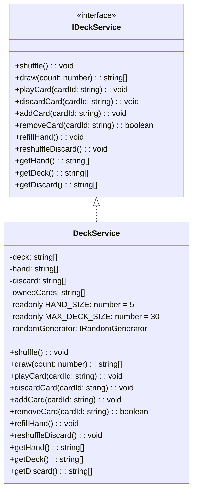
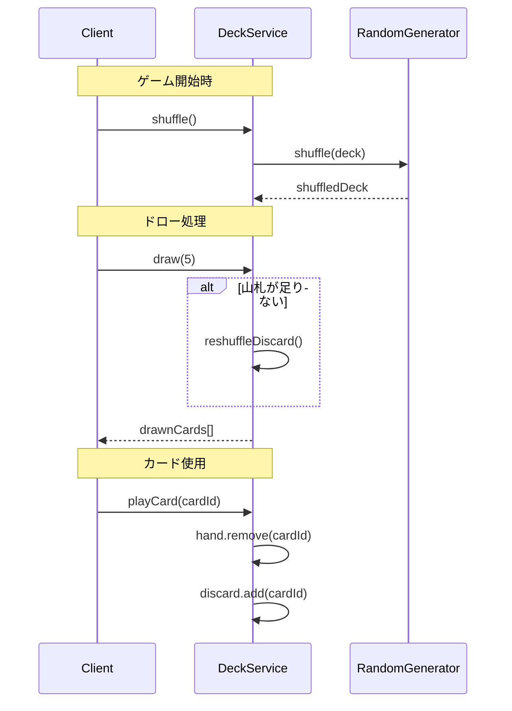
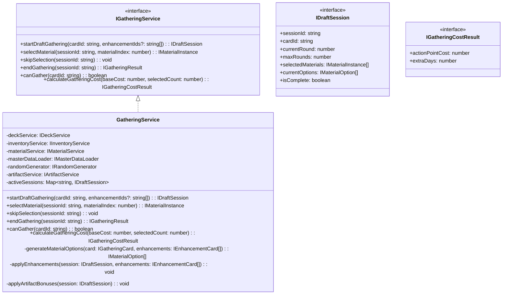
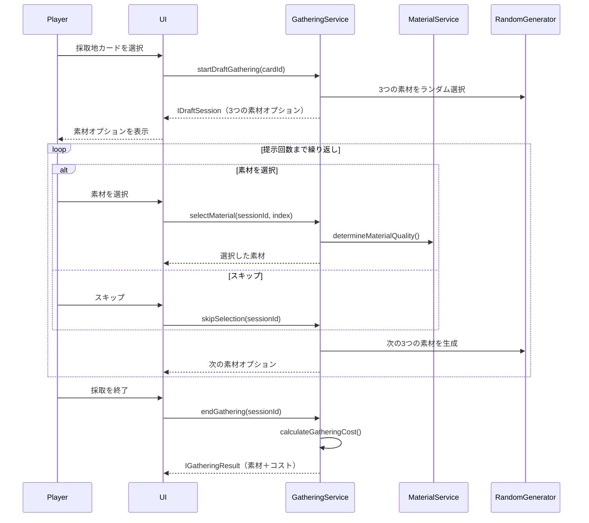
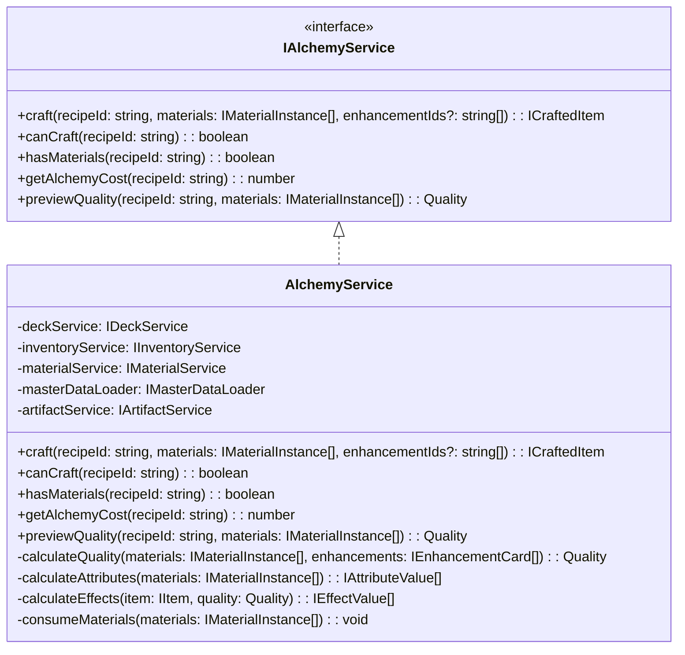
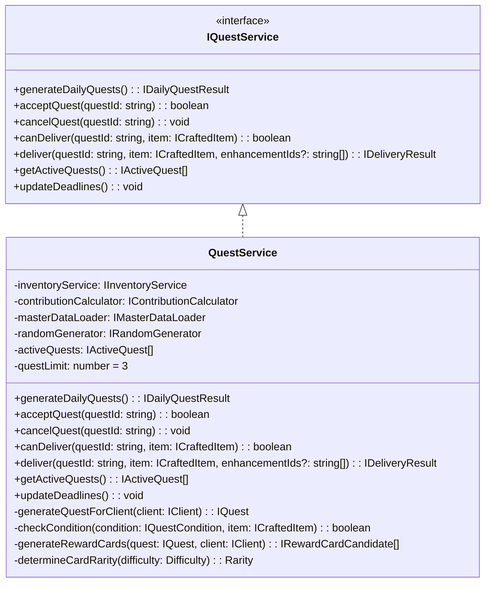

# コアシステム設計書

**バージョン**: 1.5.0
**作成日**: 2026-01-01
**更新日**: 2026-02-24
**対象**: アトリエ錬金術ゲーム（ギルドランク制）Phaser版

# コアシステム設計書 - コアサービス

このドキュメントは [コアシステム設計書](core-systems-overview.md) の一部なのだ。

---

## 7. DeckService 🔵

### 7.1 責務

デッキ（山札・手札・捨て札）の操作を担当する。

### 7.2 クラス図



### 7.3 主要メソッド

| メソッド | 引数 | 戻り値 | 説明 |
|---------|------|--------|------|
| shuffle | - | void | 山札をシャッフルする |
| draw | count: number | string[] | 山札から指定枚数ドローする |
| playCard | cardId: string | void | 手札からカードを使用し捨て札へ |
| discardCard | cardId: string | void | 手札からカードを捨て札へ |
| addCard | cardId: string | void | 新しいカードをデッキに追加 |
| removeCard | cardId: string | boolean | カードをデッキから削除 |
| refillHand | - | void | 手札を5枚まで補充 |
| reshuffleDiscard | - | void | 捨て札を山札に戻してシャッフル |

### 7.4 処理フロー



---

## 8. GatheringService 🔵

### 8.1 責務

採取地カードを使用してドラフト採取を行い、素材を獲得する処理を担当する。

### 8.2 クラス図



### 8.3 主要メソッド

| メソッド | 引数 | 戻り値 | 説明 |
|---------|------|--------|------|
| startDraftGathering | cardId, enhancementIds? | IDraftSession | ドラフト採取セッションを開始 |
| selectMaterial | sessionId, materialIndex | IMaterialInstance | 提示された3つから1つを選択して獲得 |
| skipSelection | sessionId | void | 今回の提示をスキップ（何も選ばない） |
| endGathering | sessionId | IGatheringResult | 採取を終了しコストを計算 |
| canGather | cardId | boolean | 採取可能か判定 |
| calculateGatheringCost | baseCost, selectedCount | IGatheringCostResult | 採取コスト（行動ポイント＋追加日数）を計算 |

### 8.4 ドラフト採取の流れ 🔵



### 8.5 素材提示生成ロジック 🔵

```typescript
generateMaterialOptions(card: IGatheringCard, enhancements: IEnhancementCard[]): IMaterialOption[] {
  const options: IMaterialOption[] = [];
  const materialPool = card.materials;

  // 強化カード「幸運のお守り」の効果
  const rareChanceBonus = this.getEnhancementValue(enhancements, 'RARE_CHANCE_UP');
  const adjustedRareRate = card.rareRate + rareChanceBonus;

  // 3つの素材オプションを生成
  for (let i = 0; i < 3; i++) {
    // レア素材の判定
    const isRare = this.randomGenerator.chance(adjustedRareRate / 100);

    // 素材をランダム選択
    const selectedMaterial = isRare
      ? this.selectRareMaterial(materialPool)
      : this.selectNormalMaterial(materialPool);

    // MaterialServiceを使用して品質を決定
    const quality = this.materialService.determineMaterialQuality(
      selectedMaterial.materialId,
      isRare ? 1 : 0 // レアなら品質ボーナス
    );

    options.push({
      materialId: selectedMaterial.materialId,
      quality: quality,
      quantity: 1
    });
  }

  return options;
}
```

### 8.6 採取コスト計算ロジック 🔵

```typescript
calculateGatheringCost(baseCost: number, selectedCount: number): IGatheringCostResult {
  // 追加コスト計算
  let additionalCost: number;
  let extraDays = 0;

  if (selectedCount === 0) {
    additionalCost = 0; // 偵察のみ
  } else if (selectedCount <= 2) {
    additionalCost = 1; // 軽い採取
  } else if (selectedCount <= 4) {
    additionalCost = 2; // 普通の採取
  } else if (selectedCount <= 6) {
    additionalCost = 3; // 重い採取
  } else {
    additionalCost = 3; // 大量採取
    extraDays = 1; // 翌日持越し
  }

  return {
    actionPointCost: baseCost + additionalCost,
    extraDays: extraDays
  };
}
```

### 8.7 提示回数ボーナスの適用 🔵

```typescript
applyEnhancements(session: IDraftSession, enhancements: IEnhancementCard[]): void {
  // 強化カード「精霊の導き」の効果（提示回数+1）
  const presentationBonus = this.getEnhancementValue(enhancements, 'PRESENTATION_BONUS');
  session.maxRounds += presentationBonus;
}

applyArtifactBonuses(session: IDraftSession): void {
  // アーティファクト「古代の地図」の効果（提示回数+1）
  const artifactBonus = this.artifactService.getPresentationBonus();
  session.maxRounds += artifactBonus;
}
```

---

## 9. AlchemyService 🔵

### 9.1 責務

レシピカードと素材を使用してアイテムを調合する処理を担当する。

### 9.2 クラス図



### 9.3 主要メソッド

| メソッド | 引数 | 戻り値 | 説明 |
|---------|------|--------|------|
| craft | recipeId, materials, enhancementIds? | ICraftedItem | 調合を実行しアイテムを生成 |
| canCraft | recipeId | boolean | 調合可能か判定（手札にレシピがあるか） |
| hasMaterials | recipeId | boolean | 必要素材があるか判定 |
| getAlchemyCost | recipeId | number | 調合コストを取得 |
| previewQuality | recipeId, materials | Quality | 調合結果の品質をプレビュー |

### 9.4 品質計算ロジック 🟡

```typescript
calculateQuality(materials: IMaterialInstance[], enhancements: IEnhancementCard[]): Quality {
  // MaterialServiceを使用して素材の平均品質を計算
  const avgQuality = this.materialService.calculateAverageQuality(materials);

  // 強化カード「賢者の触媒」の効果
  const qualityBonus = this.getEnhancementValue(enhancements, 'QUALITY_UP');

  // アーティファクト効果（錬金術師の眼鏡など）
  const artifactBonus = this.artifactService.getQualityBonus();

  const finalQuality = avgQuality + qualityBonus + artifactBonus;

  // MaterialServiceを使用して数値を品質ランクに変換
  return this.materialService.numberToQuality(finalQuality);
}
```

### 9.5 属性値計算ロジック 🟡

```typescript
calculateAttributes(materials: IMaterialInstance[]): IAttributeValue[] {
  // MaterialServiceに委譲して属性値を計算
  return this.materialService.calculateTotalAttributes(materials);
}
```

---

## 10. QuestService 🔵

### 10.1 責務

依頼の生成、受注、条件判定、報酬計算を担当する。

### 10.2 クラス図



### 10.3 主要メソッド

| メソッド | 引数 | 戻り値 | 説明 |
|---------|------|--------|------|
| generateDailyQuests | - | IDailyQuestResult | 今日の依頼者と依頼を生成 |
| acceptQuest | questId | boolean | 依頼を受注 |
| cancelQuest | questId | void | 依頼を破棄 |
| canDeliver | questId, item | boolean | 納品可能か判定 |
| deliver | questId, item, enhancementIds? | IDeliveryResult | 納品を実行 |
| getActiveQuests | - | IActiveQuest[] | 受注中の依頼を取得 |
| updateDeadlines | - | void | 全依頼の期限を-1 |

### 10.4 依頼条件判定ロジック 🔵

```typescript
checkCondition(condition: IQuestCondition, item: ICraftedItem): boolean {
  switch (condition.type) {
    case 'SPECIFIC':
      return item.itemId === condition.itemId;

    case 'CATEGORY':
      const masterItem = this.masterDataLoader.getItem(item.itemId);
      return masterItem.category === condition.category;

    case 'QUALITY':
      return this.qualityToNumber(item.quality) >= this.qualityToNumber(condition.minQuality);

    case 'QUANTITY':
      // 別途、複数アイテムの合計をチェック
      return true; // 呼び出し元で判定

    case 'ATTRIBUTE':
      const attrValue = item.attributeValues.find(a => a.attribute === condition.attribute);
      return attrValue ? attrValue.value >= condition.minValue : false;

    case 'EFFECT':
      const effectValue = item.effectValues.find(e => e.type === condition.effectType);
      return effectValue ? effectValue.value >= condition.minValue : false;

    case 'MATERIAL':
      // レア素材を指定数以上使用しているか
      const rareMaterialCount = item.usedMaterials.filter(m => m.isRare).length;
      return rareMaterialCount >= condition.minRareMaterials;

    case 'COMPOUND':
      // 複合条件: すべての子条件を満たすか
      return condition.subConditions.every(sub => this.checkCondition(sub, item));

    default:
      return false;
  }
}
```

### 10.5 報酬カード生成ロジック 🔵

```typescript
generateRewardCards(quest: IQuest, client: IClient): IRewardCardCandidate[] {
  const candidates: IRewardCardCandidate[] = [];

  // 1枚目: 依頼者タイプに関連するカード
  candidates.push(this.selectCardByClientType(client.type));

  // 2枚目: 依頼タイプに関連するカード
  candidates.push(this.selectCardByQuestType(quest.condition.type));

  // 3枚目: ランダム枠
  candidates.push(this.selectRandomCard());

  // レアリティ決定
  for (const card of candidates) {
    card.rarity = this.determineCardRarity(quest.difficulty);
  }

  return candidates;
}

determineCardRarity(difficulty: Difficulty): Rarity {
  const roll = this.randomGenerator.random() * 100;
  const table = this.getRarityTable(difficulty);

  if (roll < table.common) return 'COMMON';
  if (roll < table.common + table.uncommon) return 'UNCOMMON';
  return 'RARE';
}
```

---


---

## 関連文書

- [← インフラストラクチャシステム](core-systems-infrastructure.md)
- [→ サポートサービス](core-systems-support-services.md)
- [システム構成概要](core-systems-overview.md)
