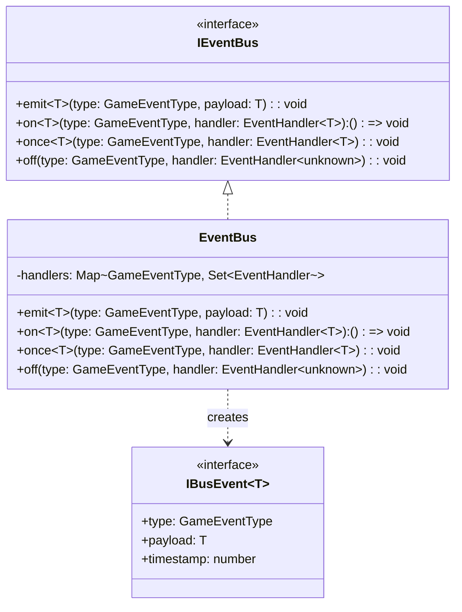
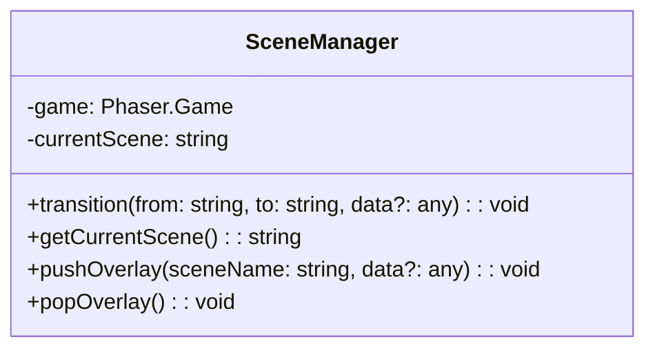
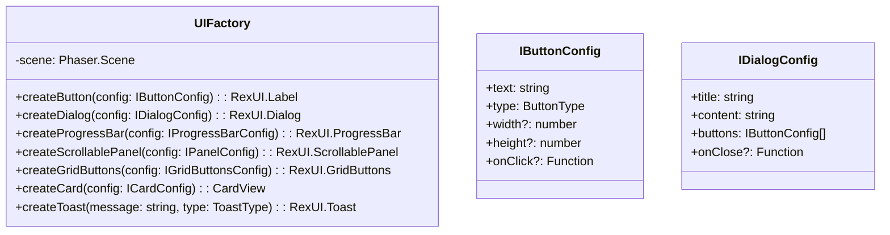
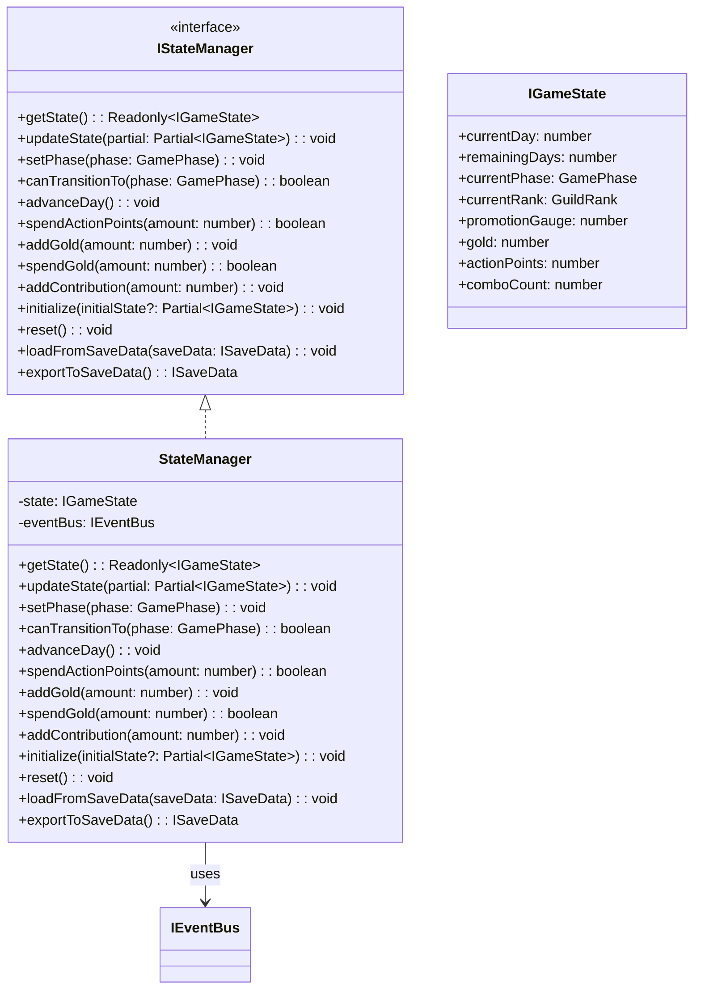

# コアシステム設計書

**バージョン**: 1.5.0
**作成日**: 2026-01-01
**更新日**: 2026-02-24
**対象**: アトリエ錬金術ゲーム（ギルドランク制）Phaser版

# コアシステム設計書 - インフラストラクチャシステム

このドキュメントは [コアシステム設計書](core-systems-overview.md) の一部なのだ。

---

## 2. EventBus（イベントバス） 🔵

### 2.1 責務

購読型（Pub/Sub）パターンでコンポーネント間の疎結合な通信を実現する。
Phaserシーン（Presentation層）とApplication層の連携を担う。

### 2.2 設計方針

- **独自実装**: `Map<GameEventType, Set<EventHandler>>`による軽量な独自Pub/Sub実装（Phaser.Events.EventEmitterは使用しない）
- **DI注入**: コンストラクタインジェクションで各サービスに注入（グローバルシングルトン参照ではない）
- **型安全**: `GameEventType`（const object）による列挙型イベント名と、`IBusEvent<T>`によるジェネリックなペイロード型
- **購読解除関数**: `on()`は購読解除関数を返し、リソースリークを防止

### 2.3 クラス図



### 2.4 DI登録

EventBusはDIコンテナ（`Container`）経由で管理される。`initializeServices()`で最初に初期化され、依存する各サービスにコンストラクタ引数として注入される。

```typescript
// setup.ts での初期化・登録
const eventBus = new EventBus();
container.register(ServiceKeys.EventBus, eventBus);

// 依存サービスへのコンストラクタ注入
const stateManager = new StateManager(eventBus);
const deckService = new DeckService(masterDataRepo, eventBus);
const questService = new QuestService(masterDataRepo, eventBus);

// 利用側での解決
const resolvedEventBus = container.resolve<IEventBus>(ServiceKeys.EventBus);
```

### 2.5 イベント定義 🔵

イベント名は`GameEventType`（const object）で定義される。

| イベント名 | 発火元 | ペイロード型 | 説明 |
|-----------|-------|-------------|------|
| **フェーズ遷移** ||||
| `PHASE_CHANGED` | StateManager | `IPhaseChangedEvent` (`{ previousPhase, newPhase }`) | フェーズ変更 |
| `DAY_STARTED` | StateManager | `{ day, remainingDays }` | 日開始 |
| `DAY_ENDED` | GameFlowManager | `{ day }` | 日終了 |
| **依頼関連** ||||
| `QUEST_GENERATED` | QuestService | `{ quests: IQuest[] }` | 日毎依頼生成 |
| `QUEST_ACCEPTED` | QuestService | `{ quest }` | 依頼受注 |
| `QUEST_CANCELLED` | QuestService | `{ questId }` | 依頼キャンセル |
| `QUEST_COMPLETED` | QuestService | `IQuestCompletedEvent` (`{ quest, deliveredItem }`) | 依頼完了 |
| `QUEST_FAILED` | QuestService | `{ quest }` | 依頼失敗 |
| **採取関連** ||||
| `GATHERING_STARTED` | GatheringService | `{ session }` | 採取開始 |
| `MATERIAL_SELECTED` | GatheringService | `{ material }` | 素材選択 |
| `GATHERING_ENDED` | GatheringService | `{ result }` | 採取終了 |
| `GATHERING_COMPLETED` | GatheringService | `IGatheringCompletedEvent` (`{ obtainedMaterials }`) | 採取完了 |
| **調合関連** ||||
| `ALCHEMY_COMPLETED` | AlchemyService | `IAlchemyCompletedEvent` (`{ craftedItem }`) | 調合完了 |
| **デッキ関連** ||||
| `CARD_DRAWN` | DeckService | `{ cards }` | ドロー |
| `CARD_PLAYED` | DeckService | `{ cardId }` | カード使用 |
| `CARD_DISCARDED` | DeckService | `{ cardId }` | カード破棄 |
| `HAND_REFILLED` | DeckService | `{ hand }` | 手札補充 |
| **ランク関連** ||||
| `RANK_DAMAGED` | RankService | `IRankDamagedEvent` (`{ damage, remainingHp, currentRank }`) | ランクダメージ |
| `RANK_UP` | RankService | `IRankUpEvent` (`{ previousRank, newRank }`) | ランクアップ |
| `CONTRIBUTION_ADDED` | RankService | `IContributionAddedEvent` (`{ amount, newPromotionGauge }`) | 貢献度追加 |
| **ゲーム終了** ||||
| `GAME_OVER` | GameFlowManager | `IGameOverEvent` (`{ reason, finalRank }`) | ゲームオーバー |
| `GAME_CLEARED` | GameFlowManager | `IGameClearedEvent` (`{ totalDays, finalScore }`) | ゲームクリア |
| **セーブ/ロード** ||||
| `GAME_SAVED` | StateManager | `IGameSavedEvent` | セーブ完了 |
| `GAME_LOADED` | StateManager | `IGameLoadedEvent` | ロード完了 |

### 2.6 使用例

```typescript
// イベント発行（Application層）
eventBus.emit(GameEventType.PHASE_CHANGED, {
  previousPhase: GamePhase.GATHERING,
  newPhase: GamePhase.ALCHEMY,
});

// イベント購読（購読解除関数を受け取る）
const unsubscribe = eventBus.on(GameEventType.PHASE_CHANGED, (event) => {
  console.log('Phase changed:', event.payload.newPhase);
});

// 1回だけ購読
eventBus.once(GameEventType.DAY_STARTED, (event) => {
  console.log('Day started:', event.payload.day);
});

// 購読解除（コンポーネント破棄時に必ず呼ぶ）
unsubscribe();
```

---

## 3. SceneManager（シーン管理） 🟡

### 3.1 責務

Phaserシーン間の遷移とデータ受け渡しを管理する。

### 3.2 クラス図



### 3.3 シーン遷移パターン 🔵

```typescript
// フェード遷移
transition(from: string, to: string, data?: any): void {
    const fromScene = this.game.scene.getScene(from);
    const toScene = this.game.scene.getScene(to);

    // フェードアウト
    fromScene.cameras.main.fadeOut(300, 0, 0, 0);
    fromScene.cameras.main.once('camerafadeoutcomplete', () => {
        // シーン切り替え
        this.game.scene.stop(from);
        this.game.scene.start(to, data);
        this.currentScene = to;

        // フェードイン
        const newScene = this.game.scene.getScene(to);
        newScene.cameras.main.fadeIn(300, 0, 0, 0);
    });
}

// オーバーレイ（ショップなど）
pushOverlay(sceneName: string, data?: any): void {
    this.game.scene.launch(sceneName, data);
    this.game.scene.bringToTop(sceneName);
}

popOverlay(): void {
    // 現在のオーバーレイを閉じる
    const overlayScene = this.game.scene.getScene(this.currentOverlay);
    overlayScene?.scene.stop();
}
```

---

## 4. UIFactory（UI生成ファクトリ） 🟡

### 4.1 責務

rexUIを使用した共通UIコンポーネントの生成を一元化する。

### 4.2 クラス図



### 4.3 ボタン生成 🟡

```typescript
createButton(config: IButtonConfig): RexUI.Label {
    const { text, type, width = 120, height = 40, onClick } = config;

    // ボタンタイプに応じた色設定
    const colors = this.getButtonColors(type);

    const button = this.scene.rexUI.add.label({
        width,
        height,
        background: this.scene.rexUI.add.roundRectangle(
            0, 0, 0, 0, 4, colors.background
        ).setStrokeStyle(2, colors.stroke),
        text: this.scene.add.text(0, 0, text, {
            fontFamily: 'NotoSansJP',
            fontSize: '16px',
            color: colors.text
        }),
        space: { left: 16, right: 16, top: 8, bottom: 8 },
        align: 'center'
    });

    // インタラクティブ設定
    button.setInteractive({ useHandCursor: true });

    // ホバーエフェクト
    button.on('pointerover', () => {
        button.getElement('background').setFillStyle(colors.hover);
    });
    button.on('pointerout', () => {
        button.getElement('background').setFillStyle(colors.background);
    });

    // クリックハンドラ
    if (onClick) {
        button.on('pointerdown', onClick);
    }

    return button;
}

private getButtonColors(type: ButtonType): IButtonColors {
    switch (type) {
        case 'primary':
            return { background: 0x8B4513, hover: 0xA0522D, stroke: 0x5D3A1A, text: '#ffffff' };
        case 'secondary':
            return { background: 0xF5F5DC, hover: 0xE0E0C0, stroke: 0x666666, text: '#333333' };
        case 'danger':
            return { background: 0xB22222, hover: 0xCD2626, stroke: 0x8B0000, text: '#ffffff' };
        case 'disabled':
            return { background: 0x808080, hover: 0x808080, stroke: 0x666666, text: '#999999' };
    }
}
```

### 4.4 ダイアログ生成 🟡

```typescript
createDialog(config: IDialogConfig): RexUI.Dialog {
    const { title, content, buttons, onClose } = config;

    const dialog = this.scene.rexUI.add.dialog({
        x: 640,
        y: 360,
        background: this.scene.rexUI.add.roundRectangle(0, 0, 0, 0, 12, 0xF5F5DC)
            .setStrokeStyle(2, 0x8B4513),
        title: this.createDialogTitle(title),
        content: this.createDialogContent(content),
        actions: buttons.map(btn => this.createButton(btn)),
        space: {
            title: 24,
            content: 24,
            action: 16,
            left: 24,
            right: 24,
            top: 24,
            bottom: 24
        },
        expand: { content: false }
    })
    .layout()
    .setDepth(400);

    // ポップアップアニメーション
    dialog.popUp(300);

    // 背景オーバーレイ
    const overlay = this.scene.add.rectangle(640, 360, 1280, 720, 0x000000, 0.5)
        .setDepth(399)
        .setInteractive();

    // 閉じる処理
    dialog.on('button.click', (button: any, groupName: string, index: number) => {
        overlay.destroy();
        dialog.scaleDownDestroy(200);
        if (onClose) {
            onClose(index);
        }
    });

    return dialog;
}
```

### 4.5 カード生成 🟡

```typescript
createCard(config: ICardConfig): CardView {
    const { cardId, cardType, isInteractive = true } = config;

    const cardView = new CardView(this.scene, 0, 0, cardId, cardType);

    if (isInteractive) {
        cardView.setInteractive({ useHandCursor: true });

        // ホバーエフェクト
        cardView.on('pointerover', () => {
            this.scene.tweens.add({
                targets: cardView,
                scaleX: 1.1,
                scaleY: 1.1,
                duration: 100,
                ease: 'Back.easeOut'
            });
        });

        cardView.on('pointerout', () => {
            this.scene.tweens.add({
                targets: cardView,
                scaleX: 1,
                scaleY: 1,
                duration: 100,
                ease: 'Power2'
            });
        });
    }

    return cardView;
}
```

---

## 5. PhaseContainerシステム 🟡

### 5.1 責務

メインシーン内でフェーズに応じたUIコンテナを切り替える。

### 5.2 クラス図


### 5.3 フェーズコンテナ切り替え 🔵

```typescript
// MainScene内でのフェーズコンテナ管理
class MainScene extends Phaser.Scene {
    private readonly eventBus: IEventBus;
    private phaseContainers: Map<GamePhase, IPhaseContainer> = new Map();
    private currentContainer: IPhaseContainer | null = null;
    private unsubscribePhase?: () => void;

    create(): void {
        // DIコンテナからEventBusを取得
        const container = Container.getInstance();
        this.eventBus = container.resolve<IEventBus>(ServiceKeys.EventBus);

        // フェーズコンテナの初期化
        this.phaseContainers.set(GamePhase.QUEST_ACCEPT, new QuestAcceptContainer(this));
        this.phaseContainers.set(GamePhase.GATHERING, new GatheringContainer(this));
        this.phaseContainers.set(GamePhase.ALCHEMY, new AlchemyContainer(this));
        this.phaseContainers.set(GamePhase.DELIVERY, new DeliveryContainer(this));

        // イベント購読（購読解除関数を保持）
        this.unsubscribePhase = this.eventBus.on(GameEventType.PHASE_CHANGED, (event) => {
            this.onPhaseChange(event.payload.newPhase);
        });
    }

    private onPhaseChange(newPhase: GamePhase): void {
        // 現在のコンテナを非表示
        if (this.currentContainer) {
            this.currentContainer.hide();
        }

        // 新しいコンテナを表示
        this.currentContainer = this.phaseContainers.get(newPhase) || null;
        if (this.currentContainer) {
            this.currentContainer.show();
        }
    }

    shutdown(): void {
        // 購読解除
        this.unsubscribePhase?.();
        this.phaseContainers.forEach(container => container.destroy());
    }
}
```

---

## 6. StateManager（状態管理） 🟡

### 6.1 責務

ゲーム状態を一元管理し、状態変更をEventBus経由で通知する。

### 6.2 クラス図



### 6.3 状態変更と通知 🔵

```typescript
class StateManager {
    private state: IGameState;
    private readonly eventBus: IEventBus;

    constructor(eventBus: IEventBus) {
        this.eventBus = eventBus;
    }

    setState(partial: Partial<IGameState>): void {
        const previousState = { ...this.state };
        for (const [key, value] of Object.entries(partial)) {
            const oldValue = this.state[key as keyof IGameState];
            if (oldValue !== value) {
                (this.state as any)[key] = value;
            }
        }
        this.notifyChanges(previousState);
    }

    private notifyChanges(previousState: IGameState): void {
        // フェーズ変更の通知
        if (previousState.currentPhase !== this.state.currentPhase) {
            this.eventBus.emit(GameEventType.PHASE_CHANGED, {
                previousPhase: previousState.currentPhase,
                newPhase: this.state.currentPhase,
            });
        }
    }
}
```

---


---

## 関連文書

- [← システム構成概要](core-systems-overview.md)
- [→ コアサービス](core-systems-core-services.md)
- [サポートサービス](core-systems-support-services.md)
