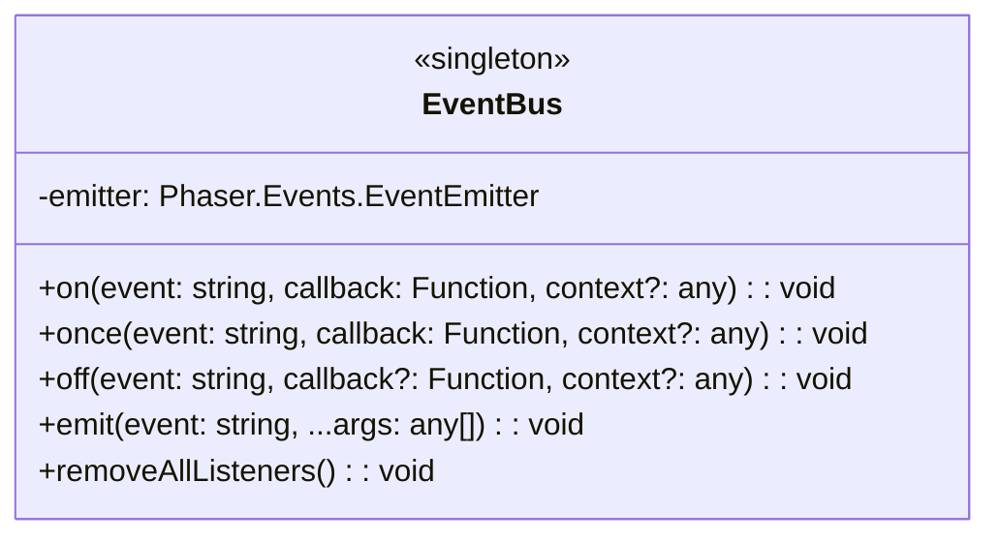
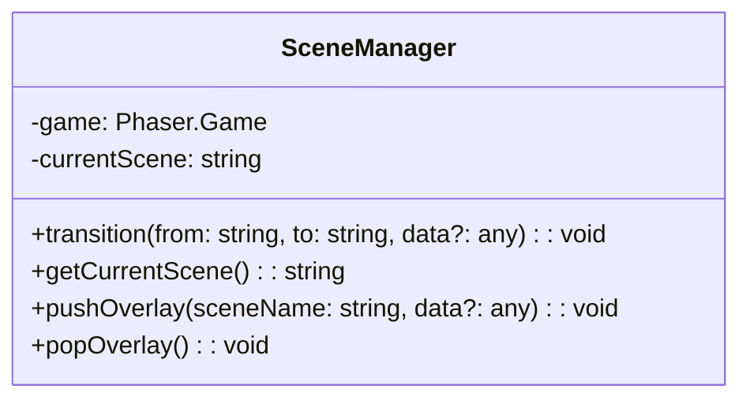
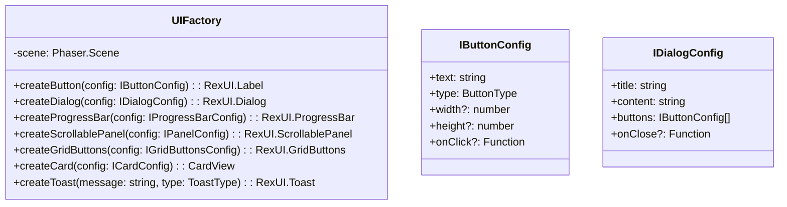
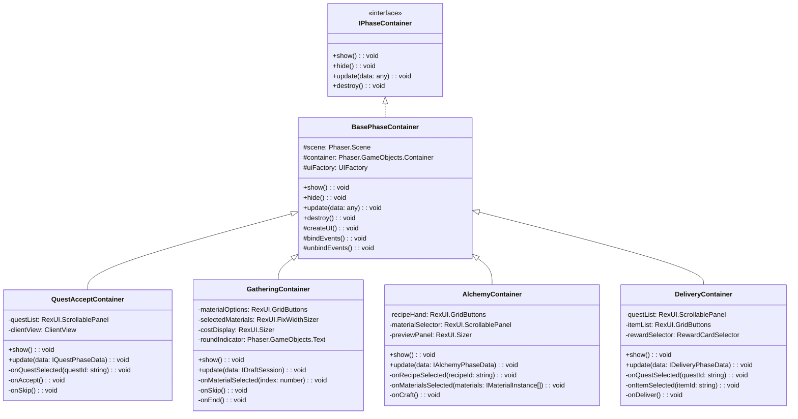
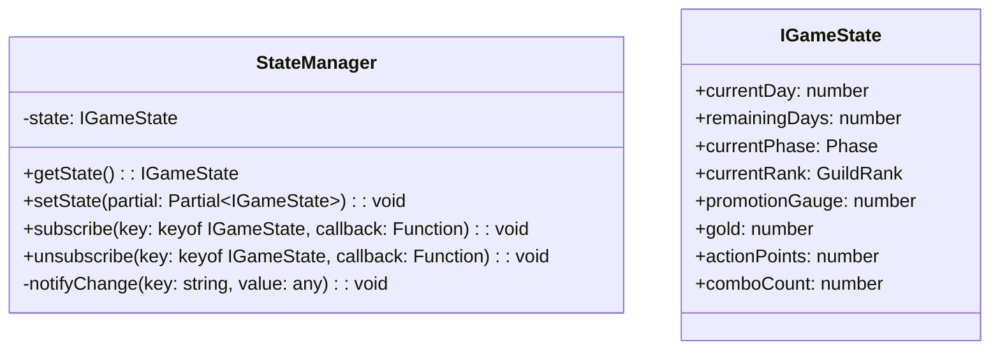

# コアシステム設計書

**バージョン**: 1.4.0
**作成日**: 2026-01-01
**更新日**: 2026-01-14
**対象**: アトリエ錬金術ゲーム（ギルドランク制）HTML版・Phaser版

# コアシステム設計書 - インフラストラクチャシステム

このドキュメントは [コアシステム設計書](core-systems-overview.md) の一部なのだ。

---

## 2. EventBus（イベントバス） 🟡

### 2.1 責務

Phaserシーン（Presentation層）とApplication層の疎結合な連携を実現する。

### 2.2 クラス図



### 2.3 イベント定義 🔵

| イベント名 | 発火元 | データ | 説明 |
|-----------|-------|--------|------|
| **ゲームフロー** ||||
| `game:start` | TitleScene | { isNewGame: boolean } | ゲーム開始 |
| `game:save` | MainScene | - | セーブ要求 |
| `game:load` | TitleScene | - | ロード要求 |
| `game:over` | RankService | { reason: string } | ゲームオーバー |
| `game:clear` | RankService | { stats: IGameStats } | ゲームクリア |
| **フェーズ遷移** ||||
| `phase:change` | PhaseManager | { phase: Phase } | フェーズ変更 |
| `phase:complete` | PhaseManager | { phase: Phase } | フェーズ完了 |
| `day:start` | PhaseManager | { day: number } | 日開始 |
| `day:end` | PhaseManager | { day: number } | 日終了 |
| **依頼関連** ||||
| `quest:generated` | QuestService | { quests: IQuest[] } | 日毎依頼生成 |
| `quest:accepted` | QuestService | { questId: string } | 依頼受注 |
| `quest:delivered` | QuestService | { result: IDeliveryResult } | 納品完了 |
| `quest:expired` | QuestService | { questId: string } | 期限切れ |
| **採取関連** ||||
| `gathering:start` | GatheringService | { session: IDraftSession } | 採取開始 |
| `gathering:options` | GatheringService | { options: IMaterialOption[] } | 素材提示 |
| `gathering:selected` | GatheringService | { material: IMaterialInstance } | 素材選択 |
| `gathering:end` | GatheringService | { result: IGatheringResult } | 採取終了 |
| **調合関連** ||||
| `alchemy:start` | AlchemyService | { recipeId: string } | 調合開始 |
| `alchemy:complete` | AlchemyService | { item: ICraftedItem } | 調合完了 |
| **デッキ関連** ||||
| `deck:draw` | DeckService | { cards: string[] } | ドロー |
| `deck:play` | DeckService | { cardId: string } | カード使用 |
| `deck:add` | DeckService | { cardId: string } | カード追加 |
| `deck:shuffle` | DeckService | - | シャッフル |
| **ランク関連** ||||
| `rank:contribution` | RankService | { amount: number, total: number } | 貢献度追加 |
| `rank:promotionReady` | RankService | - | 昇格準備完了 |
| `rank:up` | RankService | { newRank: GuildRank } | ランクアップ |
| **UI関連** ||||
| `ui:dialog:open` | Scene | { type: string, data: any } | ダイアログ開く |
| `ui:dialog:close` | Scene | { type: string } | ダイアログ閉じる |
| `ui:toast:show` | Scene | { message: string, type: string } | トースト表示 |
| `ui:inventory:update` | InventoryService | { materials: [], items: [] } | インベントリ更新 |

### 2.4 使用例

```typescript
// イベント発火（Application層）
EventBus.emit('phase:change', { phase: 'GATHERING' });

// イベント購読（Presentation層）
EventBus.on('phase:change', (data: { phase: Phase }) => {
    this.switchPhaseContainer(data.phase);
}, this);

// イベント購読解除（シーン終了時）
EventBus.off('phase:change', this.onPhaseChange, this);
```

---

## 3. SceneManager（シーン管理） 🟡

### 3.1 責務

Phaserシーン間の遷移とデータ受け渡しを管理する。

### 3.2 クラス図



### 3.3 シーン遷移パターン 🔵

```typescript
// フェード遷移
transition(from: string, to: string, data?: any): void {
    const fromScene = this.game.scene.getScene(from);
    const toScene = this.game.scene.getScene(to);

    // フェードアウト
    fromScene.cameras.main.fadeOut(300, 0, 0, 0);
    fromScene.cameras.main.once('camerafadeoutcomplete', () => {
        // シーン切り替え
        this.game.scene.stop(from);
        this.game.scene.start(to, data);
        this.currentScene = to;

        // フェードイン
        const newScene = this.game.scene.getScene(to);
        newScene.cameras.main.fadeIn(300, 0, 0, 0);
    });
}

// オーバーレイ（ショップなど）
pushOverlay(sceneName: string, data?: any): void {
    this.game.scene.launch(sceneName, data);
    this.game.scene.bringToTop(sceneName);
}

popOverlay(): void {
    // 現在のオーバーレイを閉じる
    const overlayScene = this.game.scene.getScene(this.currentOverlay);
    overlayScene?.scene.stop();
}
```

---

## 4. UIFactory（UI生成ファクトリ） 🟡

### 4.1 責務

rexUIを使用した共通UIコンポーネントの生成を一元化する。

### 4.2 クラス図



### 4.3 ボタン生成 🟡

```typescript
createButton(config: IButtonConfig): RexUI.Label {
    const { text, type, width = 120, height = 40, onClick } = config;

    // ボタンタイプに応じた色設定
    const colors = this.getButtonColors(type);

    const button = this.scene.rexUI.add.label({
        width,
        height,
        background: this.scene.rexUI.add.roundRectangle(
            0, 0, 0, 0, 4, colors.background
        ).setStrokeStyle(2, colors.stroke),
        text: this.scene.add.text(0, 0, text, {
            fontFamily: 'NotoSansJP',
            fontSize: '16px',
            color: colors.text
        }),
        space: { left: 16, right: 16, top: 8, bottom: 8 },
        align: 'center'
    });

    // インタラクティブ設定
    button.setInteractive({ useHandCursor: true });

    // ホバーエフェクト
    button.on('pointerover', () => {
        button.getElement('background').setFillStyle(colors.hover);
    });
    button.on('pointerout', () => {
        button.getElement('background').setFillStyle(colors.background);
    });

    // クリックハンドラ
    if (onClick) {
        button.on('pointerdown', onClick);
    }

    return button;
}

private getButtonColors(type: ButtonType): IButtonColors {
    switch (type) {
        case 'primary':
            return { background: 0x8B4513, hover: 0xA0522D, stroke: 0x5D3A1A, text: '#ffffff' };
        case 'secondary':
            return { background: 0xF5F5DC, hover: 0xE0E0C0, stroke: 0x666666, text: '#333333' };
        case 'danger':
            return { background: 0xB22222, hover: 0xCD2626, stroke: 0x8B0000, text: '#ffffff' };
        case 'disabled':
            return { background: 0x808080, hover: 0x808080, stroke: 0x666666, text: '#999999' };
    }
}
```

### 4.4 ダイアログ生成 🟡

```typescript
createDialog(config: IDialogConfig): RexUI.Dialog {
    const { title, content, buttons, onClose } = config;

    const dialog = this.scene.rexUI.add.dialog({
        x: 640,
        y: 360,
        background: this.scene.rexUI.add.roundRectangle(0, 0, 0, 0, 12, 0xF5F5DC)
            .setStrokeStyle(2, 0x8B4513),
        title: this.createDialogTitle(title),
        content: this.createDialogContent(content),
        actions: buttons.map(btn => this.createButton(btn)),
        space: {
            title: 24,
            content: 24,
            action: 16,
            left: 24,
            right: 24,
            top: 24,
            bottom: 24
        },
        expand: { content: false }
    })
    .layout()
    .setDepth(400);

    // ポップアップアニメーション
    dialog.popUp(300);

    // 背景オーバーレイ
    const overlay = this.scene.add.rectangle(640, 360, 1280, 720, 0x000000, 0.5)
        .setDepth(399)
        .setInteractive();

    // 閉じる処理
    dialog.on('button.click', (button: any, groupName: string, index: number) => {
        overlay.destroy();
        dialog.scaleDownDestroy(200);
        if (onClose) {
            onClose(index);
        }
    });

    return dialog;
}
```

### 4.5 カード生成 🟡

```typescript
createCard(config: ICardConfig): CardView {
    const { cardId, cardType, isInteractive = true } = config;

    const cardView = new CardView(this.scene, 0, 0, cardId, cardType);

    if (isInteractive) {
        cardView.setInteractive({ useHandCursor: true });

        // ホバーエフェクト
        cardView.on('pointerover', () => {
            this.scene.tweens.add({
                targets: cardView,
                scaleX: 1.1,
                scaleY: 1.1,
                duration: 100,
                ease: 'Back.easeOut'
            });
        });

        cardView.on('pointerout', () => {
            this.scene.tweens.add({
                targets: cardView,
                scaleX: 1,
                scaleY: 1,
                duration: 100,
                ease: 'Power2'
            });
        });
    }

    return cardView;
}
```

---

## 5. PhaseContainerシステム 🟡

### 5.1 責務

メインシーン内でフェーズに応じたUIコンテナを切り替える。

### 5.2 クラス図



### 5.3 フェーズコンテナ切り替え 🔵

```typescript
// MainScene内でのフェーズコンテナ管理
class MainScene extends Phaser.Scene {
    private phaseContainers: Map<Phase, IPhaseContainer> = new Map();
    private currentContainer: IPhaseContainer | null = null;

    create(): void {
        // フェーズコンテナの初期化
        this.phaseContainers.set('QUEST_ACCEPT', new QuestAcceptContainer(this));
        this.phaseContainers.set('GATHERING', new GatheringContainer(this));
        this.phaseContainers.set('ALCHEMY', new AlchemyContainer(this));
        this.phaseContainers.set('DELIVERY', new DeliveryContainer(this));

        // イベント購読
        EventBus.on('phase:change', this.onPhaseChange, this);
    }

    private onPhaseChange(data: { phase: Phase }): void {
        // 現在のコンテナを非表示
        if (this.currentContainer) {
            this.currentContainer.hide();
        }

        // 新しいコンテナを表示
        this.currentContainer = this.phaseContainers.get(data.phase) || null;
        if (this.currentContainer) {
            this.currentContainer.show();
        }
    }

    shutdown(): void {
        EventBus.off('phase:change', this.onPhaseChange, this);
        this.phaseContainers.forEach(container => container.destroy());
    }
}
```

---

## 6. StateManager（状態管理） 🟡

### 6.1 責務

ゲーム状態を一元管理し、状態変更をEventBus経由で通知する。

### 6.2 クラス図



### 6.3 状態変更と通知 🔵

```typescript
class StateManager {
    private state: IGameState;
    private subscribers: Map<string, Set<Function>> = new Map();

    setState(partial: Partial<IGameState>): void {
        for (const [key, value] of Object.entries(partial)) {
            const oldValue = this.state[key as keyof IGameState];
            if (oldValue !== value) {
                (this.state as any)[key] = value;
                this.notifyChange(key, value);
            }
        }
    }

    private notifyChange(key: string, value: any): void {
        // ローカル購読者への通知
        const subs = this.subscribers.get(key);
        if (subs) {
            subs.forEach(callback => callback(value));
        }

        // EventBus経由でUI層へ通知
        EventBus.emit(`state:${key}`, { [key]: value });
    }

    subscribe(key: keyof IGameState, callback: Function): void {
        if (!this.subscribers.has(key)) {
            this.subscribers.set(key, new Set());
        }
        this.subscribers.get(key)!.add(callback);
    }
}
```

---


---

## 関連文書

- [← システム構成概要](core-systems-overview.md)
- [→ コアサービス](core-systems-core-services.md)
- [サポートサービス](core-systems-support-services.md)
