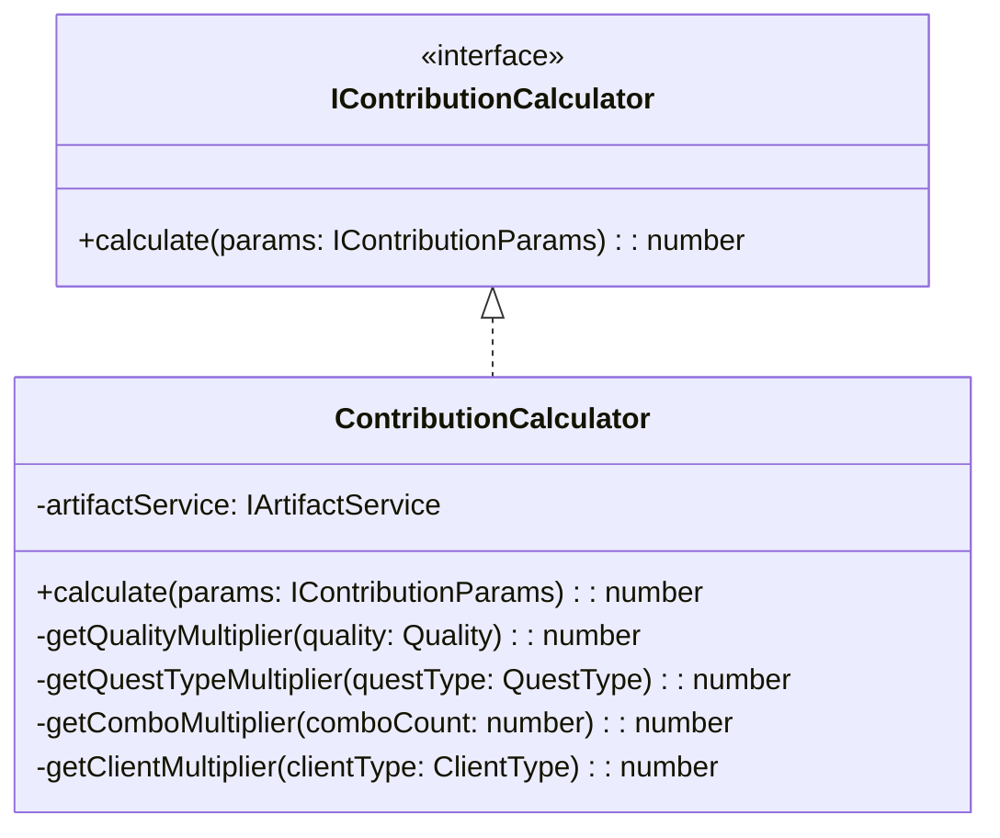
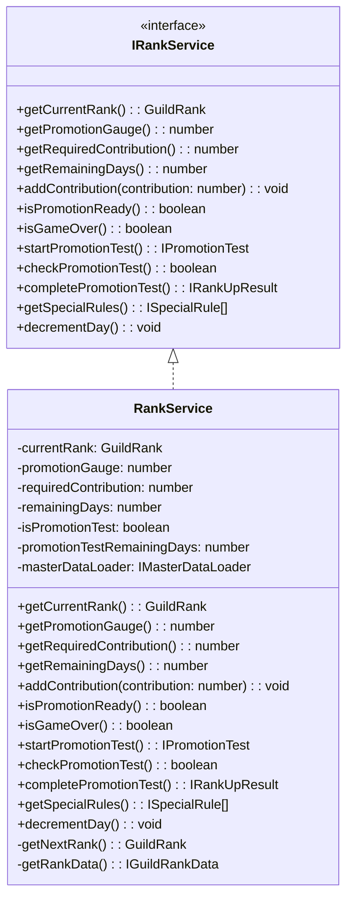
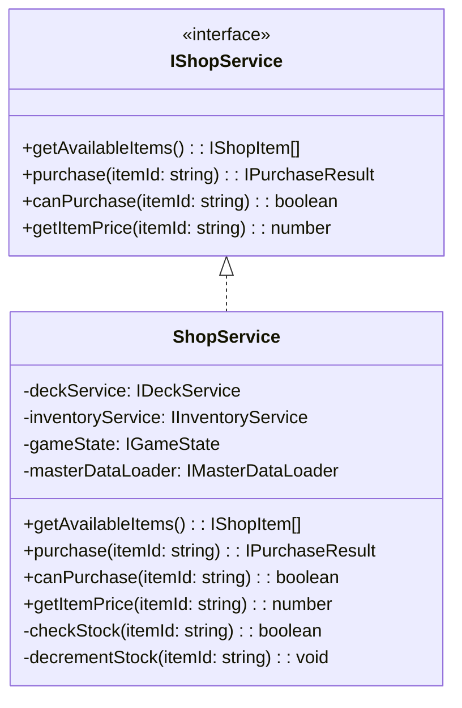
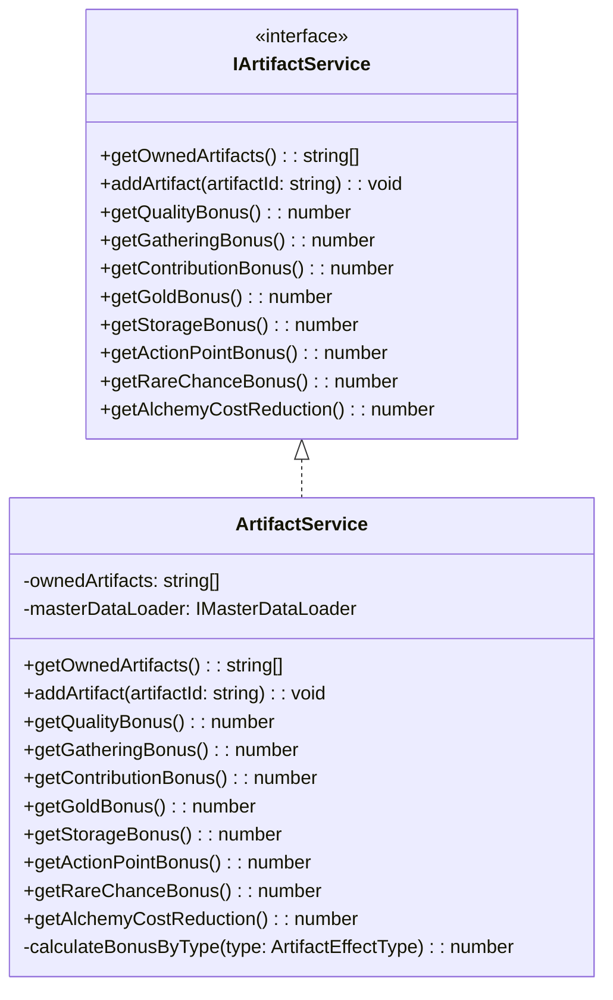
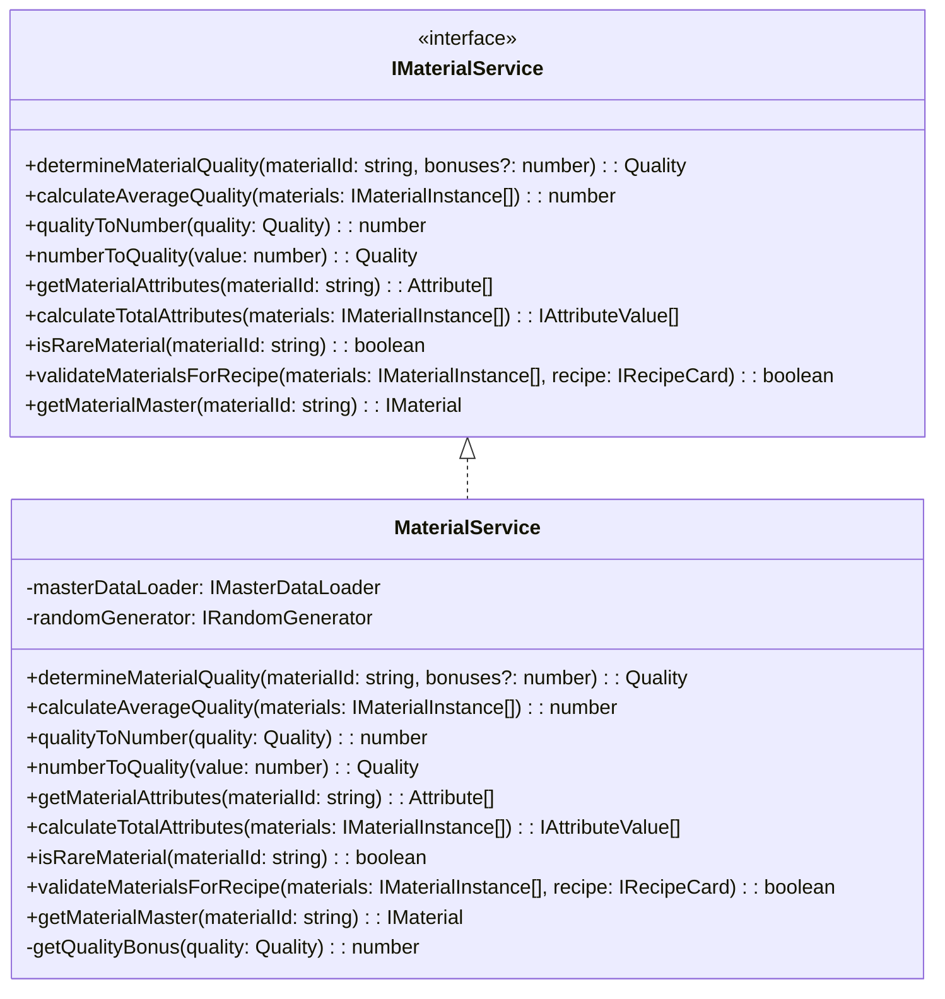
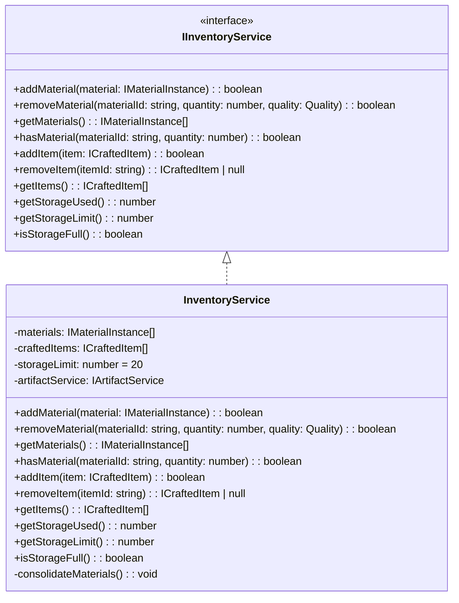
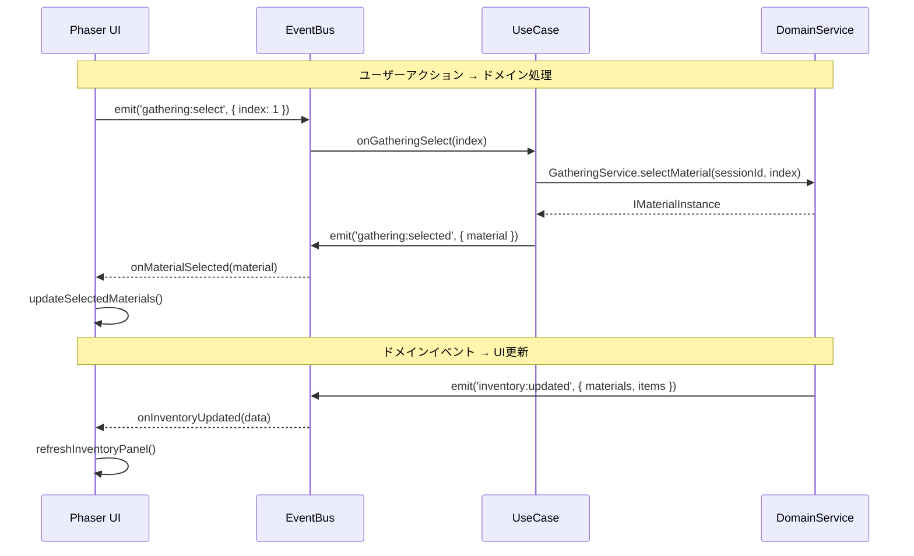
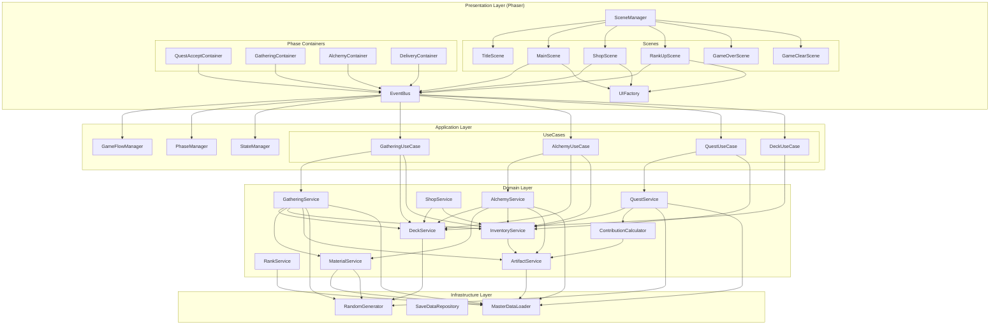

# コアシステム設計書

**バージョン**: 1.4.0
**作成日**: 2026-01-01
**更新日**: 2026-01-14
**対象**: アトリエ錬金術ゲーム（ギルドランク制）HTML版・Phaser版

# コアシステム設計書 - サポートサービス

このドキュメントは [コアシステム設計書](core-systems-overview.md) の一部なのだ。

---

## 11. ContributionCalculator 🔵

### 11.1 責務

納品時の貢献度を計算する。

### 11.2 クラス図



### 11.3 計算ロジック 🔵

```typescript
calculate(params: IContributionParams): number {
  const {
    baseContribution,
    quality,
    questType,
    clientType,
    comboCount,
    enhancementCards
  } = params;

  // 基本計算
  let contribution = baseContribution;

  // 品質補正
  contribution *= this.getQualityMultiplier(quality);

  // 依頼タイプ補正
  contribution *= this.getQuestTypeMultiplier(questType);

  // 依頼者補正
  contribution *= this.getClientMultiplier(clientType);

  // コンボ補正
  contribution *= this.getComboMultiplier(comboCount);

  // 強化カード補正（ギルド推薦状など）
  const enhancementBonus = this.getEnhancementContributionBonus(enhancementCards);
  contribution *= (1 + enhancementBonus / 100);

  // アーティファクト補正（ギルドマスターの印など）
  const artifactBonus = this.artifactService.getContributionBonus();
  contribution *= (1 + artifactBonus / 100);

  return Math.floor(contribution);
}

private getQualityMultiplier(quality: Quality): number {
  const table: Record<Quality, number> = {
    'D': 0.5,
    'C': 1.0,
    'B': 1.5,
    'A': 2.0,
    'S': 3.0
  };
  return table[quality];
}

private getQuestTypeMultiplier(questType: QuestType): number {
  const table: Record<QuestType, number> = {
    'SPECIFIC': 1.0,
    'CATEGORY': 0.8,
    'QUALITY': 1.2,
    'QUANTITY': 0.7,
    'ATTRIBUTE': 1.3,
    'EFFECT': 1.3,
    'MATERIAL': 1.5,
    'COMPOUND': 1.8
  };
  return table[questType];
}

private getComboMultiplier(comboCount: number): number {
  if (comboCount >= 10) return 2.0;
  if (comboCount >= 5) return 1.5;
  if (comboCount >= 3) return 1.2;
  if (comboCount >= 2) return 1.1;
  return 1.0;
}

private getClientMultiplier(clientType: ClientType): number {
  const table: Record<ClientType, number> = {
    'VILLAGER': 0.8,
    'ADVENTURER': 1.0,
    'MERCHANT': 1.2,
    'NOBLE': 1.5,
    'GUILD': 1.3
  };
  return table[clientType];
}
```

---

## 12. RankService 🔵

### 12.1 責務

ギルドランクの管理、昇格試験の処理を担当する。

### 12.2 クラス図



### 12.3 主要メソッド

| メソッド | 引数 | 戻り値 | 説明 |
|---------|------|--------|------|
| getCurrentRank | - | GuildRank | 現在のランクを取得 |
| getPromotionGauge | - | number | 現在の昇格ゲージを取得 |
| getRequiredContribution | - | number | 昇格に必要な貢献度を取得 |
| addContribution | contribution | void | 昇格ゲージに貢献度を加算する |
| isPromotionReady | - | boolean | 昇格ゲージが満タンか判定 |
| isGameOver | - | boolean | 日数切れか判定 |
| startPromotionTest | - | IPromotionTest | 昇格試験を開始 |
| checkPromotionTest | - | boolean | 昇格試験をクリアしたか判定 |
| completePromotionTest | - | IRankUpResult | ランクアップ処理を実行 |
| getSpecialRules | - | ISpecialRule[] | 現在ランクの特殊ルールを取得 |
| decrementDay | - | void | 残り日数を減らす |

---

## 13. ShopService 🔵

### 13.1 責務

ショップでの購入処理を担当する。

### 13.2 クラス図



### 13.3 主要メソッド

| メソッド | 引数 | 戻り値 | 説明 |
|---------|------|--------|------|
| getAvailableItems | - | IShopItem[] | 購入可能なアイテム一覧を取得 |
| purchase | itemId | IPurchaseResult | 購入を実行 |
| canPurchase | itemId | boolean | 購入可能か判定（ゴールド・在庫） |
| getItemPrice | itemId | number | 価格を取得 |

---

## 14. ArtifactService 🔵

### 14.1 責務

アーティファクトの管理とボーナス計算を担当する。

### 14.2 クラス図



### 14.3 ボーナス計算ロジック 🟡

```typescript
calculateBonusByType(type: ArtifactEffectType): number {
  let totalBonus = 0;

  for (const artifactId of this.ownedArtifacts) {
    const artifact = this.masterDataLoader.getArtifact(artifactId);
    if (artifact.effect.type === type) {
      totalBonus += artifact.effect.value;
    }
    // 錬金王の冠の場合、全効果に+10%
    if (artifact.effect.type === 'ALL_BONUS') {
      totalBonus += artifact.effect.value / 10; // 10%を各効果に分配
    }
  }

  return totalBonus;
}
```

---

## 15. MaterialService 🔵

### 15.1 責務

素材の品質・属性計算、レア判定、レシピ検証を担当する。素材に関するビジネスロジックを集約し、GatheringService・AlchemyServiceから参照される。

### 15.2 クラス図



### 15.3 主要メソッド

| メソッド | 引数 | 戻り値 | 説明 |
|---------|------|--------|------|
| determineMaterialQuality | materialId, bonuses? | Quality | 素材の品質を決定（ランダム＋ボーナス） |
| calculateAverageQuality | materials[] | number | 複数素材の平均品質を計算 |
| qualityToNumber | quality | number | 品質をランク数値（1-5）に変換 |
| numberToQuality | value | Quality | 数値を品質ランク（D-S）に変換 |
| getMaterialAttributes | materialId | Attribute[] | 素材の持つ属性を取得 |
| calculateTotalAttributes | materials[] | IAttributeValue[] | 複数素材の属性値を合算 |
| isRareMaterial | materialId | boolean | レア素材か判定 |
| validateMaterialsForRecipe | materials[], recipe | boolean | レシピ要件を満たすか検証 |
| getMaterialMaster | materialId | IMaterial | 素材のマスターデータを取得 |

### 15.4 品質決定ロジック 🔵

```typescript
determineMaterialQuality(materialId: string, bonuses: number = 0): Quality {
  const material = this.masterDataLoader.getMaterial(materialId);

  // 基本品質（マスターデータで定義）
  const baseQuality = this.qualityToNumber(material.baseQuality);

  // ランダム変動（-1 〜 +1）
  const variation = this.randomGenerator.randomInt(-1, 1);

  // 最終品質を計算
  const finalValue = Math.max(1, Math.min(5, baseQuality + variation + bonuses));

  return this.numberToQuality(finalValue);
}
```

### 15.5 品質変換ロジック 🔵

```typescript
qualityToNumber(quality: Quality): number {
  const map: Record<Quality, number> = {
    'D': 1,
    'C': 2,
    'B': 3,
    'A': 4,
    'S': 5
  };
  return map[quality];
}

numberToQuality(value: number): Quality {
  if (value <= 1) return 'D';
  if (value <= 2) return 'C';
  if (value <= 3) return 'B';
  if (value <= 4) return 'A';
  return 'S';
}
```

### 15.6 属性計算ロジック 🔵

```typescript
calculateTotalAttributes(materials: IMaterialInstance[]): IAttributeValue[] {
  const attributeMap = new Map<Attribute, number>();

  for (const material of materials) {
    const masterData = this.getMaterialMaster(material.materialId);
    for (const attr of masterData.attributes) {
      const current = attributeMap.get(attr) || 0;
      // 品質による属性値ボーナス
      const qualityBonus = this.getQualityBonus(material.quality);
      attributeMap.set(attr, current + (1 + qualityBonus) * material.quantity);
    }
  }

  return Array.from(attributeMap.entries()).map(([attribute, value]) => ({
    attribute,
    value: Math.floor(value)
  }));
}

private getQualityBonus(quality: Quality): number {
  const map: Record<Quality, number> = {
    'D': 0.0,
    'C': 0.1,
    'B': 0.2,
    'A': 0.4,
    'S': 0.6
  };
  return map[quality];
}
```

### 15.7 レシピ検証ロジック 🔵

```typescript
validateMaterialsForRecipe(materials: IMaterialInstance[], recipe: IRecipeCard): boolean {
  // 必要素材が揃っているかチェック
  for (const required of recipe.requiredMaterials) {
    const available = materials.filter(m => m.materialId === required.materialId);
    const totalQuantity = available.reduce((sum, m) => sum + m.quantity, 0);

    if (totalQuantity < required.quantity) {
      return false;
    }
  }

  // カテゴリ条件のチェック（任意素材）
  if (recipe.optionalCategories) {
    for (const categoryReq of recipe.optionalCategories) {
      const matchingMaterials = materials.filter(m => {
        const master = this.getMaterialMaster(m.materialId);
        return master.category === categoryReq.category;
      });
      const totalQuantity = matchingMaterials.reduce((sum, m) => sum + m.quantity, 0);

      if (totalQuantity < categoryReq.quantity) {
        return false;
      }
    }
  }

  return true;
}
```

---

## 16. InventoryService 🔵

### 16.1 責務

素材とアイテムのインベントリ管理を担当する。

### 16.2 クラス図



### 16.3 主要メソッド

| メソッド | 引数 | 戻り値 | 説明 |
|---------|------|--------|------|
| addMaterial | material | boolean | 素材を追加（上限チェック） |
| removeMaterial | materialId, quantity, quality | boolean | 素材を消費 |
| getMaterials | - | IMaterialInstance[] | 全素材を取得 |
| hasMaterial | materialId, quantity | boolean | 素材があるか判定 |
| addItem | item | boolean | アイテムを追加 |
| removeItem | itemId | ICraftedItem | null | アイテムを取り出す |
| getItems | - | ICraftedItem[] | 全アイテムを取得 |
| getStorageUsed | - | number | 使用中の枠数 |
| getStorageLimit | - | number | 上限枠数（アーティファクト込み） |
| isStorageFull | - | boolean | 満杯か判定 |

---

## 17. ドメインサービスとの連携 🔵

### 17.1 連携パターン



### 17.2 UseCase（ユースケース）パターン 🟡

```typescript
// 採取ユースケース
class GatheringUseCase {
    constructor(
        private gatheringService: IGatheringService,
        private deckService: IDeckService,
        private inventoryService: IInventoryService
    ) {
        this.bindEvents();
    }

    private bindEvents(): void {
        EventBus.on('gathering:start', this.onStartGathering, this);
        EventBus.on('gathering:select', this.onSelectMaterial, this);
        EventBus.on('gathering:skip', this.onSkip, this);
        EventBus.on('gathering:end', this.onEndGathering, this);
    }

    private onStartGathering(data: { cardId: string, enhancements?: string[] }): void {
        const session = this.gatheringService.startDraftGathering(
            data.cardId,
            data.enhancements
        );
        EventBus.emit('gathering:session', { session });
        EventBus.emit('gathering:options', { options: session.currentOptions });
    }

    private onSelectMaterial(data: { index: number }): void {
        const session = this.gatheringService.getCurrentSession();
        const material = this.gatheringService.selectMaterial(session.sessionId, data.index);

        EventBus.emit('gathering:selected', { material });

        // 次のラウンドがあれば次の選択肢を提示
        if (!session.isComplete) {
            EventBus.emit('gathering:options', { options: session.currentOptions });
        }
    }

    private onEndGathering(): void {
        const session = this.gatheringService.getCurrentSession();
        const result = this.gatheringService.endGathering(session.sessionId);

        // 素材をインベントリに追加
        for (const material of result.materials) {
            this.inventoryService.addMaterial(material);
        }

        // カードを捨て札へ
        this.deckService.playCard(session.cardId);

        EventBus.emit('gathering:complete', { result });
        EventBus.emit('ui:inventory:update', {
            materials: this.inventoryService.getMaterials(),
            items: this.inventoryService.getItems()
        });
    }
}
```

---

## 18. システム間の依存関係図 🟡



---

## 19. Phaser固有の実装注意点 🔴

### 19.1 メモリ管理

```typescript
// シーン終了時のクリーンアップ
shutdown(): void {
    // イベント購読解除
    EventBus.off('phase:change', this.onPhaseChange, this);
    EventBus.off('ui:inventory:update', this.onInventoryUpdate, this);

    // rexUIコンポーネントの破棄
    this.phaseContainers.forEach(container => container.destroy());
    this.phaseContainers.clear();

    // Tweenの停止
    this.tweens.killAll();

    // Timerの停止
    this.time.removeAllEvents();
}
```

### 19.2 非同期処理とUI更新

```typescript
// ドメイン処理の結果をUIに反映する際の安全なパターン
private async onCraftItem(data: { recipeId: string, materials: IMaterialInstance[] }): Promise<void> {
    // UI更新をロック
    this.setInputEnabled(false);
    this.showLoadingIndicator();

    try {
        // ドメイン処理
        const item = await this.alchemyService.craft(data.recipeId, data.materials);

        // UI更新（シーンがまだアクティブか確認）
        if (this.scene.isActive()) {
            EventBus.emit('alchemy:complete', { item });
            this.showCraftResult(item);
        }
    } catch (error) {
        if (this.scene.isActive()) {
            EventBus.emit('ui:toast:show', { message: 'エラーが発生しました', type: 'error' });
        }
    } finally {
        if (this.scene.isActive()) {
            this.hideLoadingIndicator();
            this.setInputEnabled(true);
        }
    }
}
```

### 19.3 デバッグモード

```typescript
// 開発時のデバッグ機能
if (import.meta.env.DEV) {
    // EventBusのログ出力
    EventBus.on('*', (event: string, data: any) => {
        console.log(`[EventBus] ${event}:`, data);
    });

    // Phaserデバッグ表示
    this.physics.world.createDebugGraphic();
}
```

---

## 関連文書

- [← コアサービス](core-systems-core-services.md)
- [インフラストラクチャシステム](core-systems-infrastructure.md)
- [システム構成概要](core-systems-overview.md)
- [アーキテクチャ設計 - 概要](architecture-overview.md)
- [アーキテクチャ設計 - コンポーネント](architecture-components.md)
- [データスキーマ設計 - セーブデータ](data-schema-save.md)
- [データスキーマ設計 - マスターデータ（カード）](data-schema-master-cards.md)

---

## 変更履歴

| 日付 | バージョン | 変更内容 |
|------|----------|---------|
| 2026-01-01 | 1.0.0 | 初版作成（HTML版） |
| 2026-01-01 | 1.1.0 | MaterialServiceを追加、GatheringService・AlchemyServiceの依存を更新 |
| 2026-01-01 | 1.2.0 | GatheringServiceをドラフト採取方式に対応。IDraftSession、IGatheringCostResultインターフェースを追加。採取コスト計算を二段階制（基本コスト+追加コスト）に変更。提示回数ボーナスのロジックを追加。 |
| 2026-01-02 | 1.3.0 | 「ランクHP」を「昇格ゲージ」に表現変更。RankServiceのメソッド名・プロパティ名を変更（getRankHp→getPromotionGauge、damageRankHp→addContribution、isRankHpZero→isPromotionReady、rankHp→promotionGauge）。 |
| 2026-01-14 | 1.4.0 | HTML版とPhaser版を統合。Phaser固有のシステム（EventBus、SceneManager、UIFactory、PhaseContainer、StateManager）を追加。両版で共通のドメインサービスの詳細設計を保持。システム間依存関係図を統合版に更新。 |

---

## ナビゲーション

- [← コアサービス](core-systems-core-services.md)
- [インフラストラクチャシステム](core-systems-infrastructure.md)
- [システム構成概要](core-systems-overview.md)
