# コアシステム設計書

**バージョン**: 1.0.0
**作成日**: 2026-01-01
**対象**: アトリエ錬金術ゲーム（ギルドランク制）HTML版

---

## 概要

本ドキュメントは、ゲームの核となるシステム（サービス）の詳細設計を定義する。

### 信頼性レベル凡例

- 🔵 **青信号**: 要件定義書に詳細記載
- 🟡 **黄信号**: 要件定義書から妥当な推測
- 🔴 **赤信号**: 要件定義書にない推測

---

## 1. システム一覧

| システム名 | 責務 | レイヤー | 依存システム |
|-----------|------|---------|-------------|
| DeckService | デッキ操作・管理 | Domain | RandomGenerator |
| GatheringService | 採取処理 | Domain | DeckService, MaterialService, InventoryService |
| AlchemyService | 調合処理 | Domain | DeckService, MaterialService, InventoryService |
| QuestService | 依頼管理 | Domain | InventoryService, ContributionCalculator |
| ContributionCalculator | 貢献度計算 | Domain | - |
| RankService | ランク管理 | Domain | QuestService |
| ShopService | ショップ機能 | Domain | DeckService, InventoryService |
| ArtifactService | アーティファクト管理 | Domain | - |
| MaterialService | 素材の品質・属性計算 | Domain | MasterDataLoader |
| InventoryService | インベントリ管理 | Domain | ArtifactService |

---

## 2. DeckService 🔵

### 2.1 責務

デッキ（山札・手札・捨て札）の操作を担当する。

### 2.2 クラス図

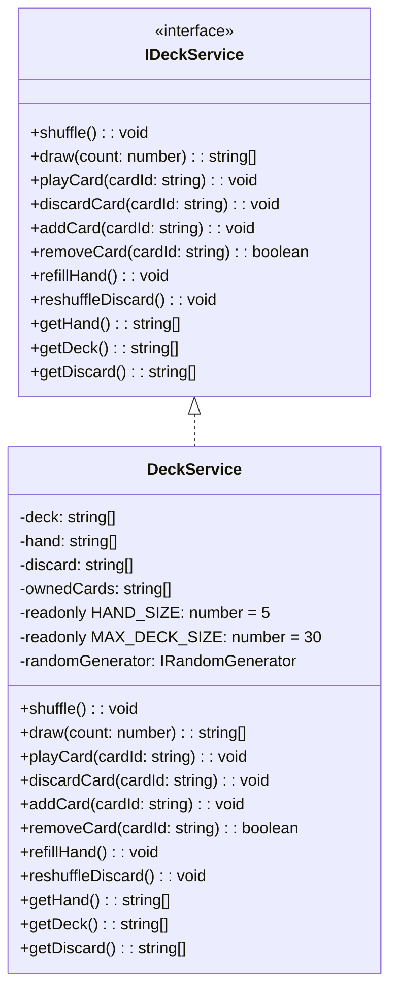

### 2.3 主要メソッド

| メソッド | 引数 | 戻り値 | 説明 |
|---------|------|--------|------|
| shuffle | - | void | 山札をシャッフルする |
| draw | count: number | string[] | 山札から指定枚数ドローする |
| playCard | cardId: string | void | 手札からカードを使用し捨て札へ |
| discardCard | cardId: string | void | 手札からカードを捨て札へ |
| addCard | cardId: string | void | 新しいカードをデッキに追加 |
| removeCard | cardId: string | boolean | カードをデッキから削除 |
| refillHand | - | void | 手札を5枚まで補充 |
| reshuffleDiscard | - | void | 捨て札を山札に戻してシャッフル |

### 2.4 処理フロー

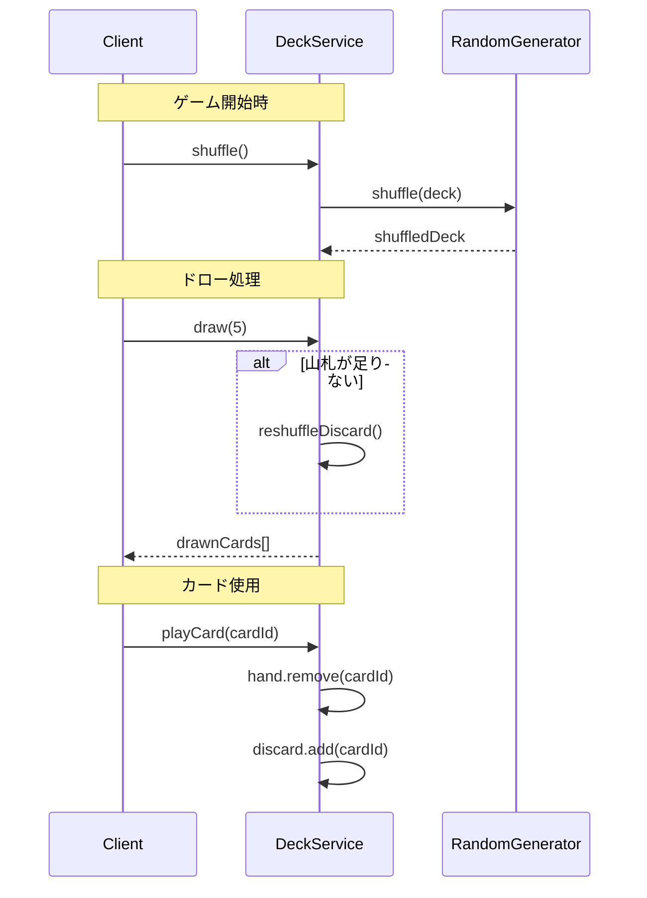

---

## 3. GatheringService 🔵

### 3.1 責務

採取地カードを使用して素材を獲得する処理を担当する。

### 3.2 クラス図

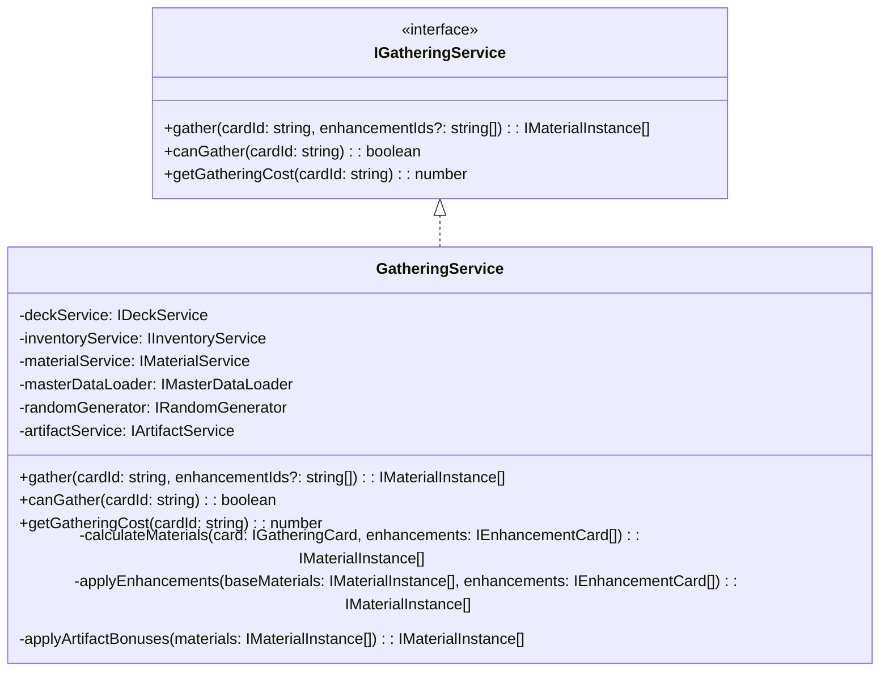

### 3.3 主要メソッド

| メソッド | 引数 | 戻り値 | 説明 |
|---------|------|--------|------|
| gather | cardId, enhancementIds? | IMaterialInstance[] | 採取を実行し素材を獲得 |
| canGather | cardId | boolean | 採取可能か判定 |
| getGatheringCost | cardId | number | 採取コストを取得 |

### 3.4 素材獲得ロジック 🔵

```typescript
calculateMaterials(card: IGatheringCard, enhancements: IEnhancementCard[]): IMaterialInstance[] {
  const materials: IMaterialInstance[] = [];

  for (const materialDef of card.materials) {
    // 確率判定
    if (this.randomGenerator.chance(materialDef.probability)) {
      // 基本獲得量
      let quantity = materialDef.quantity;

      // 強化カード「精霊の導き」の効果
      const gatheringBonus = this.getEnhancementValue(enhancements, 'GATHERING_BONUS');
      quantity += gatheringBonus;

      // アーティファクト効果（古代の地図など）
      quantity += this.artifactService.getGatheringBonus();

      // レア確率アップ（幸運のお守りなど）
      const rareChanceBonus = this.getEnhancementValue(enhancements, 'RARE_CHANCE_UP');
      // レア素材の場合、確率補正を適用

      // MaterialServiceを使用して品質を決定
      materials.push({
        materialId: materialDef.materialId,
        quality: this.materialService.determineMaterialQuality(materialDef.materialId, rareChanceBonus),
        quantity: quantity
      });
    }
  }

  return materials;
}
```

---

## 4. AlchemyService 🔵

### 4.1 責務

レシピカードと素材を使用してアイテムを調合する処理を担当する。

### 4.2 クラス図

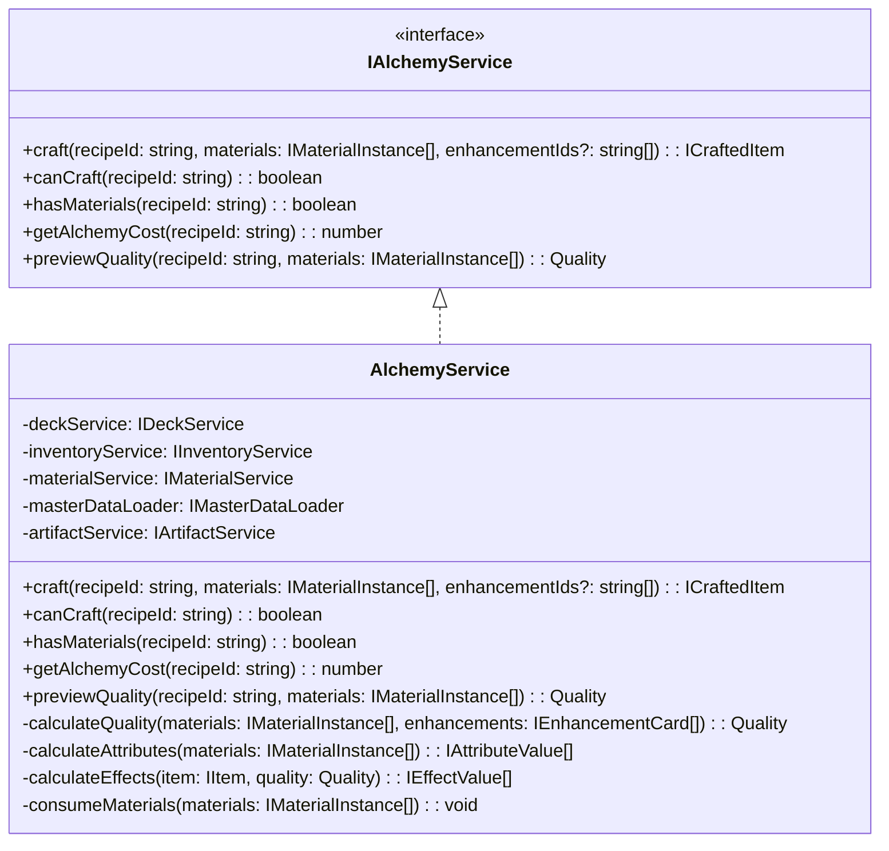

### 4.3 主要メソッド

| メソッド | 引数 | 戻り値 | 説明 |
|---------|------|--------|------|
| craft | recipeId, materials, enhancementIds? | ICraftedItem | 調合を実行しアイテムを生成 |
| canCraft | recipeId | boolean | 調合可能か判定（手札にレシピがあるか） |
| hasMaterials | recipeId | boolean | 必要素材があるか判定 |
| getAlchemyCost | recipeId | number | 調合コストを取得 |
| previewQuality | recipeId, materials | Quality | 調合結果の品質をプレビュー |

### 4.4 品質計算ロジック 🟡

```typescript
calculateQuality(materials: IMaterialInstance[], enhancements: IEnhancementCard[]): Quality {
  // MaterialServiceを使用して素材の平均品質を計算
  const avgQuality = this.materialService.calculateAverageQuality(materials);

  // 強化カード「賢者の触媒」の効果
  const qualityBonus = this.getEnhancementValue(enhancements, 'QUALITY_UP');

  // アーティファクト効果（錬金術師の眼鏡など）
  const artifactBonus = this.artifactService.getQualityBonus();

  const finalQuality = avgQuality + qualityBonus + artifactBonus;

  // MaterialServiceを使用して数値を品質ランクに変換
  return this.materialService.numberToQuality(finalQuality);
}
```

### 4.5 属性値計算ロジック 🟡

```typescript
calculateAttributes(materials: IMaterialInstance[]): IAttributeValue[] {
  // MaterialServiceに委譲して属性値を計算
  return this.materialService.calculateTotalAttributes(materials);
}
```

---

## 5. QuestService 🔵

### 5.1 責務

依頼の生成、受注、条件判定、報酬計算を担当する。

### 5.2 クラス図

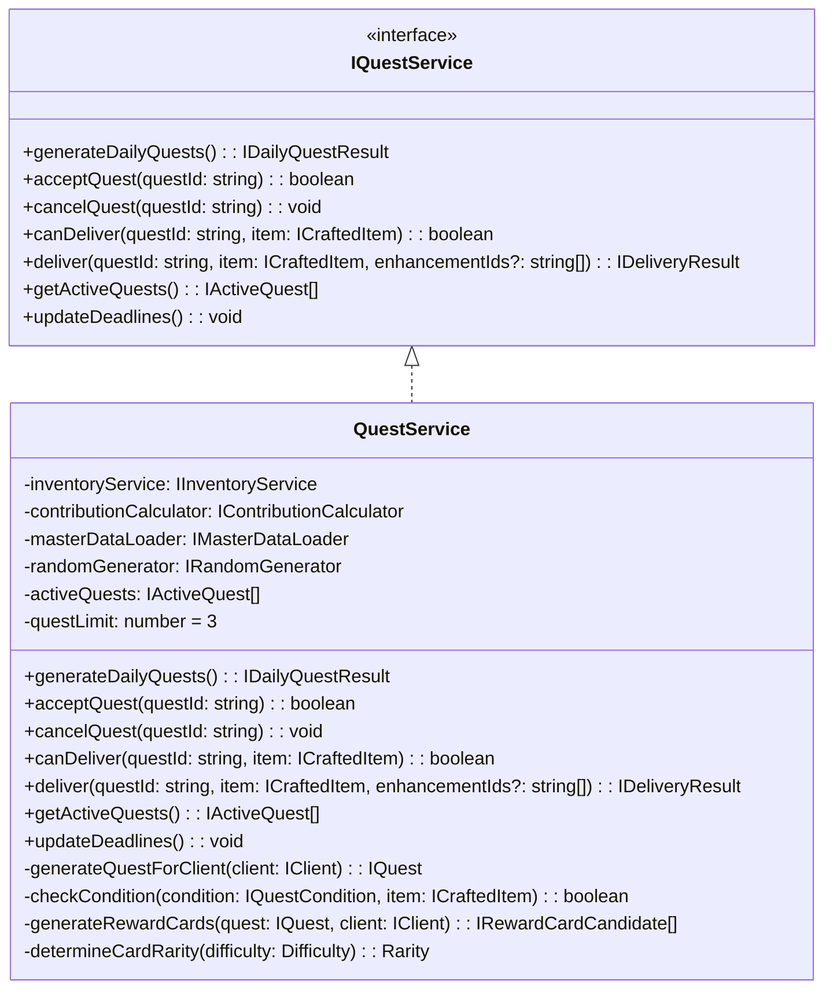

### 5.3 主要メソッド

| メソッド | 引数 | 戻り値 | 説明 |
|---------|------|--------|------|
| generateDailyQuests | - | IDailyQuestResult | 今日の依頼者と依頼を生成 |
| acceptQuest | questId | boolean | 依頼を受注 |
| cancelQuest | questId | void | 依頼を破棄 |
| canDeliver | questId, item | boolean | 納品可能か判定 |
| deliver | questId, item, enhancementIds? | IDeliveryResult | 納品を実行 |
| getActiveQuests | - | IActiveQuest[] | 受注中の依頼を取得 |
| updateDeadlines | - | void | 全依頼の期限を-1 |

### 5.4 依頼条件判定ロジック 🔵

```typescript
checkCondition(condition: IQuestCondition, item: ICraftedItem): boolean {
  switch (condition.type) {
    case 'SPECIFIC':
      return item.itemId === condition.itemId;

    case 'CATEGORY':
      const masterItem = this.masterDataLoader.getItem(item.itemId);
      return masterItem.category === condition.category;

    case 'QUALITY':
      return this.qualityToNumber(item.quality) >= this.qualityToNumber(condition.minQuality);

    case 'QUANTITY':
      // 別途、複数アイテムの合計をチェック
      return true; // 呼び出し元で判定

    case 'ATTRIBUTE':
      const attrValue = item.attributeValues.find(a => a.attribute === condition.attribute);
      return attrValue ? attrValue.value >= condition.minValue : false;

    case 'EFFECT':
      const effectValue = item.effectValues.find(e => e.type === condition.effectType);
      return effectValue ? effectValue.value >= condition.minValue : false;

    case 'MATERIAL':
      // レア素材を指定数以上使用しているか
      const rareMaterialCount = item.usedMaterials.filter(m => m.isRare).length;
      return rareMaterialCount >= condition.minRareMaterials;

    case 'COMPOUND':
      // 複合条件: すべての子条件を満たすか
      return condition.subConditions.every(sub => this.checkCondition(sub, item));

    default:
      return false;
  }
}
```

### 5.5 報酬カード生成ロジック 🔵

```typescript
generateRewardCards(quest: IQuest, client: IClient): IRewardCardCandidate[] {
  const candidates: IRewardCardCandidate[] = [];

  // 1枚目: 依頼者タイプに関連するカード
  candidates.push(this.selectCardByClientType(client.type));

  // 2枚目: 依頼タイプに関連するカード
  candidates.push(this.selectCardByQuestType(quest.condition.type));

  // 3枚目: ランダム枠
  candidates.push(this.selectRandomCard());

  // レアリティ決定
  for (const card of candidates) {
    card.rarity = this.determineCardRarity(quest.difficulty);
  }

  return candidates;
}

determineCardRarity(difficulty: Difficulty): Rarity {
  const roll = this.randomGenerator.random() * 100;
  const table = this.getRarityTable(difficulty);

  if (roll < table.common) return 'COMMON';
  if (roll < table.common + table.uncommon) return 'UNCOMMON';
  return 'RARE';
}
```

---

## 6. ContributionCalculator 🔵

### 6.1 責務

納品時の貢献度を計算する。

### 6.2 クラス図

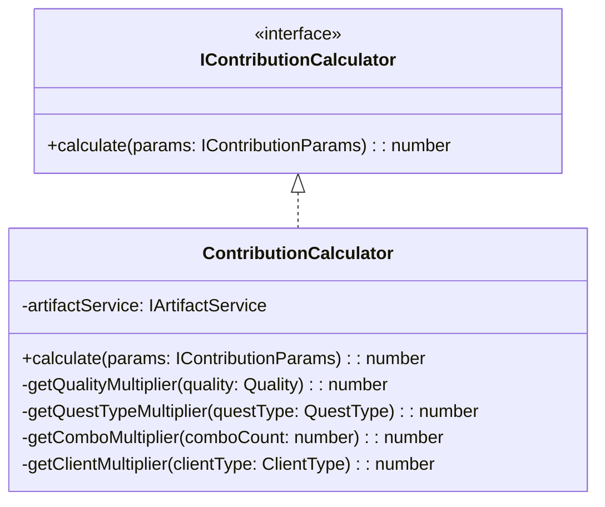

### 6.3 計算ロジック 🔵

```typescript
calculate(params: IContributionParams): number {
  const {
    baseContribution,
    quality,
    questType,
    clientType,
    comboCount,
    enhancementCards
  } = params;

  // 基本計算
  let contribution = baseContribution;

  // 品質補正
  contribution *= this.getQualityMultiplier(quality);

  // 依頼タイプ補正
  contribution *= this.getQuestTypeMultiplier(questType);

  // 依頼者補正
  contribution *= this.getClientMultiplier(clientType);

  // コンボ補正
  contribution *= this.getComboMultiplier(comboCount);

  // 強化カード補正（ギルド推薦状など）
  const enhancementBonus = this.getEnhancementContributionBonus(enhancementCards);
  contribution *= (1 + enhancementBonus / 100);

  // アーティファクト補正（ギルドマスターの印など）
  const artifactBonus = this.artifactService.getContributionBonus();
  contribution *= (1 + artifactBonus / 100);

  return Math.floor(contribution);
}

private getQualityMultiplier(quality: Quality): number {
  const table: Record<Quality, number> = {
    'D': 0.5,
    'C': 1.0,
    'B': 1.5,
    'A': 2.0,
    'S': 3.0
  };
  return table[quality];
}

private getQuestTypeMultiplier(questType: QuestType): number {
  const table: Record<QuestType, number> = {
    'SPECIFIC': 1.0,
    'CATEGORY': 0.8,
    'QUALITY': 1.2,
    'QUANTITY': 0.7,
    'ATTRIBUTE': 1.3,
    'EFFECT': 1.3,
    'MATERIAL': 1.5,
    'COMPOUND': 1.8
  };
  return table[questType];
}

private getComboMultiplier(comboCount: number): number {
  if (comboCount >= 10) return 2.0;
  if (comboCount >= 5) return 1.5;
  if (comboCount >= 3) return 1.2;
  if (comboCount >= 2) return 1.1;
  return 1.0;
}

private getClientMultiplier(clientType: ClientType): number {
  const table: Record<ClientType, number> = {
    'VILLAGER': 0.8,
    'ADVENTURER': 1.0,
    'MERCHANT': 1.2,
    'NOBLE': 1.5,
    'GUILD': 1.3
  };
  return table[clientType];
}
```

---

## 7. RankService 🔵

### 7.1 責務

ギルドランクの管理、昇格試験の処理を担当する。

### 7.2 クラス図

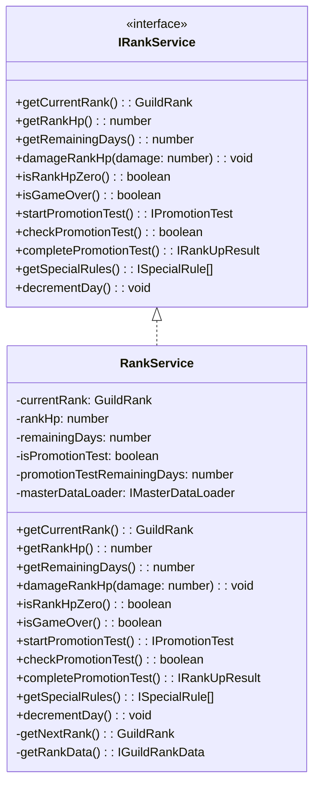

### 7.3 主要メソッド

| メソッド | 引数 | 戻り値 | 説明 |
|---------|------|--------|------|
| getCurrentRank | - | GuildRank | 現在のランクを取得 |
| getRankHp | - | number | 現在のランクHPを取得 |
| damageRankHp | damage | void | ランクHPにダメージを与える |
| isRankHpZero | - | boolean | ランクHPが0か判定 |
| isGameOver | - | boolean | 日数切れか判定 |
| startPromotionTest | - | IPromotionTest | 昇格試験を開始 |
| checkPromotionTest | - | boolean | 昇格試験をクリアしたか判定 |
| completePromotionTest | - | IRankUpResult | ランクアップ処理を実行 |
| getSpecialRules | - | ISpecialRule[] | 現在ランクの特殊ルールを取得 |
| decrementDay | - | void | 残り日数を減らす |

---

## 8. ShopService 🔵

### 8.1 責務

ショップでの購入処理を担当する。

### 8.2 クラス図

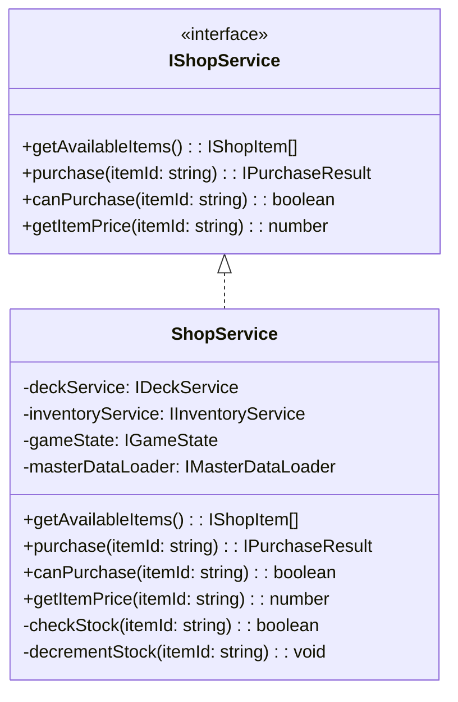

### 8.3 主要メソッド

| メソッド | 引数 | 戻り値 | 説明 |
|---------|------|--------|------|
| getAvailableItems | - | IShopItem[] | 購入可能なアイテム一覧を取得 |
| purchase | itemId | IPurchaseResult | 購入を実行 |
| canPurchase | itemId | boolean | 購入可能か判定（ゴールド・在庫） |
| getItemPrice | itemId | number | 価格を取得 |

---

## 9. ArtifactService 🔵

### 9.1 責務

アーティファクトの管理とボーナス計算を担当する。

### 9.2 クラス図

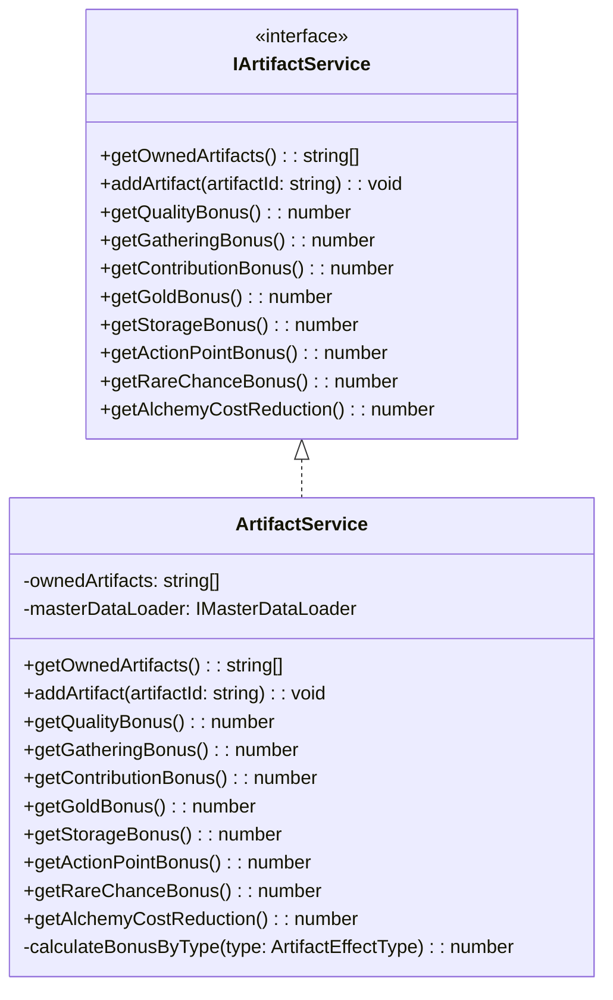

### 9.3 ボーナス計算ロジック 🟡

```typescript
calculateBonusByType(type: ArtifactEffectType): number {
  let totalBonus = 0;

  for (const artifactId of this.ownedArtifacts) {
    const artifact = this.masterDataLoader.getArtifact(artifactId);
    if (artifact.effect.type === type) {
      totalBonus += artifact.effect.value;
    }
    // 錬金王の冠の場合、全効果に+10%
    if (artifact.effect.type === 'ALL_BONUS') {
      totalBonus += artifact.effect.value / 10; // 10%を各効果に分配
    }
  }

  return totalBonus;
}
```

---

## 10. MaterialService 🔵

### 10.1 責務

素材の品質・属性計算、レア判定、レシピ検証を担当する。素材に関するビジネスロジックを集約し、GatheringService・AlchemyServiceから参照される。

### 10.2 クラス図

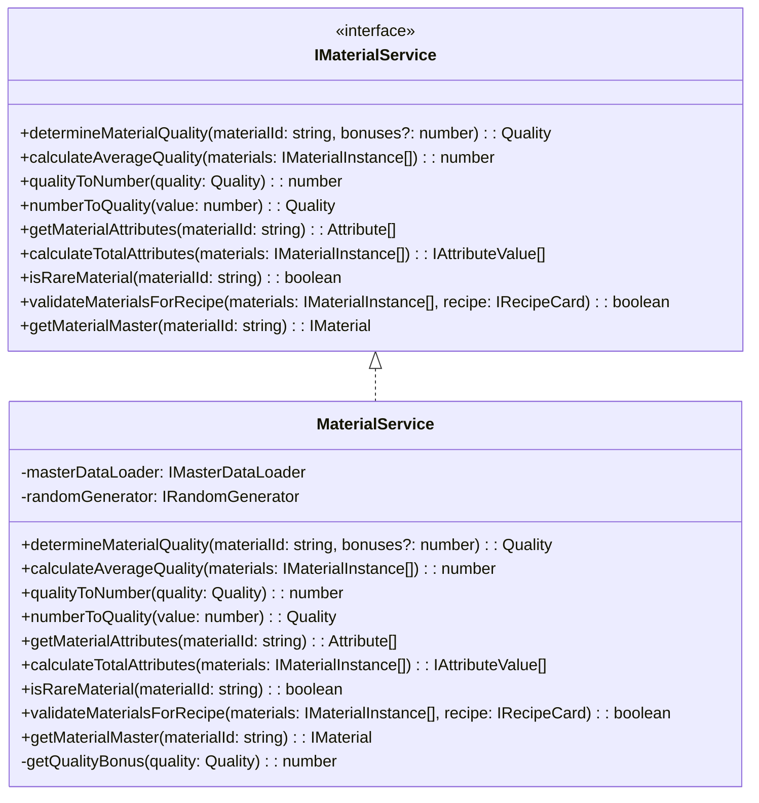

### 10.3 主要メソッド

| メソッド | 引数 | 戻り値 | 説明 |
|---------|------|--------|------|
| determineMaterialQuality | materialId, bonuses? | Quality | 素材の品質を決定（ランダム＋ボーナス） |
| calculateAverageQuality | materials[] | number | 複数素材の平均品質を計算 |
| qualityToNumber | quality | number | 品質をランク数値（1-5）に変換 |
| numberToQuality | value | Quality | 数値を品質ランク（D-S）に変換 |
| getMaterialAttributes | materialId | Attribute[] | 素材の持つ属性を取得 |
| calculateTotalAttributes | materials[] | IAttributeValue[] | 複数素材の属性値を合算 |
| isRareMaterial | materialId | boolean | レア素材か判定 |
| validateMaterialsForRecipe | materials[], recipe | boolean | レシピ要件を満たすか検証 |
| getMaterialMaster | materialId | IMaterial | 素材のマスターデータを取得 |

### 10.4 品質決定ロジック 🔵

```typescript
determineMaterialQuality(materialId: string, bonuses: number = 0): Quality {
  const material = this.masterDataLoader.getMaterial(materialId);

  // 基本品質（マスターデータで定義）
  const baseQuality = this.qualityToNumber(material.baseQuality);

  // ランダム変動（-1 〜 +1）
  const variation = this.randomGenerator.randomInt(-1, 1);

  // 最終品質を計算
  const finalValue = Math.max(1, Math.min(5, baseQuality + variation + bonuses));

  return this.numberToQuality(finalValue);
}
```

### 10.5 品質変換ロジック 🔵

```typescript
qualityToNumber(quality: Quality): number {
  const map: Record<Quality, number> = {
    'D': 1,
    'C': 2,
    'B': 3,
    'A': 4,
    'S': 5
  };
  return map[quality];
}

numberToQuality(value: number): Quality {
  if (value <= 1) return 'D';
  if (value <= 2) return 'C';
  if (value <= 3) return 'B';
  if (value <= 4) return 'A';
  return 'S';
}
```

### 10.6 属性計算ロジック 🔵

```typescript
calculateTotalAttributes(materials: IMaterialInstance[]): IAttributeValue[] {
  const attributeMap = new Map<Attribute, number>();

  for (const material of materials) {
    const masterData = this.getMaterialMaster(material.materialId);
    for (const attr of masterData.attributes) {
      const current = attributeMap.get(attr) || 0;
      // 品質による属性値ボーナス
      const qualityBonus = this.getQualityBonus(material.quality);
      attributeMap.set(attr, current + (1 + qualityBonus) * material.quantity);
    }
  }

  return Array.from(attributeMap.entries()).map(([attribute, value]) => ({
    attribute,
    value: Math.floor(value)
  }));
}

private getQualityBonus(quality: Quality): number {
  const map: Record<Quality, number> = {
    'D': 0.0,
    'C': 0.1,
    'B': 0.2,
    'A': 0.4,
    'S': 0.6
  };
  return map[quality];
}
```

### 10.7 レシピ検証ロジック 🔵

```typescript
validateMaterialsForRecipe(materials: IMaterialInstance[], recipe: IRecipeCard): boolean {
  // 必要素材が揃っているかチェック
  for (const required of recipe.requiredMaterials) {
    const available = materials.filter(m => m.materialId === required.materialId);
    const totalQuantity = available.reduce((sum, m) => sum + m.quantity, 0);

    if (totalQuantity < required.quantity) {
      return false;
    }
  }

  // カテゴリ条件のチェック（任意素材）
  if (recipe.optionalCategories) {
    for (const categoryReq of recipe.optionalCategories) {
      const matchingMaterials = materials.filter(m => {
        const master = this.getMaterialMaster(m.materialId);
        return master.category === categoryReq.category;
      });
      const totalQuantity = matchingMaterials.reduce((sum, m) => sum + m.quantity, 0);

      if (totalQuantity < categoryReq.quantity) {
        return false;
      }
    }
  }

  return true;
}
```

---

## 11. InventoryService 🔵

### 11.1 責務

素材とアイテムのインベントリ管理を担当する。

### 11.2 クラス図

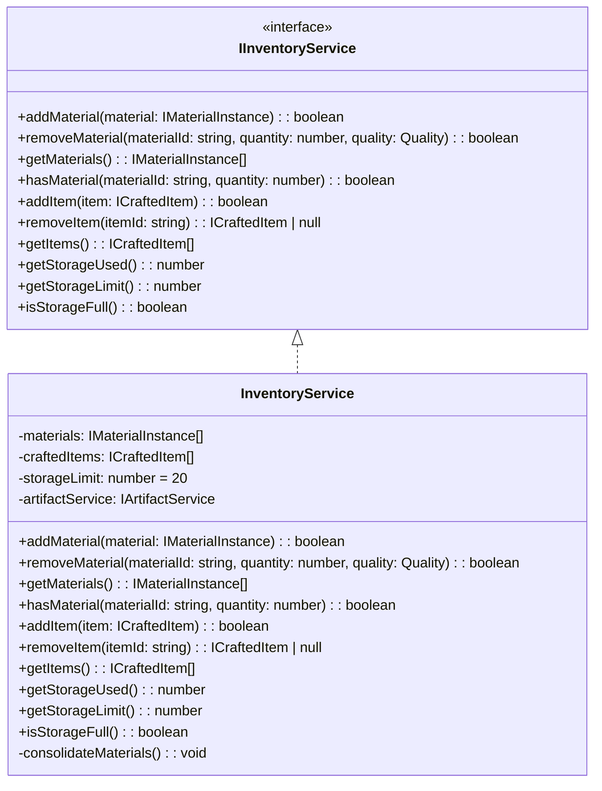

### 11.3 主要メソッド

| メソッド | 引数 | 戻り値 | 説明 |
|---------|------|--------|------|
| addMaterial | material | boolean | 素材を追加（上限チェック） |
| removeMaterial | materialId, quantity, quality | boolean | 素材を消費 |
| getMaterials | - | IMaterialInstance[] | 全素材を取得 |
| hasMaterial | materialId, quantity | boolean | 素材があるか判定 |
| addItem | item | boolean | アイテムを追加 |
| removeItem | itemId | ICraftedItem | null | アイテムを取り出す |
| getItems | - | ICraftedItem[] | 全アイテムを取得 |
| getStorageUsed | - | number | 使用中の枠数 |
| getStorageLimit | - | number | 上限枠数（アーティファクト込み） |
| isStorageFull | - | boolean | 満杯か判定 |

---

## 12. システム間の依存関係図 🟡

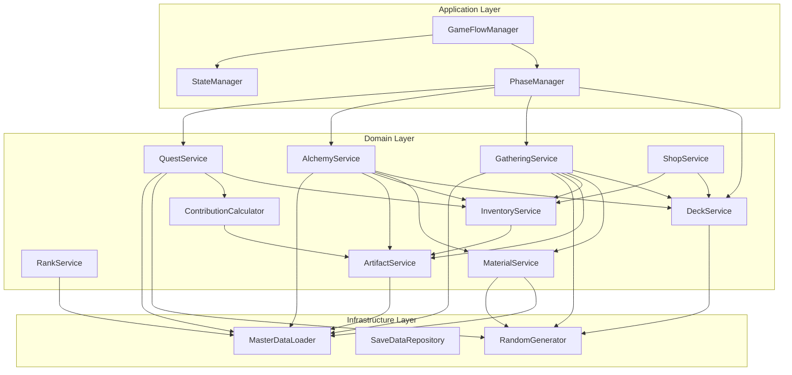

---

## 関連文書

- **要件定義書**: [../../spec/atelier-guild-rank-requirements.md](../../spec/atelier-guild-rank-requirements.md)
- **アーキテクチャ設計書**: [architecture.md](architecture.md)
- **データスキーマ設計書**: [data-schema.md](data-schema.md)
- **ゲームメカニクス設計書**: [game-mechanics.md](game-mechanics.md)

---

## 変更履歴

| 日付 | バージョン | 変更内容 |
|------|----------|---------|
| 2026-01-01 | 1.0.0 | 初版作成 |
| 2026-01-01 | 1.1.0 | MaterialServiceを追加、GatheringService・AlchemyServiceの依存を更新 |
