# データフロー図

**バージョン**: 1.0.0
**作成日**: 2026-01-01
**対象**: アトリエ錬金術ゲーム（ギルドランク制）HTML版

---

## 概要

本ドキュメントは、ゲーム全体およびシステム間のデータフローを可視化する。

### 信頼性レベル凡例

- 🔵 **青信号**: 要件定義書に詳細記載
- 🟡 **黄信号**: 要件定義書から妥当な推測
- 🔴 **赤信号**: 要件定義書にない推測

---

## 1. ゲーム全体のフロー 🔵

### 1.1 起動からゲーム終了まで

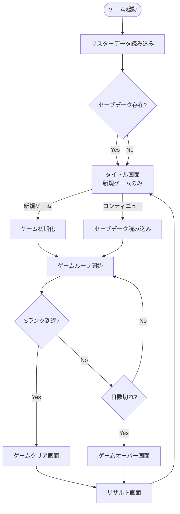
```mermaid
flowchart TD
    Start([ゲーム起動]) --> LoadMaster[マスターデータ読み込み]
    LoadMaster --> CheckSave{セーブデータ存在?}
    CheckSave -->|Yes| Title[タイトル画面<br>コンティニュー有効]
    CheckSave -->|No| Title[タイトル画面<br>新規ゲームのみ]

    Title -->|新規ゲーム| InitGame[ゲーム初期化]
    Title -->|コンティニュー| LoadSave[セーブデータ読み込み]

    InitGame --> GameLoop[ゲームループ開始]
    LoadSave --> GameLoop

    GameLoop --> CheckWin{Sランク到達?}
    CheckWin -->|Yes| Victory[ゲームクリア画面]
    CheckWin -->|No| CheckLose{日数切れ?}
    CheckLose -->|Yes| GameOver[ゲームオーバー画面]
    CheckLose -->|No| GameLoop

    Victory --> Result[リザルト画面]
    GameOver --> Result
    Result --> Title
```

### 1.2 ゲームループ詳細フロー 🔵

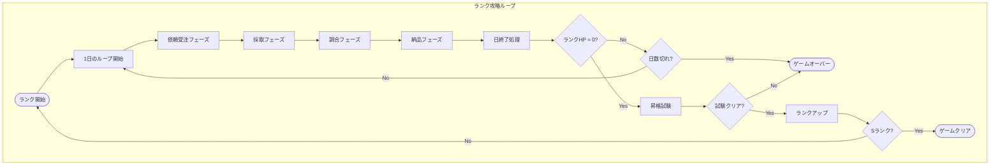
```mermaid
flowchart TD
    subgraph "ランク攻略ループ"
        RankStart([ランク開始]) --> DayLoop[1日のループ開始]

        DayLoop --> QuestAccept[依頼受注フェーズ]
        QuestAccept --> Gathering[採取フェーズ]
        Gathering --> Alchemy[調合フェーズ]
        Alchemy --> Delivery[納品フェーズ]
        Delivery --> DayEnd[日終了処理]

        DayEnd --> CheckRankHp{ランクHP = 0?}
        CheckRankHp -->|No| CheckDayLimit{日数切れ?}
        CheckDayLimit -->|No| DayLoop
        CheckDayLimit -->|Yes| GameOver([ゲームオーバー])

        CheckRankHp -->|Yes| PromotionTest[昇格試験]
        PromotionTest --> CheckTestClear{試験クリア?}
        CheckTestClear -->|Yes| RankUp[ランクアップ]
        CheckTestClear -->|No| GameOver

        RankUp --> CheckSRank{Sランク?}
        CheckSRank -->|Yes| Victory([ゲームクリア])
        CheckSRank -->|No| RankStart
    end
```

---

## 2. フェーズ別データフロー 🔵

### 2.1 依頼受注フェーズ

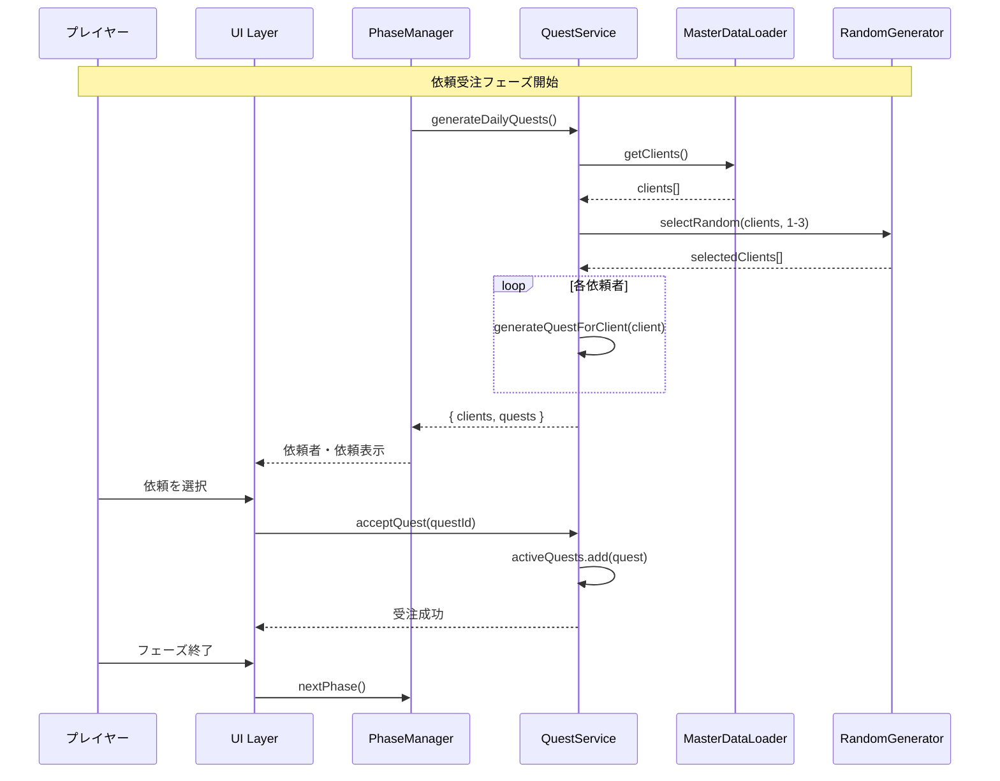
```mermaid
sequenceDiagram
    participant Player as プレイヤー
    participant UI as UI Layer
    participant PM as PhaseManager
    participant QS as QuestService
    participant MDL as MasterDataLoader
    participant RG as RandomGenerator

    Note over Player,RG: 依頼受注フェーズ開始

    PM->>QS: generateDailyQuests()
    QS->>MDL: getClients()
    MDL-->>QS: clients[]
    QS->>RG: selectRandom(clients, 1-3)
    RG-->>QS: selectedClients[]

    loop 各依頼者
        QS->>QS: generateQuestForClient(client)
    end

    QS-->>PM: { clients, quests }
    PM-->>UI: 依頼者・依頼表示

    Player->>UI: 依頼を選択
    UI->>QS: acceptQuest(questId)
    QS->>QS: activeQuests.add(quest)
    QS-->>UI: 受注成功

    Player->>UI: フェーズ終了
    UI->>PM: nextPhase()
```

### 2.2 採取フェーズ

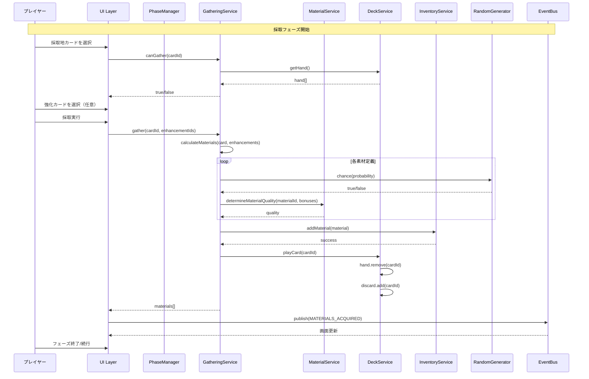
```mermaid
sequenceDiagram
    participant Player as プレイヤー
    participant UI as UI Layer
    participant PM as PhaseManager
    participant GS as GatheringService
    participant MS as MaterialService
    participant DS as DeckService
    participant IS as InventoryService
    participant RG as RandomGenerator
    participant EB as EventBus

    Note over Player,EB: 採取フェーズ開始

    Player->>UI: 採取地カードを選択
    UI->>GS: canGather(cardId)
    GS->>DS: getHand()
    DS-->>GS: hand[]
    GS-->>UI: true/false

    Player->>UI: 強化カードを選択（任意）
    Player->>UI: 採取実行

    UI->>GS: gather(cardId, enhancementIds)

    GS->>GS: calculateMaterials(card, enhancements)
    loop 各素材定義
        GS->>RG: chance(probability)
        RG-->>GS: true/false
        GS->>MS: determineMaterialQuality(materialId, bonuses)
        MS-->>GS: quality
    end

    GS->>IS: addMaterial(material)
    IS-->>GS: success

    GS->>DS: playCard(cardId)
    DS->>DS: hand.remove(cardId)
    DS->>DS: discard.add(cardId)

    GS-->>UI: materials[]
    UI->>EB: publish(MATERIALS_ACQUIRED)
    EB-->>UI: 画面更新

    Player->>UI: フェーズ終了/続行
```

### 2.3 調合フェーズ

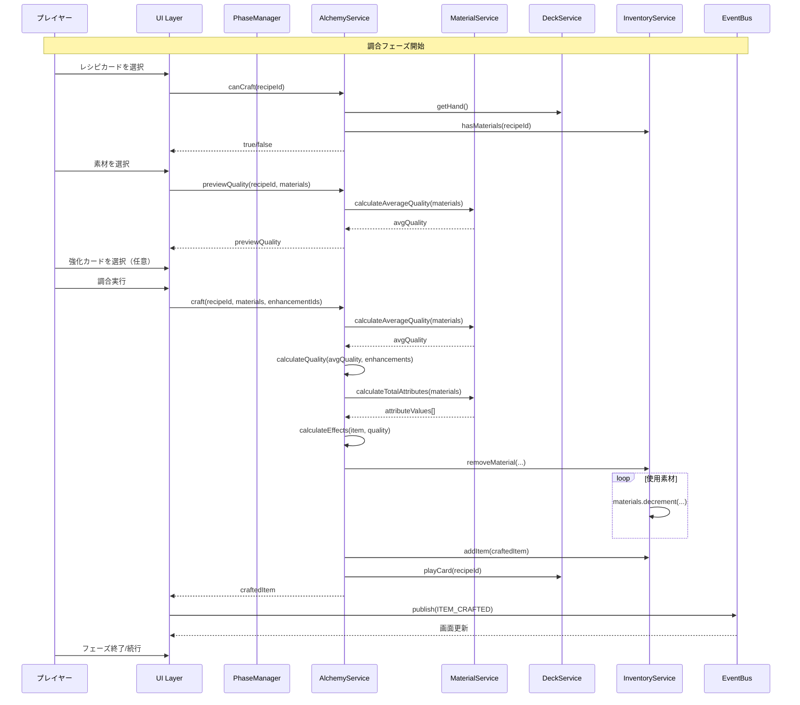
```mermaid
sequenceDiagram
    participant Player as プレイヤー
    participant UI as UI Layer
    participant PM as PhaseManager
    participant AS as AlchemyService
    participant MS as MaterialService
    participant DS as DeckService
    participant IS as InventoryService
    participant EB as EventBus

    Note over Player,EB: 調合フェーズ開始

    Player->>UI: レシピカードを選択
    UI->>AS: canCraft(recipeId)
    AS->>DS: getHand()
    AS->>IS: hasMaterials(recipeId)
    AS-->>UI: true/false

    Player->>UI: 素材を選択
    UI->>AS: previewQuality(recipeId, materials)
    AS->>MS: calculateAverageQuality(materials)
    MS-->>AS: avgQuality
    AS-->>UI: previewQuality

    Player->>UI: 強化カードを選択（任意）
    Player->>UI: 調合実行

    UI->>AS: craft(recipeId, materials, enhancementIds)

    AS->>MS: calculateAverageQuality(materials)
    MS-->>AS: avgQuality
    AS->>AS: calculateQuality(avgQuality, enhancements)
    AS->>MS: calculateTotalAttributes(materials)
    MS-->>AS: attributeValues[]
    AS->>AS: calculateEffects(item, quality)

    AS->>IS: removeMaterial(...)
    loop 使用素材
        IS->>IS: materials.decrement(...)
    end

    AS->>IS: addItem(craftedItem)

    AS->>DS: playCard(recipeId)

    AS-->>UI: craftedItem
    UI->>EB: publish(ITEM_CRAFTED)
    EB-->>UI: 画面更新

    Player->>UI: フェーズ終了/続行
```

### 2.4 納品フェーズ

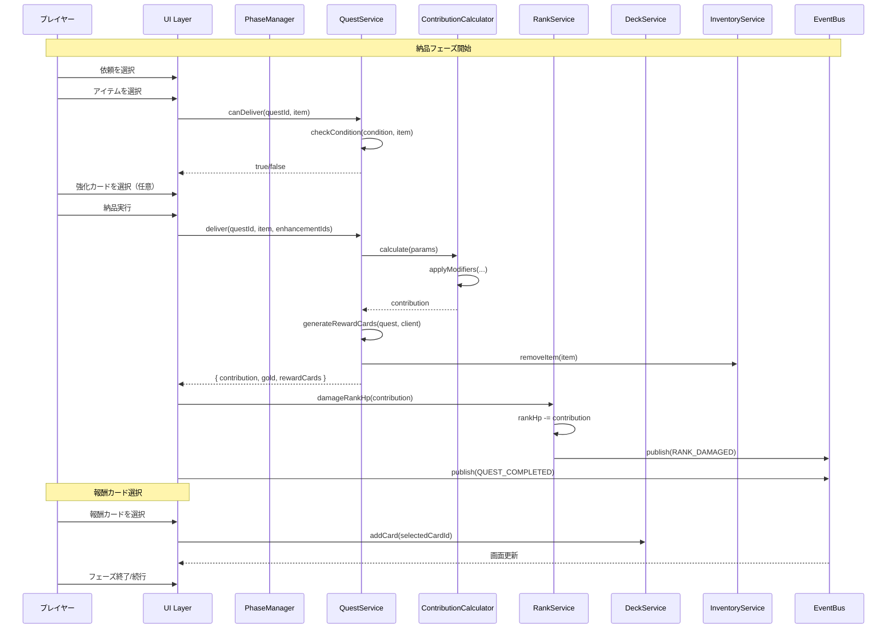
```mermaid
sequenceDiagram
    participant Player as プレイヤー
    participant UI as UI Layer
    participant PM as PhaseManager
    participant QS as QuestService
    participant CC as ContributionCalculator
    participant RS as RankService
    participant DS as DeckService
    participant IS as InventoryService
    participant EB as EventBus

    Note over Player,EB: 納品フェーズ開始

    Player->>UI: 依頼を選択
    Player->>UI: アイテムを選択

    UI->>QS: canDeliver(questId, item)
    QS->>QS: checkCondition(condition, item)
    QS-->>UI: true/false

    Player->>UI: 強化カードを選択（任意）
    Player->>UI: 納品実行

    UI->>QS: deliver(questId, item, enhancementIds)

    QS->>CC: calculate(params)
    CC->>CC: applyModifiers(...)
    CC-->>QS: contribution

    QS->>QS: generateRewardCards(quest, client)
    QS->>IS: removeItem(item)

    QS-->>UI: { contribution, gold, rewardCards }

    UI->>RS: damageRankHp(contribution)
    RS->>RS: rankHp -= contribution
    RS->>EB: publish(RANK_DAMAGED)

    UI->>EB: publish(QUEST_COMPLETED)

    Note over Player,UI: 報酬カード選択

    Player->>UI: 報酬カードを選択
    UI->>DS: addCard(selectedCardId)

    EB-->>UI: 画面更新

    Player->>UI: フェーズ終了/続行
```

### 2.5 日終了処理

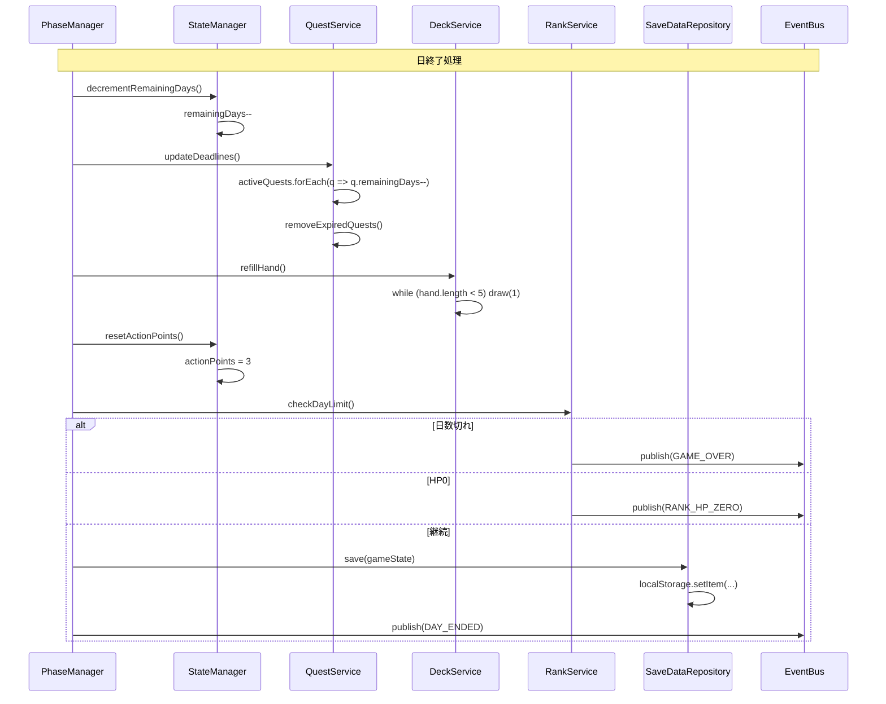
```mermaid
sequenceDiagram
    participant PM as PhaseManager
    participant SM as StateManager
    participant QS as QuestService
    participant DS as DeckService
    participant RS as RankService
    participant SDR as SaveDataRepository
    participant EB as EventBus

    Note over PM,EB: 日終了処理

    PM->>SM: decrementRemainingDays()
    SM->>SM: remainingDays--

    PM->>QS: updateDeadlines()
    QS->>QS: activeQuests.forEach(q => q.remainingDays--)
    QS->>QS: removeExpiredQuests()

    PM->>DS: refillHand()
    DS->>DS: while (hand.length < 5) draw(1)

    PM->>SM: resetActionPoints()
    SM->>SM: actionPoints = 3

    PM->>RS: checkDayLimit()
    alt 日数切れ
        RS->>EB: publish(GAME_OVER)
    else HP0
        RS->>EB: publish(RANK_HP_ZERO)
    else 継続
        PM->>SDR: save(gameState)
        SDR->>SDR: localStorage.setItem(...)
        PM->>EB: publish(DAY_ENDED)
    end
```

---

## 3. 状態遷移図 🔵

### 3.1 画面遷移

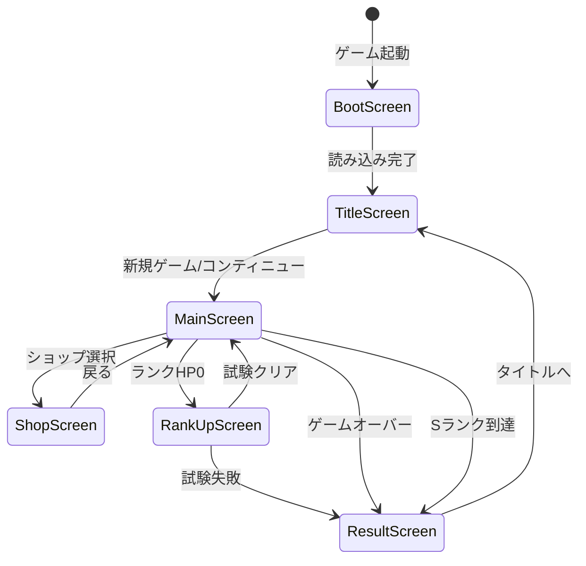
```mermaid
stateDiagram-v2
    [*] --> BootScreen: ゲーム起動
    BootScreen --> TitleScreen: 読み込み完了

    TitleScreen --> MainScreen: 新規ゲーム/コンティニュー

    MainScreen --> ShopScreen: ショップ選択
    ShopScreen --> MainScreen: 戻る

    MainScreen --> RankUpScreen: ランクHP0
    RankUpScreen --> MainScreen: 試験クリア
    RankUpScreen --> ResultScreen: 試験失敗

    MainScreen --> ResultScreen: ゲームオーバー
    MainScreen --> ResultScreen: Sランク到達

    ResultScreen --> TitleScreen: タイトルへ
```

### 3.2 フェーズ遷移（メイン画面内）

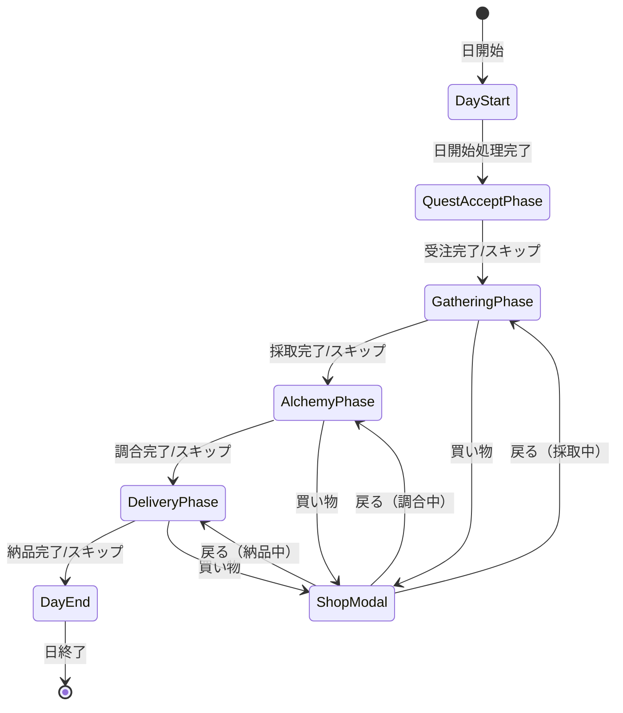
```mermaid
stateDiagram-v2
    [*] --> DayStart: 日開始

    DayStart --> QuestAcceptPhase: 日開始処理完了

    QuestAcceptPhase --> GatheringPhase: 受注完了/スキップ

    GatheringPhase --> AlchemyPhase: 採取完了/スキップ
    GatheringPhase --> ShopModal: 買い物

    AlchemyPhase --> DeliveryPhase: 調合完了/スキップ
    AlchemyPhase --> ShopModal: 買い物

    DeliveryPhase --> DayEnd: 納品完了/スキップ
    DeliveryPhase --> ShopModal: 買い物

    ShopModal --> GatheringPhase: 戻る（採取中）
    ShopModal --> AlchemyPhase: 戻る（調合中）
    ShopModal --> DeliveryPhase: 戻る（納品中）

    DayEnd --> [*]: 日終了
```

### 3.3 ランク状態遷移

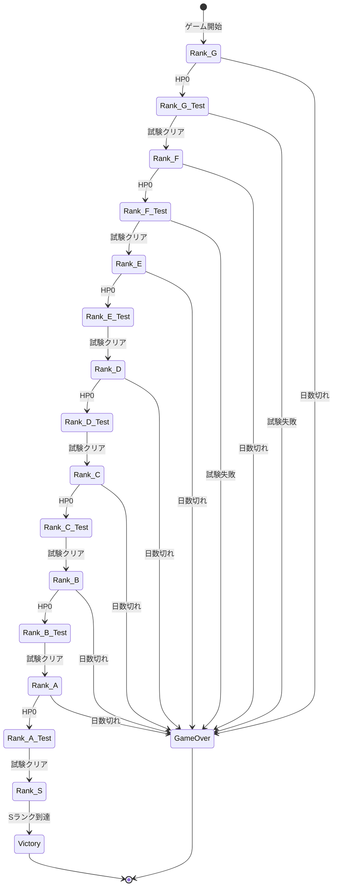
```mermaid
stateDiagram-v2
    [*] --> Rank_G: ゲーム開始

    Rank_G --> Rank_G_Test: HP0
    Rank_G_Test --> Rank_F: 試験クリア
    Rank_G_Test --> GameOver: 試験失敗

    Rank_F --> Rank_F_Test: HP0
    Rank_F_Test --> Rank_E: 試験クリア
    Rank_F_Test --> GameOver: 試験失敗

    Rank_E --> Rank_E_Test: HP0
    Rank_E_Test --> Rank_D: 試験クリア

    Rank_D --> Rank_D_Test: HP0
    Rank_D_Test --> Rank_C: 試験クリア

    Rank_C --> Rank_C_Test: HP0
    Rank_C_Test --> Rank_B: 試験クリア

    Rank_B --> Rank_B_Test: HP0
    Rank_B_Test --> Rank_A: 試験クリア

    Rank_A --> Rank_A_Test: HP0
    Rank_A_Test --> Rank_S: 試験クリア

    Rank_S --> Victory: Sランク到達

    Rank_G --> GameOver: 日数切れ
    Rank_F --> GameOver: 日数切れ
    Rank_E --> GameOver: 日数切れ
    Rank_D --> GameOver: 日数切れ
    Rank_C --> GameOver: 日数切れ
    Rank_B --> GameOver: 日数切れ
    Rank_A --> GameOver: 日数切れ

    GameOver --> [*]
    Victory --> [*]
```

---

## 4. データ変換フロー 🟡

### 4.1 素材→アイテム変換

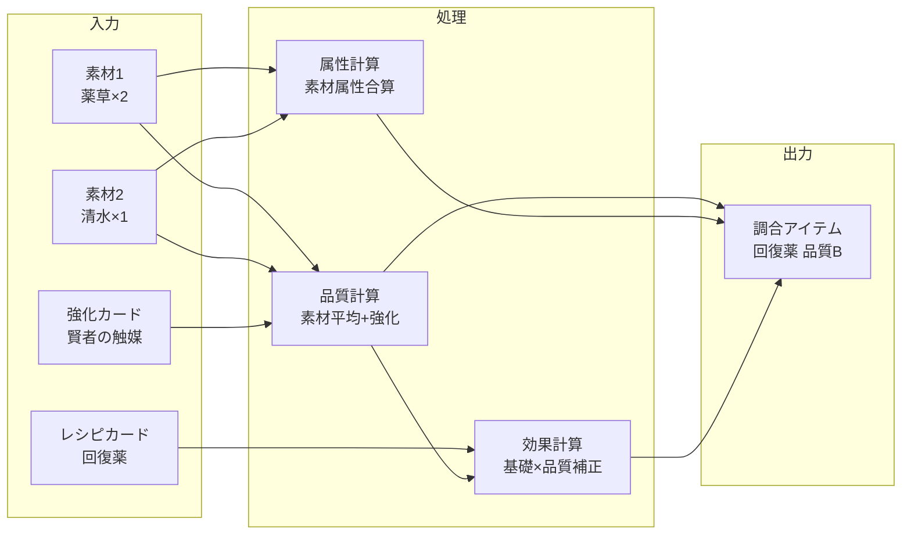
```mermaid
flowchart LR
    subgraph "入力"
        M1[素材1<br>薬草×2]
        M2[素材2<br>清水×1]
        R[レシピカード<br>回復薬]
        E[強化カード<br>賢者の触媒]
    end

    subgraph "処理"
        QC[品質計算<br>素材平均+強化]
        AC[属性計算<br>素材属性合算]
        EC[効果計算<br>基礎×品質補正]
    end

    subgraph "出力"
        I[調合アイテム<br>回復薬 品質B]
    end

    M1 --> QC
    M2 --> QC
    E --> QC
    QC --> I

    M1 --> AC
    M2 --> AC
    AC --> I

    R --> EC
    QC --> EC
    EC --> I
```

### 4.2 アイテム→貢献度変換

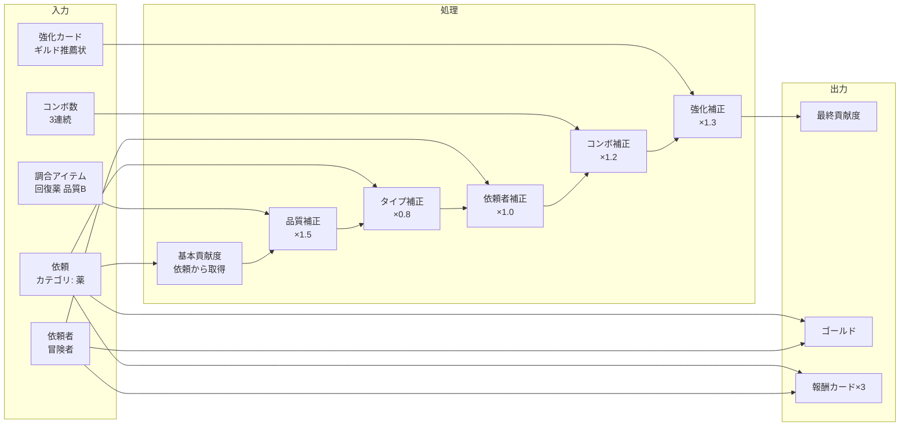
```mermaid
flowchart LR
    subgraph "入力"
        I[調合アイテム<br>回復薬 品質B]
        Q[依頼<br>カテゴリ: 薬]
        C[依頼者<br>冒険者]
        E[強化カード<br>ギルド推薦状]
        CB[コンボ数<br>3連続]
    end

    subgraph "処理"
        BC[基本貢献度<br>依頼から取得]
        QM[品質補正<br>×1.5]
        TM[タイプ補正<br>×0.8]
        CM[依頼者補正<br>×1.0]
        CBM[コンボ補正<br>×1.2]
        EM[強化補正<br>×1.3]
    end

    subgraph "出力"
        CO[最終貢献度]
        G[ゴールド]
        RC[報酬カード×3]
    end

    Q --> BC
    I --> QM
    BC --> QM
    Q --> TM
    QM --> TM
    C --> CM
    TM --> CM
    CB --> CBM
    CM --> CBM
    E --> EM
    CBM --> EM
    EM --> CO

    Q --> G
    C --> G

    Q --> RC
    C --> RC
```

---

## 5. イベントフロー 🟡

### 5.1 イベント一覧

| イベント名 | 発生タイミング | 購読者 |
|-----------|--------------|--------|
| GAME_STARTED | ゲーム開始時 | UI全体 |
| DAY_STARTED | 日開始時 | MainScreen |
| PHASE_CHANGED | フェーズ変更時 | PhaseIndicator |
| QUEST_ACCEPTED | 依頼受注時 | QuestView |
| MATERIALS_ACQUIRED | 素材獲得時 | InventoryView |
| ITEM_CRAFTED | アイテム調合時 | InventoryView |
| QUEST_COMPLETED | 依頼完了時 | QuestView, RankProgressView |
| RANK_DAMAGED | ランクHPダメージ時 | RankProgressView |
| RANK_HP_ZERO | ランクHP0時 | GameFlowManager |
| DAY_ENDED | 日終了時 | DayCounter, HandView |
| RANK_UP | ランクアップ時 | RankProgressView |
| GAME_OVER | ゲームオーバー時 | ScreenManager |
| GAME_CLEARED | ゲームクリア時 | ScreenManager |

### 5.2 イベント発行フロー

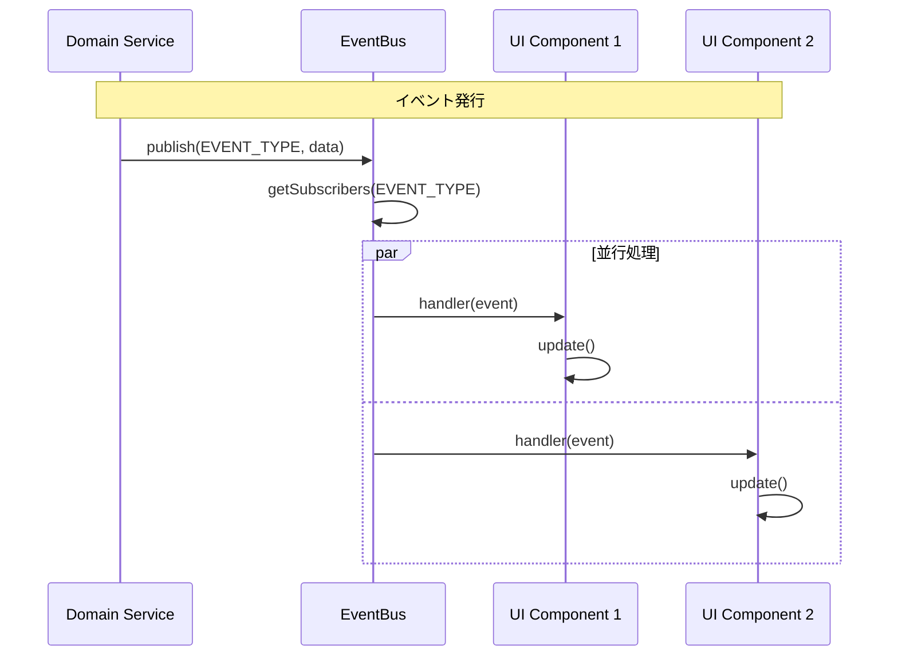
```mermaid
sequenceDiagram
    participant Service as Domain Service
    participant EventBus
    participant UI1 as UI Component 1
    participant UI2 as UI Component 2

    Note over Service,UI2: イベント発行

    Service->>EventBus: publish(EVENT_TYPE, data)
    EventBus->>EventBus: getSubscribers(EVENT_TYPE)

    par 並行処理
        EventBus->>UI1: handler(event)
        UI1->>UI1: update()
    and
        EventBus->>UI2: handler(event)
        UI2->>UI2: update()
    end
```

---

## 6. データ永続化フロー 🟡

### 6.1 セーブフロー

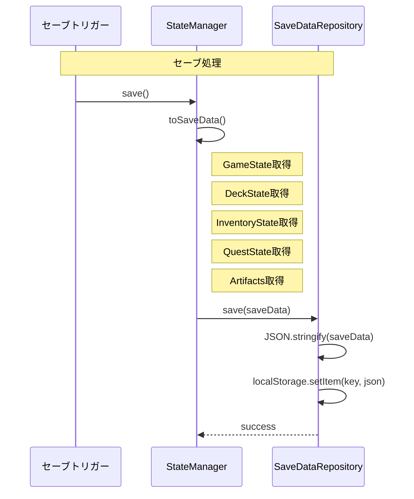
```mermaid
sequenceDiagram
    participant Trigger as セーブトリガー
    participant SM as StateManager
    participant SDR as SaveDataRepository

    Note over Trigger,SDR: セーブ処理

    Trigger->>SM: save()
    SM->>SM: toSaveData()

    Note right of SM: GameState取得
    Note right of SM: DeckState取得
    Note right of SM: InventoryState取得
    Note right of SM: QuestState取得
    Note right of SM: Artifacts取得

    SM->>SDR: save(saveData)
    SDR->>SDR: JSON.stringify(saveData)
    SDR->>SDR: localStorage.setItem(key, json)
    SDR-->>SM: success
```

### 6.2 ロードフロー

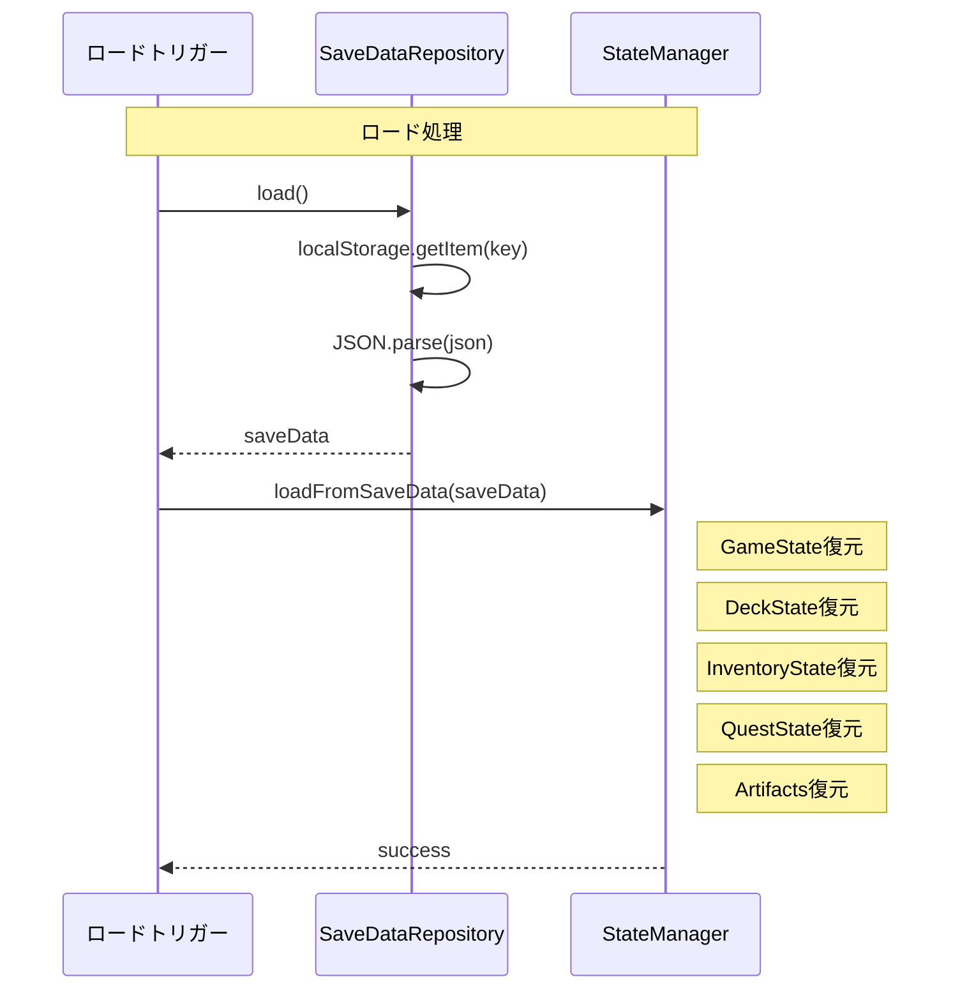
```mermaid
sequenceDiagram
    participant Trigger as ロードトリガー
    participant SDR as SaveDataRepository
    participant SM as StateManager

    Note over Trigger,SM: ロード処理

    Trigger->>SDR: load()
    SDR->>SDR: localStorage.getItem(key)
    SDR->>SDR: JSON.parse(json)
    SDR-->>Trigger: saveData

    Trigger->>SM: loadFromSaveData(saveData)

    Note right of SM: GameState復元
    Note right of SM: DeckState復元
    Note right of SM: InventoryState復元
    Note right of SM: QuestState復元
    Note right of SM: Artifacts復元

    SM-->>Trigger: success
```

---

## 7. マスターデータ読み込みフロー 🟡

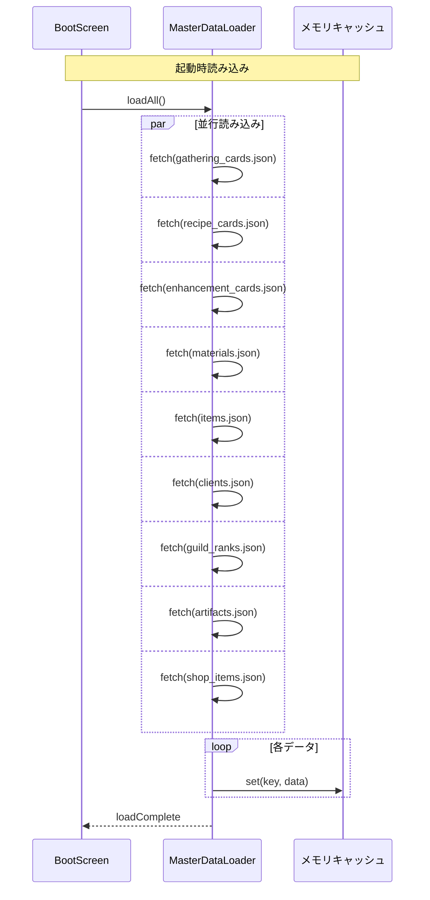
```mermaid
sequenceDiagram
    participant Boot as BootScreen
    participant MDL as MasterDataLoader
    participant Cache as メモリキャッシュ

    Note over Boot,Cache: 起動時読み込み

    Boot->>MDL: loadAll()

    par 並行読み込み
        MDL->>MDL: fetch(gathering_cards.json)
    and
        MDL->>MDL: fetch(recipe_cards.json)
    and
        MDL->>MDL: fetch(enhancement_cards.json)
    and
        MDL->>MDL: fetch(materials.json)
    and
        MDL->>MDL: fetch(items.json)
    and
        MDL->>MDL: fetch(clients.json)
    and
        MDL->>MDL: fetch(guild_ranks.json)
    and
        MDL->>MDL: fetch(artifacts.json)
    and
        MDL->>MDL: fetch(shop_items.json)
    end

    loop 各データ
        MDL->>Cache: set(key, data)
    end

    MDL-->>Boot: loadComplete
```

---

## 8. システム間通信パターン 🟡

### 8.1 同期通信（メソッド呼び出し）

```mermaid
flowchart LR
    subgraph "呼び出し元"
        PM[PhaseManager]
    end

    subgraph "呼び出し先"
        GS[GatheringService]
        AS[AlchemyService]
        QS[QuestService]
    end

    PM -->|gather()| GS
    PM -->|craft()| AS
    PM -->|deliver()| QS

    GS -->|return| PM
    AS -->|return| PM
    QS -->|return| PM
```

### 8.2 非同期通信（イベント）

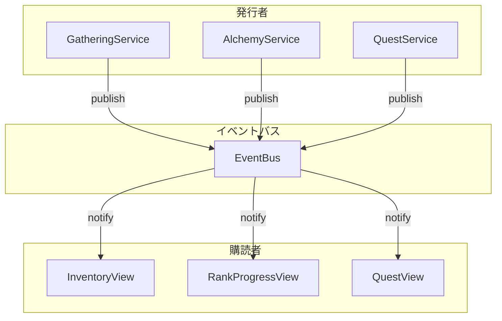
```mermaid
flowchart TB
    subgraph "発行者"
        GS[GatheringService]
        AS[AlchemyService]
        QS[QuestService]
    end

    subgraph "イベントバス"
        EB[EventBus]
    end

    subgraph "購読者"
        IV[InventoryView]
        RPV[RankProgressView]
        QV[QuestView]
    end

    GS -->|publish| EB
    AS -->|publish| EB
    QS -->|publish| EB

    EB -->|notify| IV
    EB -->|notify| RPV
    EB -->|notify| QV
```

---

## 関連文書

- **要件定義書**: [../../spec/atelier-guild-rank-requirements.md](../../spec/atelier-guild-rank-requirements.md)
- **アーキテクチャ設計書**: [architecture.md](architecture.md)
- **コアシステム設計書**: [core-systems.md](core-systems.md)
- **データスキーマ設計書**: [data-schema.md](data-schema.md)

---

## 変更履歴

| 日付 | バージョン | 変更内容 |
|------|----------|---------|
| 2026-01-01 | 1.0.0 | 初版作成 |
| 2026-01-01 | 1.1.0 | 採取・調合フェーズのシーケンス図にMaterialServiceを追加 |
