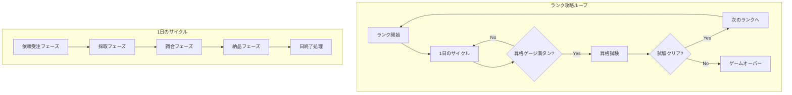
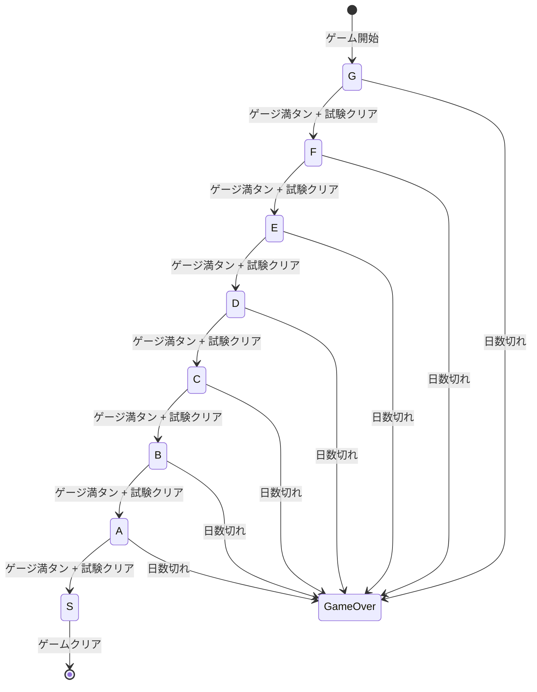
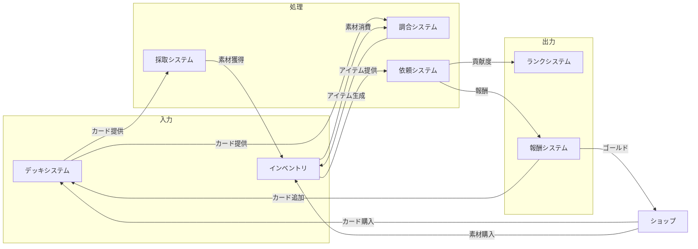

# ゲームメカニクス設計書

**バージョン**: 1.3.0
**作成日**: 2026-01-01
**更新日**: 2026-02-22
**対象**: アトリエ錬金術ゲーム（ギルドランク制）HTML版

---

## 概要

本ドキュメントは、ゲームの核となるメカニクス（ルール、計算式、システム相互作用）を定義する。

### 信頼性レベル凡例

- 🔵 **青信号**: 要件定義書に詳細記載
- 🟡 **黄信号**: 要件定義書から妥当な推測
- 🔴 **赤信号**: 要件定義書にない推測

---

## 1. コアゲームループ 🔵

### 1.1 全体構造



### 1.2 フェーズ自由遷移システム 🔵

> **v1.3.0更新**: 固定フェーズ順序からフェーズ自由遷移に変更。
> 詳細は [フェーズ自由遷移要件定義書](../../spec/free-phase-navigation/requirements.md) を参照。

#### 遷移ルール

プレイヤーは依頼受注・採取・調合・納品の4フェーズを**任意の順序で自由に切り替え**できる。

```
┌──────────┐     ┌──────────┐
│ 依頼受注  │◄───►│  採取    │
└────┬─────┘     └────┬─────┘
     │                │
     ▼                ▼
┌──────────┐     ┌──────────┐
│  納品    │◄───►│  調合    │
└──────────┘     └──────────┘

※ 全フェーズ間で双方向遷移可能
※ タブUIによるワンクリック切り替え
```

- フェーズ切り替えはタブUIで即座に実行（REQ-006-03）
- 進行中の操作がない場合は即座に切り替え（REQ-001-02）
- 旧「次へ」ボタンは廃止（タブ切り替えで代替）

#### 日終了

- **明示的日終了**: 「日終了」ボタンで残りAPを破棄して次の日へ（REQ-004）
- **自動日進行**: AP消費が上限を超過した場合、自動的に日を進行（REQ-003）
  - 超過分は翌日のAPから差し引き（例: AP4消費→翌日AP = 3 - 1 = 2）

#### 1日のゲームループ（自由遷移版）

```
┌───────────────────────────────────────────────────────────────────┐
│                     1日のループ（自由遷移版）                       │
├───────────────────────────────────────────────────────────────────┤
│                                                                   │
│  ┌─────────────────────────────────────────────────────────┐      │
│  │               タブUI（自由切り替え）                      │      │
│  │  [依頼受注] [採取] [調合] [納品]  [日終了] [休憩]         │      │
│  └────────┬────────┬────────┬────────┬──────────────────────┘      │
│           ▼        ▼        ▼        ▼                            │
│  ┌────────────┐ ┌────────────┐ ┌────────────┐ ┌────────────┐     │
│  │ 依頼受注    │ │ 採取       │ │ 調合       │ │ 納品       │     │
│  │ コスト: 0   │ │ 場所選択   │ │ コスト:1~2 │ │ コスト: 0  │     │
│  │            │ │ →ドラフト  │ │            │ │            │     │
│  │ 掲示板+    │ │ 採取       │ │ レシピ選択 │ │ 完成品→   │     │
│  │ 訪問依頼   │ │ コスト:    │ │ →アイテム  │ │ 依頼者に   │     │
│  │            │ │ 基本+追加  │ │ 調合       │ │ 納品       │     │
│  └────────────┘ └────────────┘ └────────────┘ └────────────┘     │
│           │              │             │            │             │
│           └──────────────┴─────────────┴────────────┘             │
│                          ▼                                        │
│                  ┌────────────┐                                    │
│                  │ AP超過?    │──Yes──→ 自動日進行                  │
│                  │            │         (翌日AP = 3 - 超過分)       │
│                  └─────┬──────┘                                    │
│                        │ No                                       │
│                        ▼                                          │
│              「日終了」ボタン押下                                    │
│                        ▼                                          │
│                  ┌────────────┐                                    │
│                  │ 日終了処理  │                                    │
│                  │ - 依頼期限-1│                                    │
│                  │ - 手札補充  │                                    │
│                  │ - AP回復   │                                    │
│                  │ - ランク判定│                                    │
│                  └────────────┘                                    │
└───────────────────────────────────────────────────────────────────┘
```

### 1.3 行動ポイントシステム 🔵

| 項目 | 値 |
|------|-----|
| 1日の行動ポイント | 3 |
| 採取フェーズでの消費 | 基本コスト + 追加コスト（下記参照） |
| 調合フェーズでの消費 | 1〜2（レシピのコストによる） |
| 買い物での消費 | 1 |

**共有行動ポイント**: 採取と調合で同じ行動ポイントを共有する。

### 1.4 ドラフト採取システム 🔵

採取地カードを使用すると、ドラフト形式で素材を選んで獲得できる。

#### ドラフト採取の流れ

```
1. 採取地カードを選択
   ↓
2. 素材プールから3つの素材がランダム提示
   ↓
3. 1つ選ぶ or スキップ（何も選ばない）
   ↓
4. 「続ける」→ 2に戻る（提示回数上限まで）
   「終わる」→ 採取終了、コスト計算
   ↓
5. 基本コスト＋追加コストを消費して素材獲得
```

#### 採取地カード一覧 🔵

| 採取地 | 基本コスト | 提示回数 | 素材プール | レア出現率 |
|--------|-----------|---------|-----------|-----------|
| **裏庭** | 0 | 2回 | 雑草、水 | 0% |
| **近くの森** | 0 | 3回 | 薬草、キノコ、木材、清水 | 10% |
| **川辺** | 0 | 3回 | 魚、水草、砂、清水 | 10% |
| **山麓の岩場** | 1 | 4回 | 鉱石、石、レア鉱石 | 15% |
| **奥地の洞窟** | 1 | 4回 | レア苔、鉱石、魔法素材 | 20% |
| **火山地帯** | 2 | 5回 | 火山石、灰、溶岩石 | 25% |
| **古代遺跡** | 2 | 5回 | 魔法素材、古代の欠片 | 30% |

#### 採取コスト計算 🔵

**採取コスト = 基本コスト（採取地の距離） + 追加コスト（選択個数）**

| 選択個数 | 追加コスト | 追加日数 | 備考 |
|---------|-----------|---------|------|
| 0個（偵察のみ） | 0 | 0 | 何も採らない場合 |
| 1〜2個 | 1 | 0 | 軽い採取 |
| 3〜4個 | 2 | 0 | 普通の採取 |
| 5〜6個 | 3 | 0 | 重い採取 |
| 7個以上 | 3 | +1日 | 大量採取（翌日持越し） |

#### 採取の例

```
【近くの森で採取】（基本コスト0、提示回数3回）

1回目: [薬草(C)] [キノコ(C)] [木材(D)] → 薬草を選択
2回目: [清水(C)] [薬草(B)] [キノコ(D)] → 薬草(B)を選択
3回目: [木材(C)] [清水(C)] [薬草(C)] → 清水を選択

獲得: 薬草(C)、薬草(B)、清水(C)
コスト: 基本0 + 追加2（3個選択） = 2コスト消費
```

---

## 2. 勝敗条件 🔵

### 2.1 勝利条件

| 条件 | 達成方法 |
|------|----------|
| **最終勝利** | Sランク到達（全ランク攻略） |
| **ランククリア** | 昇格ゲージ満タン → 昇格試験クリア |

### 2.2 敗北条件

| 条件 | 発生タイミング |
|------|---------------|
| **ゲームオーバー** | 制限日数を超過 |
| **昇格試験失敗** | 試験期間内に課題未達成 |

### 2.3 ランク進行 🔵



---

## 3. 計算式 🔵

### 3.1 貢献度計算

```
最終貢献度 = 基本貢献度 × 品質補正 × 依頼タイプ補正 × コンボ補正 × アーティファクト補正 × 強化カード補正
```

#### 品質補正 🔵

| 品質 | 補正値 |
|------|--------|
| D | ×0.5 |
| C | ×1.0 |
| B | ×1.5 |
| A | ×2.0 |
| S | ×3.0 |

#### 依頼タイプ補正 🔵

| 依頼タイプ | 補正値 | 説明 |
|-----------|--------|------|
| 具体的指定 | ×1.0 | 特定アイテムを指定 |
| カテゴリ | ×0.8 | カテゴリで指定 |
| 品質条件 | ×1.2 | 品質値で指定 |
| 数量重視 | ×0.7 | 1個あたり |
| 属性条件 | ×1.3 | 属性値で指定 |
| 効果ベース | ×1.3 | 効果で指定 |
| 素材消費 | ×1.5 | 使用素材で指定 |
| 複合条件 | ×1.8 | 複数条件を組み合わせ |

#### コンボ補正（連続依頼達成）🔵

| 連続数 | 補正値 |
|--------|--------|
| 2連続 | ×1.1 |
| 3連続 | ×1.2 |
| 5連続 | ×1.5 |
| 10連続 | ×2.0（フィーバー！） |

#### 依頼者補正 🔵

| 依頼者 | 貢献度補正 | お金補正 | 期限補正 |
|--------|----------|---------|---------|
| 村人 | ×0.8 | ×0.8 | +1日 |
| 冒険者 | ×1.0 | ×1.0 | ±0日 |
| 商人 | ×1.2 | ×1.5 | -1日 |
| 貴族 | ×1.5 | ×2.0 | -2日 |
| ギルド | ×1.3 | ×1.0 | 固定 |

### 3.2 品質計算 🟡

調合時の品質は以下の要素で決定される：

```
最終品質 = 素材平均品質 + 強化カードボーナス + アーティファクトボーナス
```

#### 素材品質から製品品質への変換 🟡

| 素材平均品質 | 製品品質（基本） |
|-------------|-----------------|
| D以下 | D |
| D〜C | C |
| C〜B | B |
| B〜A | A |
| A以上 | S |

### 3.3 効果値計算 🟡

```
最終効果値 = 基本効果値 × (1 + 品質補正率)
```

| 品質 | 効果値補正率 |
|------|-------------|
| D | +0% |
| C | +20% |
| B | +50% |
| A | +100% |
| S | +150% |

---

## 4. 依頼システム 🔵

### 4.1 依頼タイプ判定ロジック

#### 具体的指定
```
条件: item.id === requiredItemId
判定: アイテムIDが完全一致
```

#### カテゴリ
```
条件: item.category === requiredCategory
判定: カテゴリが一致
例: MEDICINE, WEAPON, ADVENTURE, MAGIC
```

#### 品質条件
```
条件: item.quality >= requiredQuality
判定: 品質が条件以上
例: 品質B以上 → A, S も有効
```

#### 数量重視
```
条件: item.category === requiredCategory && totalCount >= requiredQuantity
判定: カテゴリ内で合計数量が条件以上
```

#### 属性条件
```
条件: item.attributes[requiredAttribute] >= requiredValue
判定: 指定属性値が条件以上
例: 火属性10以上
```

#### 効果ベース
```
条件: item.effects[requiredEffect] >= requiredValue
判定: 指定効果値が条件以上
例: HP回復50以上
```

#### 素材消費
```
条件: usedMaterials.filter(m => m.isRare).length >= requiredCount
判定: レア素材使用数が条件以上
```

#### 複合条件
```
条件: condition1 && condition2 [&& condition3...]
判定: すべての条件を満たす
```

### 4.2 報酬カード選択システム 🔵

納品成功時、3枚のカード候補から1枚を選択してデッキに追加できる。

#### カード候補プール

| 枠 | 決定方法 |
|-----|----------|
| 1枚目 | 依頼者タイプに関連するカード |
| 2枚目 | 依頼タイプに関連するカード |
| 3枚目 | 現在のランクで入手可能なカードからランダム |

#### 難易度別レアリティ確率 🔵

| 依頼難易度 | コモン | アンコモン | レア |
|-----------|--------|----------|------|
| 簡単 | 80% | 18% | 2% |
| 普通 | 60% | 35% | 5% |
| 難しい | 40% | 45% | 15% |
| 最難関 | 20% | 50% | 30% |

#### 特別ボーナス 🔵

| 条件 | ボーナス |
|------|---------|
| 品質S納品 | レア枠確定1枚追加（計4枚から選択） |
| 期限-1日で納品 | アンコモン以上確定 |
| コンボ5連続以上 | 選択肢が1枚増加 |

---

## 5. デッキシステム 🔵

### 5.1 デッキ構成

| 項目 | 値 |
|------|-----|
| 初期デッキ枚数 | 15枚 |
| デッキ上限 | 30枚 |
| 手札上限 | 7枚 |
| 初期手札枚数 | 5枚 |

### 5.2 カード系統

| 系統 | 役割 | 使用フェーズ |
|------|------|-------------|
| **採取地カード** | 素材を獲得 | 採取フェーズ |
| **レシピカード** | 素材を消費して調合 | 調合フェーズ |
| **強化カード** | 行動を強化するサポート | 採取/調合/納品フェーズ |

### 5.3 手札補充ルール 🔵

```
日終了時:
  if (手札枚数 < 5):
    draw(5 - 手札枚数)
  if (山札 === 0):
    reshuffleDiscard()
```

### 5.4 休憩アクション 🔵

```
休憩（コスト: 0）:
  discard(手札から2枚選択)
  draw(2)
```

---

## 6. 素材システム 🔵

### 6.1 基本ルール

- 採取で獲得、調合で**永続消費**
- 保管上限: 20枠（アーティファクトで拡張可能）

### 6.2 素材属性

| 属性 | 説明 |
|------|------|
| 火（FIRE） | 攻撃的な素材 |
| 水（WATER） | 回復・支援系素材 |
| 土（EARTH） | 防御・安定系素材 |
| 風（WIND） | 速度・補助系素材 |
| 草（GRASS） | 植物系素材 |

### 6.3 素材品質

| 品質 | 説明 | 入手難易度 |
|------|------|-----------|
| D | 最低品質 | 裏庭など |
| C | 通常品質 | 基本採取地 |
| B | 高品質 | レア確率 |
| A | 最高品質 | 上位採取地 |
| S | 伝説品質 | 特殊条件 |

---

## 7. ランクシステム 🔵

### 7.1 ランク一覧

| ランク | 必要貢献度 | 制限日数 | 特殊ルール |
|--------|-----------|----------|-----------|
| G（見習い） | 100 | 30日 | なし |
| F（新人） | 200 | 30日 | 同時受注2件まで |
| E（一人前） | 350 | 35日 | 品質D以下は貢献度半減 |
| D（中堅） | 500 | 35日 | 全依頼の期限-1日 |
| C（熟練） | 700 | 35日 | 品質C以上でないと受理されない |
| B（上級） | 1000 | 35日 | 品質B以上必須、期限-1日 |
| A（最上級） | 1500 | 35日 | 品質A以上必須、期限-2日 |
| S（伝説） | - | 無制限 | 最終ランク |

### 7.2 昇格試験 🔵

| 試験 | 課題内容 | 制限日数 |
|------|---------|----------|
| G→F | 回復薬×2 | 5日 |
| F→E | 回復薬(B以上)×3、解毒剤×2 | 5日 |
| E→D | 爆弾×2、鋼の剣×1 | 4日 |
| D→C | 指定アイテム3種を同時納品 | 4日 |
| C→B | 全品質B以上で5件達成 | 3日 |
| B→A | 複合レシピ3種納品 | 3日 |
| A→S | 伝説のアイテム製作 | 制限なし |

### 7.3 昇格報酬 🔵

- アーティファクト選択（3つから1つ）
- ボーナスゴールド（50G〜300G）
- 新規カード解放

---

## 8. アーティファクトシステム 🔵

### 8.1 基本ルール

- 永続パッシブ効果を持つアイテム
- 所持上限なし
- ランク昇格後も引き継ぎ

### 8.2 入手方法

| 方法 | 詳細 |
|------|------|
| ランクアップ報酬 | 昇格試験クリア時に3つから1つ選択 |
| ショップ購入 | 高額（300〜500G） |
| 特別依頼報酬 | 難易度の高い依頼をクリア |

### 8.3 レアリティ別出現確率 🔵

| レアリティ | ランクアップ | ショップ | 特別依頼 |
|-----------|------------|---------|---------|
| コモン | 70% | 60% | 30% |
| レア | 25% | 30% | 40% |
| エピック | 5% | 10% | 25% |
| レジェンダリー | 0% | 0% | 5% |

---

## 9. ショップシステム 🔵

### 9.1 ショップ種類

| ショップ | 取扱商品 | 価格帯 |
|---------|---------|--------|
| カードショップ | 採取地・レシピカード | 50〜500G |
| 素材ショップ | 素材 | 10〜100G |
| 強化カードショップ | 強化カード | 80〜200G |
| アーティファクトショップ | アーティファクト | 300〜500G |

### 9.2 買い物コスト 🔵

- 行動ポイント: 1
- どのフェーズでも可能

---

## 10. システム相互作用 🟡

### 10.1 システム間の依存関係



### 10.2 フェーズとシステムの対応

| フェーズ | 主要システム | 入力 | 出力 |
|---------|-------------|------|------|
| 依頼受注 | QuestService | - | 受注依頼リスト |
| 採取 | GatheringService | 採取地カード | 素材 |
| 調合 | AlchemyService | レシピカード, 素材 | アイテム |
| 納品 | QuestService | アイテム | 貢献度, ゴールド, 報酬カード |

---

## 関連文書

- **要件定義書**: [../../spec/atelier-guild-rank-requirements.md](../../spec/atelier-guild-rank-requirements.md)
- **アーキテクチャ設計書**: [architecture.md](architecture.md)
- **データスキーマ設計書**: [data-schema.md](data-schema.md)
- **コアシステム設計書**: [core-systems.md](core-systems.md)
- **バランス設計書**: [balance-design.md](balance-design.md)

---

## 変更履歴

| 日付 | バージョン | 変更内容 |
|------|----------|---------|
| 2026-01-01 | 1.0.0 | 初版作成 |
| 2026-01-01 | 1.1.0 | ドラフト採取システムを追加。採取コスト計算を二段階制（基本コスト+追加コスト）に変更。採取地カード一覧に提示回数・レア出現率を追加。 |
| 2026-01-02 | 1.2.0 | 「ランクHP」を「昇格ゲージ」に表現変更。全体構造図・勝敗条件・ランク進行図・ランク一覧のテーブルヘッダーを更新。 |
