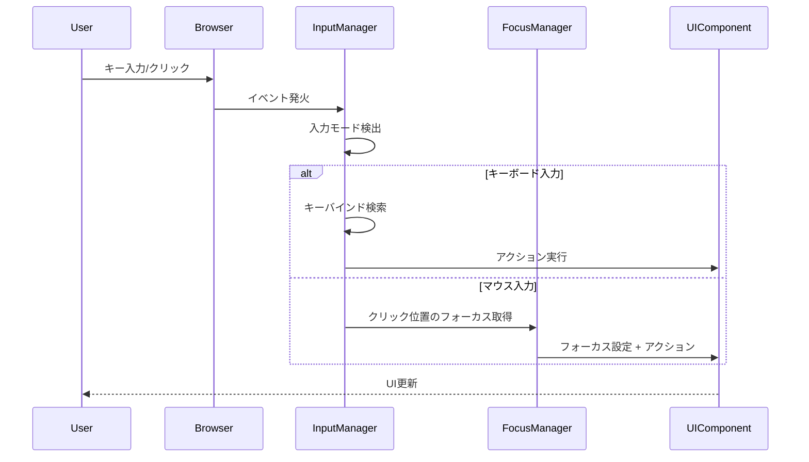

# 入力システム設計

**バージョン**: 1.0.0
**作成日**: 2026-01-01
**対象**: アトリエ錬金術ゲーム（ギルドランク制）HTML版

---

## 概要

本ドキュメントは、ゲームの入力システム設計を定義する。
HTML/ブラウザ環境での入力デバイス対応、キーバインド、入力処理を含む。

### 信頼性レベル凡例

- 🔵 **青信号**: 要件定義書に詳細記載
- 🟡 **黄信号**: 要件定義書から妥当な推測
- 🔴 **赤信号**: 要件定義書にない推測

---

## 1. 対応入力デバイス 🟡

| デバイス | 対応状況 | 優先度 | 備考 |
|----------|----------|--------|------|
| キーボード | 必須 | 高 | メイン入力デバイス |
| マウス | 必須 | 高 | クリック、ホバー操作 |
| タッチスクリーン | オプション | 中 | モバイル対応時 |
| ゲームパッド | オプション | 低 | Gamepad API使用 |

---

## 2. キーボード入力 🟡

### 2.1 グローバルキーバインド

どの画面でも有効なキーバインド。

| キー | アクション | 説明 |
|------|-----------|------|
| `Escape` | キャンセル/戻る | ダイアログ閉じる、前の状態に戻る |
| `F11` | フルスクリーン切替 | ブラウザのフルスクリーンモード |
| `M` | ミュート切替 | BGM/SEのミュート切替 |
| `?` or `F1` | ヘルプ表示 | キーバインド一覧を表示 |

### 2.2 タイトル画面

| キー | アクション | 説明 |
|------|-----------|------|
| `Enter` / `Space` | 決定 | フォーカス中のボタンを押下 |
| `↑` / `↓` | メニュー移動 | ボタン間のフォーカス移動 |
| `N` | 新規ゲーム | 新規ゲーム開始（ショートカット） |
| `C` | コンティニュー | コンティニュー（ショートカット） |

### 2.3 メイン画面

| キー | アクション | 説明 |
|------|-----------|------|
| `1`-`7` | 手札選択 | 対応する位置の手札カードを選択 |
| `Enter` / `Space` | 決定/使用 | 選択中のカードを使用/決定 |
| `R` | 休憩 | 休憩アクション（手札2枚捨てて2枚ドロー） |
| `N` | 次のフェーズ | 次のフェーズへ進む |
| `S` | ショップ | ショップ画面を開く |
| `I` | インベントリ | インベントリ詳細を表示 |
| `Q` | 依頼一覧 | 受注中の依頼一覧を表示 |
| `D` | デッキ確認 | デッキ内容を確認 |
| `Tab` | フォーカス移動 | UI要素間のフォーカス移動 |
| `←` / `→` | 手札間移動 | 手札カード間のフォーカス移動 |

### 2.4 調合フェーズ固有

| キー | アクション | 説明 |
|------|-----------|------|
| `A` | 全素材選択 | 必要な素材を自動選択 |
| `C` | 選択クリア | 素材選択をクリア |

### 2.5 納品フェーズ固有

| キー | アクション | 説明 |
|------|-----------|------|
| `1`-`3` | 報酬カード選択 | 報酬カードダイアログで番号選択 |
| `0` | スキップ | 報酬カードを選ばない |

### 2.6 ショップ画面

| キー | アクション | 説明 |
|------|-----------|------|
| `1`-`4` | カテゴリ切替 | ショップカテゴリを切り替え |
| `←` / `→` / `↑` / `↓` | アイテム移動 | 商品グリッド内の移動 |
| `Enter` / `Space` | 購入 | 選択中の商品を購入 |
| `B` / `Escape` | 戻る | メイン画面へ戻る |

### 2.7 ダイアログ共通

| キー | アクション | 説明 |
|------|-----------|------|
| `Y` | はい | 確認ダイアログで「はい」を選択 |
| `N` | いいえ | 確認ダイアログで「いいえ」を選択 |
| `Escape` | 閉じる | ダイアログを閉じる（キャンセル） |
| `Tab` | フォーカス移動 | ボタン間のフォーカス移動 |

---

## 3. マウス入力 🟡

### 3.1 クリック操作

| 操作 | 対象 | アクション |
|------|------|-----------|
| 左クリック | ボタン | ボタン押下 |
| 左クリック | カード | カード選択/使用 |
| 左クリック | リストアイテム | アイテム選択 |
| 左クリック | 背景 | 選択解除 |
| ダブルクリック | カード | カード即時使用 |
| 右クリック | カード | カード詳細表示 |

### 3.2 ホバー操作

| 操作 | 対象 | アクション |
|------|------|-----------|
| ホバー | ボタン | ホバースタイル適用 |
| ホバー | カード | カード拡大 + ツールチップ |
| ホバー | 素材アイコン | 素材詳細ツールチップ |
| ホバー | 依頼 | 依頼詳細ツールチップ |

### 3.3 ドラッグ&ドロップ

| 操作 | 対象 | アクション |
|------|------|-----------|
| ドラッグ | 手札カード | カードをドラッグ |
| ドロップ | 使用エリア | カードを使用 |
| ドロップ | 素材スロット | 素材を配置（調合時） |

---

## 4. タッチ入力 🔴

モバイル/タブレット対応時の入力設計。

### 4.1 基本操作

| ジェスチャー | アクション |
|-------------|-----------|
| タップ | クリックと同等 |
| 長押し | 右クリックと同等（詳細表示） |
| スワイプ（横） | 手札スクロール |
| スワイプ（縦） | リストスクロール |
| ピンチイン/アウト | 不使用（ブラウザズーム防止） |

### 4.2 UI調整

| 要素 | 調整内容 |
|------|---------|
| ボタン | 最小タップ領域 44x44px |
| カード | タップ領域拡大 |
| リストアイテム | 高さ拡大（60px以上） |

---

## 5. ゲームパッド入力 🔴

Gamepad API を使用したゲームパッド対応。

### 5.1 ボタンマッピング

| ボタン（Xbox/PS/Nintendo） | アクション |
|---------------------------|-----------|
| A / ○ / B | 決定 |
| B / × / A | キャンセル |
| X / □ / Y | 詳細表示 |
| Y / △ / X | ショートカットメニュー |
| LB / L1 / L | 前のカテゴリ |
| RB / R1 / R | 次のカテゴリ |
| Start | ポーズ/メニュー |
| Back / Select | ヘルプ |

### 5.2 スティック/D-Pad

| 入力 | アクション |
|------|-----------|
| 左スティック/D-Pad | フォーカス移動 |
| 右スティック | リストスクロール |

---

## 6. 入力処理アーキテクチャ 🟡

### 6.1 InputManager クラス

```typescript
class InputManager {
  private keyBindings: Map<string, () => void>;
  private currentFocus: IFocusable | null;
  private inputMode: 'keyboard' | 'mouse' | 'touch' | 'gamepad';

  // キーバインド登録
  registerKeyBinding(key: string, action: () => void): void;
  unregisterKeyBinding(key: string): void;

  // フォーカス管理
  setFocus(element: IFocusable): void;
  moveFocus(direction: 'up' | 'down' | 'left' | 'right'): void;
  clearFocus(): void;

  // 入力モード検出
  detectInputMode(event: Event): void;
  getInputMode(): InputMode;

  // イベントハンドラ
  handleKeyDown(event: KeyboardEvent): void;
  handleClick(event: MouseEvent): void;
  handleTouch(event: TouchEvent): void;
  handleGamepadInput(): void;
}
```

### 6.2 フォーカス管理

```typescript
interface IFocusable {
  // フォーカス取得時
  onFocus(): void;
  // フォーカス喪失時
  onBlur(): void;
  // フォーカス時のアクション
  onActivate(): void;
  // フォーカス可能か
  isFocusable(): boolean;
  // フォーカス順序
  getFocusOrder(): number;
}
```

### 6.3 入力イベントフロー



---

## 7. コンテキスト別入力制御 🟡

### 7.1 入力コンテキスト

画面やダイアログの状態に応じて有効な入力が変化する。

| コンテキスト | 有効な入力 | 備考 |
|-------------|-----------|------|
| **タイトル** | メニュー操作のみ | グローバルキー有効 |
| **メイン（通常）** | フルキーバインド | 全操作可能 |
| **メイン（カード選択中）** | カード操作 | 使用/キャンセル |
| **ダイアログ表示中** | ダイアログ操作のみ | 背景操作無効 |
| **ショップ** | ショップ操作 | メイン画面キー無効 |
| **昇格試験中** | メインとほぼ同様 | 一部制限あり |
| **リザルト** | 限定操作のみ | タイトルへ戻るのみ |

### 7.2 入力コンテキスト管理

```typescript
class InputContextManager {
  private contextStack: InputContext[];

  // コンテキストをプッシュ（ダイアログ表示時など）
  pushContext(context: InputContext): void;

  // コンテキストをポップ（ダイアログ閉じる時など）
  popContext(): void;

  // 現在のコンテキストを取得
  getCurrentContext(): InputContext;

  // 入力がコンテキストで許可されているか
  isInputAllowed(inputType: InputType): boolean;
}
```

---

## 8. キーコンフリクト防止 🟡

### 8.1 ブラウザショートカット対策

| ブラウザキー | 対策 |
|-------------|------|
| `F5` | リロード防止（event.preventDefault） |
| `Ctrl+R` | リロード防止 |
| `Ctrl+S` | 保存ダイアログ防止 |
| `Ctrl+P` | 印刷ダイアログ防止 |
| `Tab` | フォーカス移動をカスタム処理 |

### 8.2 実装

```typescript
document.addEventListener('keydown', (e) => {
  // ブラウザショートカット防止
  if (e.key === 'F5' ||
      (e.ctrlKey && ['r', 's', 'p'].includes(e.key.toLowerCase()))) {
    e.preventDefault();
  }
});
```

---

## 9. 入力フィードバック 🟡

### 9.1 視覚フィードバック

| 入力 | フィードバック |
|------|---------------|
| ボタン押下 | 押下アニメーション |
| カード選択 | ハイライト + 拡大 |
| フォーカス移動 | フォーカスリング表示 |
| 無効な操作 | シェイクアニメーション |

### 9.2 音声フィードバック

| 入力 | サウンド |
|------|---------|
| 決定 | 決定音 |
| キャンセル | キャンセル音 |
| フォーカス移動 | カーソル移動音 |
| 無効な操作 | エラー音 |

---

## 10. アクセシビリティ 🟡

### 10.1 キーボードナビゲーション

- すべてのインタラクティブ要素にキーボードでアクセス可能
- 論理的なフォーカス順序（Tab順）
- 明確なフォーカス表示（アウトライン）

### 10.2 フォーカストラップ

ダイアログ表示中は、フォーカスがダイアログ内に閉じ込められる。

```typescript
class FocusTrap {
  private firstFocusable: HTMLElement;
  private lastFocusable: HTMLElement;

  trap(container: HTMLElement): void {
    const focusables = container.querySelectorAll(
      'button, [href], input, select, textarea, [tabindex]:not([tabindex="-1"])'
    );
    this.firstFocusable = focusables[0] as HTMLElement;
    this.lastFocusable = focusables[focusables.length - 1] as HTMLElement;

    container.addEventListener('keydown', this.handleTab.bind(this));
  }

  private handleTab(e: KeyboardEvent): void {
    if (e.key !== 'Tab') return;

    if (e.shiftKey) {
      if (document.activeElement === this.firstFocusable) {
        e.preventDefault();
        this.lastFocusable.focus();
      }
    } else {
      if (document.activeElement === this.lastFocusable) {
        e.preventDefault();
        this.firstFocusable.focus();
      }
    }
  }
}
```

### 10.3 キーボードショートカット一覧

ゲーム内でいつでも確認できるヘルプ画面を提供：

```
┌─────────────────────────────────────────────────────────────┐
│                    キーボードショートカット                  │
├─────────────────────────────────────────────────────────────┤
│ 【共通】                                                    │
│  Escape      キャンセル/戻る                                │
│  Enter/Space 決定                                           │
│  ?/F1        このヘルプを表示                               │
│                                                             │
│ 【メイン画面】                                              │
│  1-7         手札のカードを選択                             │
│  R           休憩（手札入れ替え）                           │
│  N           次のフェーズへ                                 │
│  S           ショップを開く                                 │
│                                                             │
│ 【その他】                                                  │
│  M           ミュート切替                                   │
│  F11         フルスクリーン切替                             │
│                                                             │
│                        [閉じる]                             │
└─────────────────────────────────────────────────────────────┘
```

---

## 11. 入力設定（カスタマイズ） 🔴

将来的な拡張として、キーバインドのカスタマイズ機能を検討。

| 設定項目 | デフォルト | カスタマイズ可 |
|---------|-----------|---------------|
| 決定キー | Enter/Space | ○ |
| キャンセルキー | Escape | ○ |
| 手札選択キー | 1-7 | △（将来対応） |
| ショートカットキー | 各種 | △（将来対応） |

---

## 関連文書

- **UI設計概要**: [overview.md](overview.md)
- **各画面設計**: [screens/](screens/)
- **アーキテクチャ設計書**: [../architecture.md](../architecture.md)

---

## 変更履歴

| 日付 | バージョン | 変更内容 |
|------|----------|---------|
| 2026-01-01 | 1.0.0 | 初版作成 |
