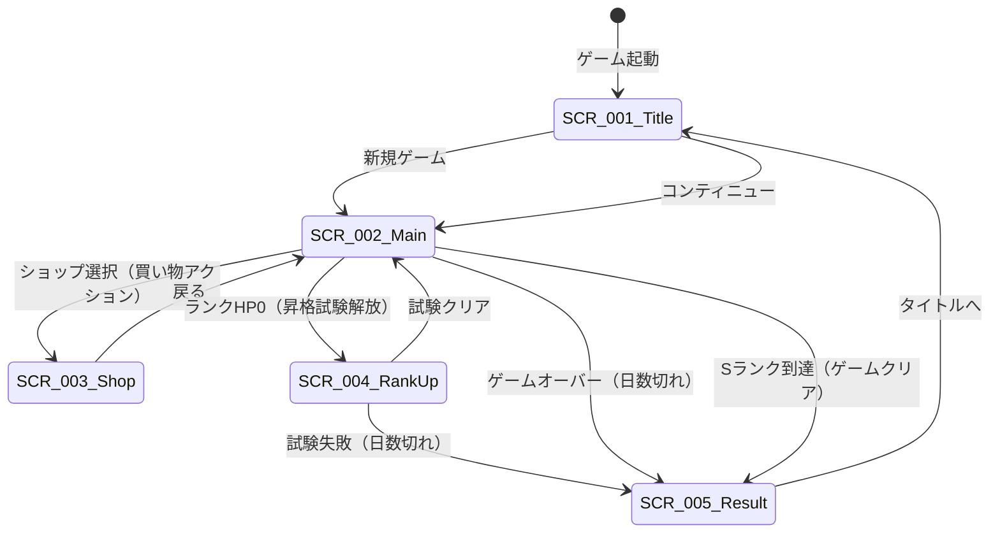
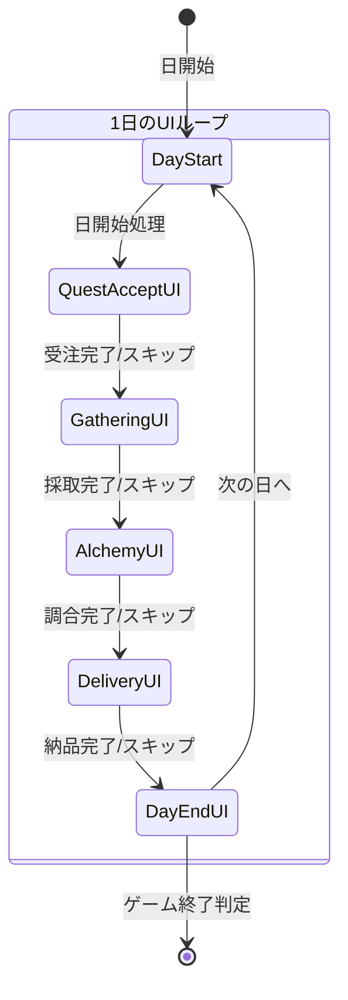

# UI設計概要

**バージョン**: 1.0.0
**作成日**: 2026-01-01
**対象**: アトリエ錬金術ゲーム（ギルドランク制）HTML版

---

## 概要

本ドキュメントは、ゲームのUI設計の概要を定義する。
画面一覧、画面遷移、共通UIコンポーネント、デザイン規約を含む。

### 信頼性レベル凡例

- 🔵 **青信号**: 要件定義書に詳細記載
- 🟡 **黄信号**: 要件定義書から妥当な推測
- 🔴 **赤信号**: 要件定義書にない推測

---

## 1. 画面一覧 🔵

| 画面ID | 画面名 | 説明 | 詳細ファイル |
|--------|--------|------|-------------|
| SCR-001 | タイトル画面 | ゲーム起動時の初期画面 | [title.md](screens/title.md) |
| SCR-002 | メイン画面 | メインゲームプレイ（4フェーズ） | [main.md](screens/main.md) |
| SCR-003 | ショップ画面 | カード・素材・アーティファクト購入 | [shop.md](screens/shop.md) |
| SCR-004 | 昇格試験画面 | 昇格試験の課題表示・進行 | [rank-up.md](screens/rank-up.md) |
| SCR-005 | リザルト画面 | ゲーム終了時の結果表示 | [result.md](screens/result.md) |

---

## 2. 画面遷移図 🔵



---

## 3. メイン画面のフェーズUI遷移 🔵

メイン画面内で、1日のフェーズに応じてUIが切り替わる。



### フェーズ別UI概要 🔵

| フェーズ | UI状態 | 主要操作 |
|---------|--------|----------|
| **依頼受注** | 依頼者・依頼一覧表示 | 依頼確認、受注/断る |
| **採取** | 手札（採取地カード）表示 | カード選択、強化カード使用 |
| **調合** | 手札（レシピカード）表示 | カード選択、素材選択、強化カード使用 |
| **納品** | 受注依頼・完成アイテム表示 | 納品選択、報酬カード選択 |

---

## 4. 共通UIコンポーネント 🟡

### 4.1 ボタン

| 種類 | 用途 | スタイル |
|------|------|----------|
| **プライマリボタン** | 確定アクション（決定、開始、納品） | 背景色: プライマリカラー、白文字 |
| **セカンダリボタン** | キャンセル、戻る、スキップ | 背景色: 透明、枠線: グレー |
| **危険ボタン** | 削除、破棄など不可逆アクション | 背景色: エラーカラー、白文字 |
| **無効ボタン** | 条件未達で押せない状態 | 背景色: グレー、グレー文字、カーソル: not-allowed |

### 4.2 カード表示

| 種類 | 表示内容 | 視覚的特徴 |
|------|---------|-----------|
| **採取地カード** | 名前、コスト、獲得素材 | 緑系の背景 |
| **レシピカード** | 名前、コスト、必要素材、完成品 | 青系の背景 |
| **強化カード** | 名前、効果説明、対象行動 | 紫系の背景 |
| **報酬カード候補** | 名前、レアリティ、効果 | レアリティに応じた枠色 |

### 4.3 ダイアログ

| 種類 | 用途 | ボタン構成 |
|------|------|-----------|
| **確認ダイアログ** | ユーザーの意思確認 | はい / いいえ |
| **情報ダイアログ** | 情報提示 | 閉じる |
| **エラーダイアログ** | エラー表示と対処法 | OK |
| **選択ダイアログ** | 複数選択肢から選択 | 選択肢ボタン群 |
| **報酬カード選択ダイアログ** | 納品後の報酬カード選択 | 3枚のカード + スキップ |

### 4.4 プログレスバー

| 種類 | 用途 |
|------|------|
| **ランクHPバー** | 現在ランクのHP残量表示 |
| **日数バー** | 残り日数の視覚化（警告色対応） |

### 4.5 インジケーター

| 種類 | 用途 |
|------|------|
| **フェーズインジケーター** | 現在のフェーズを4段階で表示 |
| **行動ポイント表示** | 残り行動ポイント（3個のアイコン） |
| **コンボカウンター** | 連続依頼達成数 |

### 4.6 リスト表示

| 種類 | 用途 |
|------|------|
| **依頼リスト** | 受注中の依頼一覧 |
| **素材リスト** | インベントリ内の素材一覧 |
| **アイテムリスト** | 完成品一覧 |
| **ショップアイテムリスト** | 購入可能アイテム一覧 |

### 4.7 トランジション

| 種類 | 用途 | 時間 |
|------|------|------|
| **フェードイン/アウト** | 画面遷移時 | 0.3s |
| **スライドイン/アウト** | サブ画面・ダイアログ表示 | 0.2s |
| **フェーズ切り替え** | フェーズ遷移時の演出 | 0.5s |

---

## 5. デザイン規約 🟡

### 5.1 カラーパレット

| 用途 | カラーコード | 説明 |
|------|-------------|------|
| **プライマリ** | #8B4513 | 茶色（錬金術の雰囲気） |
| **セカンダリ** | #DAA520 | ゴールド（報酬・達成感） |
| **背景（メイン）** | #F5F5DC | ベージュ（羊皮紙風） |
| **背景（カード）** | #FFF8DC | コーンシルク |
| **テキスト（通常）** | #333333 | 濃いグレー |
| **テキスト（補助）** | #666666 | グレー |
| **成功** | #228B22 | フォレストグリーン |
| **警告** | #FFD700 | ゴールド |
| **エラー** | #B22222 | ファイアブリック |
| **採取地カード** | #90EE90 | ライトグリーン |
| **レシピカード** | #87CEEB | スカイブルー |
| **強化カード** | #DDA0DD | プラム |

### 5.2 レアリティカラー

| レアリティ | 枠色 | 背景グラデーション |
|-----------|------|-------------------|
| **コモン** | #808080 | なし |
| **アンコモン** | #32CD32 | 緑系グラデーション |
| **レア** | #4169E1 | 青系グラデーション |
| **エピック** | #9932CC | 紫系グラデーション |
| **レジェンダリー** | #FFD700 | 金系グラデーション |

### 5.3 品質カラー

| 品質 | 表示色 |
|------|--------|
| **D** | #808080（グレー） |
| **C** | #FFFFFF（白） |
| **B** | #32CD32（緑） |
| **A** | #4169E1（青） |
| **S** | #FFD700（金） |

### 5.4 フォント設定

| 用途 | フォント | サイズ | ウェイト |
|------|---------|--------|---------|
| **見出し（大）** | 游ゴシック, sans-serif | 24px | Bold |
| **見出し（中）** | 游ゴシック, sans-serif | 20px | Bold |
| **見出し（小）** | 游ゴシック, sans-serif | 16px | Bold |
| **本文** | 游ゴシック, sans-serif | 14px | Regular |
| **キャプション** | 游ゴシック, sans-serif | 12px | Regular |
| **数値** | 'Courier New', monospace | 16px | Bold |

### 5.5 余白・間隔

| 名称 | 値 | 用途 |
|------|-----|------|
| **xs** | 4px | 極小間隔（アイコン間など） |
| **sm** | 8px | 小間隔（要素内パディング） |
| **md** | 16px | 標準間隔（カード間、セクション内） |
| **lg** | 24px | 大間隔（セクション間） |
| **xl** | 32px | 極大間隔（画面の余白） |

### 5.6 角丸

| 用途 | 値 |
|------|-----|
| **ボタン** | 4px |
| **カード** | 8px |
| **ダイアログ** | 12px |
| **入力フィールド** | 4px |

### 5.7 シャドウ

| 用途 | 値 |
|------|-----|
| **カード（通常）** | 0 2px 4px rgba(0,0,0,0.1) |
| **カード（ホバー）** | 0 4px 8px rgba(0,0,0,0.15) |
| **ダイアログ** | 0 8px 16px rgba(0,0,0,0.2) |
| **ボタン（押下）** | inset 0 2px 4px rgba(0,0,0,0.1) |

---

## 6. レスポンシブ対応 🟡

### 6.1 ブレークポイント

| 名称 | 幅 | 対象デバイス |
|------|-----|-------------|
| **mobile** | 〜599px | スマートフォン |
| **tablet** | 600px〜1023px | タブレット |
| **desktop** | 1024px〜 | デスクトップ |

### 6.2 レイアウト調整

| 画面要素 | mobile | tablet | desktop |
|---------|--------|--------|---------|
| **手札表示** | 横スクロール | 5枚横並び | 7枚横並び |
| **カードサイズ** | 80x120px | 100x150px | 120x180px |
| **サイドバー** | 非表示（ハンバーガー） | 縮小表示 | フル表示 |
| **ダイアログ幅** | 90% | 70% | 500px固定 |

---

## 7. アクセシビリティ 🟡

### 7.1 キーボード操作

- すべてのインタラクティブ要素にフォーカス可能
- Tabキーでフォーカス移動
- Enter/Spaceで選択・決定
- Escapeでキャンセル・閉じる

### 7.2 フォーカス表示

- フォーカス時に2pxのアウトライン表示
- アウトライン色: #4169E1（青）

### 7.3 コントラスト比

- テキストと背景のコントラスト比: 4.5:1以上
- 大きなテキスト: 3:1以上

### 7.4 アニメーション

- `prefers-reduced-motion` メディアクエリ対応
- アニメーション無効設定時は即時表示

---

## 8. 状態表示ガイドライン 🟡

### 8.1 日数残量による表示変化

| 残り日数 | 表示スタイル |
|---------|-------------|
| **11日以上** | 通常表示 |
| **6〜10日** | 黄色警告 + アイコン |
| **1〜5日** | 赤色危険 + 点滅アニメーション |

### 8.2 行動ポイント残量

| 残りポイント | 表示スタイル |
|-------------|-------------|
| **3** | 全アイコン点灯 |
| **2** | 2アイコン点灯 |
| **1** | 1アイコン点灯 + 警告色 |
| **0** | 全アイコン消灯 + グレーアウト |

### 8.3 インベントリ残量

| 使用率 | 表示スタイル |
|--------|-------------|
| **0〜79%** | 通常表示 |
| **80〜99%** | 黄色警告 |
| **100%** | 赤色 + 満杯アイコン |

---

## 9. UIコンポーネント一覧 🟡

### 9.1 Presentationレイヤーのコンポーネント

| コンポーネント | ファイル | 責務 |
|--------------|---------|------|
| ScreenManager | ScreenManager.ts | 画面遷移管理 |
| TitleScreen | TitleScreen.ts | タイトル画面 |
| MainScreen | MainScreen.ts | メインゲーム画面 |
| ShopScreen | ShopScreen.ts | ショップ画面 |
| RankUpScreen | RankUpScreen.ts | 昇格試験画面 |
| ResultScreen | ResultScreen.ts | リザルト画面 |

### 9.2 共通コンポーネント

| コンポーネント | 責務 |
|--------------|------|
| CardView | カード表示（採取地/レシピ/強化） |
| HandView | 手札表示エリア |
| DeckView | 山札・捨て札表示 |
| MaterialView | 素材表示 |
| InventoryView | インベントリ表示 |
| QuestView | 依頼表示 |
| ClientView | 依頼者表示 |
| RankProgressView | ランク進捗バー |
| PhaseIndicator | 現在フェーズ表示 |
| ActionPointView | 行動ポイント表示 |
| GoldView | 所持金表示 |
| DayCounter | 残り日数表示 |
| DialogView | モーダルダイアログ |
| ButtonComponent | ボタン |
| RewardCardSelector | 報酬カード選択UI |
| ComboCounter | コンボカウンター |

---

## 10. 画面レイアウト概要 🟡

### 10.1 メイン画面の基本レイアウト

```
┌─────────────────────────────────────────────────────────────┐
│ ヘッダー: ランク | HP | 日数 | ゴールド | 行動ポイント      │
├─────────────────────────────────────────────────────────────┤
│                                                             │
│  ┌─────────────┐     ┌───────────────────────────────────┐ │
│  │             │     │                                   │ │
│  │  サイドバー │     │         メインコンテンツ          │ │
│  │  ・依頼一覧 │     │         （フェーズに応じて変化）   │ │
│  │  ・インベン │     │                                   │ │
│  │   トリ     │     │                                   │ │
│  │             │     │                                   │ │
│  └─────────────┘     └───────────────────────────────────┘ │
│                                                             │
├─────────────────────────────────────────────────────────────┤
│ フッター: フェーズインジケーター | 手札 | アクションボタン  │
└─────────────────────────────────────────────────────────────┘
```

### 10.2 各画面の詳細

各画面の詳細設計は以下のドキュメントを参照:

- [タイトル画面](screens/title.md)
- [メイン画面](screens/main.md)
- [ショップ画面](screens/shop.md)
- [昇格試験画面](screens/rank-up.md)
- [リザルト画面](screens/result.md)

---

## 関連文書

- **要件定義書**: [../../spec/atelier-guild-rank-requirements.md](../../spec/atelier-guild-rank-requirements.md)
- **アーキテクチャ設計書**: [../architecture.md](../architecture.md)
- **入力システム設計書**: [input-system.md](input-system.md)

---

## 変更履歴

| 日付 | バージョン | 変更内容 |
|------|----------|---------|
| 2026-01-01 | 1.0.0 | 初版作成 |
