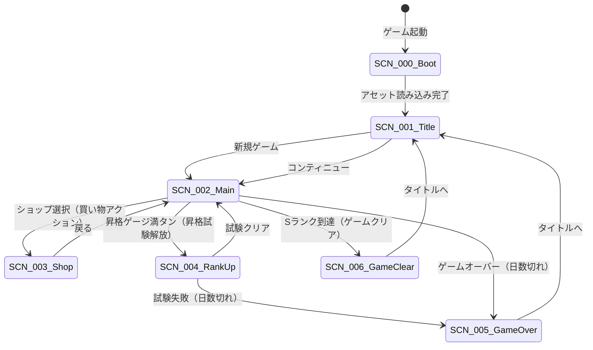
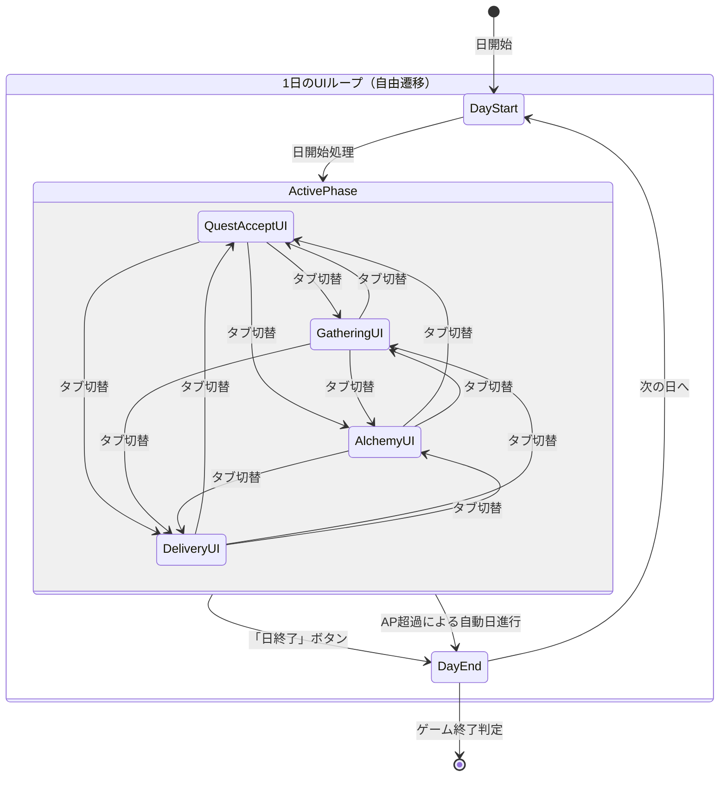
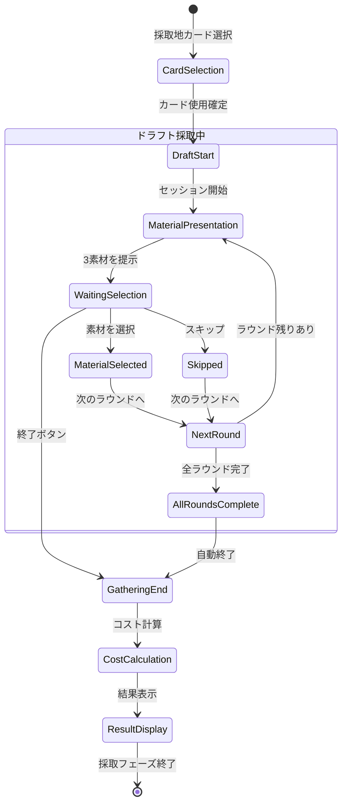

# UI設計概要

**バージョン**: 2.0.0
**作成日**: 2026-01-01
**更新日**: 2026-01-14
**対象**: アトリエ錬金術ゲーム（ギルドランク制）HTML版 / Phaser版統合

---

## 概要

本ドキュメントは、ゲームのUI設計の概要を定義する。
画面一覧、画面遷移、共通UIコンポーネント、デザイン規約を含む。

### 技術スタック対応

本ドキュメントは以下の実装に対応する：
- **HTML版**: TypeScript + Vite（`atelier-guild-rank-html/`）
- **Phaser版**: Phaser 3 + rexUI + TypeScript

### 信頼性レベル凡例

- 🔵 **青信号**: 要件定義書に詳細記載
- 🟡 **黄信号**: 要件定義書から妥当な推測
- 🔴 **赤信号**: 要件定義書にない推測

---

## 1. 画面（シーン）一覧 🔵

### 1.1 Phaser版シーン一覧

Phaserでは画面を「シーン」として管理する。

| シーンID | シーン名 | クラス名 | 説明 | 詳細ファイル |
|---------|---------|---------|------|-------------|
| SCN-000 | ブートシーン | BootScene | アセット読み込み | [boot.md](screens/boot.md) |
| SCN-001 | タイトルシーン | TitleScene | ゲーム起動時の初期画面 | [title.md](screens/title.md) |
| SCN-002 | メインシーン | MainScene | メインゲームプレイ（4フェーズ） | [main.md](screens/main.md) |
| SCN-003 | ショップシーン | ShopScene | カード・素材・アーティファクト購入 | [shop.md](screens/shop.md) |
| SCN-004 | 昇格試験シーン | RankUpScene | 昇格試験の課題表示・進行 | [rank-up.md](screens/rank-up.md) |
| SCN-005 | ゲームオーバーシーン | GameOverScene | ゲームオーバー時の結果表示 | [game-over.md](screens/game-over.md) |
| SCN-006 | ゲームクリアシーン | GameClearScene | Sランク到達時のクリア表示 | [game-clear.md](screens/game-clear.md) |

### 1.2 HTML版画面一覧（参考）

| 画面ID | 画面名 | 説明 |
|--------|--------|------|
| SCR-001 | タイトル画面 | ゲーム起動時の初期画面 |
| SCR-002 | メイン画面 | メインゲームプレイ（4フェーズ） |
| SCR-003 | ショップ画面 | カード・素材・アーティファクト購入 |
| SCR-004 | 昇格試験画面 | 昇格試験の課題表示・進行 |
| SCR-005 | リザルト画面 | ゲーム終了時の結果表示 |

---

## 2. シーン遷移図 🔵



---

## 3. メインシーンのフェーズUI遷移 🔵

> **v2.1.0更新**: フェーズ自由遷移システムに対応。固定順序の一方向フローからタブUIによる自由遷移に変更。
> 詳細は [フェーズ自由遷移要件定義書](../../spec/free-phase-navigation/requirements.md) を参照。

メインシーン内で、タブUIにより4フェーズを自由に切り替えられる。



### フェーズ別UI概要 🔵

| フェーズ | UIコンテナ | rexUIコンポーネント | 主要操作 |
|---------|----------|-------------------|----------|
| **依頼受注** | QuestAcceptContainer | ScrollablePanel, Buttons | 掲示板＋訪問依頼、受注/断る |
| **採取** | GatheringContainer | GridButtons, MapView | 場所選択→ドラフト採取 |
| **調合** | AlchemyContainer | GridButtons, Buttons | カード選択、素材選択、強化カード使用 |
| **納品** | DeliveryContainer | ScrollablePanel, Buttons | 納品選択、報酬カード選択 |

---

## 4. Phaserシーン構成 🟡

### 4.1 シーンのライフサイクル

```typescript
// 各シーンの基本構造
class ExampleScene extends Phaser.Scene {
    // 1. アセットキーの登録
    preload(): void { }

    // 2. GameObjectの生成
    create(): void { }

    // 3. フレーム更新（必要な場合のみ）
    update(time: number, delta: number): void { }

    // 4. 後片付け
    shutdown(): void { }
}
```

### 4.2 UIレイヤー構成

各シーンでは以下のレイヤー順序でUIを配置する：

| レイヤー | 深度(depth) | 内容 |
|---------|------------|------|
| **Background** | 0 | 背景画像・パターン |
| **Content** | 100 | メインコンテンツ（カード、リスト等） |
| **Sidebar** | 150 | サイドバー（依頼一覧、インベントリ） |
| **Header/Footer** | 200 | ヘッダー・フッター固定UI |
| **Overlay** | 300 | オーバーレイ・ダイアログ背景 |
| **Dialog** | 400 | モーダルダイアログ |
| **Toast** | 500 | 通知メッセージ |

---

## 5. 共通UIコンポーネント 🟡

### 5.1 ボタン

#### rexUIボタン（Phaser版）

rexUIの`Buttons`および`GridButtons`を使用。

| 種類 | rexUIコンポーネント | 用途 | スタイル |
|------|-------------------|------|----------|
| **プライマリボタン** | Label + RoundRectangle | 確定アクション | 背景色: プライマリカラー、白文字 |
| **セカンダリボタン** | Label + RoundRectangle | キャンセル、戻る | 背景色: 透明、枠線: グレー |
| **危険ボタン** | Label + RoundRectangle | 削除、破棄 | 背景色: エラーカラー、白文字 |
| **無効ボタン** | Label + RoundRectangle | 条件未達 | 背景色: グレー、グレー文字 |

```typescript
// ボタン生成例
const button = scene.rexUI.add.label({
    background: scene.rexUI.add.roundRectangle(0, 0, 0, 0, 8, 0x8B4513),
    text: scene.add.text(0, 0, 'ボタン', { fontSize: '16px', color: '#ffffff' }),
    space: { left: 16, right: 16, top: 8, bottom: 8 }
});
```

#### HTML版ボタン（参考）

| 種類 | 用途 | スタイル |
|------|------|----------|
| **プライマリボタン** | 確定アクション（決定、開始、納品） | 背景色: プライマリカラー、白文字 |
| **セカンダリボタン** | キャンセル、戻る、スキップ | 背景色: 透明、枠線: グレー |
| **危険ボタン** | 削除、破棄など不可逆アクション | 背景色: エラーカラー、白文字 |
| **無効ボタン** | 条件未達で押せない状態 | 背景色: グレー、グレー文字、カーソル: not-allowed |

### 5.2 カード表示

#### Phaser版カード

カードはPhaser GameObjectとして実装し、rexUIのContainerを使用して配置。

| 種類 | 表示内容 | 視覚的特徴 |
|------|---------|-----------|
| **採取地カード** | 名前、コスト、獲得素材 | 緑系の背景（#90EE90 / 0x90EE90） |
| **レシピカード** | 名前、コスト、必要素材、完成品 | 青系の背景（#87CEEB / 0x87CEEB） |
| **強化カード** | 名前、効果説明、対象行動 | 紫系の背景（#DDA0DD / 0xDDA0DD） |
| **報酬カード候補** | 名前、レアリティ、効果 | レアリティに応じた枠色 |

```typescript
// カードコンポーネント構造
class CardView extends Phaser.GameObjects.Container {
    private background: Phaser.GameObjects.Rectangle;
    private nameText: Phaser.GameObjects.Text;
    private costText: Phaser.GameObjects.Text;
    private iconImage: Phaser.GameObjects.Image;
    // ...
}
```

#### HTML版カード（参考）

Clean Architectureに基づくコンポーネント構造を使用。

### 5.3 ダイアログ

#### rexUIダイアログ（Phaser版）

rexUIの`Dialog`コンポーネントを使用。

| 種類 | 用途 | ボタン構成 |
|------|------|-----------|
| **確認ダイアログ** | ユーザーの意思確認 | はい / いいえ |
| **情報ダイアログ** | 情報提示 | 閉じる |
| **エラーダイアログ** | エラー表示と対処法 | OK |
| **選択ダイアログ** | 複数選択肢から選択 | 選択肢ボタン群 |
| **報酬カード選択ダイアログ** | 納品後の報酬カード選択 | 3枚のカード + スキップ |

```typescript
// ダイアログ生成例
const dialog = scene.rexUI.add.dialog({
    x: 640, y: 360,
    background: scene.rexUI.add.roundRectangle(0, 0, 0, 0, 12, 0xF5F5DC),
    title: createLabel(scene, 'タイトル'),
    content: createLabel(scene, 'メッセージ内容'),
    actions: [
        createButton(scene, 'はい'),
        createButton(scene, 'いいえ')
    ],
    space: { title: 24, content: 24, action: 16 }
})
.layout()
.popUp(300);
```

### 5.4 プログレスバー

#### rexUIプログレスバー（Phaser版）

rexUIの`ProgressBar`を使用。

| 種類 | 用途 | 特記事項 |
|------|------|---------|
| **昇格ゲージバー** | 現在ランクの昇格進捗表示 | 満タン時にエフェクト |
| **日数バー** | 残り日数の視覚化 | 残り少なくなると色変化 |

```typescript
// プログレスバー生成例
const progressBar = scene.rexUI.add.progressBar({
    width: 200, height: 20,
    barColor: 0xDAA520,
    trackColor: 0x666666,
    trackStrokeColor: 0x333333,
    value: 0.5
});
```

#### HTML版プログレスバー（参考）

| 種類 | 用途 |
|------|------|
| **昇格ゲージバー** | 現在ランクの昇格進捗表示 |
| **日数バー** | 残り日数の視覚化（警告色対応） |

### 5.5 スクロール可能パネル

#### rexUI ScrollablePanel（Phaser版）

rexUIの`ScrollablePanel`を使用。

| 種類 | 用途 |
|------|------|
| **依頼リスト** | 受注中の依頼一覧 |
| **素材リスト** | インベントリ内の素材一覧 |
| **アイテムリスト** | 完成品一覧 |
| **ショップアイテムリスト** | 購入可能アイテム一覧 |

```typescript
// スクロール可能パネル生成例
const panel = scene.rexUI.add.scrollablePanel({
    x: 640, y: 360,
    width: 400, height: 300,
    scrollMode: 0, // 縦スクロール
    panel: {
        child: createContent(scene),
        mask: { padding: 1 }
    },
    slider: {
        track: scene.rexUI.add.roundRectangle(0, 0, 10, 10, 5, 0x666666),
        thumb: scene.rexUI.add.roundRectangle(0, 0, 10, 30, 5, 0xDAA520)
    }
}).layout();
```

#### HTML版リスト表示（参考）

| 種類 | 用途 |
|------|------|
| **依頼リスト** | 受注中の依頼一覧 |
| **素材リスト** | インベントリ内の素材一覧 |
| **アイテムリスト** | 完成品一覧 |
| **ショップアイテムリスト** | 購入可能アイテム一覧 |

### 5.6 グリッドボタン

#### rexUI GridButtons（Phaser版）

rexUIの`GridButtons`を使用（手札、素材選択等）。

```typescript
// グリッドボタン生成例（手札）
const handGrid = scene.rexUI.add.gridButtons({
    x: 640, y: 650,
    width: 800,
    height: 150,
    buttons: createCardButtons(handCards),
    space: { column: 8 }
}).layout();
```

### 5.7 レイアウト（Sizer）

#### rexUI Sizer（Phaser版）

rexUIの`Sizer`を使用して要素を配置。

| Sizer種類 | 用途 |
|----------|------|
| **Sizer** | 縦または横方向の配置 |
| **GridSizer** | グリッド配置 |
| **FixWidthSizer** | 固定幅での折り返し配置 |
| **OverlapSizer** | 重ねて配置 |

```typescript
// 水平Sizer例
const header = scene.rexUI.add.sizer({
    x: 640, y: 30,
    orientation: 'x',
    space: { item: 16 }
})
.add(rankLabel)
.add(gaugeBar)
.add(dayCounter)
.add(goldDisplay)
.layout();
```

### 5.8 インジケーター

| 種類 | 用途 |
|------|------|
| **フェーズインジケーター** | 現在のフェーズを4段階で表示 |
| **行動ポイント表示** | 残り行動ポイント（3個のアイコン） |
| **コンボカウンター** | 連続依頼達成数 |

### 5.9 トランジション

| 種類 | 用途 | 時間 |
|------|------|------|
| **フェードイン/アウト** | 画面遷移時 | 0.3s |
| **スライドイン/アウト** | サブ画面・ダイアログ表示 | 0.2s |
| **フェーズ切り替え** | フェーズ遷移時の演出 | 0.5s |

---

## 6. ドラフト採取UI 🔵

採取フェーズでは、ドラフト形式で素材を選択するUIを表示する。

### 6.1 ドラフト採取画面レイアウト

```
┌─────────────────────────────────────────────────────────────┐
│ ヘッダー: [採取地名] | ラウンド 2/3 | 選択済み: 2個          │
├─────────────────────────────────────────────────────────────┤
│                                                             │
│  ┌───────────────── 素材選択エリア ─────────────────┐      │
│  │                                                   │      │
│  │   ┌─────────┐   ┌─────────┐   ┌─────────┐       │      │
│  │   │         │   │         │   │         │       │      │
│  │   │ 素材1   │   │ 素材2   │   │ 素材3   │       │      │
│  │   │ 薬草(C) │   │キノコ(B)│   │ 木材(D) │       │      │
│  │   │         │   │         │   │         │       │      │
│  │   └─────────┘   └─────────┘   └─────────┘       │      │
│  │     [選択]        [選択]        [選択]           │      │
│  │                                                   │      │
│  │                  [スキップ]                       │      │
│  └───────────────────────────────────────────────────┘      │
│                                                             │
│  ┌───────────────── 選択済み素材 ────────────────────┐     │
│  │ [薬草(C)] [清水(B)]                               │     │
│  └───────────────────────────────────────────────────┘     │
│                                                             │
│  ┌───────────────── コスト表示 ──────────────────────┐     │
│  │ 基本コスト: 0 + 追加コスト: 1 = 合計: 1           │     │
│  │ ※3個以上選択で追加コスト+1                        │     │
│  └───────────────────────────────────────────────────┘     │
│                                                             │
├─────────────────────────────────────────────────────────────┤
│ フッター: [採取を終了] [キャンセル]                         │
└─────────────────────────────────────────────────────────────┘
```

### 6.2 ドラフト採取UIコンポーネント 🔵

| コンポーネント | rexUIコンポーネント | 責務 | 表示内容 |
|--------------|-------------------|------|----------|
| **RoundIndicator** | Label | ラウンド進捗表示 | 「2/3回目」のような進捗表示 |
| **MaterialOptionView** | GridButtons | 素材オプション表示 | 3つの素材カードを横並び表示 |
| **MaterialCard** | Container + Label | 個別素材表示 | 素材名、品質、アイコン |
| **SelectedMaterialsView** | FixWidthSizer | 選択済み素材一覧 | これまでに選んだ素材のリスト |
| **GatheringCostView** | Sizer + Label | コスト計算表示 | 基本+追加=合計のリアルタイム表示 |
| **ExtraDayWarning** | Label | 翌日持越し警告 | 7個以上選択時の警告表示 |

### 6.3 ドラフト採取UIの状態遷移 🔵



---

## 7. デザイン規約 🟡

### 7.1 カラーパレット

| 用途 | カラーコード | Hex値 (Phaser) | 説明 |
|------|-------------|---------------|------|
| **プライマリ** | #8B4513 | 0x8B4513 | 茶色（錬金術の雰囲気） |
| **セカンダリ** | #DAA520 | 0xDAA520 | ゴールド（報酬・達成感） |
| **背景（メイン）** | #F5F5DC | 0xF5F5DC | ベージュ（羊皮紙風） |
| **背景（カード）** | #FFF8DC | 0xFFF8DC | コーンシルク |
| **テキスト（通常）** | #333333 | 0x333333 | 濃いグレー |
| **テキスト（補助）** | #666666 | 0x666666 | グレー |
| **成功** | #228B22 | 0x228B22 | フォレストグリーン |
| **警告** | #FFD700 | 0xFFD700 | ゴールド |
| **エラー** | #B22222 | 0xB22222 | ファイアブリック |
| **採取地カード** | #90EE90 | 0x90EE90 | ライトグリーン |
| **レシピカード** | #87CEEB | 0x87CEEB | スカイブルー |
| **強化カード** | #DDA0DD | 0xDDA0DD | プラム |

### 7.2 レアリティカラー

| レアリティ | 枠色 | Hex値 (Phaser) | 背景グラデーション |
|-----------|------|---------------|--------------------|
| **コモン** | #808080 | 0x808080 | なし |
| **アンコモン** | #32CD32 | 0x32CD32 | 緑系グラデーション |
| **レア** | #4169E1 | 0x4169E1 | 青系グラデーション |
| **エピック** | #9932CC | 0x9932CC | 紫系グラデーション |
| **レジェンダリー** | #FFD700 | 0xFFD700 | 金系グラデーション |

### 7.3 品質カラー

| 品質 | 表示色 | Hex値 (Phaser) |
|------|--------|---------------|
| **D** | #808080 | 0x808080（グレー） |
| **C** | #FFFFFF | 0xFFFFFF（白） |
| **B** | #32CD32 | 0x32CD32（緑） |
| **A** | #4169E1 | 0x4169E1（青） |
| **S** | #FFD700 | 0xFFD700（金） |

### 7.4 フォント設定

#### Phaser版フォント設定

Phaserではビットマップフォントまたはウェブフォントを使用。

| 用途 | フォントファミリー | サイズ | スタイル |
|------|------------------|--------|---------|
| **見出し（大）** | 'M PLUS Rounded 1c' | 24px | Bold |
| **見出し（中）** | 'M PLUS Rounded 1c' | 20px | Bold |
| **見出し（小）** | 'M PLUS Rounded 1c' | 16px | Bold |
| **本文** | 'M PLUS Rounded 1c' | 14px | Regular |
| **キャプション** | 'M PLUS Rounded 1c' | 12px | Regular |
| **数値** | 'RobotoMono' | 16px | Bold |

```typescript
// テキストスタイル定義
const TextStyles = {
    heading1: { fontFamily: '"M PLUS Rounded 1c", sans-serif', fontSize: '24px', fontStyle: 'bold', color: '#333333' },
    heading2: { fontFamily: '"M PLUS Rounded 1c", sans-serif', fontSize: '20px', fontStyle: 'bold', color: '#333333' },
    heading3: { fontFamily: '"M PLUS Rounded 1c", sans-serif', fontSize: '16px', fontStyle: 'bold', color: '#333333' },
    body: { fontFamily: '"M PLUS Rounded 1c", sans-serif', fontSize: '14px', color: '#333333' },
    caption: { fontFamily: '"M PLUS Rounded 1c", sans-serif', fontSize: '12px', color: '#666666' },
    number: { fontFamily: 'RobotoMono', fontSize: '16px', fontStyle: 'bold', color: '#333333' }
};
```

#### HTML版フォント設定（参考）

| 用途 | フォント | サイズ | ウェイト |
|------|---------|--------|---------|
| **見出し（大）** | 游ゴシック, sans-serif | 24px | Bold |
| **見出し（中）** | 游ゴシック, sans-serif | 20px | Bold |
| **見出し（小）** | 游ゴシック, sans-serif | 16px | Bold |
| **本文** | 游ゴシック, sans-serif | 14px | Regular |
| **キャプション** | 游ゴシック, sans-serif | 12px | Regular |
| **数値** | 'Courier New', monospace | 16px | Bold |

### 7.5 余白・間隔（スペーシング）

| 名称 | 値 | 用途 |
|------|-----|------|
| **xs** | 4 / 4px | 極小間隔（アイコン間など） |
| **sm** | 8 / 8px | 小間隔（要素内パディング） |
| **md** | 16 / 16px | 標準間隔（カード間、セクション内） |
| **lg** | 24 / 24px | 大間隔（セクション間） |
| **xl** | 32 / 32px | 極大間隔（画面の余白） |

### 7.6 角丸

| 用途 | 値 |
|------|-----|
| **ボタン** | 4 / 4px |
| **カード** | 8 / 8px |
| **ダイアログ** | 12 / 12px |
| **入力フィールド** | 4 / 4px |

### 7.7 シャドウ（HTML版）

| 用途 | 値 |
|------|-----|
| **カード（通常）** | 0 2px 4px rgba(0,0,0,0.1) |
| **カード（ホバー）** | 0 4px 8px rgba(0,0,0,0.15) |
| **ダイアログ** | 0 8px 16px rgba(0,0,0,0.2) |
| **ボタン（押下）** | inset 0 2px 4px rgba(0,0,0,0.1) |

---

## 8. アニメーション・トランジション 🟡

### 8.1 Tweenアニメーション（Phaser版）

Phaserの`Tweens`を使用してアニメーションを実装。

| アニメーション | 用途 | 設定 |
|--------------|------|------|
| **フェードイン** | シーン遷移時 | alpha: 0→1, duration: 300 |
| **フェードアウト** | シーン遷移時 | alpha: 1→0, duration: 300 |
| **スライドイン** | ダイアログ表示 | y: -100→center, duration: 200, ease: 'Back.easeOut' |
| **ポップアップ** | カード選択時 | scale: 0.8→1, duration: 150, ease: 'Back.easeOut' |
| **シェイク** | エラー時 | x: ±10, duration: 50, repeat: 3 |
| **パルス** | 注目要素 | scale: 1→1.1→1, duration: 500, repeat: -1 |

```typescript
// フェードインアニメーション例
scene.tweens.add({
    targets: gameObject,
    alpha: { from: 0, to: 1 },
    duration: 300,
    ease: 'Power2'
});
```

### 8.2 シーン遷移（Phaser版）

```typescript
// シーン遷移例
scene.cameras.main.fadeOut(300, 0, 0, 0);
scene.cameras.main.once('camerafadeoutcomplete', () => {
    scene.scene.start('NextScene');
});
```

### 8.3 パーティクルエフェクト（Phaser版）

| エフェクト | 用途 |
|----------|------|
| **キラキラ** | レアカード獲得時 |
| **昇格演出** | ランクアップ時 |
| **成功演出** | 依頼完了時 |

---

## 9. 入力システム 🟡

### 9.1 マウス/タッチ入力（Phaser版）

Phaserの`Input`システムを使用。

| イベント | 用途 |
|---------|------|
| **pointerdown** | クリック/タップ開始 |
| **pointerup** | クリック/タップ終了 |
| **pointerover** | ホバー開始 |
| **pointerout** | ホバー終了 |
| **drag** | ドラッグ操作 |

### 9.2 キーボード入力

| キー | 機能 |
|-----|------|
| **Enter/Space** | 選択・決定 |
| **Escape** | キャンセル・閉じる |
| **Tab** | フォーカス移動 |
| **Arrow Keys** | リスト内移動 |
| **1-9** | ショートカット選択 |

```typescript
// キーボード入力設定例（Phaser版）
scene.input.keyboard?.on('keydown-ENTER', () => {
    // 決定処理
});

scene.input.keyboard?.on('keydown-ESC', () => {
    // キャンセル処理
});
```

---

## 10. 状態表示ガイドライン 🟡

### 10.1 日数残量による表示変化

| 残り日数 | 表示スタイル | Tween効果 (Phaser) | アニメーション (HTML) |
|---------|-------------|-------------------|---------------------|
| **11日以上** | 通常表示（白） | なし | 通常表示 |
| **6〜10日** | 黄色警告 + アイコン | なし | 黄色警告 + アイコン |
| **1〜5日** | 赤色危険 | パルスアニメーション | 赤色危険 + 点滅アニメーション |

### 10.2 行動ポイント残量

| 残りポイント | 表示スタイル |
|-------------|-------------|
| **3** | 全アイコン点灯（白） |
| **2** | 2アイコン点灯 |
| **1** | 1アイコン点灯 + 警告色（オレンジ） |
| **0** | 全アイコングレーアウト |

### 10.3 インベントリ残量

| 使用率 | 表示スタイル |
|--------|-------------|
| **0〜79%** | 通常表示 |
| **80〜99%** | 黄色警告 + テキスト警告 |
| **100%** | 赤色 + 満杯アイコン + 警告表示 |

---

## 11. UIコンポーネント一覧 🟡

### 11.1 シーンクラス（Phaser版）

| シーン | ファイル | 責務 |
|-------|---------|------|
| BootScene | src/game/scenes/BootScene.ts | アセット読み込み |
| TitleScene | src/game/scenes/TitleScene.ts | タイトル画面 |
| MainScene | src/game/scenes/MainScene.ts | メインゲーム画面 |
| ShopScene | src/game/scenes/ShopScene.ts | ショップ画面 |
| RankUpScene | src/game/scenes/RankUpScene.ts | 昇格試験画面 |
| GameOverScene | src/game/scenes/GameOverScene.ts | ゲームオーバー画面 |
| GameClearScene | src/game/scenes/GameClearScene.ts | ゲームクリア画面 |

### 11.2 UIコンポーネント（Phaser版）

| コンポーネント | ファイル | 責務 |
|--------------|---------|------|
| CardView | src/game/ui/CardView.ts | カード表示（採取地/レシピ/強化） |
| HandContainer | src/game/ui/HandContainer.ts | 手札表示エリア |
| DeckView | src/game/ui/DeckView.ts | 山札・捨て札表示 |
| MaterialView | src/game/ui/MaterialView.ts | 素材表示 |
| InventoryPanel | src/game/ui/InventoryPanel.ts | インベントリ表示 |
| QuestPanel | src/game/ui/QuestPanel.ts | 依頼表示 |
| ClientView | src/game/ui/ClientView.ts | 依頼者表示 |
| RankProgressBar | src/game/ui/RankProgressBar.ts | ランク進捗バー |
| PhaseIndicator | src/game/ui/PhaseIndicator.ts | 現在フェーズ表示 |
| ActionPointView | src/game/ui/ActionPointView.ts | 行動ポイント表示 |
| GoldView | src/game/ui/GoldView.ts | 所持金表示 |
| DayCounter | src/game/ui/DayCounter.ts | 残り日数表示 |
| DialogManager | src/game/ui/DialogManager.ts | モーダルダイアログ管理 |
| ButtonFactory | src/game/ui/ButtonFactory.ts | ボタン生成 |
| RewardCardSelector | src/game/ui/RewardCardSelector.ts | 報酬カード選択UI |
| ComboCounter | src/game/ui/ComboCounter.ts | コンボカウンター |
| ToastManager | src/game/ui/ToastManager.ts | 通知メッセージ |

### 11.3 フェーズ別UIコンテナ（Phaser版）

| コンテナ | ファイル | 責務 |
|--------|---------|------|
| QuestAcceptContainer | src/game/ui/phases/QuestAcceptContainer.ts | 依頼受注フェーズUI |
| GatheringContainer | src/game/ui/phases/GatheringContainer.ts | 採取フェーズUI |
| AlchemyContainer | src/game/ui/phases/AlchemyContainer.ts | 調合フェーズUI |
| DeliveryContainer | src/game/ui/phases/DeliveryContainer.ts | 納品フェーズUI |

### 11.4 Presentationレイヤーのコンポーネント（HTML版参考）

| コンポーネント | ファイル | 責務 |
|--------------|---------|------|
| ScreenManager | ScreenManager.ts | 画面遷移管理 |
| TitleScreen | TitleScreen.ts | タイトル画面 |
| MainScreen | MainScreen.ts | メインゲーム画面 |
| ShopScreen | ShopScreen.ts | ショップ画面 |
| RankUpScreen | RankUpScreen.ts | 昇格試験画面 |
| ResultScreen | ResultScreen.ts | リザルト画面 |

### 11.5 共通コンポーネント（HTML版参考）

| コンポーネント | 責務 |
|--------------|------|
| CardView | カード表示（採取地/レシピ/強化） |
| HandView | 手札表示エリア |
| DeckView | 山札・捨て札表示 |
| MaterialView | 素材表示 |
| InventoryView | インベントリ表示 |
| QuestView | 依頼表示 |
| ClientView | 依頼者表示 |
| RankProgressView | ランク進捗バー |
| PhaseIndicator | 現在フェーズ表示 |
| ActionPointView | 行動ポイント表示 |
| GoldView | 所持金表示 |
| DayCounter | 残り日数表示 |
| DialogView | モーダルダイアログ |
| ButtonComponent | ボタン |
| RewardCardSelector | 報酬カード選択UI |
| ComboCounter | コンボカウンター |

---

## 12. 画面レイアウト概要 🟡

### 12.1 メイン画面/シーンの基本レイアウト

```
┌─────────────────────────────────────────────────────────────┐
│ ヘッダー: ランク | 昇格ゲージ | 日数 | ゴールド | 行動ポイント │
│ (depth: 200)                                                │
├─────────────────────────────────────────────────────────────┤
│                                                             │
│  ┌─────────────┐     ┌───────────────────────────────────┐ │
│  │             │     │                                   │ │
│  │  サイドバー │     │         メインコンテンツ          │ │
│  │  ・依頼一覧 │     │         （フェーズに応じて変化）   │ │
│  │  ・インベン │     │         (depth: 100)              │ │
│  │   トリ     │     │                                   │ │
│  │ (depth:150)│     │                                   │ │
│  └─────────────┘     └───────────────────────────────────┘ │
│                                                             │
├─────────────────────────────────────────────────────────────┤
│ フッター: フェーズインジケーター | 手札 | アクションボタン  │
│ (depth: 200)                                                │
└─────────────────────────────────────────────────────────────┘
```

### 12.2 各画面の詳細

各画面/シーンの詳細設計は以下のドキュメントを参照:

#### Phaser版
- [ブートシーン](screens/boot.md)
- [タイトルシーン](screens/title.md)
- [メインシーン](screens/main.md)
- [ショップシーン](screens/shop.md)
- [昇格試験シーン](screens/rank-up.md)
- [ゲームオーバーシーン](screens/game-over.md)
- [ゲームクリアシーン](screens/game-clear.md)

#### HTML版参考
- [タイトル画面](screens/title.md)
- [メイン画面](screens/main.md)
- [ショップ画面](screens/shop.md)
- [昇格試験画面](screens/rank-up.md)
- [リザルト画面](screens/result.md)

---

## 13. スケーリング対応 🟡

### 13.1 Phaser版スケール設定

Phaserの`Scale Manager`を使用してレスポンシブ対応。

```typescript
const config: Phaser.Types.Core.GameConfig = {
    scale: {
        mode: Phaser.Scale.FIT,
        parent: 'game-container',
        autoCenter: Phaser.Scale.CENTER_BOTH,
        width: 1280,
        height: 720,
        min: { width: 640, height: 360 },
        max: { width: 1920, height: 1080 }
    }
};
```

#### UIの自動調整

- FITモードでアスペクト比を維持しつつ画面にフィット
- UIコンポーネントはカメラの中心座標を基準に配置
- テキストサイズは固定（ゲーム座標系内で統一）

### 13.2 HTML版レスポンシブ対応（参考）

#### ブレークポイント

| 名称 | 幅 | 対象デバイス |
|------|-----|-------------|
| **mobile** | 〜599px | スマートフォン |
| **tablet** | 600px〜1023px | タブレット |
| **desktop** | 1024px〜 | デスクトップ |

#### レイアウト調整

| 画面要素 | mobile | tablet | desktop |
|---------|--------|--------|---------|
| **手札表示** | 横スクロール | 5枚横並び | 7枚横並び |
| **カードサイズ** | 80x120px | 100x150px | 120x180px |
| **サイドバー** | 非表示（ハンバーガー） | 縮小表示 | フル表示 |
| **ダイアログ幅** | 90% | 70% | 500px固定 |

---

## 14. アクセシビリティ 🟡

### 14.1 キーボード操作

- すべてのインタラクティブ要素にフォーカス可能
- Tabキーでフォーカス移動
- Enter/Spaceで選択・決定
- Escapeでキャンセル・閉じる

### 14.2 フォーカス表示（HTML版）

- フォーカス時に2pxのアウトライン表示
- アウトライン色: #4169E1（青）

### 14.3 コントラスト比

- テキストと背景のコントラスト比: 4.5:1以上
- 大きなテキスト: 3:1以上

### 14.4 アニメーション

- `prefers-reduced-motion` メディアクエリ対応（HTML版）
- アニメーション無効設定時は即時表示

---

## 関連文書

- **要件定義書**: [../../spec/atelier-guild-rank-requirements.md](../../spec/atelier-guild-rank-requirements.md)
- **アーキテクチャ設計書（HTML版）**: [../architecture-overview.md](../architecture-overview.md)
- **アーキテクチャ設計書（Phaser版）**: [../atelier-guild-rank-phaser/architecture.md](../atelier-guild-rank-phaser/architecture.md)
- **入力システム設計書**: [input-system.md](input-system.md)

---

## 変更履歴

| 日付 | バージョン | 変更内容 |
|------|----------|---------|
| 2026-01-01 | 1.0.0 | 初版作成（HTML版） |
| 2026-01-01 | 1.1.0 | ドラフト採取UI仕様を追加（HTML版） |
| 2026-01-02 | 1.2.0 | 「ランクHP」から「昇格ゲージ」への用語変更に対応（HTML版） |
| 2026-01-07 | 1.0.0 | 初版作成（Phaser版として新規作成） |
| 2026-01-14 | 2.0.0 | HTML版とPhaser版を統合。Phaser版をベースに両方の情報を包含する統合版を作成 |
