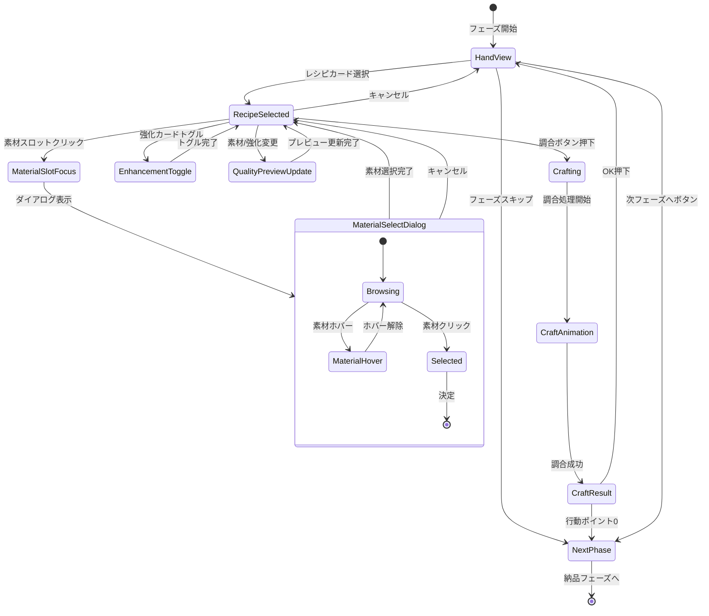

# 調合フェーズ 詳細設計

**バージョン**: 1.0.0
**作成日**: 2026-01-16
**更新日**: 2026-01-16
**フェーズID**: PHASE-003

---

## 1. 概要

### 1.1 基本情報

| 項目 | 値 |
|------|-----|
| **フェーズ名** | 調合フェーズ（Alchemy Phase） |
| **親画面** | メイン画面（SCR-002） |
| **責務** | レシピカードを使用して素材からアイテムを調合 |
| **前フェーズ** | 採取フェーズ |
| **次フェーズ** | 納品フェーズ |

### 1.2 調合システム概要 🔵

レシピカードを使用して、所持している素材を組み合わせてアイテムを作成する。素材の品質が完成品の品質に影響し、強化カードを使用することで品質をさらに向上させることができる。

### 1.3 信頼性レベル

- 🔵 **青信号**: 要件定義書に記載
- 🟡 **黄信号**: 要件定義書から妥当な推測
- 🔴 **赤信号**: 要件定義書にない推測

---

## 2. ワイヤーフレーム 🔵

### 2.1 レシピ選択・素材選択画面

```
┌───────────────────────────────────────────────────────────┐
│                      調合フェーズ                         │
├───────────────────────────────────────────────────────────┤
│                                                           │
│   選択中のレシピ: 回復薬                                  │
│   コスト: ⚡1                                             │
│                                                           │
│   ┌───────────────────────────────────────────────────┐   │
│   │ 必要素材:                                         │   │
│   │  🌿 薬草 ×2  [✓選択済] [✓選択済]                 │   │
│   │  💧 清水 ×1  [✓選択済]                           │   │
│   └───────────────────────────────────────────────────┘   │
│                                                           │
│   ┌───────────────────────────────────────────────────┐   │
│   │ 品質プレビュー: B                                 │   │
│   │ 属性: 水+5                                        │   │
│   │ 効果: HP回復 30                                   │   │
│   └───────────────────────────────────────────────────┘   │
│                                                           │
│   強化カード使用:                                         │
│   [ ] 賢者の触媒（品質+1ランク）                         │
│                                                           │
│              [調合する]    [キャンセル]                   │
│                                                           │
├───────────────────────────────────────────────────────────┤
│              [フェーズをスキップ]                         │
└───────────────────────────────────────────────────────────┘
```

### 2.2 素材選択ダイアログ

```
┌───────────────────────────────────────────────────────────┐
│                  薬草を選択 (1/2)                         │
├───────────────────────────────────────────────────────────┤
│                                                           │
│   所持している薬草:                                       │
│                                                           │
│   ┌─────────┐  ┌─────────┐  ┌─────────┐  ┌─────────┐   │
│   │ 🌿      │  │ 🌿      │  │ 🌿      │  │ 🌿      │   │
│   │ 薬草    │  │ 薬草    │  │ 薬草    │  │ 薬草    │   │
│   │ (C)     │  │ (C)     │  │ (B)     │  │ (A)     │   │
│   │ [選択]  │  │ [選択]  │  │ [選択中]│  │ [選択]  │   │
│   └─────────┘  └─────────┘  └─────────┘  └─────────┘   │
│                                                           │
│   選択中: 薬草(B)                                         │
│   品質影響: 平均品質がCからBに上昇                        │
│                                                           │
│                  [決定]    [キャンセル]                   │
└───────────────────────────────────────────────────────────┘
```

### 2.3 調合成功画面

```
┌───────────────────────────────────────────────────────────┐
│                    調合成功！                             │
├───────────────────────────────────────────────────────────┤
│                                                           │
│                      ✨                                   │
│                   ┌───────┐                               │
│                   │  💊   │                               │
│                   │回復薬 │                               │
│                   │ (B)   │                               │
│                   └───────┘                               │
│                                                           │
│   品質: B                                                 │
│   属性: 水+5                                              │
│   効果: HP回復 30                                         │
│                                                           │
│   消費した素材:                                           │
│     🌿 薬草(C) ×1                                        │
│     🌿 薬草(B) ×1                                        │
│     💧 清水(C) ×1                                        │
│                                                           │
│   消費コスト: ⚡1                                         │
│                                                           │
│                       [OK]                                │
└───────────────────────────────────────────────────────────┘
```

### 2.4 素材不足時の表示

```
┌───────────────────────────────────────────────────────────┐
│                      調合フェーズ                         │
├───────────────────────────────────────────────────────────┤
│                                                           │
│   選択中のレシピ: 万能薬                                  │
│   コスト: ⚡2                                             │
│                                                           │
│   ┌───────────────────────────────────────────────────┐   │
│   │ 必要素材:                                         │   │
│   │  🌿 薬草 ×3  [✓選択済] [✓選択済] [未選択]       │   │
│   │  💎 魔石 ×1  [不足 ❌]                           │   │
│   │  💧 清水 ×2  [✓選択済] [✓選択済]                │   │
│   └───────────────────────────────────────────────────┘   │
│                                                           │
│   ⚠ 素材が不足しています: 魔石が1個必要です             │
│                                                           │
│              [調合する]（非活性）  [キャンセル]           │
│                                                           │
└───────────────────────────────────────────────────────────┘
```

---

## 3. UIコンポーネント詳細 🔵

### 3.1 レシピ詳細パネル (`recipe-detail`)

#### パネル構成

| プロパティ | 値 | 信頼性 |
|-----------|-----|--------|
| **幅** | 500px | 🟡 |
| **背景色** | #FFF3E0 | 🟡 |
| **枠線** | 2px solid #FF9800 | 🟡 |
| **角丸** | 8px | 🟡 |

#### レシピデータ表示

```typescript
interface RecipeDetailProps {
  recipeId: string;
  name: string;              // レシピ名
  cost: number;              // 行動ポイントコスト
  requiredMaterials: RequiredMaterial[];
  resultItem: ItemPreview;
}

interface RequiredMaterial {
  materialType: string;      // 素材種類
  count: number;             // 必要数
  selectedMaterials: Material[]; // 選択済み素材
  availableCount: number;    // 所持数
}

interface ItemPreview {
  name: string;
  baseQuality: Quality;
  calculatedQuality: Quality; // 選択素材に基づく計算品質
  attributes: Attribute[];
  effects: Effect[];
}
```

### 3.2 素材スロット群 (`material-slots`)

#### スロット構成

```
🌿 薬草 ×2  [スロット1] [スロット2]
```

| プロパティ | 値 | 信頼性 |
|-----------|-----|--------|
| **配置** | 垂直方向、素材種類ごとにグループ化 | 🟡 |
| **スロットサイズ** | 60x60px | 🟡 |
| **スロット間隔** | 8px | 🟡 |

#### スロット状態

| 状態 | 表示 | 信頼性 |
|------|------|--------|
| 未選択 | 枠線のみ（点線#CCCCCC）、+ アイコン | 🟡 |
| 選択済み | 素材アイコン + 品質表示 + ✓マーク | 🟡 |
| 不足 | 赤枠線 + ❌アイコン | 🟡 |
| ホバー | 背景ハイライト #FFF8E1 | 🟡 |

#### rexUI実装パターン 🟡

```typescript
// 素材スロット生成
private createMaterialSlots(required: RequiredMaterial): Phaser.GameObjects.Container {
  const container = this.scene.add.container(0, 0);

  // 素材名ラベル
  const label = this.createLabel(`${required.materialType} ×${required.count}`);
  container.add(label);

  // スロット群
  const slotsContainer = this.rexUI.add.sizer({
    orientation: 'x',
    space: { item: 8 },
  });

  for (let i = 0; i < required.count; i++) {
    const slot = this.createMaterialSlot(required, i);
    slotsContainer.add(slot);
  }

  container.add(slotsContainer);
  return container;
}
```

### 3.3 品質プレビューパネル (`quality-preview`)

#### パネル構成

| プロパティ | 値 | 信頼性 |
|-----------|-----|--------|
| **幅** | 400px | 🟡 |
| **背景色** | #E3F2FD | 🟡 |
| **枠線** | 2px solid #2196F3 | 🟡 |

#### 表示内容

```typescript
interface QualityPreviewProps {
  previewQuality: Quality;   // 計算された品質
  qualitySource: string;     // 品質計算の説明
  attributes: { name: string; value: number }[];
  effects: { name: string; description: string }[];
  isComplete: boolean;       // 全素材選択済みか
}
```

#### 品質表示スタイル

| 品質 | 色 | 追加エフェクト | 信頼性 |
|------|-----|--------------|--------|
| C | #9E9E9E（グレー） | なし | 🟡 |
| B | #4CAF50（緑） | なし | 🟡 |
| A | #2196F3（青） | 軽いグロー | 🟡 |
| S | #FFD700（金） | キラキラエフェクト | 🟡 |

### 3.4 強化カードチェックボックス (`enhancement-checkboxes`)

```
強化カード使用:
[✓] 賢者の触媒（品質+1ランク）
[ ] 精霊の祝福（属性値+3）
```

| プロパティ | 値 | 信頼性 |
|-----------|-----|--------|
| **配置** | 品質プレビューの下 | 🟡 |
| **チェックボックスサイズ** | 24x24px | 🟡 |
| **ラベルフォント** | 游ゴシック, 14px | 🟡 |

#### 強化カードデータ

```typescript
interface EnhancementCheckboxProps {
  cardId: string;
  cardName: string;
  effectDescription: string;
  isChecked: boolean;
  isDisabled: boolean;       // 使用条件を満たさない場合
  disabledReason?: string;
}
```

### 3.5 アクションボタン群

#### 調合ボタン (`btn-craft`)

| プロパティ | 値 | 信頼性 |
|-----------|-----|--------|
| **種類** | プライマリボタン | 🔵 |
| **幅** | 140px | 🟡 |
| **高さ** | 48px | 🟡 |
| **背景色（有効時）** | #FF9800 | 🟡 |
| **背景色（無効時）** | #BDBDBD | 🟡 |
| **テキスト** | 「調合する」| 🔵 |

#### 有効条件

```typescript
get canCraft(): boolean {
  return (
    this.allMaterialsSelected &&
    this.hasEnoughActionPoints &&
    !this.isCrafting
  );
}
```

#### キャンセルボタン (`btn-cancel`)

| プロパティ | 値 | 信頼性 |
|-----------|-----|--------|
| **種類** | セカンダリボタン | 🔵 |
| **テキスト** | 「キャンセル」| 🔵 |

---

## 4. 状態遷移 🔵

### 4.1 状態遷移図



### 4.2 状態定義

| 状態 | 説明 | UI表示 |
|------|------|--------|
| `HandView` | 手札表示中、レシピカード選択待ち | 手札カード表示 |
| `RecipeSelected` | レシピ選択済み、素材選択中 | レシピ詳細パネル表示 |
| `MaterialSlotFocus` | 素材スロットにフォーカス | スロットハイライト |
| `MaterialSelectDialog` | 素材選択ダイアログ表示中 | モーダルダイアログ |
| `EnhancementToggle` | 強化カードのオン/オフ切替中 | チェックボックス変化 |
| `QualityPreviewUpdate` | 品質プレビュー更新中 | プレビュー再計算 |
| `Crafting` | 調合処理実行中 | ボタン非活性、処理中表示 |
| `CraftAnimation` | 調合演出再生中 | エフェクト再生 |
| `CraftResult` | 調合結果表示中 | 結果パネル表示 |
| `NextPhase` | 次フェーズへ遷移中 | フェード演出 |

---

## 5. イベント詳細 🔵

### 5.1 入力イベント

| イベント名 | トリガー | 処理内容 | 信頼性 |
|-----------|----------|----------|--------|
| `OnRecipeCardSelected` | レシピカードクリック | レシピ詳細表示 | 🔵 |
| `OnMaterialSlotClicked` | 素材スロットクリック | 素材選択ダイアログ表示 | 🔵 |
| `OnMaterialSelected` | ダイアログで素材選択 | スロットに素材設定、プレビュー更新 | 🔵 |
| `OnEnhancementToggled` | 強化カードチェック | プレビュー更新 | 🔵 |
| `OnCraftClicked` | 調合ボタンクリック | 調合処理実行 | 🔵 |
| `OnCancelClicked` | キャンセルボタン/ESC | レシピ選択解除 | 🔵 |

### 5.2 ビジネスイベント（EventBus）

| イベント名 | ペイロード | 発火タイミング | 信頼性 |
|-----------|-----------|---------------|--------|
| `RECIPE_SELECTED` | `{ recipeId }` | レシピカード選択時 | 🔵 |
| `MATERIAL_SLOT_UPDATED` | `{ slotIndex, materialId }` | 素材スロット更新時 | 🟡 |
| `QUALITY_PREVIEW_CHANGED` | `{ previewQuality, attributes }` | プレビュー変更時 | 🟡 |
| `CRAFT_STARTED` | `{ recipeId, materials, enhancements }` | 調合開始時 | 🔵 |
| `CRAFT_COMPLETED` | `{ itemId, quality, consumedMaterials }` | 調合完了時 | 🔵 |
| `ACTION_POINTS_CONSUMED` | `{ consumed, remaining }` | 行動ポイント消費時 | 🔵 |
| `PHASE_TRANSITION_REQUESTED` | `{ from: 'alchemy', to: 'delivery' }` | 次フェーズボタン押下時 | 🔵 |

### 5.3 品質計算ロジック 🔵

```typescript
// AlchemyService.ts
export class AlchemyService {
  /**
   * 完成品の品質を計算
   * 品質計算式: 選択した素材の品質の平均（四捨五入）
   * 強化カード効果は最後に適用
   */
  calculateQuality(
    selectedMaterials: Material[],
    enhancements: EnhancementCard[]
  ): Quality {
    // 素材品質の平均を計算
    const qualityValues = selectedMaterials.map(m => this.qualityToNumber(m.quality));
    const average = qualityValues.reduce((a, b) => a + b, 0) / qualityValues.length;
    let resultQuality = this.numberToQuality(Math.round(average));

    // 強化カード効果を適用
    for (const enhancement of enhancements) {
      if (enhancement.effectType === 'quality_up') {
        resultQuality = this.upgradeQuality(resultQuality, enhancement.value);
      }
    }

    return resultQuality;
  }

  private qualityToNumber(quality: Quality): number {
    const map = { C: 1, B: 2, A: 3, S: 4 };
    return map[quality];
  }

  private numberToQuality(value: number): Quality {
    if (value <= 1) return 'C';
    if (value <= 2) return 'B';
    if (value <= 3) return 'A';
    return 'S';
  }

  private upgradeQuality(quality: Quality, levels: number): Quality {
    const order: Quality[] = ['C', 'B', 'A', 'S'];
    const currentIndex = order.indexOf(quality);
    const newIndex = Math.min(currentIndex + levels, order.length - 1);
    return order[newIndex];
  }
}
```

### 5.4 イベントハンドラ実装 🟡

```typescript
// AlchemyContainer.ts
export class AlchemyContainer extends BasePhaseContainer {
  private selectedRecipe: Recipe | null = null;
  private materialSlots: Map<number, Material> = new Map();
  private activeEnhancements: Set<string> = new Set();

  private async handleCraft(): Promise<void> {
    if (!this.canCraft) return;

    this.setState('Crafting');

    const materials = Array.from(this.materialSlots.values());
    const enhancements = Array.from(this.activeEnhancements)
      .map(id => this.getEnhancementCard(id));

    this.eventBus.emit('CRAFT_STARTED', {
      recipeId: this.selectedRecipe.id,
      materials: materials.map(m => m.id),
      enhancements: enhancements.map(e => e.id),
    });

    // 調合実行
    const result = await this.craftItemUseCase.execute({
      recipeId: this.selectedRecipe.id,
      materialIds: materials.map(m => m.id),
      enhancementIds: enhancements.map(e => e.id),
    });

    if (result.success) {
      await this.playCraftAnimation(result.item);

      this.eventBus.emit('CRAFT_COMPLETED', {
        itemId: result.item.id,
        quality: result.item.quality,
        consumedMaterials: materials,
      });

      await this.showCraftResult(result.item);
    }

    this.setState('HandView');
  }

  private updateQualityPreview(): void {
    if (!this.selectedRecipe || this.materialSlots.size === 0) {
      this.qualityPreviewPanel.showEmpty();
      return;
    }

    const materials = Array.from(this.materialSlots.values());
    const enhancements = Array.from(this.activeEnhancements)
      .map(id => this.getEnhancementCard(id));

    const previewQuality = this.alchemyService.calculateQuality(
      materials,
      enhancements
    );

    const attributes = this.alchemyService.calculateAttributes(
      this.selectedRecipe,
      materials,
      enhancements
    );

    this.qualityPreviewPanel.update({
      quality: previewQuality,
      attributes,
      isComplete: this.allMaterialsSelected,
    });

    this.eventBus.emit('QUALITY_PREVIEW_CHANGED', {
      previewQuality,
      attributes,
    });
  }
}
```

---

## 6. アニメーション詳細 🟡

### 6.1 レシピ選択アニメーション

| プロパティ | 開始値 | 終了値 | 時間 | イージング |
|-----------|-------|-------|------|-----------|
| カードscale | 1.0 | 1.05 | 150ms | Quad.Out |
| カードy | 0 | -10 | 150ms | Quad.Out |
| パネルalpha | 0 | 1 | 200ms | Quad.Out |
| パネルy | +30 | 0 | 200ms | Back.Out |

### 6.2 素材選択ダイアログアニメーション

| プロパティ | 開始値 | 終了値 | 時間 | イージング |
|-----------|-------|-------|------|-----------|
| オーバーレイalpha | 0 | 0.5 | 200ms | Linear |
| ダイアログscale | 0.9 | 1.0 | 250ms | Back.Out |
| ダイアログalpha | 0 | 1 | 200ms | Quad.Out |

### 6.3 品質プレビュー更新アニメーション

```typescript
private async playQualityUpdateAnimation(
  oldQuality: Quality,
  newQuality: Quality
): Promise<void> {
  // 品質が変化した場合のみアニメーション
  if (oldQuality === newQuality) return;

  const qualityText = this.qualityPreviewPanel.qualityText;

  // パルスエフェクト
  await this.tweens.add({
    targets: qualityText,
    scale: { from: 1.0, to: 1.2 },
    duration: 150,
    ease: 'Quad.Out',
    yoyo: true,
  }).toPromise();

  // 品質アップの場合はキラキラ
  if (this.isQualityUpgrade(oldQuality, newQuality)) {
    this.playSparkleEffect(qualityText.x, qualityText.y);
  }
}
```

### 6.4 調合成功アニメーション

```typescript
private async playCraftAnimation(item: Item): Promise<void> {
  // 1. 素材が中央に集まる
  const slots = this.getMaterialSlotViews();
  const centerX = this.scene.cameras.main.centerX;
  const centerY = this.scene.cameras.main.centerY;

  await Promise.all(
    slots.map(slot =>
      this.tweens.add({
        targets: slot,
        x: centerX,
        y: centerY,
        alpha: 0,
        scale: 0.5,
        duration: 400,
        ease: 'Quad.In',
      }).toPromise()
    )
  );

  // 2. 光のエフェクト
  const light = this.scene.add.sprite(centerX, centerY, 'light-burst');
  light.setScale(0);
  light.setAlpha(0);

  await this.tweens.add({
    targets: light,
    scale: 2,
    alpha: { from: 0, to: 1 },
    duration: 300,
    ease: 'Quad.Out',
  }).toPromise();

  // 3. 完成品出現
  const itemSprite = this.createItemSprite(item);
  itemSprite.setScale(0);

  await Promise.all([
    this.tweens.add({
      targets: light,
      alpha: 0,
      duration: 200,
    }).toPromise(),
    this.tweens.add({
      targets: itemSprite,
      scale: { from: 0, to: 1 },
      duration: 400,
      ease: 'Back.Out',
    }).toPromise(),
  ]);

  // 4. 品質に応じた追加エフェクト
  if (item.quality === 'S') {
    this.playRainbowEffect(centerX, centerY);
  } else if (item.quality === 'A') {
    this.playSparkleEffect(centerX, centerY);
  }

  // 5. SE再生
  this.scene.sound.play('craft-success', {
    volume: 0.5,
  });
}
```

### 6.5 調合失敗/キャンセルアニメーション

| プロパティ | 開始値 | 終了値 | 時間 | イージング |
|-----------|-------|-------|------|-----------|
| パネルalpha | 1.0 | 0 | 200ms | Quad.In |
| パネルy | 0 | +20 | 200ms | Quad.In |

---

## 7. データモデル 🔵

### 7.1 レシピデータ

```typescript
interface Recipe {
  id: string;
  name: string;
  cost: number;              // 行動ポイントコスト
  requiredMaterials: {
    materialType: string;    // 素材種類
    count: number;           // 必要数
  }[];
  resultItemId: string;      // 完成品ID
  baseQuality: Quality;      // 基本品質
  tags: string[];            // タグ（薬、武器、etc.）
  category: string;          // カテゴリ
}
```

### 7.2 調合セッションデータ

```typescript
interface AlchemySession {
  recipeId: string;
  materialSlots: {
    index: number;
    requiredType: string;
    selectedMaterial: Material | null;
  }[];
  activeEnhancements: string[];
  previewQuality: Quality;
  previewAttributes: Attribute[];
  canCraft: boolean;
}
```

### 7.3 調合結果データ

```typescript
interface CraftResult {
  success: boolean;
  item?: Item;
  consumedMaterials: Material[];
  consumedEnhancements: string[];
  consumedActionPoints: number;
  errorMessage?: string;
}
```

---

## 8. アクセシビリティ 🟡

### 8.1 キーボード操作

| キー | 動作 | 信頼性 |
|------|------|--------|
| `Tab` | 素材スロット間のフォーカス移動 | 🟡 |
| `Enter` | 選択中スロットの素材選択ダイアログを開く / 調合実行 | 🟡 |
| `Space` | 強化カードのトグル | 🟡 |
| `Escape` | ダイアログ閉じる / キャンセル | 🟡 |
| `C` | 調合実行（ショートカット） | 🟡 |

### 8.2 フォーカス順序

1. レシピ情報エリア
2. 素材スロット群（上から下、左から右）
3. 品質プレビューパネル
4. 強化カードチェックボックス群
5. 調合ボタン
6. キャンセルボタン

### 8.3 スクリーンリーダー対応

```typescript
// 品質プレビュー更新時の読み上げ
this.qualityPreviewPanel.setAccessibility({
  role: 'status',
  live: 'polite',
  label: `品質プレビュー: ${previewQuality}。${effectDescription}`,
});
```

---

## 9. エラーハンドリング 🟡

### 9.1 エラーケース

| エラー | 原因 | 対処 |
|--------|------|------|
| 素材不足 | 必要な素材が足りない | スロットに❌表示、調合ボタン非活性 |
| 行動ポイント不足 | 調合に必要なポイントがない | 調合ボタン非活性 + 警告表示 |
| 保管枠不足 | 完成品を保管する枠がない | 警告ダイアログ表示 |
| 調合処理エラー | サーバーエラー等 | Toast表示「調合に失敗しました」 |

### 9.2 素材不足時の表示

```typescript
// 不足している素材があるスロットの表示
private renderInsufficientSlot(
  slot: MaterialSlot,
  available: number,
  required: number
): void {
  slot.setStyle({
    borderColor: '#F44336',
    borderWidth: 2,
  });

  slot.setIcon('❌');
  slot.setTooltip(`不足: ${required - available}個必要`);
}
```

---

## 10. パフォーマンス考慮 🟡

### 10.1 最適化ポイント

| 項目 | 対策 |
|------|------|
| 品質計算 | 変更があった時のみ再計算 |
| ダイアログ表示 | 遅延読み込み、必要時のみ生成 |
| エフェクト | パーティクルプール使用 |
| 素材一覧 | 仮想スクロール（大量素材対応） |

### 10.2 目標パフォーマンス

| 指標 | 目標値 |
|------|--------|
| 品質プレビュー更新 | < 50ms |
| ダイアログ表示 | < 200ms |
| 調合演出完了 | < 1500ms |
| メモリ使用量 | < 12MB（フェーズ単体） |

---

## 関連文書

- **メイン画面概要**: [main.md](./main.md)
- **共通コンポーネント**: [common-components.md](./common-components.md)
- **ゲームメカニクス（調合）**: [../../game-mechanics.md](../../game-mechanics.md)
- **データフロー設計**: [../../dataflow.md](../../dataflow.md)

---

## 変更履歴

| 日付 | バージョン | 変更内容 |
|------|----------|---------|
| 2026-01-16 | 1.0.0 | main.mdから分割、詳細化 |
