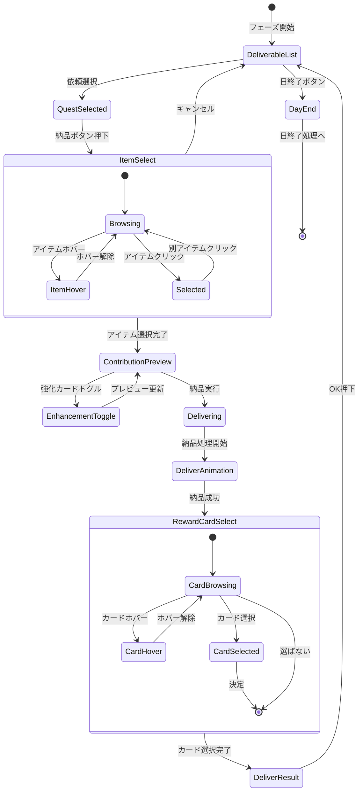

# 納品フェーズ 詳細設計

**バージョン**: 1.0.0
**作成日**: 2026-01-16
**更新日**: 2026-01-16
**フェーズID**: PHASE-004

---

## 1. 概要

### 1.1 基本情報

| 項目 | 値 |
|------|-----|
| **フェーズ名** | 納品フェーズ（Delivery Phase） |
| **親画面** | メイン画面（SCR-002） |
| **責務** | 完成品を依頼者に納品し、報酬（貢献度・お金・報酬カード）を獲得 |
| **前フェーズ** | 調合フェーズ |
| **次フェーズ** | 日終了処理 → 次の日 / ゲーム終了判定 |

### 1.2 納品システム概要 🔵

受注中の依頼に対して、完成品を納品することで貢献度とお金を獲得する。納品成功時には報酬カードを3枚から1枚選択できる（選ばないことも可能）。強化カードを使用することで貢献度ボーナスを得られる。

### 1.3 信頼性レベル

- 🔵 **青信号**: 要件定義書に記載
- 🟡 **黄信号**: 要件定義書から妥当な推測
- 🔴 **赤信号**: 要件定義書にない推測

---

## 2. ワイヤーフレーム 🔵

### 2.1 納品可能依頼一覧画面

```
┌───────────────────────────────────────────────────────────┐
│                      納品フェーズ                         │
├───────────────────────────────────────────────────────────┤
│                                                           │
│   納品可能な依頼:                                         │
│   ┌───────────────────────────────────────────────────┐   │
│   │ ○ 「回復薬が欲しい」 - 村人                       │   │
│   │    要求: 回復薬                                   │   │
│   │    報酬: 貢献度20 + 40G                          │   │
│   │    期限: あと3日                                  │   │
│   │    納品可能: ✓                                    │   │
│   │                          [納品する]              │   │
│   └───────────────────────────────────────────────────┘   │
│                                                           │
│   ┌───────────────────────────────────────────────────┐   │
│   │ ○ 「薬を3つほしい」 - 冒険者                     │   │
│   │    要求: 薬カテゴリ ×3                           │   │
│   │    報酬: 貢献度35 + 60G                          │   │
│   │    期限: あと5日                                  │   │
│   │    納品可能: 2/3                                  │   │
│   │                          [納品する]（非活性）    │   │
│   └───────────────────────────────────────────────────┘   │
│                                                           │
├───────────────────────────────────────────────────────────┤
│              [日を終了する]                               │
└───────────────────────────────────────────────────────────┘
```

### 2.2 アイテム選択・納品確認画面

```
┌───────────────────────────────────────────────────────────┐
│               「回復薬が欲しい」 - 村人                    │
├───────────────────────────────────────────────────────────┤
│                                                           │
│   納品するアイテム:                                       │
│   ┌───────────────────────────────────────────────────┐   │
│   │                                                   │   │
│   │  ┌─────────┐  ┌─────────┐  ┌─────────┐          │   │
│   │  │ 💊      │  │ 💊      │  │         │          │   │
│   │  │ 回復薬  │  │ 回復薬  │  │ (空き)  │          │   │
│   │  │ (C)     │  │ (B)[選択中]│        │          │   │
│   │  │ [選択]  │  │ [選択]  │  │         │          │   │
│   │  └─────────┘  └─────────┘  └─────────┘          │   │
│   │                                                   │   │
│   └───────────────────────────────────────────────────┘   │
│                                                           │
│   ┌───────────────────────────────────────────────────┐   │
│   │ 貢献度計算プレビュー:                             │   │
│   │   基本報酬: 20                                    │   │
│   │   品質ボーナス(B): +4 (+20%)                      │   │
│   │   ─────────────────                               │   │
│   │   合計: 24 貢献度                                 │   │
│   └───────────────────────────────────────────────────┘   │
│                                                           │
│   強化カード使用:                                         │
│   [ ] ギルド推薦状（貢献度+30%）                         │
│                                                           │
│              [納品する]    [キャンセル]                   │
└───────────────────────────────────────────────────────────┘
```

### 2.3 報酬カード選択ダイアログ

```
┌─────────────────────────────────────────────────────────────┐
│                    報酬カードを選択                         │
├─────────────────────────────────────────────────────────────┤
│                                                             │
│   納品成功！貢献度 +24 / 40G 獲得                          │
│                                                             │
│  ┌──────────────┐ ┌──────────────┐ ┌──────────────┐        │
│  │ ★コモン     │ │ ★★アンコ   │ │ ★コモン     │        │
│  │              │ │              │ │              │        │
│  │  近くの森+   │ │  精霊の導き  │ │  解毒剤      │        │
│  │              │ │              │ │              │        │
│  │ 採取地カード │ │ 強化カード   │ │ レシピカード │        │
│  │ 獲得素材+1   │ │ 採取時素材+1 │ │ 毒消し作成   │        │
│  │              │ │              │ │              │        │
│  │   [選択]     │ │   [選択]     │ │   [選択]     │        │
│  └──────────────┘ └──────────────┘ └──────────────┘        │
│                                                             │
│                     [選ばない]                              │
│                 （デッキ圧縮戦略）                          │
└─────────────────────────────────────────────────────────────┘
```

### 2.4 納品完了画面

```
┌───────────────────────────────────────────────────────────┐
│                    納品完了！                             │
├───────────────────────────────────────────────────────────┤
│                                                           │
│   依頼: 「回復薬が欲しい」                                │
│   依頼者: 村人                                            │
│                                                           │
│   獲得報酬:                                               │
│   ┌─────────────────────────────────────────────────┐     │
│   │  💫 貢献度: +24                                 │     │
│   │  💰 お金: +40G                                  │     │
│   │  🃏 カード: 精霊の導き（強化）                  │     │
│   └─────────────────────────────────────────────────┘     │
│                                                           │
│   昇格ゲージ: ████████████░░░░ 59/100 (+24)              │
│                                                           │
│                       [OK]                                │
└───────────────────────────────────────────────────────────┘
```

---

## 3. UIコンポーネント詳細 🔵

### 3.1 納品可能依頼リスト (`deliverable-quests`)

#### リスト構成

| プロパティ | 値 | 信頼性 |
|-----------|-----|--------|
| **配置** | 垂直スクロールリスト | 🟡 |
| **アイテム高さ** | 120px | 🟡 |
| **最大表示件数** | 4件（スクロール可能） | 🟡 |
| **背景色** | #FFFFFF | 🟡 |

#### 依頼アイテム (`quest-item`)

```typescript
interface DeliverableQuestItemProps {
  questId: string;
  clientName: string;
  clientType: ClientType;
  questDescription: string;
  requiredItem: string;       // 要求アイテム/カテゴリ/タグ
  requiredCount: number;      // 必要数
  deliverableCount: number;   // 納品可能数
  rewardContribution: number;
  rewardGold: number;
  remainingDays: number;
  canDeliver: boolean;        // 納品可能か
}
```

#### 依頼アイテム状態

| 状態 | 表示スタイル | 信頼性 |
|------|-------------|--------|
| 納品可能 | 枠線: #4CAF50、✓アイコン | 🟡 |
| 一部納品可能 | 枠線: #FFC107、数量表示 | 🟡 |
| 納品不可 | 枠線: #E0E0E0、グレーアウト | 🟡 |
| 期限間近（3日以内） | 期限テキスト赤色、⚠アイコン | 🟡 |

#### rexUI実装パターン 🟡

```typescript
// ScrollablePanelを使用した依頼リスト
const questListPanel = this.rexUI.add.scrollablePanel({
  x: centerX,
  y: centerY,
  width: 600,
  height: 400,

  scrollMode: 'y',

  panel: {
    child: this.createQuestListContent(quests),
    mask: { padding: 1 },
  },

  slider: {
    track: this.rexUI.add.roundRectangle(0, 0, 10, 10, 5, 0xCCCCCC),
    thumb: this.rexUI.add.roundRectangle(0, 0, 10, 30, 5, 0x888888),
  },

  space: {
    left: 10,
    right: 10,
    top: 10,
    bottom: 10,
    panel: 10,
  }
});
```

### 3.2 アイテムセレクター (`item-selector`)

#### セレクター構成

```
納品するアイテム:
┌─────────┐  ┌─────────┐  ┌─────────┐
│ 💊(C)   │  │ 💊(B)   │  │ (空き)  │
│ [選択]  │  │ [選択中]│  │         │
└─────────┘  └─────────┘  └─────────┘
```

| プロパティ | 値 | 信頼性 |
|-----------|-----|--------|
| **配置** | 水平方向、折り返し可能 | 🟡 |
| **カードサイズ** | 80x100px | 🟡 |
| **カード間隔** | 16px | 🟡 |
| **最大表示数** | 8個（スクロール可能） | 🟡 |

#### アイテムカード状態

| 状態 | 表示スタイル | 信頼性 |
|------|-------------|--------|
| 選択可能 | 枠線: #E0E0E0、背景: #FFFFFF | 🟡 |
| 選択中 | 枠線: #2196F3（太さ3px）、背景: #E3F2FD | 🟡 |
| ホバー | 背景: #F5F5F5、shadow | 🟡 |
| 高品質（A以上） | 枠線にグロー効果 | 🟡 |

### 3.3 貢献度計算プレビュー (`contribution-preview`)

#### 貢献度計算ルール 🔵

```typescript
// 貢献度計算式
final_contribution = base_reward
  × quality_modifier      // 品質倍率
  × type_modifier        // タイプ一致倍率
  × combo_modifier       // コンボ倍率
  × client_modifier      // 依頼者倍率
  + enhancement_bonus    // 強化カードボーナス
```

#### 品質倍率テーブル 🔵

| 品質 | 倍率 | 表示 |
|------|------|------|
| C | 1.0 | （表示なし） |
| B | 1.2 | +20% |
| A | 1.5 | +50% |
| S | 2.0 | +100% |

#### プレビューパネル

| プロパティ | 値 | 信頼性 |
|-----------|-----|--------|
| **幅** | 400px | 🟡 |
| **背景色** | #E8F5E9 | 🟡 |
| **枠線** | 2px solid #4CAF50 | 🟡 |

```typescript
interface ContributionPreviewProps {
  baseReward: number;
  qualityModifier: number;
  qualityBonus: number;
  typeModifier?: number;
  typeBonus?: number;
  comboModifier?: number;
  comboBonus?: number;
  clientModifier?: number;
  clientBonus?: number;
  enhancementBonus: number;
  totalContribution: number;
}
```

### 3.4 報酬カード選択ダイアログ (`reward-card-dialog`)

#### ダイアログ構成

| プロパティ | 値 | 信頼性 |
|-----------|-----|--------|
| **幅** | 700px | 🟡 |
| **高さ** | 500px | 🟡 |
| **背景色** | #FFF8E1 | 🟡 |
| **枠線** | 3px solid #FFD54F | 🟡 |

#### 報酬カード (`reward-card`)

```typescript
interface RewardCardProps {
  cardId: string;
  name: string;
  rarity: 'common' | 'uncommon' | 'rare';
  cardType: 'gathering' | 'recipe' | 'enhancement';
  description: string;
  effectDescription: string;
}
```

#### レアリティ表示

| レアリティ | 星表示 | 枠線色 | 背景エフェクト |
|-----------|--------|--------|---------------|
| コモン | ★ | #9E9E9E | なし |
| アンコモン | ★★ | #4CAF50 | 軽いグロー |
| レア | ★★★ | #FFD700 | キラキラ |

### 3.5 強化カードチェックボックス

調合フェーズと同様の構成。納品時に使用できる強化カード（ギルド推薦状など）を表示。

```typescript
interface DeliveryEnhancementProps {
  cardId: string;
  cardName: string;
  effectDescription: string; // 例: 「貢献度+30%」
  contributionBonus: number; // ボーナス値
  isChecked: boolean;
  isDisabled: boolean;
}
```

### 3.6 アクションボタン群

#### 納品ボタン (`btn-deliver`)

| プロパティ | 値 | 信頼性 |
|-----------|-----|--------|
| **種類** | プライマリボタン | 🔵 |
| **幅** | 140px | 🟡 |
| **高さ** | 48px | 🟡 |
| **背景色（有効時）** | #4CAF50 | 🟡 |
| **背景色（無効時）** | #BDBDBD | 🟡 |
| **テキスト** | 「納品する」| 🔵 |

#### 日終了ボタン (`btn-end-day`)

| プロパティ | 値 | 信頼性 |
|-----------|-----|--------|
| **種類** | ナビゲーションボタン | 🔵 |
| **幅** | 200px | 🟡 |
| **高さ** | 48px | 🟡 |
| **背景色** | #9C27B0 | 🟡 |
| **テキスト** | 「日を終了する」| 🔵 |
| **配置** | 画面下部中央 | 🟡 |

---

## 4. 状態遷移 🔵

### 4.1 状態遷移図



### 4.2 状態定義

| 状態 | 説明 | UI表示 |
|------|------|--------|
| `DeliverableList` | 納品可能依頼一覧表示 | 依頼リスト、日終了ボタン |
| `QuestSelected` | 依頼選択済み | 選択依頼ハイライト |
| `ItemSelect` | アイテム選択中 | アイテムセレクター表示 |
| `ContributionPreview` | 貢献度プレビュー表示中 | 計算結果表示、納品ボタン有効 |
| `EnhancementToggle` | 強化カードトグル中 | プレビュー再計算 |
| `Delivering` | 納品処理実行中 | ボタン非活性、処理中表示 |
| `DeliverAnimation` | 納品演出再生中 | 成功演出 |
| `RewardCardSelect` | 報酬カード選択中 | ダイアログ表示 |
| `DeliverResult` | 納品結果表示中 | 結果パネル表示 |
| `DayEnd` | 日終了処理中 | 日終了演出 |

---

## 5. イベント詳細 🔵

### 5.1 入力イベント

| イベント名 | トリガー | 処理内容 | 信頼性 |
|-----------|----------|----------|--------|
| `OnQuestSelected` | 依頼アイテムクリック | 依頼選択、詳細表示 | 🔵 |
| `OnDeliverButtonClicked` | 納品するボタン | アイテム選択へ遷移 | 🔵 |
| `OnItemSelected` | アイテムクリック | アイテム選択、プレビュー更新 | 🔵 |
| `OnEnhancementToggled` | 強化カードチェック | プレビュー更新 | 🔵 |
| `OnDeliverConfirmed` | 納品するボタン（確認後） | 納品処理実行 | 🔵 |
| `OnRewardCardSelected` | 報酬カードクリック | カード選択確定 | 🔵 |
| `OnSkipReward` | 「選ばない」クリック | カードなしで完了 | 🔵 |
| `OnEndDayClicked` | 日終了ボタン | 日終了処理開始 | 🔵 |

### 5.2 ビジネスイベント（EventBus）

| イベント名 | ペイロード | 発火タイミング | 信頼性 |
|-----------|-----------|---------------|--------|
| `QUEST_SELECTED_FOR_DELIVERY` | `{ questId }` | 依頼選択時 | 🟡 |
| `ITEM_SELECTED_FOR_DELIVERY` | `{ questId, itemId }` | アイテム選択時 | 🟡 |
| `CONTRIBUTION_PREVIEW_UPDATED` | `{ questId, preview }` | プレビュー更新時 | 🟡 |
| `DELIVERY_STARTED` | `{ questId, itemId, enhancements }` | 納品開始時 | 🔵 |
| `DELIVERY_COMPLETED` | `{ questId, contribution, gold, cardId? }` | 納品完了時 | 🔵 |
| `REWARD_CARD_SELECTED` | `{ cardId }` | 報酬カード選択時 | 🔵 |
| `REWARD_CARD_SKIPPED` | `{}` | 報酬カードスキップ時 | 🔵 |
| `DAY_END_REQUESTED` | `{}` | 日終了ボタン押下時 | 🔵 |
| `PROMOTION_GAUGE_UPDATED` | `{ current, max, added }` | 昇格ゲージ更新時 | 🔵 |

### 5.3 貢献度計算ロジック 🔵

```typescript
// QuestJudgmentService.ts
export class QuestJudgmentService {
  /**
   * 納品時の貢献度を計算
   */
  calculateContribution(
    quest: Quest,
    item: Item,
    client: Client,
    enhancements: EnhancementCard[]
  ): ContributionResult {
    let contribution = quest.rewardContribution;

    // 品質倍率
    const qualityModifier = this.getQualityModifier(item.quality);
    contribution *= qualityModifier;

    // タイプ一致倍率（個別指定の場合のみ）
    if (quest.type === 'specific' && item.id === quest.targetId) {
      contribution *= 1.0; // 完全一致は追加ボーナスなし
    }

    // コンボ倍率（同じ依頼者への連続納品）
    const comboCount = this.getComboCount(client.id);
    if (comboCount > 1) {
      contribution *= 1 + (comboCount - 1) * 0.1; // 連続ごとに+10%
    }

    // 依頼者倍率
    const clientModifier = this.getClientModifier(client.type);
    contribution *= clientModifier;

    // 強化カードボーナス
    for (const enhancement of enhancements) {
      if (enhancement.effectType === 'contribution_up') {
        contribution *= 1 + enhancement.value / 100;
      }
    }

    return {
      base: quest.rewardContribution,
      qualityBonus: Math.floor(quest.rewardContribution * (qualityModifier - 1)),
      total: Math.floor(contribution),
    };
  }

  private getQualityModifier(quality: Quality): number {
    const modifiers = { C: 1.0, B: 1.2, A: 1.5, S: 2.0 };
    return modifiers[quality];
  }

  private getClientModifier(clientType: ClientType): number {
    // 依頼者タイプによる倍率
    const modifiers = {
      villager: 1.0,
      adventurer: 1.1,
      merchant: 1.15,
      noble: 1.3,
    };
    return modifiers[clientType] || 1.0;
  }
}
```

### 5.4 イベントハンドラ実装 🟡

```typescript
// DeliveryContainer.ts
export class DeliveryContainer extends BasePhaseContainer {
  private selectedQuest: Quest | null = null;
  private selectedItem: Item | null = null;
  private activeEnhancements: Set<string> = new Set();

  private async handleDelivery(): Promise<void> {
    if (!this.selectedQuest || !this.selectedItem) return;

    this.setState('Delivering');

    const enhancements = Array.from(this.activeEnhancements)
      .map(id => this.getEnhancementCard(id));

    this.eventBus.emit('DELIVERY_STARTED', {
      questId: this.selectedQuest.id,
      itemId: this.selectedItem.id,
      enhancements: enhancements.map(e => e.id),
    });

    // 納品実行
    const result = await this.deliverItemUseCase.execute({
      questId: this.selectedQuest.id,
      itemId: this.selectedItem.id,
      enhancementIds: enhancements.map(e => e.id),
    });

    if (result.success) {
      // 納品成功演出
      await this.playDeliverySuccessAnimation(result);

      // 報酬カード選択ダイアログ表示
      const selectedCardId = await this.showRewardCardDialog(result.rewardCards);

      this.eventBus.emit('DELIVERY_COMPLETED', {
        questId: this.selectedQuest.id,
        contribution: result.contribution,
        gold: result.gold,
        cardId: selectedCardId,
      });

      // 結果表示
      await this.showDeliveryResult(result, selectedCardId);

      // 昇格ゲージ更新
      this.eventBus.emit('PROMOTION_GAUGE_UPDATED', {
        current: result.newPromotionGauge,
        max: result.promotionGaugeMax,
        added: result.contribution,
      });
    }

    this.setState('DeliverableList');
  }

  private async showRewardCardDialog(cards: RewardCard[]): Promise<string | null> {
    return new Promise((resolve) => {
      const dialog = new RewardCardSelectDialog(this.scene, cards);

      dialog.on('card-selected', (cardId: string) => {
        this.eventBus.emit('REWARD_CARD_SELECTED', { cardId });
        dialog.close();
        resolve(cardId);
      });

      dialog.on('skip', () => {
        this.eventBus.emit('REWARD_CARD_SKIPPED', {});
        dialog.close();
        resolve(null);
      });

      dialog.show();
    });
  }
}
```

---

## 6. アニメーション詳細 🟡

### 6.1 アイテム選択アニメーション

| プロパティ | 開始値 | 終了値 | 時間 | イージング |
|-----------|-------|-------|------|-----------|
| scale | 1.0 | 1.05 | 150ms | Quad.Out |
| y | 0 | -8 | 150ms | Quad.Out |
| borderGlow | 0 | 1 | 150ms | Linear |

### 6.2 納品成功アニメーション

```typescript
private async playDeliverySuccessAnimation(result: DeliveryResult): Promise<void> {
  // 1. アイテムが依頼者に向かって飛んでいく
  const itemSprite = this.createItemSprite(this.selectedItem);
  const targetPos = this.getClientPosition(this.selectedQuest.clientId);

  await this.tweens.add({
    targets: itemSprite,
    x: targetPos.x,
    y: targetPos.y,
    scale: 0.5,
    alpha: 0,
    duration: 500,
    ease: 'Quad.In',
  }).toPromise();

  // 2. 成功エフェクト
  const successEffect = this.scene.add.sprite(targetPos.x, targetPos.y, 'success-burst');
  await this.tweens.add({
    targets: successEffect,
    scale: { from: 0, to: 1.5 },
    alpha: { from: 1, to: 0 },
    duration: 400,
    ease: 'Quad.Out',
  }).toPromise();

  // 3. 貢献度獲得表示
  const contributionText = this.scene.add.text(
    targetPos.x,
    targetPos.y - 50,
    `+${result.contribution}`,
    { fontSize: '32px', color: '#FFD700', fontStyle: 'bold' }
  );

  await this.tweens.add({
    targets: contributionText,
    y: targetPos.y - 100,
    alpha: { from: 1, to: 0 },
    duration: 800,
    ease: 'Quad.Out',
  }).toPromise();

  // 4. SE再生
  this.scene.sound.play('delivery-success', { volume: 0.5 });
}
```

### 6.3 報酬カードダイアログアニメーション

| プロパティ | 開始値 | 終了値 | 時間 | イージング |
|-----------|-------|-------|------|-----------|
| オーバーレイalpha | 0 | 0.6 | 200ms | Linear |
| ダイアログscale | 0.8 | 1.0 | 300ms | Back.Out |
| カード1 | alpha: 0, y: +30 | alpha: 1, y: 0 | 200ms (delay: 100ms) | Quad.Out |
| カード2 | alpha: 0, y: +30 | alpha: 1, y: 0 | 200ms (delay: 200ms) | Quad.Out |
| カード3 | alpha: 0, y: +30 | alpha: 1, y: 0 | 200ms (delay: 300ms) | Quad.Out |

### 6.4 報酬カード選択アニメーション

```typescript
private async playCardSelectAnimation(selectedCard: RewardCard): Promise<void> {
  const selectedCardView = this.rewardCards.find(c => c.cardId === selectedCard.id);
  const otherCards = this.rewardCards.filter(c => c.cardId !== selectedCard.id);

  // 選択されなかったカードをフェードアウト
  await Promise.all(
    otherCards.map(card =>
      this.tweens.add({
        targets: card,
        alpha: 0,
        scale: 0.9,
        duration: 200,
        ease: 'Quad.In',
      }).toPromise()
    )
  );

  // 選択されたカードを中央に移動・拡大
  await this.tweens.add({
    targets: selectedCardView,
    x: this.scene.cameras.main.centerX,
    y: this.scene.cameras.main.centerY,
    scale: 1.2,
    duration: 400,
    ease: 'Back.Out',
  }).toPromise();

  // キラキラエフェクト
  this.playSparkleEffect(selectedCardView.x, selectedCardView.y);

  // SE
  this.scene.sound.play('card-get', { volume: 0.5 });

  await this.delay(500);
}
```

### 6.5 昇格ゲージ更新アニメーション

```typescript
private async playPromotionGaugeAnimation(added: number): Promise<void> {
  const gauge = this.headerUI.promotionGauge;
  const oldValue = gauge.value;
  const newValue = oldValue + added;

  // 加算値を表示
  const addText = this.scene.add.text(
    gauge.x + gauge.width,
    gauge.y,
    `+${added}`,
    { fontSize: '16px', color: '#4CAF50', fontStyle: 'bold' }
  );

  // ゲージをアニメーション
  await this.tweens.add({
    targets: gauge,
    value: newValue,
    duration: 500,
    ease: 'Quad.Out',
    onUpdate: () => gauge.updateDisplay(),
  }).toPromise();

  // 加算値をフェードアウト
  await this.tweens.add({
    targets: addText,
    alpha: 0,
    y: gauge.y - 20,
    duration: 300,
  }).toPromise();

  addText.destroy();
}
```

---

## 7. データモデル 🔵

### 7.1 納品可能依頼データ

```typescript
interface DeliverableQuest {
  quest: Quest;
  client: Client;
  deliverableItems: Item[];      // 納品可能なアイテム
  requiredCount: number;         // 必要数
  deliverableCount: number;      // 納品可能数
  canDeliver: boolean;           // 全数納品可能か
  remainingDays: number;
}
```

### 7.2 納品結果データ

```typescript
interface DeliveryResult {
  success: boolean;
  questId: string;
  itemId: string;
  contribution: number;          // 獲得貢献度
  gold: number;                  // 獲得お金
  rewardCards: RewardCard[];     // 報酬カード候補（3枚）
  newPromotionGauge: number;     // 新しい昇格ゲージ値
  promotionGaugeMax: number;     // 昇格ゲージ上限
  questCompleted: boolean;       // 依頼完了フラグ
}
```

### 7.3 報酬カードデータ

```typescript
interface RewardCard {
  id: string;
  name: string;
  rarity: 'common' | 'uncommon' | 'rare';
  cardType: 'gathering' | 'recipe' | 'enhancement';
  description: string;
  effectDescription: string;
  // カードタイプ固有データ
  gatheringLocation?: string;    // 採取地カードの場合
  recipeId?: string;             // レシピカードの場合
  enhancementEffect?: string;    // 強化カードの場合
}
```

---

## 8. アクセシビリティ 🟡

### 8.1 キーボード操作

| キー | 動作 | 信頼性 |
|------|------|--------|
| `↑/↓` | 依頼リストの選択移動 | 🟡 |
| `Enter` | 選択中の依頼で納品開始 / 確定 | 🟡 |
| `1-3` | 報酬カード選択（左から） | 🟡 |
| `0/S` | 報酬カードを選ばない | 🟡 |
| `Escape` | キャンセル / ダイアログ閉じる | 🟡 |
| `E` | 日を終了する | 🟡 |

### 8.2 フォーカス順序

1. 納品可能依頼リスト（上から下）
2. アイテムセレクター（表示時）
3. 強化カードチェックボックス
4. 納品ボタン
5. キャンセルボタン
6. 日終了ボタン

### 8.3 スクリーンリーダー対応

```typescript
// 報酬カード選択時の読み上げ
rewardCard.setAccessibility({
  role: 'button',
  label: `${card.name}。${card.rarity}。${card.cardType}カード。${card.description}`,
});

// 貢献度プレビュー
contributionPreview.setAccessibility({
  role: 'status',
  live: 'polite',
  label: `貢献度プレビュー: 合計${total}。基本${base}に品質ボーナス${qualityBonus}を加算`,
});
```

---

## 9. エラーハンドリング 🟡

### 9.1 エラーケース

| エラー | 原因 | 対処 |
|--------|------|------|
| アイテムなし | 納品対象アイテムがない | 納品ボタン非活性 |
| 納品処理エラー | サーバーエラー等 | Toast表示「納品に失敗しました」 |
| 報酬カード取得エラー | カード生成失敗 | 代替カードを表示 |
| 期限切れ | 納品前に期限が過ぎた | 依頼を失敗状態に変更 |

### 9.2 期限間近警告

```typescript
// 期限が3日以内の場合の表示
private renderDeadlineWarning(quest: DeliverableQuest): void {
  if (quest.remainingDays <= 3) {
    this.deadlineText.setStyle({ color: '#F44336' });
    this.deadlineText.setText(`期限: あと${quest.remainingDays}日 ⚠`);

    // 点滅エフェクト
    this.tweens.add({
      targets: this.deadlineText,
      alpha: { from: 1, to: 0.5 },
      duration: 500,
      yoyo: true,
      repeat: -1,
    });
  }
}
```

---

## 10. パフォーマンス考慮 🟡

### 10.1 最適化ポイント

| 項目 | 対策 |
|------|------|
| 依頼リスト | 仮想スクロール（大量依頼対応） |
| アイテムセレクター | 遅延読み込み |
| 貢献度計算 | 変更時のみ再計算 |
| 報酬カードダイアログ | 事前生成してプール |

### 10.2 目標パフォーマンス

| 指標 | 目標値 |
|------|--------|
| 貢献度プレビュー更新 | < 50ms |
| 納品処理完了 | < 500ms |
| 報酬ダイアログ表示 | < 200ms |
| メモリ使用量 | < 12MB（フェーズ単体） |

---

## 関連文書

- **メイン画面概要**: [main.md](./main.md)
- **共通コンポーネント**: [common-components.md](./common-components.md)
- **ゲームメカニクス（納品・貢献度）**: [../../game-mechanics.md](../../game-mechanics.md)
- **データフロー設計**: [../../dataflow.md](../../dataflow.md)

---

## 変更履歴

| 日付 | バージョン | 変更内容 |
|------|----------|---------|
| 2026-01-16 | 1.0.0 | main.mdから分割、詳細化 |
