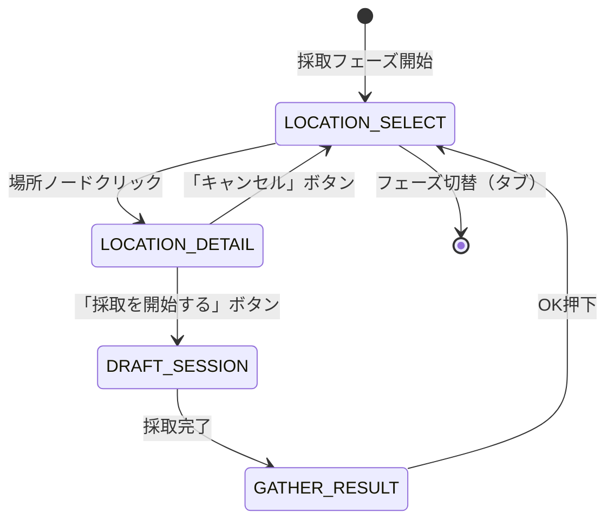

# 採取場所選択ステージ 詳細設計

**バージョン**: 1.0.0
**作成日**: 2026-02-23
**更新日**: 2026-02-23
**コンポーネントID**: gathering-location-select

---

## 1. 概要

### 1.1 基本情報

| 項目 | 値 |
|------|-----|
| **コンポーネント名** | 採取場所選択UI (LocationSelectUI) |
| **親フェーズ** | 採取フェーズ（PHASE-002） |
| **責務** | 採取地をマップ形式で表示し、手札連動で場所選択を行う |
| **実装ファイル** | `src/features/gathering/components/LocationSelectUI.ts` |
| **要件** | REQ-002, REQ-002-01〜REQ-002-05 |

### 1.2 ステージ位置

採取フェーズは4ステージで構成される。本文書は最初の「場所選択」ステージを対象とする。

```
場所選択（本文書） → 場所詳細 → ドラフトセッション → 採取結果
(LOCATION_SELECT)   (LOCATION_DETAIL)  (DRAFT_SESSION)     (GATHER_RESULT)
```

### 1.3 信頼性レベル

- 🔵 **青信号**: 要件定義書に記載（REQ-002系）
- 🟡 **黄信号**: 要件定義書から妥当な推測
- 🔴 **赤信号**: 要件定義書にない推測

---

## 2. ワイヤーフレーム 🔵

### 2.1 採取場所選択マップ（メインビュー）

```
┌───────────────────────────────────────────────────────────────┐
│                        採取地マップ                            │
├───────────────────────────────────────────────────────────────┤
│  ┌─────────────────────────────────────────────────────────┐  │
│  │                                                         │  │
│  │               ◆ 古代遺跡                                │  │
│  │               AP:2                                      │  │
│  │    ◎古代の欠片 ○魔法の粉 △賢者の石片                  │  │
│  │                                                         │  │
│  │                    ● 鉱山                                │  │
│  │                    AP:1                                  │  │
│  │         ◎鉄鉱石 ○銅鉱石 △銀鉱石                      │  │
│  │                                                         │  │
│  │  ● 近くの森                                             │  │
│  │  AP:1                                                   │  │
│  │  ◎薬草 ○毒草 △光る花                                  │  │
│  │                                       ◆ 火山地帯        │  │
│  │                                       AP:2              │  │
│  │                                ◎火山灰 ○溶岩石 △炎の結晶│ │
│  │            ● 湖畔                                       │  │
│  │            AP:1                                         │  │
│  │       ◎水晶 ○真珠貝 △月光石                           │  │
│  │                                                         │  │
│  └─────────────────────────────────────────────────────────┘  │
│                                                               │
│  ● = 選択可能（手札にカードあり） / ◆ = 選択不可（半透明）   │
│  出現率: ◎高 ○中 △低                                       │
└───────────────────────────────────────────────────────────────┘
```

### 2.2 手札に採取地カードがない場合

```
┌───────────────────────────────────────────────────────────────┐
│                        採取地マップ                            │
├───────────────────────────────────────────────────────────────┤
│  ┌─────────────────────────────────────────────────────────┐  │
│  │                                                         │  │
│  │               ◆ 古代遺跡                                │  │
│  │                    ◆ 鉱山                                │  │
│  │  ◆ 近くの森                                             │  │
│  │                                       ◆ 火山地帯        │  │
│  │            ◆ 湖畔                                       │  │
│  │                                                         │  │
│  │         ┌──────────────────────────────┐                 │  │
│  │         │   採取地カードがありません    │                 │  │
│  │         └──────────────────────────────┘                 │  │
│  └─────────────────────────────────────────────────────────┘  │
└───────────────────────────────────────────────────────────────┘
```

---

## 3. マップレイアウト仕様 🔵

### 3.1 マップ表示エリア

| プロパティ | 値 | 信頼性 |
|-----------|-----|--------|
| **マップ背景幅** | 600px | 🔵 |
| **マップ背景高さ** | 410px | 🔵 |
| **マップ背景X** | 10px | 🔵 |
| **マップ背景Y** | 40px | 🔵 |
| **マップ背景色** | `Colors.background.secondary` | 🔵 |
| **マップボーダー** | 2px solid `Colors.border.primary` | 🔵 |
| **内部パディング** | 50px（ノードが端に寄りすぎないための余白） | 🔵 |

### 3.2 マップタイトル

| プロパティ | 値 | 信頼性 |
|-----------|-----|--------|
| **テキスト** | 「採取地マップ」 | 🔵 |
| **配置** | マップ背景の上部中央（Y: 15px） | 🔵 |
| **フォント** | `THEME.sizes.large`px、太字、白色 | 🔵 |

### 3.3 座標スケーリング

場所データのmapX, mapY座標をマップ表示エリア内にリニアスケーリングする。

```typescript
// 純粋関数: マップ座標の境界計算
function calculateMapBounds(locations: readonly IGatheringLocation[]): MapBounds;

// 純粋関数: マップ座標→UI座標変換
function scaleToMapArea(mapX: number, mapY: number, bounds: MapBounds): { x: number; y: number };
```

**スケーリングロジック**:
- 全場所のmapX, mapYの最小値・最大値を算出
- パディング内のエリア（60px〜550px, 90px〜400px）に線形マッピング
- 単一場所の場合はデフォルト範囲（±100）でエリア中央に配置
- 同一座標の場合もデフォルト範囲にフォールバック（NaN防止）

---

## 4. 場所ノードコンポーネント 🔵

### 4.1 ノード構成

各場所は以下の要素で構成されるコンテナとしてマップ上に配置される。

```
        AP:1 ← APコストバッジ（右上）
    ┌────────┐
    │  ●     │ ← 円形ノード（半径24px）
    └────────┘
     近くの森  ← 場所名テキスト（下）
  ◎薬草 ○毒草 △光る花 ← 素材プレビュー（さらに下）
```

### 4.2 ノードサイズ・配置

| 要素 | プロパティ | 値 | 信頼性 |
|------|-----------|-----|--------|
| **円形ノード** | 半径 | 24px | 🔵 |
| **場所名** | Y方向オフセット | +34px（ノード中心から） | 🔵 |
| **場所名** | フォント | `THEME.sizes.medium`px、太字、白色 | 🔵 |
| **APバッジ** | X方向オフセット | +20px | 🔵 |
| **APバッジ** | Y方向オフセット | -20px | 🔵 |
| **APバッジ** | フォント | `THEME.sizes.small`px、#FFD700（ゴールド） | 🔵 |
| **素材プレビュー** | Y方向オフセット | +52px | 🔵 |
| **素材プレビュー** | フォント | 12px、#CCCCCC | 🔵 |

### 4.3 選択可能/不可の視覚状態

| 状態 | ノード背景色 | ノードボーダー色 | アルファ値 | 信頼性 |
|------|-------------|-----------------|-----------|--------|
| **選択可能** | `Colors.cardType.gathering` | `Colors.cardType.gathering` | 1.0 | 🔵 |
| **選択不可** | `Colors.background.primary` | `Colors.border.primary` | 0.4 | 🔵 |
| **ホバー** | 変更なし | `Colors.border.gold`（ボーダー3px） | 1.0 | 🔵 |

### 4.4 インタラクション

| 操作 | 対象 | 動作 | 信頼性 |
|------|------|------|--------|
| **クリック** | 選択可能ノード | `onLocationSelect`コールバック発火 | 🔵 |
| **ホバー（over）** | 選択可能ノード | ボーダー色を`Colors.border.gold`に変更、太さ3px | 🔵 |
| **ホバー（out）** | 選択可能ノード | ボーダー色を`Colors.cardType.gathering`に戻す、太さ2px | 🔵 |
| **クリック** | 選択不可ノード | 反応なし（`setInteractive`未設定） | 🔵 |
| **カーソル** | 選択可能ノード | ハンドカーソル（`useHandCursor: true`） | 🔵 |

---

## 5. 手札連動フィルタリング 🔵

### 5.1 フィルタリングロジック

場所の選択可否は手札の採取地カードの有無で決定される。

```
手札カード                  マスタデータ             UI表示
┌─────────┐                ┌─────────────┐        ┌───────────────┐
│ 近くの森 │──cardId照合──→│ 近くの森     │──────→ │ ● 選択可能    │
│ (forest) │                │ cardId:forest│        │ alpha: 1.0    │
└─────────┘                └─────────────┘        └───────────────┘
                           ┌─────────────┐        ┌───────────────┐
  手札にない ─────────────→│ 鉱山         │──────→ │ ◆ 選択不可    │
                           │ cardId:mine  │        │ alpha: 0.4    │
                           └─────────────┘        └───────────────┘
```

### 5.2 データフロー

```
GatheringPhaseUI
  │
  ├─ getAvailableLocations(handCardIds)
  │   ├─ GATHERING_LOCATIONS（マスタデータ5件）
  │   └─ handCardIds（手札のcardId配列）
  │       → IGatheringLocation[]（isSelectableフラグ付き）
  │
  └─ LocationSelectUI.updateLocations(locations)
      ├─ calculateMapBounds(locations)
      ├─ scaleToMapArea(mapX, mapY, bounds) × N
      └─ createLocationNode(location, x, y) × N
```

### 5.3 空手札メッセージ

選択可能な場所が0件の場合、マップ中央に「採取地カードがありません」と表示する。

| プロパティ | 値 | 信頼性 |
|-----------|-----|--------|
| **テキスト** | 「採取地カードがありません」 | 🔵 |
| **配置** | マップ背景中央 | 🔵 |
| **フォント** | `THEME.sizes.medium`px、#888888 | 🔵 |

---

## 6. 移動APコスト表示 🔵

### 6.1 APコストバッジ

各場所ノードの右上にAPコストを表示する。

```
AP:1  ← AP1コストの場所（近くの森、鉱山、湖畔）
AP:2  ← AP2コストの場所（古代遺跡、火山地帯）
```

### 6.2 APコストとゲームメカニクスの関係

場所選択後、移動APコストはドラフト採取の基本コストとして消費される。

| 場所 | 移動APコスト | 合計APコスト計算 |
|------|-------------|-----------------|
| 近くの森 | 1 | 1 + 選択個数による追加コスト |
| 鉱山 | 1 | 1 + 選択個数による追加コスト |
| 湖畔 | 1 | 1 + 選択個数による追加コスト |
| 古代遺跡 | 2 | 2 + 選択個数による追加コスト |
| 火山地帯 | 2 | 2 + 選択個数による追加コスト |

AP超過時は自動日進行が発生する（REQ-003参照）。

---

## 7. 素材プレビュー表示 🔵

### 7.1 表示形式

各場所の採取可能素材を出現率ラベル付きでコンパクト表示する。

| 出現率 | ラベル | 意味 |
|--------|-------|------|
| `high` | ◎ | 高確率 |
| `medium` | ○ | 中確率 |
| `low` | △ | 低確率 |

### 7.2 表示例

```
◎薬草 ○毒草 △光る花       ← 近くの森
◎鉄鉱石 ○銅鉱石 △銀鉱石   ← 鉱山
◎水晶 ○真珠貝 △月光石     ← 湖畔
◎古代の欠片 ○魔法の粉 △賢者の石片 ← 古代遺跡
◎火山灰 ○溶岩石 △炎の結晶 ← 火山地帯
```

### 7.3 素材データ構造

```typescript
interface IMaterialPreview {
  readonly name: string;      // 素材名
  readonly rarity: string;    // レアリティ（Common, Uncommon, Rare, Legendary）
  readonly dropRate: DropRateLabel; // 出現率（high, medium, low）
}
```

---

## 8. 場所選択→ドラフト採取 遷移 🔵

### 8.1 遷移フロー



### 8.2 場所選択結果データ

場所ノードクリック時に以下のデータが生成される。

```typescript
interface ILocationSelectResult {
  readonly cardId: CardId;         // 選択した採取地カードID
  readonly locationName: string;   // 採取地名
  readonly movementAPCost: number; // 移動APコスト
}
```

### 8.3 遷移アニメーション 🟡

| アニメーション | トリガー | 効果 | 時間 | 信頼性 |
|---------------|---------|------|------|--------|
| マップフェードアウト | 場所選択確定時 | マップUI全体がフェードアウト | 300ms | 🟡 |
| 場所詳細スライドイン | マップフェードアウト完了後 | 場所詳細パネルが下からスライドイン | 400ms | 🟡 |
| 場所詳細スライドアウト | キャンセル時 | 場所詳細パネルが下にスライドアウト | 300ms | 🟡 |
| マップフェードイン | 場所詳細スライドアウト完了後 | マップUI全体がフェードイン | 300ms | 🟡 |

```typescript
// 場所選択→場所詳細への遷移アニメーション（想定実装）
async transitionToLocationDetail(): Promise<void> {
  // 1. マップUIをフェードアウト
  await this.tweens.add({
    targets: this.locationSelectUI.getContainer(),
    alpha: { from: 1, to: 0 },
    duration: 300,
    ease: 'Quad.Out',
  }).toPromise();

  // 2. 場所詳細パネルをスライドイン
  await this.tweens.add({
    targets: this.locationDetailPanel,
    y: { from: this.cameras.main.height, to: centerY },
    alpha: { from: 0, to: 1 },
    duration: 400,
    ease: 'Back.Out',
  }).toPromise();
}
```

---

## 9. マスタデータ 🔵

### 9.1 採取場所一覧

| 場所名 | cardId | 移動APコスト | mapX | mapY | 素材1 | 素材2 | 素材3 |
|--------|--------|-------------|------|------|-------|-------|-------|
| 近くの森 | gathering-forest | 1 | 100 | 200 | 薬草(C)◎ | 毒草(C)○ | 光る花(U)△ |
| 鉱山 | gathering-mine | 1 | 300 | 150 | 鉄鉱石(C)◎ | 銅鉱石(C)○ | 銀鉱石(U)△ |
| 湖畔 | gathering-lake | 1 | 200 | 350 | 水晶(C)◎ | 真珠貝(U)○ | 月光石(R)△ |
| 古代遺跡 | gathering-ruins | 2 | 400 | 100 | 古代の欠片(U)◎ | 魔法の粉(R)○ | 賢者の石片(L)△ |
| 火山地帯 | gathering-volcano | 2 | 450 | 300 | 火山灰(C)◎ | 溶岩石(U)○ | 炎の結晶(R)△ |

レアリティ: C=Common, U=Uncommon, R=Rare, L=Legendary

### 9.2 マスタデータファイル

```
src/features/gathering/data/locations.ts
```

---

## 10. 型定義 🔵

### 10.1 ステージ定数

```typescript
const GatheringStage = {
  LOCATION_SELECT: 'LOCATION_SELECT',   // 場所選択（本ステージ）
  LOCATION_DETAIL: 'LOCATION_DETAIL',   // 場所詳細
  DRAFT_SESSION: 'DRAFT_SESSION',       // ドラフト採取セッション
  GATHER_RESULT: 'GATHER_RESULT',       // 採取結果
} as const;
```

### 10.2 場所データ型

```typescript
// マスタデータ（ゲームデータ）
interface IGatheringLocationData {
  readonly cardId: CardId;
  readonly name: string;
  readonly movementAPCost: number;
  readonly availableMaterials: readonly IMaterialPreview[];
  readonly mapX: number;
  readonly mapY: number;
}

// UI表示用（手札連動フラグ付き）
interface IGatheringLocation extends IGatheringLocationData {
  readonly isSelectable: boolean;
}

// 場所選択結果
interface ILocationSelectResult {
  readonly cardId: CardId;
  readonly locationName: string;
  readonly movementAPCost: number;
}
```

---

## 11. イベント 🔵

| イベント名 | トリガー | ペイロード | 信頼性 |
|-----------|---------|-----------|--------|
| `LOCATION_SELECTED` | 場所ノードクリック | `ILocationSelectResult` | 🔵 |
| `GATHERING_STAGE_CHANGED` | ステージ遷移時 | `{ from: GatheringStage, to: GatheringStage }` | 🟡 |

---

## 12. エラーハンドリング 🟡

| エラーケース | 原因 | 対処 | 信頼性 |
|------------|------|------|--------|
| 場所データ0件 | マスタデータ未読み込み | マップを空で表示 | 🟡 |
| 全場所が選択不可 | 手札に採取地カード0枚 | 空手札メッセージ表示 | 🔵 |
| 座標範囲が同一 | 全場所が同じmapX/mapYの場合 | デフォルト範囲にフォールバック | 🔵 |

---

## 13. パフォーマンス考慮 🟡

| 項目 | 対策 | 信頼性 |
|------|------|--------|
| ノード再生成 | `clearLocationNodes()`で既存ノードを破棄後、新規生成 | 🔵 |
| イベントリスナー | ノード破棄時にpointerover/pointerout/pointerdownを明示的にoff | 🔵 |
| 座標計算 | 純粋関数で毎回計算（場所数≤5のため十分高速） | 🔵 |

---

## 関連文書

- **採取フェーズ（ドラフト採取）**: [gathering.md](./gathering.md)
- **メイン画面概要**: [main.md](./main.md)
- **共通コンポーネント**: [common-components.md](./common-components.md)
- **フェーズ自由遷移要件定義書**: [../../../spec/free-phase-navigation/requirements.md](../../../spec/free-phase-navigation/requirements.md)

---

## 変更履歴

| 日付 | バージョン | 変更内容 |
|------|----------|---------|
| 2026-02-23 | 1.0.0 | 初版作成（Issue #306: 採取場所選択ステージ詳細デザイン仕様） |
