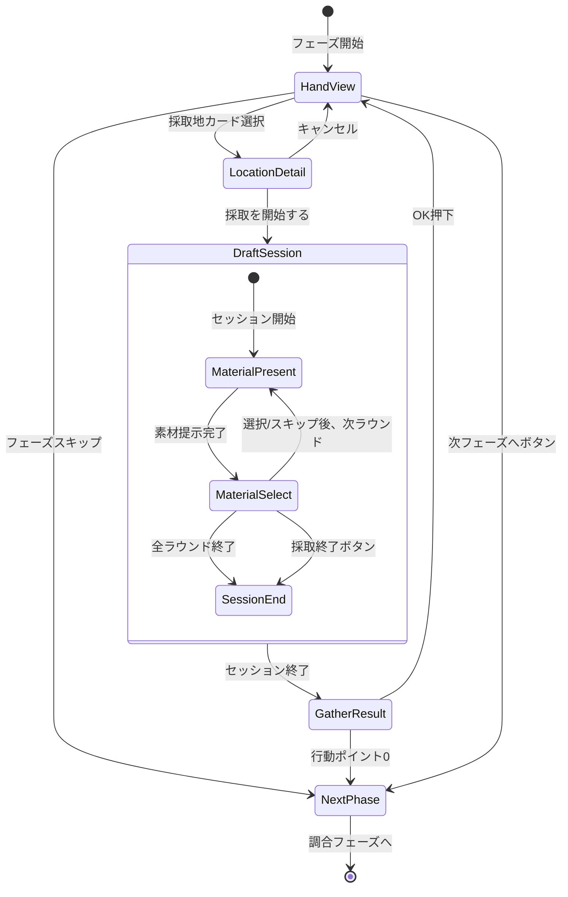

# 採取フェーズ 詳細設計（ドラフト採取システム）

**バージョン**: 1.0.0
**作成日**: 2026-01-16
**更新日**: 2026-01-16
**フェーズID**: PHASE-002

---

## 1. 概要

### 1.1 基本情報

| 項目 | 値 |
|------|-----|
| **フェーズ名** | 採取フェーズ（Gathering Phase） |
| **親画面** | メイン画面（SCR-002） |
| **責務** | 採取地カードを使用してドラフト方式で素材を獲得 |
| **前フェーズ** | 依頼受注フェーズ |
| **次フェーズ** | 調合フェーズ |

### 1.2 ドラフト採取システム概要 🔵

採取地カードを使用すると、その採取地で採取可能な素材から3つが提示され、プレイヤーは1つを選択する。これを提示回数（採取地によって2〜5回）だけ繰り返す。

### 1.3 信頼性レベル

- 🔵 **青信号**: 要件定義書に記載
- 🟡 **黄信号**: 要件定義書から妥当な推測
- 🔴 **赤信号**: 要件定義書にない推測

---

## 2. ワイヤーフレーム 🔵

### 2.1 採取地選択画面（手札からカード選択後）

```
┌───────────────────────────────────────────────────────────┐
│                      採取フェーズ                         │
├───────────────────────────────────────────────────────────┤
│                                                           │
│   選択中の採取地: 近くの森                                │
│   基本コスト: ⚡0                                         │
│   提示回数: 3回                                           │
│   レア出現率: 10%                                         │
│                                                           │
│   ┌───────────────────────────────────────────────────┐   │
│   │ 出現可能な素材:                                   │   │
│   │  🌿 薬草(C)    💧 清水(C)    🍄 キノコ(C)        │   │
│   │  ✨ 光苔(C) [レア]                                │   │
│   └───────────────────────────────────────────────────┘   │
│                                                           │
│              [採取を開始する]    [キャンセル]             │
│                                                           │
├───────────────────────────────────────────────────────────┤
│              [フェーズをスキップ]                         │
└───────────────────────────────────────────────────────────┘
```

### 2.2 ドラフト採取画面（メイン）

```
┌───────────────────────────────────────────────────────────┐
│ 【近くの森】 ラウンド 2/3 | 選択済み: 1個                 │
├───────────────────────────────────────────────────────────┤
│                                                           │
│   ┌─────────────── 今回の選択肢 ───────────────┐          │
│   │                                            │          │
│   │  ┌─────────┐  ┌─────────┐  ┌─────────┐   │          │
│   │  │ 🌿      │  │ 💧      │  │ 🍄      │   │          │
│   │  │ 薬草    │  │ 清水    │  │ キノコ  │   │          │
│   │  │ (C)     │  │ (C)     │  │ (C)     │   │          │
│   │  │         │  │ ← 選択中│  │         │   │          │
│   │  │  [1]    │  │  [2]    │  │  [3]    │   │          │
│   │  └─────────┘  └─────────┘  └─────────┘   │          │
│   │                                            │          │
│   │        [S] このラウンドをスキップ          │          │
│   │                                            │          │
│   └────────────────────────────────────────────┘          │
│                                                           │
│   ┌─────────────── 獲得済み素材 ───────────────┐          │
│   │  🌿 薬草(C) ×1                             │          │
│   └────────────────────────────────────────────┘          │
│                                                           │
│   ┌─────────────── コスト表示 ─────────────────┐          │
│   │  基本コスト: ⚡0  |  追加コスト: ⚡1       │          │
│   │  合計: ⚡1        |  追加日数: なし        │          │
│   └────────────────────────────────────────────┘          │
│                                                           │
│                    [E] 採取を終了する                     │
└───────────────────────────────────────────────────────────┘
```

### 2.3 採取完了画面

```
┌───────────────────────────────────────────────────────────┐
│                    採取完了！                             │
├───────────────────────────────────────────────────────────┤
│                                                           │
│   採取地: 近くの森                                        │
│                                                           │
│   獲得した素材:                                           │
│   ┌─────────────────────────────────────────────────┐     │
│   │  🌿 薬草(C) ×2                                  │     │
│   │  💧 清水(C) ×1                                  │     │
│   └─────────────────────────────────────────────────┘     │
│                                                           │
│   消費コスト:                                             │
│   ┌─────────────────────────────────────────────────┐     │
│   │  基本コスト: ⚡0（近くの森）                    │     │
│   │  追加コスト: ⚡2（3個選択）                     │     │
│   │  合計: ⚡2                                      │     │
│   └─────────────────────────────────────────────────┘     │
│                                                           │
│                       [OK]                                │
└───────────────────────────────────────────────────────────┘
```

### 2.4 7個以上選択時の警告表示

```
┌───────────────────────────────────────────────────────────┐
│ 【深い森】 ラウンド 5/5 | 選択済み: 6個                   │
├───────────────────────────────────────────────────────────┤
│                                                           │
│   ⚠ 警告: 7個以上の採取は翌日持越し（+1日）となります   │
│                                                           │
│   ┌─────────────── 今回の選択肢 ───────────────┐          │
│   │  ┌─────────┐  ┌─────────┐  ┌─────────┐   │          │
│   │  │ 🌿      │  │ 💎      │  │ 🍄      │   │          │
│   │  │ 薬草    │  │ 宝石    │  │ キノコ  │   │          │
│   │  │ (B)     │  │ (A)[レア]│ │ (C)     │   │          │
│   │  │  [1]    │  │  [2]    │  │  [3]    │   │          │
│   │  └─────────┘  └─────────┘  └─────────┘   │          │
│   └────────────────────────────────────────────┘          │
│                                                           │
│   ┌─────────────── コスト表示 ─────────────────┐          │
│   │  基本コスト: ⚡1  |  追加コスト: ⚡3       │          │
│   │  合計: ⚡4        |  追加日数: +1日 ⚠     │          │
│   └────────────────────────────────────────────┘          │
│                                                           │
│                    [E] 採取を終了する                     │
└───────────────────────────────────────────────────────────┘
```

---

## 3. UIコンポーネント詳細 🔵

### 3.1 採取地詳細パネル (`location-detail`)

#### パネル構成

| プロパティ | 値 | 信頼性 |
|-----------|-----|--------|
| **幅** | 500px | 🟡 |
| **背景色** | #E8F5E9 | 🟡 |
| **枠線** | 2px solid #4CAF50 | 🟡 |
| **角丸** | 8px | 🟡 |

#### 採取地データ表示

```typescript
interface LocationDetailProps {
  locationId: string;
  name: string;             // 採取地名
  baseCost: number;         // 基本コスト
  presentationCount: number; // 提示回数
  rareRate: number;         // レア出現率（%）
  availableMaterials: MaterialPreview[];
}

interface MaterialPreview {
  materialId: string;
  name: string;
  icon: string;
  baseQuality: Quality;
  isRare: boolean;
}
```

### 3.2 ラウンドインジケーター (`round-indicator`)

```
【近くの森】 ラウンド 2/3 | 選択済み: 1個
```

| プロパティ | 値 | 信頼性 |
|-----------|-----|--------|
| **配置** | 画面上部、左寄せ | 🟡 |
| **フォント** | 游ゴシック, 16px, Bold | 🟡 |
| **ラウンド表示色** | 進行に応じてグラデーション（緑→黄→赤） | 🟡 |

### 3.3 素材選択肢カード群 (`material-options`)

#### コンテナ構成

| プロパティ | 値 | 信頼性 |
|-----------|-----|--------|
| **配置** | 水平方向、中央揃え | 🔵 |
| **カード数** | 常に3枚 | 🔵 |
| **カード間隔** | 24px | 🟡 |

#### 素材カード (`material-card`)

```typescript
interface MaterialCardProps {
  materialId: string;
  name: string;
  icon: string;             // 絵文字またはアセット
  quality: Quality;         // 品質（C/B/A/S）
  isRare: boolean;          // レア素材か
  isSelected: boolean;      // 選択中か
  shortcutKey: string;      // ショートカットキー（1/2/3）
}
```

| 状態 | 表示スタイル | 信頼性 |
|------|-------------|--------|
| 未選択 | 背景: #FFFFFF、枠線: #E0E0E0 | 🟡 |
| ホバー | 背景: #F5F5F5、枠線: #9E9E9E、shadow | 🟡 |
| 選択中 | 背景: #E3F2FD、枠線: #2196F3（太さ3px）、上に浮く | 🟡 |
| レア | 枠線: ゴールド#FFD700、キラキラエフェクト | 🟡 |

#### rexUI実装パターン 🟡

```typescript
// GridSizerを使用した素材選択肢配置
const materialOptionsGrid = this.rexUI.add.gridSizer({
  x: centerX,
  y: centerY,
  column: 3,
  row: 1,
  columnProportions: 1,
  space: { column: 24 },
});

// 素材カード生成
materials.forEach((material, index) => {
  const card = this.createMaterialCard(material, index + 1);
  materialOptionsGrid.add(card, { column: index, row: 0 });
});
```

### 3.4 獲得済み素材リスト (`selected-materials`)

```
┌─────────────── 獲得済み素材 ───────────────┐
│  🌿 薬草(C) ×2                             │
│  💧 清水(C) ×1                             │
│  🍄 キノコ(B) ×1                           │
└────────────────────────────────────────────┘
```

| プロパティ | 値 | 信頼性 |
|-----------|-----|--------|
| **最大表示行数** | 5行（スクロール可能） | 🟡 |
| **表示形式** | アイコン + 名前(品質) ×数量 | 🔵 |
| **背景色** | #FAFAFA | 🟡 |

### 3.5 コスト表示パネル (`cost-display`)

#### コスト計算ルール 🔵

| 選択個数 | 追加コスト | 追加日数 | 信頼性 |
|---------|-----------|---------|--------|
| 0個（偵察のみ） | 0 | 0 | 🔵 |
| 1〜2個 | 1 | 0 | 🔵 |
| 3〜4個 | 2 | 0 | 🔵 |
| 5〜6個 | 3 | 0 | 🔵 |
| 7個以上 | 3 | +1日 | 🔵 |

#### 表示スタイル

| 選択個数 | 表示色 | 追加表示 | 信頼性 |
|---------|--------|---------|--------|
| 0〜4個 | 通常（白/黒） | なし | 🟡 |
| 5〜6個 | 黄色（警告） | ⚠アイコン | 🟡 |
| 7個以上 | 赤（強警告） | ⚠点滅 + 追加日数表示 | 🟡 |

### 3.6 アクションボタン群

#### 素材選択ボタン (`btn-select-1/2/3`)

キーボードショートカット: 1, 2, 3

| プロパティ | 値 | 信頼性 |
|-----------|-----|--------|
| **配置** | 各カード下部 | 🔵 |
| **表示** | [1], [2], [3] | 🔵 |
| **サイズ** | 40x30px | 🟡 |

#### スキップボタン (`btn-skip-round`)

キーボードショートカット: S または 0

| プロパティ | 値 | 信頼性 |
|-----------|-----|--------|
| **種類** | セカンダリボタン | 🔵 |
| **テキスト** | 「このラウンドをスキップ」 | 🔵 |
| **配置** | 選択肢カード群の下 | 🟡 |

#### 採取終了ボタン (`btn-end-gather`)

キーボードショートカット: E

| プロパティ | 値 | 信頼性 |
|-----------|-----|--------|
| **種類** | プライマリボタン | 🔵 |
| **テキスト** | 「採取を終了する」 | 🔵 |
| **配置** | 画面下部中央 | 🟡 |
| **背景色** | #4CAF50 | 🟡 |

---

## 4. 状態遷移 🔵

### 4.1 状態遷移図



### 4.2 詳細状態定義

| 状態 | 説明 | UI表示 |
|------|------|--------|
| `HandView` | 手札表示中、採取地カード選択待ち | 手札カード表示、フェーズボタン有効 |
| `LocationDetail` | 採取地詳細表示中 | 採取地情報パネル、開始/キャンセルボタン |
| `DraftSession` | ドラフト採取セッション中 | 素材選択UI |
| `MaterialPresent` | 素材提示中（アニメーション） | 3枚の素材カードがフェードイン |
| `MaterialSelect` | 素材選択待ち | 選択/スキップボタン有効 |
| `SessionEnd` | セッション終了処理中 | コスト計算、結果集計 |
| `GatherResult` | 採取結果表示中 | 結果パネル、OKボタン |
| `NextPhase` | 次フェーズへ遷移中 | フェード演出 |

---

## 5. イベント詳細 🔵

### 5.1 入力イベント

| イベント名 | トリガー | 処理内容 | 信頼性 |
|-----------|----------|----------|--------|
| `OnGatheringCardSelected` | 採取地カードクリック | 採取地詳細表示 | 🔵 |
| `OnStartGatheringClicked` | 開始ボタン/Enterキー | ドラフトセッション開始 | 🔵 |
| `OnMaterialSelected` | 素材クリック/1-3キー | 素材を獲得リストに追加 | 🔵 |
| `OnRoundSkipped` | スキップボタン/S/0キー | 今ラウンドをスキップ | 🔵 |
| `OnEndGatheringClicked` | 終了ボタン/Eキー | 採取セッション終了 | 🔵 |
| `OnCancelClicked` | キャンセルボタン/ESC | 採取キャンセル（未選択時のみ） | 🔵 |

### 5.2 ビジネスイベント（EventBus）

| イベント名 | ペイロード | 発火タイミング | 信頼性 |
|-----------|-----------|---------------|--------|
| `DRAFT_SESSION_STARTED` | `{ locationId, presentationCount }` | ドラフト開始時 | 🔵 |
| `MATERIAL_PRESENTED` | `{ round, materials: Material[] }` | 素材3つ提示時 | 🔵 |
| `MATERIAL_SELECTED` | `{ round, materialId }` | 素材選択時 | 🔵 |
| `ROUND_SKIPPED` | `{ round }` | ラウンドスキップ時 | 🔵 |
| `GATHERING_COMPLETED` | `{ locationId, materials, totalCost, extraDay }` | 採取完了時 | 🔵 |
| `ACTION_POINTS_CONSUMED` | `{ consumed, remaining }` | 行動ポイント消費時 | 🔵 |
| `PHASE_TRANSITION_REQUESTED` | `{ from: 'gathering', to: 'alchemy' }` | 次フェーズボタン押下時 | 🔵 |

### 5.3 イベントハンドラ実装 🟡

```typescript
// GatheringContainer.ts
export class GatheringContainer extends BasePhaseContainer {
  private currentRound: number = 0;
  private maxRounds: number = 0;
  private selectedMaterials: Material[] = [];
  private currentOptions: Material[] = [];

  private async startDraftSession(locationId: string): Promise<void> {
    const location = await this.getLocationData(locationId);
    this.maxRounds = location.presentationCount;
    this.currentRound = 0;
    this.selectedMaterials = [];

    this.eventBus.emit('DRAFT_SESSION_STARTED', {
      locationId,
      presentationCount: this.maxRounds,
    });

    await this.presentNextRound();
  }

  private async presentNextRound(): Promise<void> {
    this.currentRound++;

    if (this.currentRound > this.maxRounds) {
      await this.endSession();
      return;
    }

    // 素材3つを抽選
    this.currentOptions = await this.draftGatheringService.rollMaterials(
      this.locationId,
      3
    );

    this.eventBus.emit('MATERIAL_PRESENTED', {
      round: this.currentRound,
      materials: this.currentOptions,
    });

    // 提示アニメーション再生
    await this.playMaterialPresentAnimation(this.currentOptions);

    this.setState('MaterialSelect');
  }

  private async selectMaterial(index: number): Promise<void> {
    const material = this.currentOptions[index];
    this.selectedMaterials.push(material);

    this.eventBus.emit('MATERIAL_SELECTED', {
      round: this.currentRound,
      materialId: material.id,
    });

    // 選択アニメーション
    await this.playMaterialSelectAnimation(index);

    // 次ラウンドへ
    await this.presentNextRound();
  }

  private async skipRound(): Promise<void> {
    this.eventBus.emit('ROUND_SKIPPED', { round: this.currentRound });

    // スキップアニメーション
    await this.playRoundSkipAnimation();

    // 次ラウンドへ
    await this.presentNextRound();
  }

  private async endSession(): Promise<void> {
    // コスト計算
    const cost = this.calculateCost(this.selectedMaterials.length);

    this.eventBus.emit('GATHERING_COMPLETED', {
      locationId: this.locationId,
      materials: this.selectedMaterials,
      totalCost: cost.total,
      extraDay: cost.extraDay,
    });

    // 結果表示
    await this.showGatherResult(this.selectedMaterials, cost);
  }

  private calculateCost(count: number): { base: number; additional: number; total: number; extraDay: boolean } {
    const base = this.currentLocation.baseCost;
    let additional = 0;
    let extraDay = false;

    if (count >= 1 && count <= 2) additional = 1;
    else if (count >= 3 && count <= 4) additional = 2;
    else if (count >= 5) additional = 3;

    if (count >= 7) extraDay = true;

    return { base, additional, total: base + additional, extraDay };
  }
}
```

---

## 6. アニメーション詳細 🟡

### 6.1 素材提示アニメーション

3枚の素材カードが順にフェードイン。

| カード | 遅延 | アニメーション | 時間 | イージング |
|--------|------|---------------|------|-----------|
| 左 | 0ms | alpha: 0→1, scale: 0.8→1 | 200ms | Back.Out |
| 中央 | 100ms | alpha: 0→1, scale: 0.8→1 | 200ms | Back.Out |
| 右 | 200ms | alpha: 0→1, scale: 0.8→1 | 200ms | Back.Out |

```typescript
private async playMaterialPresentAnimation(materials: Material[]): Promise<void> {
  const cards = this.materialCards;

  for (let i = 0; i < cards.length; i++) {
    cards[i].setAlpha(0);
    cards[i].setScale(0.8);

    await this.delay(100 * i);

    this.tweens.add({
      targets: cards[i],
      alpha: 1,
      scale: 1,
      duration: 200,
      ease: 'Back.Out',
    });
  }

  await this.delay(300); // 全カード表示完了まで待機
}
```

### 6.2 素材選択アニメーション

| プロパティ | 開始値 | 終了値 | 時間 | イージング |
|-----------|-------|-------|------|-----------|
| 選択カードscale | 1.0 | 1.1 | 150ms | Quad.Out |
| 選択カードy | 0 | -20 | 150ms | Quad.Out |
| ハイライトalpha | 0 | 1 | 150ms | Linear |
| 獲得リストへ移動 | カード位置 | リスト位置 | 300ms | Cubic.Out |
| 他カードfade | 1.0 | 0 | 200ms | Quad.In |

### 6.3 ラウンドスキップアニメーション

| プロパティ | 開始値 | 終了値 | 時間 | イージング |
|-----------|-------|-------|------|-----------|
| 全カードalpha | 1.0 | 0 | 200ms | Quad.In |
| 全カードx | 0 | +50 | 200ms | Quad.In |

### 6.4 採取完了アニメーション

```typescript
private async playGatherCompleteAnimation(): Promise<void> {
  // 1. 結果パネルをスライドイン
  await this.tweens.add({
    targets: this.resultPanel,
    y: { from: this.scene.cameras.main.height, to: centerY },
    alpha: { from: 0, to: 1 },
    duration: 400,
    ease: 'Back.Out',
  }).toPromise();

  // 2. 獲得素材を順に表示
  for (const item of this.selectedMaterials) {
    const itemView = this.createMaterialResultItem(item);
    await this.tweens.add({
      targets: itemView,
      alpha: { from: 0, to: 1 },
      x: { from: -20, to: 0 },
      duration: 200,
      ease: 'Quad.Out',
    }).toPromise();
    await this.delay(100);
  }

  // 3. コスト表示
  await this.tweens.add({
    targets: this.costDisplay,
    alpha: { from: 0, to: 1 },
    duration: 200,
  }).toPromise();
}
```

### 6.5 レア素材エフェクト

レア素材が提示された場合の特別演出。

| エフェクト | 説明 | 時間 |
|-----------|------|------|
| キラキラパーティクル | カード周囲に金色パーティクル | 連続 |
| 枠線グロー | ゴールドの枠線が発光 | パルス（1秒周期） |
| SE | レア出現音 | 0.5秒 |

---

## 7. データモデル 🔵

### 7.1 採取地データ

```typescript
interface GatheringLocation {
  id: string;
  name: string;
  baseCost: number;          // 基本行動ポイントコスト
  presentationCount: number; // 提示回数（2〜5）
  rareRate: number;          // レア出現率（%）
  availableMaterials: MaterialPool[];
}

interface MaterialPool {
  materialId: string;
  weight: number;            // 出現重み
  isRare: boolean;           // レア枠かどうか
}
```

### 7.2 ドラフトセッションデータ

```typescript
interface DraftSession {
  locationId: string;
  currentRound: number;
  maxRounds: number;
  selectedMaterials: SelectedMaterial[];
  currentOptions: Material[];
  sessionState: DraftSessionState;
}

interface SelectedMaterial {
  material: Material;
  round: number;
}

enum DraftSessionState {
  PRESENTING = 'presenting',
  SELECTING = 'selecting',
  TRANSITIONING = 'transitioning',
  COMPLETED = 'completed',
}
```

### 7.3 コスト計算結果

```typescript
interface GatheringCost {
  baseCost: number;
  additionalCost: number;
  totalCost: number;
  extraDay: boolean;
  warningLevel: 'none' | 'warning' | 'danger';
}
```

---

## 8. アクセシビリティ 🟡

### 8.1 キーボード操作

| キー | 動作 | 信頼性 |
|------|------|--------|
| `1` | 左の素材を選択 | 🔵 |
| `2` | 中央の素材を選択 | 🔵 |
| `3` | 右の素材を選択 | 🔵 |
| `S` または `0` | このラウンドをスキップ | 🔵 |
| `E` | 採取を終了する | 🔵 |
| `Enter` | 選択中の素材を確定/採取開始 | 🟡 |
| `Escape` | キャンセル（未選択時のみ） | 🔵 |

### 8.2 フォーカス順序

1. 素材カード群（左から右）
2. スキップボタン
3. 採取終了ボタン

### 8.3 視覚フィードバック

| 状況 | フィードバック |
|------|---------------|
| 選択可能 | カードにフォーカスリング表示 |
| 選択中 | カードが上に浮く + ハイライト |
| 警告状態 | コスト表示が黄色に変化 |
| 危険状態 | コスト表示が赤 + 点滅 |

---

## 9. エラーハンドリング 🟡

### 9.1 エラーケース

| エラー | 原因 | 対処 |
|--------|------|------|
| 行動ポイント不足 | 採取に必要なポイントがない | 開始ボタン非活性 + 警告表示 |
| 保管枠不足 | 素材を保管する枠がない | 警告ダイアログ表示 |
| データ不整合 | 採取地データが不正 | エラーログ + 代替データ使用 |

### 9.2 キャンセル制限

```typescript
// キャンセルは素材を1つも選択していない場合のみ可能
get canCancel(): boolean {
  return this.selectedMaterials.length === 0;
}
```

---

## 10. パフォーマンス考慮 🟡

### 10.1 最適化ポイント

| 項目 | 対策 |
|------|------|
| 素材カード生成 | オブジェクトプール使用 |
| パーティクルエフェクト | 軽量なスプライトアニメーション使用 |
| 素材抽選 | 重み付き抽選を事前計算 |
| アニメーション | Tween再利用 |

### 10.2 目標パフォーマンス

| 指標 | 目標値 |
|------|--------|
| ラウンド遷移 | < 500ms |
| 素材選択反応 | < 16ms |
| 結果画面表示 | < 300ms |
| メモリ使用量 | < 15MB（フェーズ単体） |

---

## 関連文書

- **メイン画面概要**: [main.md](./main.md)
- **共通コンポーネント**: [common-components.md](./common-components.md)
- **ゲームメカニクス（ドラフト採取）**: [../../game-mechanics.md](../../game-mechanics.md)
- **データフロー設計**: [../../dataflow.md](../../dataflow.md)

---

## 変更履歴

| 日付 | バージョン | 変更内容 |
|------|----------|---------|
| 2026-01-16 | 1.0.0 | main.mdから分割、ドラフト採取システム詳細化 |
