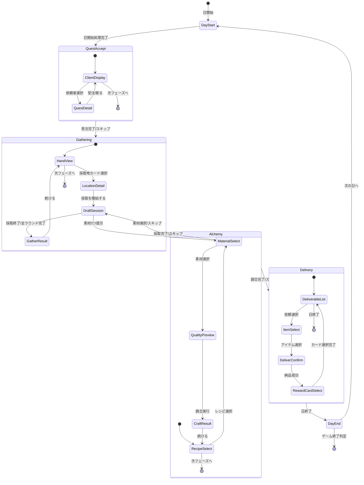

# メイン画面 詳細設計

**バージョン**: 1.2.0
**作成日**: 2026-01-01
**更新日**: 2026-01-02
**画面ID**: SCR-002

---

## 1. 基本情報

| 項目 | 値 |
|------|-----|
| **画面ID** | SCR-002 |
| **画面名** | メイン画面 |
| **親画面** | タイトル画面（SCR-001） |
| **子画面** | ショップ画面（SCR-003）、昇格試験画面（SCR-004）、リザルト画面（SCR-005） |
| **責務** | メインゲームプレイ（4フェーズの進行） |

### 信頼性レベル

- 🔵 **青信号**: 要件定義書に記載
- 🟡 **黄信号**: 要件定義書から妥当な推測
- 🔴 **赤信号**: 要件定義書にない推測

---

## 2. 画面構成 🔵

メイン画面は4つのフェーズに応じて表示内容が変化する。

### 2.1 フェーズ一覧

| フェーズ | 説明 | 主要UI要素 |
|---------|------|-----------|
| **依頼受注フェーズ** | 依頼者から依頼を受注 | 依頼者表示、依頼リスト、受注ボタン |
| **採取フェーズ** | 採取地カードで素材獲得 | 手札（採取地）、素材獲得演出 |
| **調合フェーズ** | レシピカードでアイテム調合 | 手札（レシピ）、素材選択、品質プレビュー |
| **納品フェーズ** | 完成品を依頼者に納品 | 依頼リスト、アイテム選択、報酬カード選択 |

---

## 3. 基本レイアウト 🟡

### 3.1 ワイヤーフレーム

```
┌─────────────────────────────────────────────────────────────────────────┐
│ ┌───────────────────────────────────────────────────────────────────┐   │
│ │ ヘッダー                                                          │   │
│ │ [ランク: G] [昇格ゲージ: ████████ 35/100] [残り: 25日] [💰 130G] [⚡ 3/3] │   │
│ └───────────────────────────────────────────────────────────────────┘   │
├─────────────────────────────────────────────────────────────────────────┤
│ ┌─────────────┐ ┌───────────────────────────────────────────────────┐   │
│ │ サイドバー  │ │                                                   │   │
│ │             │ │                                                   │   │
│ │ 【受注依頼】│ │             メインコンテンツエリア                │   │
│ │ ・回復薬    │ │             （フェーズに応じて変化）              │   │
│ │   期限:3日  │ │                                                   │   │
│ │ ・薬×3     │ │                                                   │   │
│ │   期限:4日  │ │                                                   │   │
│ │             │ │                                                   │   │
│ │ 【素材】    │ │                                                   │   │
│ │ 薬草×4     │ │                                                   │   │
│ │ 清水×2     │ │                                                   │   │
│ │ 鉱石×1     │ │                                                   │   │
│ │ [12/20枠]  │ │                                                   │   │
│ │             │ │                                                   │   │
│ │ 【完成品】  │ │                                                   │   │
│ │ 回復薬(B)×1│ │                                                   │   │
│ │             │ │                                                   │   │
│ │ [ショップ] │ │                                                   │   │
│ └─────────────┘ └───────────────────────────────────────────────────┘   │
├─────────────────────────────────────────────────────────────────────────┤
│ ┌───────────────────────────────────────────────────────────────────┐   │
│ │ フッター                                                          │   │
│ │ [依頼受注]●━━○[採取]━━○[調合]━━○[納品]                          │   │
│ │                                                                   │   │
│ │ 手札: [カード1][カード2][カード3][カード4][カード5]    [休憩][次へ]│   │
│ └───────────────────────────────────────────────────────────────────┘   │
└─────────────────────────────────────────────────────────────────────────┘
```

---

## 4. ヘッダーUI 🔵

### 4.1 UI要素

| 要素ID | 種類 | 説明 |
|--------|------|------|
| `rank-display` | テキスト | 現在のギルドランク表示 |
| `promotion-gauge` | プログレスバー | 昇格ゲージ進捗 |
| `day-counter` | テキスト | 残り日数（警告色対応） |
| `gold-display` | テキスト | 所持金 |
| `action-points` | アイコン群 | 行動ポイント（3つのアイコン） |

### 4.2 ランク表示 (`rank-display`)

| プロパティ | 値 |
|-----------|-----|
| **形式** | 「ランク: X」 |
| **フォント** | 游ゴシック, 16px, Bold |
| **色** | ランクに応じた色（G=白, F=緑, ... S=金） |

### 4.3 昇格ゲージ (`promotion-gauge`)

| プロパティ | 値 |
|-----------|-----|
| **幅** | 150px |
| **高さ** | 20px |
| **背景色** | #CCCCCC |
| **バー色** | #228B22（進捗に応じてグラデーション） |
| **表示形式** | 「昇格ゲージ: [バー] 現在/必要」 |

### 4.4 日数カウンター (`day-counter`)

| 残り日数 | 表示スタイル |
|---------|-------------|
| 11日以上 | 通常（白/黒） |
| 6〜10日 | 黄色 + ⚠アイコン |
| 1〜5日 | 赤 + 点滅アニメーション |

### 4.5 行動ポイント (`action-points`)

| 残り | 表示 |
|------|------|
| 3 | ⚡⚡⚡ (全点灯) |
| 2 | ⚡⚡◯ |
| 1 | ⚡◯◯ (黄色警告) |
| 0 | ◯◯◯ (グレー) |

---

## 5. サイドバーUI 🔵

### 5.1 UI要素

| 要素ID | 種類 | 説明 |
|--------|------|------|
| `quest-list` | リスト | 受注中の依頼一覧 |
| `material-list` | リスト | 所持素材一覧 |
| `item-list` | リスト | 完成品一覧 |
| `storage-indicator` | テキスト | 保管枠使用状況 |
| `btn-shop` | ボタン | ショップへ移動 |

### 5.2 依頼リスト (`quest-list`)

```
┌─────────────────┐
│ 【受注依頼】    │
├─────────────────┤
│ ○ 回復薬       │
│   期限: 3日    │
│   報酬: 20貢献度│
├─────────────────┤
│ ○ 薬×3        │
│   期限: 4日    │
│   報酬: 25貢献度│
└─────────────────┘
```

| プロパティ | 値 |
|-----------|-----|
| **最大表示件数** | 3件（スクロール可能） |
| **アイテム高さ** | 60px |
| **期限表示** | 残り日数（3日以下で赤色） |

### 5.3 素材リスト (`material-list`)

```
┌─────────────────┐
│ 【素材】        │
├─────────────────┤
│ 🌿 薬草(C) ×4  │
│ 💧 清水(C) ×2  │
│ �ite 鉱石(B) ×1  │
├─────────────────┤
│ [12/20枠]       │
└─────────────────┘
```

| プロパティ | 値 |
|-----------|-----|
| **表示形式** | アイコン + 名前(品質) ×数量 |
| **保管枠表示** | 使用中/上限 |
| **満杯時** | 赤色 + 警告アイコン |

---

## 6. フェーズ別メインコンテンツ 🔵

### 6.1 依頼受注フェーズ

```
┌───────────────────────────────────────────────────────────┐
│                    今日の依頼者                           │
├───────────────────────────────────────────────────────────┤
│                                                           │
│   ┌─────────┐     ┌─────────┐     ┌─────────┐           │
│   │ 👤村人  │     │ 🗡冒険者│     │         │           │
│   │         │     │         │     │ (空き)  │           │
│   └─────────┘     └─────────┘     └─────────┘           │
│                                                           │
├───────────────────────────────────────────────────────────┤
│                   村人の依頼                              │
│  ┌─────────────────────────────────────────────────────┐ │
│  │ 「何か薬が欲しいんだ」                              │ │
│  │                                                     │ │
│  │ タイプ: カテゴリ（薬）                              │ │
│  │ 報酬: 貢献度 15 + 30G                               │ │
│  │ 期限: 5日                                           │ │
│  │                                                     │ │
│  │          [受注する]    [断る]                       │ │
│  └─────────────────────────────────────────────────────┘ │
│                                                           │
│              [次のフェーズへ]                             │
└───────────────────────────────────────────────────────────┘
```

#### UI要素

| 要素ID | 種類 | 説明 |
|--------|------|------|
| `client-slots` | カード群 | 今日の依頼者（1〜3人） |
| `quest-detail` | パネル | 選択中依頼者の依頼詳細 |
| `btn-accept` | プライマリボタン | 依頼を受注 |
| `btn-decline` | セカンダリボタン | 依頼を断る |
| `btn-next-phase` | ボタン | 次フェーズへ進む |

### 6.2 採取フェーズ（ドラフト採取システム） 🔵

採取フェーズでは「ドラフト採取」システムを使用する。採取地カードを使用すると、その採取地で採取可能な素材から3つが提示され、プレイヤーは1つを選択する。これを提示回数（採取地によって2〜5回）だけ繰り返す。

#### 採取地選択画面

```
┌───────────────────────────────────────────────────────────┐
│                      採取フェーズ                         │
├───────────────────────────────────────────────────────────┤
│                                                           │
│   選択中の採取地: 近くの森                                │
│   基本コスト: ⚡0                                         │
│   提示回数: 3回                                           │
│   レア出現率: 10%                                         │
│                                                           │
│   ┌───────────────────────────────────────────────────┐   │
│   │ 出現可能な素材:                                   │   │
│   │  🌿 薬草(C)    💧 清水(C)    🍄 キノコ(C)        │   │
│   │  ✨ 光苔(C) [レア]                                │   │
│   └───────────────────────────────────────────────────┘   │
│                                                           │
│              [採取を開始する]    [キャンセル]             │
│                                                           │
├───────────────────────────────────────────────────────────┤
│              [フェーズをスキップ]                         │
└───────────────────────────────────────────────────────────┘
```

#### ドラフト採取画面

```
┌───────────────────────────────────────────────────────────┐
│ 【近くの森】 ラウンド 2/3 | 選択済み: 1個                 │
├───────────────────────────────────────────────────────────┤
│                                                           │
│   ┌─────────────── 今回の選択肢 ───────────────┐          │
│   │                                            │          │
│   │  ┌─────────┐  ┌─────────┐  ┌─────────┐   │          │
│   │  │ 🌿      │  │ 💧      │  │ 🍄      │   │          │
│   │  │ 薬草    │  │ 清水    │  │ キノコ  │   │          │
│   │  │ (C)     │  │ (C)     │  │ (C)     │   │          │
│   │  │         │  │ ← 選択中│  │         │   │          │
│   │  │  [1]    │  │  [2]    │  │  [3]    │   │          │
│   │  └─────────┘  └─────────┘  └─────────┘   │          │
│   │                                            │          │
│   │        [S] このラウンドをスキップ          │          │
│   │                                            │          │
│   └────────────────────────────────────────────┘          │
│                                                           │
│   ┌─────────────── 獲得済み素材 ───────────────┐          │
│   │  🌿 薬草(C) ×1                             │          │
│   └────────────────────────────────────────────┘          │
│                                                           │
│   ┌─────────────── コスト表示 ─────────────────┐          │
│   │  基本コスト: ⚡0  |  追加コスト: ⚡1       │          │
│   │  合計: ⚡1        |  追加日数: なし        │          │
│   └────────────────────────────────────────────┘          │
│                                                           │
│                    [E] 採取を終了する                     │
└───────────────────────────────────────────────────────────┘
```

#### 採取完了画面

```
┌───────────────────────────────────────────────────────────┐
│                    採取完了！                             │
├───────────────────────────────────────────────────────────┤
│                                                           │
│   採取地: 近くの森                                        │
│                                                           │
│   獲得した素材:                                           │
│   ┌─────────────────────────────────────────────────┐     │
│   │  🌿 薬草(C) ×2                                  │     │
│   │  💧 清水(C) ×1                                  │     │
│   └─────────────────────────────────────────────────┘     │
│                                                           │
│   消費コスト:                                             │
│   ┌─────────────────────────────────────────────────┐     │
│   │  基本コスト: ⚡0（近くの森）                    │     │
│   │  追加コスト: ⚡2（3個選択）                     │     │
│   │  合計: ⚡2                                      │     │
│   └─────────────────────────────────────────────────┘     │
│                                                           │
│                       [OK]                                │
└───────────────────────────────────────────────────────────┘
```

#### UI要素

| 要素ID | 種類 | 説明 |
|--------|------|------|
| `location-detail` | パネル | 選択中の採取地詳細 |
| `round-indicator` | テキスト | 「ラウンド X/Y」形式の進行状況 |
| `material-options` | カード群 | 提示された3つの素材選択肢 |
| `material-card` | カード | 各素材の表示（名前、品質、アイコン） |
| `selected-materials` | リスト | 既に選択した素材一覧 |
| `cost-display` | パネル | 基本コスト + 追加コストの表示 |
| `extra-day-warning` | 警告テキスト | 7個以上選択時の+1日警告 |
| `btn-select-1` | ボタン | 左の素材を選択（キー: 1） |
| `btn-select-2` | ボタン | 中央の素材を選択（キー: 2） |
| `btn-select-3` | ボタン | 右の素材を選択（キー: 3） |
| `btn-skip-round` | セカンダリボタン | このラウンドをスキップ（キー: S/0） |
| `btn-end-gather` | プライマリボタン | 採取を終了（キー: E） |
| `btn-cancel` | リンク | 採取をキャンセル（未選択時のみ有効） |

#### コスト計算表示ルール

| 選択個数 | 追加コスト | 追加日数 | 表示色 |
|---------|-----------|---------|--------|
| 0個（偵察のみ） | 0 | 0 | グレー |
| 1〜2個 | 1 | 0 | 通常 |
| 3〜4個 | 2 | 0 | 通常 |
| 5〜6個 | 3 | 0 | 黄色（警告） |
| 7個以上 | 3 | +1日 | 赤（強警告） |

7個以上選択時は `extra-day-warning` を表示：
```
⚠ 7個以上の採取は翌日持越し（+1日）となります
```

### 6.3 調合フェーズ

```
┌───────────────────────────────────────────────────────────┐
│                      調合フェーズ                         │
├───────────────────────────────────────────────────────────┤
│                                                           │
│   選択中のレシピ: 回復薬                                  │
│   コスト: ⚡1                                             │
│                                                           │
│   ┌───────────────────────────────────────────────────┐   │
│   │ 必要素材:                                         │   │
│   │  🌿 薬草 ×2  [✓選択済] [✓選択済]                 │   │
│   │  💧 清水 ×1  [✓選択済]                           │   │
│   └───────────────────────────────────────────────────┘   │
│                                                           │
│   ┌───────────────────────────────────────────────────┐   │
│   │ 品質プレビュー: B                                 │   │
│   │ 属性: 水+5                                        │   │
│   │ 効果: HP回復 30                                   │   │
│   └───────────────────────────────────────────────────┘   │
│                                                           │
│   強化カード使用:                                         │
│   [ ] 賢者の触媒（品質+1ランク）                         │
│                                                           │
│              [調合する]    [キャンセル]                   │
│                                                           │
├───────────────────────────────────────────────────────────┤
│              [フェーズをスキップ]                         │
└───────────────────────────────────────────────────────────┘
```

#### UI要素

| 要素ID | 種類 | 説明 |
|--------|------|------|
| `recipe-detail` | パネル | 選択中レシピの詳細 |
| `material-slots` | スロット群 | 素材選択スロット |
| `quality-preview` | パネル | 完成品のプレビュー |
| `enhancement-checkboxes` | チェックボックス群 | 使用する強化カード |
| `btn-craft` | プライマリボタン | 調合実行 |
| `btn-cancel` | セカンダリボタン | キャンセル |

### 6.4 納品フェーズ

```
┌───────────────────────────────────────────────────────────┐
│                      納品フェーズ                         │
├───────────────────────────────────────────────────────────┤
│                                                           │
│   納品可能な依頼:                                         │
│   ┌───────────────────────────────────────────────────┐   │
│   │ ○ 「回復薬が欲しい」 - 村人                       │   │
│   │    要求: 回復薬                                   │   │
│   │    報酬: 貢献度20 + 40G                          │   │
│   │                          [納品する]              │   │
│   └───────────────────────────────────────────────────┘   │
│                                                           │
│   納品するアイテム:                                       │
│   ┌───────────────────────────────────────────────────┐   │
│   │ [回復薬(B)] ← 選択中                              │   │
│   └───────────────────────────────────────────────────┘   │
│                                                           │
│   強化カード使用:                                         │
│   [ ] ギルド推薦状（貢献度+30%）                         │
│                                                           │
├───────────────────────────────────────────────────────────┤
│              [日を終了する]                               │
└───────────────────────────────────────────────────────────┘
```

#### UI要素

| 要素ID | 種類 | 説明 |
|--------|------|------|
| `deliverable-quests` | リスト | 納品可能な依頼一覧 |
| `item-selector` | セレクター | 納品するアイテム選択 |
| `enhancement-checkboxes` | チェックボックス群 | 使用する強化カード |
| `btn-deliver` | プライマリボタン | 納品実行 |
| `btn-end-day` | ボタン | 日終了 |

---

## 7. フッターUI 🔵

### 7.1 フェーズインジケーター

```
[依頼受注]●━━━[採取]○━━━[調合]○━━━[納品]○
```

| 状態 | 表示 |
|------|------|
| 完了 | ●（塗りつぶし） |
| 現在 | ●（塗りつぶし + ハイライト） |
| 未実行 | ○（枠のみ） |

### 7.2 手札表示

```
┌──────┐ ┌──────┐ ┌──────┐ ┌──────┐ ┌──────┐
│ 近く │ │ 川辺 │ │ 回復 │ │ 解毒 │ │ 精霊 │
│ の森 │ │      │ │ 薬   │ │ 剤   │ │ の   │
│      │ │      │ │      │ │      │ │ 導き │
│ ⚡1  │ │ ⚡1  │ │ ⚡1  │ │ ⚡1  │ │ ⚡0  │
└──────┘ └──────┘ └──────┘ └──────┘ └──────┘
```

| プロパティ | 値 |
|-----------|-----|
| **カードサイズ** | 100x150px |
| **最大表示枚数** | 7枚 |
| **選択時** | 上に浮かび上がる + 枠線ハイライト |
| **使用不可時** | グレーアウト |

### 7.3 アクションボタン

| ボタン | 表示条件 | 動作 |
|--------|---------|------|
| `btn-rest` | 常時 | 休憩（手札2枚捨てて2枚ドロー） |
| `btn-next` | フェーズ終了可能時 | 次のフェーズへ |

---

## 8. 報酬カード選択ダイアログ 🔵

納品成功時に表示される。

```
┌─────────────────────────────────────────────────────────────┐
│                    報酬カードを選択                         │
├─────────────────────────────────────────────────────────────┤
│                                                             │
│  ┌──────────────┐ ┌──────────────┐ ┌──────────────┐        │
│  │ ★コモン     │ │ ★★アンコ   │ │ ★コモン     │        │
│  │              │ │              │ │              │        │
│  │  近くの森+   │ │  精霊の導き  │ │  解毒剤      │        │
│  │              │ │              │ │              │        │
│  │ 採取地カード │ │ 強化カード   │ │ レシピカード │        │
│  │ 獲得素材+1   │ │ 採取時素材+1 │ │ 毒消し作成   │        │
│  │              │ │              │ │              │        │
│  │   [選択]     │ │   [選択]     │ │   [選択]     │        │
│  └──────────────┘ └──────────────┘ └──────────────┘        │
│                                                             │
│                     [選ばない]                              │
│                 （デッキ圧縮戦略）                          │
└─────────────────────────────────────────────────────────────┘
```

| UI要素 | 説明 |
|--------|------|
| `reward-cards` | 3枚の報酬カード候補 |
| `btn-select` | 各カードの選択ボタン |
| `btn-skip` | 選ばない（デッキに追加しない） |

---

## 9. 状態遷移 🔵

### 9.1 1日の状態遷移



---

## 10. アニメーション 🟡

| トリガー | アニメーション | 時間 |
|----------|---------------|------|
| フェーズ切り替え | スライド + フェード | 0.5s |
| カード選択 | 上に浮かび上がる | 0.2s |
| カード使用 | 中央へ移動 → 消滅 | 0.3s |
| ドラフト素材提示 | 3枚のカードが順にフェードイン | 0.3s |
| 素材選択 | 選択カードがハイライト → 獲得リストへ移動 | 0.4s |
| ラウンドスキップ | 3枚のカードがフェードアウト | 0.2s |
| 素材獲得 | ポップアップ + スケール | 0.4s |
| 調合成功 | 光のエフェクト + 完成品表示 | 0.6s |
| 納品成功 | 貢献度加算演出 | 0.5s |
| ゲージ上昇 | バー増加 + 貢献度加算表示 | 0.3s |
| 日数減少 | カウンター変更 + 点滅 | 0.3s |

---

## 11. イベント 🟡

| イベント名 | トリガー | 処理内容 |
|-----------|----------|----------|
| `OnCardSelected` | 手札カードクリック | カード詳細表示、行動準備 |
| `OnDraftSessionStarted` | 採取開始ボタン押下 | ドラフトセッション開始、素材3つ提示 |
| `OnMaterialSelected` | 素材選択（1/2/3キー） | 選択した素材を獲得リストに追加、次ラウンドへ |
| `OnRoundSkipped` | スキップ（S/0キー） | このラウンドをスキップ、次ラウンドへ |
| `OnGatherEnded` | 採取終了（Eキー） | コスト計算、素材獲得処理、演出再生 |
| `OnCraftExecuted` | 調合ボタン押下 | アイテム生成処理、演出再生 |
| `OnDeliverExecuted` | 納品ボタン押下 | 貢献度計算、報酬カード選択へ |
| `OnRewardCardSelected` | 報酬カード選択 | デッキに追加、ダイアログ閉じる |
| `OnPhaseChanged` | フェーズ遷移 | UI切り替え、状態更新 |
| `OnDayEnded` | 日終了 | 期限更新、手札補充、昇格判定 |
| `OnPromotionReady` | 昇格ゲージ満タン | 昇格試験画面へ遷移 |
| `OnGameOver` | 日数切れ | リザルト画面へ遷移 |

---

## 12. アクセシビリティ 🟡

### 12.1 キーボード操作

| キー | 動作 |
|------|------|
| `1-7` | 手札の該当位置のカードを選択 |
| `Enter` | 選択中のカードを使用/決定 |
| `Escape` | キャンセル/ダイアログ閉じる |
| `Tab` | フォーカス移動 |
| `R` | 休憩 |
| `N` | 次のフェーズへ |
| `S` | ショップを開く |

### 12.2 フォーカス順序

1. ヘッダー要素
2. サイドバー（依頼リスト → 素材リスト → アイテムリスト → ショップボタン）
3. メインコンテンツ（フェーズに応じた要素）
4. 手札カード群
5. アクションボタン

---

## 13. レスポンシブ対応 🟡

| 画面幅 | レイアウト変更 |
|--------|---------------|
| 〜599px | サイドバー非表示（ハンバーガーメニュー化）、手札横スクロール |
| 600〜1023px | サイドバー縮小、手札5枚表示 |
| 1024px〜 | フルレイアウト |

---

## 関連文書

- **UI設計概要**: [../overview.md](../overview.md)
- **入力システム設計**: [../input-system.md](../input-system.md)
- **コアシステム設計書**: [../../core-systems-overview.md](../../core-systems-overview.md)
- **ゲームメカニクス設計書**: [../../game-mechanics.md](../../game-mechanics.md)

---

## 変更履歴

| 日付 | バージョン | 変更内容 |
|------|----------|---------|
| 2026-01-01 | 1.0.0 | 初版作成 |
| 2026-01-01 | 1.1.0 | 採取フェーズをドラフト採取システムに変更（セクション6.2の全面改訂）、状態遷移図・イベント・アニメーション更新 |
| 2026-01-02 | 1.2.0 | 「ランクHP」から「昇格ゲージ」への用語変更に対応。ヘッダーUI、プログレスバー、イベント名（OnRankHpZero→OnPromotionReady）を修正。 |
