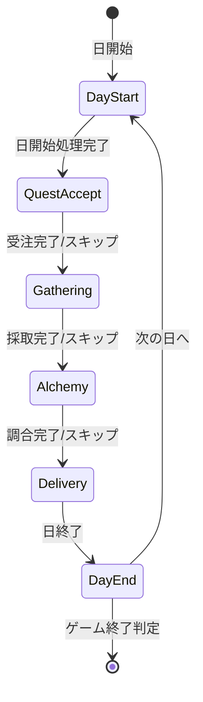

# メイン画面 設計概要

**バージョン**: 2.0.0
**作成日**: 2026-01-01
**更新日**: 2026-01-16
**画面ID**: SCR-002

---

## 1. 基本情報

| 項目 | 値 |
|------|-----|
| **画面ID** | SCR-002 |
| **画面名** | メイン画面 |
| **親画面** | タイトル画面（SCR-001） |
| **子画面** | ショップ画面（SCR-003）、昇格試験画面（SCR-004）、リザルト画面（SCR-005） |
| **責務** | メインゲームプレイ（4フェーズの進行） |

### 信頼性レベル

- 🔵 **青信号**: 要件定義書に記載
- 🟡 **黄信号**: 要件定義書から妥当な推測
- 🔴 **赤信号**: 要件定義書にない推測

---

## 2. 画面構成

メイン画面は4つのフェーズに応じて表示内容が変化する。

### 2.1 フェーズ一覧

| フェーズ | 設計文書 | 説明 |
|---------|----------|------|
| **依頼受注フェーズ** | [quest-accept.md](./quest-accept.md) | 依頼者から依頼を受注 |
| **採取フェーズ** | [gathering.md](./gathering.md) | ドラフト採取システムで素材獲得 |
| **調合フェーズ** | [alchemy.md](./alchemy.md) | レシピカードでアイテム調合 |
| **納品フェーズ** | [delivery.md](./delivery.md) | 完成品を依頼者に納品 |

### 2.2 共通コンポーネント

共通UIコンポーネントは [common-components.md](./common-components.md) を参照。

- ヘッダーUI（ランク、昇格ゲージ、日数、所持金、行動ポイント）
- サイドバーUI（依頼リスト、素材リスト、完成品リスト）
- フッターUI（フェーズインジケーター、手札表示、アクションボタン）

---

## 3. 基本レイアウト

```
┌─────────────────────────────────────────────────────────────────────────┐
│ ┌───────────────────────────────────────────────────────────────────┐   │
│ │ ヘッダー                                                          │   │
│ │ [ランク: G] [昇格ゲージ: ████████ 35/100] [残り: 25日] [💰 130G] [⚡ 3/3] │   │
│ └───────────────────────────────────────────────────────────────────┘   │
├─────────────────────────────────────────────────────────────────────────┤
│ ┌─────────────┐ ┌───────────────────────────────────────────────────┐   │
│ │ サイドバー  │ │                                                   │   │
│ │             │ │                                                   │   │
│ │ 【受注依頼】│ │             メインコンテンツエリア                │   │
│ │             │ │             （フェーズに応じて変化）              │   │
│ │ 【素材】    │ │                                                   │   │
│ │             │ │                                                   │   │
│ │ 【完成品】  │ │                                                   │   │
│ │             │ │                                                   │   │
│ │ [ショップ] │ │                                                   │   │
│ └─────────────┘ └───────────────────────────────────────────────────┘   │
├─────────────────────────────────────────────────────────────────────────┤
│ ┌───────────────────────────────────────────────────────────────────┐   │
│ │ フッター                                                          │   │
│ │ [依頼受注]●━━○[採取]━━○[調合]━━○[納品]                          │   │
│ │                                                                   │   │
│ │ 手札: [カード1][カード2][カード3][カード4][カード5]    [休憩][次へ]│   │
│ └───────────────────────────────────────────────────────────────────┘   │
└─────────────────────────────────────────────────────────────────────────┘
```

---

## 4. 1日の状態遷移



各フェーズの詳細な状態遷移は、それぞれの設計文書を参照のこと。

---

## 5. 設計文書一覧

| カテゴリ | 文書名 | 説明 |
|---------|--------|------|
| **フェーズUI** | [quest-accept.md](./quest-accept.md) | 依頼受注フェーズ詳細設計 |
| **フェーズUI** | [gathering.md](./gathering.md) | 採取フェーズ詳細設計（ドラフト採取） |
| **フェーズUI** | [alchemy.md](./alchemy.md) | 調合フェーズ詳細設計 |
| **フェーズUI** | [delivery.md](./delivery.md) | 納品フェーズ詳細設計 |
| **共通UI** | [common-components.md](./common-components.md) | ヘッダー、サイドバー、フッター等 |

---

## 関連文書

- **UI設計概要**: [../overview.md](../overview.md)
- **入力システム設計**: [../input-system.md](../input-system.md)
- **コアシステム設計書**: [../../core-systems-overview.md](../../core-systems-overview.md)
- **ゲームメカニクス設計書**: [../../game-mechanics.md](../../game-mechanics.md)
- **データフロー設計書**: [../../dataflow.md](../../dataflow.md)

---

## 変更履歴

| 日付 | バージョン | 変更内容 |
|------|----------|---------|
| 2026-01-01 | 1.0.0 | 初版作成 |
| 2026-01-01 | 1.1.0 | 採取フェーズをドラフト採取システムに変更 |
| 2026-01-02 | 1.2.0 | 「ランクHP」から「昇格ゲージ」への用語変更に対応 |
| 2026-01-16 | 2.0.0 | フェーズ別設計文書に分割、本文書を概要・インデックスに変更 |
