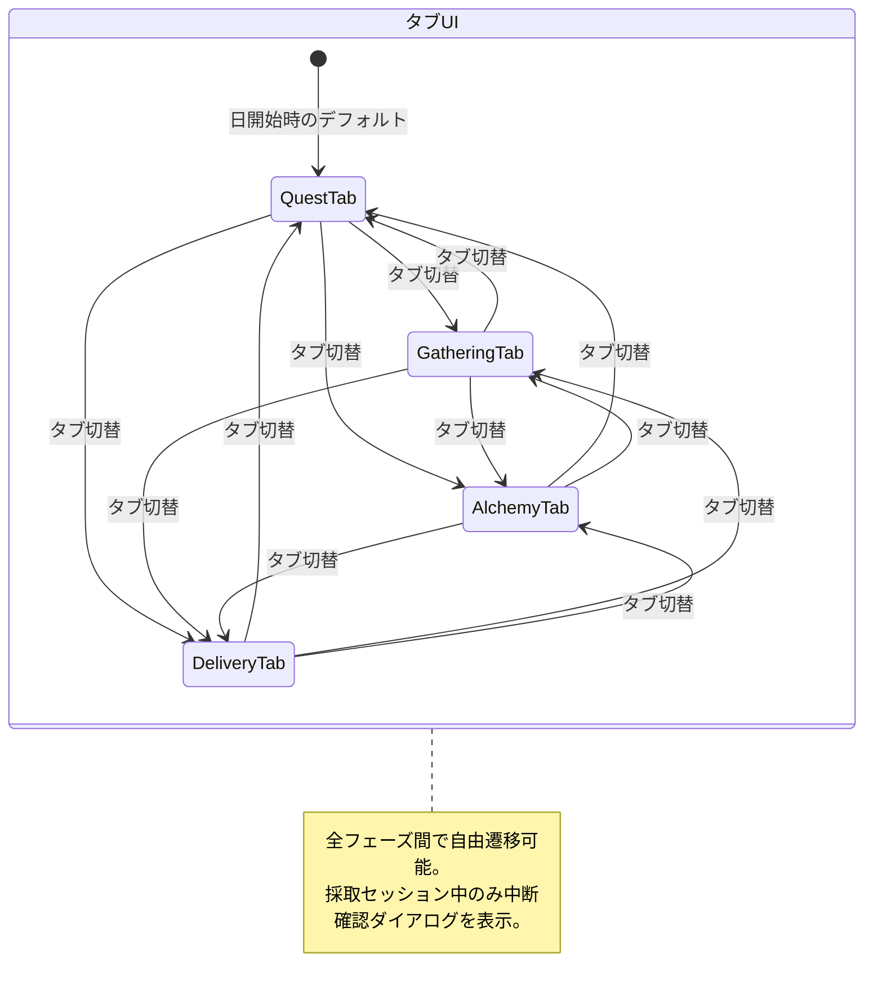

# フェーズタブUI 詳細設計

**バージョン**: 1.0.0
**作成日**: 2026-02-23
**更新日**: 2026-02-23
**コンポーネントID**: phase-tab-ui

---

## 1. 概要

### 1.1 基本情報

| 項目 | 値 |
|------|-----|
| **コンポーネント名** | フェーズタブUI (PhaseTabUI) |
| **親コンポーネント** | フッターUI (FooterUI) |
| **責務** | 4フェーズ間の自由遷移をタブUIで提供する |
| **要件** | REQ-006, REQ-006-01〜REQ-006-03, REQ-001 |
| **置き換え元** | フェーズステッパー（プログレスバー形式、v1.0.0で廃止） |

### 1.2 設計背景

フェーズ自由遷移システム（REQ-001）の導入に伴い、固定順序のプログレスバーをタブUIに変更する。タブクリックにより任意のフェーズへ即座に遷移可能とする。

### 1.3 信頼性レベル

- 🔵 **青信号**: 要件定義書に記載（REQ-006系）
- 🟡 **黄信号**: 要件定義書から妥当な推測
- 🔴 **赤信号**: 要件定義書にない推測

---

## 2. ワイヤーフレーム 🔵

### 2.1 タブUI基本表示

```
┌─────────────────────────────────────────────────────────────────┐
│ ┌──────────────┐┌──────────────┐┌──────────────┐┌──────────────┐│
│ │  📋 依頼     ││  🌿 採取     ││  ⚗️ 調合     ││  📦 納品     ││
│ │  (ACTIVE)    ││              ││              ││              ││
│ │  ■■■■■■■■   ││  ────────    ││  ────────    ││  ────────    ││
│ └──────────────┘└──────────────┘└──────────────┘└──────────────┘│
│  アンバー(#FFB300) ブルーグレー   ブルーグレー    ブルーグレー   │
└─────────────────────────────────────────────────────────────────┘
```

### 2.2 タブ切替後の状態（採取フェーズがアクティブ）

```
┌─────────────────────────────────────────────────────────────────┐
│ ┌──────────────┐┌──────────────┐┌──────────────┐┌──────────────┐│
│ │  📋 依頼     ││  🌿 採取     ││  ⚗️ 調合     ││  📦 納品     ││
│ │              ││  (ACTIVE)    ││              ││              ││
│ │  ────────    ││  ■■■■■■■■   ││  ────────    ││  ────────    ││
│ └──────────────┘└──────────────┘└──────────────┘└──────────────┘│
│  ブルーグレー    グリーン(#66BB6A) ブルーグレー    ブルーグレー   │
└─────────────────────────────────────────────────────────────────┘
```

### 2.3 通知バッジ表示

```
┌──────────────┐┌──────────────┐┌──────────────┐┌──────────────┐
│  📋 依頼 (2) ││  🌿 採取     ││  ⚗️ 調合     ││  📦 納品 (1) │
│  (ACTIVE)    ││              ││              ││              │
│  ■■■■■■■■   ││  ────────    ││  ────────    ││  ────────    │
└──────────────┘└──────────────┘└──────────────┘└──────────────┘
          ↑                                            ↑
    未受注依頼2件                               納品可能アイテム1件
```

### 2.4 フッター全体での配置

```
┌─────────────────────────────────────────────────────────────────────────┐
│ ┌───────────────────────────────────────────────────────────────────┐   │
│ │ [📋 依頼](active) [🌿 採取]       [⚗️ 調合]       [📦 納品]      │   │
│ │  アンバー          ブルーグレー     ブルーグレー     ブルーグレー  │   │
│ └───────────────────────────────────────────────────────────────────┘   │
│ ┌───────────────────────────────────────────────────────────────────┐   │
│ │ ┌─────┐ ┌─────┐ ┌─────┐ ┌─────┐ ┌─────┐    ┌──────┐ ┌──────┐   │   │
│ │ │カード│ │カード│ │カード│ │カード│ │カード│    │ 休憩 │ │日終了│   │   │
│ │ │  1  │ │  2  │ │  3  │ │  4  │ │  5  │    │      │ │      │   │   │
│ │ └─────┘ └─────┘ └─────┘ └─────┘ └─────┘    └──────┘ └──────┘   │   │
│ └───────────────────────────────────────────────────────────────────┘   │
└─────────────────────────────────────────────────────────────────────────┘
```

---

## 3. タブデザイン仕様 🔵

### 3.1 タブ構成要素

各タブは以下の要素で構成される。

```
┌──────────────┐
│  📋 依頼     │ ← アイコン + ラベル
│  (ACTIVE)    │ ← アクティブインジケーター
│  ■■■■■■■■   │ ← アクティブバー（フェーズ色）
└──────────────┘
```

### 3.2 タブ一覧

| フェーズ | アイコン | ラベル | アクティブ色 | カラーコード | 信頼性 |
|---------|---------|-------|-------------|-------------|--------|
| 依頼受注 | 📋 | 依頼 | アンバー | #FFB300 / 0xFFB300 | 🔵 |
| 採取 | 🌿 | 採取 | グリーン | #66BB6A / 0x66BB6A | 🔵 |
| 調合 | ⚗️ | 調合 | パープル | #AB47BC / 0xAB47BC | 🔵 |
| 納品 | 📦 | 納品 | ブルー | #42A5F5 / 0x42A5F5 | 🔵 |
| 非アクティブ共通 | - | - | ブルーグレー | #546E7A / 0x546E7A | 🔵 |

### 3.3 アイコン実装方針 🟡

| 方式 | 説明 | 推奨度 |
|------|------|--------|
| **テキスト絵文字** | Phaserテキストとして絵文字を表示 | ◎（初期実装） |
| **スプライトアイコン** | テクスチャアトラスからアイコンを表示 | ○（将来対応） |

初期実装ではテキスト絵文字を使用し、アセットが整った段階でスプライトアイコンに移行する。

---

## 4. タブ状態 🔵

### 4.1 状態定義

```typescript
enum PhaseTabState {
  ACTIVE = 'active',      // 現在表示中のフェーズ
  INACTIVE = 'inactive',  // 非表示のフェーズ
}
```

### 4.2 状態別スタイル

| プロパティ | ACTIVE | INACTIVE | 信頼性 |
|-----------|--------|----------|--------|
| **背景色** | フェーズ固有色（半透明20%） | 透明 | 🟡 |
| **テキスト色** | #FFFFFF（白） | #B0BEC5（灰白） | 🔵 |
| **テキスト太さ** | Bold | Normal | 🔵 |
| **下線バー** | フェーズ固有色（3px） | なし | 🟡 |
| **アイコン不透明度** | 1.0 | 0.6 | 🟡 |

### 4.3 アクティブタブ視覚デザイン

```
ACTIVE状態:
┌──────────────────┐
│ ┌──────────────┐ │  ← 背景: フェーズ色 alpha 20%
│ │ 📋 依頼      │ │  ← テキスト: 白、太字
│ │              │ │
│ │ ■■■■■■■■■■ │ │  ← 下線バー: フェーズ色 3px
│ └──────────────┘ │
└──────────────────┘

INACTIVE状態:
┌──────────────────┐
│ ┌──────────────┐ │  ← 背景: 透明
│ │ 🌿 採取      │ │  ← テキスト: #B0BEC5、通常太さ
│ │              │ │
│ │              │ │  ← 下線バーなし
│ └──────────────┘ │
└──────────────────┘
```

---

## 5. タブ切替アニメーション 🟡

### 5.1 アニメーション一覧

| アニメーション | トリガー | 説明 | 時間 | イージング | 信頼性 |
|---------------|---------|------|------|-----------|--------|
| タブ背景色遷移 | タブクリック時 | 旧アクティブタブの背景色がフェードアウト、新タブの背景色がフェードイン | 200ms | Quad.Out | 🟡 |
| 下線バースライド | タブクリック時 | 下線バーが旧タブから新タブへスライド移動 | 250ms | Cubic.Out | 🟡 |
| テキスト色遷移 | タブクリック時 | 旧タブのテキストが灰白に、新タブのテキストが白に | 150ms | Linear | 🟡 |
| メインコンテンツ切替 | タブクリック時 | 旧フェーズUIがフェードアウト→新フェーズUIがフェードイン | 200ms | Quad.InOut | 🟡 |

### 5.2 タブ切替アニメーション詳細

```typescript
// タブ切替アニメーション（想定実装）
async switchTab(fromPhase: GamePhase, toPhase: GamePhase): Promise<void> {
  const fromTab = this.getTab(fromPhase);
  const toTab = this.getTab(toPhase);

  // 1. 旧タブの非アクティブ化（並行）
  this.tweens.add({
    targets: fromTab.background,
    alpha: 0,
    duration: 200,
    ease: 'Quad.Out',
  });
  this.tweens.add({
    targets: fromTab.label,
    tint: 0xB0BEC5,
    duration: 150,
    ease: 'Linear',
  });

  // 2. 下線バーのスライド移動
  await this.tweens.add({
    targets: this.activeBar,
    x: toTab.x,
    width: toTab.width,
    duration: 250,
    ease: 'Cubic.Out',
  }).toPromise();

  // 3. 新タブのアクティブ化（並行）
  this.tweens.add({
    targets: toTab.background,
    alpha: 0.2,
    fillColor: PHASE_TAB_COLORS[toPhase],
    duration: 200,
    ease: 'Quad.Out',
  });
  this.tweens.add({
    targets: toTab.label,
    tint: 0xFFFFFF,
    duration: 150,
    ease: 'Linear',
  });
}
```

### 5.3 メインコンテンツ切替アニメーション

```typescript
// メインコンテンツ切替（想定実装）
async switchPhaseContent(fromPhase: GamePhase, toPhase: GamePhase): Promise<void> {
  const fromContainer = this.getPhaseContainer(fromPhase);
  const toContainer = this.getPhaseContainer(toPhase);

  // 旧フェーズUIをフェードアウト
  await this.tweens.add({
    targets: fromContainer,
    alpha: { from: 1, to: 0 },
    duration: 100,
    ease: 'Quad.In',
  }).toPromise();

  fromContainer.setVisible(false);
  toContainer.setVisible(true);
  toContainer.setAlpha(0);

  // 新フェーズUIをフェードイン
  await this.tweens.add({
    targets: toContainer,
    alpha: { from: 0, to: 1 },
    duration: 100,
    ease: 'Quad.Out',
  }).toPromise();
}
```

### 5.4 パフォーマンス要件

| 指標 | 目標値 | 根拠 | 信頼性 |
|------|--------|------|--------|
| タブクリック→UI表示完了 | < 200ms | NFR-001 | 🟡 |
| アニメーション合計時間 | < 300ms | タブ切替 + コンテンツ切替 | 🟡 |

---

## 6. 通知バッジ 🟡

### 6.1 バッジ表示条件

| フェーズ | バッジ内容 | 表示条件 | 信頼性 |
|---------|-----------|---------|--------|
| 依頼 | 未受注依頼件数 | 掲示板に未受注の依頼がある場合 | 🟡 |
| 採取 | なし | - | 🟡 |
| 調合 | 調合可能レシピ数 | 手持ち素材で作成可能なレシピがある場合 | 🟡 |
| 納品 | 納品可能件数 | 完成品を持っており、対応する受注依頼がある場合 | 🟡 |

### 6.2 バッジデザイン

```
┌──────────────┐
│  📋 依頼 (2) │ ← バッジ: 数字を括弧で表示
└──────────────┘

または

┌──────────────┐
│  📋 依頼  🔴 │ ← バッジ: ドットインジケーター
│           2  │
└──────────────┘
```

### 6.3 バッジスタイル

| プロパティ | 値 | 信頼性 |
|-----------|-----|--------|
| **表示形式** | タブラベル右上に丸バッジ | 🟡 |
| **バッジ背景色** | #EF4444（赤） | 🟡 |
| **バッジテキスト色** | #FFFFFF（白） | 🟡 |
| **バッジサイズ** | 直径16px | 🟡 |
| **バッジフォント** | 10px、Bold | 🟡 |
| **表示上限** | 9+（9件超の場合は「9+」） | 🟡 |

### 6.4 バッジ更新タイミング

| トリガー | 更新対象 | イベント |
|---------|---------|---------|
| 依頼追加・受注・期限切れ | 依頼タブ | `QUEST_ADDED`, `QUEST_ACCEPTED`, `QUEST_EXPIRED` |
| 素材獲得・消費 | 調合タブ | `MATERIAL_ADDED`, `MATERIAL_CONSUMED` |
| アイテム調合完了・納品 | 納品タブ | `ITEM_CRAFTED`, `QUEST_COMPLETED` |

---

## 7. キーボードナビゲーション 🟡

### 7.1 WAI-ARIA Tabパターン

PhaserはブラウザネイティブなアクセシビリティAPIを直接サポートしないが、WAI-ARIA Tabパターンに準拠したキーボード操作を実装する。

### 7.2 キーバインド

| キー | 動作 | 信頼性 |
|------|------|--------|
| `←` / `→` | 前後のタブにフォーカス移動 | 🟡 |
| `Enter` / `Space` | フォーカス中のタブをアクティブ化 | 🟡 |
| `Home` | 最初のタブ（依頼）にフォーカス | 🟡 |
| `End` | 最後のタブ（納品）にフォーカス | 🟡 |
| `1` / `2` / `3` / `4` | 各タブに直接切り替え（1=依頼, 2=採取, 3=調合, 4=納品） | 🟡 |

### 7.3 フォーカス表示

```
通常状態:
┌──────────────┐
│  🌿 採取     │
└──────────────┘

フォーカス状態:
┌══════════════┐  ← フォーカスリング: PRIMARY色(#6366F1), 2px
║  🌿 採取     ║
└══════════════┘
```

| プロパティ | 値 | 信頼性 |
|-----------|-----|--------|
| **フォーカスリング色** | #6366F1（PRIMARY） | 🟡 |
| **フォーカスリング太さ** | 2px | 🟡 |
| **フォーカスリングオフセット** | 2px（タブ外側） | 🟡 |

### 7.4 キーボードナビゲーション実装

```typescript
// キーボードナビゲーション（想定実装）
private setupKeyboardNavigation(): void {
  this.scene.input.keyboard?.on('keydown', (event: KeyboardEvent) => {
    switch (event.key) {
      case 'ArrowLeft':
        this.moveFocus(-1);
        break;
      case 'ArrowRight':
        this.moveFocus(1);
        break;
      case 'Enter':
      case ' ':
        this.activateFocusedTab();
        break;
      case 'Home':
        this.setFocus(0); // 依頼タブ
        break;
      case 'End':
        this.setFocus(3); // 納品タブ
        break;
      case '1': case '2': case '3': case '4':
        this.activateTab(Number(event.key) - 1);
        break;
    }
  });
}

private moveFocus(direction: number): void {
  const phaseCount = 4;
  this.focusedIndex = (this.focusedIndex + direction + phaseCount) % phaseCount;
  this.updateFocusVisual();
}
```

---

## 8. ゲームパッドサポート 🟡

### 8.1 ボタンマッピング

| ボタン | 動作 | 信頼性 |
|--------|------|--------|
| **L1 / LB** | 前のタブへ切り替え | 🟡 |
| **R1 / RB** | 次のタブへ切り替え | 🟡 |
| **十字キー左右** | タブフォーカス移動 | 🟡 |
| **A / ×ボタン** | フォーカス中のタブをアクティブ化 | 🟡 |

### 8.2 L1/R1切替の挙動

L1/R1によるタブ切替はフォーカス移動とアクティブ化を同時に行う（即座に切替）。

```
現在: [依頼](active) [採取] [調合] [納品]
  ↓ R1押下
結果: [依頼] [採取](active) [調合] [納品]
  ↓ R1押下
結果: [依頼] [採取] [調合](active) [納品]
  ↓ L1押下
結果: [依頼] [採取](active) [調合] [納品]
```

### 8.3 ループ切替

タブの端に達した場合はループする。

```
現在: [依頼] [採取] [調合] [納品](active)
  ↓ R1押下
結果: [依頼](active) [採取] [調合] [納品]  ← ループ
```

### 8.4 ゲームパッド実装

```typescript
// ゲームパッドサポート（想定実装）
private setupGamepadSupport(): void {
  this.scene.input.gamepad?.on('down', (
    pad: Phaser.Input.Gamepad.Gamepad,
    button: Phaser.Input.Gamepad.Button,
  ) => {
    // L1 (index 4) / R1 (index 5) でタブ切替
    if (button.index === 4) {
      this.switchToPreviousTab();
    } else if (button.index === 5) {
      this.switchToNextTab();
    }
  });
}
```

---

## 9. 採取セッション中の切替制御 🔵

### 9.1 中断確認ダイアログ

採取ドラフトセッション中（`GatheringStage.DRAFT_SESSION`）にタブを切り替える場合、中断確認ダイアログを表示する（REQ-001-03）。

```
┌─────────────────────────────────┐
│      採取を中断しますか？       │
├─────────────────────────────────┤
│                                 │
│   採取セッションが進行中です。  │
│   中断すると獲得済み素材は      │
│   失われます。                  │
│                                 │
│ ┌───────────┐   ┌───────────┐   │
│ │ 続ける    │   │ 中断する  │   │
│ └───────────┘   └───────────┘   │
└─────────────────────────────────┘
```

### 9.2 制御ロジック

```typescript
// タブクリック時の切替制御（想定実装）
async handleTabClick(targetPhase: GamePhase): Promise<void> {
  const currentPhase = this.stateManager.getState().currentPhase;
  if (targetPhase === currentPhase) return;

  // 採取セッション中の場合、中断確認を表示
  if (currentPhase === GamePhase.GATHERING && this.isInDraftSession()) {
    const confirmed = await this.showConfirmDialog({
      title: '採取を中断しますか？',
      message: '採取セッションが進行中です。中断すると獲得済み素材は失われます。',
      confirmLabel: '中断する',
      cancelLabel: '続ける',
      isDestructive: true,
    });

    if (!confirmed) return;
    this.abortDraftSession();
  }

  // フェーズ切替実行
  this.eventBus.emit(GameEventType.PHASE_TAB_CLICKED, { targetPhase });
  await this.switchTab(currentPhase, targetPhase);
}
```

---

## 10. 型定義 🔵

### 10.1 コンポーネントProps

```typescript
interface PhaseTabUIProps {
  phases: PhaseTabInfo[];
  currentPhase: GamePhase;
  onPhaseSelect: (phase: GamePhase) => void;
}

interface PhaseTabInfo {
  phase: GamePhase;
  label: string;          // 表示ラベル（「依頼」「採取」等）
  icon: string;           // アイコン（絵文字またはテクスチャキー）
  activeColor: number;    // フェーズ固有のアクティブ色
}
```

### 10.2 フェーズ列挙型

```typescript
enum GamePhase {
  QUEST_ACCEPT = 'quest_accept',
  GATHERING = 'gathering',
  ALCHEMY = 'alchemy',
  DELIVERY = 'delivery',
}
```

### 10.3 カラー定数

```typescript
const PHASE_TAB_COLORS: Record<GamePhase, number> = {
  [GamePhase.QUEST_ACCEPT]: 0xFFB300, // アンバー
  [GamePhase.GATHERING]: 0x66BB6A,    // グリーン
  [GamePhase.ALCHEMY]: 0xAB47BC,      // パープル
  [GamePhase.DELIVERY]: 0x42A5F5,     // ブルー
};

const PHASE_TAB_INACTIVE_COLOR = 0x546E7A; // ブルーグレー
```

### 10.4 通知バッジ型

```typescript
interface PhaseTabBadge {
  phase: GamePhase;
  count: number;          // 0の場合は非表示
}
```

---

## 11. イベント 🔵

| イベント名 | トリガー | ペイロード | 信頼性 |
|-----------|---------|-----------|--------|
| `PHASE_TAB_CLICKED` | タブクリック/キーボード/ゲームパッド | `{ targetPhase: GamePhase }` | 🔵 |
| `PHASE_TRANSITION` | フェーズ遷移完了時 | `{ from: GamePhase, to: GamePhase }` | 🔵 |
| `PHASE_CHANGED` | StateManager経由のフェーズ変更 | `{ previousPhase: GamePhase, newPhase: GamePhase }` | 🔵 |

---

## 12. 状態遷移図 🔵



---

## 13. エラーハンドリング 🟡

| エラーケース | 原因 | 対処 | 信頼性 |
|------------|------|------|--------|
| 同一タブの二重クリック | ユーザーの誤操作 | 何もしない（早期リターン） | 🟡 |
| アニメーション中のクリック | 連打 | アニメーション完了まで入力を無視（ロックフラグ） | 🟡 |
| ゲームパッド未接続 | デバイス不在 | ゲームパッドイベントが発生しないため無影響 | 🟡 |

---

## 14. パフォーマンス考慮 🟡

| 項目 | 対策 | 信頼性 |
|------|------|--------|
| タブ切替応答 | 200ms以内にUI表示完了（NFR-001） | 🟡 |
| バッジ更新 | イベント駆動で変更時のみ更新 | 🟡 |
| アニメーション | Tween再利用、不要なオブジェクト生成なし | 🟡 |
| フェーズコンテナ | 非アクティブフェーズは`setVisible(false)`で非表示 | 🟡 |

---

## 関連文書

- **共通コンポーネント（フッターUI）**: [common-components.md](./common-components.md)
- **メイン画面概要**: [main.md](./main.md)
- **フェーズ自由遷移要件定義書**: [../../../spec/free-phase-navigation/requirements.md](../../../spec/free-phase-navigation/requirements.md)
- **入力システム設計**: [../input-system.md](../input-system.md)

---

## 変更履歴

| 日付 | バージョン | 変更内容 |
|------|----------|---------|
| 2026-02-23 | 1.0.0 | 初版作成（Issue #306: タブUI詳細デザイン仕様） |
