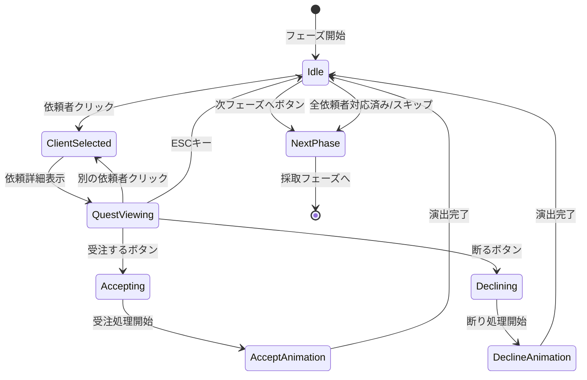

# 依頼受注フェーズ 詳細設計

**バージョン**: 1.0.0
**作成日**: 2026-01-16
**更新日**: 2026-01-16
**フェーズID**: PHASE-001

---

## 1. 概要

### 1.1 基本情報

| 項目 | 値 |
|------|-----|
| **フェーズ名** | 依頼受注フェーズ（Quest Accept Phase） |
| **親画面** | メイン画面（SCR-002） |
| **責務** | 今日の依頼者表示、依頼内容確認、受注/断る判断 |
| **前フェーズ** | 日開始処理 |
| **次フェーズ** | 採取フェーズ |

### 1.2 信頼性レベル

- 🔵 **青信号**: 要件定義書に記載
- 🟡 **黄信号**: 要件定義書から妥当な推測
- 🔴 **赤信号**: 要件定義書にない推測

---

## 2. ワイヤーフレーム 🔵

### 2.1 依頼者一覧・依頼詳細画面

```
┌───────────────────────────────────────────────────────────┐
│                    今日の依頼者                           │
├───────────────────────────────────────────────────────────┤
│                                                           │
│   ┌─────────┐     ┌─────────┐     ┌─────────┐           │
│   │ 👤村人  │     │ 🗡冒険者│     │         │           │
│   │   [選択中]    │         │     │ (空き)  │           │
│   └─────────┘     └─────────┘     └─────────┘           │
│                                                           │
├───────────────────────────────────────────────────────────┤
│                   村人の依頼                              │
│  ┌─────────────────────────────────────────────────────┐ │
│  │ 「何か薬が欲しいんだ」                              │ │
│  │                                                     │ │
│  │ ┌─────────────────────────────────────────────────┐ │ │
│  │ │ 依頼タイプ: カテゴリ（薬）                      │ │ │
│  │ │ 報酬:                                           │ │ │
│  │ │   貢献度: 15                                    │ │ │
│  │ │   お金: 30G                                     │ │ │
│  │ │ 期限: 5日後                                     │ │ │
│  │ └─────────────────────────────────────────────────┘ │ │
│  │                                                     │ │
│  │          [受注する]    [断る]                       │ │
│  └─────────────────────────────────────────────────────┘ │
│                                                           │
│              [次のフェーズへ]                             │
└───────────────────────────────────────────────────────────┘
```

### 2.2 依頼者未選択時

```
┌───────────────────────────────────────────────────────────┐
│                    今日の依頼者                           │
├───────────────────────────────────────────────────────────┤
│                                                           │
│   ┌─────────┐     ┌─────────┐     ┌─────────┐           │
│   │ 👤村人  │     │ 🗡冒険者│     │ 🧙魔法使い│          │
│   │         │     │         │     │         │           │
│   └─────────┘     └─────────┘     └─────────┘           │
│                                                           │
├───────────────────────────────────────────────────────────┤
│                                                           │
│       依頼者を選択すると、依頼内容が表示されます         │
│                                                           │
│              [次のフェーズへ]                             │
└───────────────────────────────────────────────────────────┘
```

---

## 3. UIコンポーネント詳細 🔵

### 3.1 依頼者スロット (`client-slots`)

#### コンテナ構成

| プロパティ | 値 | 信頼性 |
|-----------|-----|--------|
| **配置** | 水平方向、等間隔 | 🔵 |
| **スロット数** | 1〜3個（ランクに応じて増加） | 🔵 |
| **スロットサイズ** | 120x120px | 🟡 |
| **間隔** | 24px | 🟡 |

#### 依頼者カード (`client-card`)

```typescript
interface ClientCardProps {
  clientId: string;         // 依頼者ID
  clientType: ClientType;   // 依頼者タイプ（村人/冒険者/商人/貴族）
  icon: string;             // アイコン絵文字またはアセットパス
  name: string;             // 表示名
  isSelected: boolean;      // 選択状態
  hasActiveQuest: boolean;  // 既に受注済みかどうか
}
```

| 状態 | 表示スタイル | 信頼性 |
|------|-------------|--------|
| 未選択 | 背景: #E0E0E0、枠線: #999999 | 🟡 |
| 選択中 | 背景: #FFF8E1、枠線: #FFC107（太さ3px）、影あり | 🟡 |
| 受注済み | 背景: #C8E6C9、枠線: #4CAF50、チェックマーク表示 | 🟡 |
| 空きスロット | 背景: #F5F5F5、枠線: 点線#CCCCCC | 🟡 |

#### rexUI実装パターン 🟡

```typescript
// GridSizerを使用した依頼者スロット配置
const clientGrid = this.rexUI.add.gridSizer({
  x: centerX,
  y: 150,
  column: 3,
  row: 1,
  columnProportions: 1,
  space: {
    column: 24,
  },
});

// 各スロットにクライアントカードを追加
clients.forEach((client, index) => {
  const clientCard = this.createClientCard(client);
  clientGrid.add(clientCard, { column: index, row: 0 });
});
```

### 3.2 依頼詳細パネル (`quest-detail`)

#### パネル構成

| プロパティ | 値 | 信頼性 |
|-----------|-----|--------|
| **幅** | 親コンテナの80% | 🟡 |
| **高さ** | 自動（コンテンツに応じて） | 🟡 |
| **背景色** | #FFFDE7 | 🟡 |
| **枠線** | 2px solid #FFD54F | 🟡 |
| **角丸** | 8px | 🟡 |
| **パディング** | 16px | 🟡 |

#### 依頼情報表示

```typescript
interface QuestDetailDisplayProps {
  questId: string;          // 依頼ID
  clientName: string;       // 依頼者名
  dialogue: string;         // 依頼者のセリフ
  questType: QuestType;     // 依頼タイプ（個別/カテゴリ/タグ）
  targetDescription: string; // 要求内容の説明
  rewardContribution: number; // 報酬貢献度
  rewardGold: number;       // 報酬お金
  deadline: number;         // 期限（日数）
  difficulty: string;       // 難易度表示（任意）
}
```

#### 依頼タイプ別表示 🔵

| 依頼タイプ | 表示テキスト例 | 信頼性 |
|-----------|--------------|--------|
| 個別指定 | 「回復薬」が欲しい | 🔵 |
| カテゴリ | 「薬」カテゴリの何か | 🔵 |
| タグ指定 | 「水属性」のアイテム | 🔵 |

### 3.3 アクションボタン群

#### 受注ボタン (`btn-accept`)

| プロパティ | 値 | 信頼性 |
|-----------|-----|--------|
| **種類** | プライマリボタン | 🔵 |
| **幅** | 120px | 🟡 |
| **高さ** | 44px | 🟡 |
| **背景色** | #4CAF50 | 🟡 |
| **ホバー色** | #45A049 | 🟡 |
| **テキスト** | 「受注する」| 🔵 |
| **フォント** | 游ゴシック, 14px, Bold | 🟡 |

#### 断るボタン (`btn-decline`)

| プロパティ | 値 | 信頼性 |
|-----------|-----|--------|
| **種類** | セカンダリボタン | 🔵 |
| **幅** | 120px | 🟡 |
| **高さ** | 44px | 🟡 |
| **背景色** | #E0E0E0 | 🟡 |
| **ホバー色** | #BDBDBD | 🟡 |
| **テキスト** | 「断る」| 🔵 |
| **フォント** | 游ゴシック, 14px | 🟡 |

#### 次フェーズボタン (`btn-next-phase`)

| プロパティ | 値 | 信頼性 |
|-----------|-----|--------|
| **種類** | ナビゲーションボタン | 🔵 |
| **幅** | 200px | 🟡 |
| **高さ** | 48px | 🟡 |
| **背景色** | #2196F3 | 🟡 |
| **ホバー色** | #1976D2 | 🟡 |
| **テキスト** | 「次のフェーズへ」| 🔵 |
| **配置** | 画面下部中央 | 🟡 |

---

## 4. 状態遷移 🔵

### 4.1 状態遷移図



### 4.2 状態定義

| 状態 | 説明 | UI表示 |
|------|------|--------|
| `Idle` | 初期状態、依頼者選択待ち | 依頼者一覧のみ表示 |
| `ClientSelected` | 依頼者選択済み | 選択カードハイライト |
| `QuestViewing` | 依頼詳細表示中 | 依頼詳細パネル表示 |
| `Accepting` | 受注処理中 | ボタン非活性、処理中表示 |
| `Declining` | 断り処理中 | ボタン非活性、処理中表示 |
| `AcceptAnimation` | 受注演出中 | 成功演出再生 |
| `DeclineAnimation` | 断り演出中 | 断り演出再生 |
| `NextPhase` | 次フェーズへ遷移中 | フェード演出 |

---

## 5. イベント詳細 🔵

### 5.1 入力イベント

| イベント名 | トリガー | 処理内容 | 信頼性 |
|-----------|----------|----------|--------|
| `OnClientClicked` | 依頼者カードクリック | 依頼者選択、詳細表示 | 🔵 |
| `OnAcceptClicked` | 受注ボタンクリック | 受注処理実行 | 🔵 |
| `OnDeclineClicked` | 断るボタンクリック | 断り処理実行 | 🔵 |
| `OnNextPhaseClicked` | 次フェーズボタンクリック | 採取フェーズへ遷移 | 🔵 |
| `OnEscapePressed` | ESCキー押下 | 選択解除/詳細閉じる | 🟡 |

### 5.2 ビジネスイベント（EventBus）

| イベント名 | ペイロード | 発火タイミング | 信頼性 |
|-----------|-----------|---------------|--------|
| `QUEST_ACCEPTED` | `{ questId, clientId }` | 受注完了時 | 🔵 |
| `QUEST_DECLINED` | `{ clientId }` | 断り完了時 | 🔵 |
| `PHASE_TRANSITION_REQUESTED` | `{ from: 'quest_accept', to: 'gathering' }` | 次フェーズボタン押下時 | 🔵 |
| `CLIENT_SELECTED` | `{ clientId }` | 依頼者選択時 | 🟡 |

### 5.3 イベントハンドラ実装 🟡

```typescript
// QuestAcceptContainer.ts
export class QuestAcceptContainer extends BasePhaseContainer {
  private eventBus: IEventBus;
  private selectedClientId: string | null = null;

  constructor(scene: Phaser.Scene, eventBus: IEventBus) {
    super(scene);
    this.eventBus = eventBus;
    this.setupEventListeners();
  }

  private setupEventListeners(): void {
    // 依頼者選択
    this.on('client-clicked', (clientId: string) => {
      this.selectedClientId = clientId;
      this.eventBus.emit('CLIENT_SELECTED', { clientId });
      this.showQuestDetail(clientId);
    });

    // 受注
    this.on('accept-clicked', async () => {
      if (!this.selectedClientId) return;
      await this.handleAccept(this.selectedClientId);
    });

    // 断る
    this.on('decline-clicked', async () => {
      if (!this.selectedClientId) return;
      await this.handleDecline(this.selectedClientId);
    });
  }

  private async handleAccept(clientId: string): Promise<void> {
    this.setState('Accepting');

    // UseCaseを呼び出し
    const result = await this.acceptQuestUseCase.execute({ clientId });

    if (result.success) {
      await this.playAcceptAnimation();
      this.eventBus.emit('QUEST_ACCEPTED', {
        questId: result.questId,
        clientId
      });
    }

    this.setState('Idle');
  }
}
```

---

## 6. アニメーション詳細 🟡

### 6.1 依頼者カード選択アニメーション

| プロパティ | 開始値 | 終了値 | 時間 | イージング |
|-----------|-------|-------|------|-----------|
| scale | 1.0 | 1.05 | 150ms | Quad.Out |
| y | 0 | -8 | 150ms | Quad.Out |
| shadow.blur | 4 | 12 | 150ms | Linear |

### 6.2 依頼詳細パネル表示アニメーション

| プロパティ | 開始値 | 終了値 | 時間 | イージング |
|-----------|-------|-------|------|-----------|
| alpha | 0 | 1 | 200ms | Quad.Out |
| y | +30 | 0 | 200ms | Back.Out |
| scale | 0.95 | 1.0 | 200ms | Back.Out |

### 6.3 受注成功アニメーション

```typescript
// 受注成功時のアニメーションシーケンス
private async playAcceptAnimation(): Promise<void> {
  // 1. ボタンに成功エフェクト
  await this.tweenButton('accept', {
    scale: [1.0, 1.1, 1.0],
    duration: 200
  });

  // 2. 依頼者カードにチェックマーク表示
  const checkmark = this.createCheckmark(this.selectedClientCard);
  await this.tweens.add({
    targets: checkmark,
    scale: { from: 0, to: 1 },
    alpha: { from: 0, to: 1 },
    duration: 300,
    ease: 'Back.Out',
  }).toPromise();

  // 3. 依頼詳細パネルを閉じる
  await this.tweens.add({
    targets: this.questDetailPanel,
    alpha: 0,
    y: '+=20',
    duration: 200,
    ease: 'Quad.In',
  }).toPromise();

  // 4. サイドバーの依頼リスト更新（Toast通知）
  this.eventBus.emit('TOAST_SHOW', {
    message: '依頼を受注しました',
    type: 'success',
    duration: 2000,
  });
}
```

### 6.4 断りアニメーション

| プロパティ | 開始値 | 終了値 | 時間 | イージング |
|-----------|-------|-------|------|-----------|
| カードalpha | 1.0 | 0.5 | 300ms | Quad.Out |
| カードscale | 1.0 | 0.95 | 300ms | Quad.Out |
| パネルfade | 1.0 | 0 | 200ms | Quad.In |

---

## 7. データモデル 🔵

### 7.1 依頼者データ

```typescript
interface Client {
  id: string;
  type: ClientType;
  name: string;
  icon: string;
  quest: Quest;
}

enum ClientType {
  VILLAGER = 'villager',     // 村人
  ADVENTURER = 'adventurer', // 冒険者
  MERCHANT = 'merchant',     // 商人
  NOBLE = 'noble',           // 貴族
}
```

### 7.2 依頼データ

```typescript
interface Quest {
  id: string;
  clientId: string;
  type: QuestType;
  targetId?: string;         // 個別指定時のアイテムID
  targetCategory?: string;   // カテゴリ指定時
  targetTag?: string;        // タグ指定時
  dialogue: string;          // 依頼者のセリフ
  rewardContribution: number;
  rewardGold: number;
  deadline: number;          // 残り日数
  acceptedDay?: number;      // 受注した日
  status: QuestStatus;
}

enum QuestType {
  SPECIFIC = 'specific',     // 個別指定
  CATEGORY = 'category',     // カテゴリ
  TAG = 'tag',               // タグ
}

enum QuestStatus {
  AVAILABLE = 'available',   // 受注可能
  ACCEPTED = 'accepted',     // 受注済み
  COMPLETED = 'completed',   // 納品済み
  FAILED = 'failed',         // 失敗（期限切れ）
}
```

### 7.3 フェーズ状態データ

```typescript
interface QuestAcceptPhaseState {
  clients: Client[];
  selectedClientId: string | null;
  acceptedQuestIds: string[];
  canProceed: boolean;       // 次フェーズへ進めるか
}
```

---

## 8. アクセシビリティ 🟡

### 8.1 キーボード操作

| キー | 動作 | 信頼性 |
|------|------|--------|
| `1-3` | 対応する位置の依頼者を選択 | 🟡 |
| `Enter` | 選択中の依頼を受注 | 🟡 |
| `Escape` | 選択解除/詳細閉じる | 🟡 |
| `D` | 選択中の依頼を断る | 🟡 |
| `N` | 次のフェーズへ | 🟡 |

### 8.2 フォーカス順序

1. 依頼者カード群（左から右）
2. 依頼詳細パネル（表示時）
   - 受注ボタン
   - 断るボタン
3. 次フェーズボタン

### 8.3 スクリーンリーダー対応

```typescript
// ARIA属性の設定例
clientCard.setAccessibility({
  role: 'button',
  label: `${client.name}の依頼。${quest.dialogue}`,
  description: `報酬: 貢献度${quest.rewardContribution}、${quest.rewardGold}ゴールド。期限: ${quest.deadline}日`,
});
```

---

## 9. エラーハンドリング 🟡

### 9.1 エラーケース

| エラー | 原因 | 対処 |
|--------|------|------|
| 受注上限超過 | 受注できる依頼数を超えている | Toast表示「これ以上依頼を受けられません」 |
| 受注処理失敗 | サーバーエラー等 | Toast表示「受注に失敗しました」、リトライ可能 |
| データ不整合 | 依頼者データが不正 | 空きスロットとして表示、ログ出力 |

### 9.2 エラー表示

```typescript
// エラー時のToast表示
this.eventBus.emit('TOAST_SHOW', {
  message: 'これ以上依頼を受けられません',
  type: 'warning',
  duration: 3000,
});
```

---

## 10. パフォーマンス考慮 🟡

### 10.1 最適化ポイント

| 項目 | 対策 |
|------|------|
| 依頼者カード生成 | オブジェクトプール使用 |
| アニメーション | Tween再利用 |
| イベントリスナー | フェーズ終了時に必ず解除 |
| メモリリーク | destroy時にすべての参照をクリア |

### 10.2 目標パフォーマンス

| 指標 | 目標値 |
|------|--------|
| フェーズ初期化 | < 100ms |
| カード選択反応 | < 16ms |
| 受注処理完了 | < 500ms |
| メモリ使用量 | < 10MB（フェーズ単体） |

---

## 関連文書

- **メイン画面概要**: [main.md](./main.md)
- **共通コンポーネント**: [common-components.md](./common-components.md)
- **ゲームメカニクス**: [../../game-mechanics.md](../../game-mechanics.md)
- **データフロー設計**: [../../dataflow.md](../../dataflow.md)

---

## 変更履歴

| 日付 | バージョン | 変更内容 |
|------|----------|---------|
| 2026-01-16 | 1.0.0 | main.mdから分割、詳細化 |
