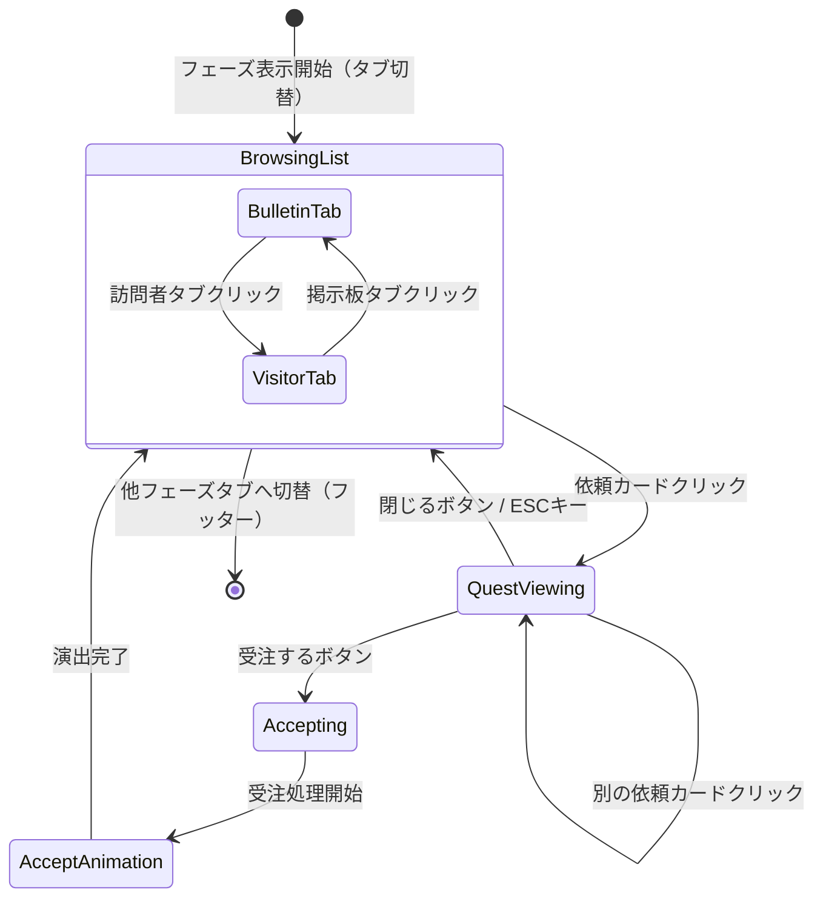

# 依頼受注フェーズ 詳細設計

**バージョン**: 1.1.0
**作成日**: 2026-01-16
**更新日**: 2026-02-23
**フェーズID**: PHASE-001

---

## 1. 概要

### 1.1 基本情報

| 項目 | 値 |
|------|-----|
| **フェーズ名** | 依頼受注フェーズ（Quest Accept Phase） |
| **親画面** | メイン画面（SCR-002） |
| **責務** | 掲示板＋訪問依頼の表示、依頼内容確認、受注/断る判断 |
| **遷移方式** | タブUIによる自由遷移（任意のフェーズへ切り替え可能） |

### 1.2 信頼性レベル

- 🔵 **青信号**: 要件定義書に記載
- 🟡 **黄信号**: 要件定義書から妥当な推測
- 🔴 **赤信号**: 要件定義書にない推測

---

## 2. ワイヤーフレーム 🔵

> **v1.1.0更新**: 「今日の依頼者」モデルから「掲示板＋訪問者」の二重システムに変更。

### 2.1 掲示板タブ表示時

```
┌───────────────────────────────────────────────────────────┐
│  依頼受注                                                 │
│  [掲示板タブ](active) [訪問者タブ]                        │
│                                                           │
│  +----------+ +----------+ +----------+                   │
│  | 冒険者    | | 村人      | | 商人     |                   │
│  | 冒険者から| | 村人から  | | 商人から  |                   │
│  | の依頼    | | の依頼    | | の依頼    |                   │
│  |          | |          | |          |                   │
│  | 条件:1個 | | 条件:1個 | | 条件:2個 |                   │
│  | 84貢/48G | | 95貢/57G | | 50貢/32G |                   │
│  | 期限:6日 | | 期限:5日 | | 期限:3日 |                   │
│  +----------+ +----------+ +----------+                   │
│                                                           │
│  受注済み: 1/3                                            │
└───────────────────────────────────────────────────────────┘
```

### 2.2 訪問者タブ表示時

```
┌───────────────────────────────────────────────────────────┐
│  依頼受注                                                 │
│  [掲示板タブ] [訪問者タブ](active)                        │
│                                                           │
│  +----------+ +----------+                                │
│  | 🧙貴族   | | 👤旅人   |                                │
│  | 「特別な | | 「珍しい |                                │
│  |  薬が    | |  素材が  |                                │
│  |  欲しい」| |  欲しい」|                                │
│  |          | |          |                                │
│  | 条件:1個 | | 条件:3個 |                                │
│  |120貢/80G | | 60貢/40G |                                │
│  | 期限:4日 | | 期限:7日 |                                │
│  +----------+ +----------+                                │
│                                                           │
│  受注済み: 1/3                                            │
└───────────────────────────────────────────────────────────┘
```

### 2.3 依頼カード詳細（クリック時）

```
┌───────────────────────────────────────────────────────────┐
│  依頼受注                                                 │
│  [掲示板タブ](active) [訪問者タブ]                        │
│                                                           │
│  ┌─────────────────────────────────────────────────────┐ │
│  │ 冒険者の依頼                   [掲示板] バッジ      │ │
│  │                                                     │ │
│  │ 「何か薬が欲しいんだ」                              │ │
│  │                                                     │ │
│  │ 依頼タイプ: カテゴリ（薬）                          │ │
│  │ 報酬: 貢献度 84 / 48G                               │ │
│  │ 期限: 6日                                           │ │
│  │                                                     │ │
│  │          [受注する]    [閉じる]                      │ │
│  └─────────────────────────────────────────────────────┘ │
│                                                           │
│  受注済み: 1/3                                            │
└───────────────────────────────────────────────────────────┘
```

---

## 3. UIコンポーネント詳細 🔵

> **v1.1.0更新**: 「依頼者スロット」モデルから「掲示板＋訪問者タブ」モデルに変更。「次フェーズボタン」を廃止（フェーズ遷移はフッターのタブUIで行う）。

### 3.1 依頼ソースタブ (`quest-source-tabs`)

#### タブ構成

| プロパティ | 値 | 信頼性 |
|-----------|-----|--------|
| **タブ数** | 2個（掲示板・訪問者） | 🔵 |
| **配置** | メインコンテンツ上部、水平配置 | 🟡 |

```typescript
interface QuestSourceTabsProps {
  activeTab: QuestSource;
  bulletinCount: number;     // 掲示板依頼数
  visitorCount: number;      // 訪問依頼数
  onTabChange: (tab: QuestSource) => void;
}

enum QuestSource {
  BULLETIN = 'bulletin',     // 掲示板（累積型、期限切れで自動削除）
  VISITOR = 'visitor',       // 訪問者（3日ごとに更新・入れ替え）
}
```

| 状態 | 表示スタイル | 信頼性 |
|------|-------------|--------|
| アクティブ | 背景: #FFB300（アンバー）、白テキスト、太字 | 🟡 |
| 非アクティブ | 背景: #E0E0E0、グレーテキスト | 🟡 |

### 3.2 依頼カード一覧 (`quest-card-list`)

#### コンテナ構成

| プロパティ | 値 | 信頼性 |
|-----------|-----|--------|
| **配置** | グリッド（3列） | 🟡 |
| **カード間隔** | 16px | 🟡 |
| **スクロール** | 縦スクロール対応（依頼数が多い場合） | 🟡 |

### 3.3 依頼カード (`quest-card`)

```typescript
interface QuestCardProps {
  questId: string;
  source: QuestSource;       // 掲示板 or 訪問者
  clientName: string;        // 依頼主名
  clientType: ClientType;    // 依頼者タイプ
  dialogue: string;          // 依頼者のセリフ
  questType: QuestType;      // 依頼タイプ（個別/カテゴリ/タグ）
  targetDescription: string; // 要求内容の説明
  requiredQuantity: number;  // 必要数
  rewardContribution: number; // 報酬貢献度
  rewardGold: number;        // 報酬ゴールド
  deadline: number;          // 期限（日数）
  isAccepted: boolean;       // 受注済みフラグ
}
```

#### 依頼カード仕様

| プロパティ | 値 | 信頼性 |
|-----------|-----|--------|
| **サイズ** | 約220 x 180px | 🟡 |
| **背景色** | #FFFFFF（白） | 🟡 |
| **枠線** | #FFD700（金色）、2px | 🟡 |
| **角丸** | 8px | 🟡 |
| **依頼主名** | 太字、16px、#333333 | 🟡 |
| **依頼元バッジ** | 掲示板: "掲示板"（#795548）、訪問者: "訪問"（#FF7043） | 🔵 |
| **説明文** | 12px、#777777 | 🟡 |
| **条件** | 黄色太字（#FFB300）、12px | 🟡 |
| **報酬** | "貢献度 / ゴールド"、12px | 🟡 |
| **期限** | 灰色（#666666）、12px | 🟡 |
| **インタラクション** | クリックで詳細表示、ホバーでハイライト | 🔵 |

#### 掲示板と訪問者の違い 🔵

| 項目 | 掲示板 | 訪問者 |
|------|--------|--------|
| **更新タイミング** | 累積型（期限切れで自動削除） | 3日ごとに更新・入れ替え |
| **バッジ色** | #795548（ブラウン） | #FF7043（ディープオレンジ） |
| **特徴** | 常に一定数の依頼が掲示される | 特別な依頼者が来訪、報酬が高め |

### 3.4 依頼詳細パネル (`quest-detail`)

#### パネル構成

| プロパティ | 値 | 信頼性 |
|-----------|-----|--------|
| **幅** | 親コンテナの80% | 🟡 |
| **高さ** | 自動（コンテンツに応じて） | 🟡 |
| **背景色** | #FFFDE7 | 🟡 |
| **枠線** | 2px solid #FFD54F | 🟡 |
| **角丸** | 8px | 🟡 |
| **パディング** | 16px | 🟡 |

#### 依頼情報表示

```typescript
interface QuestDetailDisplayProps {
  questId: string;
  source: QuestSource;       // 依頼元（掲示板/訪問者）
  clientName: string;
  dialogue: string;
  questType: QuestType;
  targetDescription: string;
  rewardContribution: number;
  rewardGold: number;
  deadline: number;
}
```

#### 依頼タイプ別表示 🔵

| 依頼タイプ | 表示テキスト例 | 信頼性 |
|-----------|--------------|--------|
| 個別指定 | 「回復薬」が欲しい | 🔵 |
| カテゴリ | 「薬」カテゴリの何か | 🔵 |
| タグ指定 | 「水属性」のアイテム | 🔵 |

### 3.5 アクションボタン群

#### 受注ボタン (`btn-accept`)

| プロパティ | 値 | 信頼性 |
|-----------|-----|--------|
| **種類** | プライマリボタン | 🔵 |
| **幅** | 120px | 🟡 |
| **高さ** | 44px | 🟡 |
| **背景色** | #4CAF50 | 🟡 |
| **ホバー色** | #45A049 | 🟡 |
| **テキスト** | 「受注する」| 🔵 |
| **無効条件** | 受注上限（3件）到達時 | 🔵 |

#### 閉じるボタン (`btn-close-detail`)

| プロパティ | 値 | 信頼性 |
|-----------|-----|--------|
| **種類** | セカンダリボタン | 🟡 |
| **幅** | 120px | 🟡 |
| **高さ** | 44px | 🟡 |
| **背景色** | #E0E0E0 | 🟡 |
| **ホバー色** | #BDBDBD | 🟡 |
| **テキスト** | 「閉じる」| 🟡 |

#### 受注済み件数表示 (`accepted-count`)

| プロパティ | 値 | 信頼性 |
|-----------|-----|--------|
| **表示形式** | "受注済み: N/3" | 🔵 |
| **配置** | メインコンテンツ下部 | 🟡 |
| **上限到達時** | 赤色テキスト + 警告アイコン | 🟡 |

---

## 4. 状態遷移 🔵

> **v1.1.0更新**: 「次フェーズボタン」「断るボタン」を廃止。フェーズ遷移はフッタータブUIで行う。依頼カードのクリックで詳細表示→受注/閉じるのフローに変更。

### 4.1 状態遷移図



### 4.2 状態定義

| 状態 | 説明 | UI表示 |
|------|------|--------|
| `BrowsingList` | 依頼一覧閲覧中（掲示板/訪問者タブ切替可） | 依頼カード一覧表示 |
| ┗ `BulletinTab` | 掲示板タブがアクティブ | 掲示板依頼の一覧表示 |
| ┗ `VisitorTab` | 訪問者タブがアクティブ | 訪問依頼の一覧表示 |
| `QuestViewing` | 依頼詳細表示中 | 依頼詳細パネル表示 |
| `Accepting` | 受注処理中 | ボタン非活性、処理中表示 |
| `AcceptAnimation` | 受注演出中 | 成功演出再生 |

---

## 5. イベント詳細 🔵

> **v1.1.0更新**: 「断る」「次フェーズ」関連イベントを廃止。タブ切替・カード選択イベントを追加。

### 5.1 入力イベント

| イベント名 | トリガー | 処理内容 | 信頼性 |
|-----------|----------|----------|--------|
| `OnSourceTabChanged` | 依頼ソースタブ切替 | 掲示板/訪問者の一覧切替 | 🔵 |
| `OnQuestCardClicked` | 依頼カードクリック | 依頼詳細パネル表示 | 🔵 |
| `OnAcceptClicked` | 受注ボタンクリック | 受注処理実行 | 🔵 |
| `OnCloseDetailClicked` | 閉じるボタンクリック | 詳細パネルを閉じる | 🟡 |
| `OnEscapePressed` | ESCキー押下 | 詳細パネルを閉じる | 🟡 |

### 5.2 ビジネスイベント（EventBus）

| イベント名 | ペイロード | 発火タイミング | 信頼性 |
|-----------|-----------|---------------|--------|
| `QUEST_ACCEPTED` | `{ questId, source }` | 受注完了時 | 🔵 |
| `QUEST_SOURCE_TAB_CHANGED` | `{ tab: QuestSource }` | ソースタブ切替時 | 🟡 |
| `QUEST_CARD_SELECTED` | `{ questId }` | 依頼カード選択時 | 🟡 |

### 5.3 イベントハンドラ実装 🟡

```typescript
// QuestAcceptContainer.ts
export class QuestAcceptContainer extends BasePhaseContainer {
  private eventBus: IEventBus;
  private activeTab: QuestSource = QuestSource.BULLETIN;
  private selectedQuestId: string | null = null;

  constructor(scene: Phaser.Scene, eventBus: IEventBus) {
    super(scene);
    this.eventBus = eventBus;
    this.setupEventListeners();
  }

  private setupEventListeners(): void {
    // ソースタブ切替
    this.on('source-tab-changed', (tab: QuestSource) => {
      this.activeTab = tab;
      this.selectedQuestId = null;
      this.eventBus.emit('QUEST_SOURCE_TAB_CHANGED', { tab });
      this.refreshQuestList(tab);
    });

    // 依頼カード選択
    this.on('quest-card-clicked', (questId: string) => {
      this.selectedQuestId = questId;
      this.eventBus.emit('QUEST_CARD_SELECTED', { questId });
      this.showQuestDetail(questId);
    });

    // 受注
    this.on('accept-clicked', async () => {
      if (!this.selectedQuestId) return;
      await this.handleAccept(this.selectedQuestId);
    });

    // 詳細パネルを閉じる
    this.on('close-detail-clicked', () => {
      this.selectedQuestId = null;
      this.hideQuestDetail();
    });
  }

  private async handleAccept(questId: string): Promise<void> {
    this.setState('Accepting');

    const result = await this.acceptQuestUseCase.execute({ questId });

    if (result.success) {
      await this.playAcceptAnimation();
      this.eventBus.emit('QUEST_ACCEPTED', {
        questId,
        source: this.activeTab,
      });
    }

    this.setState('BrowsingList');
  }
}
```

---

## 6. アニメーション詳細 🟡

> **v1.1.0更新**: 「依頼者カード」を「依頼カード」に変更。「断りアニメーション」を廃止。ソースタブ切替アニメーションを追加。

### 6.1 依頼カードホバーアニメーション

| プロパティ | 開始値 | 終了値 | 時間 | イージング |
|-----------|-------|-------|------|-----------|
| scale | 1.0 | 1.05 | 150ms | Quad.Out |
| y | 0 | -8 | 150ms | Quad.Out |
| shadow.blur | 4 | 12 | 150ms | Linear |

### 6.2 ソースタブ切替アニメーション

| プロパティ | 開始値 | 終了値 | 時間 | イージング |
|-----------|-------|-------|------|-----------|
| カード一覧alpha | 1 | 0 → 0 → 1 | 200ms + 200ms | Quad.In → Quad.Out |
| アクティブタブ下線 | 旧位置 | 新位置 | 200ms | Quad.InOut |

### 6.3 依頼詳細パネル表示アニメーション

| プロパティ | 開始値 | 終了値 | 時間 | イージング |
|-----------|-------|-------|------|-----------|
| alpha | 0 | 1 | 200ms | Quad.Out |
| y | +30 | 0 | 200ms | Back.Out |
| scale | 0.95 | 1.0 | 200ms | Back.Out |

### 6.4 受注成功アニメーション

```typescript
// 受注成功時のアニメーションシーケンス
private async playAcceptAnimation(): Promise<void> {
  // 1. ボタンに成功エフェクト
  await this.tweenButton('accept', {
    scale: [1.0, 1.1, 1.0],
    duration: 200,
  });

  // 2. 依頼カードにチェックマーク表示
  const checkmark = this.createCheckmark(this.selectedQuestCard);
  await this.tweens.add({
    targets: checkmark,
    scale: { from: 0, to: 1 },
    alpha: { from: 0, to: 1 },
    duration: 300,
    ease: 'Back.Out',
  }).toPromise();

  // 3. 依頼詳細パネルを閉じる
  await this.tweens.add({
    targets: this.questDetailPanel,
    alpha: 0,
    y: '+=20',
    duration: 200,
    ease: 'Quad.In',
  }).toPromise();

  // 4. サイドバーの依頼リスト更新（Toast通知）
  this.eventBus.emit('TOAST_SHOW', {
    message: '依頼を受注しました',
    type: 'success',
    duration: 2000,
  });
}
```

---

## 7. データモデル 🔵

> **v1.1.0更新**: `Client`をネスト構造から分離し、`Quest`に`source`と`clientType`を追加。フェーズ状態をタブモデルに変更。

### 7.1 依頼者タイプ

```typescript
enum ClientType {
  VILLAGER = 'villager',     // 村人
  ADVENTURER = 'adventurer', // 冒険者
  MERCHANT = 'merchant',     // 商人
  NOBLE = 'noble',           // 貴族
}
```

### 7.2 依頼データ

```typescript
interface Quest {
  id: string;
  source: QuestSource;       // 掲示板 or 訪問者
  clientType: ClientType;    // 依頼者タイプ
  clientName: string;        // 依頼主名
  type: QuestType;
  targetId?: string;         // 個別指定時のアイテムID
  targetCategory?: string;   // カテゴリ指定時
  targetTag?: string;        // タグ指定時
  dialogue: string;          // 依頼者のセリフ
  requiredQuantity: number;  // 必要数
  rewardContribution: number;
  rewardGold: number;
  deadline: number;          // 残り日数
  acceptedDay?: number;      // 受注した日
  status: QuestStatus;
}

enum QuestSource {
  BULLETIN = 'bulletin',     // 掲示板（累積型、期限切れで自動削除）
  VISITOR = 'visitor',       // 訪問者（3日ごとに更新・入れ替え）
}

enum QuestType {
  SPECIFIC = 'specific',     // 個別指定
  CATEGORY = 'category',     // カテゴリ
  TAG = 'tag',               // タグ
}

enum QuestStatus {
  AVAILABLE = 'available',   // 受注可能
  ACCEPTED = 'accepted',     // 受注済み
  COMPLETED = 'completed',   // 納品済み
  FAILED = 'failed',         // 失敗（期限切れ）
}
```

### 7.3 フェーズ状態データ

```typescript
interface QuestAcceptPhaseState {
  activeTab: QuestSource;              // 現在選択中のタブ
  bulletinQuests: Quest[];             // 掲示板の依頼一覧
  visitorQuests: Quest[];              // 訪問者の依頼一覧
  selectedQuestId: string | null;      // 選択中の依頼ID
  acceptedQuestIds: string[];          // 受注済み依頼IDリスト
}
```

---

## 8. アクセシビリティ 🟡

### 8.1 キーボード操作

| キー | 動作 | 信頼性 |
|------|------|--------|
| `Tab` | 掲示板/訪問者タブ切替 | 🟡 |
| `1-9` | 対応する位置の依頼カードを選択 | 🟡 |
| `Enter` | 選択中の依頼を受注 / カード詳細を開く | 🟡 |
| `Escape` | 詳細パネルを閉じる | 🟡 |

### 8.2 フォーカス順序

1. 依頼ソースタブ群（掲示板→訪問者）
2. 依頼カード群（左上から右下へ）
3. 依頼詳細パネル（表示時）
   - 受注ボタン
   - 閉じるボタン

### 8.3 スクリーンリーダー対応

```typescript
// ARIA属性の設定例
questCard.setAccessibility({
  role: 'button',
  label: `${quest.clientName}の依頼。${quest.dialogue}`,
  description: `報酬: 貢献度${quest.rewardContribution}、${quest.rewardGold}ゴールド。期限: ${quest.deadline}日。依頼元: ${quest.source === 'bulletin' ? '掲示板' : '訪問者'}`,
});
```

---

## 9. エラーハンドリング 🟡

### 9.1 エラーケース

| エラー | 原因 | 対処 |
|--------|------|------|
| 受注上限超過 | 受注できる依頼数（3件）を超えている | Toast表示「これ以上依頼を受けられません」、受注ボタン無効化 |
| 受注処理失敗 | 内部エラー | Toast表示「受注に失敗しました」、リトライ可能 |
| 依頼データ不整合 | 依頼データが不正 | 該当カードを非表示、ログ出力 |
| 期限切れ依頼 | 閲覧中に期限が切れた | Toast表示「この依頼は期限切れです」、一覧から除外 |

### 9.2 エラー表示

```typescript
// エラー時のToast表示
this.eventBus.emit('TOAST_SHOW', {
  message: 'これ以上依頼を受けられません',
  type: 'warning',
  duration: 3000,
});
```

---

## 10. パフォーマンス考慮 🟡

### 10.1 最適化ポイント

| 項目 | 対策 |
|------|------|
| 依頼カード生成 | オブジェクトプール使用（タブ切替時の再生成を回避） |
| タブ切替 | 両タブのカード一覧を事前生成し、表示/非表示で切替 |
| アニメーション | Tween再利用 |
| イベントリスナー | フェーズ非表示時に必ず解除 |
| メモリリーク | destroy時にすべての参照をクリア |

### 10.2 目標パフォーマンス

| 指標 | 目標値 |
|------|--------|
| フェーズ初期化 | < 100ms |
| カード選択反応 | < 16ms |
| 受注処理完了 | < 500ms |
| メモリ使用量 | < 10MB（フェーズ単体） |

---

## 関連文書

- **メイン画面概要**: [main.md](./main.md)
- **共通コンポーネント**: [common-components.md](./common-components.md)
- **ゲームメカニクス**: [../../game-mechanics.md](../../game-mechanics.md)
- **データフロー設計**: [../../dataflow.md](../../dataflow.md)

---

## 変更履歴

| 日付 | バージョン | 変更内容 |
|------|----------|---------|
| 2026-01-16 | 1.0.0 | main.mdから分割、詳細化 |
| 2026-02-23 | 1.1.0 | 掲示板＋訪問者の二重システムに変更、「断る」ボタン廃止、「次フェーズ」ボタン廃止（フッタータブUIに統合）、状態遷移・イベント・データモデルを更新 |
