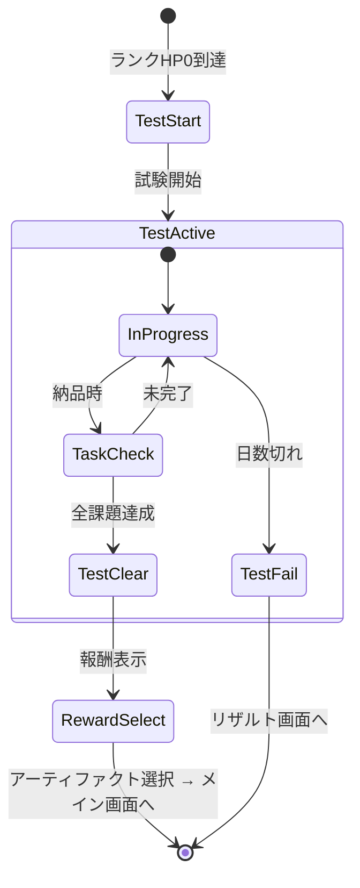

# 昇格試験画面 詳細設計

**バージョン**: 1.0.0
**作成日**: 2026-01-01
**画面ID**: SCR-004

---

## 1. 基本情報

| 項目 | 値 |
|------|-----|
| **画面ID** | SCR-004 |
| **画面名** | 昇格試験画面 |
| **親画面** | メイン画面（SCR-002） |
| **子画面** | メイン画面（試験クリア時）、リザルト画面（失敗時） |
| **責務** | 昇格試験の課題表示・進行・結果表示 |

### 信頼性レベル

- 🔵 **青信号**: 要件定義書に記載
- 🟡 **黄信号**: 要件定義書から妥当な推測
- 🔴 **赤信号**: 要件定義書にない推測

---

## 2. ワイヤーフレーム 🔵

### 2.1 試験開始時

```
┌─────────────────────────────────────────────────────────────────────────┐
│                                                                         │
│                        ╔═══════════════════════════╗                    │
│                        ║     昇格試験              ║                    │
│                        ║     G → F ランク          ║                    │
│                        ╚═══════════════════════════╝                    │
│                                                                         │
│  ┌─────────────────────────────────────────────────────────────────┐   │
│  │                                                                 │   │
│  │                        試験課題                                 │   │
│  │                                                                 │   │
│  │   ギルド職員:                                                   │   │
│  │   「Fランクへの昇格試験だ。以下の課題を達成せよ。」             │   │
│  │                                                                 │   │
│  │   ┌─────────────────────────────────────────────────────────┐   │   │
│  │   │ 課題内容:                                               │   │   │
│  │   │  • 回復薬 ×2 を納品せよ                                │   │   │
│  │   │                                                         │   │   │
│  │   │ 制限:                                                   │   │   │
│  │   │  • 5日以内                                              │   │   │
│  │   └─────────────────────────────────────────────────────────┘   │   │
│  │                                                                 │   │
│  │                       [試験を開始する]                          │   │
│  │                                                                 │   │
│  └─────────────────────────────────────────────────────────────────┘   │
│                                                                         │
└─────────────────────────────────────────────────────────────────────────┘
```

### 2.2 試験進行中（メイン画面内）

```
┌─────────────────────────────────────────────────────────────────────────┐
│ ┌───────────────────────────────────────────────────────────────────┐   │
│ │ 【昇格試験中】 G→Fランク  残り: 4日                              │   │
│ └───────────────────────────────────────────────────────────────────┘   │
├─────────────────────────────────────────────────────────────────────────┤
│                                                                         │
│   ┌─────────────────────────────────────────────────────────────────┐   │
│   │ 試験課題:                                                       │   │
│   │  ✓ 回復薬 ×1 (納品済み)                                        │   │
│   │  ○ 回復薬 ×1 (未納品)                                          │   │
│   └─────────────────────────────────────────────────────────────────┘   │
│                                                                         │
│   （通常のメイン画面UI）                                                │
│                                                                         │
└─────────────────────────────────────────────────────────────────────────┘
```

### 2.3 試験クリア時

```
┌─────────────────────────────────────────────────────────────────────────┐
│                                                                         │
│                        ╔═══════════════════════════╗                    │
│                        ║     昇格試験クリア！      ║                    │
│                        ╚═══════════════════════════╝                    │
│                                                                         │
│                            G → F ランク                                 │
│                                                                         │
│  ┌─────────────────────────────────────────────────────────────────┐   │
│  │                                                                 │   │
│  │                      昇格報酬                                   │   │
│  │                                                                 │   │
│  │   💰 ボーナスゴールド: +50G                                     │   │
│  │                                                                 │   │
│  │   アーティファクトを選択してください:                           │   │
│  │                                                                 │   │
│  │   ┌──────────────┐ ┌──────────────┐ ┌──────────────┐           │   │
│  │   │ ★コモン     │ │ ★コモン     │ │ ★★レア     │           │   │
│  │   │              │ │              │ │              │           │   │
│  │   │ 錬金術師の   │ │ 採取袋の     │ │ 商人の指輪   │           │   │
│  │   │ 眼鏡         │ │ 拡張         │ │              │           │   │
│  │   │              │ │              │ │              │           │   │
│  │   │ 調合品質+1   │ │ 保管+5枠    │ │ 報酬金+20%   │           │   │
│  │   │              │ │              │ │              │           │   │
│  │   │   [選択]     │ │   [選択]     │ │   [選択]     │           │   │
│  │   └──────────────┘ └──────────────┘ └──────────────┘           │   │
│  │                                                                 │   │
│  └─────────────────────────────────────────────────────────────────┘   │
│                                                                         │
└─────────────────────────────────────────────────────────────────────────┘
```

---

## 3. UI要素 🔵

### 3.1 試験開始画面

| 要素ID | 種類 | 説明 |
|--------|------|------|
| `test-title` | テキスト | 「昇格試験 X→Yランク」 |
| `guild-message` | テキストエリア | ギルド職員のメッセージ |
| `task-list` | リスト | 課題内容一覧 |
| `time-limit` | テキスト | 制限日数 |
| `btn-start` | プライマリボタン | 試験を開始する |

### 3.2 試験進行中ヘッダー

| 要素ID | 種類 | 説明 |
|--------|------|------|
| `test-indicator` | バッジ | 「昇格試験中」表示 |
| `test-remaining-days` | テキスト | 残り日数 |
| `task-progress` | チェックリスト | 課題の進捗状況 |

### 3.3 試験クリア画面

| 要素ID | 種類 | 説明 |
|--------|------|------|
| `clear-title` | テキスト | 「昇格試験クリア！」 |
| `rank-change` | テキスト | ランク変更表示 |
| `bonus-gold` | テキスト | ボーナスゴールド |
| `artifact-selection` | カード群 | アーティファクト選択肢（3つ） |
| `btn-select` | ボタン | 各アーティファクトの選択ボタン |

---

## 4. 昇格試験一覧 🔵

| 試験 | 課題内容 | 制限日数 |
|------|---------|----------|
| G→F | 回復薬 ×2 納品 | 5日以内 |
| F→E | 回復薬(B以上) ×3、解毒剤 ×2 | 5日以内 |
| E→D | 爆弾 ×2、鋼の剣 ×1 | 4日以内 |
| D→C | 指定アイテム3種を同時納品 | 4日以内 |
| C→B | 全品質B以上で5件達成 | 3日以内 |
| B→A | 複合レシピ3種納品 | 3日以内 |
| A→S | 伝説のアイテム製作 | 制限なし |

---

## 5. 昇格報酬 🔵

| ランクアップ | ボーナスゴールド | アーティファクト選択 |
|-------------|-----------------|---------------------|
| G→F | 50G | コモン2 + レア1 |
| F→E | 80G | コモン2 + レア1 |
| E→D | 100G | コモン1 + レア2 |
| D→C | 150G | レア2 + エピック1 |
| C→B | 200G | レア1 + エピック2 |
| B→A | 250G | エピック3 |
| A→S | 300G | エピック2 + レジェンダリー1 |

---

## 6. 状態遷移 🟡



---

## 7. 課題進捗表示 🟡

### 7.1 チェックリストUI

```
┌─────────────────────────────────────────┐
│ 試験課題:                               │
│  ✓ 回復薬 ×1 (1/2)                     │
│  ○ 回復薬 ×1 (納品待ち)                │
└─────────────────────────────────────────┘
```

| 状態 | アイコン | 色 |
|------|---------|-----|
| 完了 | ✓ | 緑 (#228B22) |
| 未完了 | ○ | グレー (#808080) |
| 進行中 | ● | 青 (#4169E1) |

### 7.2 プログレスバー

```
課題進捗: [████████░░░░░░░░░░░░] 40% (2/5)
```

---

## 8. アニメーション 🟡

| トリガー | アニメーション | 時間 |
|----------|---------------|------|
| 画面表示（試験開始） | フェードイン + スケールアップ | 0.5s |
| 試験開始ボタン押下 | ボタン縮小 → 画面トランジション | 0.3s |
| 課題達成 | チェックマーク表示 + 緑のハイライト | 0.4s |
| 試験クリア | 大きな「クリア！」表示 + 光エフェクト | 1.0s |
| ランクアップ | ランクアイコン変化アニメーション | 0.8s |
| アーティファクト選択 | カード拡大 + 光のエフェクト | 0.5s |

---

## 9. イベント 🟡

| イベント名 | トリガー | 処理内容 |
|-----------|----------|----------|
| `OnTestStarted` | 試験開始ボタン押下 | 試験モード開始、メイン画面へ遷移 |
| `OnTaskCompleted` | 課題アイテム納品 | 課題進捗更新、達成チェック |
| `OnAllTasksCompleted` | 全課題達成 | クリア画面表示、報酬計算 |
| `OnArtifactSelected` | アーティファクト選択 | アーティファクト追加、ランクアップ処理 |
| `OnTestFailed` | 試験日数切れ | リザルト画面へ遷移（ゲームオーバー） |

---

## 10. アクセシビリティ 🟡

### 10.1 キーボード操作

| キー | 動作 |
|------|------|
| `Enter` | 試験開始/アーティファクト選択 |
| `1-3` | アーティファクト選択（番号で） |
| `Escape` | 確認ダイアログ表示（試験中止） |

### 10.2 色覚対応

- 課題状態は色だけでなくアイコン（✓/○/●）でも表現
- コントラスト比を確保した色使い

---

## 11. 試験中の制限事項 🔵

試験中は以下の制限が適用される：

| 項目 | 制限内容 |
|------|---------|
| 通常依頼 | 受注不可（試験課題のみ） |
| ショップ | 利用可能 |
| 日数 | 試験専用カウント（リセット） |
| 失敗時 | ゲームオーバー（完全リセット） |

---

## 12. 試験失敗時の表示 🟡

```
┌─────────────────────────────────────────────────────────────────────────┐
│                                                                         │
│                        ╔═══════════════════════════╗                    │
│                        ║     昇格試験失敗...       ║                    │
│                        ╚═══════════════════════════╝                    │
│                                                                         │
│                     制限日数内に課題を達成できませんでした              │
│                                                                         │
│                             ゲームオーバー                              │
│                                                                         │
│                            [タイトルへ]                                 │
│                                                                         │
└─────────────────────────────────────────────────────────────────────────┘
```

---

## 関連文書

- **UI設計概要**: [../overview.md](../overview.md)
- **メイン画面設計**: [main.md](main.md)
- **ランクシステム設計**: [../../core-systems.md](../../core-systems.md)

---

## 変更履歴

| 日付 | バージョン | 変更内容 |
|------|----------|---------|
| 2026-01-01 | 1.0.0 | 初版作成 |
