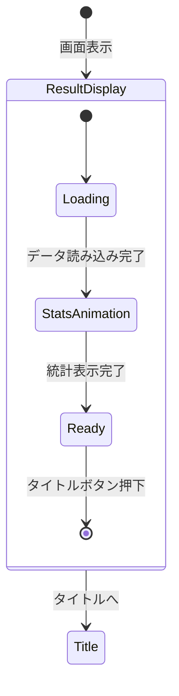

# リザルト画面 詳細設計

**バージョン**: 1.0.0
**作成日**: 2026-01-01
**画面ID**: SCR-005

---

## 1. 基本情報

| 項目 | 値 |
|------|-----|
| **画面ID** | SCR-005 |
| **画面名** | リザルト画面 |
| **親画面** | メイン画面（SCR-002）、昇格試験画面（SCR-004） |
| **子画面** | タイトル画面（SCR-001） |
| **責務** | ゲーム終了時の結果表示（クリア/ゲームオーバー） |

### 信頼性レベル

- 🔵 **青信号**: 要件定義書に記載
- 🟡 **黄信号**: 要件定義書から妥当な推測
- 🔴 **赤信号**: 要件定義書にない推測

---

## 2. 表示パターン 🔵

リザルト画面は2つのパターンがある：

| パターン | 条件 | 表示内容 |
|---------|------|---------|
| **ゲームクリア** | Sランク到達 | 称号、最終スコア、プレイ統計 |
| **ゲームオーバー** | 日数切れ | 到達ランク、プレイ統計、再挑戦促進 |

---

## 3. ワイヤーフレーム

### 3.1 ゲームクリア 🔵

```
┌─────────────────────────────────────────────────────────────────────────┐
│                                                                         │
│                                                                         │
│                        ╔═══════════════════════════╗                    │
│                        ║   🎊 CONGRATULATIONS! 🎊  ║                    │
│                        ║                           ║                    │
│                        ║        Sランク到達        ║                    │
│                        ║     伝説の錬金術師        ║                    │
│                        ╚═══════════════════════════╝                    │
│                                                                         │
│  ┌─────────────────────────────────────────────────────────────────┐   │
│  │                                                                 │   │
│  │                      プレイ統計                                 │   │
│  │                                                                 │   │
│  │   ┌─────────────────────────────────────────────────────────┐   │   │
│  │   │                                                         │   │   │
│  │   │  総プレイ日数:           87日                          │   │   │
│  │   │  達成依頼数:             156件                         │   │   │
│  │   │  調合アイテム数:         243個                         │   │   │
│  │   │  獲得貢献度:             4,850                         │   │   │
│  │   │  最大コンボ:             12連続                        │   │   │
│  │   │  所持アーティファクト:   8個                           │   │   │
│  │   │                                                         │   │   │
│  │   └─────────────────────────────────────────────────────────┘   │   │
│  │                                                                 │   │
│  └─────────────────────────────────────────────────────────────────┘   │
│                                                                         │
│                            [タイトルへ]                                 │
│                                                                         │
└─────────────────────────────────────────────────────────────────────────┘
```

### 3.2 ゲームオーバー 🔵

```
┌─────────────────────────────────────────────────────────────────────────┐
│                                                                         │
│                                                                         │
│                        ╔═══════════════════════════╗                    │
│                        ║       GAME OVER           ║                    │
│                        ║                           ║                    │
│                        ║     制限日数を超過...     ║                    │
│                        ╚═══════════════════════════╝                    │
│                                                                         │
│  ┌─────────────────────────────────────────────────────────────────┐   │
│  │                                                                 │   │
│  │                      今回の記録                                 │   │
│  │                                                                 │   │
│  │   ┌─────────────────────────────────────────────────────────┐   │   │
│  │   │                                                         │   │   │
│  │   │  到達ランク:             Dランク                       │   │   │
│  │   │  プレイ日数:             45日                          │   │   │
│  │   │  達成依頼数:             67件                          │   │   │
│  │   │  調合アイテム数:         89個                          │   │   │
│  │   │  獲得貢献度:             1,230                         │   │   │
│  │   │                                                         │   │   │
│  │   └─────────────────────────────────────────────────────────┘   │   │
│  │                                                                 │   │
│  │                     次回へのヒント:                             │   │
│  │   「依頼の期限に注意し、効率よく貢献度を稼ごう！」             │   │
│  │                                                                 │   │
│  └─────────────────────────────────────────────────────────────────┘   │
│                                                                         │
│                            [タイトルへ]                                 │
│                                                                         │
└─────────────────────────────────────────────────────────────────────────┘
```

---

## 4. UI要素 🟡

### 4.1 共通要素

| 要素ID | 種類 | 説明 |
|--------|------|------|
| `result-title` | テキスト | 「CONGRATULATIONS!」または「GAME OVER」 |
| `result-subtitle` | テキスト | 結果の説明 |
| `stats-panel` | パネル | プレイ統計表示エリア |
| `btn-title` | プライマリボタン | タイトルへ戻る |

### 4.2 ゲームクリア専用要素

| 要素ID | 種類 | 説明 |
|--------|------|------|
| `title-display` | テキスト | 獲得した称号（「伝説の錬金術師」など） |
| `celebration-effect` | アニメーション | 祝福エフェクト（紙吹雪など） |

### 4.3 ゲームオーバー専用要素

| 要素ID | 種類 | 説明 |
|--------|------|------|
| `reached-rank` | テキスト | 到達したランク |
| `hint-text` | テキスト | 次回へのヒント |

---

## 5. プレイ統計項目 🟡

### 5.1 ゲームクリア時

| 項目 | 説明 | 表示形式 |
|------|------|---------|
| 総プレイ日数 | ゲーム内で経過した日数 | XX日 |
| 達成依頼数 | 納品成功した依頼の総数 | XX件 |
| 調合アイテム数 | 調合したアイテムの総数 | XX個 |
| 獲得貢献度 | 累計獲得貢献度 | X,XXX |
| 最大コンボ | 連続依頼達成の最大記録 | XX連続 |
| 所持アーティファクト | 最終的に所持していたアーティファクト数 | X個 |
| 最終所持金 | ゲームクリア時の所持金 | XXX G |
| ショップ購入回数 | ショップでの購入総数 | XX回 |

### 5.2 ゲームオーバー時

| 項目 | 説明 | 表示形式 |
|------|------|---------|
| 到達ランク | 最高到達ランク | Xランク |
| プレイ日数 | ゲーム内で経過した日数 | XX日 |
| 達成依頼数 | 納品成功した依頼の総数 | XX件 |
| 調合アイテム数 | 調合したアイテムの総数 | XX個 |
| 獲得貢献度 | 累計獲得貢献度 | X,XXX |

---

## 6. 称号システム（ゲームクリア時） 🔴

| 称号 | 条件 |
|------|------|
| 伝説の錬金術師 | Sランク到達（基本称号） |
| 速攻の錬金術師 | 総プレイ日数 80日以内でクリア |
| 依頼の達人 | 達成依頼数 200件以上 |
| 調合マスター | 調合アイテム数 300個以上 |
| コンボ職人 | 最大コンボ 15連続以上 |
| コレクター | アーティファクト 10個以上所持 |
| 富豪の錬金術師 | 最終所持金 1000G以上 |

---

## 7. 次回へのヒント（ゲームオーバー時） 🔴

ゲームオーバーの原因に応じたヒントを表示：

| 原因 | ヒント例 |
|------|---------|
| ランク日数切れ（序盤） | 「依頼の期限に注意し、効率よく貢献度を稼ごう！」 |
| ランク日数切れ（中盤） | 「高難度依頼は貢献度が高いが、素材準備を怠らずに！」 |
| ランク日数切れ（終盤） | 「アーティファクトを活用して効率を上げよう！」 |
| 昇格試験失敗 | 「試験前に必要な素材とレシピを揃えておこう！」 |

---

## 8. 状態遷移 🟡



---

## 9. アニメーション 🟡

### 9.1 ゲームクリア時

| トリガー | アニメーション | 時間 |
|----------|---------------|------|
| 画面表示 | フェードイン | 0.5s |
| タイトル表示 | スケールアップ + ゴールドグロー | 1.0s |
| 称号表示 | タイプライター効果 | 0.5s |
| 紙吹雪 | 上から降ってくる（継続） | 継続 |
| 統計カウントアップ | 数値が0から最終値まで増加 | 各0.3s |

### 9.2 ゲームオーバー時

| トリガー | アニメーション | 時間 |
|----------|---------------|------|
| 画面表示 | フェードイン（暗め） | 0.5s |
| タイトル表示 | 静かにフェードイン | 0.8s |
| 統計表示 | 順次フェードイン | 各0.2s |
| ヒント表示 | 遅延フェードイン | 0.5s (遅延1s) |

---

## 10. イベント 🟡

| イベント名 | トリガー | 処理内容 |
|-----------|----------|----------|
| `OnScreenEnter` | 画面表示 | BGM切り替え、統計データ取得 |
| `OnStatsAnimationComplete` | 統計表示完了 | ボタン有効化 |
| `OnTitleClicked` | タイトルボタン押下 | セーブデータ削除確認 → タイトルへ遷移 |

---

## 11. BGM/SE 🟡

### 11.1 ゲームクリア時

| タイミング | サウンド |
|-----------|---------|
| 画面表示 | クリアファンファーレ |
| 称号表示 | 達成音 |
| 統計カウントアップ | カウント音 |

### 11.2 ゲームオーバー時

| タイミング | サウンド |
|-----------|---------|
| 画面表示 | ゲームオーバージングル |
| ヒント表示 | なし（静寂） |

---

## 12. アクセシビリティ 🟡

### 12.1 キーボード操作

| キー | 動作 |
|------|------|
| `Enter` / `Space` | タイトルへ戻る |
| `Escape` | タイトルへ戻る |

### 12.2 スクリーンリーダー対応

- 統計項目を順次読み上げ可能
- 称号・ヒントのaria-label設定

---

## 13. セーブデータ処理 🔵

| 結果 | セーブデータ処理 |
|------|-----------------|
| ゲームクリア | セーブデータ削除（確認ダイアログあり） |
| ゲームオーバー | セーブデータ削除（確認ダイアログあり） |

### 13.1 確認ダイアログ

```
┌─────────────────────────────────────────┐
│           タイトルに戻る                 │
├─────────────────────────────────────────┤
│                                         │
│  セーブデータは削除されます。           │
│  タイトルに戻りますか？                 │
│                                         │
│         [はい]    [キャンセル]          │
│                                         │
└─────────────────────────────────────────┘
```

---

## 関連文書

- **UI設計概要**: [../overview.md](../overview.md)
- **メイン画面設計**: [main.md](main.md)
- **昇格試験画面設計**: [rank-up.md](rank-up.md)

---

## 変更履歴

| 日付 | バージョン | 変更内容 |
|------|----------|---------|
| 2026-01-01 | 1.0.0 | 初版作成 |
