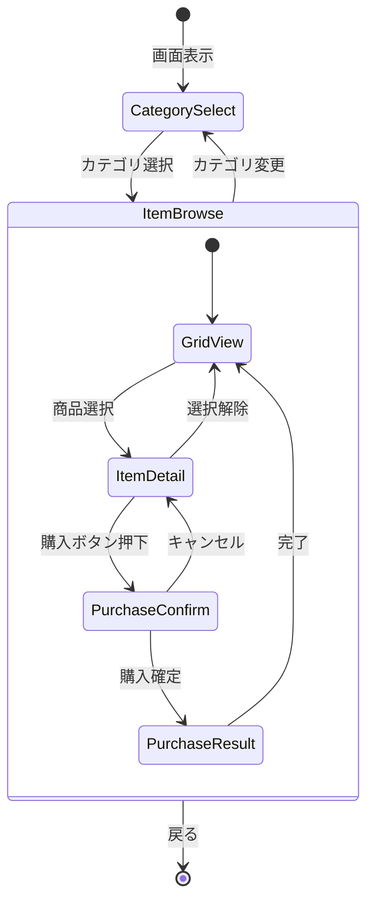

# ショップ画面 詳細設計

**バージョン**: 1.0.0
**作成日**: 2026-01-01
**画面ID**: SCR-003

---

## 1. 基本情報

| 項目 | 値 |
|------|-----|
| **画面ID** | SCR-003 |
| **画面名** | ショップ画面 |
| **親画面** | メイン画面（SCR-002） |
| **子画面** | なし |
| **責務** | カード・素材・アーティファクトの購入 |

### 信頼性レベル

- 🔵 **青信号**: 要件定義書に記載
- 🟡 **黄信号**: 要件定義書から妥当な推測
- 🔴 **赤信号**: 要件定義書にない推測

---

## 2. ワイヤーフレーム 🔵

```
┌─────────────────────────────────────────────────────────────────────────┐
│ ┌───────────────────────────────────────────────────────────────────┐   │
│ │ ヘッダー                              所持金: 💰 130G           │   │
│ └───────────────────────────────────────────────────────────────────┘   │
├─────────────────────────────────────────────────────────────────────────┤
│ ┌─────────────────┐ ┌───────────────────────────────────────────────┐   │
│ │ カテゴリ        │ │                                               │   │
│ │                 │ │              商品一覧                         │   │
│ │ ● カードショップ│ │                                               │   │
│ │ ○ 素材ショップ │ │  ┌────────┐ ┌────────┐ ┌────────┐           │   │
│ │ ○ 強化カード   │ │  │ 近くの │ │ 川辺   │ │ 山麓の │           │   │
│ │ ○ アーティファ │ │  │ 森     │ │        │ │ 岩場   │           │   │
│ │   クト         │ │  │        │ │        │ │        │           │   │
│ │                 │ │  │ 50G    │ │ 80G    │ │ 150G   │           │   │
│ │                 │ │  │ [購入] │ │ [購入] │ │ [購入] │           │   │
│ │                 │ │  └────────┘ └────────┘ └────────┘           │   │
│ │                 │ │                                               │   │
│ │                 │ │  ┌────────┐ ┌────────┐ ┌────────┐           │   │
│ │                 │ │  │ 回復薬 │ │ 解毒剤 │ │ 爆弾   │           │   │
│ │                 │ │  │        │ │        │ │        │           │   │
│ │                 │ │  │ 80G    │ │ 100G   │ │ 200G   │           │   │
│ │                 │ │  │ [購入] │ │ [購入] │ │ 🔒     │           │   │
│ │                 │ │  └────────┘ └────────┘ └────────┘           │   │
│ │                 │ │                                               │   │
│ └─────────────────┘ └───────────────────────────────────────────────┘   │
├─────────────────────────────────────────────────────────────────────────┤
│ ┌───────────────────────────────────────────────────────────────────┐   │
│ │ 選択中: 近くの森                                                  │   │
│ │ 採取地カード - コスト⚡1で薬草×2、キノコ×1(50%)を獲得          │   │
│ │                                                    [購入する 50G] │   │
│ └───────────────────────────────────────────────────────────────────┘   │
├─────────────────────────────────────────────────────────────────────────┤
│                               [戻る]                                    │
└─────────────────────────────────────────────────────────────────────────┘
```

---

## 3. UI要素 🔵

### 3.1 ヘッダー

| 要素ID | 種類 | 説明 |
|--------|------|------|
| `shop-title` | テキスト | 「ショップ」 |
| `gold-display` | テキスト | 現在の所持金 |

### 3.2 カテゴリサイドバー

| 要素ID | 種類 | 説明 |
|--------|------|------|
| `category-cards` | ラジオボタン | カードショップ |
| `category-materials` | ラジオボタン | 素材ショップ |
| `category-enhancements` | ラジオボタン | 強化カードショップ |
| `category-artifacts` | ラジオボタン | アーティファクトショップ |

### 3.3 商品一覧

| 要素ID | 種類 | 説明 |
|--------|------|------|
| `item-grid` | グリッド | 商品カードのグリッド表示 |
| `item-card` | カード | 各商品の表示 |
| `btn-buy` | ボタン | 購入ボタン（各商品） |

### 3.4 詳細パネル

| 要素ID | 種類 | 説明 |
|--------|------|------|
| `item-detail` | パネル | 選択中商品の詳細情報 |
| `btn-purchase` | プライマリボタン | 購入実行ボタン |

### 3.5 フッター

| 要素ID | 種類 | 説明 |
|--------|------|------|
| `btn-back` | セカンダリボタン | メイン画面へ戻る |

---

## 4. ショップカテゴリ詳細 🔵

### 4.1 カードショップ

採取地カードとレシピカードを販売。

| 商品種別 | 価格帯 | 解放条件 |
|---------|--------|----------|
| 基本採取地カード | 50〜100G | Gランク〜 |
| 上級採取地カード | 150〜300G | Eランク〜 |
| 基本レシピカード | 80〜150G | Gランク〜 |
| 上級レシピカード | 200〜400G | Dランク〜 |

### 4.2 素材ショップ

素材を直接購入可能（ランダムラインナップ）。

| 商品種別 | 価格帯 | 備考 |
|---------|--------|------|
| 基本素材 | 10〜30G | 薬草、水、石など |
| 中級素材 | 30〜60G | 鉱石、キノコなど |
| レア素材 | 50〜100G | 火山石、魔法素材など |

### 4.3 強化カードショップ

強化カードを販売。

| 商品種別 | 価格帯 | 備考 |
|---------|--------|------|
| 基本強化カード | 80〜120G | 賢者の触媒、精霊の導きなど |
| 上級強化カード | 150〜200G | 集中の瞑想など |

### 4.4 アーティファクトショップ 🔵

永続パッシブ効果を持つアーティファクトを販売。

| 商品種別 | 価格帯 | 備考 |
|---------|--------|------|
| コモン | 300G | 錬金術師の眼鏡など |
| レア | 400G | 時の砂時計など |
| エピック | 500G | 伝説の釜など |

---

## 5. 商品カードUI 🟡

### 5.1 通常状態

```
┌────────────────┐
│   [画像/アイコン]│
│                │
│   商品名       │
│                │
│   💰 100G      │
│                │
│   [購入]       │
└────────────────┘
```

### 5.2 購入不可状態

| 理由 | 表示 |
|------|------|
| ゴールド不足 | グレーアウト + 「ゴールド不足」 |
| ランク未到達 | 🔒アイコン + 「Xランクで解放」 |
| 在庫切れ | グレーアウト + 「売り切れ」 |
| デッキ上限 | グレーアウト + 「デッキ満杯」 |

### 5.3 ホバー/選択状態

```
┌────────────────┐  ← 枠線ハイライト
│   [画像/アイコン]│  ← 拡大（1.05倍）
│                │
│   商品名       │
│                │
│   💰 100G      │
│                │
│   [購入]       │  ← ボタン色変化
└────────────────┘
```

---

## 6. 詳細パネル 🟡

### 6.1 採取地カードの詳細

```
┌─────────────────────────────────────────────────────────────┐
│ 近くの森                                     [採取地カード] │
├─────────────────────────────────────────────────────────────┤
│                                                             │
│ コスト: ⚡1                                                 │
│                                                             │
│ 獲得素材:                                                   │
│  • 薬草 ×2 (100%)                                          │
│  • キノコ ×1 (50%)                                         │
│                                                             │
│ 説明: 工房から近い森。基本的な薬草が採れる。               │
│                                                             │
├─────────────────────────────────────────────────────────────┤
│                                      [購入する 50G]         │
└─────────────────────────────────────────────────────────────┘
```

### 6.2 レシピカードの詳細

```
┌─────────────────────────────────────────────────────────────┐
│ 回復薬                                       [レシピカード] │
├─────────────────────────────────────────────────────────────┤
│                                                             │
│ コスト: ⚡1                                                 │
│                                                             │
│ 必要素材:                                                   │
│  • 薬草 ×2                                                 │
│  • 清水 ×1                                                 │
│                                                             │
│ 完成品:                                                     │
│  回復薬 - HPを30回復する薬                                 │
│                                                             │
│ 対応依頼: 医療系                                            │
│                                                             │
├─────────────────────────────────────────────────────────────┤
│                                      [購入する 80G]         │
└─────────────────────────────────────────────────────────────┘
```

### 6.3 アーティファクトの詳細

```
┌─────────────────────────────────────────────────────────────┐
│ 錬金術師の眼鏡                           [アーティファクト] │
│                                              ★ コモン      │
├─────────────────────────────────────────────────────────────┤
│                                                             │
│ 効果: 調合品質+1                                            │
│                                                             │
│ 説明:                                                       │
│ 素材の本質を見抜く魔法の眼鏡。調合時の品質が向上する。     │
│                                                             │
│ ※ アーティファクトは永続的にパッシブ効果を発揮します      │
│                                                             │
├─────────────────────────────────────────────────────────────┤
│                                      [購入する 300G]        │
└─────────────────────────────────────────────────────────────┘
```

---

## 7. 状態遷移 🟡



---

## 8. アニメーション 🟡

| トリガー | アニメーション | 時間 |
|----------|---------------|------|
| 画面表示 | スライドイン（右から） | 0.3s |
| カテゴリ切り替え | フェード | 0.2s |
| 商品選択 | スケール拡大 | 0.1s |
| 購入成功 | 商品カード消滅 + 所持金減少演出 | 0.4s |
| 購入失敗 | シェイク | 0.3s |
| 画面終了 | スライドアウト（右へ） | 0.3s |

---

## 9. イベント 🟡

| イベント名 | トリガー | 処理内容 |
|-----------|----------|----------|
| `OnCategoryChanged` | カテゴリ選択 | 商品一覧更新 |
| `OnItemSelected` | 商品カードクリック | 詳細パネル表示 |
| `OnPurchaseClicked` | 購入ボタン押下 | 購入確認ダイアログ表示 |
| `OnPurchaseConfirmed` | 購入確定 | 購入処理実行、ゴールド減算、デッキ/インベントリ追加 |
| `OnBackClicked` | 戻るボタン押下 | メイン画面へ遷移 |

---

## 10. 購入確認ダイアログ 🟡

```
┌─────────────────────────────────────────┐
│           購入確認                       │
├─────────────────────────────────────────┤
│                                         │
│  「近くの森」を購入しますか？           │
│                                         │
│  価格: 50G                              │
│  購入後の所持金: 80G                    │
│                                         │
│         [購入する]    [キャンセル]      │
│                                         │
└─────────────────────────────────────────┘
```

---

## 11. アクセシビリティ 🟡

### 11.1 キーボード操作

| キー | 動作 |
|------|------|
| `1-4` | カテゴリ切り替え |
| `矢印キー` | 商品グリッド内移動 |
| `Enter` | 選択中商品を購入 |
| `Escape` | 戻る/キャンセル |

### 11.2 フォーカス順序

1. カテゴリサイドバー
2. 商品グリッド（左上から右下）
3. 詳細パネルの購入ボタン
4. 戻るボタン

---

## 12. 注意事項 🔵

- 買い物には行動ポイント1を消費する（どのフェーズでも可能）
- ランクによって購入可能な商品が異なる
- デッキ上限（30枚）を超えるカードは購入不可
- 素材保管上限を超える素材は購入不可

---

## 関連文書

- **UI設計概要**: [../overview.md](../overview.md)
- **メイン画面設計**: [main.md](main.md)
- **ショップシステム設計**: [../../core-systems.md](../../core-systems.md)

---

## 変更履歴

| 日付 | バージョン | 変更内容 |
|------|----------|---------|
| 2026-01-01 | 1.0.0 | 初版作成 |
