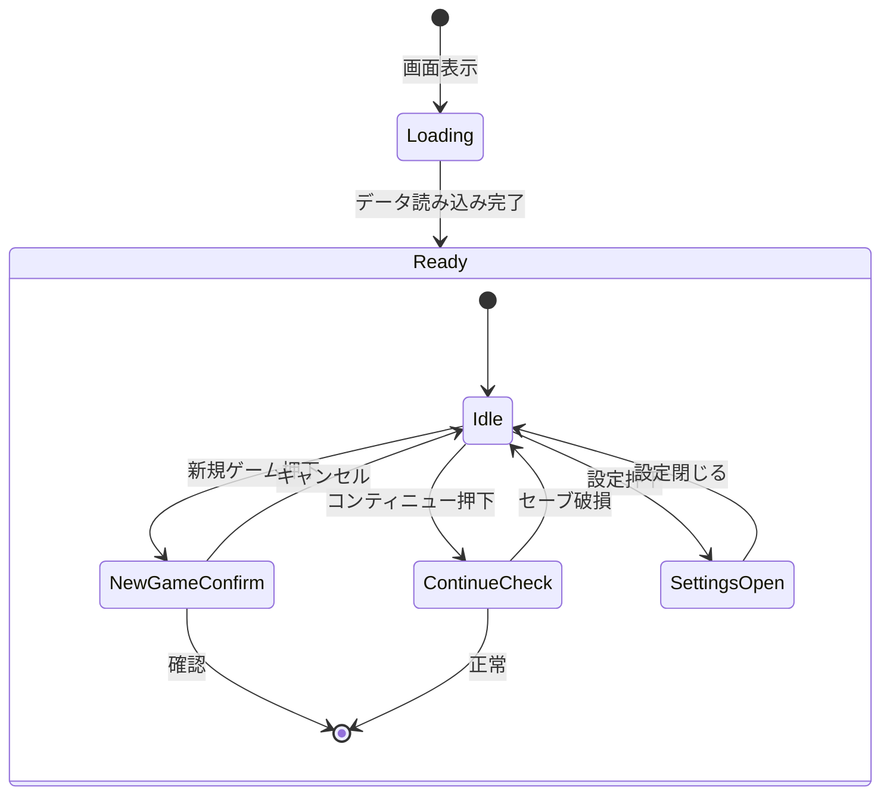
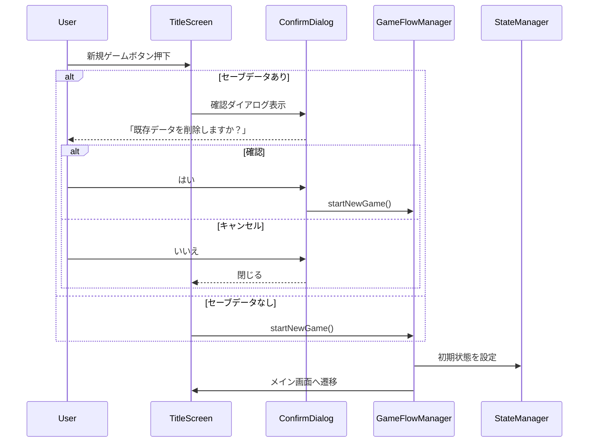
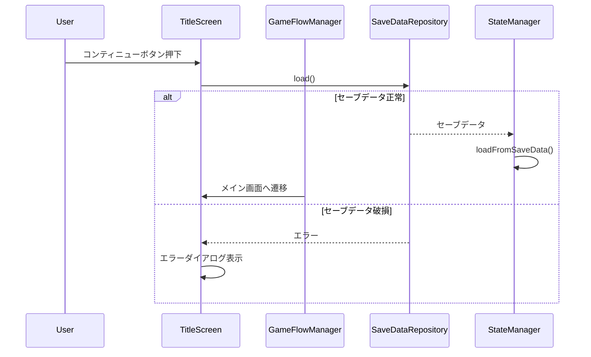

# タイトル画面 詳細設計

**バージョン**: 1.0.0
**作成日**: 2026-01-01
**画面ID**: SCR-001

---

## 1. 基本情報

| 項目 | 値 |
|------|-----|
| **画面ID** | SCR-001 |
| **画面名** | タイトル画面 |
| **親画面** | なし（エントリーポイント） |
| **子画面** | メイン画面（SCR-002） |
| **責務** | ゲーム開始、コンティニュー、設定へのナビゲーション |

### 信頼性レベル

- 🔵 **青信号**: 要件定義書に記載
- 🟡 **黄信号**: 要件定義書から妥当な推測
- 🔴 **赤信号**: 要件定義書にない推測

---

## 2. ワイヤーフレーム 🟡

```
┌─────────────────────────────────────────────────────────────┐
│                                                             │
│                                                             │
│                    ╔═══════════════════╗                    │
│                    ║                   ║                    │
│                    ║   ATELIER GUILD   ║                    │
│                    ║   錬金術師ギルド   ║                    │
│                    ║                   ║                    │
│                    ╚═══════════════════╝                    │
│                                                             │
│                                                             │
│                    ┌─────────────────┐                      │
│                    │   新規ゲーム    │                      │
│                    └─────────────────┘                      │
│                                                             │
│                    ┌─────────────────┐                      │
│                    │  コンティニュー │  ← セーブデータ無時は │
│                    └─────────────────┘    グレーアウト      │
│                                                             │
│                    ┌─────────────────┐                      │
│                    │     設定        │                      │
│                    └─────────────────┘                      │
│                                                             │
│                                                             │
│                                           Version 1.0.0     │
└─────────────────────────────────────────────────────────────┘
```

---

## 3. UI要素 🟡

| 要素ID | 種類 | 説明 | 状態 |
|--------|------|------|------|
| `logo` | 画像/テキスト | ゲームタイトルロゴ | - |
| `subtitle` | テキスト | サブタイトル「錬金術師ギルド」 | - |
| `btn-new-game` | プライマリボタン | 新規ゲーム開始 | 常に有効 |
| `btn-continue` | セカンダリボタン | コンティニュー | セーブデータ有無で有効/無効 |
| `btn-settings` | セカンダリボタン | 設定画面へ | 常に有効 |
| `txt-version` | テキスト | バージョン表示 | - |

---

## 4. UI要素詳細

### 4.1 タイトルロゴ (`logo`)

| プロパティ | 値 |
|-----------|-----|
| **タイプ** | 画像またはスタイルドテキスト |
| **サイズ** | 幅: 400px, 高さ: auto |
| **位置** | 画面中央上部（上から20%） |
| **フォント**（テキストの場合） | 游ゴシック, 48px, Bold |
| **色** | プライマリカラー (#8B4513) |

### 4.2 新規ゲームボタン (`btn-new-game`)

| プロパティ | 値 |
|-----------|-----|
| **タイプ** | プライマリボタン |
| **サイズ** | 幅: 200px, 高さ: 50px |
| **テキスト** | 「新規ゲーム」 |
| **背景色** | #8B4513 |
| **テキスト色** | #FFFFFF |
| **ホバー時** | 背景色: #A0522D, シャドウ追加 |
| **押下時** | 背景色: #704214, インセットシャドウ |

### 4.3 コンティニューボタン (`btn-continue`)

| プロパティ | 値 |
|-----------|-----|
| **タイプ** | セカンダリボタン |
| **サイズ** | 幅: 200px, 高さ: 50px |
| **テキスト** | 「コンティニュー」 |
| **有効時背景色** | 透明、枠線: #8B4513 |
| **有効時テキスト色** | #8B4513 |
| **無効時背景色** | 透明、枠線: #CCCCCC |
| **無効時テキスト色** | #CCCCCC |
| **ホバー時（有効）** | 背景色: rgba(139, 69, 19, 0.1) |

### 4.4 設定ボタン (`btn-settings`)

| プロパティ | 値 |
|-----------|-----|
| **タイプ** | セカンダリボタン |
| **サイズ** | 幅: 200px, 高さ: 50px |
| **テキスト** | 「設定」 |
| **背景色** | 透明、枠線: #666666 |
| **テキスト色** | #666666 |

---

## 5. 状態遷移 🟡

### 5.1 画面状態



### 5.2 初期状態

| 条件 | 状態 |
|------|------|
| セーブデータなし | コンティニューボタン無効（グレーアウト） |
| セーブデータあり | 全ボタン有効 |

### 5.3 ローディング状態

- 画面表示開始時
- マスターデータ読み込み中
- ローディングインジケーター表示（中央にスピナー）

### 5.4 エラー状態

| エラー種類 | 表示 | 対処 |
|-----------|------|------|
| マスターデータ読み込み失敗 | エラーダイアログ | リロードボタン表示 |
| セーブデータ破損 | 警告ダイアログ | 新規ゲーム推奨、削除オプション |

---

## 6. アニメーション 🟡

| トリガー | アニメーション | 時間 | イージング |
|----------|---------------|------|-----------|
| 画面表示時 | フェードイン | 0.5s | ease-out |
| タイトルロゴ表示 | スケールアップ + フェードイン | 0.8s | ease-out |
| ボタン群表示 | 下からスライドイン + フェードイン | 0.3s (遅延あり) | ease-out |
| ボタンホバー | スケール拡大 (1.05倍) | 0.1s | ease-in-out |
| ボタン押下 | スケール縮小 (0.95倍) | 0.05s | linear |
| 画面遷移開始 | フェードアウト | 0.3s | ease-in |

### アニメーション詳細

```css
/* ボタン群の遅延表示 */
.btn-new-game { animation-delay: 0.3s; }
.btn-continue { animation-delay: 0.4s; }
.btn-settings { animation-delay: 0.5s; }
```

---

## 7. イベント 🟡

| イベント名 | トリガー | 処理内容 |
|-----------|----------|----------|
| `OnNewGameClicked` | 新規ゲームボタン押下 | 確認ダイアログ表示（セーブデータある場合のみ） → メイン画面へ遷移 |
| `OnContinueClicked` | コンティニューボタン押下 | セーブデータ読み込み → メイン画面へ遷移 |
| `OnSettingsClicked` | 設定ボタン押下 | 設定ダイアログ表示 |
| `OnScreenEnter` | 画面表示時 | BGM再生開始、セーブデータ存在チェック |
| `OnScreenExit` | 画面離脱時 | トランジション開始 |

### 7.1 新規ゲーム開始フロー



### 7.2 コンティニューフロー



---

## 8. 確認ダイアログ仕様 🟡

### 8.1 新規ゲーム確認ダイアログ

| 項目 | 内容 |
|------|------|
| **タイトル** | 新規ゲーム開始 |
| **メッセージ** | 既存のセーブデータは削除されます。よろしいですか？ |
| **ボタン1** | はい（プライマリ） |
| **ボタン2** | いいえ（セカンダリ） |
| **デフォルトフォーカス** | いいえ |

### 8.2 設定ダイアログ 🔴

| 項目 | 内容 |
|------|------|
| **BGM音量** | スライダー（0〜100） |
| **SE音量** | スライダー（0〜100） |
| **アニメーション** | ON/OFF トグル |
| **閉じるボタン** | ×ボタンまたは「閉じる」 |

---

## 9. アクセシビリティ 🟡

### 9.1 キーボード操作

| キー | 動作 |
|------|------|
| `Tab` | フォーカス移動（上から下へ） |
| `Shift + Tab` | フォーカス移動（下から上へ） |
| `Enter` / `Space` | ボタン押下 |
| `Escape` | ダイアログ閉じる |

### 9.2 フォーカス順序

1. 新規ゲームボタン
2. コンティニューボタン（有効時のみ）
3. 設定ボタン

### 9.3 スクリーンリーダー対応

| 要素 | aria属性 |
|------|----------|
| `btn-new-game` | `aria-label="新規ゲームを開始"` |
| `btn-continue` | `aria-label="セーブデータから再開"` + `aria-disabled` |
| `btn-settings` | `aria-label="設定を開く"` |

---

## 10. 実装ノート 🟡

### 10.1 HTML構造

```html
<div class="screen title-screen">
  <div class="title-content">
    <div class="logo-container">
      <h1 class="game-title">ATELIER GUILD</h1>
      <p class="game-subtitle">錬金術師ギルド</p>
    </div>

    <nav class="menu-buttons">
      <button id="btn-new-game" class="btn btn-primary">新規ゲーム</button>
      <button id="btn-continue" class="btn btn-secondary" disabled>コンティニュー</button>
      <button id="btn-settings" class="btn btn-secondary">設定</button>
    </nav>

    <footer class="version-info">
      <span>Version 1.0.0</span>
    </footer>
  </div>
</div>
```

### 10.2 CSS クラス

| クラス名 | 用途 |
|---------|------|
| `.title-screen` | 画面コンテナ |
| `.logo-container` | ロゴエリア |
| `.game-title` | メインタイトル |
| `.game-subtitle` | サブタイトル |
| `.menu-buttons` | ボタングループ |
| `.version-info` | バージョン表示 |

---

## 関連文書

- **UI設計概要**: [../overview.md](../overview.md)
- **入力システム設計**: [../input-system.md](../input-system.md)
- **アーキテクチャ設計書**: [../../architecture.md](../../architecture.md)

---

## 変更履歴

| 日付 | バージョン | 変更内容 |
|------|----------|---------|
| 2026-01-01 | 1.0.0 | 初版作成 |
