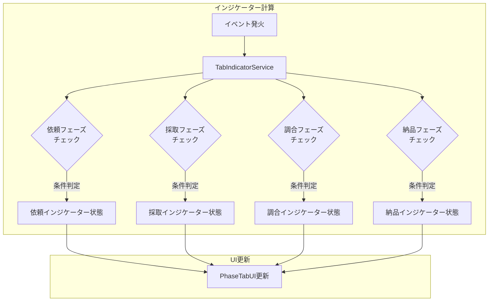
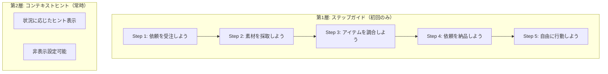
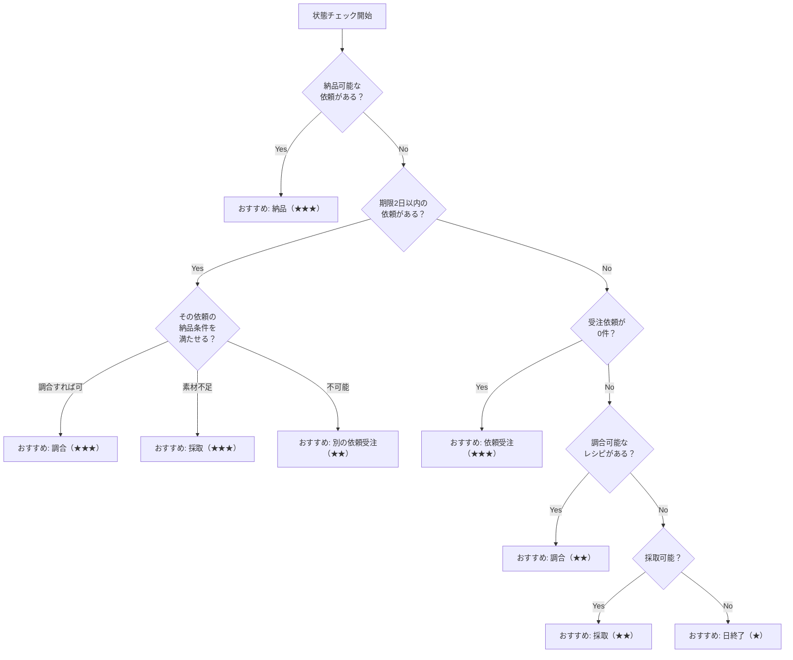
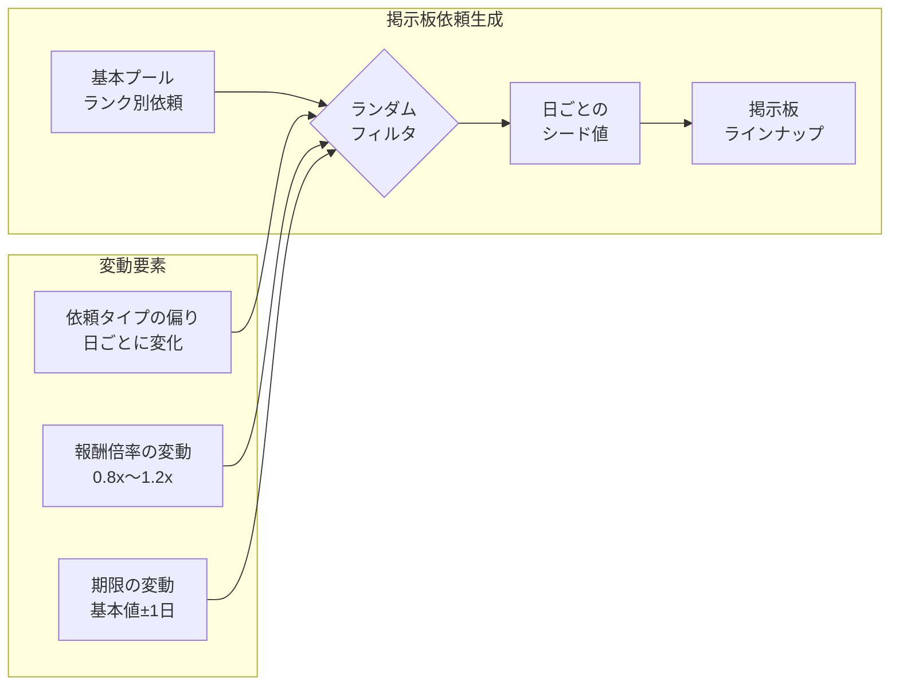
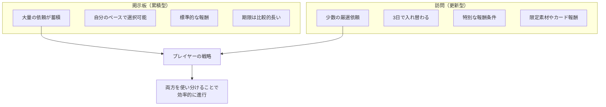
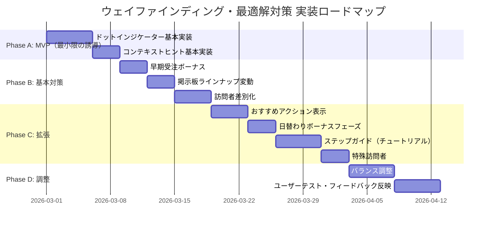
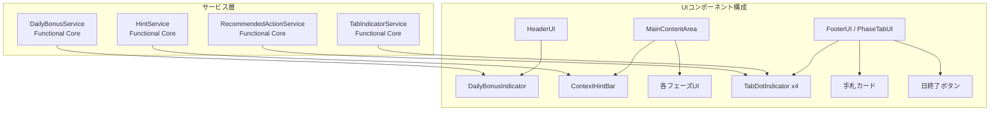

# ウェイファインディング（ユーザー誘導）と最適解固定化対策 設計書

**バージョン**: 1.0.0
**作成日**: 2026-02-28
**関連Issue**: #315
**関連要件定義**: [フェーズ自由遷移 要件定義書](../../spec/free-phase-navigation/requirements.md)

---

## 概要

フェーズ自由遷移システム（REQ-001）の導入により、プレイヤーは依頼受注・採取・調合・納品の4フェーズを任意の順序で切り替えられるようになる。この自由度の向上は戦略性を高める一方で、以下2つのプレイヤー体験リスクが生じる。

| リスク | 内容 | 影響 |
|--------|------|------|
| **ウェイファインディング不足** | 「今何をすべきか」が分かりにくくなる | 新規プレイヤーの離脱、操作迷子 |
| **最適解固定化** | 効率的な行動パターンが発見されると単調化する | リプレイ性の低下、飽き |

本設計書では、これらのリスクに対する具体的な対策を定義する。

### 設計原則

1. **自由度を損なわない**: 制約による誘導ではなく、情報提供による誘導を優先する
2. **段階的開示**: 初心者には手厚く、熟練者には控えめに
3. **発見の喜びを奪わない**: 最適解を直接教えるのではなく、気づきを促す
4. **既存UIとの統合**: 新規画面の追加を最小限にし、既存UIの拡張で対応する

### 信頼性レベル凡例

- 🔵 **青信号**: 既存設計文書・要件定義書に基づく確実な設計
- 🟡 **黄信号**: 既存設計から妥当な推測による設計
- 🔴 **赤信号**: 新規の設計提案（要検証）

---

## Section 1: ウェイファインディングシステム設計

### 1.1 ドットインジケーター（タブ通知バッジ）🟡

#### 背景

フェーズ自由遷移により、プレイヤーは任意のタイミングで任意のフェーズに移動できる（REQ-001）。しかし、初心者にとっては「次に何をすべきか」の判断が難しくなる。タブUI上のドットインジケーターにより、各フェーズで「やれること」や「注目すべきこと」を視覚的に通知する。

#### 仕様

##### インジケーターの種類

| 種類 | 表示条件 | アイコン | 色 |
|------|----------|---------|-----|
| **アクション可能** | そのフェーズで実行可能なアクションがある | ドット（●） | 緑 (#66BB6A) |
| **注意喚起** | 期限切れが迫る依頼がある等 | ドット（●） | オレンジ (#FFB300) |
| **新着** | 新しい依頼が掲示板に追加された | ドット（●） | 青 (#42A5F5) |

##### フェーズごとのインジケーター発火条件

| フェーズ | 条件 | インジケーター種類 |
|----------|------|-------------------|
| **依頼受注** | 未受注の新着依頼がある | 新着（青） |
| **依頼受注** | 受注中の依頼に期限2日以内のものがある | 注意喚起（オレンジ） |
| **依頼受注** | 受注枠に空きがあり、掲示板に依頼がある | アクション可能（緑） |
| **採取** | 手札に採取地カードがあり、AP残量がある | アクション可能（緑） |
| **調合** | 調合可能なレシピと素材の組み合わせがある | アクション可能（緑） |
| **納品** | 受注済み依頼の納品条件を満たす完成品がある | アクション可能（緑） |
| **納品** | 受注済み依頼に期限1日以内のものがある | 注意喚起（オレンジ） |

##### 表示ルール

- インジケーターは対応するフェーズタブの右上に小さなドット（直径8px）として表示する
- 複数条件が同時に成立する場合、最も優先度の高いインジケーターのみ表示する
  - 優先度: 注意喚起（オレンジ） > アクション可能（緑） > 新着（青）
- 現在アクティブなフェーズのタブにはインジケーターを表示しない（既にそのフェーズにいるため）
- フェーズを切り替えた時点で、そのフェーズのインジケーターは消える

##### UIレイアウト

```
フッターバー（PhaseTabUI）
┌──────┬──────┬──────┬──────┐ ┌─────────────┐ ┌────┐
│依頼 ●│ 採取 │調合 ●│ 納品 │ │ [手札カード] │ │日終│
│[活性]│      │      │      │ │             │ │了  │
└──────┴──────┴──────┴──────┘ └─────────────┘ └────┘
  ^                ^
  新着(青)          アクション可能(緑)
```

##### 状態計算のタイミング

インジケーターの状態は以下のタイミングで再計算する:

- フェーズ切り替え時（`PHASE_CHANGED` イベント）
- 日開始時（`DAY_STARTED` イベント）
- アクション実行後（`QUEST_ACCEPTED`, `ITEM_CRAFTED`, `QUEST_COMPLETED` 等）
- インベントリ変更時（`INVENTORY_CHANGED` イベント）

##### 実装方針



- `TabIndicatorService` は純粋関数として `features/wayfinding/services/` に配置する（Functional Core）
- `IGameState` を入力として受け取り、各フェーズのインジケーター状態を返す
- PhaseTabUI が EventBus 経由でインジケーター状態を監視し、表示を更新する（Imperative Shell）

---

### 1.2 チュートリアル/ヒントシステム設計 🔴

#### 背景

Gランク（チュートリアル）では、プレイヤーにゲームの基本操作と戦略の基礎を教える必要がある。フェーズ自由遷移の導入により、初回プレイ時の「何をすればいいのか分からない」リスクが高まる。

#### 仕様

##### チュートリアルの構成

チュートリアルは**ステップ形式のガイド**と**コンテキストヒント**の2層構造で構成する。



##### 第1層: ステップガイド（Gランク1日目のみ）

| ステップ | トリガー | 表示内容 | 完了条件 |
|---------|---------|---------|---------|
| 1 | ゲーム開始直後 | 「まずは依頼を受注してみよう！依頼タブをクリックしてね」 | 依頼タブをクリック |
| 2 | 依頼受注後 | 「次は素材を集めよう！採取タブをクリックして採取地を選ぼう」 | 採取タブをクリック |
| 3 | 採取完了後 | 「素材が集まったら調合だ！調合タブでレシピを選ぼう」 | 調合タブをクリック |
| 4 | 調合完了後 | 「完成品ができた！納品タブで依頼を納品しよう」 | 納品タブをクリック |
| 5 | 納品完了後 | 「素晴らしい！あとは自由に行動していいよ。APがなくなったら日終了ボタンを押そう」 | 日終了ボタンをクリック |

##### 第2層: コンテキストヒント（常時利用可能）

メインコンテンツエリアの上部に、現在の状況に応じたヒントを1行で表示する。

| 状況 | ヒントメッセージ |
|------|-----------------|
| 受注依頼が0件 | 「依頼を受注すると貢献度を稼げるよ。依頼タブを確認しよう！」 |
| 手札に採取地カードがない | 「採取地カードがないよ。ショップで購入するか、休憩で手札を入れ替えよう」 |
| 調合可能なレシピがある | 「調合できるレシピがあるよ！調合タブを確認してみよう」 |
| 納品可能な完成品がある | 「納品できる依頼があるよ！納品タブで確認しよう」 |
| AP残量が0 | 「APがなくなったよ。日終了ボタンで翌日に進もう」 |
| 期限2日以内の依頼がある | 「期限が迫っている依頼があるよ！早めに納品しよう」 |
| 何も行動せず日終了可能 | 「何もしなくても日終了できるよ。でも依頼の期限は進むから注意！」 |

##### 表示仕様

```
メインコンテンツエリア
┌─────────────────────────────────────────────────┐
│ 💡 調合できるレシピがあるよ！調合タブを確認してみよう  [✕]│
├─────────────────────────────────────────────────┤
│                                                   │
│              （フェーズ別コンテンツ）                │
│                                                   │
└─────────────────────────────────────────────────┘
```

- ヒントバーは半透明の背景（`rgba(255, 248, 225, 0.9)`）で表示
- [✕] ボタンで個別に閉じられる
- 設定画面で「ヒントを表示しない」オプションを提供
- ステップガイドはセーブデータに完了状態を保存し、一度完了したら再表示しない

##### 実装方針

- `HintService` を `features/wayfinding/services/hint-service.ts` に配置（Functional Core）
- ゲーム状態を入力として、表示すべきヒントメッセージを返す純粋関数
- ヒントの優先度は上表の順序で、最も優先度の高いヒント1つのみ表示

---

### 1.3 おすすめアクション表示の設計 🔴

#### 背景

フェーズ自由遷移では、プレイヤーが「次にどのフェーズに行くべきか」を自分で判断する必要がある。特にゲーム中盤以降、依頼期限・素材状況・AP残量を総合的に考慮した最適な行動を見極めることが求められる。おすすめアクション表示は、この判断を補助する仕組みである。

#### 仕様

##### おすすめアクションの算出ロジック

おすすめアクションは以下の優先度で算出する:



##### 表示場所と方式

おすすめアクションは**ドットインジケーター（1.1節）の拡張**として表示する。最も推奨されるフェーズのタブインジケーターを**点滅（パルスアニメーション）**にすることで、他のインジケーターと区別する。

| 推奨度 | インジケーター表示 |
|--------|-------------------|
| ★★★ 強く推奨 | ドットが緩やかに点滅（パルスアニメーション、周期1.5秒） |
| ★★ 推奨 | 通常のドット表示（静的） |
| ★ 低推奨 | インジケーターなし |

##### 制約事項

- おすすめアクションは**あくまでヒント**であり、強制ではない
- プレイヤーが明示的に別フェーズに移動した場合、おすすめは無視される
- おすすめ計算はフェーズ切り替え時と日開始時に実行する
- 計算が重くならないよう、簡易的な条件判定に留める

---

## Section 2: 最適解固定化対策

### 2.1 日ごとインセンティブ（早期受注ボーナス等）🔴

#### 背景

フェーズ自由遷移では、プレイヤーが「採取→調合→納品」のサイクルを最適化し、依頼受注を後回しにするパターンが固定化するリスクがある。日ごとのインセンティブにより、異なるタイミングでの行動を促す。

#### 仕様

##### 早期受注ボーナス

依頼が掲示板に掲載された日に受注すると、ボーナスが付与される。

| ボーナス種類 | 条件 | 効果 |
|-------------|------|------|
| **早期受注ボーナス** | 依頼掲載日に受注 | 報酬ゴールド +20% |
| **連続受注ボーナス** | 3日連続で依頼を受注 | 報酬貢献度 +10% |

##### 一番乗り報酬

訪問依頼は3日ごとに更新される（REQ-005-02）。訪問者が来た初日に依頼を受注すると、特別な報酬が追加される。

| ボーナス種類 | 条件 | 効果 |
|-------------|------|------|
| **一番乗り報酬** | 訪問依頼の更新日に受注 | 追加素材1つプレゼント |

##### 日替わりボーナスフェーズ

毎日ランダムに1つのフェーズがボーナスフェーズとなり、そのフェーズでの行動に微小なボーナスが付く。

| ボーナスフェーズ | 効果 |
|----------------|------|
| 依頼受注 | 掲示板に追加依頼が1件多く掲載される |
| 採取 | 採取ラウンドで追加素材が出現しやすくなる（レア出現率 +5%） |
| 調合 | 調合品質に +5 のボーナス |
| 納品 | 納品報酬のゴールドに +10% のボーナス |

##### 表示仕様

日替わりボーナスはヘッダーバーに小さなアイコンで表示する。

```
ヘッダーバー
┌──────────────────────────────────────────────────┐
│ ランク: E [ゲージ] | 残り: 30日 | G 100G | AP: 3/3  │
│                              本日のボーナス: 🧪調合+5 │
└──────────────────────────────────────────────────┘
```

---

### 2.2 ランダム要素の活用 🟡

#### 背景

最適解固定化の根本原因は「毎回同じ状況に対して同じ行動が最適になる」ことにある。ランダム要素を適切に導入することで、状況ごとに最適な行動を変化させる。

#### 仕様

##### 掲示板ラインナップの変動

掲示板の依頼ラインナップに変動要素を導入する。



| 変動要素 | 範囲 | 目的 |
|---------|------|------|
| **依頼タイプの偏り** | 日ごとに特定タイプの出現率が変化 | 毎日同じ依頼を受注できない |
| **報酬倍率の変動** | 基本報酬の 0.8x ～ 1.2x | 高報酬の依頼を探す動機づけ |
| **期限の変動** | 基本期限 ±1日 | 計画の再考を促す |

##### 採取地の素材出現テーブル変動

同じ採取地でも、日ごとに出現する素材の確率テーブルが微妙に変化する。

| パラメータ | 変動範囲 | 目的 |
|-----------|---------|------|
| **通常素材の出現率** | 基本値 ±10% | 「今日はこの素材が取りやすい」を作る |
| **レア素材の出現率** | 基本値 ±3% | レア素材を求めて複数日チャレンジ |

##### 訪問者の多様化

訪問依頼の依頼者を多様化し、特殊な報酬条件を持つ依頼者を登場させる。

| 訪問者タイプ | 出現条件 | 特殊効果 |
|-------------|---------|---------|
| **通常訪問者** | 常時 | 通常の依頼を持参 |
| **富豪の旅人** | ランダム（10%） | 報酬ゴールド 1.5x、ただし難易度高め |
| **急ぎの商人** | ランダム（15%） | 期限が短いが報酬貢献度 1.3x |
| **コレクター** | ランク D以上で出現 | 特定素材を高額で買い取る |

---

### 2.3 訪問方式の差別化 🟡

#### 背景

掲示板方式と訪問方式の差別化が不十分だと、プレイヤーは一方の方式のみを利用する最適パターンに収束する。両方式に明確な役割の違いを設け、使い分けを促す。

#### 仕様

##### 掲示板と訪問の役割分担



##### 具体的な差別化ポイント

| 項目 | 掲示板依頼 | 訪問依頼 |
|------|-----------|---------|
| **更新頻度** | 毎日新規追加（累積） | 3日ごとに全入れ替え |
| **依頼数** | 多い（3～5件/日追加） | 少ない（1～2件/更新） |
| **期限** | 標準（3～7日） | やや短め（2～5日） |
| **報酬（ゴールド）** | 標準 | やや高め（1.0x～1.3x） |
| **報酬（貢献度）** | 標準 | 標準～やや高め |
| **特殊報酬** | なし | あり（限定素材、カード等） |
| **難易度** | ランク相応 | やや高め～ランク相応 |
| **早期受注ボーナス** | あり（掲載日受注で+20%G） | あり（初日受注で追加素材） |

##### 訪問依頼の特殊報酬例

| 報酬種類 | 出現頻度 | 内容 |
|---------|---------|------|
| **限定素材** | 訪問依頼の30% | 通常入手困難な素材を追加報酬として獲得 |
| **カード報酬** | 訪問依頼の10% | 新しい採取地カードまたはレシピカードを獲得 |
| **ショップ割引券** | 訪問依頼の20% | 次回ショップ購入時に20%割引 |

---

## Section 3: 実装優先度・フェーズ分け

### 全体ロードマップ



### Phase A: MVP（最小限の誘導）-- 必須

| 項目 | 優先度 | 工数目安 | 依存 |
|------|--------|---------|------|
| ドットインジケーター基本実装 | **Must** | 5日 | フェーズ自由遷移UI（REQ-006） |
| コンテキストヒント基本実装 | **Must** | 3日 | ドットインジケーター |

**目的**: フェーズ自由遷移リリース時に、最低限の誘導を提供する。

**成果物**:
- `TabIndicatorService`（各フェーズのインジケーター状態を計算する純粋関数）
- `HintService`（状況に応じたヒントメッセージを返す純粋関数）
- PhaseTabUI のインジケーター表示拡張

### Phase B: 基本対策 -- 推奨

| 項目 | 優先度 | 工数目安 | 依存 |
|------|--------|---------|------|
| 早期受注ボーナス | **Should** | 3日 | 依頼掲示板システム（REQ-005） |
| 掲示板ラインナップ変動 | **Should** | 3日 | 依頼掲示板システム（REQ-005） |
| 訪問者差別化 | **Should** | 4日 | 依頼掲示板システム（REQ-005） |

**目的**: 最適解固定化を防ぐ基本的な仕組みを導入する。

**成果物**:
- `QuestBoardService` の拡張（ランダム要素、ボーナス計算）
- 訪問者タイプの追加データ定義

### Phase C: 拡張 -- あると良い

| 項目 | 優先度 | 工数目安 | 依存 |
|------|--------|---------|------|
| おすすめアクション表示 | **Could** | 4日 | Phase A |
| 日替わりボーナスフェーズ | **Could** | 3日 | なし |
| ステップガイド（チュートリアル） | **Could** | 5日 | Phase A |
| 特殊訪問者 | **Could** | 3日 | Phase B |

**目的**: プレイヤー体験をさらに豊かにする。

### Phase D: 調整 -- 必要に応じて

| 項目 | 優先度 | 工数目安 | 依存 |
|------|--------|---------|------|
| バランス調整 | **Must** | 5日 | Phase B, C |
| ユーザーテスト・フィードバック反映 | **Should** | 5日 | Phase D 前半 |

---

## Section 4: UI仕様概要

### 4.1 ドットインジケーター レイアウト詳細

```
タブ1つのサイズ: 約80px x 40px

  ┌────────────┐
  │  依頼    ● │  ← ドット: 直径8px、タブ右上から(-4px, +4px)オフセット
  │            │
  └────────────┘

ドットの仕様:
- サイズ: 直径 8px
- 位置: タブの右上角から内側に4pxオフセット
- 色: 発火条件に応じて変化（緑/オレンジ/青）
- アニメーション（おすすめ時）: scaleX/scaleY 1.0→1.3→1.0 のパルス、周期1.5秒
- 影: DropShadow 2px、同系色の半透明
```

### 4.2 コンテキストヒントバー レイアウト詳細

```
メインコンテンツエリア上部（高さ約36px）

┌─────────────────────────────────────────────────────────┐
│ 💡│ 調合できるレシピがあるよ！調合タブを確認してみよう    │[✕]│
└─────────────────────────────────────────────────────────┘

仕様:
- 高さ: 36px
- 背景色: rgba(255, 248, 225, 0.9)（半透明クリーム）
- 左アイコン: 💡 (16x16px)
- テキスト: 14px、色 #5D4037（ダークブラウン）
- 閉じるボタン: 16x16px、色 #9E9E9E
- アニメーション: 上からスライドイン（200ms、EaseOut）
- 非表示時: 高さ0にアニメーション（メインコンテンツが上に詰まる）
```

### 4.3 日替わりボーナス表示 レイアウト詳細

```
ヘッダーバー右端に追加（AP表示の右側）

┌────────────────────────────────────────────────────────┐
│ ランク: E [ゲージ] │ 残り: 30日 │ G 100G │ AP: 3/3 │🧪+5│
└────────────────────────────────────────────────────────┘

仕様:
- サイズ: 約48x24px
- アイコン: フェーズに対応する絵文字（📋依頼/🌿採取/🧪調合/📦納品）
- テキスト: 12px、色 #FFD700（ゴールド）
- 背景: rgba(0, 0, 0, 0.3)（半透明黒）
- ツールチップ: ホバーで「本日のボーナス: 調合品質+5」を表示
```

### 4.4 早期受注ボーナス表示 レイアウト詳細

```
依頼カード上の掲載日表示（既存の依頼カードを拡張）

┌──────────────────────┐
│ 冒険者からの依頼       │
│ ┌─────────┐ 条件:1個  │
│ │ [依頼者  │ 84貢/48G │
│ │ アイコン]│ 期限:6日 │
│ └─────────┘          │
│ ★早期受注で+20%G★    │  ← 掲載初日のみ表示
└──────────────────────┘

仕様:
- 表示条件: 掲載日と現在日が同じ場合のみ
- テキスト: 12px、太字、色 #FFB300（アンバー）
- 背景: rgba(255, 179, 0, 0.1)
- 角丸: 4px
```

### 4.5 コンポーネント配置図



---

## 依存関係・影響範囲

### 影響を受ける既存コンポーネント

| コンポーネント | 影響内容 |
|-------------|---------|
| **PhaseTabUI** | ドットインジケーター表示の追加 |
| **HeaderUI** | 日替わりボーナス表示の追加 |
| **MainScene** | コンテキストヒントバーの追加 |
| **QuestService** | 早期受注ボーナス、掲示板ラインナップ変動 |
| **QuestBoardService** | 訪問者差別化、特殊訪問者対応 |
| **IGameState** | `dailyBonusPhase`, `tutorialStep`, `hintsEnabled` フィールド追加 |

### 新規コンポーネント

| コンポーネント | 配置先 | 種類 |
|-------------|--------|------|
| `TabIndicatorService` | `features/wayfinding/services/` | Functional Core |
| `HintService` | `features/wayfinding/services/` | Functional Core |
| `RecommendedActionService` | `features/wayfinding/services/` | Functional Core |
| `DailyBonusService` | `features/quest/services/` | Functional Core |
| `TabDotIndicator` | `features/wayfinding/components/` | UIコンポーネント |
| `ContextHintBar` | `features/wayfinding/components/` | UIコンポーネント |
| `DailyBonusIndicator` | `shared/components/` | UIコンポーネント |

---

## 設計上の注意事項

### ゲーム体験への影響

1. **ドットインジケーターの頻度**: インジケーターが常に全タブに表示されると、情報過多で効果が薄れる。「本当に重要なアクション」のみにインジケーターを出すことが重要
2. **ヒントの押し付け感**: コンテキストヒントが頻繁に出すぎると、プレイヤーにストレスを与える。非表示オプションと、同じヒントの繰り返し防止（クールダウン）を実装する
3. **ランダム要素のバランス**: ランダム要素が強すぎると「運ゲー」になり、弱すぎると固定化を防げない。基本値からの変動幅は ±20% 以内に留める

### パフォーマンス考慮

- `TabIndicatorService` の計算は毎フレームではなく、イベント駆動で実行する
- インジケーターのアニメーション（パルス）は Phaser の Tween を使用し、GPUアクセラレーションが効くようにする
- ヒントメッセージの計算は、フェーズ切り替え時のみ実行する（update()に入れない）

### テスト戦略

| 対象 | テスト種別 | カバレッジ目標 |
|------|-----------|-------------|
| `TabIndicatorService` | ユニットテスト | 90%+ |
| `HintService` | ユニットテスト | 90%+ |
| `RecommendedActionService` | ユニットテスト | 90%+ |
| `DailyBonusService` | ユニットテスト | 90%+ |
| ドットインジケーター表示 | E2Eテスト | クリティカルパス |
| チュートリアルフロー | E2Eテスト | クリティカルパス |

---

## 変更履歴

| 日付 | バージョン | 変更内容 |
|------|----------|---------|
| 2026-02-28 | 1.0.0 | 初版作成（Issue #315） |
