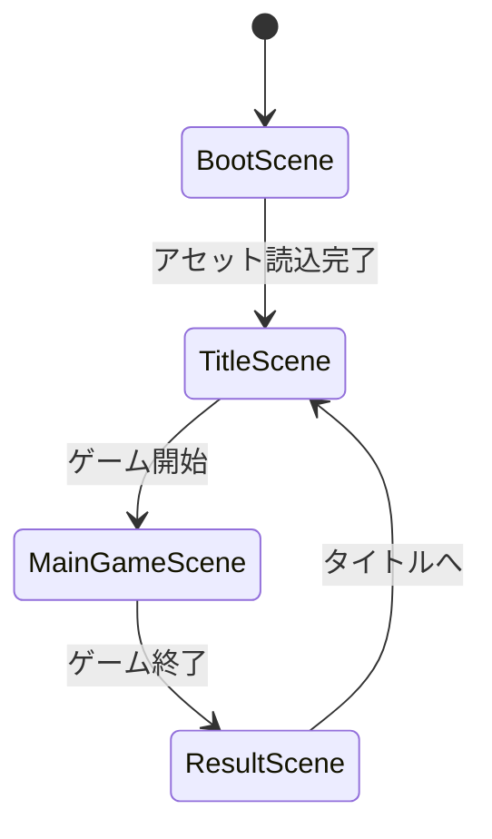
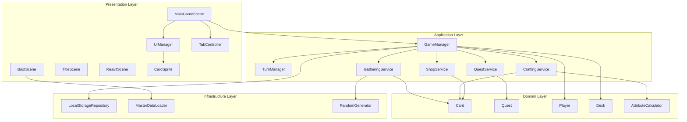

# システムアーキテクチャ設計

## 概要

🔵 本ドキュメントは、「アトリエ」HTMLプロトタイプのシステムアーキテクチャを定義する。
Phaser 3フレームワークを使用したWebブラウザ向け簡易プロトタイプの設計。

**参照元**: [docs/spec/atelier-game-requirements.md](../../spec/atelier-game-requirements.md) v5.1

---

## アーキテクチャパターン

🟡 **パターン**: Layered Architecture + Event-Driven

| パターン | 理由 |
|---------|------|
| Layered Architecture | ドメインロジックとUIの分離、テスタビリティ向上 |
| Event-Driven | Phaser EventEmitterによる疎結合通信 |
| Scene-based | Phaser 3のシーン機構を活用した画面管理 |

---

## レイヤー構造

🟡 **Clean Architecture風 4層構造**（Phaser 3向けに適応）

```
┌─────────────────────────────────────────────────┐
│             Presentation Layer                  │
│  (Phaser Scene, DOM Elements, Input Handler)    │
│  - BootScene, TitleScene, MainGameScene         │
│  - UIManager, CardSprite, TabController         │
└─────────────────────────────────────────────────┘
                      ↓↑ EventEmitter
┌─────────────────────────────────────────────────┐
│             Application Layer                   │
│  (Game Logic / State Management)                │
│  - GameManager, TurnManager                     │
│  - QuestService, GatheringService               │
│  - CraftingService, ShopService                 │
└─────────────────────────────────────────────────┘
                      ↓↑
┌─────────────────────────────────────────────────┐
│               Domain Layer                      │
│  (Business Logic / Core Entities)               │
│  - Card, Quest, Player                          │
│  - Deck, Inventory                              │
│  - AttributeCalculator                          │
└─────────────────────────────────────────────────┘
                      ↓↑
┌─────────────────────────────────────────────────┐
│           Infrastructure Layer                  │
│  (Data Access / External Systems)               │
│  - LocalStorageRepository                       │
│  - MasterDataLoader (JSON)                      │
│  - RandomGenerator                              │
└─────────────────────────────────────────────────┘
```

---

## Phaser 3 シーン構成

🟡 **4シーン構成**



### シーン詳細

| シーン名 | 責務 | 主要処理 |
|---------|------|---------|
| **BootScene** | 初期化・プリロード | アセット読込、マスターデータ読込 |
| **TitleScene** | タイトル画面 | 新規ゲーム、ロード（オプション） |
| **MainGameScene** | メインゲーム | ゲームループ、全UI、タブ切替 |
| **ResultScene** | リザルト画面 | 結果表示、タイトルへ戻る |

---

## MainGameSceneのタブ構成

🔵 **5行動をタブで切り替え**（要件定義書準拠）

```
┌─────────────────────────────────────────────────────┐
│ [ステータスバー] 開拓度 | 消耗度 | お金 | ターン     │
├─────────────────────────────────────────────────────┤
│ [タブ] 依頼 | 採取 | 調合 | 買い物 | デッキ         │
├─────────────────────────────────────────────────────┤
│                                                     │
│               [タブコンテンツエリア]                  │
│                                                     │
├─────────────────────────────────────────────────────┤
│ [アクションボタンエリア]                              │
└─────────────────────────────────────────────────────┘
```

| タブ | 機能 | ターン消費 |
|------|------|----------|
| 依頼 | 依頼一覧表示、受注、納品 | 受注0、納品0 |
| 採取 | 採取地選択、採取実行 | 1〜2ターン |
| 調合 | 素材選択、調合実行 | 1〜2ターン |
| 買い物 | 素材/アーティファクト購入 | 1ターン |
| デッキ | 所持カード確認 | 0ターン |

---

## 状態管理

🟡 **Phaser Registry + EventEmitter方式**

### GameState構造

```javascript
// Phaser Registry に保存するグローバル状態
const GameState = {
  // プレイヤー状態
  player: {
    money: 100,          // 所持金
    explorationRate: 0,  // 開拓度 (0-100)
    exhaustionRate: 0,   // 消耗度 (0-100)
    currentTurn: 1,      // 現在ターン
    maxTurn: 30          // 最大ターン
  },

  // デッキ状態
  deck: {
    cards: [],           // Card[]
    maxSize: 15          // デッキ上限
  },

  // 依頼状態
  quests: {
    available: [],       // 受注可能な依頼
    active: [],          // 受注中の依頼 (最大2)
    completed: []        // 完了した依頼
  },

  // 調合結果
  crafting: {
    craftedItems: []     // 調合済みアイテム
  },

  // 設定
  settings: {
    soundEnabled: true,
    musicVolume: 0.5,
    seVolume: 0.8
  }
};
```

### イベント一覧

```javascript
// ゲームイベント定義
const GameEvents = {
  // ターン系
  TURN_START: 'turn:start',
  TURN_END: 'turn:end',

  // 依頼系
  QUEST_ACCEPTED: 'quest:accepted',
  QUEST_DELIVERED: 'quest:delivered',
  QUEST_EXPIRED: 'quest:expired',

  // 採取系
  GATHERING_START: 'gathering:start',
  GATHERING_COMPLETE: 'gathering:complete',

  // 調合系
  CRAFTING_START: 'crafting:start',
  CRAFTING_COMPLETE: 'crafting:complete',

  // 買い物系
  SHOP_PURCHASE: 'shop:purchase',

  // 指標更新
  EXPLORATION_CHANGED: 'exploration:changed',
  EXHAUSTION_CHANGED: 'exhaustion:changed',
  MONEY_CHANGED: 'money:changed',

  // ゲーム終了
  GAME_WIN: 'game:win',
  GAME_LOSE: 'game:lose'
};
```

---

## コンポーネント依存関係図

🟡 **Mermaid記法**



---

## 技術スタック

🔵 **プロトタイプ用技術選定**

| 項目 | 技術 | バージョン |
|------|------|-----------|
| フレームワーク | Phaser 3 | 3.70+ |
| 言語 | JavaScript (ES6+) | - |
| モジュール管理 | ES Modules | - |
| データフォーマット | JSON | - |
| 永続化 | localStorage | - |
| ビルドツール | なし（CDN利用） | - |

### ライブラリ読み込み

```html
<!-- Phaser 3 CDN -->
<script src="https://cdn.jsdelivr.net/npm/phaser@3.70.0/dist/phaser.min.js"></script>
```

---

## ファイル構成

🟡 **プロトタイプ用シンプル構成**

```
atelier-html-prototype/
├── index.html              # エントリーポイント
├── css/
│   └── style.css           # 基本スタイル
├── js/
│   ├── main.js             # Phaser起動
│   ├── config.js           # ゲーム設定
│   │
│   ├── scenes/             # Phaserシーン
│   │   ├── BootScene.js
│   │   ├── TitleScene.js
│   │   ├── MainGameScene.js
│   │   └── ResultScene.js
│   │
│   ├── services/           # Applicationレイヤー
│   │   ├── GameManager.js
│   │   ├── TurnManager.js
│   │   ├── QuestService.js
│   │   ├── GatheringService.js
│   │   ├── CraftingService.js
│   │   └── ShopService.js
│   │
│   ├── domain/             # Domainレイヤー
│   │   ├── Card.js
│   │   ├── Quest.js
│   │   ├── Player.js
│   │   ├── Deck.js
│   │   └── AttributeCalculator.js
│   │
│   ├── infrastructure/     # Infrastructureレイヤー
│   │   ├── LocalStorageRepository.js
│   │   ├── MasterDataLoader.js
│   │   └── RandomGenerator.js
│   │
│   ├── ui/                 # UIコンポーネント
│   │   ├── UIManager.js
│   │   ├── TabController.js
│   │   ├── CardSprite.js
│   │   ├── StatusBar.js
│   │   └── Dialog.js
│   │
│   └── constants/          # 定数
│       ├── GameEvents.js
│       └── GameConfig.js
│
└── assets/
    ├── data/               # マスターデータ
    │   ├── cards.json
    │   └── quests.json
    └── images/             # 画像（プレースホルダー）
        ├── cards/
        └── ui/
```

---

## 設計原則

🟡 **プロトタイプでも守るべき原則**

1. **単一責任の原則 (SRP)**
   - 各クラス・関数は単一の責務を持つ

2. **イベント駆動**
   - Phaser EventEmitterによる疎結合通信
   - 直接参照を避け、イベント経由で通信

3. **データ駆動設計**
   - ゲームバランスはJSONで外部化
   - コード変更なしで調整可能

4. **シンプルさ優先**
   - 過度な抽象化を避ける
   - 動くものを優先

---

## 参照

- [core-systems.md](core-systems.md) - コアシステム設計
- [dataflow.md](dataflow.md) - データフロー図
- [ui-design/overview.md](ui-design/overview.md) - UI設計概要

---

## 変更履歴

| 日付 | バージョン | 変更内容 |
|------|----------|---------|
| 2025-12-29 | 1.0 | 初版作成（HTMLプロトタイプ用） |
