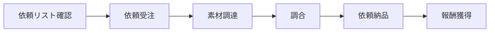
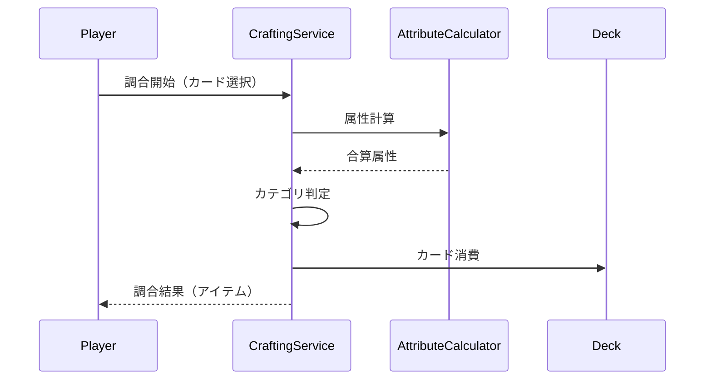
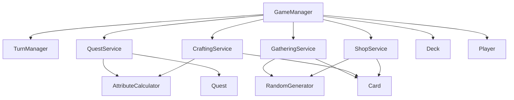

# コアシステム設計

## 概要

🔵 本ドキュメントは、「アトリエ」HTMLプロトタイプのコアシステムを定義する。
要件定義書v5.1に基づき、プロトタイプ向けに簡略化したシステム設計。

**参照元**: [docs/spec/atelier-game-requirements.md](../../spec/atelier-game-requirements.md) v5.1

---

## システム一覧

| システム名 | 責務 | 優先度 |
|-----------|------|--------|
| カードシステム | カード管理・属性計算 | 必須 |
| 依頼システム | 依頼受注・納品 | 必須 |
| 採取システム | 素材獲得 | 必須 |
| 調合システム | アイテム作成 | 必須 |
| 買い物システム | 素材購入 | 必須 |
| デッキ管理 | カード所持管理 | 必須 |
| ターン管理 | ターン進行・消耗度 | 必須 |

---

## 1. カードシステム

### 1.1 カード属性

🔵 **4属性制**（要件定義書準拠）

| 属性 | 説明 | カラーコード | 傾向素材 |
|------|------|-------------|---------|
| 火 (Fire) | 攻撃的、高い属性値 | #FF4500 | 鉱物系（鉄鉱石、硫黄） |
| 水 (Water) | 回復的、安定した効果 | #1E90FF | ハーブ系（薬草、苔） |
| 土 (Earth) | 持続的、防御効果 | #8B4513 | 鉱物系（粘土、石） |
| 風 (Wind) | 軽量、コスト軽減 | #90EE90 | ハーブ系（花、種） |

### 1.2 カードタイプ

🟡 **プロトタイプでは2系統に簡略化**

| 系統 | 役割 | 効果 | 実装 |
|------|------|------|------|
| **素材 (Material)** | 属性値を提供 | 火+3、水+2 など | 必須 |
| **アーティファクト** | 永続パッシブ | 消耗度-10%など | 後回し |

※ 操作・知識・特殊カードは本番実装時に追加

### 1.3 Cardクラス設計

```javascript
/**
 * カードエンティティ
 */
class Card {
  constructor(data) {
    this.id = data.id;              // "card_001"
    this.name = data.name;          // "鉄鉱石"
    this.type = data.type;          // "material"
    this.rarity = data.rarity;      // "common" | "uncommon" | "rare"
    this.attributes = {
      fire: data.fire || 0,
      water: data.water || 0,
      earth: data.earth || 0,
      wind: data.wind || 0
    };
    this.description = data.description;
    this.cost = data.cost || 0;     // 購入価格
  }

  /**
   * 属性値の合計を取得
   */
  getTotalAttributes() {
    return this.attributes.fire +
           this.attributes.water +
           this.attributes.earth +
           this.attributes.wind;
  }

  /**
   * 特定属性の値を取得
   */
  getAttribute(type) {
    return this.attributes[type] || 0;
  }
}
```

### 1.4 属性計算

🔵 **AttributeCalculator**

```javascript
/**
 * 属性計算ユーティリティ
 */
class AttributeCalculator {
  /**
   * 複数カードの属性を合算
   * @param {Card[]} cards
   * @returns {Object} 合算された属性値
   */
  static sumAttributes(cards) {
    return cards.reduce((sum, card) => ({
      fire: sum.fire + card.attributes.fire,
      water: sum.water + card.attributes.water,
      earth: sum.earth + card.attributes.earth,
      wind: sum.wind + card.attributes.wind
    }), { fire: 0, water: 0, earth: 0, wind: 0 });
  }

  /**
   * 属性合計値を取得
   */
  static getTotalValue(attributes) {
    return attributes.fire + attributes.water +
           attributes.earth + attributes.wind;
  }

  /**
   * 依頼要件を満たすか判定
   * @param {Object} attributes - 合算した属性
   * @param {Object} requirements - 依頼の要件
   */
  static meetsRequirements(attributes, requirements) {
    if (requirements.fire && attributes.fire < requirements.fire) return false;
    if (requirements.water && attributes.water < requirements.water) return false;
    if (requirements.earth && attributes.earth < requirements.earth) return false;
    if (requirements.wind && attributes.wind < requirements.wind) return false;
    if (requirements.total) {
      const total = this.getTotalValue(attributes);
      if (total < requirements.total) return false;
    }
    return true;
  }
}
```

---

## 2. 依頼システム

### 2.1 依頼の流れ

🔵 **受注→納品型**（要件定義書準拠）



### 2.2 Questクラス設計

```javascript
/**
 * 依頼エンティティ
 */
class Quest {
  constructor(data) {
    this.id = data.id;                    // "quest_001"
    this.name = data.name;                // "鋼の剣"
    this.description = data.description;  // "火属性15以上の武器を納品"
    this.category = data.category;        // "weapon" | "medicine"
    this.difficulty = data.difficulty;    // "easy" | "normal" | "hard"

    // 要件
    this.requirements = {
      fire: data.requirements?.fire || 0,
      water: data.requirements?.water || 0,
      earth: data.requirements?.earth || 0,
      wind: data.requirements?.wind || 0,
      total: data.requirements?.total || 0
    };

    // 報酬
    this.reward = {
      money: data.reward.money,           // お金
      explorationRate: data.reward.explorationRate || 0,  // 開拓度UP
      exhaustionReduction: data.reward.exhaustionReduction || 0  // 消耗度DOWN
    };

    // 期限
    this.deadline = data.deadline;        // 残りターン数
    this.maxDeadline = data.deadline;     // 初期期限

    // 状態
    this.status = 'available';            // "available" | "active" | "completed" | "expired"
  }

  /**
   * ターン経過で期限を減少
   */
  decreaseDeadline() {
    if (this.status === 'active' && this.deadline > 0) {
      this.deadline--;
      if (this.deadline <= 0) {
        this.status = 'expired';
        return true; // 期限切れ
      }
    }
    return false;
  }

  /**
   * 納品可能か判定
   */
  canDeliver(craftedItem) {
    if (this.status !== 'active') return false;
    if (craftedItem.category !== this.category) return false;
    return AttributeCalculator.meetsRequirements(
      craftedItem.attributes,
      this.requirements
    );
  }
}
```

### 2.3 QuestService

```javascript
/**
 * 依頼サービス
 */
class QuestService {
  constructor(gameManager) {
    this.gameManager = gameManager;
    this.maxActiveQuests = 2;  // プロトタイプは同時2件
  }

  /**
   * 依頼を受注
   */
  acceptQuest(quest) {
    const state = this.gameManager.getState();
    if (state.quests.active.length >= this.maxActiveQuests) {
      return { success: false, message: '受注上限に達しています' };
    }

    quest.status = 'active';
    state.quests.active.push(quest);
    state.quests.available = state.quests.available.filter(q => q.id !== quest.id);

    this.gameManager.emit(GameEvents.QUEST_ACCEPTED, { quest });
    return { success: true };
  }

  /**
   * 依頼を納品
   */
  deliverQuest(quest, craftedItem) {
    if (!quest.canDeliver(craftedItem)) {
      return { success: false, message: '要件を満たしていません' };
    }

    const state = this.gameManager.getState();

    // 報酬適用
    state.player.money += quest.reward.money;
    state.player.explorationRate += quest.reward.explorationRate;
    state.player.exhaustionRate = Math.max(0,
      state.player.exhaustionRate - quest.reward.exhaustionReduction
    );

    // 状態更新
    quest.status = 'completed';
    state.quests.active = state.quests.active.filter(q => q.id !== quest.id);
    state.quests.completed.push(quest);

    // アイテム消費
    state.crafting.craftedItems = state.crafting.craftedItems.filter(
      item => item !== craftedItem
    );

    this.gameManager.emit(GameEvents.QUEST_DELIVERED, { quest, craftedItem });
    this.gameManager.emit(GameEvents.MONEY_CHANGED, { money: state.player.money });
    this.gameManager.emit(GameEvents.EXPLORATION_CHANGED, {
      rate: state.player.explorationRate
    });

    return { success: true };
  }
}
```

---

## 3. 採取システム

### 3.1 採取地

🟡 **プロトタイプは2箇所に簡略化**

| 採取地 | ターン消費 | 獲得数 | 傾向 |
|--------|----------|--------|------|
| **近郊の森** | 1 | 2枚 | 水・風属性多め |
| **山麓の岩場** | 2 | 3枚 | 火・土属性多め |

### 3.2 GatheringService

```javascript
/**
 * 採取サービス
 */
class GatheringService {
  constructor(gameManager, masterDataLoader, randomGenerator) {
    this.gameManager = gameManager;
    this.masterData = masterDataLoader;
    this.random = randomGenerator;

    // 採取地定義
    this.locations = {
      forest: {
        id: 'forest',
        name: '近郊の森',
        turnCost: 1,
        cardCount: 2,
        cardPool: ['card_herb', 'card_flower', 'card_seed', 'card_moss'],
        weights: { water: 2, wind: 2, fire: 1, earth: 1 }
      },
      rocky: {
        id: 'rocky',
        name: '山麓の岩場',
        turnCost: 2,
        cardCount: 3,
        cardPool: ['card_iron', 'card_stone', 'card_clay', 'card_sulfur'],
        weights: { fire: 2, earth: 2, water: 1, wind: 1 }
      }
    };
  }

  /**
   * 採取を実行
   */
  gather(locationId) {
    const location = this.locations[locationId];
    if (!location) {
      return { success: false, message: '無効な採取地です' };
    }

    const state = this.gameManager.getState();

    // デッキ上限チェック
    if (state.deck.cards.length >= state.deck.maxSize) {
      return { success: false, message: 'デッキが満杯です' };
    }

    // ターン消費
    this.gameManager.consumeTurns(location.turnCost);

    // カード獲得
    const gatheredCards = [];
    for (let i = 0; i < location.cardCount; i++) {
      if (state.deck.cards.length >= state.deck.maxSize) break;

      const cardId = this.random.weightedChoice(location.cardPool);
      const cardData = this.masterData.getCard(cardId);
      const card = new Card(cardData);

      state.deck.cards.push(card);
      gatheredCards.push(card);
    }

    this.gameManager.emit(GameEvents.GATHERING_COMPLETE, {
      location,
      cards: gatheredCards
    });

    return { success: true, cards: gatheredCards };
  }
}
```

---

## 4. 調合システム

### 4.1 調合の流れ

🔵 **素材カード消費 → アイテム生成**



### 4.2 アイテムカテゴリ判定

🔵 **要件定義書準拠**

| カテゴリ | 判定条件 | 納品時効果 |
|---------|---------|-----------|
| **武器** | 火属性 >= 10 または 土属性 >= 10 | 開拓度UP + お金 |
| **薬** | 水属性 >= 10 または 風属性 >= 10 | 消耗度DOWN + お金 |
| **道具** | 上記以外 | アーティファクト化（後回し） |

### 4.3 CraftingService

```javascript
/**
 * 調合サービス
 */
class CraftingService {
  constructor(gameManager) {
    this.gameManager = gameManager;
    this.minCardsRequired = 2;  // 最小素材数
    this.maxCardsAllowed = 5;   // 最大素材数
  }

  /**
   * 調合を実行
   * @param {Card[]} selectedCards - 選択した素材カード
   */
  craft(selectedCards) {
    // バリデーション
    if (selectedCards.length < this.minCardsRequired) {
      return { success: false, message: `最低${this.minCardsRequired}枚必要です` };
    }
    if (selectedCards.length > this.maxCardsAllowed) {
      return { success: false, message: `最大${this.maxCardsAllowed}枚までです` };
    }

    const state = this.gameManager.getState();

    // 属性計算
    const attributes = AttributeCalculator.sumAttributes(selectedCards);
    const total = AttributeCalculator.getTotalValue(attributes);

    // カテゴリ判定
    const category = this.determineCategory(attributes);

    // 調合ターン消費（素材数に応じて）
    const turnCost = selectedCards.length <= 3 ? 1 : 2;
    this.gameManager.consumeTurns(turnCost);

    // カード消費
    selectedCards.forEach(card => {
      const index = state.deck.cards.findIndex(c => c === card);
      if (index !== -1) {
        state.deck.cards.splice(index, 1);
      }
    });

    // アイテム生成
    const craftedItem = {
      id: `item_${Date.now()}`,
      name: this.generateItemName(category, total),
      category: category,
      attributes: attributes,
      total: total
    };

    state.crafting.craftedItems.push(craftedItem);

    this.gameManager.emit(GameEvents.CRAFTING_COMPLETE, { item: craftedItem });

    return { success: true, item: craftedItem };
  }

  /**
   * カテゴリを判定
   */
  determineCategory(attributes) {
    if (attributes.fire >= 10 || attributes.earth >= 10) {
      return 'weapon';
    }
    if (attributes.water >= 10 || attributes.wind >= 10) {
      return 'medicine';
    }
    return 'tool';
  }

  /**
   * アイテム名を生成
   */
  generateItemName(category, total) {
    const quality = total >= 30 ? '高品質' : total >= 20 ? '上質' : '普通';
    const categoryName = {
      weapon: '武器',
      medicine: '薬',
      tool: '道具'
    }[category];
    return `${quality}の${categoryName}`;
  }
}
```

---

## 5. 買い物システム

### 5.1 ショップ仕様

🟡 **プロトタイプ版（簡略化）**

| 要素 | 仕様 |
|------|------|
| ラインナップ | 3〜4種類の素材カード |
| 価格 | 10G〜50G（レアリティ依存） |
| 更新 | 3ターンごとに自動更新 |

### 5.2 ShopService

```javascript
/**
 * ショップサービス
 */
class ShopService {
  constructor(gameManager, masterDataLoader, randomGenerator) {
    this.gameManager = gameManager;
    this.masterData = masterDataLoader;
    this.random = randomGenerator;

    this.shopItems = [];
    this.refreshInterval = 3;  // 3ターンごと更新
    this.lastRefreshTurn = 0;
  }

  /**
   * ショップラインナップを更新
   */
  refreshShop() {
    const allCards = this.masterData.getAllCards()
      .filter(c => c.type === 'material');

    this.shopItems = [];
    const count = 3 + Math.floor(Math.random() * 2); // 3-4個

    for (let i = 0; i < count; i++) {
      const cardData = this.random.choice(allCards);
      this.shopItems.push({
        card: new Card(cardData),
        price: this.calculatePrice(cardData)
      });
    }

    this.lastRefreshTurn = this.gameManager.getState().player.currentTurn;
  }

  /**
   * 価格を計算
   */
  calculatePrice(cardData) {
    const basePrice = {
      common: 10,
      uncommon: 25,
      rare: 50
    }[cardData.rarity] || 10;

    // 属性合計でボーナス
    const total = (cardData.fire || 0) + (cardData.water || 0) +
                  (cardData.earth || 0) + (cardData.wind || 0);
    return basePrice + Math.floor(total * 2);
  }

  /**
   * 購入
   */
  purchase(shopItem) {
    const state = this.gameManager.getState();

    // お金チェック
    if (state.player.money < shopItem.price) {
      return { success: false, message: 'お金が足りません' };
    }

    // デッキ上限チェック
    if (state.deck.cards.length >= state.deck.maxSize) {
      return { success: false, message: 'デッキが満杯です' };
    }

    // 購入処理
    state.player.money -= shopItem.price;
    state.deck.cards.push(shopItem.card);

    // ショップから削除
    this.shopItems = this.shopItems.filter(item => item !== shopItem);

    // 1ターン消費
    this.gameManager.consumeTurns(1);

    this.gameManager.emit(GameEvents.SHOP_PURCHASE, { item: shopItem });
    this.gameManager.emit(GameEvents.MONEY_CHANGED, { money: state.player.money });

    return { success: true };
  }
}
```

---

## 6. デッキ管理

### 6.1 Deckクラス

```javascript
/**
 * デッキエンティティ
 */
class Deck {
  constructor(maxSize = 15) {
    this.cards = [];
    this.maxSize = maxSize;
  }

  /**
   * カードを追加
   */
  addCard(card) {
    if (this.cards.length >= this.maxSize) {
      return false;
    }
    this.cards.push(card);
    return true;
  }

  /**
   * カードを削除
   */
  removeCard(card) {
    const index = this.cards.findIndex(c => c === card);
    if (index !== -1) {
      this.cards.splice(index, 1);
      return true;
    }
    return false;
  }

  /**
   * 空き容量を取得
   */
  getRemainingCapacity() {
    return this.maxSize - this.cards.length;
  }

  /**
   * 属性別にカードをグループ化
   */
  groupByAttribute() {
    return {
      fire: this.cards.filter(c => c.attributes.fire > 0),
      water: this.cards.filter(c => c.attributes.water > 0),
      earth: this.cards.filter(c => c.attributes.earth > 0),
      wind: this.cards.filter(c => c.attributes.wind > 0)
    };
  }
}
```

---

## 7. ターン管理

### 7.1 TurnManager

```javascript
/**
 * ターン管理サービス
 */
class TurnManager {
  constructor(gameManager) {
    this.gameManager = gameManager;
    this.exhaustionPerTurn = 3;  // 1ターンあたり消耗度+3%
  }

  /**
   * ターン開始処理
   */
  startTurn() {
    const state = this.gameManager.getState();

    this.gameManager.emit(GameEvents.TURN_START, {
      turn: state.player.currentTurn
    });

    // 依頼期限チェック
    state.quests.active.forEach(quest => {
      if (quest.decreaseDeadline()) {
        this.gameManager.emit(GameEvents.QUEST_EXPIRED, { quest });
      }
    });
  }

  /**
   * ターンを消費
   */
  consumeTurns(count) {
    const state = this.gameManager.getState();

    for (let i = 0; i < count; i++) {
      state.player.currentTurn++;
      state.player.exhaustionRate += this.exhaustionPerTurn;

      this.gameManager.emit(GameEvents.EXHAUSTION_CHANGED, {
        rate: state.player.exhaustionRate
      });

      // 敗北判定
      if (state.player.exhaustionRate >= 100) {
        this.gameManager.emit(GameEvents.GAME_LOSE, {
          reason: '消耗度が100%に達しました'
        });
        return;
      }

      // 勝利判定
      if (state.player.explorationRate >= 100) {
        this.gameManager.emit(GameEvents.GAME_WIN, {
          turn: state.player.currentTurn
        });
        return;
      }
    }

    this.gameManager.emit(GameEvents.TURN_END, {
      turn: state.player.currentTurn
    });
  }
}
```

---

## システム間依存関係



---

## 参照

- [architecture.md](architecture.md) - システムアーキテクチャ
- [game-mechanics.md](game-mechanics.md) - ゲームメカニクス設計
- [data-schema.md](data-schema.md) - データスキーマ

---

## 変更履歴

| 日付 | バージョン | 変更内容 |
|------|----------|---------|
| 2025-12-29 | 1.0 | 初版作成（HTMLプロトタイプ用） |
