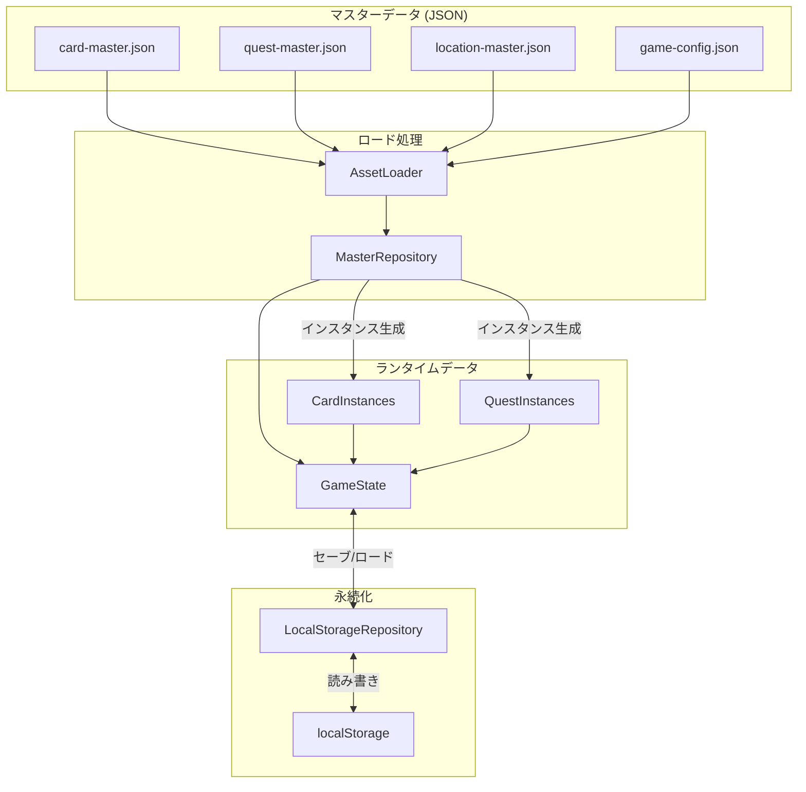

# データスキーマ設計

## 概要

🔵 本ドキュメントは、「アトリエ」HTMLプロトタイプのデータスキーマを定義する。
マスターデータとランタイムデータの構造、およびセーブデータ形式。

**参照元**: [docs/spec/atelier-game-requirements.md](../../spec/atelier-game-requirements.md) v5.1

---

## データ分類

🔵 **3種類のデータ**

| 分類 | 説明 | 保存先 |
|------|------|--------|
| マスターデータ | ゲーム定義（カード、依頼、採取地） | JSON ファイル |
| ランタイムデータ | プレイ中の状態（デッキ、進行状況） | メモリ（Phaser Registry） |
| セーブデータ | 中断・再開用データ | localStorage |

---

## マスターデータ

### カードマスター

🔵 **素材カードの定義**

```typescript
interface CardMaster {
  id: string;           // 一意識別子（例: "card_iron"）
  name: string;         // 表示名（例: "鉄鉱石"）
  rarity: "common" | "uncommon" | "rare";
  attributes: {
    fire: number;       // 火属性値（0〜5）
    water: number;      // 水属性値（0〜5）
    earth: number;      // 土属性値（0〜5）
    wind: number;       // 風属性値（0〜5）
  };
  cost: number;         // ショップ価格
  description?: string; // フレーバーテキスト
}
```

**JSONサンプル（card-master.json）**

```json
{
  "version": "1.0",
  "cards": [
    {
      "id": "card_iron",
      "name": "鉄鉱石",
      "rarity": "common",
      "attributes": { "fire": 3, "water": 0, "earth": 1, "wind": 0 },
      "cost": 15,
      "description": "火山の近くで採れる鉄の原石"
    },
    {
      "id": "card_sulfur",
      "name": "硫黄",
      "rarity": "common",
      "attributes": { "fire": 4, "water": 0, "earth": 0, "wind": 0 },
      "cost": 20,
      "description": "火山地帯で採れる黄色い結晶"
    },
    {
      "id": "card_herb",
      "name": "薬草",
      "rarity": "common",
      "attributes": { "fire": 0, "water": 3, "earth": 0, "wind": 1 },
      "cost": 15,
      "description": "森で採れる万能な薬草"
    },
    {
      "id": "card_moss",
      "name": "苔",
      "rarity": "common",
      "attributes": { "fire": 0, "water": 2, "earth": 1, "wind": 0 },
      "cost": 12,
      "description": "湿った場所に生える緑の苔"
    },
    {
      "id": "card_stone",
      "name": "石",
      "rarity": "common",
      "attributes": { "fire": 1, "water": 0, "earth": 3, "wind": 0 },
      "cost": 15,
      "description": "どこでも見つかる普通の石"
    },
    {
      "id": "card_clay",
      "name": "粘土",
      "rarity": "common",
      "attributes": { "fire": 0, "water": 1, "earth": 2, "wind": 0 },
      "cost": 12,
      "description": "水辺で採れる柔らかい土"
    },
    {
      "id": "card_flower",
      "name": "花",
      "rarity": "common",
      "attributes": { "fire": 0, "water": 1, "earth": 0, "wind": 3 },
      "cost": 15,
      "description": "風に揺れる可憐な花"
    },
    {
      "id": "card_seed",
      "name": "種",
      "rarity": "common",
      "attributes": { "fire": 0, "water": 0, "earth": 1, "wind": 2 },
      "cost": 12,
      "description": "風で運ばれる小さな種"
    },
    {
      "id": "card_crystal",
      "name": "水晶",
      "rarity": "uncommon",
      "attributes": { "fire": 3, "water": 0, "earth": 2, "wind": 0 },
      "cost": 30,
      "description": "光を屈折させる透明な結晶"
    },
    {
      "id": "card_blue_moss",
      "name": "蒼い苔",
      "rarity": "uncommon",
      "attributes": { "fire": 0, "water": 4, "earth": 0, "wind": 1 },
      "cost": 30,
      "description": "珍しい青色の苔"
    },
    {
      "id": "card_fire_stone",
      "name": "炎石",
      "rarity": "rare",
      "attributes": { "fire": 5, "water": 0, "earth": 2, "wind": 0 },
      "cost": 45,
      "description": "内部で炎が燃え続ける不思議な石"
    },
    {
      "id": "card_holy_water",
      "name": "聖水",
      "rarity": "rare",
      "attributes": { "fire": 0, "water": 5, "earth": 0, "wind": 2 },
      "cost": 45,
      "description": "聖なる泉から汲んだ清らかな水"
    }
  ]
}
```

### 依頼マスター

🔵 **依頼の定義**

```typescript
interface QuestMaster {
  id: string;           // 一意識別子
  name: string;         // 依頼名
  category: "weapon" | "medicine";
  difficulty: "easy" | "normal" | "hard";
  requirements: {
    fire?: number;      // 必要火属性値
    water?: number;     // 必要水属性値
    earth?: number;     // 必要土属性値
    wind?: number;      // 必要風属性値
  };
  reward: {
    money: number;      // 報酬金額
    explorationRate?: number;  // 開拓度上昇（武器のみ）
    exhaustionReduction?: number;  // 消耗度減少（薬のみ）
  };
  deadline: number;     // 期限（ターン数）
  description?: string; // 依頼説明
}
```

**JSONサンプル（quest-master.json）**

```json
{
  "version": "1.0",
  "quests": [
    {
      "id": "quest_sword_easy",
      "name": "初心者の剣",
      "category": "weapon",
      "difficulty": "easy",
      "requirements": { "fire": 10 },
      "reward": { "money": 50, "explorationRate": 15 },
      "deadline": 12,
      "description": "開拓団の新人用に簡単な剣を作ってほしい"
    },
    {
      "id": "quest_sword_normal",
      "name": "鋼の剣",
      "category": "weapon",
      "difficulty": "normal",
      "requirements": { "fire": 12, "earth": 5 },
      "reward": { "money": 80, "explorationRate": 18 },
      "deadline": 10,
      "description": "しっかりした鋼の剣が必要だ"
    },
    {
      "id": "quest_sword_hard",
      "name": "炎の剣",
      "category": "weapon",
      "difficulty": "hard",
      "requirements": { "fire": 18, "earth": 7 },
      "reward": { "money": 130, "explorationRate": 22 },
      "deadline": 8,
      "description": "炎を纏う伝説級の剣を作れるか？"
    },
    {
      "id": "quest_potion_easy",
      "name": "薬草の水薬",
      "category": "medicine",
      "difficulty": "easy",
      "requirements": { "water": 10 },
      "reward": { "money": 40, "exhaustionReduction": 15 },
      "deadline": 12,
      "description": "体力回復用の簡単な薬が欲しい"
    },
    {
      "id": "quest_potion_normal",
      "name": "解毒薬",
      "category": "medicine",
      "difficulty": "normal",
      "requirements": { "water": 12, "wind": 5 },
      "reward": { "money": 70, "exhaustionReduction": 18 },
      "deadline": 10,
      "description": "毒を解毒できる薬を頼む"
    },
    {
      "id": "quest_potion_hard",
      "name": "万能薬",
      "category": "medicine",
      "difficulty": "hard",
      "requirements": { "water": 18, "wind": 7 },
      "reward": { "money": 110, "exhaustionReduction": 22 },
      "deadline": 8,
      "description": "どんな病も治す究極の薬を！"
    }
  ]
}
```

### 採取地マスター

🔵 **採取地の定義**

```typescript
interface GatheringLocationMaster {
  id: string;           // 一意識別子
  name: string;         // 採取地名
  turnCost: number;     // 消費ターン数
  cardCount: number;    // 獲得カード枚数
  cardPool: {
    cardId: string;     // カードID
    weight: number;     // 出現確率の重み
  }[];
  description?: string;
}
```

**JSONサンプル（location-master.json）**

```json
{
  "version": "1.0",
  "locations": [
    {
      "id": "forest",
      "name": "近郊の森",
      "turnCost": 1,
      "cardCount": 2,
      "cardPool": [
        { "cardId": "card_herb", "weight": 30 },
        { "cardId": "card_moss", "weight": 25 },
        { "cardId": "card_flower", "weight": 25 },
        { "cardId": "card_seed", "weight": 15 },
        { "cardId": "card_blue_moss", "weight": 5 }
      ],
      "description": "町のすぐ近くにある穏やかな森"
    },
    {
      "id": "rocky",
      "name": "山麓の岩場",
      "turnCost": 2,
      "cardCount": 3,
      "cardPool": [
        { "cardId": "card_iron", "weight": 30 },
        { "cardId": "card_sulfur", "weight": 20 },
        { "cardId": "card_stone", "weight": 25 },
        { "cardId": "card_clay", "weight": 15 },
        { "cardId": "card_crystal", "weight": 7 },
        { "cardId": "card_fire_stone", "weight": 3 }
      ],
      "description": "山のふもとの岩がちな地帯"
    }
  ]
}
```

### ゲーム設定マスター

🟡 **ゲームバランス設定**

```typescript
interface GameConfigMaster {
  version: string;
  game: {
    maxTurns: number;           // 最大ターン数
    exhaustionPerTurn: number;  // 毎ターン消耗度上昇
    maxActiveQuests: number;    // 同時受注上限
    initialMoney: number;       // 初期所持金
    deck: {
      initialSize: number;      // 初期デッキ枚数
      maxSize: number;          // デッキ上限
    };
  };
  shop: {
    itemCount: number;          // ショップ品揃え数
    refreshInterval: number;    // 更新間隔（ターン）
  };
  crafting: {
    minCards: number;           // 最小使用枚数
    maxCards: number;           // 最大使用枚数
    turnCost: {
      small: number;            // 2〜3枚使用時
      large: number;            // 4〜5枚使用時
    };
  };
}
```

**JSONサンプル（game-config.json）**

```json
{
  "version": "1.0",
  "game": {
    "maxTurns": 30,
    "exhaustionPerTurn": 3,
    "maxActiveQuests": 2,
    "initialMoney": 100,
    "deck": {
      "initialSize": 8,
      "maxSize": 15
    }
  },
  "shop": {
    "itemCount": 3,
    "refreshInterval": 3
  },
  "crafting": {
    "minCards": 2,
    "maxCards": 5,
    "turnCost": {
      "small": 1,
      "large": 2
    }
  }
}
```

---

## ランタイムデータ

### ゲーム状態

🔵 **メモリ上のゲーム状態**

```typescript
interface GameState {
  // プレイヤー状態
  player: {
    money: number;
    explorationRate: number;   // 0〜100
    exhaustionRate: number;    // 0〜100
  };

  // ターン管理
  turn: {
    current: number;
    max: number;
  };

  // デッキ
  deck: {
    cards: CardInstance[];
    maxSize: number;
  };

  // 依頼
  quests: {
    available: QuestInstance[];
    active: QuestInstance[];
    completed: QuestInstance[];
  };

  // 調合済みアイテム
  craftedItems: CraftedItem[];

  // ショップ
  shop: {
    items: ShopItem[];
    refreshTurn: number;
  };
}
```

### カードインスタンス

🔵 **デッキ内のカード**

```typescript
interface CardInstance {
  instanceId: string;   // 一意のインスタンスID（UUID）
  masterId: string;     // CardMasterのID
  // マスターデータから派生
  name: string;
  rarity: string;
  attributes: {
    fire: number;
    water: number;
    earth: number;
    wind: number;
  };
}
```

### 依頼インスタンス

🔵 **ゲーム中の依頼**

```typescript
interface QuestInstance {
  instanceId: string;   // 一意のインスタンスID
  masterId: string;     // QuestMasterのID
  status: "available" | "active" | "completed" | "expired";
  remainingTurns: number;  // 残りターン（activeのみ）
  acceptedTurn?: number;   // 受注したターン

  // マスターデータから派生
  name: string;
  category: string;
  requirements: object;
  reward: object;
}
```

### 調合済みアイテム

🔵 **調合で作成したアイテム**

```typescript
interface CraftedItem {
  instanceId: string;
  category: "weapon" | "medicine" | "tool";
  attributes: {
    fire: number;
    water: number;
    earth: number;
    wind: number;
    total: number;
  };
  usedCards: string[];    // 使用したカードのinstanceId
  createdTurn: number;    // 作成ターン
}
```

---

## セーブデータ

### セーブデータ構造

🟡 **localStorage保存形式**

```typescript
interface SaveData {
  version: string;        // セーブデータバージョン
  timestamp: string;      // 保存日時（ISO 8601）
  gameState: GameState;   // ゲーム状態全体
  meta: {
    playTime: number;     // プレイ時間（秒）
    turnCount: number;    // 経過ターン数
  };
}
```

**JSONサンプル**

```json
{
  "version": "1.0",
  "timestamp": "2025-12-29T12:34:56.789Z",
  "gameState": {
    "player": {
      "money": 150,
      "explorationRate": 45,
      "exhaustionRate": 30
    },
    "turn": {
      "current": 12,
      "max": 30
    },
    "deck": {
      "cards": [
        {
          "instanceId": "uuid-1234-5678",
          "masterId": "card_iron",
          "name": "鉄鉱石",
          "rarity": "common",
          "attributes": { "fire": 3, "water": 0, "earth": 1, "wind": 0 }
        }
      ],
      "maxSize": 15
    },
    "quests": {
      "available": [],
      "active": [
        {
          "instanceId": "uuid-quest-001",
          "masterId": "quest_sword_normal",
          "status": "active",
          "remainingTurns": 6,
          "acceptedTurn": 8,
          "name": "鋼の剣",
          "category": "weapon",
          "requirements": { "fire": 12, "earth": 5 },
          "reward": { "money": 80, "explorationRate": 18 }
        }
      ],
      "completed": []
    },
    "craftedItems": [],
    "shop": {
      "items": [
        { "masterId": "card_crystal", "cost": 30 },
        { "masterId": "card_herb", "cost": 15 },
        { "masterId": "card_sulfur", "cost": 20 }
      ],
      "refreshTurn": 15
    }
  },
  "meta": {
    "playTime": 480,
    "turnCount": 12
  }
}
```

### セーブ・ロード処理

🟡 **LocalStorageRepository**

```javascript
class LocalStorageRepository {
  constructor() {
    this.SAVE_KEY = 'atelier_prototype_save';
    this.SAVE_VERSION = '1.0';
  }

  save(gameState) {
    const saveData = {
      version: this.SAVE_VERSION,
      timestamp: new Date().toISOString(),
      gameState: this.serializeState(gameState),
      meta: {
        playTime: gameState.playTime || 0,
        turnCount: gameState.turn.current
      }
    };

    try {
      const json = JSON.stringify(saveData);
      localStorage.setItem(this.SAVE_KEY, json);
      return { success: true };
    } catch (e) {
      console.error('Save failed:', e);
      return { success: false, error: e.message };
    }
  }

  load() {
    try {
      const json = localStorage.getItem(this.SAVE_KEY);
      if (!json) {
        return { success: false, error: 'No save data found' };
      }

      const saveData = JSON.parse(json);

      // バージョンチェック
      if (saveData.version !== this.SAVE_VERSION) {
        return { success: false, error: 'Incompatible save version' };
      }

      return {
        success: true,
        data: this.deserializeState(saveData.gameState),
        meta: saveData.meta
      };
    } catch (e) {
      console.error('Load failed:', e);
      return { success: false, error: e.message };
    }
  }

  deleteSave() {
    localStorage.removeItem(this.SAVE_KEY);
  }

  hasSaveData() {
    return localStorage.getItem(this.SAVE_KEY) !== null;
  }

  serializeState(state) {
    // 循環参照を避けるため深いコピー
    return JSON.parse(JSON.stringify(state));
  }

  deserializeState(data) {
    // 必要に応じてクラスインスタンスに復元
    return data;
  }
}
```

---

## データ検証

### バリデーション関数

🟡 **データ整合性チェック**

```javascript
class DataValidator {
  // カードマスターの検証
  validateCardMaster(card) {
    const errors = [];

    if (!card.id || typeof card.id !== 'string') {
      errors.push('Invalid id');
    }
    if (!card.name) {
      errors.push('Missing name');
    }
    if (!['common', 'uncommon', 'rare'].includes(card.rarity)) {
      errors.push('Invalid rarity');
    }

    const attrs = card.attributes;
    if (!attrs || typeof attrs !== 'object') {
      errors.push('Missing attributes');
    } else {
      ['fire', 'water', 'earth', 'wind'].forEach(attr => {
        if (typeof attrs[attr] !== 'number' || attrs[attr] < 0 || attrs[attr] > 5) {
          errors.push(`Invalid ${attr} attribute`);
        }
      });
    }

    if (typeof card.cost !== 'number' || card.cost < 0) {
      errors.push('Invalid cost');
    }

    return { valid: errors.length === 0, errors };
  }

  // 依頼マスターの検証
  validateQuestMaster(quest) {
    const errors = [];

    if (!quest.id) errors.push('Missing id');
    if (!quest.name) errors.push('Missing name');
    if (!['weapon', 'medicine'].includes(quest.category)) {
      errors.push('Invalid category');
    }
    if (!['easy', 'normal', 'hard'].includes(quest.difficulty)) {
      errors.push('Invalid difficulty');
    }
    if (!quest.requirements || Object.keys(quest.requirements).length === 0) {
      errors.push('Missing requirements');
    }
    if (!quest.reward || typeof quest.reward.money !== 'number') {
      errors.push('Invalid reward');
    }
    if (typeof quest.deadline !== 'number' || quest.deadline < 1) {
      errors.push('Invalid deadline');
    }

    return { valid: errors.length === 0, errors };
  }

  // セーブデータの検証
  validateSaveData(saveData) {
    const errors = [];

    if (!saveData.version) errors.push('Missing version');
    if (!saveData.timestamp) errors.push('Missing timestamp');
    if (!saveData.gameState) errors.push('Missing gameState');

    if (saveData.gameState) {
      const state = saveData.gameState;
      if (!state.player) errors.push('Missing player');
      if (!state.turn) errors.push('Missing turn');
      if (!state.deck) errors.push('Missing deck');
    }

    return { valid: errors.length === 0, errors };
  }
}
```

---

## データフロー

🔵 **マスターデータからランタイムデータへ**



---

## ファイル配置

🟡 **プロジェクト内のデータファイル配置**

```
atelier-prototype/
├── assets/
│   └── data/
│       ├── card-master.json
│       ├── quest-master.json
│       ├── location-master.json
│       └── game-config.json
├── src/
│   ├── data/
│   │   ├── MasterRepository.js
│   │   ├── LocalStorageRepository.js
│   │   └── DataValidator.js
│   └── models/
│       ├── Card.js
│       ├── Quest.js
│       └── CraftedItem.js
└── ...
```

---

## 参照

- [architecture.md](architecture.md) - システムアーキテクチャ
- [core-systems.md](core-systems.md) - コアシステム設計
- [balance-design.md](balance-design.md) - バランス設計

---

## 変更履歴

| 日付 | バージョン | 変更内容 |
|------|----------|---------|
| 2025-12-29 | 1.0 | 初版作成（HTMLプロトタイプ用） |
