# データフロー図

## 概要

🔵 本ドキュメントは、「アトリエ」HTMLプロトタイプのゲームフロー・データフローを可視化する。

**参照元**: [docs/spec/atelier-game-requirements.md](../../spec/atelier-game-requirements.md) v5.1

---

## ゲーム全体フロー

🔵 **起動からゲーム終了まで**

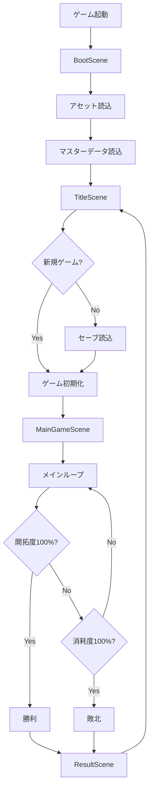

---

## メインループ詳細

🔵 **プレイヤーの1ターン**

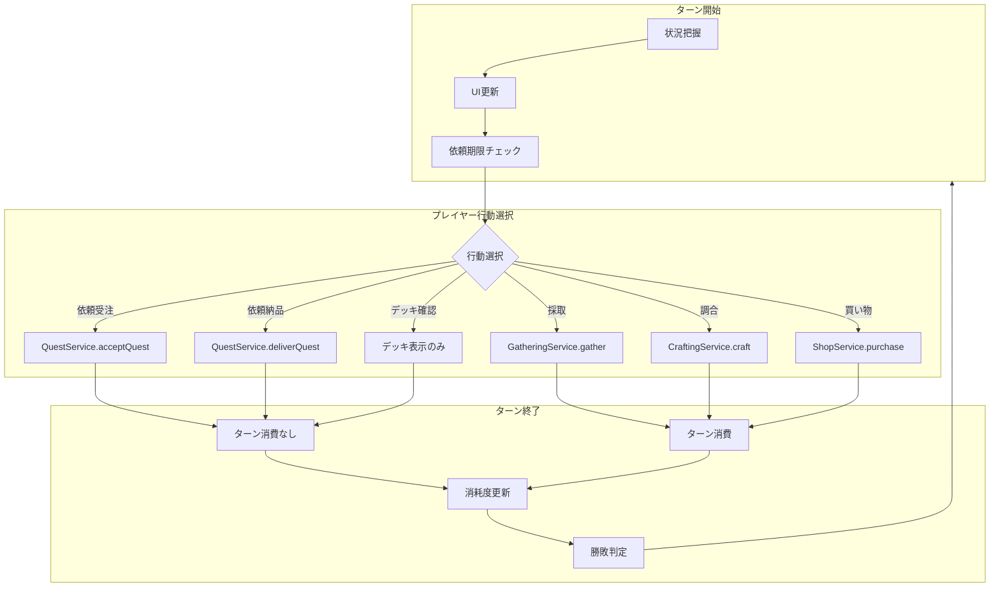

---

## 行動別データフロー

### 依頼受注フロー

🔵 **0ターン消費**

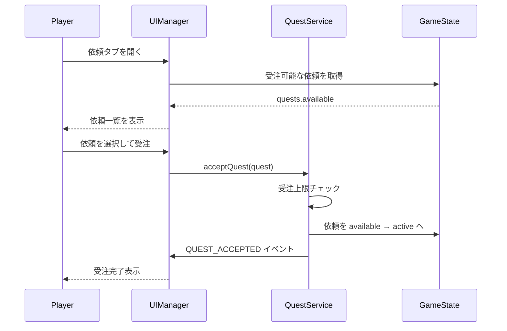

### 依頼納品フロー

🔵 **0ターン消費**

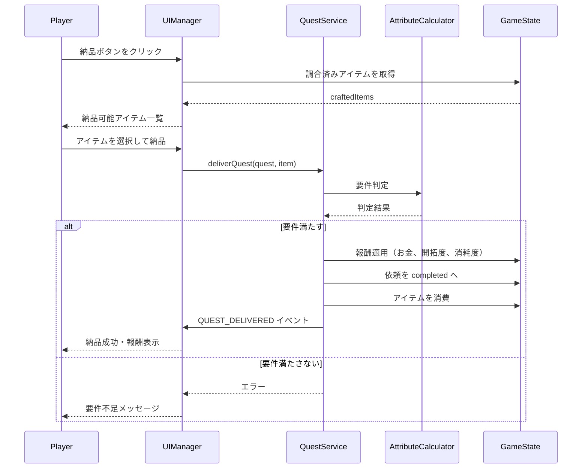

### 採取フロー

🔵 **1〜2ターン消費**

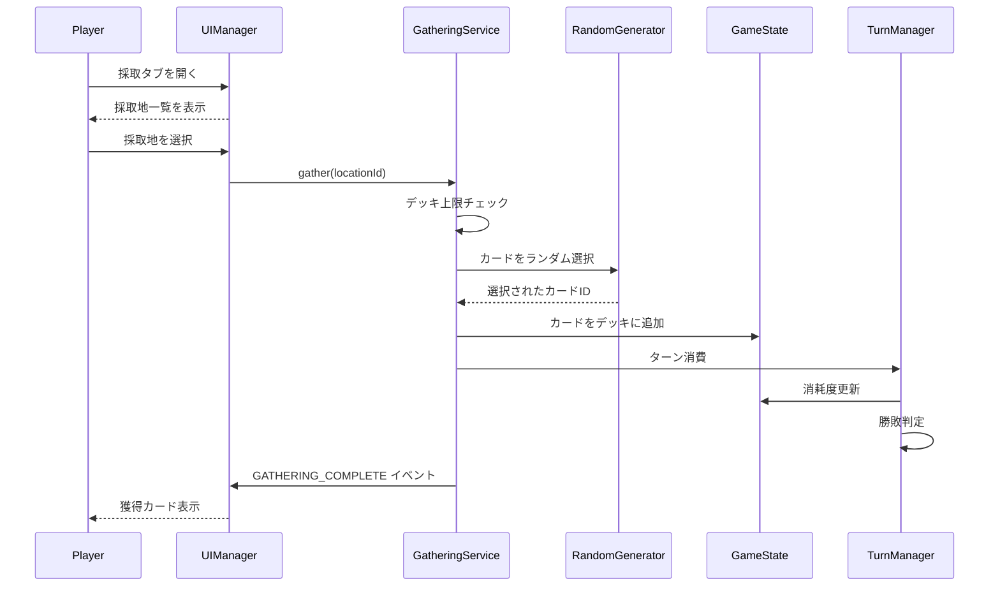

### 調合フロー

🔵 **1〜2ターン消費**

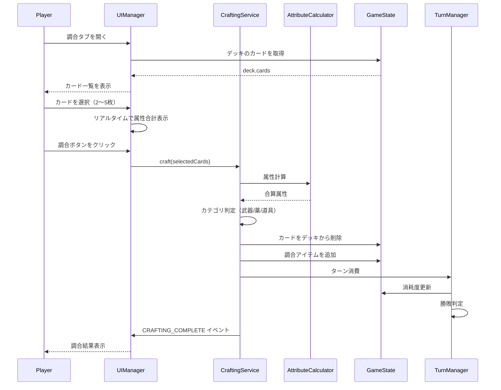

### 買い物フロー

🟡 **1ターン消費**

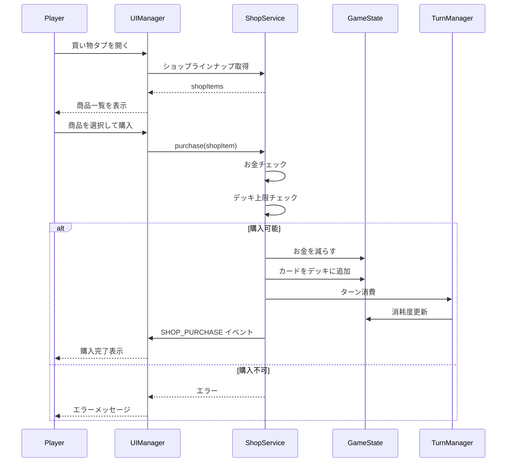

---

## 状態遷移図

### ゲーム状態遷移

🔵

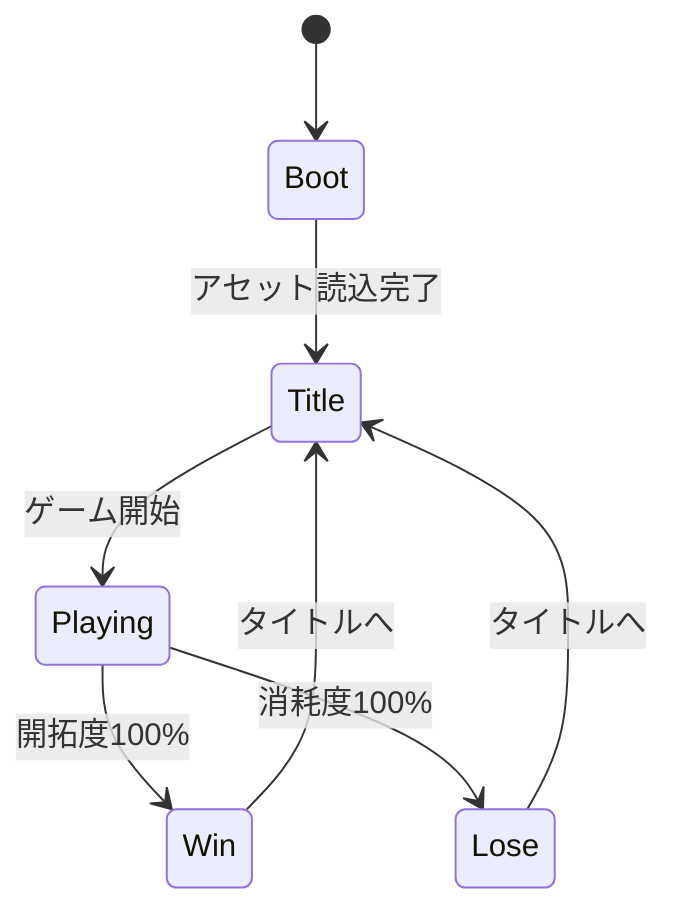

### 依頼状態遷移

🔵

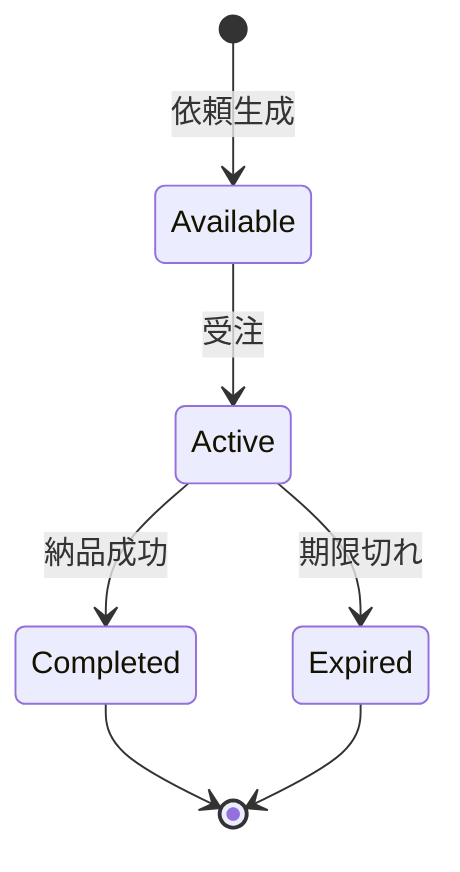

### タブ状態遷移

🟡

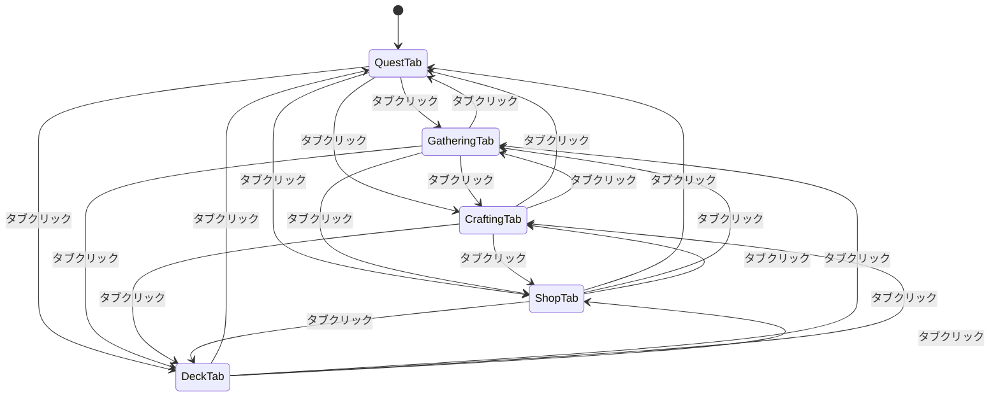

---

## イベントフロー図

🟡 **EventEmitterによる通知**

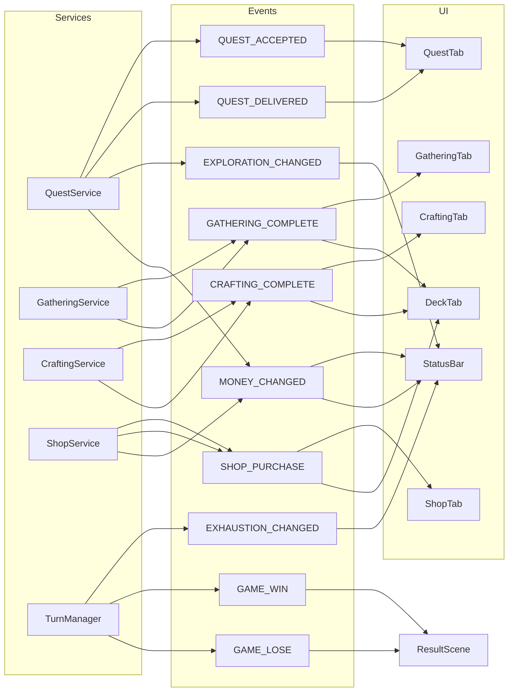

---

## データ永続化フロー

🟡 **localStorageを使用**

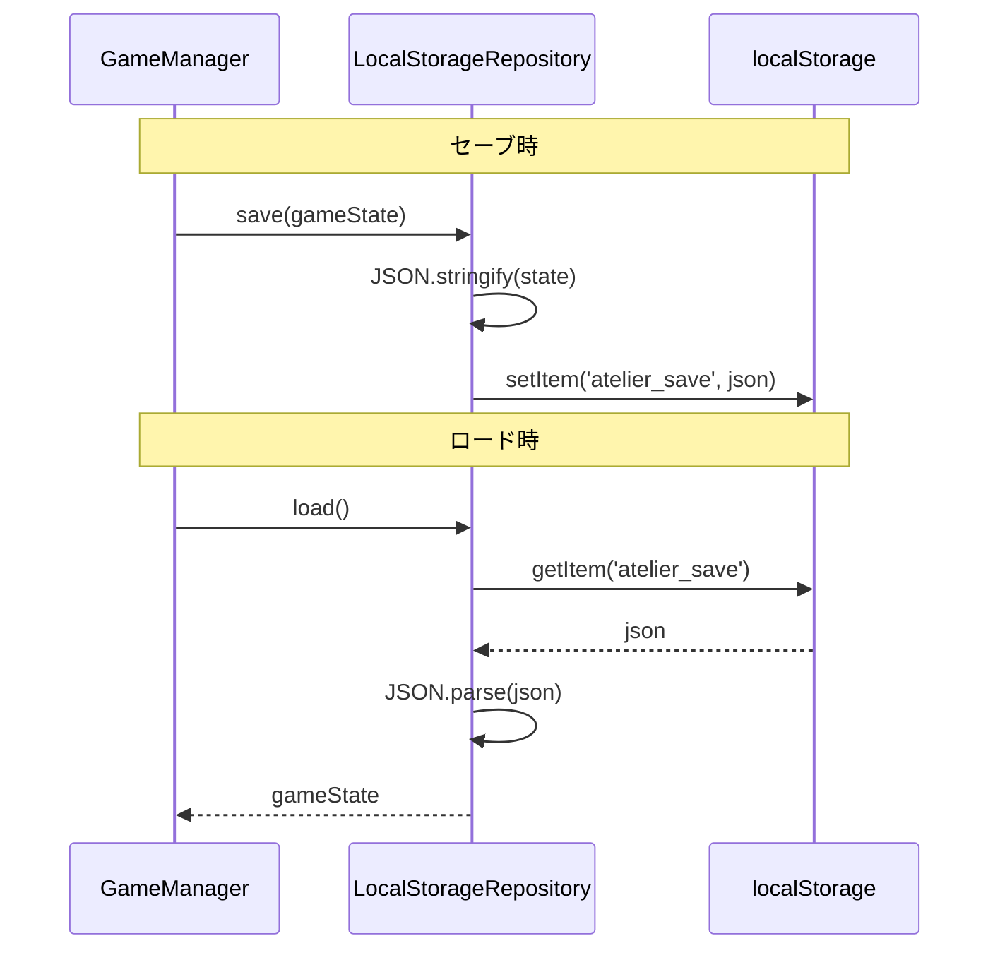

---

## 参照

- [architecture.md](architecture.md) - システムアーキテクチャ
- [core-systems.md](core-systems.md) - コアシステム設計
- [game-mechanics.md](game-mechanics.md) - ゲームメカニクス設計

---

## 変更履歴

| 日付 | バージョン | 変更内容 |
|------|----------|---------|
| 2025-12-29 | 1.0 | 初版作成（HTMLプロトタイプ用） |
