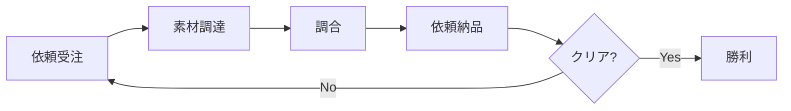

# ゲームメカニクス設計

## 概要

🔵 本ドキュメントは、「アトリエ」HTMLプロトタイプのゲームメカニクスを定義する。
要件定義書v5.1を基に、プロトタイプ向けに簡略化したルール。

**参照元**: [docs/spec/atelier-game-requirements.md](../../spec/atelier-game-requirements.md) v5.1

---

## コアゲームループ

🔵 **「受けて、採って、混ぜて、届けろ。」**



### 基本サイクル

1. **依頼受注**: 依頼リストから依頼を選んで受注（報酬・期限を確認）
2. **素材調達**: 採取または買い物で素材カードを獲得
3. **調合**: 素材カードを消費してアイテムを作成
4. **依頼納品**: 調合したアイテムを納品して報酬獲得
5. **繰り返し**: 開拓度100%になるまで繰り返す

---

## 基本ルール

### ゲーム目標

🔵 **開拓度100%を達成してゲームクリア**

- プレイヤーは錬金術師として開拓地の発展に貢献する
- 武器を納品して開拓度を上げる
- 薬を納品して消耗度を回復する
- 消耗度100%になる前に開拓度100%を目指す

### ターンシステム

🔵 **行動でターンを消費**

| 行動 | ターン消費 |
|------|----------|
| 依頼受注 | 0 |
| 依頼納品 | 0 |
| 採取（近郊の森） | 1 |
| 採取（山麓の岩場） | 2 |
| 調合（2〜3枚使用） | 1 |
| 調合（4〜5枚使用） | 2 |
| 買い物 | 1 |
| デッキ確認 | 0 |

### プレイヤー行動

🔵 **5つの行動から選択**

| 行動 | 効果 |
|------|------|
| **依頼受注** | 依頼リストから依頼を受注（期限・報酬を確認） |
| **依頼納品** | 調合済みアイテムを納品して報酬獲得 |
| **採取** | 採取地で素材カードを獲得 |
| **調合** | 素材カードを消費してアイテムを作成 |
| **買い物** | お金で素材カードを購入 |

---

## 勝敗条件

### 勝利条件

🔵

| 条件 | 判定タイミング | 備考 |
|------|---------------|------|
| 開拓度100%達成 | ターン終了時 | 武器の納品で開拓度UP |

### 敗北条件

🔵

| 条件 | 判定タイミング | 備考 |
|------|---------------|------|
| 消耗度100%到達 | ターン経過時 | 毎ターン自動上昇 |

---

## 計算式

### 属性合算

🔵 **調合時の属性計算**

```
合計属性 = Σ(選択カードの属性値)

例:
  カードA: 火+3, 水+1
  カードB: 火+2, 土+2
  カードC: 水+3
  --------------------------
  合計: 火+5, 水+4, 土+2, 風+0
  総合計: 11
```

### カテゴリ判定

🔵 **調合結果のカテゴリ**

```
if (火 >= 10 OR 土 >= 10):
    カテゴリ = "武器"
elif (水 >= 10 OR 風 >= 10):
    カテゴリ = "薬"
else:
    カテゴリ = "道具"  ※プロトタイプでは使用不可
```

### 依頼報酬

🔵 **納品時の効果**

```
武器納品:
  開拓度 += 報酬.開拓度 (15〜25%)
  お金 += 報酬.お金 (50〜150G)

薬納品:
  消耗度 -= 報酬.消耗度減少 (15〜25%)
  お金 += 報酬.お金 (30〜100G)
```

### 消耗度上昇

🟡 **毎ターン自動上昇**

```
消耗度 += 3  (1ターンあたり+3%)
```

### 依頼期限

🔵 **ターン経過で減少**

```
依頼が active の場合:
  期限 -= 1 (毎ターン)

if (期限 <= 0):
  依頼状態 = "expired"
```

---

## 依頼システム

### 依頼の構造

🔵

| 要素 | 説明 |
|------|------|
| 名前 | 依頼の名称 |
| カテゴリ | 武器 または 薬 |
| 必要属性 | 納品に必要な属性条件 |
| 報酬（お金） | 納品時に獲得するお金 |
| 報酬（効果） | 開拓度UP または 消耗度DOWN |
| 期限 | 残りターン数 |

### 依頼の例

🔵

| 依頼名 | カテゴリ | 要件 | 報酬（お金） | 効果 | 期限 |
|--------|---------|------|-------------|------|------|
| 初心者の剣 | 武器 | 火≥10 | 50G | 開拓度+15% | 15ターン |
| 鋼の剣 | 武器 | 火≥15, 土≥5 | 80G | 開拓度+18% | 12ターン |
| 薬草の水薬 | 薬 | 水≥10 | 30G | 消耗度-15% | 15ターン |
| 解毒薬 | 薬 | 水≥15, 風≥5 | 60G | 消耗度-20% | 12ターン |

### 同時受注制限

🟡 **プロトタイプは最大2件**

- 受注上限に達している場合、新規受注不可
- 期限切れの依頼は自動的に失敗（ペナルティなし）

---

## 採取システム

### 採取地

🟡 **プロトタイプは2箇所**

| 採取地 | ターン消費 | 獲得数 | 傾向 |
|--------|----------|--------|------|
| 近郊の森 | 1 | 2枚 | 水・風属性多め |
| 山麓の岩場 | 2 | 3枚 | 火・土属性多め |

### 採取の流れ

1. 採取地を選択
2. ターンを消費
3. ランダムでカードを獲得
4. デッキに追加

---

## 調合システム

### 調合の流れ

1. 素材カードを2〜5枚選択
2. 属性値がリアルタイムで表示される
3. 調合ボタンを押す
4. カテゴリが自動判定される
5. 調合済みアイテムが生成される
6. 選択したカードはデッキから消滅

### 調合のコツ

🟡

- **武器を作りたい場合**: 火・土属性のカードを多めに
- **薬を作りたい場合**: 水・風属性のカードを多めに
- **属性を足りなくしない**: 依頼要件を満たす属性値を確保

---

## 買い物システム

### ショップ

🟡 **素材カードを購入**

| 要素 | 仕様 |
|------|------|
| ラインナップ | 3〜4種類 |
| 価格 | 10G〜50G |
| 更新 | 3ターンごと |

### 買い物の流れ

1. ショップタブを開く
2. 購入したいカードを選択
3. お金を支払う
4. カードがデッキに追加される
5. 1ターン消費

---

## ゲームの流れ（想定）

### 序盤（ターン1〜10）

🟡

1. **まず依頼を受注**: 簡単な依頼（火≥10の武器など）を受注
2. **採取で素材を集める**: 山麓の岩場で火属性素材を獲得
3. **調合して納品**: 武器を調合して依頼納品

### 中盤（ターン11〜20）

🟡

1. **消耗度に注意**: 消耗度が30〜50%になったら薬の依頼も受注
2. **バランスよく行動**: 武器と薬を交互に納品
3. **お金を貯める**: 余裕があればショップで高品質素材を購入

### 終盤（ターン21〜30）

🟡

1. **開拓度100%を目指す**: 残り開拓度を確認して武器を納品
2. **消耗度管理**: 100%にならないよう薬も適宜納品
3. **期限に注意**: 受注中の依頼が期限切れにならないよう注意

---

## プロトタイプでの省略要素

🔴 **以下は本番実装時に追加**

| 要素 | 理由 |
|------|------|
| 複数開拓地 | コアループ検証に不要 |
| アーティファクト | 複雑化を避ける |
| ランダムイベント | コアメカニクス優先 |
| 操作・知識・特殊カード | 素材カードのみで検証 |
| セーブ機能 | 短時間プレイ想定 |

---

## 参照

- [core-systems.md](core-systems.md) - コアシステム設計
- [balance-design.md](balance-design.md) - バランス設計
- [dataflow.md](dataflow.md) - データフロー図

---

## 変更履歴

| 日付 | バージョン | 変更内容 |
|------|----------|---------|
| 2025-12-29 | 1.0 | 初版作成（HTMLプロトタイプ用） |
