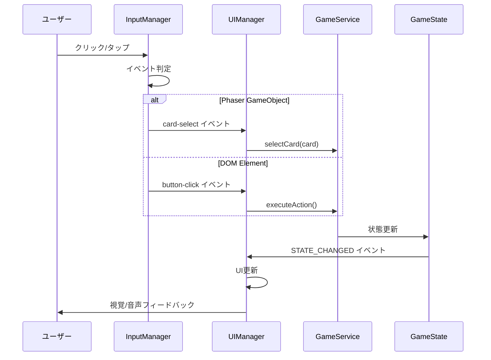

# 入力システム設計

## 概要

🔵 本ドキュメントは、「アトリエ」HTMLプロトタイプの入力システムを定義する。
マウス・タッチ両対応の設計。

**参照元**: [docs/spec/atelier-game-requirements.md](../../../spec/atelier-game-requirements.md) v5.1

---

## 設計方針

🔵 **ハイブリッドUI対応**

| 対象 | 入力方法 |
|------|---------|
| Phaser GameObjects（カード等） | Phaser Input System |
| DOM Elements（ボタン等） | 標準DOM Events |

---

## 対応デバイス

🔵

| デバイス | 入力方式 | 対応状況 |
|---------|---------|---------|
| デスクトップ | マウス | ✅ 完全対応 |
| タブレット | タッチ | ✅ 完全対応 |
| スマートフォン | タッチ | 🟡 基本対応 |

---

## Phaser Input System

### カード操作

🔵 **素材カードのインタラクション**

```javascript
class CardSprite extends Phaser.GameObjects.Container {
  constructor(scene, x, y, cardData) {
    super(scene, x, y);

    // インタラクティブ領域の設定
    this.setSize(80, 120);
    this.setInteractive({ useHandCursor: true });

    // イベントリスナー登録
    this.on('pointerover', this.onHover, this);
    this.on('pointerout', this.onHoverEnd, this);
    this.on('pointerdown', this.onPress, this);
    this.on('pointerup', this.onRelease, this);
  }

  onHover() {
    // ホバー時のハイライト表示
    this.setScale(1.05);
    this.showTooltip();
  }

  onHoverEnd() {
    // ホバー解除
    if (!this.isSelected) {
      this.setScale(1.0);
    }
    this.hideTooltip();
  }

  onPress() {
    // 押下時のフィードバック
    this.setScale(0.95);
  }

  onRelease() {
    // 選択状態のトグル
    this.isSelected = !this.isSelected;
    this.setScale(this.isSelected ? 1.1 : 1.0);
    this.emit('card-select', this.cardData);
  }
}
```

### 入力状態管理

🟡 **Phaser Input Manager拡張**

```javascript
class InputManager {
  constructor(scene) {
    this.scene = scene;
    this.selectedCards = [];
    this.isDragging = false;
    this.dragTarget = null;
  }

  // カード選択の管理
  selectCard(card) {
    if (this.selectedCards.includes(card)) {
      this.deselectCard(card);
      return;
    }

    // 選択上限チェック（5枚まで）
    if (this.selectedCards.length >= 5) {
      this.scene.events.emit('selection-limit-reached');
      return;
    }

    this.selectedCards.push(card);
    card.setSelected(true);
    this.scene.events.emit('card-selected', card);
  }

  deselectCard(card) {
    const index = this.selectedCards.indexOf(card);
    if (index > -1) {
      this.selectedCards.splice(index, 1);
      card.setSelected(false);
      this.scene.events.emit('card-deselected', card);
    }
  }

  clearSelection() {
    this.selectedCards.forEach(card => card.setSelected(false));
    this.selectedCards = [];
    this.scene.events.emit('selection-cleared');
  }

  getSelectedCards() {
    return [...this.selectedCards];
  }
}
```

---

## DOM Input Events

### ボタン操作

🔵 **標準的なボタンハンドリング**

```javascript
class UIManager {
  constructor() {
    this.buttons = new Map();
  }

  createButton(id, label, onClick) {
    const button = document.createElement('button');
    button.id = id;
    button.className = 'game-button';
    button.textContent = label;

    // クリックイベント
    button.addEventListener('click', (e) => {
      e.preventDefault();
      this.playClickSound();
      onClick();
    });

    // タッチ対応（タップ時の遅延防止）
    button.addEventListener('touchstart', (e) => {
      e.preventDefault();
      button.classList.add('active');
    });

    button.addEventListener('touchend', (e) => {
      e.preventDefault();
      button.classList.remove('active');
      this.playClickSound();
      onClick();
    });

    this.buttons.set(id, button);
    return button;
  }

  setButtonEnabled(id, enabled) {
    const button = this.buttons.get(id);
    if (button) {
      button.disabled = !enabled;
      button.classList.toggle('disabled', !enabled);
    }
  }

  playClickSound() {
    // 効果音再生（Phaser側で処理）
    if (window.gameInstance) {
      window.gameInstance.events.emit('play-sound', 'click');
    }
  }
}
```

### タブ切り替え

🔵 **タブUIのインタラクション**

```javascript
class TabController {
  constructor(container) {
    this.container = container;
    this.tabs = [];
    this.activeTab = null;
  }

  createTab(id, label) {
    const tab = document.createElement('div');
    tab.className = 'tab';
    tab.dataset.tabId = id;
    tab.textContent = label;

    tab.addEventListener('click', () => this.selectTab(id));
    tab.addEventListener('keydown', (e) => {
      if (e.key === 'Enter' || e.key === ' ') {
        e.preventDefault();
        this.selectTab(id);
      }
    });

    // アクセシビリティ
    tab.setAttribute('role', 'tab');
    tab.setAttribute('tabindex', '0');

    this.tabs.push({ id, element: tab });
    return tab;
  }

  selectTab(tabId) {
    // 前のタブを非アクティブに
    if (this.activeTab) {
      this.activeTab.element.classList.remove('active');
      this.activeTab.element.setAttribute('aria-selected', 'false');
    }

    // 新しいタブをアクティブに
    const newTab = this.tabs.find(t => t.id === tabId);
    if (newTab) {
      newTab.element.classList.add('active');
      newTab.element.setAttribute('aria-selected', 'true');
      this.activeTab = newTab;

      // コンテンツ切り替えイベント発火
      this.container.dispatchEvent(new CustomEvent('tab-change', {
        detail: { tabId }
      }));
    }
  }
}
```

---

## ジェスチャー対応

### タッチジェスチャー

🟡 **基本的なジェスチャー**

| ジェスチャー | 動作 | 対応画面 |
|------------|------|---------|
| タップ | 選択・決定 | 全画面 |
| 長押し | ツールチップ表示 | カード |
| スワイプ | タブ切り替え | メイン画面 |
| ピンチ | 未対応 | - |

### ジェスチャー実装

🟡 **タッチジェスチャー検出**

```javascript
class GestureDetector {
  constructor(element) {
    this.element = element;
    this.touchStartX = 0;
    this.touchStartY = 0;
    this.touchStartTime = 0;

    this.SWIPE_THRESHOLD = 50; // px
    this.LONG_PRESS_DURATION = 500; // ms
    this.longPressTimer = null;

    this.bindEvents();
  }

  bindEvents() {
    this.element.addEventListener('touchstart', this.onTouchStart.bind(this));
    this.element.addEventListener('touchmove', this.onTouchMove.bind(this));
    this.element.addEventListener('touchend', this.onTouchEnd.bind(this));
  }

  onTouchStart(e) {
    const touch = e.touches[0];
    this.touchStartX = touch.clientX;
    this.touchStartY = touch.clientY;
    this.touchStartTime = Date.now();

    // 長押し検出タイマー開始
    this.longPressTimer = setTimeout(() => {
      this.element.dispatchEvent(new CustomEvent('longpress', {
        detail: { x: this.touchStartX, y: this.touchStartY }
      }));
    }, this.LONG_PRESS_DURATION);
  }

  onTouchMove(e) {
    // 移動したら長押しキャンセル
    clearTimeout(this.longPressTimer);
  }

  onTouchEnd(e) {
    clearTimeout(this.longPressTimer);

    const touch = e.changedTouches[0];
    const deltaX = touch.clientX - this.touchStartX;
    const deltaY = touch.clientY - this.touchStartY;
    const duration = Date.now() - this.touchStartTime;

    // スワイプ判定
    if (Math.abs(deltaX) > this.SWIPE_THRESHOLD && duration < 300) {
      const direction = deltaX > 0 ? 'right' : 'left';
      this.element.dispatchEvent(new CustomEvent('swipe', {
        detail: { direction }
      }));
    }
  }
}
```

---

## キーボード操作

### ショートカットキー

🟡 **デスクトップ向けキーボード操作**

| キー | 動作 | 画面 |
|-----|------|------|
| Tab | フォーカス移動 | 全画面 |
| Enter | 決定 | 全画面 |
| Escape | キャンセル/閉じる | ダイアログ |
| 1-5 | タブ切り替え | メイン画面 |
| Space | カード選択 | 調合タブ |

### キーボードハンドラー

🟡 **キーボード入力処理**

```javascript
class KeyboardHandler {
  constructor(scene) {
    this.scene = scene;
    this.enabled = true;
    this.bindKeys();
  }

  bindKeys() {
    // Phaser Keyboard Input
    this.keys = {
      one: this.scene.input.keyboard.addKey(Phaser.Input.Keyboard.KeyCodes.ONE),
      two: this.scene.input.keyboard.addKey(Phaser.Input.Keyboard.KeyCodes.TWO),
      three: this.scene.input.keyboard.addKey(Phaser.Input.Keyboard.KeyCodes.THREE),
      four: this.scene.input.keyboard.addKey(Phaser.Input.Keyboard.KeyCodes.FOUR),
      five: this.scene.input.keyboard.addKey(Phaser.Input.Keyboard.KeyCodes.FIVE),
      space: this.scene.input.keyboard.addKey(Phaser.Input.Keyboard.KeyCodes.SPACE),
      escape: this.scene.input.keyboard.addKey(Phaser.Input.Keyboard.KeyCodes.ESC),
      enter: this.scene.input.keyboard.addKey(Phaser.Input.Keyboard.KeyCodes.ENTER)
    };

    // タブ切り替えショートカット
    this.keys.one.on('down', () => this.onTabKey(0));
    this.keys.two.on('down', () => this.onTabKey(1));
    this.keys.three.on('down', () => this.onTabKey(2));
    this.keys.four.on('down', () => this.onTabKey(3));
    this.keys.five.on('down', () => this.onTabKey(4));

    // ESCキー
    this.keys.escape.on('down', () => {
      this.scene.events.emit('escape-pressed');
    });

    // Enterキー
    this.keys.enter.on('down', () => {
      this.scene.events.emit('enter-pressed');
    });
  }

  onTabKey(index) {
    if (!this.enabled) return;
    this.scene.events.emit('tab-shortcut', index);
  }

  setEnabled(enabled) {
    this.enabled = enabled;
  }
}
```

---

## フィードバックシステム

### 視覚フィードバック

🔵 **インタラクションへのレスポンス**

| トリガー | フィードバック |
|---------|--------------|
| ホバー | ハイライト、カーソル変更 |
| クリック | スケールダウン→アップ |
| 選択 | 枠線ハイライト、チェックマーク |
| 無効状態 | グレーアウト、カーソル変更なし |

```css
/* ボタンフィードバック */
.game-button {
  transition: transform 0.1s, background-color 0.2s;
  cursor: pointer;
}

.game-button:hover {
  background-color: var(--color-primary-light);
  transform: scale(1.02);
}

.game-button:active,
.game-button.active {
  transform: scale(0.98);
}

.game-button:disabled,
.game-button.disabled {
  opacity: 0.5;
  cursor: not-allowed;
  pointer-events: none;
}

/* カード選択状態 */
.card.selected {
  border: 3px solid var(--color-accent);
  box-shadow: 0 0 10px var(--color-accent);
}
```

### 音声フィードバック

🟡 **効果音の再生タイミング**

| アクション | 効果音 |
|-----------|--------|
| ボタンクリック | click.mp3 |
| カード選択 | select.mp3 |
| 調合成功 | craft_success.mp3 |
| 採取完了 | gather.mp3 |
| エラー | error.mp3 |

```javascript
class SoundManager {
  constructor(scene) {
    this.scene = scene;
    this.sounds = {};
    this.muted = false;
  }

  preload() {
    this.scene.load.audio('click', 'assets/sounds/click.mp3');
    this.scene.load.audio('select', 'assets/sounds/select.mp3');
    this.scene.load.audio('craft_success', 'assets/sounds/craft_success.mp3');
    this.scene.load.audio('gather', 'assets/sounds/gather.mp3');
    this.scene.load.audio('error', 'assets/sounds/error.mp3');
  }

  create() {
    Object.keys(this.sounds).forEach(key => {
      this.sounds[key] = this.scene.sound.add(key);
    });
  }

  play(soundKey) {
    if (this.muted) return;
    if (this.sounds[soundKey]) {
      this.sounds[soundKey].play();
    }
  }

  setMuted(muted) {
    this.muted = muted;
  }
}
```

---

## アクセシビリティ

### フォーカス管理

🟡 **キーボードナビゲーション対応**

```javascript
class FocusManager {
  constructor() {
    this.focusableElements = [];
    this.currentFocusIndex = 0;
  }

  registerFocusable(element) {
    element.setAttribute('tabindex', '0');
    element.addEventListener('focus', () => this.onFocus(element));
    this.focusableElements.push(element);
  }

  onFocus(element) {
    // フォーカスリングの表示
    element.classList.add('focused');
  }

  moveFocus(direction) {
    this.currentFocusIndex += direction;
    if (this.currentFocusIndex < 0) {
      this.currentFocusIndex = this.focusableElements.length - 1;
    } else if (this.currentFocusIndex >= this.focusableElements.length) {
      this.currentFocusIndex = 0;
    }
    this.focusableElements[this.currentFocusIndex].focus();
  }
}
```

### ARIA属性

🟡 **スクリーンリーダー対応**

```html
<!-- タブ -->
<div role="tablist" aria-label="メインメニュー">
  <button role="tab" aria-selected="true" aria-controls="panel-quest">依頼</button>
  <button role="tab" aria-selected="false" aria-controls="panel-gather">採取</button>
</div>

<!-- カード -->
<div role="button"
     aria-label="鉄鉱石 火属性3 土属性1"
     aria-pressed="false">
  <span class="card-name">鉄鉱石</span>
  <span class="card-attributes">火+3 土+1</span>
</div>

<!-- ステータス（ライブリージョン） -->
<div aria-live="polite" aria-atomic="true" id="status-announcer">
  開拓度が60%になりました
</div>
```

---

## イベントフロー

🔵 **入力からゲーム状態更新までの流れ**



---

## プラットフォーム別考慮事項

### モバイル対応

🟡 **スマートフォン・タブレット**

| 項目 | 対応 |
|------|------|
| タッチターゲットサイズ | 最小44x44px |
| ダブルタップズーム防止 | touch-action: manipulation |
| ホバー状態 | タッチデバイスでは無効化 |
| 仮想キーボード | 入力フィールドなしのため不要 |

```css
/* タッチデバイス対応 */
@media (pointer: coarse) {
  .game-button {
    min-width: 44px;
    min-height: 44px;
    padding: 12px 16px;
  }

  .card {
    min-width: 60px;
    min-height: 90px;
  }
}

/* ホバー無効化 */
@media (hover: none) {
  .game-button:hover {
    background-color: inherit;
    transform: none;
  }
}
```

### ビューポート設定

🔵 **HTML meta設定**

```html
<meta name="viewport" content="width=device-width, initial-scale=1.0, maximum-scale=1.0, user-scalable=no">
<meta name="apple-mobile-web-app-capable" content="yes">
<meta name="mobile-web-app-capable" content="yes">
```

---

## 参照

- [overview.md](overview.md) - UI設計概要
- [screens/main-screen.md](screens/main-screen.md) - メイン画面設計
- [../architecture.md](../architecture.md) - システムアーキテクチャ

---

## 変更履歴

| 日付 | バージョン | 変更内容 |
|------|----------|---------|
| 2025-12-29 | 1.0 | 初版作成（HTMLプロトタイプ用） |
