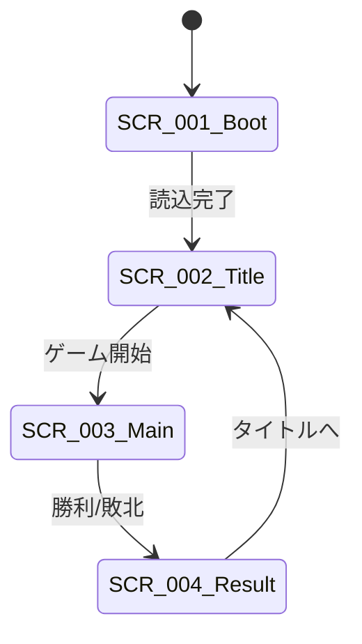

# UI設計概要

## 概要

🟡 本ドキュメントは、「アトリエ」HTMLプロトタイプのUI設計概要を定義する。
Phaser 3 + DOM Elementsのハイブリッドアプローチを採用。

---

## 画面一覧

| 画面ID | 画面名 | 説明 | 詳細ファイル |
|--------|--------|------|-------------|
| SCR-001 | ブート画面 | アセット読込中 | - |
| SCR-002 | タイトル画面 | ゲーム開始選択 | - |
| SCR-003 | メイン画面 | ゲームプレイ | [main-screen.md](screens/main-screen.md) |
| SCR-004 | リザルト画面 | 結果表示 | - |

---

## 画面遷移図

🔵



---

## UI実装方針

### ハイブリッドアプローチ

🟡 **Phaser + DOM の使い分け**

| 要素 | 実装方法 | 理由 |
|------|----------|------|
| カード表示 | Phaser Sprite | インタラクション、アニメーション |
| カード選択 | Phaser Interactive | ドラッグ&ドロップ |
| ボタン | DOM Button | スタイリングの容易さ |
| テキスト表示 | DOM | フォント・レイアウトの柔軟性 |
| ステータスバー | DOM | 固定位置、頻繁な更新 |
| タブ | DOM | 標準的なUI |
| ダイアログ | DOM | モーダル表示 |

### 解像度

🟡

| 項目 | 値 |
|------|-----|
| ゲームキャンバス | 800 x 600 |
| スケールモード | FIT |
| 最小幅 | 320px（モバイル対応） |
| 最大幅 | 1920px |

---

## 共通UIコンポーネント

### ボタン

🟡

| 種類 | 用途 | スタイル |
|------|------|---------|
| プライマリ | 確定アクション（決定、開始） | 塗りつぶし、ブランドカラー |
| セカンダリ | キャンセル、戻る | 枠線のみ |
| テキスト | 補助アクション | 下線のみ |
| 無効 | 実行不可の状態 | グレーアウト |

```css
/* ボタンスタイル */
.btn-primary {
  background-color: #8B4513;
  color: #FFF;
  border: none;
  padding: 10px 20px;
  cursor: pointer;
}

.btn-primary:hover {
  background-color: #A0522D;
}

.btn-primary:disabled {
  background-color: #CCC;
  cursor: not-allowed;
}

.btn-secondary {
  background-color: transparent;
  color: #8B4513;
  border: 2px solid #8B4513;
  padding: 10px 20px;
  cursor: pointer;
}
```

### カード

🟡

| 状態 | 表示 |
|------|------|
| 通常 | 標準表示 |
| ホバー | 拡大 + 光彩 |
| 選択中 | 枠線ハイライト |
| 無効 | グレースケール |

```javascript
// Phaserでのカードスプライト
class CardSprite extends Phaser.GameObjects.Container {
  constructor(scene, x, y, cardData) {
    super(scene, x, y);

    // 背景
    this.bg = scene.add.rectangle(0, 0, 80, 120, 0xFFFAF0);
    this.add(this.bg);

    // カード名
    this.nameText = scene.add.text(0, -40, cardData.name, {
      fontSize: '12px',
      color: '#333'
    }).setOrigin(0.5);
    this.add(this.nameText);

    // 属性アイコン
    this.attributeIcons = this.createAttributeIcons(cardData);

    // インタラクティブ設定
    this.setSize(80, 120);
    this.setInteractive();
  }
}
```

### ダイアログ

🟡

| 種類 | 用途 |
|------|------|
| 確認ダイアログ | 依頼受注確認、納品確認 |
| 情報ダイアログ | 調合結果、報酬表示 |
| エラーダイアログ | エラー表示 |

```html
<div class="dialog-overlay" id="dialog-overlay">
  <div class="dialog">
    <div class="dialog-header">
      <h3 id="dialog-title">確認</h3>
    </div>
    <div class="dialog-body">
      <p id="dialog-message">本当によろしいですか？</p>
    </div>
    <div class="dialog-footer">
      <button class="btn-secondary" id="dialog-cancel">キャンセル</button>
      <button class="btn-primary" id="dialog-confirm">確定</button>
    </div>
  </div>
</div>
```

### タブ

🟡

```html
<div class="tab-container">
  <div class="tab-header">
    <button class="tab-btn active" data-tab="quest">依頼</button>
    <button class="tab-btn" data-tab="gathering">採取</button>
    <button class="tab-btn" data-tab="crafting">調合</button>
    <button class="tab-btn" data-tab="shop">買い物</button>
    <button class="tab-btn" data-tab="deck">デッキ</button>
  </div>
  <div class="tab-content">
    <!-- タブコンテンツ -->
  </div>
</div>
```

---

## デザイン規約

### カラーパレット

🟡 **錬金術・ファンタジーテーマ**

| 用途 | カラーコード | 説明 |
|------|-------------|------|
| プライマリ | #8B4513 | サドルブラウン（木・革） |
| セカンダリ | #DAA520 | ゴールデンロッド（金属） |
| 背景 | #FFF8DC | コーンシルク（羊皮紙） |
| テキスト | #2F4F4F | ダークスレートグレー |
| 成功 | #228B22 | フォレストグリーン |
| 警告 | #FF8C00 | ダークオレンジ |
| エラー | #DC143C | クリムゾン |
| 火属性 | #FF4500 | オレンジレッド |
| 水属性 | #1E90FF | ドジャーブルー |
| 土属性 | #8B4513 | サドルブラウン |
| 風属性 | #90EE90 | ライトグリーン |

### フォント設定

🟡

| 用途 | フォント | サイズ | ウェイト |
|------|---------|--------|---------|
| タイトル | serif | 24px | Bold |
| 見出し | sans-serif | 18px | Bold |
| 本文 | sans-serif | 14px | Regular |
| キャプション | sans-serif | 12px | Regular |
| 数値 | monospace | 16px | Bold |

```css
:root {
  --font-title: 'Georgia', serif;
  --font-body: 'Helvetica Neue', Arial, sans-serif;
  --font-number: 'Courier New', monospace;
}
```

### 余白・間隔

🟡

| 名称 | 値 | 用途 |
|------|-----|------|
| xs | 4px | 極小間隔 |
| sm | 8px | 小間隔 |
| md | 16px | 標準間隔 |
| lg | 24px | 大間隔 |
| xl | 32px | 極大間隔 |

```css
:root {
  --spacing-xs: 4px;
  --spacing-sm: 8px;
  --spacing-md: 16px;
  --spacing-lg: 24px;
  --spacing-xl: 32px;
}
```

---

## トランジション・アニメーション

### 画面遷移

🟡

| トランジション | 時間 | イージング |
|---------------|------|-----------|
| フェードイン | 0.3s | ease-out |
| フェードアウト | 0.2s | ease-in |

### UI要素

🟡

| アニメーション | 時間 | イージング |
|---------------|------|-----------|
| ボタンホバー | 0.1s | ease |
| カード選択 | 0.15s | ease-out |
| ダイアログ表示 | 0.2s | ease-out |
| タブ切替 | 0.15s | ease |

### Phaserアニメーション

🟡

```javascript
// カード選択アニメーション
scene.tweens.add({
  targets: cardSprite,
  scaleX: 1.1,
  scaleY: 1.1,
  duration: 150,
  ease: 'Power2'
});

// 獲得カードアニメーション
scene.tweens.add({
  targets: cardSprite,
  y: targetY,
  alpha: { from: 0, to: 1 },
  duration: 300,
  ease: 'Back.easeOut'
});
```

---

## レスポンシブ対応

🟡 **モバイル対応（参考）**

| ブレークポイント | 幅 | レイアウト |
|-----------------|-----|-----------|
| デスクトップ | 800px以上 | 標準 |
| タブレット | 600〜799px | やや縮小 |
| モバイル | 〜599px | 縦レイアウト |

※プロトタイプではデスクトップ優先、モバイル対応は本番で

---

## 参照

- [screens/main-screen.md](screens/main-screen.md) - メイン画面詳細設計
- [input-system.md](input-system.md) - 入力システム設計
- [../architecture.md](../architecture.md) - システムアーキテクチャ

---

## 変更履歴

| 日付 | バージョン | 変更内容 |
|------|----------|---------|
| 2025-12-29 | 1.0 | 初版作成（HTMLプロトタイプ用） |
