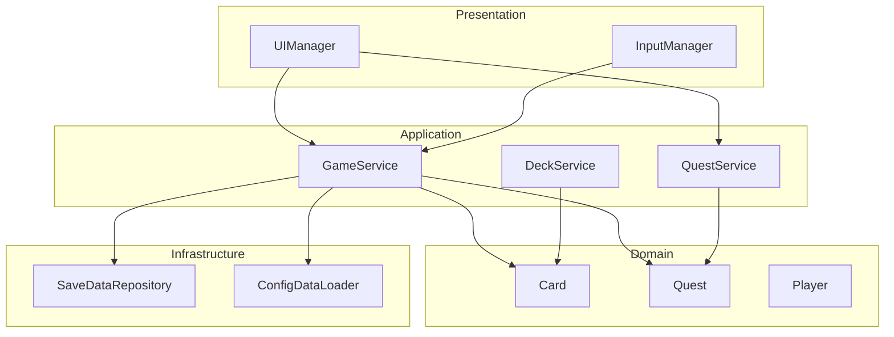

# システムアーキテクチャ

## 概要

本ドキュメントは、ゲーム「アトリエ」のシステムアーキテクチャの概要を提供するのだ。

**詳細設計参照**: [01-architecture.md](../../spec/design/01-architecture.md)

---

## アーキテクチャ概要

### レイヤー構成

🔵 **Clean Architecture** (4層構造)

```
┌─────────────────────────────────────┐
│         Presentation Layer          │ ← Unity UI, Input
├─────────────────────────────────────┤
│         Application Layer           │ ← UseCase, Service
├─────────────────────────────────────┤
│           Domain Layer              │ ← Entity, ValueObject
├─────────────────────────────────────┤
│        Infrastructure Layer         │ ← Repository, External
└─────────────────────────────────────┘
```

### 依存関係



---

## 主要コンポーネント

| レイヤー | コンポーネント | 責務 |
|---------|--------------|------|
| Presentation | UIManager | UI表示・更新 |
| Presentation | InputManager | 入力処理 |
| Application | GameService | ゲーム進行管理 |
| Application | QuestService | 依頼システム |
| Application | DeckService | デッキ操作 |
| Domain | Card | カードエンティティ |
| Domain | Quest | 依頼エンティティ |
| Domain | Player | プレイヤー状態 |
| Infrastructure | SaveDataRepository | セーブ/ロード |
| Infrastructure | ConfigDataLoader | マスターデータ読込 |

---

## 技術スタック

| 項目 | 技術 |
|------|------|
| エンジン | Unity 2021.3 LTS |
| 言語 | C# (.NET Standard 2.1) |
| データフォーマット | JSON |
| UI | Unity UI (uGUI) |

---

## 設計原則

1. **依存性逆転の原則 (DIP)**
   - 上位レイヤーは下位レイヤーに依存しない
   - インターフェースによる抽象化

2. **単一責任の原則 (SRP)**
   - 各クラスは単一の責務を持つ

3. **イベント駆動**
   - EventBusによる疎結合通信

---

## 参照

- [01-architecture.md](../../spec/design/01-architecture.md) - 詳細なアーキテクチャ設計
- [08-infrastructure.md](../../spec/design/08-infrastructure.md) - インフラストラクチャ層の詳細

---

## 変更履歴

| 日付 | バージョン | 変更内容 |
|------|----------|---------|
| 2025-12-20 | 1.0 | 初版作成 |
