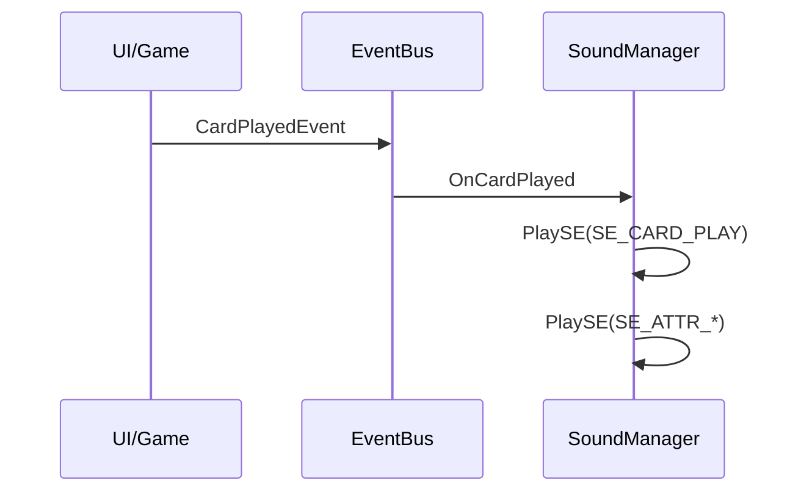

# オーディオ設計

## 概要

本ドキュメントは、ゲーム「アトリエ」のオーディオシステムの概要を提供するのだ。

**詳細設計参照**: [06-audio.md](../../spec/design/06-audio.md)

---

## オーディオ分類

| 分類 | 説明 | ボリューム制御 |
|------|------|---------------|
| BGM | 背景音楽 | 独立スライダー |
| SE | 効果音 | 独立スライダー |
| UI音 | UI操作音 | SE と共通 |

---

## BGM一覧

| BGM ID | 使用場面 | ループ | 備考 |
|--------|---------|--------|------|
| BGM_TITLE | タイトル画面 | ✅ | 穏やかな曲調 |
| BGM_MAP | マップ画面 | ✅ | 冒険的な曲調 |
| BGM_QUEST | 依頼画面 | ✅ | 緊張感のある曲調 |
| BGM_MERCHANT | 商人画面 | ✅ | 賑やかな曲調 |
| BGM_BOSS | ボス戦 | ✅ | 激しい曲調 |
| BGM_VICTORY | 勝利リザルト | ❌ | ファンファーレ |
| BGM_DEFEAT | 敗北リザルト | ❌ | 物悲しい曲調 |

---

## SE一覧

### UI操作音

| SE ID | トリガー |
|-------|---------|
| SE_BUTTON_CLICK | ボタン押下 |
| SE_BUTTON_HOVER | ボタンホバー |
| SE_CANCEL | キャンセル操作 |
| SE_DIALOG_OPEN | ダイアログ表示 |
| SE_DIALOG_CLOSE | ダイアログ閉じる |

### ゲームプレイ音

| SE ID | トリガー |
|-------|---------|
| SE_CARD_DRAW | カードドロー |
| SE_CARD_PLAY | カードプレイ |
| SE_CARD_DISCARD | カード捨て |
| SE_QUEST_COMPLETE | 依頼達成 |
| SE_EXPLOSION | 暴発発生 |
| SE_TURN_END | ターン終了 |
| SE_GOLD_GAIN | ゴールド獲得 |
| SE_LEVELUP | レベルアップ |

### 属性エフェクト音

| SE ID | 属性 |
|-------|------|
| SE_ATTR_FIRE | 火属性加算 |
| SE_ATTR_WATER | 水属性加算 |
| SE_ATTR_EARTH | 地属性加算 |
| SE_ATTR_WIND | 風属性加算 |
| SE_ATTR_POISON | 毒属性加算 |

---

## サウンドトリガー

---

## ボリューム設定

| 設定項目 | 範囲 | デフォルト |
|---------|------|-----------|
| マスターボリューム | 0-100 | 80 |
| BGMボリューム | 0-100 | 70 |
| SEボリューム | 0-100 | 80 |

---

## フェード設定

| トランジション | フェードイン | フェードアウト |
|----------------|-------------|---------------|
| 画面遷移 | 0.5s | 0.3s |
| BGM切替 | 1.0s | 0.5s |

---

## 参照

- [06-audio.md](../../spec/design/06-audio.md) - オーディオシステム詳細設計

---

## 変更履歴

| 日付 | バージョン | 変更内容 |
|------|----------|---------|
| 2025-12-20 | 1.0 | 初版作成 |
