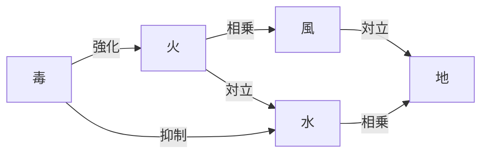

# バランス設計

## 概要

本ドキュメントは、錬金術×ローグライク×デッキ構築ゲーム「アトリエ」のゲームバランス設計を定義するのだ。

**関連要件**: REQ-018, REQ-041-1, REQ-024-1〜3, REQ-031

---

## 設計方針

🔵 **1プレイ20〜40分** (REQ-018)

### 基本理念

1. **段階的な難易度上昇**: 初心者でも最初のプレイで基本を理解できる
2. **戦略的な選択肢**: 複数の有効な戦略が存在する
3. **リスクとリワード**: 高リスクな選択に高リターンを設定
4. **周回ごとの成長**: メタ進行により長期的なモチベーション維持

---

## 難易度曲線

```
難易度
  ↑
  │         ╭───────╮
  │        ╱         ╲    ╭────  ← ボス戦
  │       ╱           ╲__╱
  │      ╱                    ← 中盤の山場
  │     ╱
  │    ╱                      ← 基本習得
  │___╱
  └──────────────────────────→ 進行度
       序盤    中盤    終盤
     (1-3)   (4-7)   (8-10)
```

### 序盤（レベル1-3）: 約0-33%

| 項目 | 設計 |
|------|------|
| **目標** | 基本操作の習得 |
| **難易度** | 低 |
| **重点** | チュートリアル要素、シンプルな依頼 |
| **依頼** | 単一属性、低い必要値 |
| **敵出現率** | 魔物ノード少なめ |
| **報酬** | 基本カード中心 |

### 中盤（レベル4-7）: 約34-66%

| 項目 | 設計 |
|------|------|
| **目標** | 戦略の深化 |
| **難易度** | 中〜高 |
| **重点** | デッキ構築、複合属性 |
| **依頼** | 複合属性、中程度の必要値 |
| **敵出現率** | 標準 |
| **報酬** | レアカード出現開始 |

### 終盤（レベル8-10）: 約67-100%

| 項目 | 設計 |
|------|------|
| **目標** | マスタリー発揮 |
| **難易度** | 高 |
| **重点** | 最適化、リソース管理 |
| **依頼** | 高難度、厳しい安定値要求 |
| **敵出現率** | 高め |
| **報酬** | エピック・レジェンダリーカード |

---

## パラメータ設計

### エネルギーシステム

🔵 **確定値** (ユーザーヒアリングより)

| パラメータ | 値 | 根拠 |
|-----------|-----|------|
| 初期エネルギー | 3 | ユーザー承認 |
| 最大エネルギー | 10 | ユーザー承認 |
| 毎ターン獲得 | 3 | 1ターン2〜3枚プレイ想定 |

### カードコスト分布

🔵 **確定値** (ユーザーヒアリングより: 1-2が多め)

| コスト | 割合 | カード例 |
|--------|------|---------|
| 0 | 5% | 基本素材、弱い操作 |
| 1 | 30% | 標準素材、基本操作 |
| 2 | 35% | 強化素材、触媒 |
| 3 | 20% | 強力な効果カード |
| 4 | 7% | 非常に強力なカード |
| 5 | 3% | 究極カード |

### カード属性値バランス

| レアリティ | 属性値合計 | 安定値 | コスト目安 |
|-----------|-----------|--------|-----------|
| Common | 3〜8 | +1〜+2 | 0〜1 |
| Uncommon | 8〜15 | 0〜+1 | 1〜2 |
| Rare | 15〜25 | -1〜+1 | 2〜3 |
| Epic | 25〜40 | -2〜0 | 3〜4 |
| Legendary | 40+ | -3〜+2 | 4〜5 |

### 依頼難易度パラメータ

🔵 **1〜5星** (REQ-031)

| 難易度 | 必要属性合計 | 安定値閾値 | ターン数目安 | 報酬ゴールド |
|--------|------------|-----------|-------------|-------------|
| ⭐ | 10〜20 | なし | 3〜4 | 30 |
| ⭐⭐ | 20〜35 | なし | 4〜5 | 50 |
| ⭐⭐⭐ | 35〜55 | -5 | 5〜6 | 80 |
| ⭐⭐⭐⭐ | 55〜80 | -10 | 6〜8 | 120 |
| ⭐⭐⭐⭐⭐ | 80〜120 | -15 | 8〜10 | 180 |

---

## 経済バランス

### ゴールド獲得手段

🔵 **確定値** (ユーザーヒアリングより)

| 手段 | 獲得量 | 頻度 |
|------|--------|------|
| 依頼達成 | 難易度×30 | 毎依頼 |
| 魔物撃破 | 10〜30 | 魔物ノード |
| 実験成功 | 20〜50 | 実験ノード |
| ボス撃破 | 100〜200 | ボス戦 |

### ゴールド消費手段

🔵 **確定値** (ユーザーヒアリングより)

| 手段 | コスト | 備考 |
|------|--------|------|
| カード購入 | 50〜150 | レアリティによる |
| カード強化 | 75 | レベルアップ |
| カード削除 | 30 | デッキ圧縮 |

### 経済フロー予測（1プレイあたり）

```
【収入】
依頼達成 x 8〜12回 = 400〜800G
魔物撃破 x 3〜5回 = 30〜150G
実験成功 x 1〜2回 = 20〜100G
ボス撃破 x 1回 = 100〜200G
────────────────────────────
合計収入: 550〜1250G

【支出】
カード購入 x 3〜5枚 = 150〜750G
カード強化 x 2〜3回 = 150〜225G
カード削除 x 1〜2回 = 30〜60G
────────────────────────────
合計支出: 330〜1035G
```

---

## アセンション難易度

🔵 **最大10レベル** (ユーザーヒアリングより確定)

### アセンションレベル効果

| レベル | 効果 |
|--------|------|
| 1 | 初期ゴールド-10% |
| 2 | 依頼の必要属性値+5% |
| 3 | 暴発ペナルティ増加（名声-2） |
| 4 | 商人の価格+10% |
| 5 | 初期デッキに「呪われたカード」1枚追加 |
| 6 | 依頼の必要属性値+10% |
| 7 | エネルギー回復-1 |
| 8 | 暴発時カードロスト確率+25% |
| 9 | 実験の成功率-10% |
| 10 | 依頼の必要属性値+15%、ボスHP+20%、全効果適用 |

### アセンション解放条件

🔵 **クリアで次レベル解放** (REQ-043)

```
アセンションN クリア → アセンションN+1 解放
```

---

## マップ生成バランス

🔵 **30〜50ノード** (REQ-015-1)

### ノードタイプ出現率

| ノードタイプ | 出現率 | 備考 |
|-------------|--------|------|
| 依頼 | 50% | メインコンテンツ |
| 商人 | 20% | 経済バランス調整 |
| 実験 | 15% | ハイリスク・ハイリターン |
| 魔物 | 15% | 素材獲得 |
| ボス | 固定 | 最終ノード |

### レベルごとのノード数

```
レベル1: 5ノード（選択肢2〜3）
レベル2: 5ノード（選択肢2〜3）
...
レベル6-10: 5ノード（選択肢2〜3）
最終: ボスノード1つ
────────────────────────────
合計: 30〜50ノード
```

---

## カードバランス設計

### 属性バランス

| 属性 | 特徴 | 強み | 弱み |
|------|------|------|------|
| 火 | 攻撃的 | 高属性値 | 安定値低下 |
| 水 | 防御的 | 安定値上昇 | 属性値低め |
| 地 | 堅実 | バランス良好 | 特化しにくい |
| 風 | 機動的 | ドロー効果 | 単体性能低め |
| 毒 | リスキー | 超高属性値 | 大幅安定値低下 |

### シナジー設計



---

## 調整ガイドライン

### 調整の優先順位

1. **クリア率**: 初回プレイで30〜40%、熟練で70〜80%を目標
2. **プレイ時間**: 1プレイ20〜40分を維持
3. **戦略多様性**: 複数の有効なデッキタイプを維持

### 調整時の注意点

- **ナーフよりバフ優先**: 弱いカードを強化してバランスを取る
- **段階的調整**: 一度に大幅な変更をしない（±10%目安）
- **データ収集**: プレイテストデータに基づいて調整
- **例外処理**: 極端なコンボは個別に対処

### バランス確認チェックリスト

- [ ] 初回プレイヤーがレベル3まで到達できる
- [ ] 全スタイルでクリア可能
- [ ] 1プレイが40分を大幅に超えない
- [ ] 「必須カード」が存在しない
- [ ] 「罠カード」が存在しない
- [ ] アセンション10がクリア可能（非常に困難でも）

---

## 変更履歴

| 日付 | バージョン | 変更内容 |
|------|----------|---------|
| 2025-12-20 | 1.0 | 初版作成 |
| 2025-12-20 | 1.1 | ユーザーヒアリングに基づき🔴推測値を🔵確定値に更新。アセンション最大レベルを20→10に変更、カードコスト分布を1-2多めに変更 |
