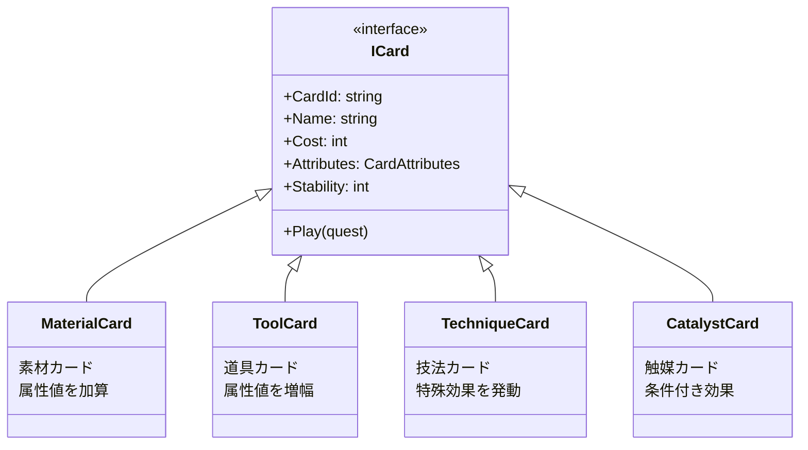
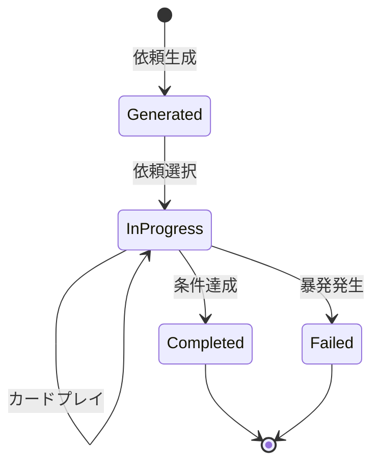
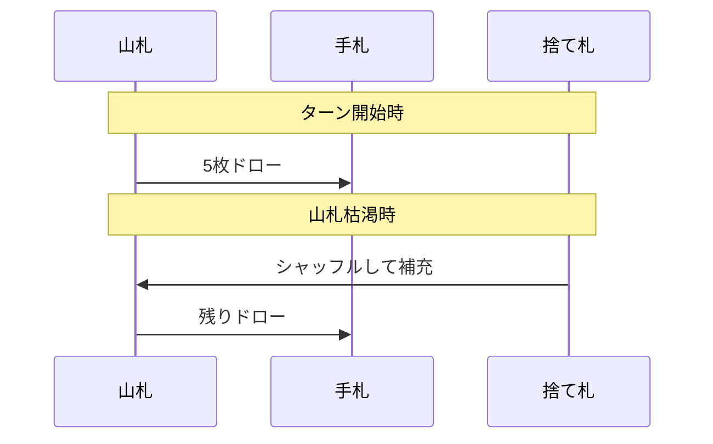

# コアシステム設計

## 概要

本ドキュメントは、ゲーム「アトリエ」のコアシステムの概要を提供するのだ。

**詳細設計参照**: [02-core-systems.md](../../spec/design/02-core-systems.md)

---

## コアシステム一覧

| システム | 責務 | 詳細設計 |
|---------|------|---------|
| カードシステム | カード操作・効果処理 | [02-core-systems.md](../../spec/design/02-core-systems.md) |
| 依頼システム | 依頼生成・進捗・達成判定 | [02-core-systems.md](../../spec/design/02-core-systems.md) |
| デッキ管理 | 山札・手札・捨て札管理 | [02-core-systems.md](../../spec/design/02-core-systems.md) |
| 暴発システム | 安定値判定・暴発処理 | [02-core-systems.md](../../spec/design/02-core-systems.md) |

---

## カードシステム

### カード属性

| 属性 | 説明 | カラー |
|------|------|-------|
| 火 (Fire) | 攻撃・熱系の属性 | #FF4500 |
| 水 (Water) | 回復・冷却系の属性 | #1E90FF |
| 地 (Earth) | 防御・安定系の属性 | #8B4513 |
| 風 (Wind) | 速度・補助系の属性 | #90EE90 |
| 毒 (Poison) | 特殊効果系の属性 | #9400D3 |
| 品質 (Quality) | 完成品の品質値 | - |

### カードタイプ



---

## 依頼システム

### 依頼状態遷移



### 依頼難易度

| 難易度 | 星 | 属性要求 | 報酬 |
|--------|------|---------|------|
| Very Easy | ★☆☆☆☆ | 単属性・低値 | 30G |
| Easy | ★★☆☆☆ | 単属性・中値 | 50G |
| Normal | ★★★☆☆ | 複属性・低値 | 80G |
| Hard | ★★★★☆ | 複属性・中値 | 120G |
| Very Hard | ★★★★★ | 複属性・高値 | 180G |

---

## デッキ管理

### デッキ構成

| エリア | 説明 |
|--------|------|
| 山札 (Deck) | ドロー待ちのカード |
| 手札 (Hand) | プレイ可能なカード |
| 捨て札 (Discard) | 使用済みカード |

### ドローフロー



---

## 暴発システム

### 暴発判定

```
安定値 < 0 → 暴発発生
```

### 暴発ペナルティ

| ペナルティ | 効果 |
|-----------|------|
| 依頼失敗 | 進捗中の依頼が失敗 |
| 名声減少 | 名声 -10 |
| ゴールド減少 | 現在所持金の10%減少 |

---

## 参照

- [02-core-systems.md](../../spec/design/02-core-systems.md) - コアシステムの詳細設計
- [game-mechanics.md](game-mechanics.md) - ゲームメカニクス設計

---

## 変更履歴

| 日付 | バージョン | 変更内容 |
|------|----------|---------|
| 2025-12-20 | 1.0 | 初版作成 |
