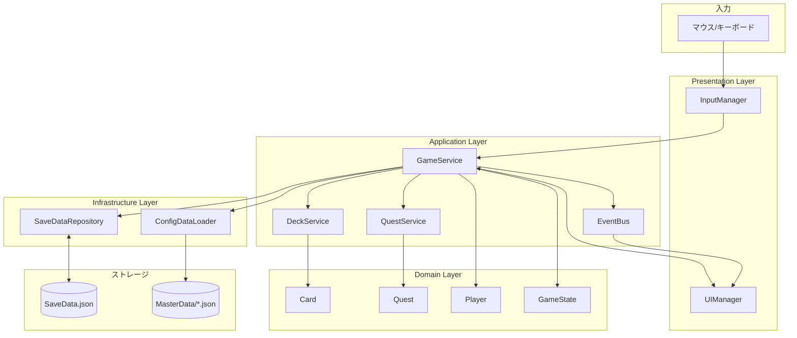
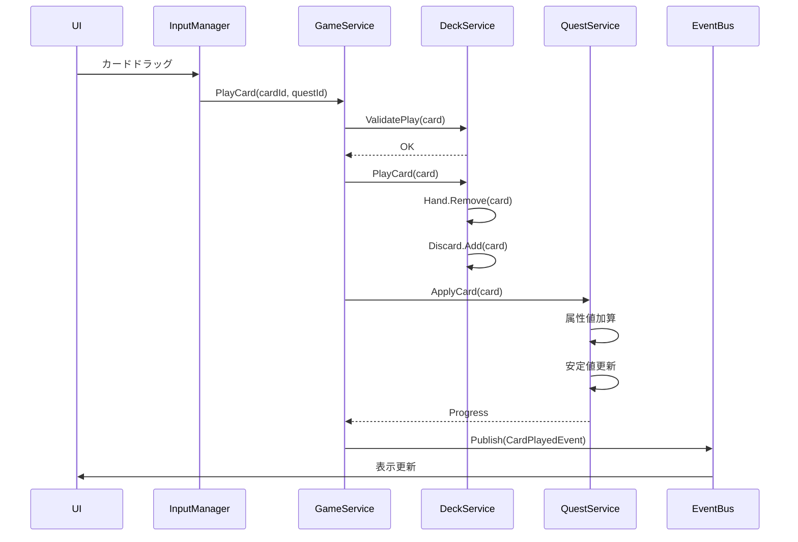
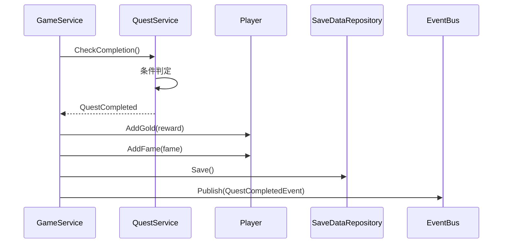
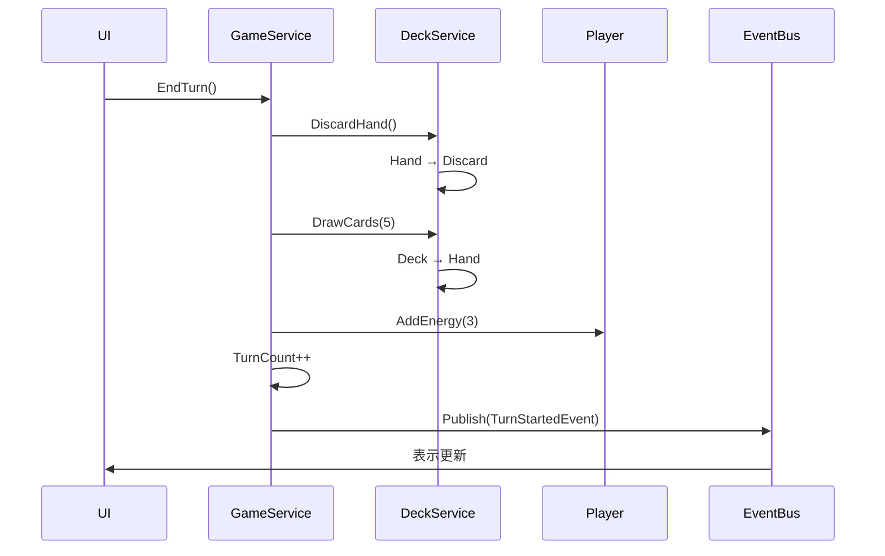
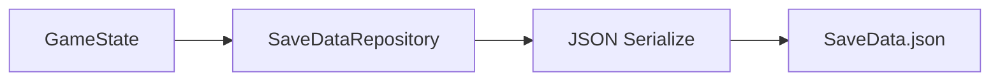
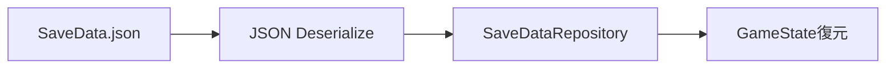
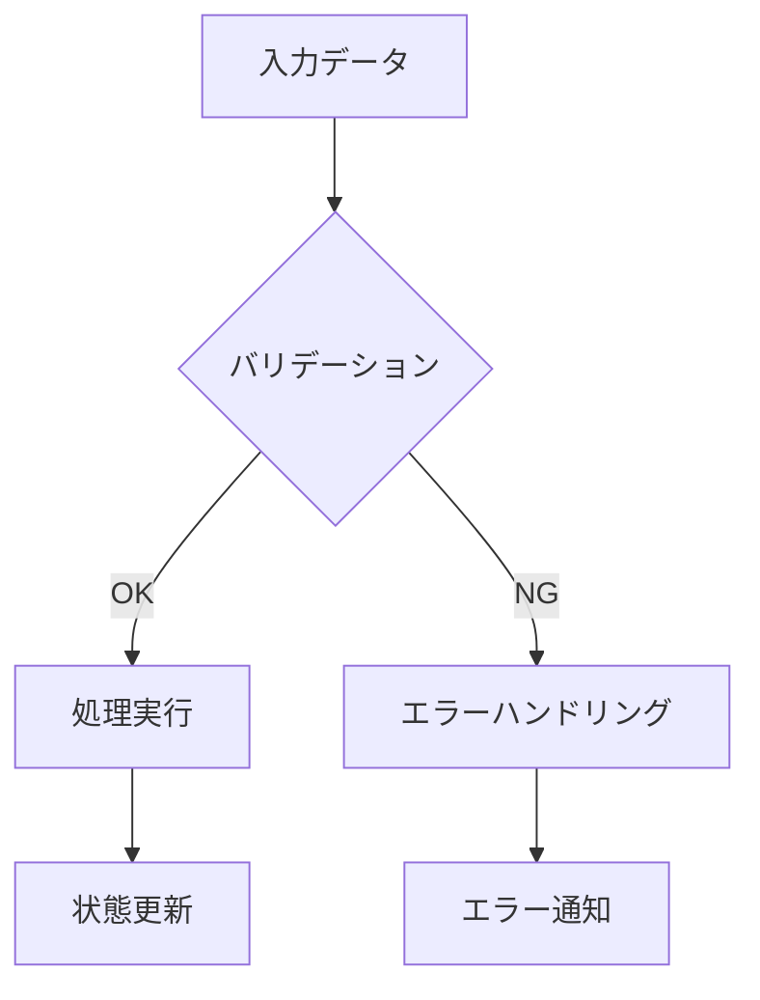

# データフロー設計

## 概要

本ドキュメントは、ゲーム「アトリエ」のデータフローを定義するのだ。

**関連設計参照**: [01-architecture.md](../../spec/design/01-architecture.md)

---

## 全体データフロー

---

## カードプレイデータフロー

---

## 依頼達成データフロー

---

## ターン進行データフロー

---

## セーブ/ロードデータフロー

### セーブ

### ロード

---

## イベント一覧

| イベント名 | 発行タイミング | 購読者 |
|-----------|---------------|--------|
| CardPlayedEvent | カードプレイ完了時 | UI, SoundManager |
| QuestCompletedEvent | 依頼達成時 | UI, SoundManager |
| TurnStartedEvent | ターン開始時 | UI |
| TurnEndedEvent | ターン終了時 | UI |
| ExplosionEvent | 暴発発生時 | UI, SoundManager |
| GameOverEvent | ゲーム終了時 | UI |

---

## データ検証フロー

### 検証項目

| 検証対象 | 検証内容 |
|---------|---------|
| カードプレイ | エネルギー足りるか |
| カードプレイ | 手札にあるか |
| 依頼選択 | 有効な依頼か |
| セーブデータ | スキーマ整合性 |
| マスターデータ | 必須フィールド存在 |

---

## 参照

- [01-architecture.md](../../spec/design/01-architecture.md) - システムアーキテクチャ
- [07-data-schema.md](../../spec/design/07-data-schema.md) - データスキーマ
- [08-infrastructure.md](../../spec/design/08-infrastructure.md) - インフラストラクチャ

---

## 変更履歴

| 日付 | バージョン | 変更内容 |
|------|----------|---------|
| 2025-12-20 | 1.0 | 初版作成 |
