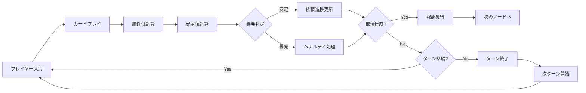
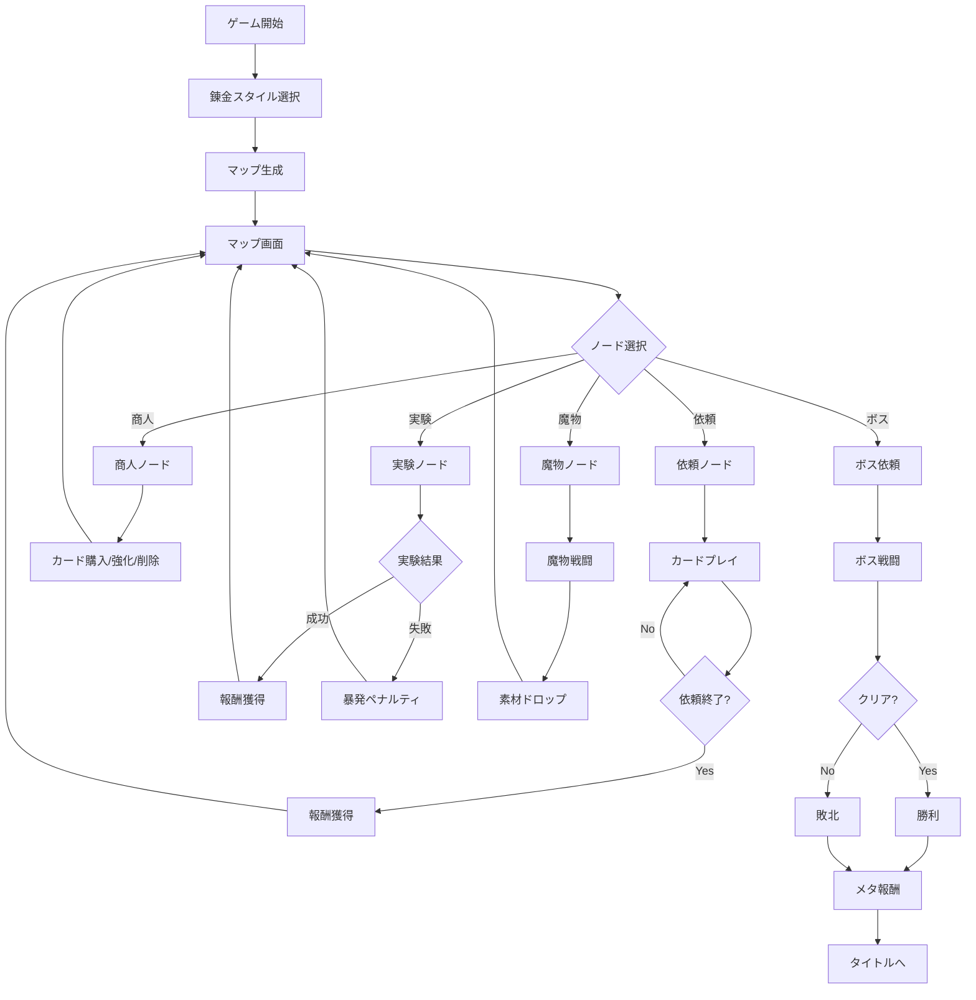
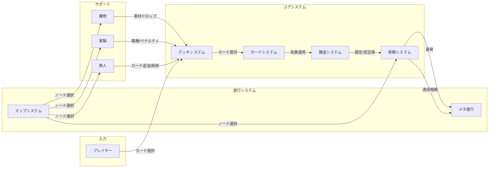

# ゲームメカニクス設計

## 概要

本ドキュメントは、錬金術×ローグライク×デッキ構築ゲーム「アトリエ」のゲームメカニクスを定義するのだ。

**関連要件**: REQ-014〜017, REQ-022〜028, REQ-029〜035

---

## コアゲームループ



---

## ゲーム目標

### メインゴール
🔵 **最終依頼（高難度レシピ制作）をクリアする** (REQ-017)

### サブゴール
- デッキを強化して戦略の幅を広げる
- メタ通貨（名声・知識ポイント）を獲得する
- アセンション難易度を上げて周回プレイする

---

## 基本的な遊び方

### ゲームフロー



### 1ターンの流れ

1. **ターン開始**
   - エネルギーを3獲得（最大10まで） 🔵 *ユーザーヒアリングより*
   - 手札が5枚になるまでドロー 🔵 *ユーザーヒアリングより*

2. **カードプレイ**
   - 手札からカードを選択
   - 対象の依頼を選択
   - エネルギーを消費してカードをプレイ
   - カードの効果を適用

3. **ターン終了**
   - 残った手札を捨て札へ（オプション）
   - 次のターンへ

---

## 勝利条件

| 条件名 | 説明 | 判定タイミング |
|--------|------|---------------|
| 🔵 最終依頼クリア | ボス依頼の条件を全て満たす | ボス依頼達成時 |
| 🟡 全依頼達成 | マップ上の全ての依頼を達成 | マップ完了時 |

---

## 敗北条件

| 条件名 | 説明 | 判定タイミング |
|--------|------|---------------|
| 🟡 名声ゼロ | 暴発により名声が0以下になる | 暴発発生時 |

※デッキ枯渇（山札と捨て札が両方0枚）は敗北条件に含めない（ユーザーヒアリングより）

---

## 計算式

### 属性値計算

🔵 **基本計算** (REQ-023)

```
依頼の現在属性値 = 依頼の現在属性値 + カードの属性値
```

```csharp
Progress.CurrentAttributes.Fire += Card.Attributes.Fire;
Progress.CurrentAttributes.Water += Card.Attributes.Water;
Progress.CurrentAttributes.Earth += Card.Attributes.Earth;
Progress.CurrentAttributes.Wind += Card.Attributes.Wind;
Progress.CurrentAttributes.Quality += Card.Attributes.Quality;
```

### 安定値計算

🔵 **安定値の加減算** (REQ-023)

```
依頼の現在安定値 = 依頼の現在安定値 + カードの安定値
```

```csharp
Progress.CurrentStability += Card.Stability;
```

### 暴発判定

🔵 **暴発条件** (REQ-033)

```
IF 依頼の現在安定値 < 0 THEN
    暴発発生
END IF
```

```csharp
if (Progress.CurrentStability < 0)
{
    TriggerExplosion();
}
```

### 暴発ペナルティ

🟡 **名声減少** (REQ-033-1)

```
名声 = 名声 - 1
```

🟡 **カードロスト** (REQ-033-2)

```
50%の確率で:
    デッキからランダムに1枚のカードを削除
```

### 依頼達成判定

🔵 **達成条件** (REQ-034)

```
IF 全ての必要属性を満たす AND 暴発していない THEN
    依頼達成
END IF
```

```csharp
public bool IsCompleted()
{
    return Requirements.IsMetBy(Progress.CurrentAttributes) &&
           !Progress.HasExploded;
}
```

### 属性条件判定

```csharp
public bool IsMetBy(CardAttributes current)
{
    return current.Fire >= RequiredAttributes.Fire &&
           current.Water >= RequiredAttributes.Water &&
           current.Earth >= RequiredAttributes.Earth &&
           current.Wind >= RequiredAttributes.Wind &&
           current.Quality >= MinQuality;
}
```

---

## エネルギーシステム

🔵 **エネルギー設計** (ユーザーヒアリングより確定)

| パラメータ | 値 | 説明 |
|-----------|-----|------|
| 初期エネルギー | 3 | ターン開始時の獲得量 |
| 最大エネルギー | 10 | 上限値 |
| 毎ターン獲得 | 3 | ターン開始時に加算 |

### エネルギー計算

```csharp
currentEnergy = Math.Min(currentEnergy + EnergyPerTurn, MaxEnergy);
```

---

## 手札システム

🔵 **手札設計** (ユーザーヒアリングより確定)

| パラメータ | 値 | 説明 |
|-----------|-----|------|
| 初期手札枚数 | 5 | ゲーム開始時 |
| 毎ターン補充 | 5枚まで | 不足分をドロー |

### 手札補充ロジック

```csharp
public void StartTurn()
{
    int cardsToDraw = HandSize - Hand.Count;
    DrawCards(cardsToDraw);
}
```

### デッキシャッフル

```csharp
// 山札が空の場合、捨て札をシャッフルして山札に戻す
if (DrawPile.Count == 0)
{
    DrawPile.AddRange(DiscardPile);
    DiscardPile.Clear();
    Shuffle();
}
```

---

## ゲームシステム相互作用



---

## 依頼（戦闘）システム詳細

### 同時進行依頼

🔵 **最大3件** (REQ-029)

```csharp
private const int MaxActiveQuests = 3;
```

### 依頼難易度

🔵 **1〜5星** (REQ-031)

| 難易度 | 星 | 必要属性値目安 | 報酬倍率 |
|--------|-----|---------------|---------|
| 簡単 | ⭐ | 5〜10 | x1 |
| 普通 | ⭐⭐ | 10〜20 | x1.5 |
| 難しい | ⭐⭐⭐ | 20〜35 | x2 |
| 高難度 | ⭐⭐⭐⭐ | 35〜50 | x2.5 |
| 最高難度 | ⭐⭐⭐⭐⭐ | 50+ | x3 |

---

## アンドゥシステム

🔵 **カード操作のアンドゥ** (REQ-047-1)

- Ctrl+Z でカードプレイを取り消し可能
- 最大50手まで履歴保持
- 暴発発生後はアンドゥ不可

```csharp
public void Undo()
{
    if (CanUndo)
    {
        var command = undoStack.Pop();
        command.Undo();
        redoStack.Push(command);
    }
}
```

---

## 変更履歴

| 日付 | バージョン | 変更内容 |
|------|----------|---------|
| 2025-12-20 | 1.0 | 初版作成 |
